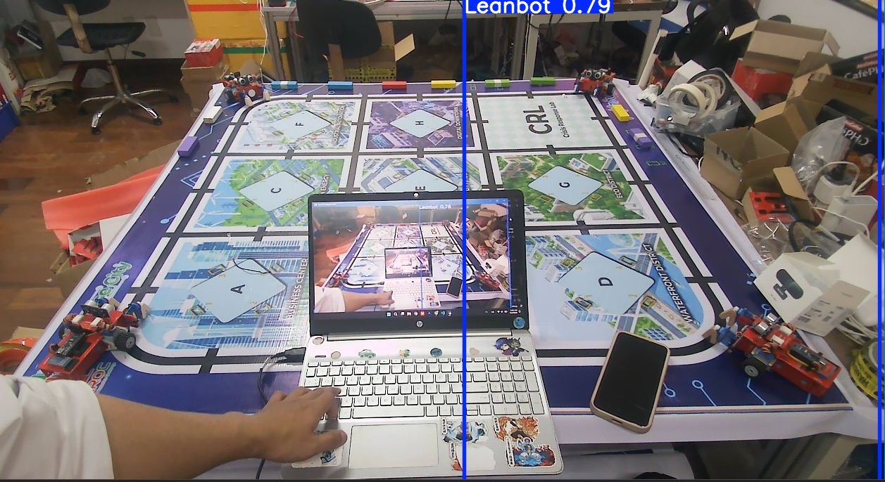
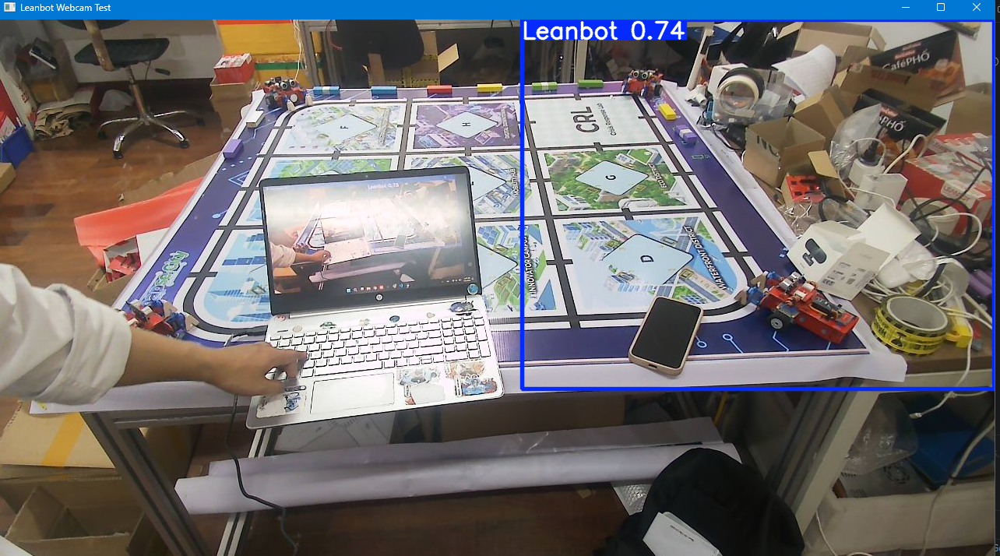
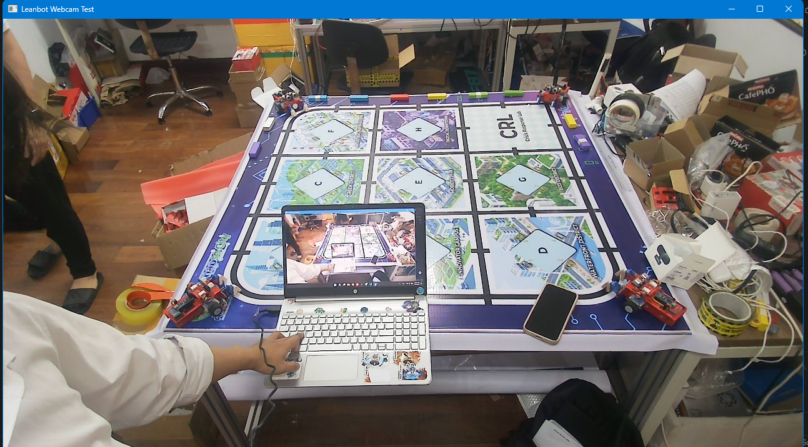
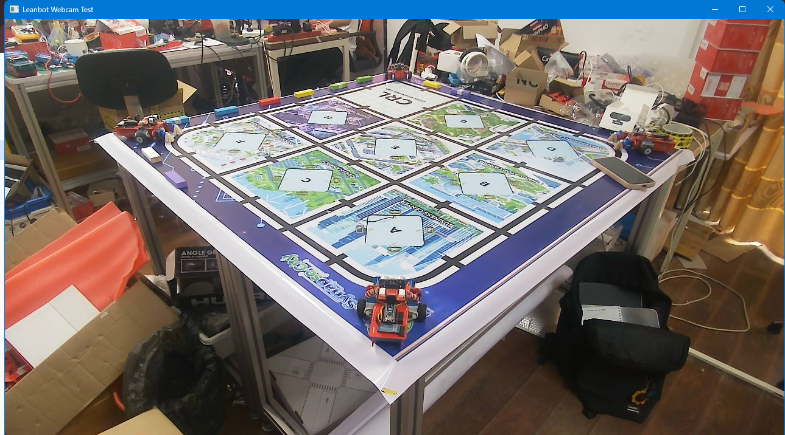
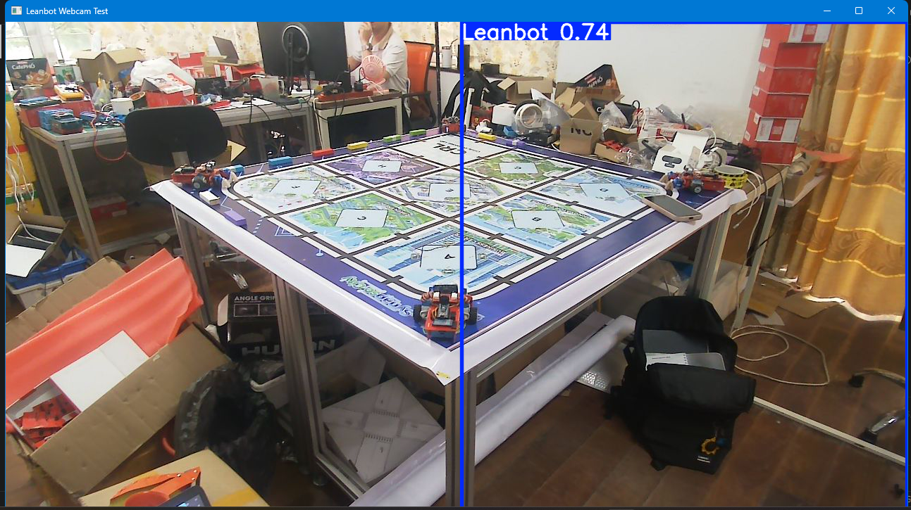
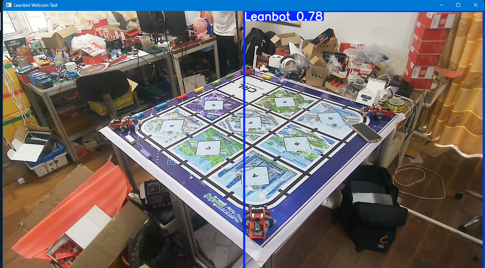
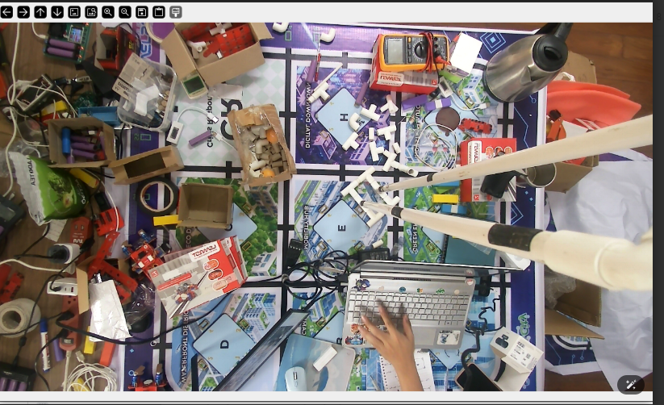

# Báo cáo công việc ngày 2/4/2026
## A. Công việc đã làm
- Nhận tài khoản PyGit từ anh Hữu và setup để viết báo cáo.
- Khảo sát và đưa ra chiều cao của camera so với sa bàn trong các trường hợp ( giá trị tương đối) để thỏa mãn các yêu cầu sau :
    - Độ cao camera tương đối thấp, không quá cao so với sa bàn
    - Cách xa sa bàn 1 khoảng để có thể nhìn toàn bộ map và khoảng không gian bao quanh khoảng 10-20cm so với biên trên của Sa bàn
- Đặt 4 Leanbot ở 4 góc, hướng vào giữa để tham khảo kích thước, góc nhìn Leanbot trên ảnh camera và đưa ra phương án tối ưu.

### 1. Khảo sát vị trí đặt Camera
- Hiện tại em chỉ đang khảo sát vị trí đặt Camera, còn góc chiếu của camera thì em sẽ tùy chỉnh sao cho sa bàn của giữa khung hình. Vì chưa có giá gắn camera, nên khoảng cách sẽ chỉ ở mức đo đạc tương đối ạ.  
#### 1.1. Camera đặt ở đường trung trực của 1 cạnh sa bàn 
##### a. Camera cách sa bàn 0,5m , chiều cao 0,5m so với bề mặt sa bàn
 
##### b. Camera cách Sa bàn 1m , chiều cao 0,5m so với bề mặt sa bàn 

##### c. Camera cách Sa bàn 1m, chiều cao 1m so với sa bàn 

###### Ưu điểm
- Hình ảnh thu về cân đối, đối xứng, thuận tiện cho xử lí ảnh và tính toán hình học.
- Thiết kế cơ khí đơn giản, gọn hơn so với phương án đặt camera ở giữa sa bàn.
###### Nhược điểm
- Hình ảnh sa bàn sẽ hơi bị nghiêng, tuy nhiên vấn đề này vẫn có thể xử lí được bằng phần mềm.
#### 1.2. Camera đặt ở góc chéo của sa bàn
##### a. Camera cách sa bàn 0,5m , chiều cao 0,5m so với bề mặt sa bàn 

##### b. Camera cách Sa bàn 1m , chiều cao 0,5m so với bề mặt sa bàn 

##### c. Camera cách Sa bàn 1m, chiều cao 1m so với sa bàn 

###### Ưu điểm
- Hiện tại em chưa thấy phương án này có ưu điểm nổi bật so với hai phương án còn lại.
###### Nhược điểm
- Hình ảnh thu về là hướng chéo của sa bàn.
- Ảnh cũng bị nghiêng tương tự trường hợp đặt camera ở cạnh sa bàn.
- Cần đặt camera cao hơn hẳn so với hai trường hợp còn lại vì đường chéo của sa bàn dài hơn nên cần góc nhìn rộng hơn.
#### 1.3. Camera đặt phía trên sa bàn. 
##### a. Camera cách sa bàn 1,4m

###### Ưu điểm
- Hình ảnh thu về cân đối, đối xứng, thuận tiện cho xử lí ảnh và tính toán hình học.
###### Nhược điểm
- Cần có bộ khung cơ khí để cố định camera ở giữa ngay phía trên trọng tâm sa bàn.
- Phương án này phức tạp hơn và cồng kềnh hơn về mặt cơ khí so với hai phương án còn lại.

#### 1.4. Nhận xét chung
- Nếu đặt camera càng xa sa bàn mà không thay đổi góc chiếu thì cần tăng chiều cao đặt camera để lấy được góc rộng đủ bao quát toàn bộ sa bàn.
- Nếu không tăng chiều cao mà kéo góc chiếu của camera lên để lấy đủ góc rộng, ảnh thu về sẽ bị nghiêng hơn, dẫn tới việc xử lý ảnh có thể khó khăn hơn.

## B. Khó khăn 
