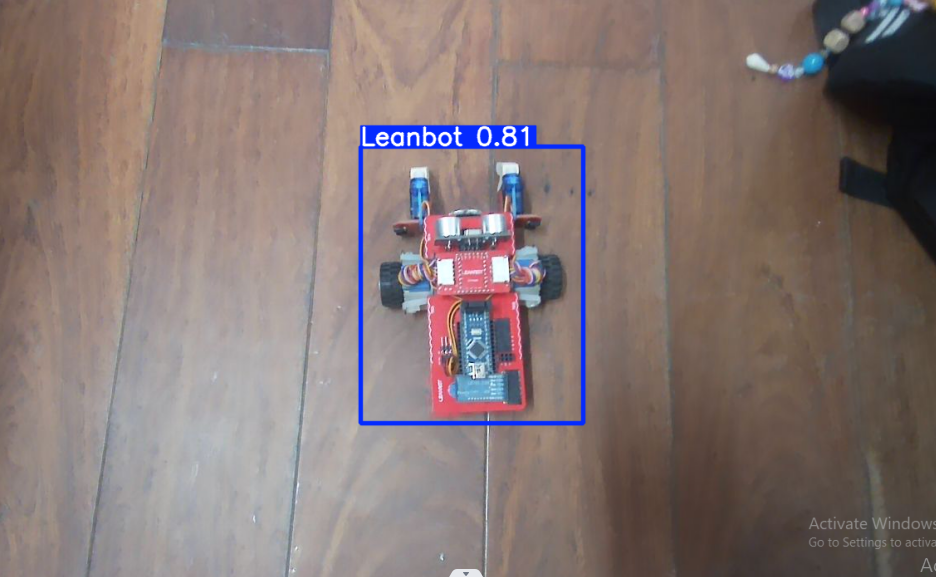
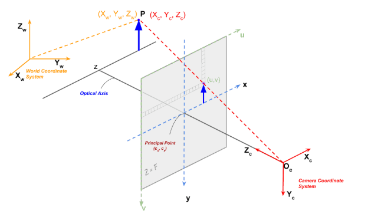
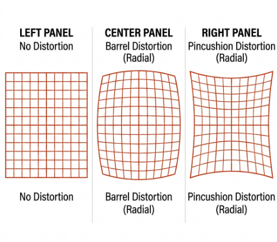
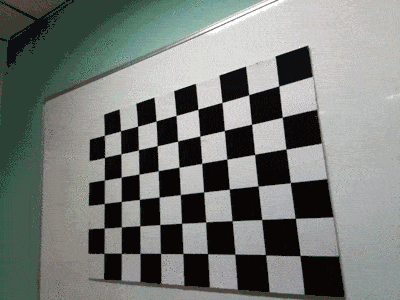
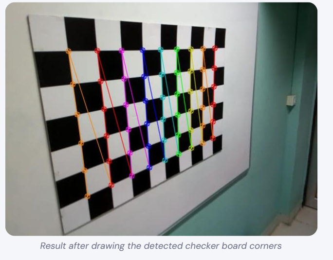
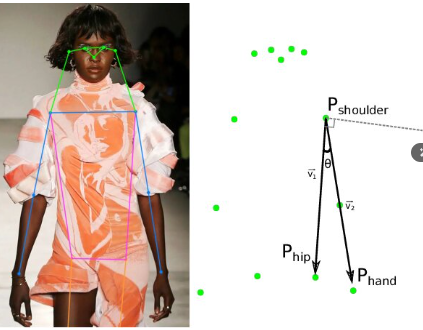

# Báo cáo công việc ngày 03/04/2026
## A. Công việc đã làm
- Chạy thử chương trình sử dụng OpenCV và YOLO để kiểm thử Camera
- Tìm hiểu Calibration sa bàn cho Cam với OpenCV

**Mục lục:**
- [1. Kiểm thử Camera](#1-kiểm-thử-camera)
- [2. Calibration Sa bàn cho Camera bằng OpenCV](#2-calibration-sa-bàn-cho-camera-bằng-opencv)
  - [2.1. Cơ sở lý thuyết](#21-cơ-sở-lý-thuyết)
    - [2.1.1. Hình học tạo ảnh và phép biến đổi phối cảnh](#211-hình-học-tạo-ảnh-và-phép-biến-đổi-phối-cảnh-geometry-of-image-formation)
      - [a. Ba hệ tọa độ và Ma trận ngoại tham số](#a-ba-hệ-tọa-độ-và-ma-trận-ngoại-tham-số-extrinsic-matrix)
      - [b. Mô hình Camera lỗ kim và Ma trận nội tham số](#b-mô-hình-camera-lỗ-kim-pinhole-camera-model-và-ma-trận-nội-tham-số-intrinsic-matrix-k)
      - [c. Phương trình chiếu tổng hợp](#c-phương-trình-chiếu-tổng-hợp-3d-thế-giới--2d-pixel)
    - [2.1.2. Camera Calibration](#212-camera-calibration-hiệu-chỉnh-camera)
      - [a. Méo ống kính](#a-méo-ống-kính-lens-distortion)
      - [b. Mục tiêu của Camera Calibration](#b-mục-tiêu-của-camera-calibration)
      - [c. Phương pháp Checkerboard](#c-phương-pháp-calibration-bằng-bàn-cờ-checkerboard-pattern)
      - [d. Ứng dụng kết quả Calibration](#d-ứng-dụng-kết-quả-calibration)

### 1. Kiểm thử Camera

- Trước đó em đã triển khai và huấn luận model Yolo_object_detection để nhận biết Leanbot và OpenCV để vẽ đường bao xuang quanh Leanbot trên khung hình trong bài báo cáo trước đó tại Lab, tuy nhiên trước đó em sử dụng Cam máy tính. Hiện tại em đã kiểm thử trên Cam mới và cho kết quả như sau: 



- Link Code test : [Leanbot_detection](https://git.pythaverse.space/thomha/Nguyen_Huu_Hoang_Anh/tree/master/260403/Leanbot_detection)


### 2. Calibration Sa bàn cho Camera bằng OpenCV
#### 2.1. Cơ sở lý thuyết 
- Calibration là quá trình xác định các tham số nội tại (intrinsic parameters) và ngoại tại (extrinsic parameters) của camera. Điều này dựa trên cơ sở lý thuyết về hình học tạo ảnh, phép biến đổi phối cảnh (perspective transformation) và mô hình camera lỗ kim (pinhole camera model) trong thị giác máy tính để tính toán mối quan hệ giữa tọa độ điểm trong không gian 3D và tọa độ điểm trên ảnh 2D của Cam. 

##### 2.1.1. Hình học tạo ảnh và phép biến đổi phối cảnh (Geometry of Image Formation)

Trong thị giác máy tính, để hiểu được cách một điểm trong không gian 3D thực tế được chiếu thành một pixel trên ảnh 2D, ta cần nắm rõ **ba hệ tọa độ** và **hai phép biến đổi** giữa chúng.

###### a. Ba hệ tọa độ và Ma trận ngoại tham số (Extrinsic Matrix)

Quá trình tạo ảnh liên quan đến ba hệ tọa độ:

- **Hệ tọa độ Môi trường (World Coordinate System):** Là hệ tọa độ gắn với không gian thực tế, ví dụ gốc tọa độ đặt tại một góc của sa bàn. Mỗi điểm P trong không gian được biểu diễn bởi (Xw, Yw, Zw). Ta tự quy ước trục X, Y nằm trên mặt phẳng sa bàn và trục Z hướng lên trên.

- **Hệ tọa độ Camera (Camera Coordinate System):** Là hệ tọa độ gắn với camera, gốc tọa độ tại tâm quang học (optical center) của ống kính. Trục Z hướng theo hướng camera nhìn, trục X và Y nằm trên mặt phẳng sensor. Cùng một điểm P, khi nhìn từ camera sẽ có tọa độ khác: (Xc, Yc, Zc).

- **Hệ tọa độ Ảnh (Image Coordinate System):** Là hệ tọa độ 2D trên ảnh, gốc tọa độ ở góc trên-trái. Mỗi pixel có vị trí (u, v) tính bằng đơn vị pixel.

Vì camera có thể đặt ở bất kỳ đâu và quay theo bất kỳ hướng nào, ta cần chuyển đổi tọa độ từ hệ Môi trường sang hệ Camera. Phép chuyển đổi này được mô tả bởi **Ma trận ngoại tham số (Extrinsic Matrix)**:

```
┌    ┐                ┌    ┐
│ Xc │                │ Xw │
│ Yc │ = [R | t]  ×   │ Yw │
│ Zc │   (3×4)        │ Zw │
└    ┘                │  1 │
                      └    ┘
```

Trong đó:
- **R** là ma trận xoay (Rotation Matrix) kích thước 3×3, mô tả hướng quay của camera so với môi trường. Mặc dù có 9 phần tử nhưng R chỉ có 3 bậc tự do (tương đương yaw, pitch, roll).
- **t** là vector tịnh tiến (Translation Vector) kích thước 3×1, mô tả vị trí của camera trong hệ tọa độ môi trường.
- **[R | t]** là ma trận 3×4 được ghép từ R và t, gọi là **Extrinsic Matrix** — chứa 6 tham số ngoại tại (3 xoay + 3 tịnh tiến).

###### b. Mô hình Camera lỗ kim (Pinhole Camera Model) và Ma trận nội tham số (Intrinsic Matrix K)

Sau khi có tọa độ điểm trong hệ Camera (Xc, Yc, Zc), bước tiếp theo là chiếu điểm đó xuống mặt phẳng ảnh 2D. Mô hình đơn giản nhất mô tả quá trình này là **Pinhole Camera** (camera lỗ kim):

Ánh sáng từ điểm P trong không gian đi qua một lỗ nhỏ (tâm quang học) và tạo thành ảnh trên sensor phía sau. Áp dụng **phép tam giác đồng dạng**, ta có:

```
x = f × (Xc / Zc)
y = f × (Yc / Zc)
```

Trong đó **f** là tiêu cự (focal length) — khoảng cách từ tâm quang học đến mặt phẳng sensor, **Zc** là khoảng cách từ điểm P đến camera.



Tuy nhiên, camera thực tế không lý tưởng. Pixel trên sensor có thể không vuông (tiêu cự khác nhau theo 2 trục: fx ≠ fy), và tâm quang học (cx, cy) thường không trùng chính xác tâm ảnh. Các tham số này được gộp vào **Ma trận nội tham số (Intrinsic Matrix K)**:

```
        ┌  fx   0   cx  ┐
  K  =  │   0  fy   cy  │
        │   0   0    1  │
        └               ┘
```

Trong đó:
- **fx, fy:** tiêu cự tính theo đơn vị pixel (theo trục ngang và dọc). 
- **cx, cy:** tọa độ pixel của tâm quang học (thường gần tâm ảnh).
- Ma trận K chứa **4 tham số nội tại** — là đặc trưng cố định của camera, không thay đổi dù camera đặt ở đâu.

###### c. Phương trình chiếu tổng hợp: 3D Môi trường → 2D Pixel

Kết hợp cả hai phép biến đổi trên, ta có phương trình tổng hợp chiếu một điểm 3D trong môi trường thực thành tọa độ pixel trên ảnh:

```
┌ u' ┐                        ┌ Xw ┐
│ v' │ = K    ×   [R | t]  ×  │ Yw │
│ w' │  (3×3)      (3×4)      │ Zw │
└    ┘                        │  1 │
                              └    ┘

Tọa độ pixel: u = u'/w',  v = v'/w'
```

Tóm lại, theo ý em phân tích từ bài viết thì quá trình chiếu một điểm từ 3D sang 2D gồm 2 bước: 
- Dùng Extrinsic Matrix [R|t] để chuyển từ hệ Môi trường sang hệ Camera, 
- Dùng Intrinsic Matrix K để chiếu từ 3D Camera xuống 2D Pixel.

##### 2.1.2. Camera Calibration (Hiệu chỉnh Camera)

Camera Calibration là quá trình tìm ra ma trận nội tham số K và hệ số méo ống kính từ một tập ảnh mẫu. Sau khi calibrate, ta có thể khử méo ảnh và thực hiện các phép đo chính xác trên ảnh.

###### a. Méo ống kính (Lens Distortion)

Trong thực tế, ống kính camera không hoàn hảo như mô hình Pinhole. Ánh sáng khi đi qua ống kính bị bẻ cong, gây ra hiện tượng **méo ảnh** tức là các đường thẳng trong thực tế bị hiển thị cong trên ảnh. Có 2 loại méo chính:

- **Méo xuyên tâm (Radial Distortion):** Gây ra bởi hình dạng ống kính. Ảnh bị méo dạng hình thùng (barrel — phình ra ngoài) hoặc hình gối (pincushion — co vào trong), đặc biệt rõ ở vùng rìa ảnh. Được mô tả bởi hệ số **k1, k2, k3**.



- **Méo tiếp tuyến (Tangential Distortion):** Xảy ra khi ống kính không song song hoàn toàn với mặt phẳng sensor, khiến ảnh bị lệch nhẹ. Được mô tả bởi hệ số **p1, p2**.

OpenCV sử dụng **5 hệ số méo**: **(k1, k2, p1, p2, k3)** để mô hình hóa độ méo của ống kính.

###### b. Mục tiêu của Camera Calibration

Mục tiêu của Calibration là tìm ra ma trận K và 5 hệ số méo từ một tập ảnh mẫu:

- **Đầu vào:** Nhiều ảnh chụp một mẫu hình có kích thước đã biết (thường là checkerboard) từ nhiều góc nhìn khác nhau. Với mỗi ảnh, ta biết tọa độ 3D thực của các điểm trên mẫu và tìm được tọa độ pixel 2D tương ứng.



- **Đầu ra:**
  - **Camera Matrix K** (3×3): chứa fx, fy, cx, cy
  - **Distortion Coefficients** (5 hệ số): k1, k2, p1, p2, k3
  - **rvecs, tvecs:** vector xoay và tịnh tiến cho mỗi ảnh (vị trí tương đối giữa camera và mẫu)
- **Sai số chiếu lại (Re-projection Error):** Đại lượng đánh giá chất lượng calibration — chiếu ngược các điểm 3D về 2D dùng kết quả calibration, rồi so với vị trí pixel thực tế. Sai số < 0.5 pixel được coi là tốt.

###### c. Phương pháp Calibration bằng bàn cờ (Checkerboard Pattern)

Checkerboard (bàn cờ đen-trắng) là mẫu hình phổ biến nhất cho calibration vì: tương phản đen-trắng rõ ràng giúp dễ phát hiện, các giao điểm (corners) có gradient sắc nét theo 2 chiều giúp định vị với độ chính xác sub-pixel, và tọa độ 3D của các corners được biết trước nhờ kích thước ô đều nhau.

**Quy trình 4 bước:**
1. **Xác định tọa độ 3D:** Gắn hệ tọa độ vào checkerboard, Z=0 cho mọi điểm (vì nằm phẳng), X và Y là bội số của kích thước ô vuông.
2. **Chụp nhiều ảnh:** Chụp 15-25 ảnh checkerboard từ nhiều góc, vị trí, khoảng cách khác nhau.
3. **Tìm corners 2D:** Dùng `cv2.findChessboardCorners()` để tìm corners thô, sau đó tinh chỉnh đến độ chính xác sub-pixel bằng `cv2.cornerSubPix()`.



4. **Calibrate:** Truyền danh sách tọa độ 3D và 2D vào `cv2.calibrateCamera()` để tính K, hệ số méo, và rvecs/tvecs.

###### d. Ứng dụng kết quả Calibration

Sau khi có kết quả calibration là file calibration_result.npz là ma trận chứa các nội tham số và hệ số méo của camera, ta áp dụng vào 2 việc chính:

- **Khử méo ảnh (Undistort):** Dùng `cv2.undistort()` với Camera Matrix và Distortion Coefficients để sửa méo — các đường thẳng trong thực tế sẽ hiển thị thẳng trên ảnh.
- **Phép biến đổi phối cảnh (Perspective Transform):** Sau khi ảnh đã khử méo, chọn 4 góc sa bàn trên ảnh và ánh xạ về tọa độ thực (mm) bằng `cv2.getPerspectiveTransform()`, cho phép chuyển đổi bất kỳ điểm pixel nào thành tọa độ thực trên sa bàn.

## B. Khó khăn
- Theo như bài viết về Calibration Camera bằng OpenCV thì người ta khuyến nghị nên sử dụng sa bàn có các ô Caro trắng đen thì sẽ hiệu quả hơn cho OpenCV phát hiện các góc của sa bàn. Tuy nhiên hiện tại không có loại Sa bàn này, em có cần triển khai luôn trên Sa bàn hiện tại của Leanbot không ạ ? 
- Hiện tại em có tìm hiểu được phương pháp nhận diện Leanbot mới : Yolo_pose fine tuning . Về tư tưởng thì sẽ huấn luyện model nhận biết được các điểm đặc trưng trên Leanbot nhưu 2 cánh tay servo, 2 bánh xe, 2 góc đuôi,... từ đó khi phát hiện được leanbot có thể dựa vào chiều của các vector nối các điểm để biết hướng xuay của leanbot trải dài trên 0 - 360 độ. So với phương pháp trước đó em chỉ fine tuning lại Yolo_object_detection thì chi nhận diện được leanbot nằm ở đâu trên frame ảnh như em đã chạy kiểm thử ở mục A trong báo cáo.
- Hình ảnh minh họa mô tả cho phương pháp Yolo_pose :



Hiện tại Yolo_pose mặc định sẽ nhận biết các keypoit của người, như trên hình ta có thể phân tích được góc giữa các vector cánh tay và thân. 