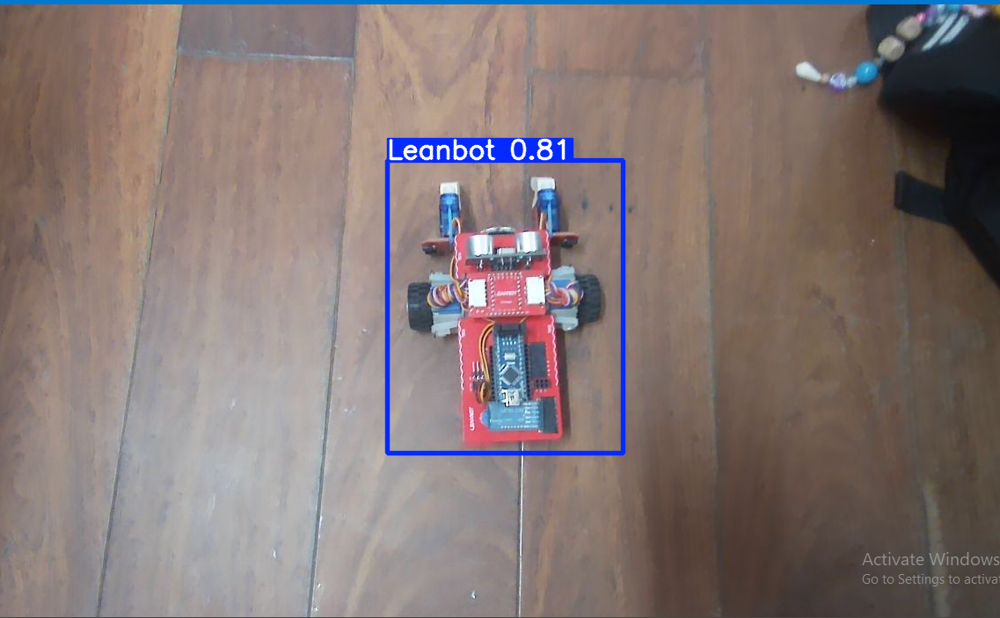

# Báo cáo công việc ngày 03/04/2026
## A. Công việc đã làm
- Chạy thử chương trình sử dụng OpenCV và YOLO để kiểm thử Camera
- Tìm hiểu và chạy thử Calibration sa bàn cho Cam với OpenCV
### 1. Kiểm thử Camera
- Trước đó em đã triển khai và huấn luận model Yolo_object_detection để nhận biết Leanbot và OpenCV để vẽ đường bao xuang quanh Leanbot trên khung hình trong bài báo cáo trước đó tại Lab, tuy nhiên trước đó em sử dụng Cam máy tính. Hiện tại em đã kiểm thử trên Cam mới và cho kết quả như sau: 

### 2. Calibration Sa bàn cho Camera bằng OpenCV
#### 2.1. Cơ sở lý thuyết 
#### 2.2 Triển khai thực tế
## B. Khó khăn
- Hiện tại em có tìm hiểu được phương pháp nhận diện Leanbot mới : Yolo_pose fine tuning . Về tư tưởng thì sẽ huấn luyện model nhận biết được các điểm đặc trưng trên Leanbot nhưu 2 cánh tay servo, 2 bánh xe, 2 góc đuôi,... từ đó khi phát hiện được leanbot có thể dựa vào chiều của các vector nối các điểm để biết hướng xuay của leanbot trải dài trên 0 - 360 độ. So với phương pháp trước đó em chỉ fine tuning lại Yolo_object_detection thì chi nhận diện được leanbot nằm ở đâu trên frame ảnh như em đã chạy kiểm thử ở mục A trong báo cáo.
- Hình ảnh minh họa mô tả cho phương pháp Yolo_pose :

Hiện tại Yolo_pose mặc định sẽ nhận biết các keypoit của người, như trên hình ta có thể phân tích được góc giữa các vector cánh tay và thân. 