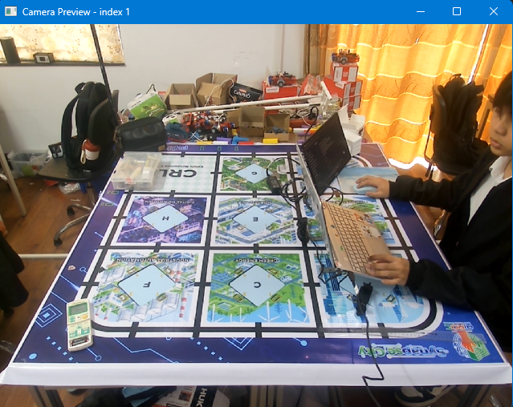
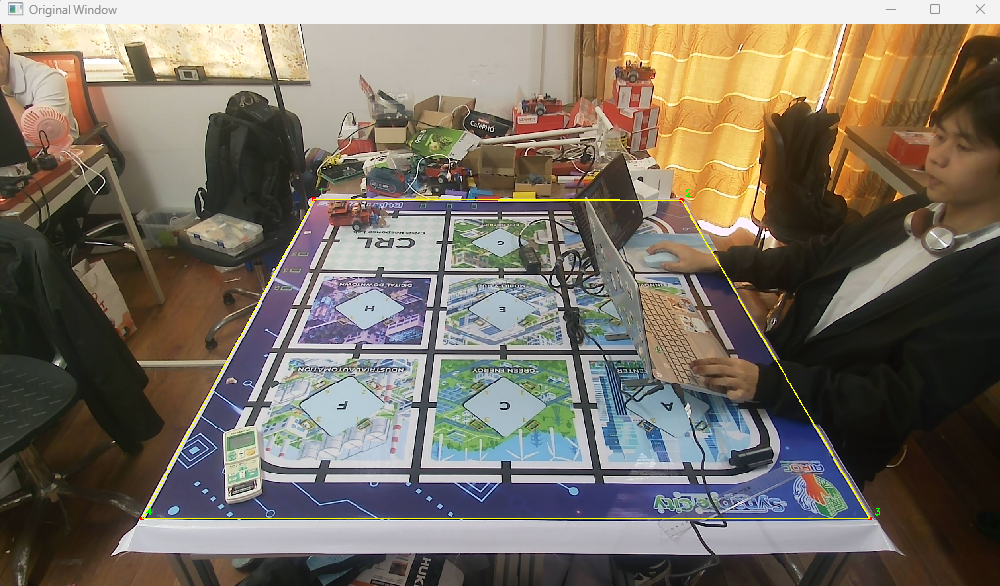
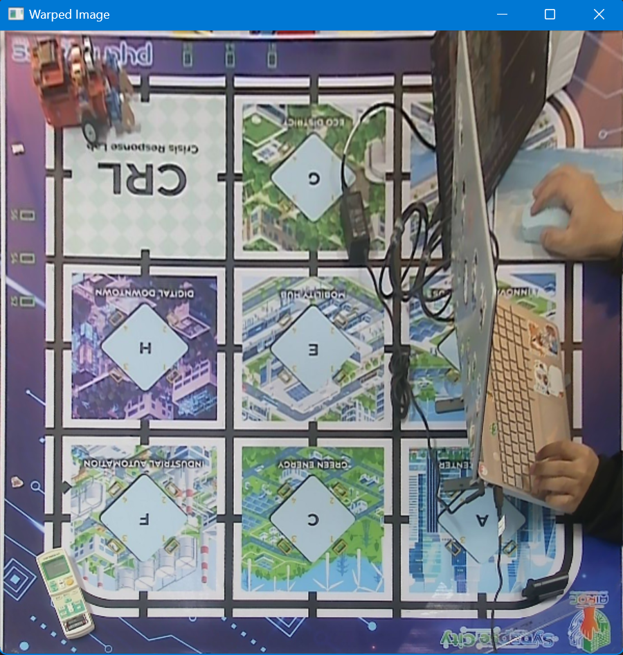

# Báo cáo công việc ngày 06/04/2026
## A. Công việc đã làm
- Nhận Tripod từ anh Hữu.
- Tìm hiểu cách lấy thông tin của Cam và configure Cam bằng OpenCV.
- Tìm hiểu cách kéo ảnh sa bàn từ hướng chéo về thẳng bằng OpenCV.
## Mục lục
- [A. Công việc đã làm](#a-công-việc-đã-làm)
  - [1. Chi tiết thông tin Tripod khi sử dụng](#1-chi-tiết-thông-tin-tripod-khi-sử-dụng)
  - [2. Cách lấy thông tin Cam và Configure Cam bằng OpenCV](#2-cách-lấy-thông-tin-cam-và-configure-cam-bằng-opencv)
  - [3. Kéo ảnh Sa bàn về góc phẳng khi Cam đặt chéo](#3-kéo-ảnh-sa-bàn-về-góc-phẳng-khi-cam-đặt-chéo)
    - [3.1. Bài toán đặt ra và cơ sở lý thuyết](#31-bài-toán-đặt-ra-và-cơ-sở-lý-thuyết)
    - [3.2. Code tham khảo tích hợp Khử méo (Undistort) và Nắn phẳng (Warping)](#32-code-tham-khảo-tích-hợp-khử-méo-undistort-và-nắn-phẳng-warping)
    - [3.3. Kết quả thực tế và Đánh giá nhược điểm](#33-kết-quả-thực-tế-và-đánh-giá-nhược-điểm)
- [B. Khó khăn](#b-khó-khăn)
### 1. Chi tiết thông tin Tripod khi sử dụng 
- Tripod có chiều cao tối đa 1.7m, khi sử dụng thì chiều sao vị trí đặt Cam so với mặt phẳng sa bàn là 0.9m. Hình ảnh chụp từ Cam ở vị trí cách Sa bàn 0,5m, cao 0.9m và góc chiếu của Cam so với mặt phẳng sa bàn khoảng 45 độ như sau : 

    

### 2. Cách lấy thông tin Cam và Configure Cam bằng OpenCV
- Theo tài liệu của OpenCV thì có thể lấy được nhiều thông tin của Cam như FPS, chiều dài, rộng của Frame ảnh,... tuy nhiên việc lấy thông tin này được thực hiện bằng hàm **cv::VideoCapture.get()** và đọc dữ liệu Cam thông qua hệ điều hành, driver camera, kết nối USB, ... nên dữ liệu trả về có thể không đúng chính xác hoàn toàn so với thông số của nhà sản xuất công bố. Ngoài ra OpenCV có thể quét rất nhiều thông tin, tuy nhiên sẽ tùy loại Cam mà thông tin đó có được lấy ra hay không, do đó em đã viết chương trình test, và in ra những thông tin nào có trả về dữ liệu bằng **infor_print.py** và sau đó thử chỉnh sửa các thông số đó bằng **config_check.py** xem có thể tùy chỉnh các thông số đó không. 
- Các thông tin có thể in ra được như sau:
    - **Nhóm thông tin stream / format**:
        - **CAP_PROP_FRAME_WIDTH = 640**: Độ rộng của khung hình camera, ở đây là 640 pixel.
        - **CAP_PROP_FRAME_HEIGHT = 480**: Độ cao của khung hình camera, ở đây là 480 pixel.
        - **CAP_PROP_FPS = 30**: Số khung hình camera ghi nhận trong 1 giây.
        - **CAP_PROP_FOURCC = 22**: Mã định dạng dữ liệu hình ảnh hoặc video mà camera/backend đang sử dụng.
        - **CAP_PROP_MODE = 1**: Chế độ hoạt động hiện tại của camera, giá trị cụ thể phụ thuộc driver hoặc backend.
        - **CAP_PROP_CONVERT_RGB = 1**: Cho biết ảnh đầu ra được chuyển sang định dạng màu để OpenCV xử lý.
        - **CAP_PROP_BUFFERSIZE = 1**: Kích thước bộ đệm frame, giúp giảm độ trễ khi đọc ảnh từ camera.
        - **CAP_PROP_BACKEND = 1400**: Backend mà OpenCV đang dùng để kết nối và giao tiếp với camera.

    - **Nhóm thông số ảnh / camera**

        - **CAP_PROP_BRIGHTNESS = 128**: Điều chỉnh độ sáng tổng thể của hình ảnh.
        - **CAP_PROP_CONTRAST = 128**: Điều chỉnh độ chênh lệch giữa vùng sáng và vùng tối.
        - **CAP_PROP_SATURATION = 128**: Điều chỉnh độ đậm nhạt của màu sắc trong ảnh.
        - **CAP_PROP_HUE = 128**: Điều chỉnh tông màu tổng thể của hình ảnh.
        - **CAP_PROP_GAIN = 255**: Mức khuếch đại tín hiệu của cảm biến camera.
        - **CAP_PROP_EXPOSURE = -2**: Mức phơi sáng của camera khi ghi nhận hình ảnh.
        - **CAP_PROP_SHARPNESS = 128**: Độ sắc nét của các chi tiết trong ảnh.
        - **CAP_PROP_TEMPERATURE = 417**: Nhiệt độ màu, thường liên quan đến cân bằng trắng của ảnh.
        - **CAP_PROP_BACKLIGHT = 4**: Mức bù sáng nền khi chụp trong điều kiện ngược sáng.
        - **CAP_PROP_ZOOM = 100**: Mức độ phóng to hình ảnh của camera.
- Về kiểm tra các thông số có thể Configure, em sử dụng hàm **cap.get(pro_id)** để lấy giá trị thông số trước đó, sau đó thử thay đổi thông số đó bằng **cap.set(pro_id,value)**, nếu giá trị trước đó bị thay đổi thì tức là có thể Configure được. Sau khi chạy scripts **config_check.py** thu được kết quả như sau : 
    ```
    KIEM TRA PROPERTY NAO CO THE CONFIG DUOC
    ===================================================================
    FRAME_WIDTH     | before= 640.000 | target= 320.000 | ok=True  | after= 640.000 | KHONG CONFIG DUOC / KHONG RO
    FRAME_HEIGHT    | before= 480.000 | target= 240.000 | ok=True  | after= 360.000 | CONFIG DUOC
    FPS             | before=  30.000 | target=  15.000 | ok=True  | after=  25.000 | CONFIG DUOC
    BRIGHTNESS      | before= 128.000 | target=  64.000 | ok=True  | after= 128.000 | KHONG CONFIG DUOC / KHONG RO
    CONTRAST        | before= 128.000 | target=  64.000 | ok=True  | after= 128.000 | KHONG CONFIG DUOC / KHONG RO
    SATURATION      | before= 128.000 | target=  64.000 | ok=True  | after= 128.000 | KHONG CONFIG DUOC / KHONG RO
    HUE             | before= 128.000 | target=  64.000 | ok=True  | after= 128.000 | KHONG CONFIG DUOC / KHONG RO
    GAIN            | before= 255.000 | target=  64.000 | ok=True  | after= 255.000 | KHONG CONFIG DUOC / KHONG RO
    EXPOSURE        | before=  -2.000 | target=  -8.000 | ok=True  | after=  -2.000 | KHONG CONFIG DUOC / KHONG RO
    SHARPNESS       | before= 128.000 | target=  64.000 | ok=True  | after= 128.000 | KHONG CONFIG DUOC / KHONG RO
    TEMPERATURE     | before= 417.000 | target= 350.000 | ok=True  | after= 417.000 | KHONG CONFIG DUOC / KHONG RO
    BACKLIGHT       | before=   4.000 | target=   0.000 | ok=True  | after=   4.000 | KHONG CONFIG DUOC / KHONG RO
    ZOOM            | before= 100.000 | target= 120.000 | ok=True  | after= 100.000 | KHONG CONFIG DUOC / KHONG RO

    ===================================================================
    CAC PROPERTY CONFIG DUOC
    ===================================================================
    FRAME_HEIGHT    | before=480.000 | target=240.000 | after=360.000
    FPS             | before=30.000 | target=15.000 | after=25.000

    ===================================================================
    CAC PROPERTY KHONG CONFIG DUOC / KHONG RO
    ===================================================================
    FRAME_WIDTH     | before=640.000 | target=320.000 | after=640.000 | ok=True
    BRIGHTNESS      | before=128.000 | target=64.000 | after=128.000 | ok=True
    CONTRAST        | before=128.000 | target=64.000 | after=128.000 | ok=True
    SATURATION      | before=128.000 | target=64.000 | after=128.000 | ok=True
    HUE             | before=128.000 | target=64.000 | after=128.000 | ok=True
    GAIN            | before=255.000 | target=64.000 | after=255.000 | ok=True
    EXPOSURE        | before=-2.000 | target=-8.000 | after=-2.000 | ok=True
    SHARPNESS       | before=128.000 | target=64.000 | after=128.000 | ok=True
    TEMPERATURE     | before=417.000 | target=350.000 | after=417.000 | ok=True
    BACKLIGHT       | before=4.000 | target=0.000 | after=4.000 | ok=True
    ZOOM            | before=100.000 | target=120.000 | after=100.000 | ok=True
    ```
    - **Các thông số có thể Configure :**
        - FRAME_HEIGHT
        - FPS
### 3. Kéo ảnh Sa bàn về góc phẳng khi Cam đặt chéo 
#### 3.1. Bài toán đặt ra và cơ sở lý thuyết
- **Bài toán:** Khi đặt camera ở góc chéo (không thể đặt top-down thẳng đứng), mặt phẳng sa bàn (hình chữ nhật) khi chiếu lên cụm cảm biến của camera sẽ biến dạng thành một hình thang. Mục tiêu là nắn phẳng (Warping / Bird's Eye View) toàn bộ bức ảnh hình thang đó trở về dạng hình chữ nhật vuông vức như khi nhìn thẳng đứng từ trên xuống.
- **Cơ sở hình học áp dụng (Planar Homography):** Phép biến đổi phối cảnh 2D. Thuật toán yêu cầu cung cấp tọa độ 4 điểm góc của sa bàn trên ảnh chụp (src) và tọa độ 4 góc của hình chữ nhật tiêu chuẩn (dst) mà ta mong muốn. Thông qua hàm `getPerspectiveTransform()`, ta giải ra được một ma trận 3x3 (Homography Matrix). Ma trận này sau đó được nhân với toàn bộ pixel trong ảnh (thông qua `warpPerspective()`) để tạo ra ảnh góc nhìn từ trên xuống.
- Trước khi áp dụng Homography, ảnh bắt buộc phải trải qua bước khử cong thấu kính (Camera Calibration - Undistort) để xử lý hiện tượng méo ảnh làm cong đường thẳng của camera góc rộng.

#### 3.2. Code tham khảo tích hợp Khử méo (Undistort) và Nắn phẳng (Warping)
Code em tham khảo từ trang chủ OpenCV và kết hợp thêm việc sửa lỗi thấu kính gây méo ảnh của camera ở báo cáo trước sau đó mới áp dụng thuật toán `warpPerspective()`:
```python
# --- BƯỚC 1: KHỬ MÉO THẤU KÍNH (Lens Undistortion) ---
# Nạp ma trận Calibration đã tính toán trước đó
import numpy as np
data = np.load("calibration_result.npz")
camera_matrix, dist_coeffs = data["camera_matrix"], data["dist_coeffs"]

# Khử méo frame thu được từ camera góc chéo
frame = cv2.remap(frame, map1, map2, cv2.INTER_LINEAR)

# --- BƯỚC 2: CẮT NẮN MẶT PHẲNG (Perspective Transform) ---
# Định hình tọa độ 4 góc trên ảnh nghiêng (src) và 4 điểm đích vuông (dst)
src_pts = np.float32([[x1, y1], [x2, y2], [x3, y3], [x4, y4]])
dst_pts = np.float32([[0, 0], [width, 0], [width, height], [0, height]])

# Giải ma trận Homography 3x3 và kéo nắn ảnh 2D
matrix = cv2.getPerspectiveTransform(src_pts, dst_pts)
warped_image = cv2.warpPerspective(frame, matrix, (width, height))
```

#### 3.3. Kết quả thực tế và Đánh giá nhược điểm
- Sau khi chạy thử scripts **image_warping_birdseye.py** thu được kết quả như sau:
    - Ảnh gốc khi chưa xử lý:
        
    - Ảnh sau khi xử lý:
        

    Tuy ảnh sau khi xử lý đã được kéo về góc phẳng khá chuẩn xác (các đường line của sa bàn song song), nhưng giải pháp Image Warping thuần túy qua camera góc chéo gặp phải nhược điểm (không thể khắc phục triệt để bằng phần mềm):

1. **Vật thể 3D ( chiều cao z > 0) bị dẹt và kéo dài ra:**
   - *Nguyên nhân Toán học:* Thuật toán Homography 2D mặc định tiên đề toàn bộ các khối màu trên bề mặt ảnh chiếu đang nằm bẹp mặt đất (mặt phẳng Z = 0).
   - *Thực tế:* Con Robot, laptop hay các vật nổi trên sa bàn có chiều cao. Khi cố tình kéo phẳng không gian Z=0, thuật toán sẽ nghĩ nó là vật thể 2D và kéo dài chúng ra mặt sàn.

2. **Ảnh phần góc xa (phía trên) bị mờ hơn phần dưới:**
   - *Nguyên nhân Quang học:* Theo nguyên lý thị giác xa/gần, mép phía trên của sa bàn nằm rất xa nên thu lại rất nhỏ và chiếm rất ít điểm ảnh trên cảm biến camera. Trong khi mép chiếu gần chiếm nhiều pixel nên rất nét.
   - *Thực tế thử nghiệm:* Khi thuật toán Warping nắn lại tỉ lệ 1:1, nó phải ép một lượng pixel nhỏ ở viền trên để nội suy, zoom to và kéo giãn ra cho khớp kích cỡ với viền dưới. Thao tác zoom kỹ thuật số này làm giảm độ chi tiết, tạo cảm giác mờ ảnh. Mặc dù em đã đẩy độ phân giải tối đa lên 2k nhưng vẫn không khắc phục được nhược điểm này.
    
## B. Khó khăn
- Em chưa tìm được từ khóa hay phương pháp nào để giải quyết vấn đề vật thể 3D bị dẹt và kéo dài ra ạ. 