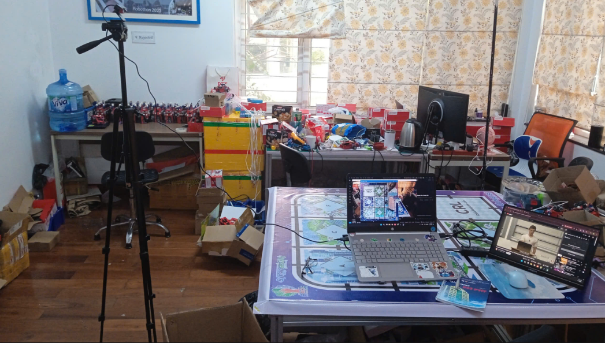
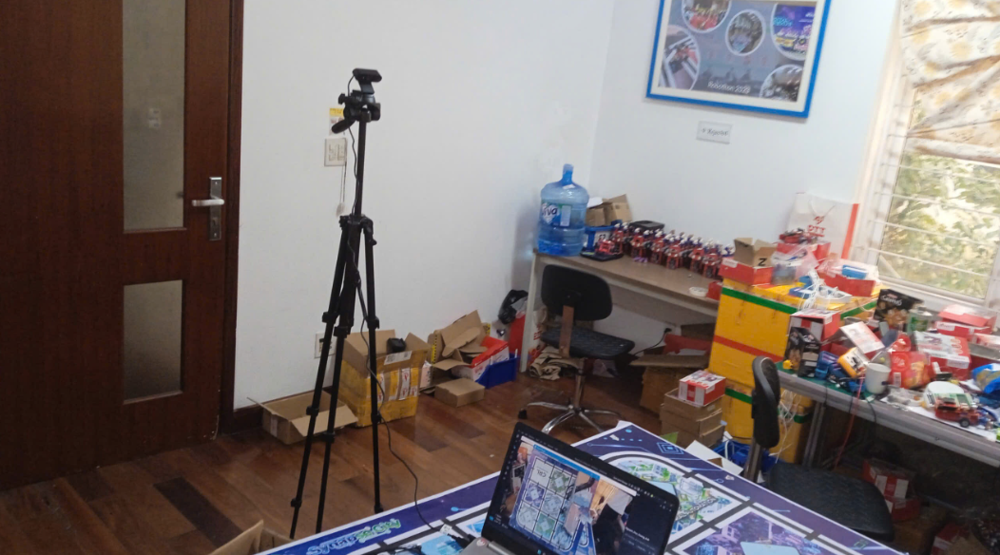
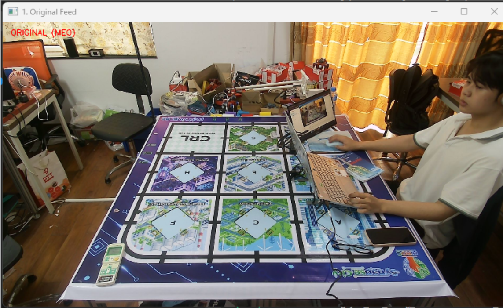
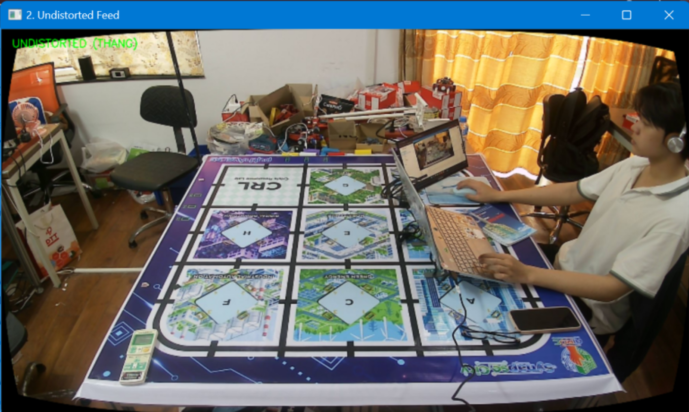

# Báo cáo công việc ngày 07/04/2026
## A. Công việc đã làm
- Tìm hiểu các hướng tối ưu Resolution.
- Cách bố trí Cam so với sa bàn hiện tại.
- Undistort và thử nghiệm với camera hiện tại so sánh trước sau.
- Gắn đường dẫn tới code vào các báo cáo trước đó
### 1. Resolution và điều kiện ảnh hưởng tới Resolution
- Resolution cao nhất mà Camera Hikvision DS-U04 có thể đạt được là 2560x1440 (2K). Và hiện tại em cũng đang dùng toàn bộ là 2560x1440 cho dự án ạ. FPS đạt được là 30, không có hiện tượng giật lag hay chậm ạ.
- **Thử đổi Backend sang DSHOW**: 
  Để đổi backend xử lí Cam sang DSHOW em đã cấu hình thêm trong hàm **cv2.VideoCapture(cam_id, cv2.CAP_DSHOW)** . DSHOW hỗ trợ tốt hơn cho việc OpenCV có thể đọc ảnh từ Cam qua hệ thống máy tính, góp phần ổn định hơn trong việc xử lí ảnh và giảm thiểu độ trễ khi ảnh có Resolution cao.
- **Định dạng MJPG** : MJPG là dạng nén ảnh JPEG theo từng frame, việc nén ảnh này giúp giảm băng thông trên USB, từ đó những Camera tốc độ chậm có thể đạt được FPS cao hơn khi chạy ở Resolution cao. Cách set định dạng này như sau :
  ```python
    import cv2

    cam_id = 1
    # 1. Mở camera với backend DSHOW
    cap = cv2.VideoCapture(cam_id, cv2.CAP_DSHOW)

    # 2. Thiết lập định dạng MJPG
    cap.set(cv2.CAP_PROP_FOURCC, cv2.VideoWriter_fourcc(*'MJPG'))

    # 3. Sau đó mới thiết lập độ phân giải (ví dụ 2K)
    cap.set(cv2.CAP_PROP_FRAME_WIDTH, 1920)
    cap.set(cv2.CAP_PROP_FRAME_HEIGHT, 1080)
  ```
  - Kết quả: 
    Sau khi chạy BenchMark và đánh giá so với setup mặc định là MSMF và format mặc định và độ phân giải tối đa 2K bằng file code [benchMark_fps_resolution.py](https://git.pythaverse.space/thomha/Nguyen_Huu_Hoang_Anh/blob/master/260407/Scripts/Camera_configurator/benchMark_fps_resolution.py) thì em thu được kết quả:
      ```
      
        --- TESTING: Backend=DEFAULT (MSMF), Format=DEFAULT, Res=2560x1440 ---
        [INFO] Thực tế đang chạy: 2560x1440, Preset FPS: 30.0
        [RESULT] Thời gian đọc 100 frame: 3.31s
        [RESULT] FPS thực tế: 30.20

        --- TESTING: Backend=DSHOW, Format=MJPG, Res=2560x1440 ---
        [INFO] Thực tế đang chạy: 2560x1440, Preset FPS: 30.00003000003
        [RESULT] Thời gian đọc 100 frame: 3.36s
        [RESULT] FPS thực tế: 29.76

        ============================================================
        TONG KET TAI 2560x1440:
        - FPS Mac dinh (MSMF): 30.20
        - FPS Toi uu (DSHOW + MJPG): 29.76
        ==> Cai thien: -1.5%
        ============================================================
      ```
    Kết quả cho thấy FPS giảm hơn một chút (giao động từ  1 - 5% ) khi chuyển sang DSHOW và MJPG. 

### 2. Bố trí Cam và sa bàn
- Cam được đặt trên đường trung trực của 1 cạnh sa bàn, các xa bàn 0.6m và cao 0.9m so với mặt phẳng sa bàn như sau:

  

  
### 3. Undistort
- Undistort để nắn ảnh bị méo do thấu kính của camera. Đây là kết quả so sánh trước và sau khi Undistort:
  - Trước khi Undistort:
    

  - Sau khi Undistort:
    

## B. Khó khăn
- Hiện tại model nhận diện Leanbot em chưa thu tập Dataset trên nền của Sa bàn trên công ty nên chưa nhận diện được ạ. Trước đó em thu data ở xưởng trên mặt bàn gỗ, dataset chỉ có 50 ảnh nên chưa sử dụng được trên sa bàn ở công ty ạ. Em có cần thu thêm data và tiếp tục thử nghiệm với model không ạ? Hay đi theo hướng mà em đề xuất với Thầy trước đó luôn ạ ? 
