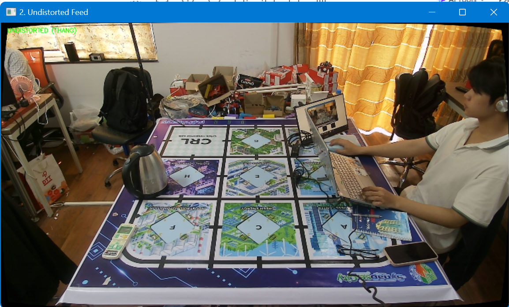
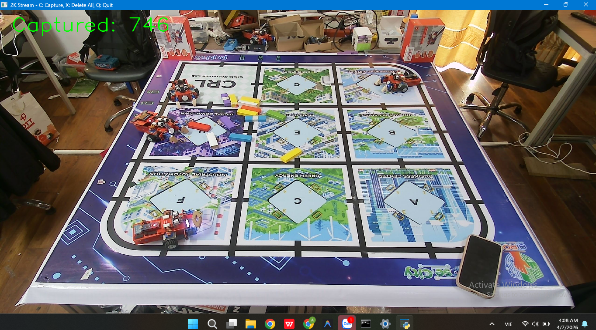
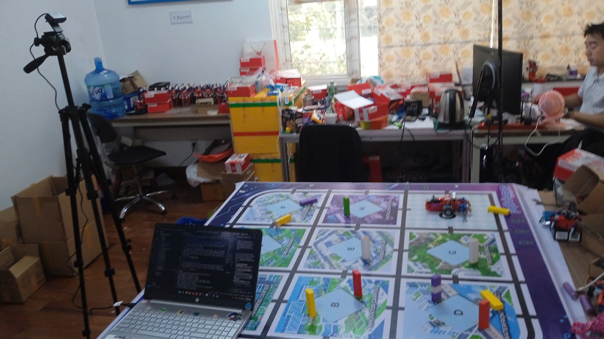
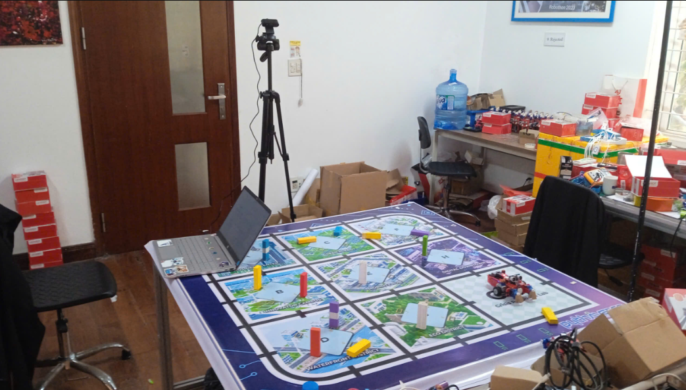
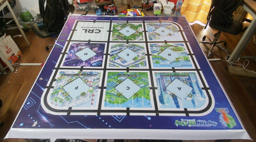
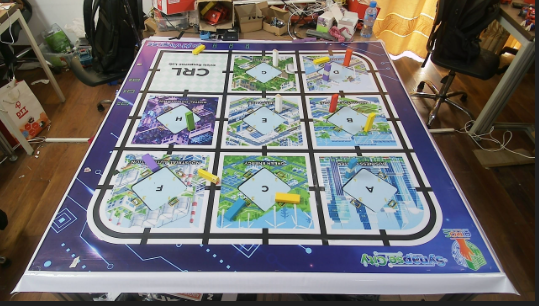
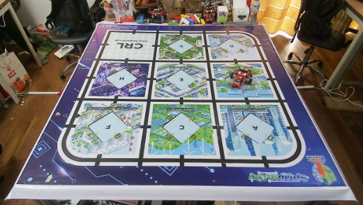
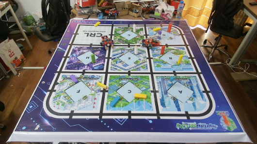
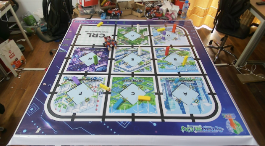

# Báo cáo công việc ngày 07/04/2026
## A. Công việc đã làm
- Tìm hiểu các hướng tối ưu Resolution.
- Cách bố trí Cam so với sa bàn hiện tại.
- Undistort và thử nghiệm với camera hiện tại so sánh trước sau.

## Mục lục
- [1. Resolution và điều kiện ảnh hưởng tới Resolution](#1-resolution-và-điều-kiện-ảnh-hưởng-tới-resolution)
- [2. Undistort](#2-undistort)
- [3. Giải thích chi tiết về Resolution](#3-giải-thích-chi-tiết-về-resolution)
- [4. Căn chỉnh lại Cam và Sa bàn](#4-căn-chỉnh-lại-cam-và-sa-bàn)
- [5. Dữ liệu Data đã thu thập](#5-dữ-liệu-data-đã-thu-thập)

### 1. Resolution và điều kiện ảnh hưởng tới Resolution
- Resolution cao nhất mà Camera Hikvision DS-U04 có thể đạt được là 2560x1440 (2K). Và hiện tại em cũng đang dùng toàn bộ là 2560x1440 cho dự án ạ. FPS đạt được là 30, không có hiện tượng giật lag hay chậm ạ.
- **Thử đổi Backend sang DSHOW**: 
  Để đổi backend xử lí Cam sang DSHOW em đã cấu hình thêm trong hàm **cv2.VideoCapture(cam_id, cv2.CAP_DSHOW)** . DSHOW hỗ trợ tốt hơn cho việc OpenCV có thể đọc ảnh từ Cam qua hệ thống máy tính, góp phần ổn định hơn trong việc xử lí ảnh và giảm thiểu độ trễ khi ảnh có Resolution cao.
- **Định dạng MJPG** : MJPG là dạng nén ảnh JPEG theo từng frame, việc nén ảnh này giúp giảm băng thông trên USB, từ đó những Camera tốc độ chậm có thể đạt được FPS cao hơn khi chạy ở Resolution cao. Cách set định dạng này như sau :
  ```python
    import cv2

    cam_id = 1
    # 1. Mở camera với backend DSHOW
    cap = cv2.VideoCapture(cam_id, cv2.CAP_DSHOW)

    # 2. Thiết lập định dạng MJPG
    cap.set(cv2.CAP_PROP_FOURCC, cv2.VideoWriter_fourcc(*'MJPG'))

    # 3. Sau đó mới thiết lập độ phân giải (ví dụ 2K)
    cap.set(cv2.CAP_PROP_FRAME_WIDTH, 1920)
    cap.set(cv2.CAP_PROP_FRAME_HEIGHT, 1080)
  ```
  - Kết quả:
    Sau khi chạy BenchMark và đánh giá so với setup mặc định là MSMF và format mặc định và độ phân giải tối đa 2K bằng file code [benchMark_fps_resolution.py](https://git.pythaverse.space/thomha/Nguyen_Huu_Hoang_Anh/blob/master/260407/Scripts/Camera_configurator/benchMark_fps_resolution.py) thì em thu được kết quả:
      ```
      
        --- TESTING: Backend=DEFAULT (MSMF), Format=DEFAULT, Res=2560x1440 ---
        [INFO] Thực tế đang chạy: 2560x1440, Preset FPS: 30.0
        [RESULT] Thời gian đọc 100 frame: 3.31s
        [RESULT] FPS thực tế: 30.20

        --- TESTING: Backend=DSHOW, Format=MJPG, Res=2560x1440 ---
        [INFO] Thực tế đang chạy: 2560x1440, Preset FPS: 30.00003000003
        [RESULT] Thời gian đọc 100 frame: 3.36s
        [RESULT] FPS thực tế: 29.76

        ============================================================
        TONG KET TAI 2560x1440:
        - FPS Mac dinh (MSMF): 30.20
        - FPS Toi ưu (DSHOW + MJPG): 29.76
        ==> Cai thien: -1.5%
        ============================================================
      ```
    Kết quả cho thấy FPS giảm hơn một chút (giao động từ  1 - 5% ) khi chuyển sang DSHOW và MJPG. 

### 2. Undistort
- Undistort để nắn ảnh bị méo do thấu kính của camera. Đây là kết quả so sánh trước và sau khi Undistort:
  - Trước khi Undistort:
    
 
  - Sau khi Undistort:
    

### 3. Giải thích chi tiết về Resolution
#### 3.1. Tại sao báo cáo hôm trước (260406) ghi Resolution là 640x480 và không thay đổi được?
- **Giá trị in ra khi hỏi thông tin là mặc định của OpenCV khi đọc Cam:** Khi test sơ bộ bằng OpenCV mặc định trên Windows (MSMF) mà không chỉ định rõ cấu hình, Camera thường tự gán về mức an toàn 640x480 để đảm bảo FPS. Tuy nhiên, trong chính báo cáo hôm qua, em đã dùng hàm `cap.set()` để chứng minh là có thể thay đổi được nó (ở việc đổi sang 360/240 thành công) từ đó có thể Config lên 2K và trong buổi hôm nay em đã chỉnh lên 2K được rồi ạ.

#### 3.2. Set Resolution 2K thực tế trong dự án
Khác với thông tin tìm kiếm về việc dùng MJPG hay DSHOW để tối ưu Resolution cho camera, qua bài BenchMark thực tế bằng file `benchMark_fps_resolution.py`, cho ra kết quả :
- **Cấu hình MSMF (Mặc định):** Đạt **30.20 FPS** tại độ phân giải 2K (2560x1440).
- **Cấu hình DSHOW + MJPG:** Chỉ đạt **29.76 FPS** (giảm 1.5%).
=> **Kết luận:** Trong các code xử lý chính (`image_warping_birdseye.py`, `live_undistort.py`), em không sử dụng DSHOW hay MJPG. Em vẫn dùng backend mặc định nhưng thiết lập tham số `FRAME_WIDTH/HEIGHT` lên 2K ngay từ đầu và nó hoạt động được ở mức 30 FPS mà không có hiện tượng giật lag.

### 4. Căn chỉnh lại Cam và Sa bàn
- Em đã hạ độ cao Cam xuống 0,8m so với mặt phẳng sa bàn ( em ko giảm xuống thêm nữa vì ảnh thu về sẽ chéo hơn), và đưa lại gần 0.35m so với mép sa bàn và căn chỉnh góc cam sao cho mép dưới Frame ảnh trùng với mép trắng sa bàn, mép trên trùng với cạnh trên của hộp Leanbot và đã đánh dấu trên sàn nhà rồi ạ. Ảnh thu được như sau : 
  
  
  
  

### 5. Dữ liệu Data đã thu thập
- Hiện tại em đã lấy được rất nhiều mẫu data theo đề xuất của Thầy, và có cả nhiều mẫu em tự lấy thêm như : bật đèn, đóng mở tay Gripper, đi tự do ngẫu nhiên trên sa bàn, mỗi vị trí đều xoay 360 độ và chụp khoảng 10 ảnh trở lên. Tổng tất cả khoảng **300 tấm ảnh** ạ. **Chưa tính** ảnh của Leanbot IoT và 2 Leanbot trở lên chụp cùng 1 lúc và các loại màu Led khác nhau ạ.
- Ảnh BackGroud trắng

- Ảnh chỉ có các khối gỗ ngẫu nhiên

- Ảnh Leanbot ở các vị trí ngẫu nhiên ( các vạch đen, ngã 4, các ô A,B,D,... góc sa bàn,...)

- Ảnh 2 Leanbot ở vị trí ngẫu nhiên

- Ảnh Leanbot với các Khối gỗ ngẫu nhiên


## B. Khó khăn
- Về vấn đề ma trận nội tham số, ngoại tham số để Undistort Perspective Transform em sẽ về tìm hiểu thêm và báo cáo lại với Thầy ạ.
- Hiện tại việc gắn nhãn cho số lượng ảnh lớn đang gặp khó khăn về mặt thời gian và công sức. Vậy em sẽ cần dành ra một vài buổi làm ở Công ty chỉ để gắn nhãn cho số lượng ảnh này ạ. Em muốn xin Thầy một vài đề xuất để thực hiện công việc này nhanh hơn ạ.