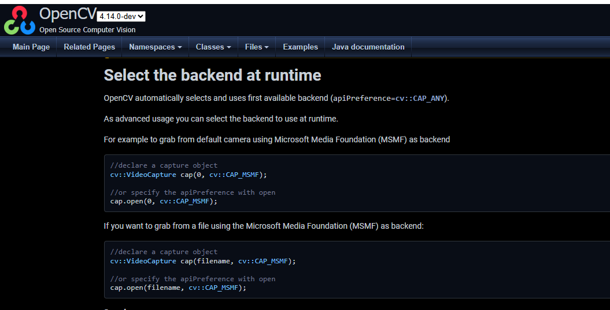
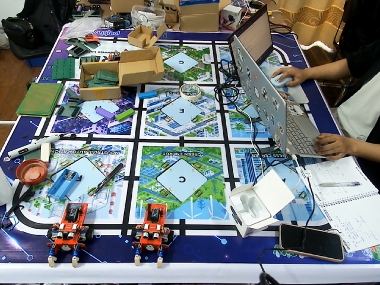
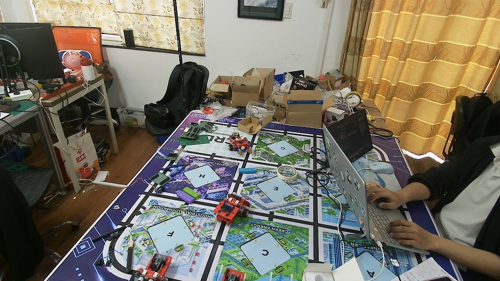
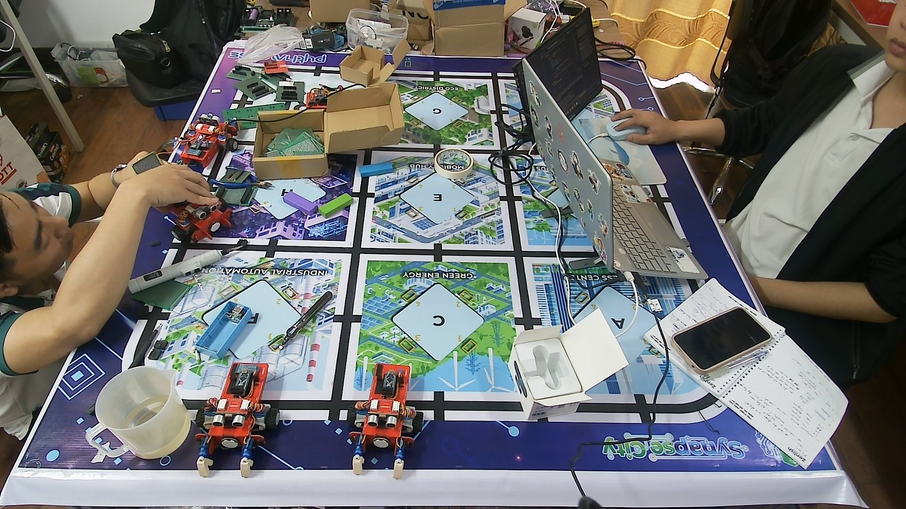
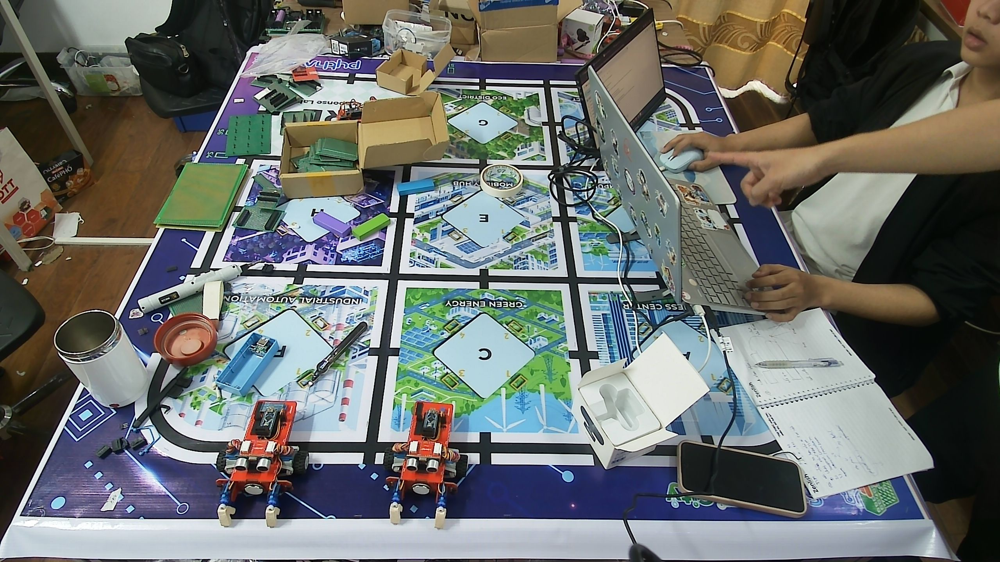
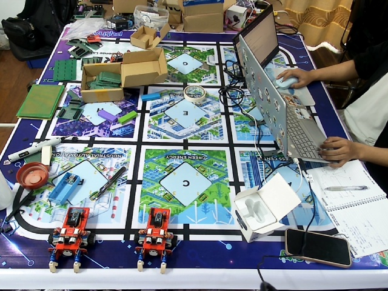
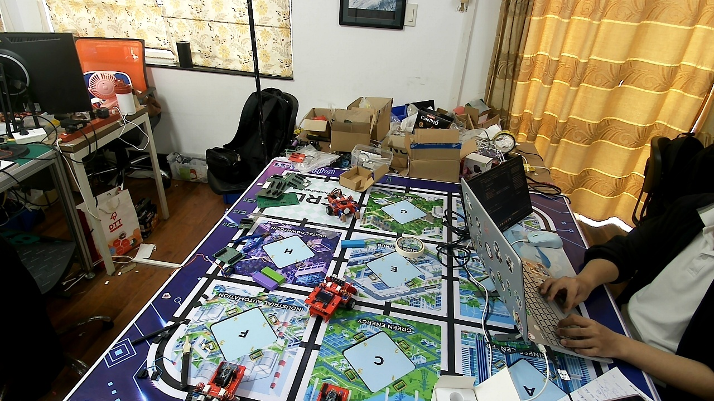
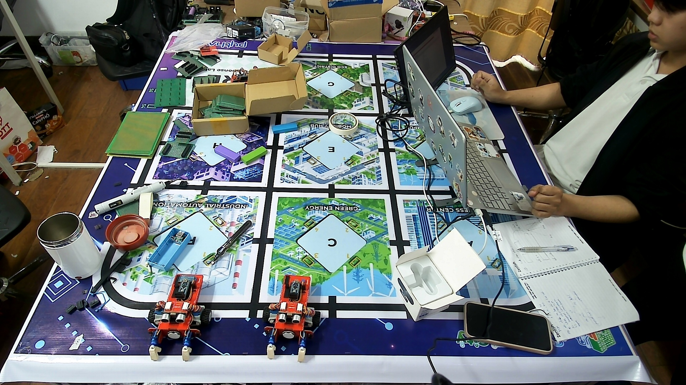
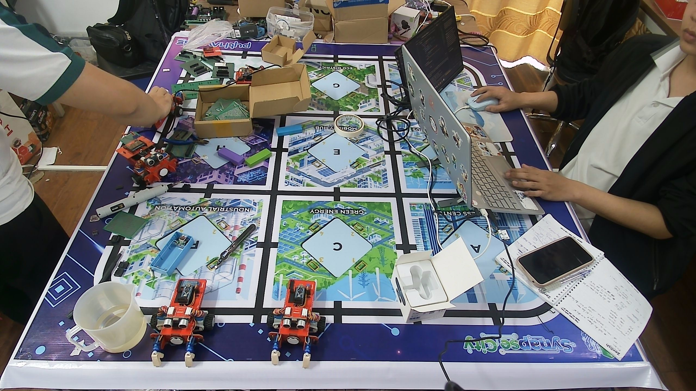

# Báo cáo công việc ngày 10/04/2026
- [A. Công việc đã làm](#a-công-việc-đã-làm)
    - [1. Tìm hiểu lại về Configure Resolution của Cam và FPS](#1-tìm-hiểu-lại-về-configure-resolution-của-cam-và-fps)
        - [1.1. Chế độ DSHOW và độ phân giải tối đa mà Cam có thể đạt được](#11-chế-độ-dshow-và-độ-phân-giải-tối-đa-mà-cam-có-thể-đạt-được)
        - [1.2. Hình ảnh Cam ở các độ phân giải khác nhau](#12-hình-ảnh-cam-ở-các-độ-phân-giải-khác-nhau)
    - [2. Báo cáo về việc tạo tập dữ liệu Datasets để train model nhận diện Leanbot](#2-báo-cáo-về-việc-tạo-tập-dữ-liệu-datasets-để-train-model-nhận-diện-leanbot)
        - [2.1. Datasets](#21-datasets)
    - [3. Một số khó khăn khi sử dụng Label Studio](#3-một-số-khó-khăn-khi-sử-dụng-label-studio)
- [B. Khó khăn](#b-khó-khăn)

## A. Công việc đã làm
- Tìm hiểu lại về Configure Resolution của Cam và FPS.
- Báo cáo về việc tạo tập dữ liệu Datasets để train model nhận diện Leanbot
- Một số khó khăn khi sử dụng Label Studio

### 1. Tìm hiểu lại về Configure Resolution của Cam và FPS.
#### 1.1. Chế độ DSHOW và độ phân giải tối đa mà Cam có thể đạt được. 
- Trước tiên format **Default** không phải là một format/backend cố định. Trong OpenCV, nếu mở camera bằng cv2.VideoCapture(0) thì đó là CAP_ANY, nghĩa là OpenCV tự chọn backend khả dụng đầu tiên trên máy. Vì vậy, format **Default** trên máy chạy ccode có thể là MSMF, DSHOW, hoặc backend khác tùy build OpenCV và hệ thống. Em đã đọc được thông tin này trong tài liệu của OpenCV



- Ở báo cáo trước đó ngày 06/04 em có báo cáo về việc độ phân giải không thể Configure được, và tới ngày 07/04 thì đã có thể sử dụng độ phân giải 2K (2560x1440) với backend Default. Lý do cho sự nhẫm lẫn, sau sót này là khi em chạy code kiểm tra configure em đã lấy thông số thay đổi độ phân giải từ 680x680 về 320x320 nhưng thực tế Cam ko hỗ trợ độ phân giải này, em đã sửa và chạy lại code kiểm tra configure - **[config_check.py](https://git.pythaverse.space/thomha/Nguyen_Huu_Hoang_Anh/blob/master/260406/Scripts/Camera_configurator/config_check.py)** và lấy thông số thay đổi các mức độ phân giải từ 680x480 tới 2560x1440 thì cho kết quả có thể Configure được như sau : 

    ```
        RES 1280x720    | before= 640x480 | target=1280x720 | after=1280x720 | CONFIG DUOC
        RES 1920x1080   | before= 640x480 | target=1920x1080 | after=1920x1080 | CONFIG DUOC
        RES 2560x1440   | before= 640x480 | target=2560x1440 | after=2560x1440 | CONFIG DUOC
        FPS             | before=  30.000 | target=  15.000 | after=  25.000 | CONFIG DUOC
        BRIGHTNESS      | before= 128.000 | target=  64.000 | after= 128.000 | KHONG CONFIG DUOC
        CONTRAST        | before= 128.000 | target=  64.000 | after= 128.000 | KHONG CONFIG DUOC
        SATURATION      | before= 128.000 | target=  64.000 | after= 128.000 | KHONG CONFIG DUOC
        HUE             | before= 128.000 | target=  64.000 | after= 128.000 | KHONG CONFIG DUOC
        GAIN            | before= 255.000 | target=  64.000 | after= 255.000 | KHONG CONFIG DUOC
        EXPOSURE        | before=  -2.000 | target=  -8.000 | after=  -2.000 | KHONG CONFIG DUOC
        SHARPNESS       | before= 128.000 | target=  64.000 | after= 128.000 | KHONG CONFIG DUOC
        TEMPERATURE     | before= 417.000 | target= 350.000 | after= 417.000 | KHONG CONFIG DUOC
        BACKLIGHT       | before=   4.000 | target=   0.000 | after=   4.000 | KHONG CONFIG DUOC
        ZOOM            | before= 100.000 | target= 120.000 | after= 100.000 | KHONG CONFIG DUOC
    ```
- Về FPS thì em đã thử đổi lên target là 40 thì kết quả trả về sau khi set vẫn là 30, khi em đổi target là 15 thì kết quả trả về là 25. Tức là độ phân giải mà Cam có thể đọc được và xuất dữ liệu hình ảnh về chỉ có 2 mức là 25 và 30. 

    ``` 
        FPS | before=30.000 | target=40.000 | after=30.000 | ok=True
        FPS | before=30.000 | target=15.000 | after=25.000 | ok=True
    ```

#### 1.2. Hình ảnh Cam ở các độ phân giải khác nhau.
- Nếu để format **Default**:
    - 680x480
    
        
        
    - 1280x720
    
        
        
    - 1920x1080
    
        
        
    - 2560x1440 (tối đa)
    
        
- Nếu để format **DSHOW**:
    - 680x480
    
        
        
    - 1280x720
    
        
        
    - 1920x1080
    
        
        
    - 2560x1440 (tối đa)
    
        
- So sánh kết quả cho thấy chất lượng ảnh ở 2 Format ko khác nhau là mấy, tuy nhiên đối với DSHOW Format thì FPS không ổn định và không tốt bằng format mặc định. Khi chạy code **[resolution_test.py](https://git.pythaverse.space/thomha/Nguyen_Huu_Hoang_Anh/blob/master/260410/scripts/resolution_test.py)** thì cho kết quả như sau:

    ```
        [DEFAULT] Summary
        ------------------------------------------------------------
        Requested     Actual        FPS         Saved
        ------------------------------------------------------------
        680x480       640x480       30.40       Yes
        1280x720      1280x720      30.30       Yes
        1920x1080     1920x1080     30.07       Yes
        2560x1440     2560x1440     30.53       Yes
        ------------------------------------------------------------

        Running mode: DSHOW

        [DSHOW] Summary
        ------------------------------------------------------------
        Requested     Actual        FPS         Saved
        ------------------------------------------------------------
        680x480       640x480       30.06       Yes
        1280x720      1280x720      12.81       Yes
        1920x1080     1920x1080     5.69        Yes
        2560x1440     2560x1440     29.16       Yes
    ```

### 2. Báo cáo về việc tạo tập dữ liệu Datasets để train model nhận diện Leanbot
#### 2.1. Datasets
- Tập dữ liệu Datasets trong mọi bài toán DeepLearning là một bộ dữ liệu bên trong đó có chứa thông tin chính là : folder ảnh đầu vào để train, và file cấu hình chứa nhãn tương ứng với ảnh đầu vào. Mặc dù hiện tại em chưa chia tập datasets thành các phần nhưng thông thường một bộ Datasets sẽ được chia thành 3 phần và 3 phần này dữ liệu ảnh sẽ không được trùng lặp với nhau. Được chia theo tỷ lệ 80% - 10% - 10% hoặc 70% - 20% - 10% (tùy thuộc vào người tạo Datasets)
    - Train : Tập dữ liệu dùng để train model
    - Validation : Tập dữ liệu dùng để đánh giá model
    - Test : Tập dữ liệu dùng để test model 
- Tức là về bản chất, chỉ cần có một tập Datasets được cấu thành từ các phần phía trên là có thể train model. Thậm chí có thể đánh nhãn bằng tay bằng việc viết các file .txt hoặc .json để định nghĩa nhãn cho từng bức ảnh. Tuy nhiên trên thế giới người ta đã tạo ra các công cụ hỗ trợ để tạo ra tập datasets đó, người dùng chỉ cần upload ảnh và đánh nhãn trên giao diện sử dụng của công cụ, công cụ sẽ tự động đóng gói datasets theo đúng định dạng mà các thư viện, Model DeepLearning yêu cầu. Label studio cũng là một công cụ như vậy. Ngoài Label studio vẫn còn rất nhiều công cụ khác có chức năng tương tự. Vì Label Studio open source trên Github và có thể tải về dùng offline mà không phụ thuộc vào internet nên em đã chọn sử dụng Label Studio. 

### 3. Một số khó khăn khi sử dụng Label Studio
- Về ưu điểm thì Label Studio có thể sử dụng online và offline, có thể sử dụng cho nhiều bài toán khác nhau. Tuy nhiên, nếu sử dụng online thì thi thoảng sẽ không xuất được dataset về. Chỉ xuất được file gắn nhãn và cấu hình json, còn không xuất trả về ảnh người dùng đã upload lên. Khi sử dụng offline thì mới xuất được dataset về. Tuy nhiên, khi sử dụng offline thì sẽ không thể chia sẻ project cho người khác, tức là project do ai tạo thì người đó tự thao tác và không share online được.
- Em có tìm được thêm một vài công cụ khác như : CVAT, VGG Image, ... rất nhiều công cụ hiện có trên thế giới. Tuy nhiên, em vẫn chưa thử công cụ khác ngoài Label Studio.
- Về thời gian để gắn nhãn ảnh bằng Lable studio thì theo em nghĩ thì sẽ mất khoảng 15 phút cho 30 bức ảnh ạ. Hôm qua em chỉ chụp có 50 bức nhưng độ chính xác cũng tương đối ổn, chỉ cần chụp thêm đến khoảng 500 bức ảnh là đủ tốt để nhận diện Leanbot trong mọi trường hợp trong Sa bàn ạ.
## B. Khó khăn
