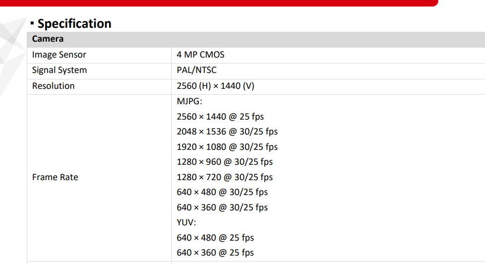

# Báo cáo công việc ngày 10/04/2026 (2)

## A. Công việc đã làm
- Giải thích việc kiểm tra các độ phân giải mà Cam hỗ trợ
- Báo cáo code kiểm tra FPS tại các độ phân giải
- Chi tiết tập Datasets mà Label-studio trả về
### 1. Giải thích việc kiểm tra các độ phân giải mà Cam hỗ trợ
- Nguồn thông tin tham khảo về độ phân giải của Cam Hikvison DS04 hiện tại đang sử dụng : **Datasheet-of-DS-U04_20220906.pdf** - [https://assets.hikvision.com/prd/normal/all/doc/m000056121/Datasheet-of-DS-U04_20220906.pd](https://assets.hikvision.com/prd/normal/all/doc/m000056121/Datasheet-of-DS-U04_20220906.pdf)

    
- Link code : **resolution_test.py** [https://git.pythaverse.space/thomha/Nguyen_Huu_Hoang_Anh/blob/master/260410/scripts/resolution_test.py](https://git.pythaverse.space/thomha/Nguyen_Huu_Hoang_Anh/blob/master/260410/scripts/resolution_test.py).
- Code sẽ set lần lượt các độ phẩn giải từ 680x360 -> 680x480 -> 1280x270 -> 1920x1080 -> 2560x1440 (2K tối đa) và lưu lại hình ảnh tại các độ phân giải đó. Tại mỗi độ phân giải code sẽ in ra thông tin về độ phân giải thực tế mà Cam trả về.

- **Kết quả sau khi chạy** : 
    - Hình ảnh thực tế tại các độ phân giải ở 2 mode Defaut và DSHOW :
        - **default_format** : [https://git.pythaverse.space/thomha/Nguyen_Huu_Hoang_Anh/tree/master/260410/scripts/default_format](https://git.pythaverse.space/thomha/Nguyen_Huu_Hoang_Anh/tree/master/260410/scripts/default_format)
        - **dshow_format** : [https://git.pythaverse.space/thomha/Nguyen_Huu_Hoang_Anh/tree/master/260410/scripts/dshow_format](https://git.pythaverse.space/thomha/Nguyen_Huu_Hoang_Anh/tree/master/260410/scripts/dshow_format)

- Bảng tổng hợp ảnh kết quả :

| DEFAULT Backend | DSHOW Backend |
| :--- | :--- |
| [640x360_actual_640x360.jpg](scripts/default_format/640x360_actual_640x360.jpg) | [640x360_actual_640x360.jpg](scripts/dshow_format/640x360_actual_640x360.jpg) |
| [640x480_actual_640x480.jpg](scripts/default_format/640x480_actual_640x480.jpg) | [640x480_actual_640x480.jpg](scripts/dshow_format/640x480_actual_640x480.jpg) |
| [680x480_actual_640x480.jpg](scripts/default_format/680x480_actual_640x480.jpg) | [680x480_actual_640x480.jpg](scripts/dshow_format/680x480_actual_640x480.jpg) |
| [1280x720_actual_1280x720.jpg](scripts/default_format/1280x720_actual_1280x720.jpg) | [1280x720_actual_1280x720.jpg](scripts/dshow_format/1280x720_actual_1280x720.jpg) |
| [1280x960_actual_1280x960.jpg](scripts/default_format/1280x960_actual_1280x960.jpg) | [1280x960_actual_1280x960.jpg](scripts/dshow_format/1280x960_actual_1280x960.jpg) |
| [1920x1080_actual_1920x1080.jpg](scripts/default_format/1920x1080_actual_1920x1080.jpg) | [1920x1080_actual_1920x1080.jpg](scripts/dshow_format/1920x1080_actual_1920x1080.jpg) |
| [2048x1536_actual_1920x1080.jpg](scripts/default_format/2048x1536_actual_1920x1080.jpg) | [2048x1536_actual_1920x1080.jpg](scripts/dshow_format/2048x1536_actual_1920x1080.jpg) |
| [2560x1440_actual_2560x1440.jpg](scripts/default_format/2560x1440_actual_2560x1440.jpg) | [2560x1440_actual_2560x1440.jpg](scripts/dshow_format/2560x1440_actual_2560x1440.jpg) |

- Kết quả print ra :

```
    -----------------------------------------------------------------------------------------------
    MODE: DEFAULT (Any)
    -----------------------------------------------------------------------------------------------
    Requested       | Actual          | FPS Set    | FPS Actual   | Time (s)   | Frames
    -------------------------------------------------------------------------------------
    640x360         | 640x360         | 30.0       | 29.91        | 2.01       | 60
    640x480         | 640x480         | 30.0       | 29.89        | 2.01       | 60
    680x480         | 640x480         | 30.0       | 30.38        | 1.97       | 60
    1280x720        | 1280x720        | 30.0       | 30.16        | 1.99       | 60
    1280x960        | 1280x960        | 30.0       | 30.16        | 1.99       | 60
    1920x1080       | 1920x1080       | 30.0       | 29.96        | 2.00       | 60
    2048x1536       | 1920x1080       | 30.0       | 30.54        | 1.96       | 60
    2560x1440       | 2560x1440       | 30.0       | 30.62        | 1.96       | 60
    -------------------------------------------------------------------------------------

    Starting test for: DSHOW...

    -----------------------------------------------------------------------------------------------
    MODE: DSHOW
    -----------------------------------------------------------------------------------------------
    Requested       | Actual          | FPS Set    | FPS Actual   | Time (s)   | Frames
    -------------------------------------------------------------------------------------
    640x360         | 640x360         | 0.0        | 29.91        | 2.01       | 60
    640x480         | 640x480         | 0.0        | 30.15        | 1.99       | 60
    680x480         | 640x480         | 0.0        | 29.69        | 2.02       | 60
    1280x720        | 1280x720        | 0.0        | 12.87        | 4.66       | 60
    1280x960        | 1280x960        | 0.0        | 9.66         | 6.21       | 60
    1920x1080       | 1920x1080       | 0.0        | 5.72         | 10.49      | 60
    2048x1536       | 1920x1080       | 0.0        | 5.71         | 10.50      | 60
    2560x1440       | 2560x1440       | 0.0        | 27.43        | 2.19       | 60
    -------------------------------------------------------------------------------------
```
- Kết quả cho thấy những độ phân giải mà hãng công bố thì chỉ có độ phân giải 2048x1536 và 680x480 là không được hỗ trợ vì sau khi set độ phân giải này thực tế trả về vẫn chỉ là 1920x1080 và 640x480.
### 2. Kiểm tra FPS tại các độ phân giải
- Kết quả kiểm tra FPS tại các độ phân giải được print ra như ở bảng trên, có đầy đủ các thông tin về FPS set/get , Mode, Resolution, Time, Frames.
- Hoạt động code : OpenCV sẽ set lần lượt các độ phân giải, FPS, sau đó chụp liên tục 60 frame ảnh, tính toán thời gian chụp 60 frame đó và chia cho 60 để ra FPS thực tế.  

```python 
    # Set FPS
    cap.set(cv2.CAP_PROP_FPS, 30.0)
    
    # Capture 60 frames to calculate average FPS
    frames = []
    start_time = time.time()
    
    for _ in range(60):
        ret, frame = cap.read()
        if not ret:
            print(f"Failed to grab frame at {width}x{height}")
            break
        frames.append(frame)
    
    end_time = time.time()
    
    if len(frames) > 0:
        actual_fps = len(frames) / (end_time - start_time)
        print(f"Actual FPS: {actual_fps:.2f}")
        
        # Save one frame
        cv2.imwrite(f"frame_{width}x{height}.jpg", frames[0])
        print(f"Saved frame: frame_{width}x{height}.jpg")
```
- Kết quả kiểm tra cho thấy FPS ở chế độ Default thì ổn định ở 30 frame/s còn ở chế độ DSHOW thì FPS ko ổn định. 
## B. Khó khăn
