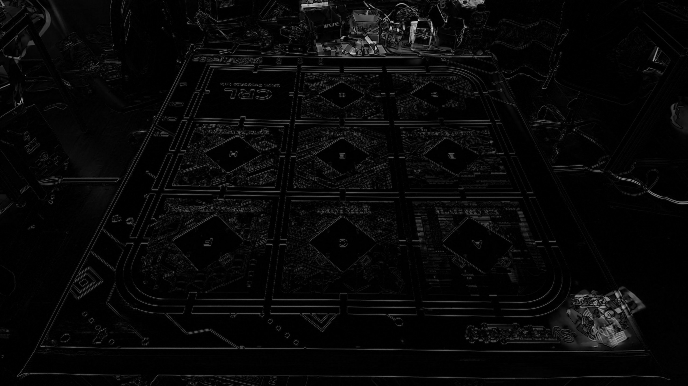
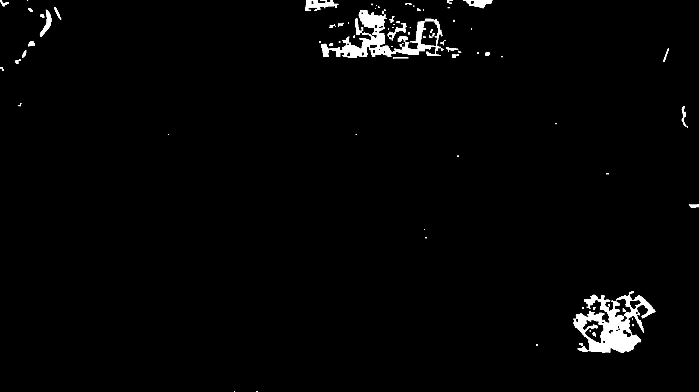
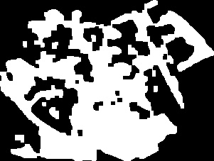
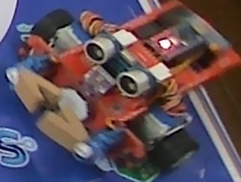

# Báo cáo công việc ngày 14/04/2026

## A. Công việc đã làm
- Tìm hiểu subtract images with alignemnt trong OpenCV
- Triển khai thực thế và gắn nhãn tự động cho Leanbot

### 1. Subtract images with alignemnt - OpenCV
#### 1.1. Phép trừ ảnh trong OpenCV
- Trong OpenCV có một làm là ```cv2.absdiff(src1, src2)```, chức năng là lấy độ chênh lệnh giữa ảnh ```src1``` và ```src2``` theo công thức ```dst(I) = |src1(I) - src2(I)|``` . Từ việc lấy độ chênh lệnh này, ta có thể phát hiện được sự thay đổi giữa hai ảnh. 
- Tuy nhiên để sử dụng tốt hàm này thì cần ảnh ```src1``` và ```src2``` phải có kích thước bằng nhau, khớp với nhau. Tức là Cam giữ yên một chỗ và không di chuyển. 
- Hàm chạy trong thực tế :
    ```python
    BG_PATH = "D:\\PTIT\\DTT\\yolov8_Leanbot_detection\\background.jpg"     # ảnh nền không có Leanbot
    CUR_PATH = "D:\\PTIT\\DTT\\yolov8_Leanbot_detection\\leanbot.jpg"       # ảnh hiện tại có Leanbot
    OUT_DIR = "D:\\PTIT\\DTT\\yolov8_Leanbot_detection\\output"  # thư mục lưu kết quả 

    # chuyển grayscale
    bg_gray = cv2.cvtColor(bg, cv2.COLOR_BGR2GRAY)
    cur_gray = cv2.cvtColor(cur, cv2.COLOR_BGR2GRAY)

    # trừ ảnh, tính sai khác tuyệt đối
    diff = cv2.absdiff(bg_gray, cur_gray)

    cv2.imwrite(f"{OUT_DIR}/01_diff.jpg", diff)

    ```
    - Kết quả so sánh như sau : 

        

- Hướng giải quyết bài toán đánh nhãn Leabot tự động bằng phương pháp trừ ảnh như sau : 
    - B1: Chụp ảnh BackGround trắng, chưa có Leanbot 
        
    - B2: Chụp ảnh có Leanbot 
        
    - B3: Tiền xử lí ảnh, làm mịn,...
        ```python
        # làm mịn ảnh
        bg_blur = cv2.GaussianBlur(bg_gray, (5, 5), 0)
        cur_blur = cv2.GaussianBlur(cur_gray, (5, 5), 0)
        ```
    - B4: Trừ ảnh có Leanbot cho ảnh BackGround 
        ```python
        # trừ ảnh, tính sai khác tuyệt đối
        diff = cv2.absdiff(bg_blur, cur_gray)
        ```
        - **Ảnh kết quả** :

            

    - B5: Nhị Phân hóa ảnh, tiền xử lí nhiễu, tính contour, tính diện tích Countor để lọc ra countor của Leanbot
        ```python
        # nhị phân hóa ảnh
        _, thresh = cv2.threshold(diff, 30, 255, cv2.THRESH_BINARY)

        # morphology để bỏ nhiễu và lấp lỗ
        kernel = cv2.getStructuringElement(cv2.MORPH_RECT, (KERNEL_SIZE, KERNEL_SIZE))
        mask = cv2.morphologyEx(mask, cv2.MORPH_OPEN, kernel)
        mask = cv2.morphologyEx(mask, cv2.MORPH_CLOSE, kernel)
        ```
        - **Ảnh kết quả** :

            

        ```python 
        # tìm contour
        contours, _ = cv2.findContours(thresh, cv2.RETR_EXTERNAL, cv2.CHAIN_APPROX_SIMPLE)
        ```
        ```python 
        # tìm contour lớn nhất
        largest_contour = max(contours, key=cv2.contourArea)
        ```

        - **Ảnh kết quả** :

            

    - B6: Tìm BBox của Leanbot, lấy tọa độ 4 góc của BBox
        ```python
        # tìm bounding box
        x, y, w, h = cv2.boundingRect(largest_contour)
        ```
        ```python 
        # vẽ bounding box
        cv2.rectangle(cur, (x, y), (x + w, y + h), (0, 255, 0), 2)
        ```
        - **Ảnh kết quả** :

            

    - B7: Tạo file .txt đánh nhãn cho ảnh tương ứng -> phân chia tập dữ liệu train, val, test 
-   Input (Ảnh BackGround trắng, ảnh có Leanbot)
-   Output (Ảnh có BBox của Leanbot, file .txt đánh nhãn cho ảnh tương ứng)

- Toàn bộ ảnh output sau khi thử nghiệm với một ảnh mẫu được liệt kê dưới bảng sau : 

| Input (Images) | Output (Results) |
| :---: | :---: |
| **Background**<br> | **Ảnh sai khác(Trừ ảnh)**<br> |
| **Ảnh có leanbot**<br> | **Ảnh nhị phân hóa**<br> |
| | **Bounding Box**<br> |
| | **Ảnh cắt ra**<br> |

#### 1.2. Code subtract images OpenCV
- Link code : https://github.com/anhnguyenhuu/yolov8_Leanbot_detection/blob/main/tools/auto_label_tool/auto_label_tool.py

## B. Khó khăn
- Phương pháp trừ ảnh sẽ có nhược điểm là khi ánh sáng thay đổi một chút thì khi trừ ảnh thì sẽ có một vùng thay đổi lớn, và với phương pháp chọn Countor lớn nhất để gán cho Leanbot thì sẽ không chính xác nữa ạ.
## C. Công việc tiếp theo
- Đóng gói code thành Tools để có thể thao tác với nhiều ảnh dễ dàng hơn