# Báo cáo công việc ngày 14/04/2026

## Mục lục
- [A. Công việc đã làm](#a-công-việc-đã-làm)
    - [1. Subtract images with alignemnt - OpenCV](#1-subtract-images-with-alignemnt---opencv)
        - [1.1. Phép trừ ảnh trong OpenCV](#11-phép-trừ-ảnh-trong-opencv)
        - [1.2. Code subtract images OpenCV](#12-code-subtract-images-opencv)
    - [2. Tìm hiểu về phương pháp Alignment ảnh trong OpenCV](#2-tìm-hiểu-về-phương-pháp-alignment-ảnh-trong-opencv)
        - [2.1. Khảo sát một số phương pháp Alignment ảnh](#21-khảo-sát-một-số-phương-pháp-alignment-ảnh)
        - [2.2. Code ECC](#22-code-ecc)
        - [2.3. Kết quả các trường hợp thử nghiệm](#23-kết-quả-các-trường-hợp-thử-nghiệm)
- [B. Khó khăn](#b-khó-khăn)

## A. Công việc đã làm
- Tìm hiểu subtract images with alignemnt trong OpenCV
- Triển khai thực thế vẽ Bouding Box tự động cho Leanbot
- Tìm hiểu phương pháp Aglinment ảnh trong OpenCV

### 1. Subtract images with alignemnt - OpenCV
#### 1.1. Phép trừ ảnh trong OpenCV
- Trong OpenCV có một làm là ```cv2.absdiff(src1, src2)```, chức năng là lấy độ chênh lệnh giữa ảnh ```src1``` và ```src2``` theo công thức ```dst(I) = |src1(I) - src2(I)|``` . Từ việc lấy độ chênh lệnh này, ta có thể phát hiện được sự thay đổi giữa hai ảnh. 
- Tuy nhiên để sử dụng tốt hàm này thì cần ảnh ```src1``` và ```src2``` phải có kích thước bằng nhau, khớp với nhau. Tức là Cam giữ yên một chỗ và không di chuyển. 
- Hàm chạy trong thực tế :
    ```python
    BG_PATH = "D:\\PTIT\\DTT\\yolov8_Leanbot_detection\\background.jpg"     # ảnh nền không có Leanbot
    CUR_PATH = "D:\\PTIT\\DTT\\yolov8_Leanbot_detection\\leanbot.jpg"       # ảnh hiện tại có Leanbot
    OUT_DIR = "D:\\PTIT\\DTT\\yolov8_Leanbot_detection\\output"  # thư mục lưu kết quả 

    # chuyển grayscale
    bg_gray = cv2.cvtColor(bg, cv2.COLOR_BGR2GRAY)
    cur_gray = cv2.cvtColor(cur, cv2.COLOR_BGR2GRAY)

    # trừ ảnh, tính sai khác tuyệt đối
    diff = cv2.absdiff(bg_gray, cur_gray)

    cv2.imwrite(f"{OUT_DIR}/01_diff.jpg", diff)

    ```
    - Kết quả so sánh như sau : 

        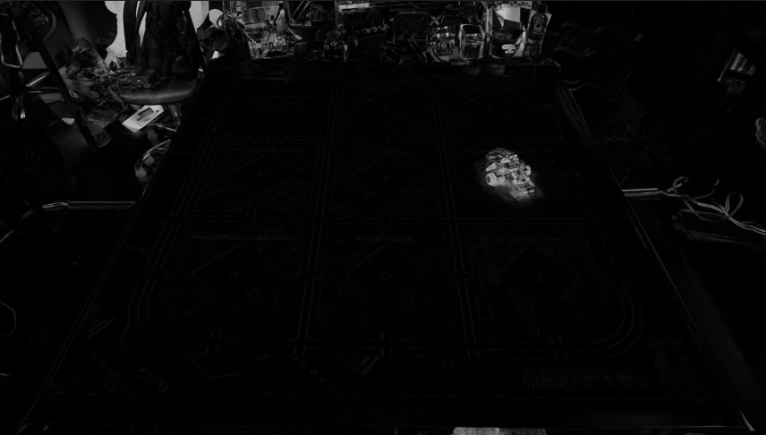

- Hướng giải quyết bài toán đánh nhãn Leabot tự động bằng phương pháp trừ ảnh như sau : 
    - B1: Chụp ảnh BackGround trắng, chưa có Leanbot 
        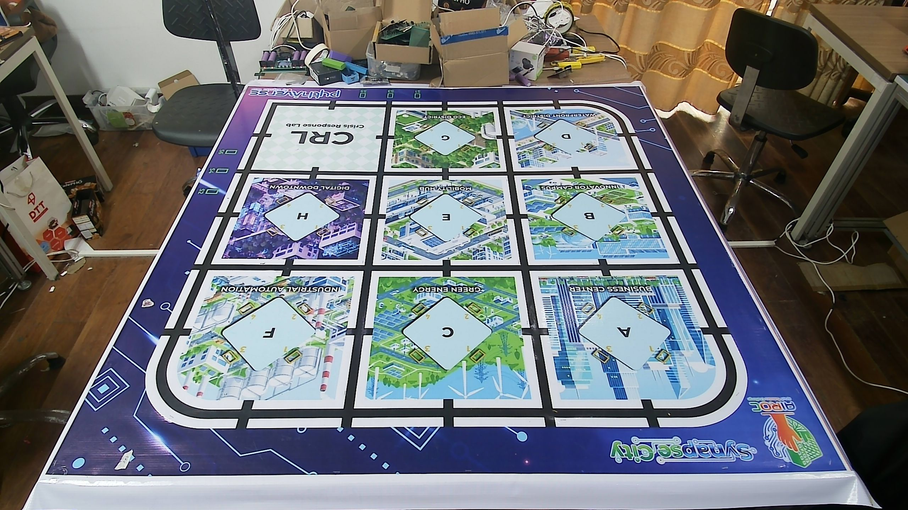
    - B2: Chụp ảnh có Leanbot 
        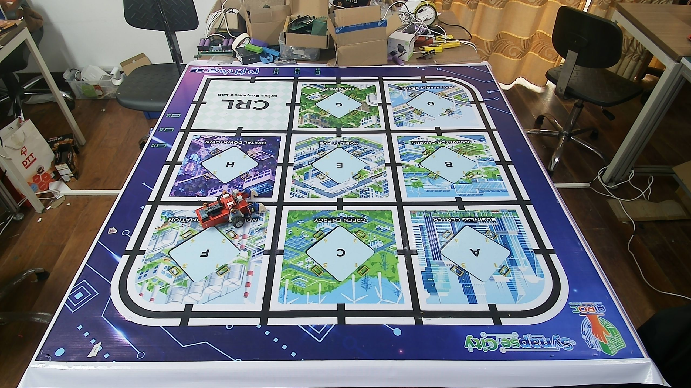
    - B3: Tiền xử lí ảnh, làm mịn,...
        ```python
        # làm mịn ảnh
        bg_blur = cv2.GaussianBlur(bg_gray, (5, 5), 0)
        cur_blur = cv2.GaussianBlur(cur_gray, (5, 5), 0)
        ```
    - B4: Trừ ảnh có Leanbot cho ảnh BackGround 
        ```python
        # trừ ảnh, tính sai khác tuyệt đối
        diff = cv2.absdiff(bg_blur, cur_gray)
        ```
        - **Ảnh kết quả** :

            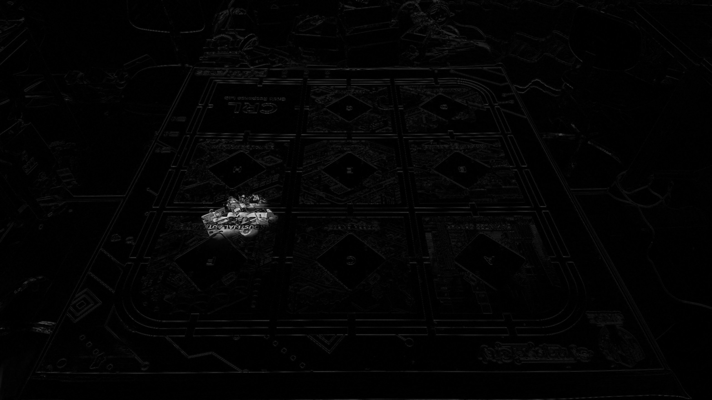

    - B5: Nhị Phân hóa ảnh, tiền xử lí nhiễu, tính contour, tính diện tích Countor để lọc ra countor của Leanbot
        ```python
        # nhị phân hóa ảnh
        _, thresh = cv2.threshold(diff, 30, 255, cv2.THRESH_BINARY)

        # morphology để bỏ nhiễu và lấp lỗ
        kernel = cv2.getStructuringElement(cv2.MORPH_RECT, (KERNEL_SIZE, KERNEL_SIZE))
        mask = cv2.morphologyEx(mask, cv2.MORPH_OPEN, kernel)
        mask = cv2.morphologyEx(mask, cv2.MORPH_CLOSE, kernel)
        ```
        - **Ảnh kết quả** :

            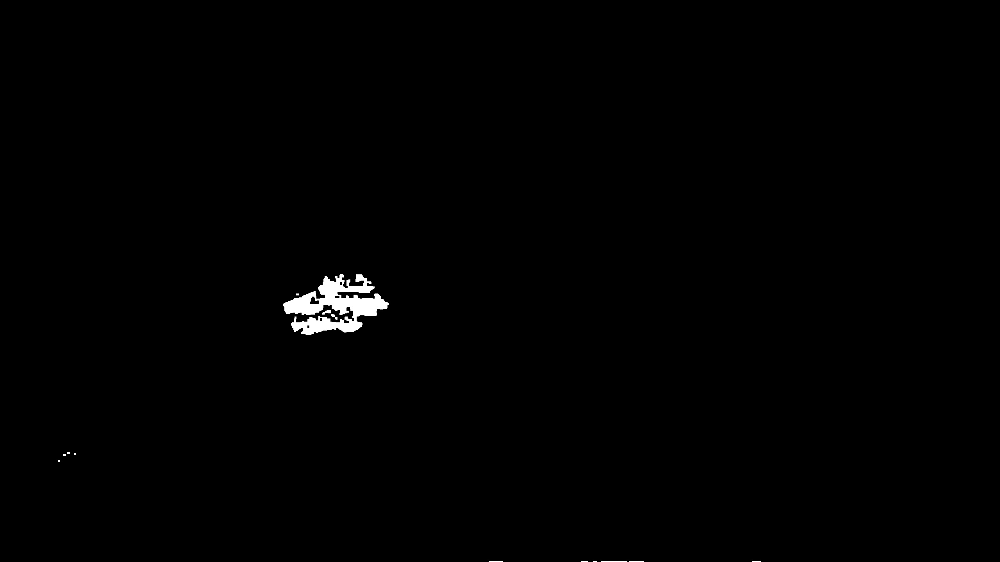

        ```python 
        # tìm contour
        contours, _ = cv2.findContours(thresh, cv2.RETR_EXTERNAL, cv2.CHAIN_APPROX_SIMPLE)
        ```
        ```python 
        # tìm contour lớn nhất
        largest_contour = max(contours, key=cv2.contourArea)
        ```

        - **Ảnh kết quả** :

            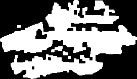

    - B6: Tìm BBox của Leanbot, lấy tọa độ 4 góc của BBox
        ```python
        # tìm bounding box
        x, y, w, h = cv2.boundingRect(largest_contour)
        ```
        ```python 
        # vẽ bounding box
        cv2.rectangle(cur, (x, y), (x + w, y + h), (0, 255, 0), 2)
        ```
        - **Ảnh kết quả** :

            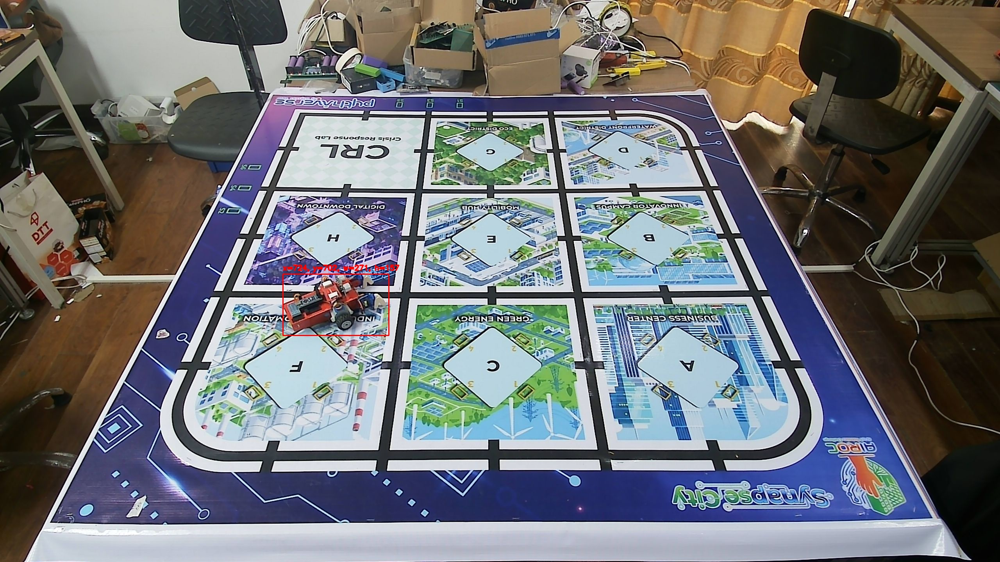

    - B7: Tạo file .txt đánh nhãn cho ảnh tương ứng -> phân chia tập dữ liệu train, val, test 
-   Input (Ảnh BackGround trắng, ảnh có Leanbot)
-   Output (Ảnh có BBox của Leanbot, file .txt đánh nhãn cho ảnh tương ứng)

- Toàn bộ ảnh output sau khi thử nghiệm với một ảnh mẫu được liệt kê dưới bảng sau : 

| Input (Images) | Output (Results) |
| :---: | :---: |
| **Background**<br> | **Ảnh sai khác(Trừ ảnh)**<br> |
| **Ảnh có leanbot**<br> | **Ảnh nhị phân hóa**<br> |
| | **Bounding Box**<br> |
| | **Ảnh cắt ra**<br>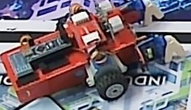 |

#### 1.2. Code subtract images OpenCV
- Link code : [https://git.pythaverse.space/thomha/Nguyen_Huu_Hoang_Anh/blob/master/260414/autoLabel/extraction.py](https://git.pythaverse.space/thomha/Nguyen_Huu_Hoang_Anh/blob/master/260414/autoLabel/extraction.py)

### 2. Tìm hiểu về phương pháp Aglinment ảnh trong OpenCV
#### 2.1. Khảo sát một số phương pháp Alignment ảnh
- Trong bài toán trừ ảnh để tự động tìm Bounding Box của Leanbot, hai ảnh đầu vào cần khớp nhau về vị trí và góc nhìn. Nếu ảnh bị lệch nhẹ hoặc thay đổi điều kiện sáng, kết quả `cv2.absdiff()` sẽ xuất hiện nhiều vùng sai khác giả, làm cho việc tìm contour lớn nhất không còn chính xác.

Một số hướng alignment ảnh em đã tìm hiểu gồm:

- **Phase Correlation**: phù hợp khi hai ảnh chỉ bị lệch tịnh tiến theo phương ngang và dọc. Ưu điểm là tốc độ nhanh, phù hợp để ước lượng độ lệch giữa hai ảnh background trước khi trừ ảnh. Tuy nhiên, phương pháp này không xử lí tốt khi ảnh có thêm xoay hoặc biến dạng hình học.
    ```python
    # Ước lượng độ lệch tịnh tiến giữa 2 ảnh
    shift, response = cv2.phaseCorrelate(
        bg_gray.astype(np.float32),
        cur_gray.astype(np.float32)
    )
    dx, dy = shift

    # Dịch ảnh current về gần ảnh background
    M = np.float32([[1, 0, -dx],
                    [0, 1, -dy]])
    cur_aligned = cv2.warpAffine(cur_gray, M, (bg_gray.shape[1], bg_gray.shape[0]))
    ```

- **ECC (Enhanced Correlation Coefficient)**: có thể xử lí tốt hơn trong trường hợp ảnh bị lệch vị trí và xoay nhẹ. Phương pháp này phù hợp để căn chỉnh tinh sau khi ảnh đã được đưa về gần giống nhau.
    ```python
    # Khởi tạo ma trận biến đổi 2x3 cho mode Euclidean
    warp = np.eye(2, 3, dtype=np.float32)

    criteria = (
        cv2.TERM_CRITERIA_EPS | cv2.TERM_CRITERIA_COUNT,
        100,
        1e-5
    )

    cc, warp = cv2.findTransformECC(
        bg_gray,
        cur_gray,
        warp,
        cv2.MOTION_EUCLIDEAN,
        criteria
    )

    # Warp ảnh current về ảnh background
    cur_aligned = cv2.warpAffine(
        cur_gray,
        warp,
        (bg_gray.shape[1], bg_gray.shape[0]),
        flags=cv2.INTER_LINEAR | cv2.WARP_INVERSE_MAP
    )
    ```

- **Tiền xử lí sáng/tương phản** như Gaussian Blur, Histogram Equalization hoặc CLAHE: giúp giảm ảnh hưởng của thay đổi ánh sáng trước khi thực hiện alignment và trừ ảnh ( cái này ko hỗ trợ chỉnh ảnh về giống ảnh gốc mà chỉnh làm cho độ sáng của 2 ảnh cân bằng nhau để dễ trừ ảnh thôi ạ)
    ```python
    # Làm mượt ảnh để giảm nhiễu
    bg_gray = cv2.GaussianBlur(bg_gray, (5, 5), 0)
    cur_gray = cv2.GaussianBlur(cur_gray, (5, 5), 0)

    # Cân bằng tương phản cục bộ bằng CLAHE
    clahe = cv2.createCLAHE(clipLimit=2.0, tileGridSize=(8, 8))
    bg_gray = clahe.apply(bg_gray)
    cur_gray = clahe.apply(cur_gray)
    ```

#### 2.2. Code ECC

- Link code : [https://git.pythaverse.space/thomha/Nguyen_Huu_Hoang_Anh/blob/master/260414/aglinment/aglinment.py](https://git.pythaverse.space/thomha/Nguyen_Huu_Hoang_Anh/blob/master/260414/aglinment/aglinment.py)
- **ECC (Enhanced Correlation Coefficient)**: là phương pháp căn chỉnh ảnh bằng cách tìm ma trận biến đổi sao cho ảnh hiện tại khớp với ảnh chuẩn nhiều nhất có thể. Trong bài toán này, em sử dụng `cv2.MOTION_EUCLIDEAN`, tức là cho phép ảnh bị lệch theo **tịnh tiến + xoay nhẹ**.

    Với mode Euclidean, ma trận biến đổi có dạng `2x3`:
    ```python
    [[cosθ, -sinθ, tx],
     [sinθ,  cosθ, ty]]
    ```
    trong đó:
    - `tx`, `ty`: độ lệch tịnh tiến theo trục ngang và dọc
    - `θ`: góc xoay giữa hai ảnh

    Trong hàm `cv2.findTransformECC()`:
    - `warp`: ma trận biến đổi cần tìm
    - `criteria`: điều kiện dừng của thuật toán, gồm:
        - `100`: số vòng lặp tối đa
        - `1e-5`: ngưỡng sai số để coi là hội tụ
    - `cc`: chỉ số tương quan sau khi căn chỉnh, giá trị càng gần `1` thì hai ảnh càng khớp tốt

    Sau khi tìm được `warp`, sử dụng `cv2.warpAffine()` để biến đổi ảnh hiện tại về gần ảnh background trước khi thực hiện phép trừ ảnh.

- Kết quả thử nghiệm như sau : 

#### 2.3. Kết quả các trường hợp thử nghiệm
Trong phần thử nghiệm, chỉ số `cc` được dùng để đánh giá mức độ căn chỉnh của ECC. 
- `cc` gần `1`: hai ảnh khớp tốt sau alignment
- `cc` thấp: ảnh vẫn còn lệch nhiều, thuật toán không hội tụ tốt.
    Dưới đây là kết quả chi tiết cho 4 trường hợp lệch ảnh khác nhau:

##### Trường hợp 1: Ảnh bị xoay nhẹ
- **Dữ liệu đầu vào:**

| Ảnh chuẩn (Reference) | Ảnh bị lệch (Test) |
| :---: | :---: |
|  |  |

- **Chỉ số ECC cc**: `0.902140` 
- **Nhận xét**: Các điểm ảnh tĩnh được triệt tiêu gần như hoàn toàn sau khi Alignment.

| Giai đoạn | Ảnh gốc (Back) | Ảnh hiện tại / Kết quả | Sai khác (Diff) | Mặt nạ (Mask) |
| :--- | :---: | :---: | :---: | :---: |
| **Trước Alignment** |  |  |  |  |
| **Sau Alignment** |  |  |  |  |

---

##### Trường hợp 2: Ảnh lệch tịnh tiến nhẹ
- **Dữ liệu đầu vào:**

| Ảnh chuẩn (Reference) | Ảnh bị lệch (Test) |
| :---: | :---: |
|  |  |

- **Chỉ số ECC cc**: `0.905276` 
- **Nhận xét**: Phép tịnh tiến được tính toán chính xác, giúp khớp ảnh hoàn hảo.

| Giai đoạn | Ảnh gốc (Back) | Ảnh hiện tại / Kết quả | Sai khác (Diff) | Mặt nạ (Mask) |
| :--- | :---: | :---: | :---: | :---: |
| **Trước Alignment** |  |  |  |  |
| **Sau Alignment** |  |  |  |  |

---

##### Trường hợp 3: Ảnh bị xoay nhiều
- **Dữ liệu đầu vào:**

| Ảnh chuẩn (Reference) | Ảnh bị lệch (Test) |
| :---: | :---: |
|  |  |

- **Chỉ số ECC cc**: `0.197596` 
- **Nhận xét**: ECC không thể hội tụ khi góc xoay quá lớn. Ảnh kết quả vẫn bị lệch nặng.

| Giai đoạn | Ảnh gốc (Back) | Ảnh hiện tại / Kết quả | Sai khác (Diff) | Mặt nạ (Mask) |
| :--- | :---: | :---: | :---: | :---: |
| **Trước Alignment** |  |  |  |  |
| **Sau Alignment** |  |  |  |  |

---

##### Trường hợp 4: Ảnh bị tịnh tiến nhiều
- **Dữ liệu đầu vào:**

| Ảnh chuẩn (Reference) | Ảnh bị lệch (Test) |
| :---: | :---: |
|  |  |

- **Chỉ số ECC cc**: `0.277480` 
- **Nhận xét**: Khoảng cách tịnh tiến quá lớn nằm ngoài khả năng xử lý của thuật toán tìm kiếm cục bộ trong ECC.

| Giai đoạn | Ảnh gốc (Back) | Ảnh hiện tại / Kết quả | Sai khác (Diff) | Mặt nạ (Mask) |
| :--- | :---: | :---: | :---: | :---: |
| **Trước Alignment** |  |  |  |  |
| **Sau Alignment** |  |  |  |  |

---

##### Trường hợp 5: Độ sáng thay đổi

- **Dữ liệu đầu vào:**

| Ảnh chuẩn (Reference) | Ảnh bị lệch (Test) |
| :---: | :---: |
|  |  |

- **Chỉ số ECC cc**: `0.944964` 
- **Nhận xét**: chỉ số căn chỉnh là `0.94`. Các vùng tĩnh được triệt tiêu cực kỳ hiệu quả giúp việc trừ ảnh chính xác hơn nhiều khi thiếu sáng.

| Giai đoạn | Ảnh gốc (Back) | Ảnh hiện tại / Kết quả | Sai khác (Diff) | Mặt nạ (Mask) |
| :--- | :---: | :---: | :---: | :---: |
| **Trước Alignment** |  |  |  |  |
| **Sau Alignment** |  |  |  |  |
## B. Khó khăn
- Phương pháp trừ ảnh sẽ có nhược điểm là khi ánh sáng thay đổi một chút thì khi trừ ảnh thì sẽ có một vùng thay đổi lớn, và với phương pháp chọn Countor lớn nhất để gán cho Leanbot thì sẽ không chính xác nữa ạ.
- Khi thay đổi điều kiện sáng ( tắt bớt đèn) thì kết quả trả về như sau :

| Input (Images) | Output (Results) |
| :---: | :---: |
| **Background**<br> | **Ảnh sai khác(Trừ ảnh)**<br>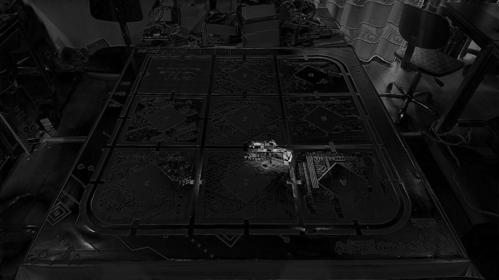 |
| **Ảnh ledOff**<br>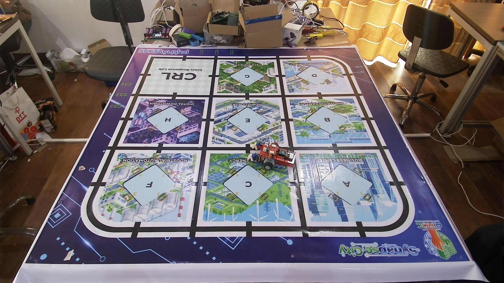 | **Ảnh nhị phân hóa**<br>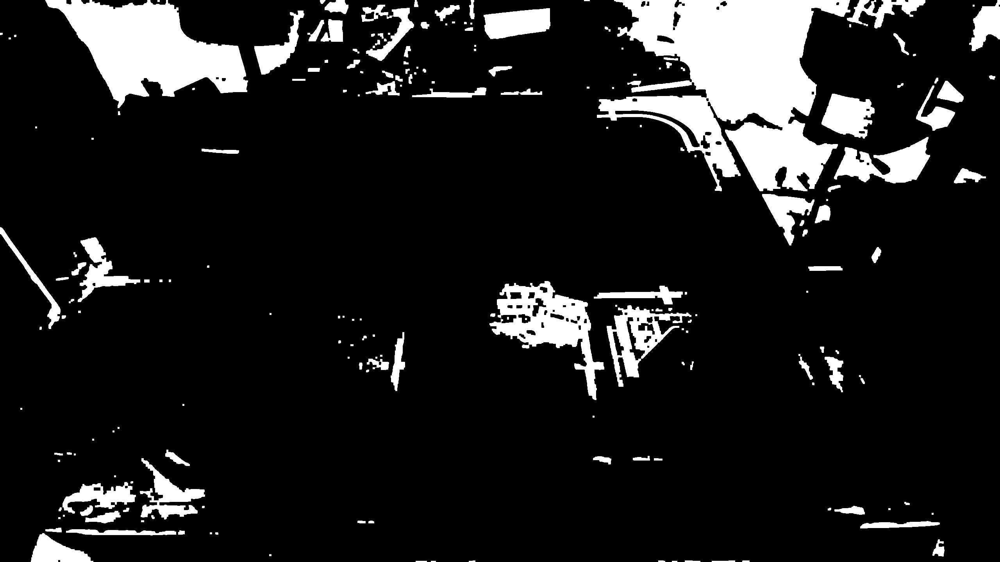 |
| | **Bounding Box**<br>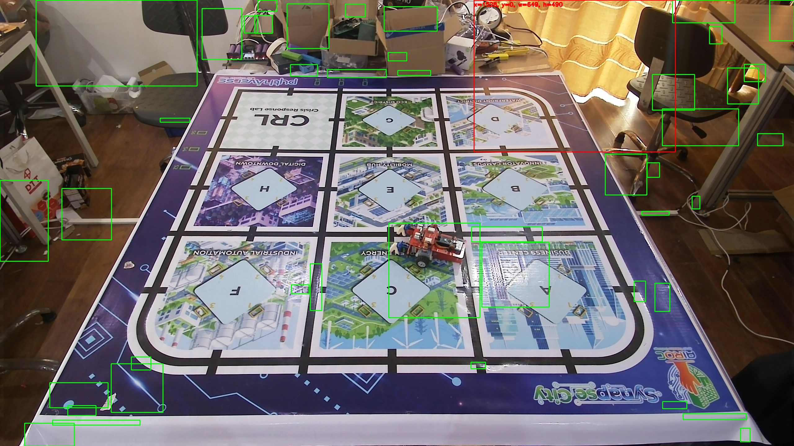 |
| | **Ảnh cắt ra**<br>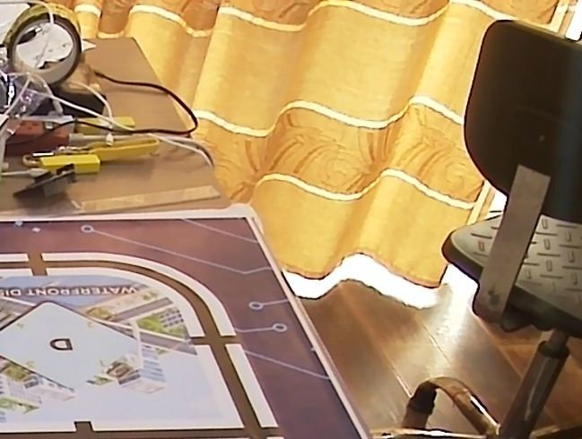 |

=> Sau khi thay đổi ảnh sáng phương pháp trừ ảnh để tìm ra BBox của Leanbot không còn chính xác. 

