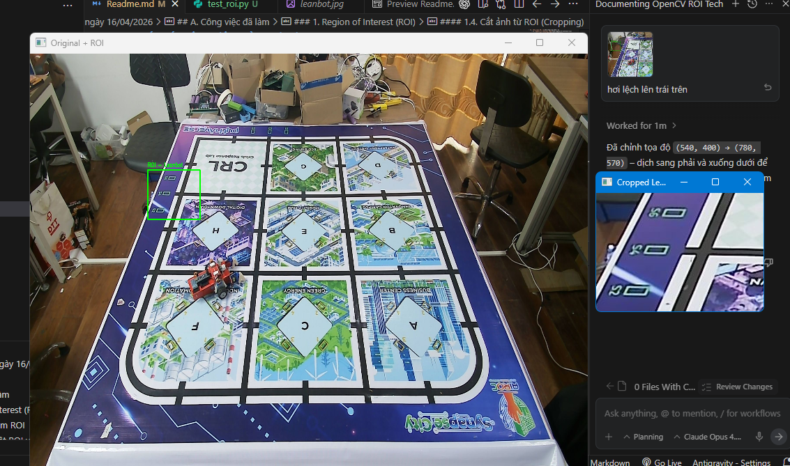
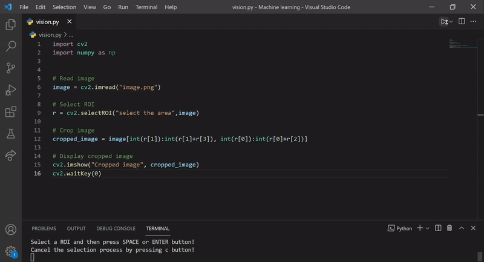
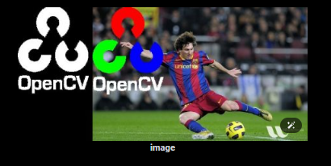

# Báo cáo công việc ngày 16/04/2026

## Mục lục
- [A. Công việc đã làm](#a-công-việc-đã-làm)
    - [1. Region of Interest (ROI)](#1-region-of-interest-roi)
        - [1.1. Khái niệm ROI](#11-khái-niệm-roi)
        - [1.2. Phân biệt ROI và Cropping](#12-phân-biệt-roi-và-cropping)
        - [1.3. Cú pháp trích xuất ROI](#13-cú-pháp-trích-xuất-roi)
        - [1.4. Cắt ảnh từ ROI (Cropping)](#14-cắt-ảnh-từ-roi-cropping)
        - [1.5. Chọn ROI tương tác (User Selective ROI)](#15-chọn-roi-tương-tác-user-selective-roi)
        - [1.6. Bitwise Operations và ROI non-rectangular](#16-bitwise-operations-và-roi-non-rectangular)
- [B. Khó khăn](#b-khó-khăn)
- [C. Tài liệu tham khảo](#c-tài-liệu-tham-khảo)
- [D. Công việc tiếp theo](#d-công-việc-tiếp-theo)

## A. Công việc đã làm
- Tìm hiểu về Region of Interest (ROI) trong OpenCV
- Tìm hiểu sự khác biệt giữa ROI và Cropping
- Tìm hiểu cách sử dụng `cv2.selectROI()` để chọn vùng ROI tương tác

### 1. Region of Interest (ROI)
#### 1.1. Khái niệm ROI
- **Region of Interest (ROI)** – hay **Vùng quan tâm** – là một phần cụ thể được chọn ra từ ảnh để tập trung xử lý, phân tích hoặc thao tác. Thay vì phải xử lý toàn bộ ảnh (tốn tài nguyên tính toán), ta chỉ cần xử lý trên vùng ROI đã được xác định trước.
- **Điểm quan trọng:** ROI là một **tham chiếu (reference/view)** đến một vùng trong ảnh gốc, **không phải** bản sao. Khi thay đổi dữ liệu trên ROI, ảnh gốc cũng bị thay đổi theo.

- **Lợi ích của việc sử dụng ROI:**

| Lợi ích | Mô tả |
| :--- | :--- |
| **Hiệu quả tính toán** | Giảm đáng kể thời gian xử lý vì chỉ cần tính toán trên vùng nhỏ thay vì toàn bộ ảnh |
| **Tăng độ chính xác** | Loại bỏ nhiễu và nền không liên quan, giảm false positive |
| **Phân tích có mục tiêu** | Cho phép lọc, đo lường hoặc phát hiện trên các vùng cụ thể của ảnh |
| **Xử lý tại chỗ** | Có thể thao tác trực tiếp trên vùng con mà không cần tạo ảnh mới |

#### 1.2. Phân biệt ROI và Cropping
- ROI và Cropping là hai khái niệm **liên quan nhưng khác nhau**:

| | **ROI (Region of Interest)** | **Cropping (Cắt ảnh)** |
| :--- | :--- | :--- |
| **Bản chất** | **Tham chiếu** (view/reference) đến một vùng trong ảnh gốc | **Trích xuất** một vùng thành ảnh mới độc lập |
| **Dữ liệu** | Không copy, dùng chung bộ nhớ với ảnh gốc | Tạo bản sao mới, chiếm thêm bộ nhớ |
| **Thay đổi** | Sửa ROI → ảnh gốc cũng bị sửa | Sửa ảnh crop → ảnh gốc không bị ảnh hưởng |
| **Mục đích** | Xử lý, phân tích, vẽ lên một vùng cụ thể | Tách ra một phần ảnh để lưu hoặc dùng riêng |

#### 1.3. Cú pháp trích xuất ROI

```python
roi = img[y_start:y_end, x_start:x_end]       # ROI – tham chiếu, không copy
cropped = img[y_start:y_end, x_start:x_end].copy()  # Cropping – bản sao độc lập
```
- `img`: mảng NumPy biểu diễn ảnh
- `y_start:y_end`: phạm vi theo chiều dọc (height)
- `x_start:x_end`: phạm vi theo chiều ngang (width)
- Khi có thêm `.copy()` thì là **Cropping** (bản sao).
- Một trong những ứng dụng của ROI là **thao tác trực tiếp trên vùng con** mà không cần cắt ảnh ra.
- Vì ROI là tham chiếu đến ảnh gốc, mọi thay đổi trên ROI sẽ **phản ánh ngay lên ảnh gốc**.

#### 1.4. Cắt ảnh từ ROI (Cropping)
- Khi cần **tách hẳn** một vùng ra khỏi ảnh gốc thành ảnh mới (để lưu file, gửi đi, hoặc xử lý riêng), ta thực hiện **Cropping** = ROI + copy.

```python
import cv2

# Đọc ảnh
img = cv2.imread("Original.png")

# Định nghĩa vùng ROI – tọa độ xác định bằng cách kiểm tra trực quan
x_start, y_start, x_end, y_end = 400, 200, 850, 700

# Cắt ảnh bằng slicing + copy để tạo bản sao độc lập
cropped_img = img[y_start:y_end, x_start:x_end].copy()

# Hiển thị ảnh gốc và ảnh đã cắt
cv2.imshow("Original Image", img)
cv2.imshow("Cropped Image", cropped_img)
cv2.waitKey(0)
cv2.destroyAllWindows()
```

- Kết quả chạy thử code test_roi.py ([https://git.pythaverse.space/thomha/Nguyen_Huu_Hoang_Anh/blob/master/260416/Region_of_Interesting/test_roi.py](Region_of_Interesting/test_roi.py)):





#### 1.5. Chọn ROI tương tác (User Selective ROI)
- Khi không biết trước tọa độ chính xác, OpenCV cung cấp hàm `cv2.selectROI()` ta chỉ cần kéo chuột để chọn vùng ROI trực tiếp trên ảnh. Sau đó có thể dùng ROI này để xử lý hoặc crop tùy nhu cầu.

```python
import cv2

img = cv2.imread("image.png")

# Cho phép người dùng chọn ROI bằng chuột
roi = cv2.selectROI("Select ROI", img, fromCenter=False, showCrosshair=True)

# roi trả về tuple (x, y, w, h)
x, y, w, h = roi

# Cắt ảnh theo tọa độ đã chọn
cropped_img = img[int(y):int(y+h), int(x):int(x+w)]

# Lưu và hiển thị
cv2.imwrite("Cropped.png", cropped_img)
cv2.imshow("Cropped Image", cropped_img)
cv2.waitKey(0)
cv2.destroyAllWindows()
```



#### 1.6. Bitwise Operations và ROI non-rectangular
- ROI thông thường chỉ thao tác trên **vùng hình chữ nhật** vì được tạo bằng slicing như `img[y1:y2, x1:x2]`. Tuy nhiên trong thực tế có nhiều đối tượng không có dạng chữ nhật, vật thể tách nền hoặc vùng cần xử lý theo biên bất kỳ. Khi đó cần kết hợp ROI với **mask** để mô tả chính xác hình dạng của vùng quan tâm.
- Trong ví dụ minh họa ở tài liệu OpenCV là chèn logo OpenCV lên ảnh nền, nếu cộng trực tiếp hai ảnh thì màu sắc sẽ bị thay đổi; nếu dùng `cv.addWeighted()` thì logo bị trong suốt. Để logo hiển thị rõ và giữ đúng biên dạng, ta tạo mask của logo và dùng các phép `bitwise` để tách nền và foreground trước khi ghép lại.

- Ví dụ minh họa em lấy trên OpenCV Documents : 

```python
import cv2 as cv

# Đọc ảnh nền và ảnh logo
img1 = cv.imread("messi5.jpg")
img2 = cv.imread("opencv-logo-white.png")

assert img1 is not None, "Không đọc được ảnh nền"
assert img2 is not None, "Không đọc được ảnh logo"

# Tạo ROI trên ảnh nền có cùng kích thước với logo
rows, cols, channels = img2.shape
roi = img1[0:rows, 0:cols]

# Tạo mask nhị phân của logo và mask nghịch đảo
img2gray = cv.cvtColor(img2, cv.COLOR_BGR2GRAY)
ret, mask = cv.threshold(img2gray, 10, 255, cv.THRESH_BINARY)
mask_inv = cv.bitwise_not(mask)

# Xóa vùng logo trên ROI nền
img1_bg = cv.bitwise_and(roi, roi, mask=mask_inv)

# Lấy đúng phần logo từ ảnh logo
img2_fg = cv.bitwise_and(img2, img2, mask=mask)

# Ghép nền và logo rồi gán lại vào ảnh gốc
dst = cv.add(img1_bg, img2_fg)
img1[0:rows, 0:cols] = dst

cv.imshow("mask", mask)
cv.imshow("img1_bg", img1_bg)
cv.imshow("img2_fg", img2_fg)
cv.imshow("result", img1)
cv.waitKey(0)
cv.destroyAllWindows()
```


- **Phân tích code ví dụ :**
- `roi = img1[0:rows, 0:cols]`: lấy một ROI hình chữ nhật trên ảnh nền có kích thước bằng ảnh logo. ROI này chỉ là vùng làm việc ban đầu.
- `mask`: là ảnh nhị phân, trong đó phần logo có giá trị trắng và phần nền có giá trị đen. Chính mask này mới quyết định **hình dạng không chữ nhật** của vùng cần ghép.
- `mask_inv`: là mask đảo, dùng để giữ lại phần nền trong ROI sau khi loại bỏ vị trí logo.
- `img1_bg = cv.bitwise_and(roi, roi, mask=mask_inv)`: giữ phần nền của ROI, đồng thời làm đen vị trí logo.
- `img2_fg = cv.bitwise_and(img2, img2, mask=mask)`: chỉ lấy phần logo cần chèn, bỏ nền của ảnh logo.
- `dst = cv.add(img1_bg, img2_fg)`: ghép phần nền và logo lại với nhau, sau đó gán kết quả về ảnh gốc.

- **Kết luận:** non-rectangular ROI trong OpenCV thường được xử lý theo hướng: dùng ROI để giới hạn khu vực thao tác, sau đó dùng `mask + bitwise` để xác định đúng hình dạng cần giữ hoặc cần chèn. Đây là kỹ thuật quan trọng khi làm việc với logo, segmentation mask, vùng vật thể hoặc các bài toán overlay ảnh có biên dạng bất kỳ.

## B. Khó khăn
- Em nghĩ ko cần thiết phải ứng dụng thêm phương pháp non-rectangular ROI vì ta có thể dùng chuột để click các tọa độ điểm ảnh của Sa bàn rồi dùng phương pháp ROI thông thường để xử lý được ạ 
## C. Tài liệu tham khảo
1. **OpenCV Official** – [Cropping an Image Using OpenCV](https://opencv.org/cropping-an-image-using-opencv/)
2. **OpenCV Official** – [Pixel Level Image Manipulation](https://opencv.org/blog/pixel-level-image-manipulation-using-opencv/)
3. **GeeksforGeeks** – [OpenCV selectROI function](https://www.geeksforgeeks.org/python-opencv-selectroi-function/)

## D. Công việc tiếp theo
- Ứng dụng ROI vào các phép Subtract Images, Aglinment (ECC) và khảo sát độ phân giải của ảnh output.
