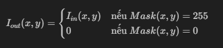
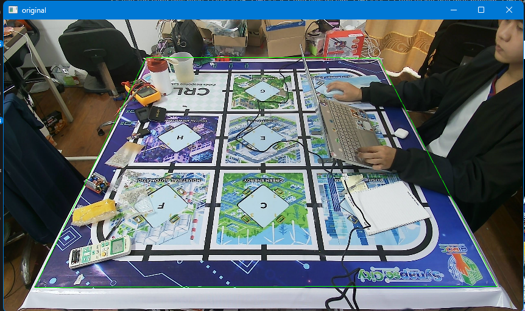
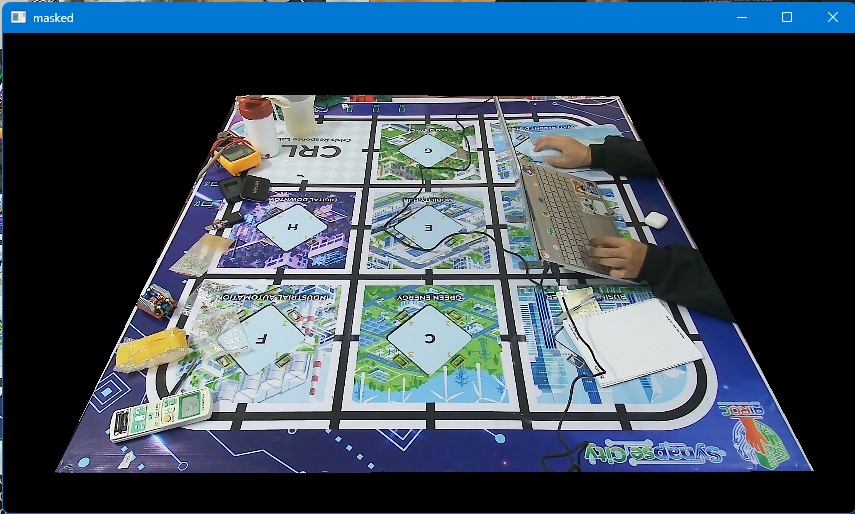
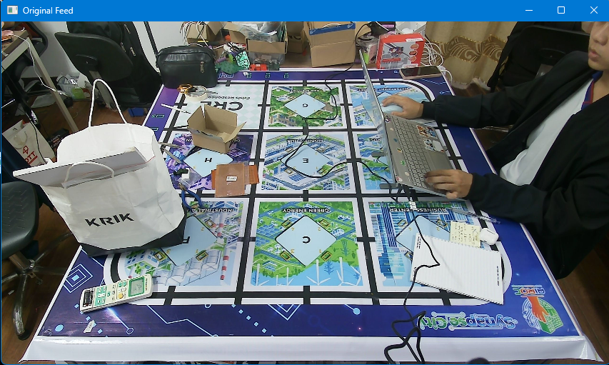
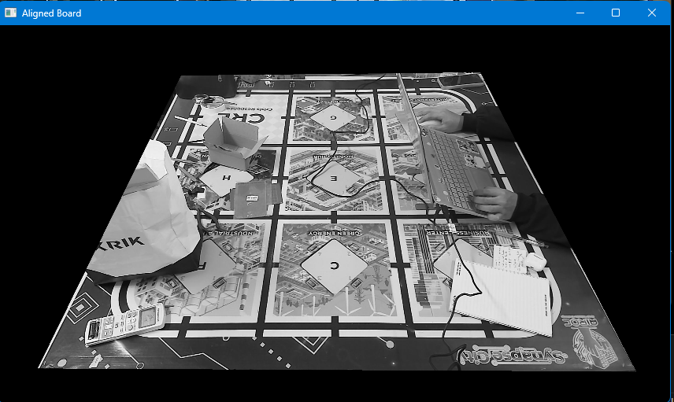
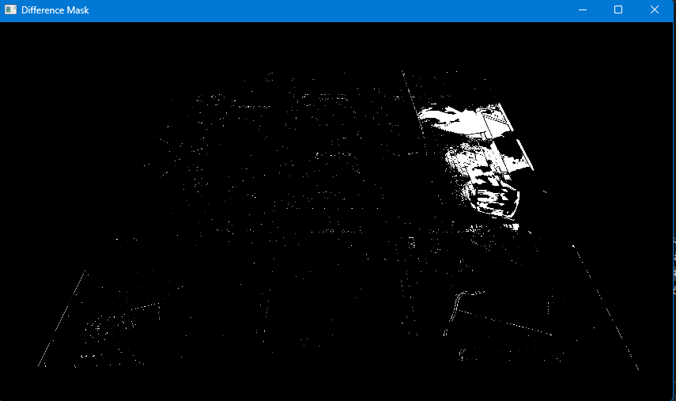

# Báo cáo công việc ngày 17/04/2026

## Mục lục
- [A. Công việc đã làm](#a-công-việc-đã-làm)
    - [1. Phương pháp Polygon Masking](#1-phương-pháp-polygon-masking)
        - [1.1. Mục tiêu và Giải pháp](#11-mục-tiêu-và-giải-pháp)
        - [1.2. Bản chất toán học của Mask và Bitwise AND](#12-bản-chất-toán-học-của-mask-và-bitwise-and)
        - [1.3. Bảng chân lý Bitwise Operations](#13-bảng-chân-lý-bitwise-operations)
    - [2. Hướng ý tưởng triển khai thực tế](#2-hướng-ý-tưởng-triển-khai-thực-tế)
    - [2. Bộ công cụ Alignment_ECC](#2-bộ-công-cụ-alignment_ecc)
- [B. Khó khăn](#b-khó-khăn)
- [C. Tài liệu tham khảo](#c-tài-liệu-tham-khảo)
- [D. Công việc tiếp theo](#d-công-việc-tiếp-theo)

---

## A. Công việc đã làm
- Tìm hiểu và triển khai phương pháp xác định vùng sa bàn bằng **Polygon Mask**, **Bitwise** .
- Tạo bộ công cụ **Alignment_ECC** để căn chỉnh ảnh, tính toán thời gian và kiểm tra độ phân giải ảnh Output.
### 1. Phương pháp Polygon Masking

#### 1.1. Mục đích
*   **Mục tiêu**: Loại bỏ các vùng dư thừa ngoài sa bàn (người, đồ vật, nhiễu sáng) để tập trung xử lý AI trên một vùng hình thang cố định.
*   **Giải pháp**: Sử dụng một mảng nhị phân làm "mặt nạ" (Mask):
    - **Giá trị 255 (Trắng)**: Vùng sa bàn cần giữ lại.
    - **Giá trị 0 (Đen)**: Vùng nền cần loại bỏ.

#### 1.2. Bản chất của Mask và Bitwise AND
Phép toán `cv2.bitwise_and` thực hiện tính toán trên từng cặp pixel giữa ảnh đầu vào 



Về mặt logic, chỉ những điểm ảnh mà cả ảnh gốc và Mask đều có giá trị (bit 1) mới được giữ lại ở ảnh đầu ra.

#### 1.3. Bảng chân lý Bitwise Operations
Bảng dưới đây mô tả logic pixel khi thực hiện phép Bitwise giữa Ảnh gốc (X) và Mask (Y):

| X (Pixel ảnh) | Y (Pixel Mask) | AND (Kết quả) | Giải thích thực tế |
| :---: | :---: | :---: | :--- |
| 0 | 0 | 0 | Điểm đen ngoài Mask -> Đen |
| 0 | 1 | 0 | Điểm đen trong Mask -> Đen |
| 1 | 0 | 0 | **Vùng có màu ngoài Mask -> Bị xóa (Đen)** |
| 1 | 1 | 1 | **Vùng có màu trong Mask -> Giữ nguyên** |

#### 1.4. Hướng ý tưởng triển khai thực tế

- **Bước 1: Chọn tọa độ**: Click chuột 4 góc sa bàn để chọn vùng mask
- **Bước 2: Tạo mặt nạ**: Dùng `cv2.fillPoly()` để tô trắng vùng hình thang từ 4 góc đã chọn, phần còn lại sẽ đen hoàn toàn.
- **Bước 3: Áp dụng mask đã tạo**: Áp dụng lệnh `masked = cv2.bitwise_and(frame, frame, mask=mask)` cho mọi frame ảnh từ Cam

#### 1.5. Code và kết quả thực nghiệm
##### a. Code 
- Link Code: [https://git.pythaverse.space/thomha/Nguyen_Huu_Hoang_Anh/blob/master/260417/Mask%20ROI/mask_roi.py](https://git.pythaverse.space/thomha/Nguyen_Huu_Hoang_Anh/blob/master/260417/Mask%20ROI/mask_roi.py)
- **Chi tiết các hàm xử lý thuật toán:**

##### a. Hàm xử lý sự kiện chuột (Tọa độ và Tỉ lệ)
Hàm này chịu trách nhiệm nhận tương tác từ người dùng và tự động tính toán lại tọa độ thực trên ảnh gốc 2K dựa vào tỉ lệ thu nhỏ `scale`. Phần này do ảnh 2k kích thước lớn quá nên tràn màn hình nên em phải thu nhỏ lại để dễ quan sát và chọn điểm ạ.
```python
def mouse_callback(event, x, y, flags, param):
    global points
    scale = param # Tỉ lệ thu nhỏ
    if event == cv2.EVENT_LBUTTONDOWN:
        if len(points) < 4:
            # Ánh xạ tọa độ click về tọa độ ảnh gốc 2K
            real_x, real_y = int(x * scale), int(y * scale)
            points.append((real_x, real_y))
            print(f"[INFO] Point {len(points)} = ({real_x}, {real_y})")
```

##### b. Hàm khởi tạo mặt nạ vùng chọn (Polygon Mask)
Sử dụng mảng NumPy để tạo nền đen và hàm `fillPoly` của OpenCV để vẽ đa giác trắng khép kín từ 4 điểm đã chọn.
```python
def build_mask(frame_shape, pts):
    # Tạo mảng đen toàn phần cùng kích thước ảnh gốc
    mask = np.zeros(frame_shape[:2], dtype=np.uint8)
    # Tô trắng (255) vùng đa giác xác định bởi 4 điểm pts
    cv2.fillPoly(mask, [pts], 255)
    return mask
```

##### c. Áp dụng Mask vào luồng video (Bitwise Process)
Sử dụng phép toán Bitwise AND để lọc ảnh. Chỉ những Pixel nằm trong vùng trắng của mặt nạ mới được giữ lại giá trị ảnh gốc.
```python
# Thực thi trong vòng lặp xử lý frame
masked = cv2.bitwise_and(frame, frame, mask=mask)
```
#### 3.2. Kết quả sau khi Mask
- **Ảnh gốc sau khi chọn các điểm để tạo mask**



- **Ảnh sau khi Mask**



### 2. Bộ công cụ Alignment_ECC
- Mục đích : tạo các hàm để căn chỉnh ảnh, tính toán thời gian và kiểm tra độ phân giải ảnh Output. Sau này chỉ cần import lại công cụ là dùng được. 
- Link code : [https://git.pythaverse.space/thomha/Nguyen_Huu_Hoang_Anh/blob/master/260417/tools/alignment.py](https://git.pythaverse.space/thomha/Nguyen_Huu_Hoang_Anh/blob/master/260417/tools/alignment.py)
- Các hàm chính trong code Alignment:
    - `preprocessing` : tiền xử lý ảnh, làm mượt ảnh, tăng cường độ tương phản, tính toán thời gian xử lí.
        ```python 
            def preprocess(gray):
                """Standard preprocessing: CLAHE and Gaussian Blur."""
                start = time.perf_counter()
                clahe = cv2.createCLAHE(clipLimit=2.0, tileGridSize=(8, 8))
                gray = clahe.apply(gray)
                gray = cv2.GaussianBlur(gray, (5, 5), 0)
                end = time.perf_counter()
                print(f"preprocess: {(end - start)*1000:.2f} ms")
                return gray
        ```
    - `set_template`: Thiết lập ảnh nền mốc và tiền xử lý (CLAHE, Blur) cho ảnh mốc (backGround).
        ```python
            
                def set_template(self, img):
        """Sets and preprocesses the reference template image."""
        start = time.perf_counter()
        if len(img.shape) == 3:
            self.template_gray = cv2.cvtColor(img, cv2.COLOR_BGR2GRAY)
        else:
            self.template_gray = img.copy()
        
        self.template_preprocessed = self.preprocess(self.template_gray)
        
        # Reset warp matrix for new template
        if self.motion_type == cv2.MOTION_HOMOGRAPHY:
            self.warp_matrix = np.eye(3, 3, dtype=np.float32)
        else:
            self.warp_matrix = np.eye(2, 3, dtype=np.float32)
        
        end = time.perf_counter()
        print(f"set_template: {(end - start)*1000:.2f} ms")
        ```

    - `align`: Thực hiện căn chỉnh ECC giữa ảnh hiện tại và ảnh nền, tính toán thời gian xử lí.
        ```python
            start = time.perf_counter()
            (cc, warp) = cv2.findTransformECC(
                self.template_preprocessed,
                target_p,
                self.warp_matrix.copy(),
                self.motion_type,
                self.criteria
            )
            end = time.perf_counter()
        ```
    - `compute_diff`: Tính toán sai khác pixel và tạo Mask nhị phân để kiểm tra độ chính xác sau khi căn chỉnh, cũng có thể dùng để thử Detect vật thể xuất hiện so với backGround ban đầu.
        ```python
            def compute_diff(ref_gray, test_gray, threshold=25):
                """Computes absolute difference and binary mask."""
                start = time.perf_counter()
                diff = cv2.absdiff(ref_gray, test_gray)
                _, mask = cv2.threshold(diff, threshold, 255, cv2.THRESH_BINARY)
                
                nonzero = int(np.count_nonzero(mask))
                mean_val = float(diff.mean())
                end = time.perf_counter()
                print(f"compute_diff: {(end - start)*1000:.2f} ms")
                
                return diff, mask, nonzero, mean_val
        ```

### 3. Triển khai thực tế Pipeline tổng hợp (ROI + Alignment)
- Link code chính: [https://git.pythaverse.space/thomha/Nguyen_Huu_Hoang_Anh/blob/master/260417/tools/polygon_roi_align.py](https://git.pythaverse.space/thomha/Nguyen_Huu_Hoang_Anh/blob/master/260417/tools/polygon_roi_align.py)

- **Quy trình thực hiện:**
    - **Bước 1 (Interactive Masking)**: Khi chạy script, chương trình sẽ yêu cầu người dùng click chọn 4 góc sa bàn.
    - **Bước 2 (Registration)**: Nạp ảnh nền mốc (background) vừa cắt lấy ở bước 1 vào thư viện để làm điểm tựa căn chỉnh.
    - **Bước 3 (Real-time Alignment)**: Với mọi frame tiếp theo từ Camera, chương trình **sử dụng Mask đã được tạo từ hàm `build_mask`** kết hợp với `bitwise_and` để cắt lấy vùng sa bàn, sau đó gọi hàm `align` để bù đắp rung lắc.
    - **Bước 4 (Evaluation)**: Tính toán sai số `compute_diff` thời gian thực và hiển thị trực quan 3 cửa sổ (Ảnh gốc, Sa bàn đã căn chỉnh, Vùng pixel bị lệch).
- Kết quả thu được:
    - Log debug tại bước 2 - set_template: 
        ```--- STEP 2: BACKGROUND REGISTRATION ---
            preprocess: 18.61 ms
            set_template: 23.33 ms
            Background registered successfully.
        ```
    - Log debug tại bước 3 - align: 
        ```--- STEP 3: REAL-TIME PIPELINE STARTED ---
        Press 'q' or 'ESC' to exit.
        preprocess: 13.87 ms
        align (ECC calculation): 453.82 ms
        compute_diff: 7.12 ms
        ```
    - **Kết Luận** : với mỗi Frame ảnh xử lí thời gian bị delay như sau :
        - Tiền xử lí ảnh : làm mờ Gaussion + CLAHE mất khoảng 13-15ms
        - Căn chỉnh ảnh Alignment ECC: mất khoảng 450-500ms , cái này tùy thuộc vào độ phân giải của ảnh, vòng lặp và điều kiện dừng của thuật toán căn chỉnh ECC. Em đã thửu giảm vòng lặp căn chỉnh  từ 200 xuống 50 nhưng kết quả không cải thiện ( ban đầu là 900ms cho vòng lặp 200).
        - Tính toán sai số ( Substract images): mất khoảng 7-10ms 

- Ảnh kết quả
    - **Ảnh gốc ban đầu**

       

    - **Ảnh đã cắt lấy Mask để xử lí**

    

    - **Ảnh so sánh sai khác so với ảnh nền (background) sau khi đã lấy mask + căn chỉnh**

    

## B. Khó khăn
- Hiện tại em đang chưa hiểu hưởng đi tổng thể cho lắm ạ :
    - Trước đó Thầy có bảo em tìm hiểu về các phương pháp chọn vùng hình thang của Sa bàn rồi nắn thẳng về hình vuông và chỉ cần xử lí trên hình vuông đó, nhưng giờ lại quay về bài toán chọn vùng hình thang của sa bàn trên ảnh rồi xử lí trên hình thang ạ.
    - Ngoài ra em vẫn chưa hình dung được output của bước chuẩn bị phần cơ sở xử lý ảnh để đi vào phần AI ạ. Kiểu cần phải xử lý đến mức nào thì được ạ? 
- Em nghĩ là sẽ có hạn chế nữa là khi mình chọn mask rồi, mà nếu sa bàn bị xê dịch một chút thì sẽ bị cắt mất một chút và mất thông tin để Alignment lại ạ. 
- Em đã thử test thuật toán căn chỉnh ECC alignment trong quá trình Stream cam và thấy thời gian mất quá nhiều dẫn tới giật lag mạnh ạ. 
---
## C. Tài liệu tham khảo
1. **Viblo** – [Arithmetic Operations on Images with OpenCV](https://viblo.asia/p/arithmetic-operations-on-images-with-opencv-gDVK2denlLj#_bitwise-operations-4)
2. **OpenCV Documentation** – [Image Bitwise Operations](https://docs.opencv.org/4.x/d0/d86/tutorial_py_image_arithmetics.html)

---

## D. Công việc tiếp theo
- Khảo sát độ phân giải của ảnh Output sau khi Mask + alignme