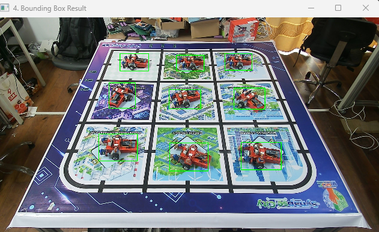

# Auto Label Tool Guidance

## 1. Mục đích (Purpose)

`tools/auto_label.py` là tool dùng để tự động tạo ảnh dataset và file label YOLO cho Leanbot trên sa bàn.

Ý tưởng chính của tool:

1. Chụp một ảnh nền khi trên bàn chưa có Leanbot.
2. Chọn vùng ROI của sa bàn bằng 4 điểm góc để bỏ qua các vùng không cần xử lý.
3. Chụp nhiều ảnh có Leanbot ở các vị trí hoặc tư thế khác nhau.
4. Căn chỉnh từng ảnh mới với ảnh nền bằng ECC alignment để giảm sai lệch do rung hoặc lệch camera.
5. Trừ nền, nhị phân hóa và xử lý hình thái học để tách Leanbot ra khỏi nền.
6. Tìm contour, tạo bounding box và lưu label theo chuẩn YOLO.

Tool phù hợp khi:

- Camera đặt cố định.
- Sa bàn và nền tương đối ổn định.
- Muốn tạo dataset nhanh cho một class duy nhất, ví dụ `Leanbot`.

## 2. Các tool và module được import

Trong `tools/auto_label.py`, tool hiện đang import 2 nhóm chính:

### 2.1. Tool nội bộ trong project

- `alignment.py`
  Cung cấp class `ImageAligner`, dùng để căn chỉnh ảnh hiện tại với ảnh nền bằng thuật toán ECC trước khi trừ nền.
- `mask_roi.py`
  Cung cấp `select_four_points` để chọn 4 góc ROI và `build_mask` để tạo mask cho vùng sa bàn cần xử lý.

Đây là 2 file hỗ trợ trực tiếp cho toàn bộ pipeline auto label.

### 2.2. Thư viện ngoài và module Python

- `cv2`
  Dùng để mở camera, hiển thị cửa sổ preview, xử lý ảnh, threshold, morphology, contour và vẽ bounding box.
- `numpy`
  Dùng để lưu ma trận điểm, tạo mask và thao tác dữ liệu ảnh.
- `argparse`
  Dùng để đọc tham số dòng lệnh như `--source`, `--mode`, `--threshold`, `--merge_dist`.
- `sys`
  Dùng để thêm thư mục hiện tại vào `sys.path` nhằm import được các file nội bộ như `alignment.py` và `mask_roi.py`.
- `datetime`
  Dùng để tạo tên session theo thời gian, ví dụ `session_20260420_113523`.
- `pathlib.Path`
  Dùng để quản lý đường dẫn thư mục và file theo kiểu đối tượng, dễ thao tác hơn string thuần.
- `os`
  Được import để phục vụ thao tác hệ thống file; trong phiên bản hiện tại gần như chưa dùng trực tiếp.
- `time`
  Được import để phục vụ log hoặc đo thời gian; trong phiên bản hiện tại gần như chưa dùng trực tiếp trong `auto_label.py`.

### 2.3. Tool liên quan nhưng không import trực tiếp

- `tools/check_yolo_label.py`
  Đây không phải là module được `auto_label.py` import trực tiếp. Nó là tool chạy độc lập sau bước sinh label để kiểm tra lại file YOLO và vẽ preview bounding box.

## 3. Chuẩn đầu ra

Mỗi ảnh được tool chấp nhận sẽ sinh ra:

- Một ảnh đã align trong thư mục `output/datasets/images`
- Một file nhãn trong thư mục `output/datasets/labels`

Định dạng label là chuẩn YOLO normalized:

```text
<class_id> <x_center> <y_center> <width> <height>
```

Trong đó các giá trị tọa độ đều nằm trong khoảng `0 -> 1`.

Ví dụ:

```text
0 0.495312 0.791319 0.120313 0.134028
0 0.759766 0.759722 0.124219 0.116667
```

## 4. Điều kiện nên chuẩn bị trước khi chạy

- Cài Python và các thư viện tối thiểu: `opencv-python`, `numpy`
- Đặt camera đủ ổn định, hạn chế rung hoặc đổi góc nhìn giữa các lần chụp
- Nền sáng, ánh sáng tương đối đều để bước trừ nền ổn định hơn
- Chạy lệnh từ thư mục gốc của project:

```powershell
cd D:\PTIT\DTT\Nguyen_Huu_Hoang_Anh\260420
```

## 5. Cú pháp cơ bản

```powershell
python tools/auto_label.py --source 0 --mode capture
```

Trong đó:

- `--source`: chỉ số camera như `0`, `1`, hoặc đường dẫn tới video/file stream nếu cần
- `--mode capture`: tạo session mới, chụp ảnh thô và sinh dataset
- `--mode relabel`: không chụp lại, chỉ dùng dữ liệu thô đã có để sinh lại label với bộ tham số mới

## 6. Các lệnh hay dùng

### 6.1. Tạo session mới và chụp dữ liệu

```powershell
python tools/auto_label.py --source 0 --mode capture
```

### 6.2. Dùng lại background và ROI của session gần nhất

```powershell
python tools/auto_label.py --source 0 --mode capture --reuse
```

Lệnh này hữu ích khi:

- Camera vẫn giữ nguyên vị trí
- Sa bàn không thay đổi
- Muốn chụp thêm dữ liệu nhưng không muốn chọn lại ROI và chụp lại background

### 6.3. Sinh lại label cho toàn bộ session đã lưu với tham số mới

```powershell
python tools/auto_label.py --mode relabel --threshold 90 --min_area 800 --merge_dist 30
```

Lệnh này hữu ích khi:

- Label sinh ra lần trước chưa đẹp
- Muốn tinh chỉnh `threshold`, `min_area`, `merge_dist`, `min_width`, `min_height`
- Không muốn chụp lại dữ liệu gốc

## 7. Quy trình chạy ở chế độ `capture`

### Bước 1. Chụp background

Sau khi chạy lệnh, cửa sổ camera sẽ mở ra.

- Nhấn `c` để chụp ảnh nền
- Nhấn `q` để thoát

Ảnh nền là ảnh sa bàn khi chưa có Leanbot.

### Bước 2. Chọn 4 điểm ROI của sa bàn

Sau khi chụp background, tool sẽ yêu cầu chọn 4 góc của vùng cần xử lý.

- Click chuột trái để chọn từng điểm
- Nhấn `Enter` để xác nhận khi đã đủ 4 điểm
- Nhấn `c` để xóa các điểm đã chọn và chọn lại
- Nhấn `q` hoặc `Esc` để hủy


### Bước 3. Chụp ảnh thô có Leanbot

Khi vào chế độ chụp loạt:

- Nhấn `c` để lưu một ảnh thô vào session hiện tại
- Nhấn `s` để dừng chụp và bắt đầu xử lý toàn bộ ảnh vừa lưu
- Nhấn `q` để thoát

Nên thay đổi vị trí hoặc góc quay của Leanbot giữa các lần chụp để dataset đa dạng hơn.

### Bước 4. Tool tự xử lý ảnh và sinh label

Với mỗi ảnh thô, tool sẽ thực hiện chuỗi xử lý:

1. Apply ROI mask lên vùng sa bàn
2. Align ảnh hiện tại với background bằng ECC
3. Gaussian blur để giảm nhiễu
4. Trừ nền và threshold để lấy vùng khác biệt
5. Morphology open, dilate, close và fill holes
6. Tìm contour hợp lệ theo diện tích, chiều rộng, chiều cao
7. Gộp các bbox gần nhau
8. Lưu ảnh đã align và file label YOLO

Trong lúc chạy, tool sẽ hiển thị thêm các cửa sổ preview để quan sát:

- Difference Mask
- Bounding Box Result




Khi tool chạy xong, nhấn một phím bất kỳ trong cửa sổ OpenCV để đóng chương trình.

## 8. Chế độ `relabel` dùng khi nào

`relabel` sẽ quét toàn bộ thư mục `output/sessions`, đọc lại:

- `config/background.jpg`
- `config/board_points.npy`
- các ảnh trong `raw_images`

Sau đó tool xử lý lại từ đầu và cập nhật dữ liệu trong:

- `output/datasets/images`
- `output/datasets/labels`

Nói ngắn gọn, `relabel` giúp tinh chỉnh thuật toán mà không cần chụp lại ảnh.

## 9. Ý nghĩa các tham số quan trọng

- `--threshold`: ngưỡng khác biệt sáng tối khi trừ nền. Giảm giá trị này nếu Leanbot bị mất nét hoặc thiếu phần thân; tăng nếu nhiễu quá nhiều.
- `--min_area`: loại contour quá nhỏ. Giảm nếu tool bỏ sót vật thể nhỏ.
- `--max_area`: loại contour quá lớn. Giữ ở mức cao để tránh bắt trúng cả vùng nền lớn.
- `--min_width`, `--min_height`: lọc bbox quá nhỏ.
- `--max_width`, `--max_height`: lọc bbox quá lớn hoặc lỗi gộp vùng.
- `--merge_dist`: khoảng cách để gộp các bbox gần nhau. Tăng nếu một Leanbot bị tách thành nhiều box; giảm nếu nhiều Leanbot bị dính thành một box.
- `--class_id`: class ID được ghi vào file label. Hiện tại toàn bộ box trong một lần chạy sẽ dùng cùng một class ID.

## 10. Cấu trúc thư mục sinh ra

```text
output/
|-- datasets/
|   |-- images/
|   |   |-- session_20260420_113523_img_000.jpg
|   |   `-- ...
|   `-- labels/
|       |-- session_20260420_113523_img_000.txt
|       `-- ...
`-- sessions/
    `-- session_YYYYMMDD_HHMMSS/
        |-- config/
        |   |-- background.jpg
        |   `-- board_points.npy
        `-- raw_images/
            |-- raw_000.jpg
            `-- ...
```

Ý nghĩa:

- `sessions/.../config`: lưu cấu hình của từng lần chụp
- `sessions/.../raw_images`: lưu ảnh gốc chưa xử lý
- `datasets/images`: ảnh đầu ra đã align, dùng để train
- `datasets/labels`: label YOLO tương ứng với ảnh train

## 11. Cách kiểm tra label sau khi sinh

Project đã có sẵn tool kiểm tra label:

```powershell
python tools/check_yolo_label.py
```

Hoặc kiểm tra chặt hơn:

```powershell
python tools/check_yolo_label.py output/datasets/labels --strict
```

Tool này sẽ:

- Đọc label YOLO
- Tìm ảnh tương ứng
- Vẽ lại bounding box lên ảnh
- Báo các lỗi như sai số cột, bbox vượt biên hoặc bbox bất thường

Ảnh kiểm tra sẽ được lưu trong thư mục `preview_checks`.

## 12. Một số lưu ý thực tế

- Nếu đổi vị trí camera hoặc đổi bố cục sa bàn, nên chụp background mới thay vì dùng `--reuse`.
- Nếu vật thể bị phản sáng hoặc có màu gần giống nền, bbox có thể bị thiếu một phần thân.
- Nếu nền có nhiều thay đổi ánh sáng giữa các ảnh, mask sai khác sẽ bị nhiễu.
- Nếu nhiều Leanbot đứng quá gần nhau, tool có thể gộp nhầm thành một bbox lớn.
- Tool hiện phù hợp nhất với bài toán một class duy nhất. Nếu cần nhiều class, cần mở rộng thêm logic gán nhãn.

## 13. Gợi ý tinh chỉnh nhanh

- Bị mất một phần Leanbot: giảm `--threshold`, giảm `--min_area`, tăng nhẹ `--merge_dist`
- Bị bắt nhiều nhiễu nhỏ: tăng `--threshold`, tăng `--min_area`
- Một Leanbot bị tách thành nhiều bbox: tăng `--merge_dist`
- Nhiều Leanbot bị dính thành một bbox: giảm `--merge_dist`

## 14. Tóm tắt ngắn

`auto_label.py` là tool tạo dataset YOLO bán tự động dựa trên ảnh nền, ROI sa bàn, alignment và trừ nền. Quy trình sử dụng thực tế là:

1. Chụp background
2. Chọn ROI
3. Chụp nhiều ảnh Leanbot
4. Để tool tự sinh ảnh train và file label
5. Kiểm tra lại bằng `check_yolo_label.py`
