# Báo cáo công việc ngày 20/04/2026

## Mục lục
- [A. Công việc đã làm](#a-công-việc-đã-làm)
    - [1. Tạo tools Auto Label](#1-tạo-tools-auto-label)
    - [2. Train thử nghiệm](#2-train-thử-nghiệm)
    - [3. Tìm hiểu không gian màu HSV và Substract image dùng HSV ColorSpace](#3-tìm-hiểu-không-gian-màu-hsv-và-substract-image-dùng-hsv-colorspace)
        - [3.1. Không gian màu HSV](#31-không-gian-màu-hsv)
        - [3.2. Thử nghiệm HSV trong Subtract images](#32-thử-nghiệm-hsv-trong-subtract-images)
- [B. Khó khăn](#b-khó-khăn)
- [C. Công việc tiếp theo](#c-công-việc-tiếp-theo)

## A. Công việc đã làm
- Tạo tool Auto label, sử dụng nhiều Leanbot để lấy mẫu cùng lúc
- Tiến hành train thử nghiệm tập datasets vừa tạo bằng tool Auto_label.py 
- Tìm hiểu không gian màu HSV và Substract image dùng HSV

### 1. Tạo tools Auto Label
- **Mục đích**: Tự động tách cùng lúc nhiều Leanbot ra khỏi Backgroud, tính toán Bounding Box và tạo file Label cho các Class Leanbot.
- **Link code**: [https://git.pythaverse.space/thomha/Nguyen_Huu_Hoang_Anh/blob/master/260420/tools/auto_label.py](https://git.pythaverse.space/thomha/Nguyen_Huu_Hoang_Anh/blob/master/260420/tools/auto_label.py)
- **Các bước thực hiện**

    - **Bước 1**: Chụp ảnh BackGround trắng (chưa có Leanbot), click chuột vào 4 góc để lấy Mask xử lí, tính toán.

    

    - **Bước 2**: Chụp ảnh có 9 Leanbot tại 9 trường hợp khác nhau -> căn chỉnh Alignment, CLAHE, Gaussian Blur -> Trừ ảnh với BackGround -> Tính countor, bounding box.

    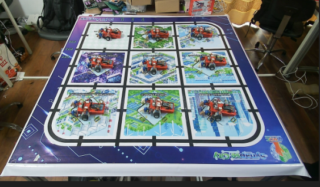

    - **Bước 3**: Tạo file label cho từng Leanbot.
    Ảnh sau khi xử lý sẽ được lưu vào thư mục `output/datasets/images` và `output/datasets/labels`.
    Định dạng file label là chuẩn **YOLO Normalized**:
    `<class_id> <x_center> <y_center> <width> <height>`
    *(Trong đó các tọa độ đều được chuẩn hóa về khoảng 0-1)*
    
- Kết quả :
    - Sau khi chạy tools bằng lệnh ```python tools/auto_label.py --source 1(tùy thuộc vào index mà camera được nhận)``` --> capture backgroud --> chọn Board ROI --> capture ảnh có Leanbot --> căn chỉnh Alignment --> thì ảnh Preview quá trình xử lý sẽ hiện lên như sau:
        - Ảnh tính toán sai khác, nhị phân hóa, tìm coutor:

        

        - Ảnh tìm Bounding box

        

    - file label sau khi chụp cho 9 Leanbot :
    ```
    0 0.495312 0.791319 0.120313 0.134028
    0 0.759766 0.759722 0.124219 0.116667
    0 0.595313 0.489236 0.092969 0.104861
    0 0.404883 0.481250 0.092578 0.106944
    0 0.744141 0.368403 0.059375 0.121528
    0 0.417773 0.300694 0.055859 0.108333
    0 0.575000 0.287847 0.054688 0.103472
    0 0.675781 0.152431 0.050000 0.063194
    0 0.508984 0.147917 0.065625 0.072222
    ```
### 2. Train thử nghiệm
- Sau khi có được tập datasets, tiến hành train thử nghiệm bằng Colab. 
- Link code colab : [https://git.pythaverse.space/thomha/Nguyen_Huu_Hoang_Anh/blob/master/260420/train_yolov8_colab.ipynb](https://git.pythaverse.space/thomha/Nguyen_Huu_Hoang_Anh/blob/master/260420/train_yolov8_colab.ipynb)
- Kết quả khi train :
    - Đối với tập dữ liệu train 10 ảnh, validate 3 ảnh, mỗi ảnh có 9 leanbot ở các tư thế khác nhau.
    - Bảng đánh giá tỉ lệ phán đoán nhầm lẫn 

    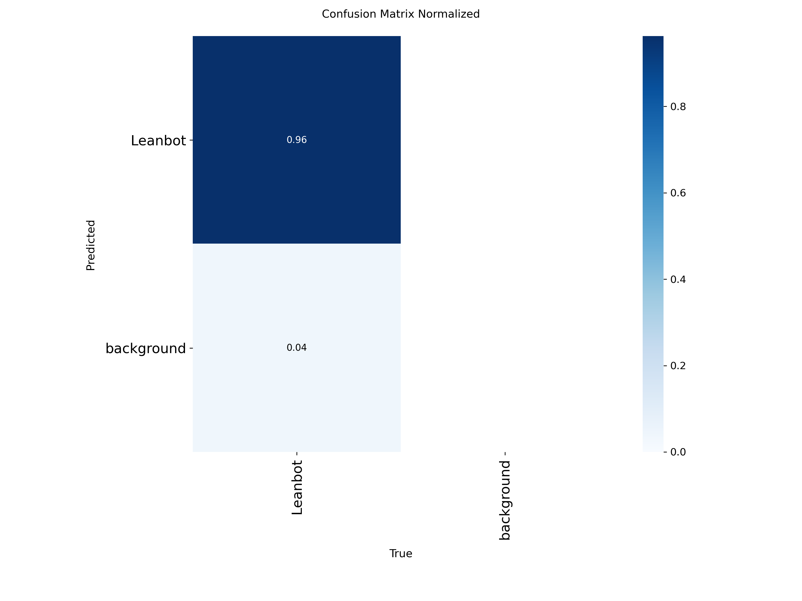

    - Đồ thị đánh giá độ tự tin dự đoán 

    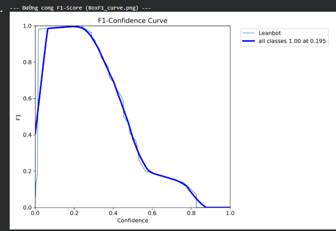

    - Detect thực tế tại 3 ảnh đánh giá model - Validation

    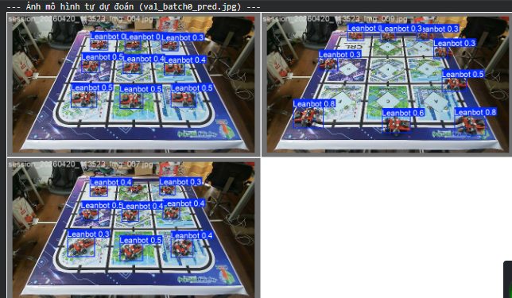

    - **Nhận xét** : qua các kết quả đánh giá, đối với tập dữ liệu 10 ảnh ( tương đương 90 mẫu Leanbot ) thì khả năng dự đoán của model chưa cao, độ tự tin thấp, tuy nhiên chỉ có 1 Class là Leanbot nên không có sự nhầm lẫn.

### 3. Tìm hiểu không gian màu HSV và Substract image dùng HSV ColorSpace
#### 3.1. Không gian màu HSV
- Không gian màu HSV bao gồm 3 kênh : Hue (sắc độ), Saturation (độ bão hòa), Value (độ sáng) 
- Về ý tưởng tính Subtract image dùng HSV ColorSpace : 
    - Tính sai khác của 2 ảnh ở 3 kênh H, S và V sau đó tổng hợp lại để tạo ra mask nhị phân cuối cùng bằng công thức trung bình :
    ```
    score = (w_h * dH + w_s * dS + w_v * dV) / (w_h + w_s + w_v)
    ```
    - Trong đó :
        - dH, dS, dV là độ khác biệt của 3 kênh H, S, V
        - w_h, w_s, w_v là trọng số của 3 kênh H, S, V . Nếu muốn tập trung vào sự khác biệt tại kênh nào thì đẩy hệ số của Kênh đó lên.

- Hàm OpenCV hỗ trợ tính toán :
```python
    # Tính sai khác tại 2 kênh S và V
    dS = cv2.absdiff(s1, s2)
    dV = cv2.absdiff(v1, v2)
    # Tính toán sai khác tại kênh H
    dH_raw = np.abs(h1_i - h2_i)
    dH_circular = np.minimum(dH_raw, 180 - dH_raw) 
```
- Đối với giá trị kênh H trong OpenCV là từ 0-179, do đó khi tính sai khác cần phải xử lý theo vòng tròn màu ( lấy khoảng cách min giữa 2 giá trị trên vòng tròn Hue)
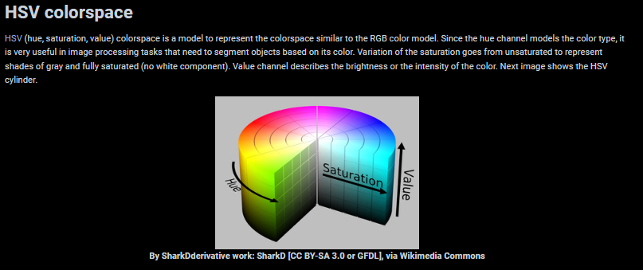

#### 3.2. Thử nghiệm HSV trong Subtract images
- Link tool thử nghiệm : [https://git.pythaverse.space/thomha/Nguyen_Huu_Hoang_Anh/blob/master/260420/HSV_ColorSpace/abstract_hsv.py](https://git.pythaverse.space/thomha/Nguyen_Huu_Hoang_Anh/blob/master/260420/HSV_ColorSpace/abstract_hsv.py)
- Kết quả thử nghiệm trên chính ảnh bị nhiễu ở phần B.Khó khăn :
    - Ảnh gốc sử dụng GrayScale abstract:
    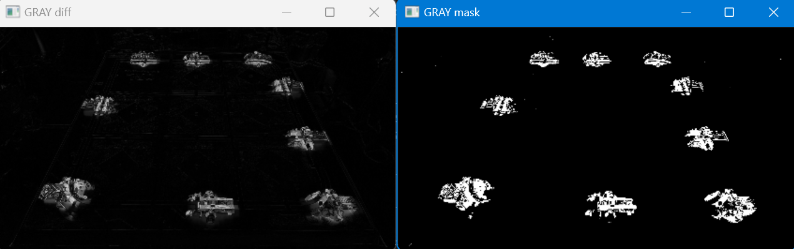
    
    - Ảnh sử dụng HSV abstract:
        - TH1 : Nhấn mạnh vào H , các hệ số tính trung bình sử dụng :
        ```
            w_h=5.0,
            w_s=2.0,
            w_v=1.0,
        ```
        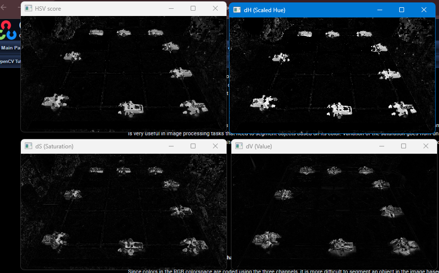

        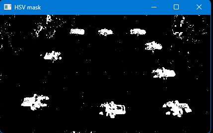

        - TH2 : nhấn mạnh vào V , các hệ số tính trung bình sử dụng : 
        ```
            w_h=1.0,
            w_s=2.0,
            w_v=5.0,
        ```
        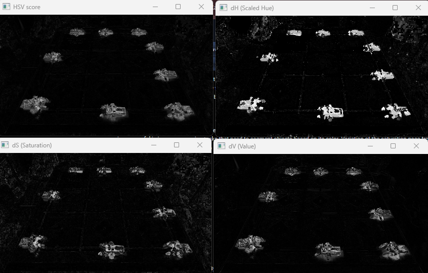

        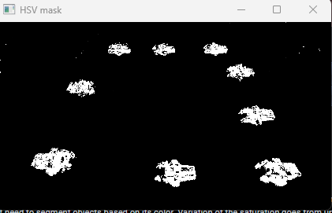
- Thông qua 2 TH trên ta thấy HSV có thể cải thiện được vấn đề nhiễu, tuy nhiên về lý thuyết thì Kênh H sẽ tạo sự khác biệt khi có sự thay đổi màu, tuy nhiên thực tế khi em thử thì nếu tập trung vào H thì lại bị nhiễu bởi các chi tiết của Leanbot, còn nếu tập trung vào V thì tốt hơn.


## B. Khó khăn
- Một số góc xuay của Leanbot khiến ánh sáng môi trường phản xạ, hoặc một số chi tiết của Leanbot khá giống với sa bàn nên khi tính sai khác, trừ ảnh sẽ bị mất pixel dẫn tới một số trường hợp countor ko ổn định, Bounding box ko hết toàn bộ Leanbot.

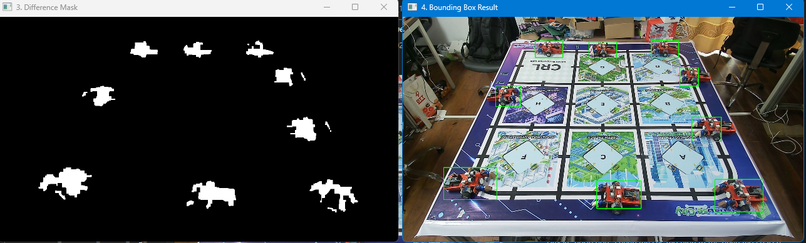

- Leanbot Bounding box không bao được hết thân: 


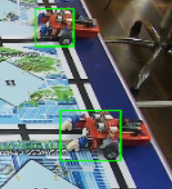

## C. Công việc tiếp theo
- Đọc, phân tích lại code (vì cần triển khai sớm để xem mức độ hiệu quả và khả thi nên em có dùng AI để viết code, em xin Thầy thêm chút thời gian để rà soát lại code để hiểu cặn kẽ hơn ạ)
- Tìm hiểu cách kết hợp HSV và Grayscale để tăng hiệu quả tách vật thể