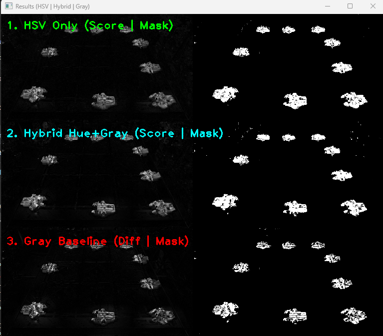
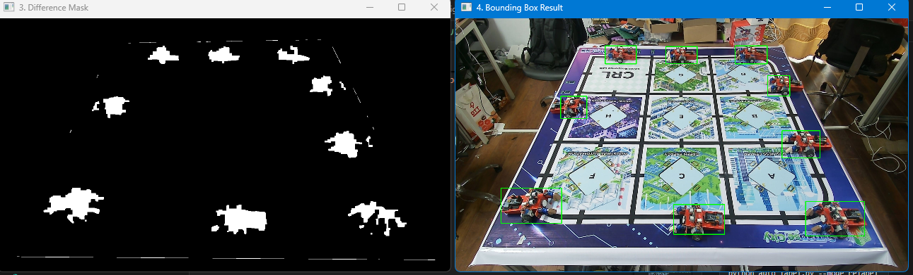
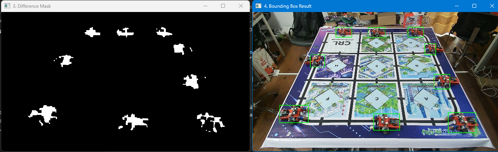
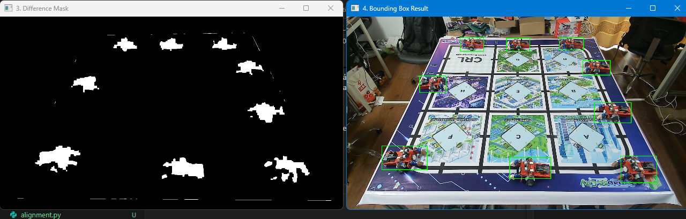

# Báo cáo công việc ngày 21/04/2026

## A. Công việc đã làm
- Thử Subtract image với cả HSV và mức xám của Grayscale
### 1. Thêm hàm tính sai khác tại kênh màu Hue và cộng với kênh xám 
- Link code : [https://git.pythaverse.space/thomha/Nguyen_Huu_Hoang_Anh/blob/master/260421/tools/abstract_hsv.py](https://git.pythaverse.space/thomha/Nguyen_Huu_Hoang_Anh/blob/master/260421/tools/abstract_hsv.py)

- Hàm sử dụng :
```python
def compute_gray_hue_diff(img1, img2, w_gray=1.0, w_hue=2.0, threshold=40, min_saturation=20):
    # 1. Tính sai khác mức xám (Grayscale Diff)
    gray1 = cv2.cvtColor(img1, cv2.COLOR_BGR2GRAY)
    gray2 = cv2.cvtColor(img2, cv2.COLOR_BGR2GRAY)
    dGray = cv2.absdiff(gray1, gray2).astype(np.float32)

    # 2. Tính sai khác màu sắc (Hue Circular Diff)
    hsv1 = cv2.cvtColor(img1, cv2.COLOR_BGR2HSV)
    hsv2 = cv2.cvtColor(img2, cv2.COLOR_BGR2HSV)
    h1, s1, _ = cv2.split(hsv1)
    h2, s2, _ = cv2.split(hsv2)

    h1, h2 = h1.astype(np.int16), h2.astype(np.int16)
    dH_raw = np.abs(h1 - h2)
    dH = np.minimum(dH_raw, 180 - dH_raw).astype(np.float32)
    dH = dH * (255.0 / 90.0) # Scale về dải 0..255

    # 3. Loại bỏ nhiễu Hue ở vùng bão hòa thấp (S thấp)
    low_sat = (s1 < min_saturation) & (s2 < min_saturation)
    dH[low_sat] = 0

    # 4. Gộp kết quả theo trọng số
    score = (w_gray * dGray + w_hue * dH) / (w_gray + w_hue)
    score = np.clip(score, 0, 255).astype(np.uint8)

    # 5. Tạo mask nhị phân
    _, mask = cv2.threshold(score, threshold, 255, cv2.THRESH_BINARY)

    return score, mask
```
- Kết quả so sánh tại 3 phương pháp HSV , Hue + Gray , Grayscale. Các hệ số được điều chỉnh sao cho 3 phương pháp cho ra kết quả tốt nhất có thể :



## B. Khó khăn
- Em thấy vẫn không cải thiện lắm ạ. 
- Khi đưa vào auto_label thì kết quả trả về vẫn chưa tốt lắm ạ. Mặc dù ở chế độ HSV Subtract thì có tốt hơn, Bounding box bao trùm được hết thân, nhưng Subtract vẫn bị nhiều pixel bị mất ạ.
- Ảnh tại chế độ Subtract bằng Hue + Gray 



- Ảnh tại chế độ Subtract bằng GrayScale



- Ảnh tại chế độ Subtract bằng HSV

