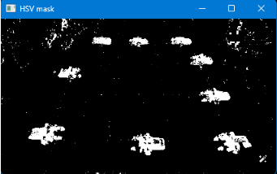
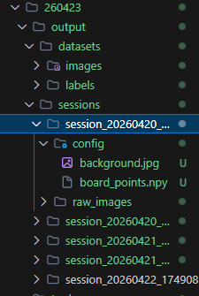
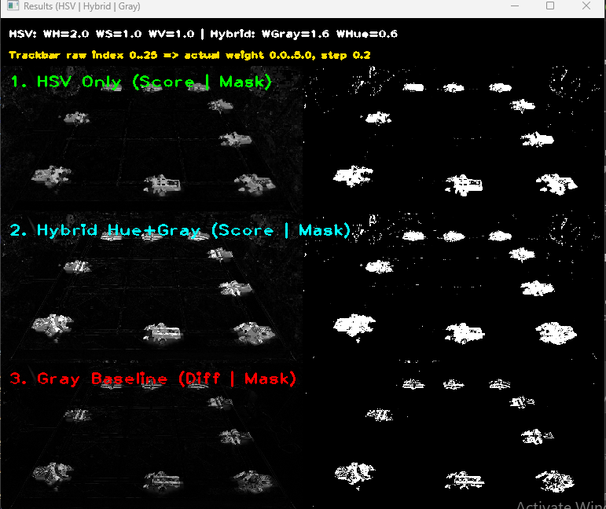
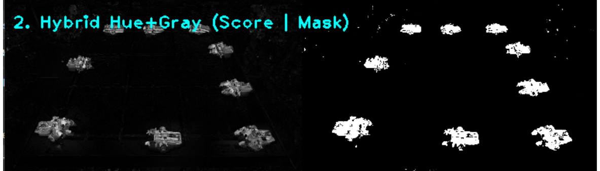
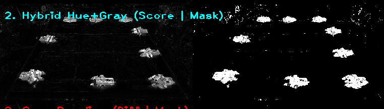

# Báo cáo công việc ngày 23/04/2026

## A. Công việc đã làm
- Bổ sung báo cáo về phần HSV Subtract Images:
    - **tuy nhiên thực tế khi em thử thì nếu tập trung vào H thì lại bị nhiễu bởi các chi tiết của Leanbot** : về kết luận này em rút ra trong quá trình thửu nghiệm các hệ số ạ. Nếu đưa hệ số của kênh H lên cao thì nhiễu của Sa bàn sẽ nhiều lên ạ : 

        

    - **Vì vậy cần test trên đúng ảnh gặp khó đấy để so sánh giữa RGB và HSV?** : Em chưa hiểu câu hỏi này của Thầy lắm ạ, vì hiện tại em không dùng RGB để tính sai khác 2 ảnh ạ. 
    - **Chụp các ảnh bằng code python nào, save các file ảnh theo cách đặt tên file thế nào?** : 
        - Hàm chụp ảnh em sử dụng ```cap = setup_camera(source=0, width=2560, height=1440)``` để cấu hình độ phân giải khi chụp, ```ret,frame = cap.read()``` để đọc ảnh từ camera. ```frame``` ảnh sẽ được đưa đi xử lí các bước như Mask roi, ECC Alignment, Subtract,...

    - **Ảnh background như thế nào?** : Hiện tại mỗi lần chạy Tool là sẽ cần chụp lại BackGround, không sử dụng lại BackGround có sẵn. 
    - **Cấu trúc file code, cấu trúc file save ảnh ( Mỗi buổi 1 folder?)** : Hiện tại em chia cấu trúc folder ảnh như sau :

    

    - Mỗi lần chạy tool sẽ sinh ra 1 session ảnh riêng, có chứa BackGroud trong folder ```config``` và ma trận 4 điểm Masked ROI. 
    - Ảnh sau khi Label sẽ được đưa vào datasets và chia thành images và label. 
    - Vì nếu upload toàn bộ folder ảnh lên sẽ báo lỗi dung lượng, không thể commit nên em ko push lên ạ.

- Báo cáo lại về các hệ số của HSV Subtract Image đang sử dụng ở báo cáo trước.
```python
wh: float = 2.0,
ws: float = 1.0,
wv: float = 1.0
```

- Thay đổi phương pháp tính `score` trong Subtract Image bằng HSV ColorSpace.

### 1. Thay đổi phương pháp tính `score` trong Hue + GrayScale Subtract Image
- Công thức cũ:
```python
score = (w_gray * dGray + w_hue * dH) / weight_total
```

- Công thức mới:
```
score = max(w_gray * dGray, w_hue * dH)
```
- Code tính toán thực tế khi so sánh ma trận pixel :
```python
    score = np.maximum(w_gray * dGray, w_hue * dH)
```

- Thông qua việc chạy thử với ảnh, kết quả tốt nhất ở các hệ số sau:
```python
w_gray = 1.6
w_hue = 0.6
threshold = 40
min_saturation = 20
blur_ksize = 5
use_clahe = True
```



- So với phương pháp tính trung bình cũ:

| Cũ | Mới |
| --- | --- |
|  |  |

- Kết luận: phương pháp lấy `max(w_gray * dGray, w_hue * dH)` cho kết quả tách biệt rõ hơn một chút so với cách lấy trung bình có trọng số trước đó. Tuy nhiên đồng thời nó cũng sẽ nhiều nhiễu hơn, em đã phải giảm hệ số của cả 2 kênh Gray và Hue để tối ưu giữa nhiễu và độ phủ kín của thân Leanbot ( ko bị lỗ và cắt ở trong thân)

## B. Khó khăn
- Không.
## C. Công việc tiếp theo
- Đề xuất thêm
    - Khi tìm hiểm, promt hỏi AI về vấn đề vật thể khi trừ ảnh bị cắt và mất pixel ở trong thân dẫn tới bị vật bị chia thành 2 phần, thì em nhận được một số phương pháp giải quyết sau :
        - Fill toàn bộ những pixel bị mất mà bị bao quanh bởi pixel đã được phát hiện là có vật thể (fill hết pixel đen bị bao quanh bởi trắng) 
        - nối các khối sát nhau trong phạm vi n pixel ( các khối gần nhau được hiểu là 1 phần của Leanbot và nối vào nhau)
        - Dùng phép dãn nở ảnh (Dilation) để nối các phần lại với nhau 
        - Để loại bỏ nhiễu thì gắn thêm điều kiện  diện tích, chu vi (width_max, height_max) của contour trong khoảng giới hạn của Leanbot 
- Em xin phép xin Thầy ý kiến về phần công việc ưu tiên làm trước ạ.