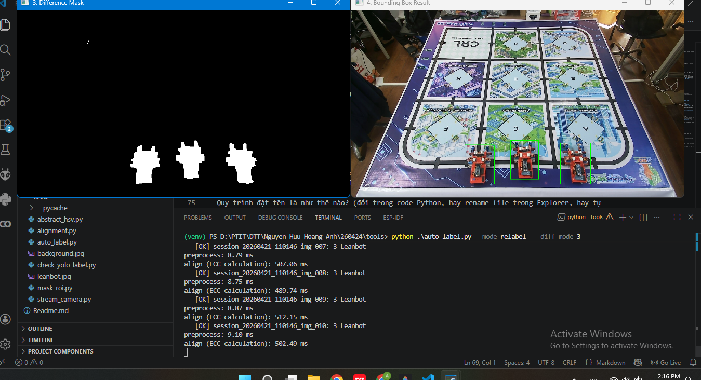
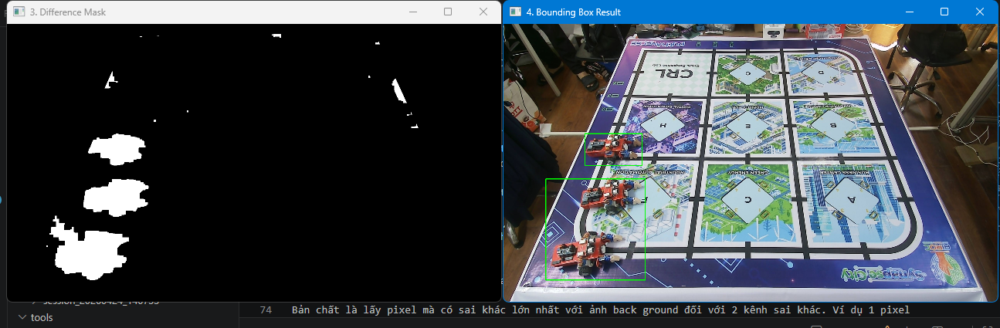
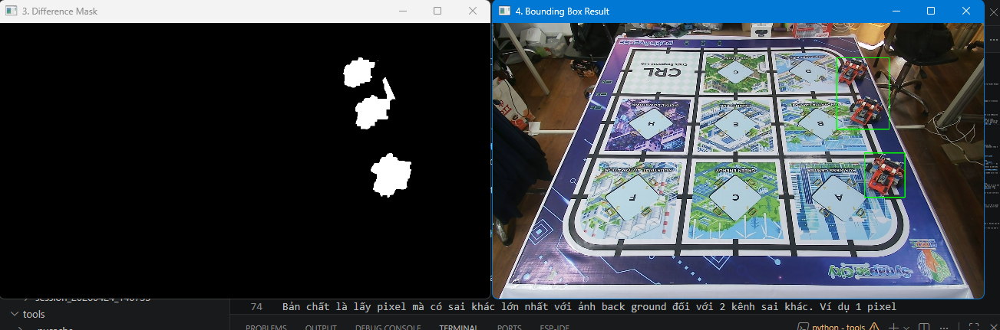
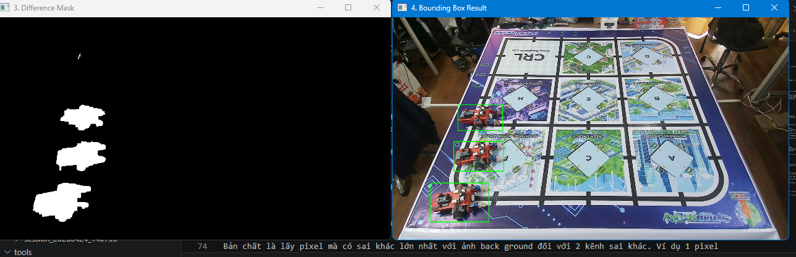

# Báo cáo công việc ngày 24/04/2026

## A. Công việc đã làm 
- Khái quát kiến trúc tập ảnh output mà Tools tọa ra.
- Hướng dẫn sử dụng Tools
- Nhiễu trong sử dụng phương pháp Hue + gray (lấy maximum) trong Subtract Image.

### 1. Kiến trúc tập ảnh mà Tools sinh ra khi sử dụng

- Khi chạy tool ở mode ```python auto_label.py --source 1 --mode capture``` thì sẽ sinh ra folder Output có kiến trúc như sau:
```
    output/
    |--datasets/
    |   |--images/  # chứa các ảnh 
    |   |--labels/  # chứa file text đánh nhãn tương ứng với ảnh trong images
    |
    |--sessions/
    |   |--session_20260424_133920/
    |       |--config/
    |       |   |--background.jpg             # ảnh nền để so sánh với các ảnh trong images của session
    |       |   |--board_points.npy           # các điểm ROI Masked  
    |       |--raw_images/
    |       |   |--raw_000.jpg                # ảnh gốc
    |       |   |--raw_001.jpg                # ảnh gốc
    |       |   |--raw_002.jpg                # ảnh gốc
    |       |   |--...         

```
- Bên trong output có ```datasets``` là nơi chứa ảnh và label sau khi chạy tool xử lí toàn bộ lượng ảnh có trong sessions ở chế độ đánh nhãn.

- Bên trong output có ```sessions``` là nơi chứa các session ảnh tại mỗi lần chụp một tập dữ liệu.
- Mỗi session được đặt tên tự động theo thời điểm chụp ```session_YYYYMMDD_HHMMSS```. Và mỗi session đề có backgroud riêng, ma trận điểm ROI Masked cũng riêng biệt, không lẫn với các session khác. Ảnh trong các Session cũng được đặt tên tự động theo thứ tự chụp từ ```raw_000.jpg``` đến ```raw_001.jpg``` ,```...```, ```raw_0NN.jpg```  . 
-  Code đặt trên folder sessions : 
```python 
session_id = f"session_{datetime.now().strftime('%Y%m%d_%H%M%S')}"
```
- Code đặt tên ảnh trong các sessions :
```python
idx = len(captured_frames)
img_name = f"raw_{idx:03d}.jpg"

```
### 2. Hướng dẫn sử dụng Tools
- Tools có 2 mode 
    - capture: chụp ảnh, lưu vào folder output/sessions và chỉ xử lý auto label cho session đó.
    - auto_label: xử lý toàn bộ folder sesion nhỏ trong folder sessions, lưu vào folder datasets theo 3 chế độ tùy chọn:
        - ```diff_mode 1``` : tính sai khác bằng Gray Scale
        - ```diff_mode 2``` : tính sai khác bằng Hue + Gray Scale
        - ```diff_mode 3``` : tính sai khác bằng HSV
#### 2.1. Mode cature
- **Bước 1:**: Lệnh thực thi : ```python auto_label.py --source index --mode capture --diff_mode mode_number```
    - index: chỉ số camera, có thể là 0, 1, 2, 3 tùy số lượng camera kết nối với máy.
    - mode_number: mode để tính toán ảnh nền, có thể là 1, 2, 3 tùy lựa chọn mode sử dụng.
- **Bước 2:**: Sau khi thực thi lệnh -> Sessions tại thời điểm chụp sẽ được tạo trong ```output/sessions``` -> cửa sổ stream Cam sẽ hiện lên để người dùng tự điều chỉnh vị trí Cam rồi bấm ```C```  để chụp lấy Back ground. 
- **Bước 3:**: Sau khi capture back ground -> click chuột chọn 4 điểm ROI Mask --> bấm Enter để bắt đầu chụp data --> 
    - sau đó trongbấm 'c' để chụp ảnh . Ảnh sẽ được lưu vào ```output/sessions/session_YYYYMMDD_HHMMSS/raw_images/```
- **Bước 4**:  Sau khi chụp xong lượng ảnh mong muốn thì bấm `s` để lưu và bắt đầu chạy thuật toán tính toán BBox tự động. Cửa sổ Debug sẽ hiện lên để người dùng theo dõi quá trình tính toán. 



#### 2.2. Mode relabel
- Lệnh thực thi : ```python auto_label.py --mode relabel --diff_mode mode_number```
    - mode_number: mode để tính toán ảnh nền, có thể là 1, 2, 3 tùy lựa chọn mode sử dụng.
- Sau khi chạy lệnh thực thi thì toàn bộ quá trình sẽ diện ra tự động hoàn toàn. Tool sẽ quét toàn bộ ảnh trong các session nhỏ trong folder ```output/session/```, tự tính toán bouding box và tạo file label tương ứng rồi lưu toàn bộ vào ```output/datasets```. Người dùng chủ cần zip folder ```datasets``` để upload lên Google Colab để train model.

- Tool có hiển thị cửa sổ quan sát trong quá trình tính toán, để người dùng theo dõi quá trình tính toán.


### 3. Nhiễu trong sử dụng phương pháp Hue + GrayScale với cách lấy Maximum .
- Công thức sử dụng :
```python
    score = np.maximum(w_gray * dGray, w_hue * dH)
```
Bản chất là lấy pixel mà có sai khác lớn nhất với ảnh back ground đối với 2 kênh sai khác. Ví dụ 1 pixel được đánh giá sai lệnh ở kênh gray là 5 nhưng đánh giá sai lệnh ở kênh Hue là 10 , thì score để trừ ảnh được tính là 10 .




- Như kết quả ảnh có thể thấy nếu môi trường bị detect rõ thì sẽ khiến tool nhầm countor của nhiễu và leanbot .  Để giải quyết vấn đề này thì em có thêm cái giới hạn diện tích , chu vi như bài báo cáo trước đó.
- Ngoài ra với vấn đề này thì em đã thử tăng ngưỡng tính threshold khi nhị phân hóa ảnh thì được xử lí tương đối ổn hơn ạ 
- ngưỡng hiện tại sử dụng là 80 ``` "--threshold", type=int, default=80, help="Brightness difference threshold (default 50)" ```



- Về vấn đề lỗ bị cắt trong thân, vì em thấy nó lỗ chỗ quá nhìn nó cứ sao sao nên em thêm thuật toán fill hết mấy lỗ đó vào ạ.  

## B. Khó khăn

