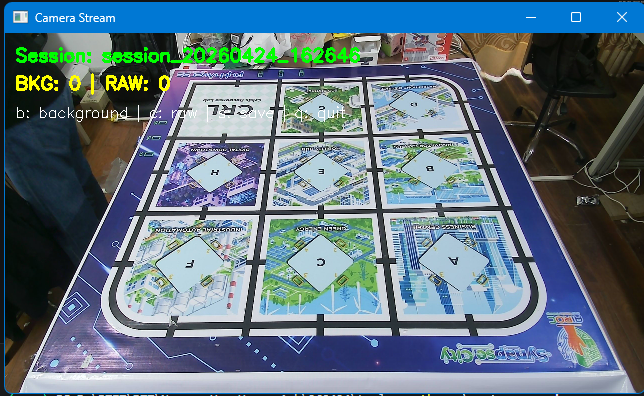
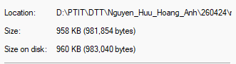
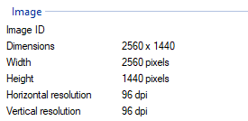
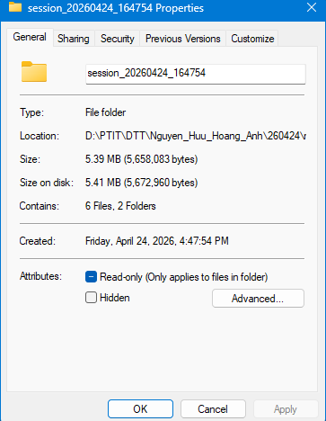

# Báo cáo công việc ngày 24/04/2026

## A. Công việc đã làm
- Tách tool auto label thành các tool riêng:
  - `capture_session.py`: thu thập dữ liệu vào `raw_image/session_X`
- Hỗ trợ chụp nhiều background trong một session.
- Thêm report chi tiết về cấu trúc folder session và folder output.

## 1. Cấu trúc lại Tools

### 1.1. Tool thu thập dữ liệu
- Link code : [https://git.pythaverse.space/thomha/Nguyen_Huu_Hoang_Anh/blob/master/260424/tools/capture_session.py](https://git.pythaverse.space/thomha/Nguyen_Huu_Hoang_Anh/blob/master/260424/tools/capture_session.py)
- Lệnh chạy tool : 

```bash
python tools/capture_session.py --source 1
```
- Phím sử trong lúc chụp:
    - `b`: chụp background.
    - `c`: chụp raw image.
    - `s`: lưu session và kết thúc.
    - `q`: dừng chạy.



- Sau khi chụp, session được tạo theo cấu trúc:

```text
raw_image/
  session_YYYYMMDD_HHMMSS/
    backgrounds/
      background_000.jpg
      background_001.jpg
      ...
    raw_images/
      raw_000.jpg
      raw_001.jpg
      ...

```

- `backgrounds/`: nhiều ảnh back ground trong cùng một session.
- `raw_images/`: ảnh cần đưa vào tool auto-label sau này.
- Độ phân giải ảnh và dung lượng 1 ảnh như sau ( thông tin được lấy từ file/folder properties - window ) : 

    - Dung lượng của 1 ảnh.

        

    - Độ phân giải :

        

- Dung lượng của Folder sẽ tùy thuộc vào lượng ảnh chụp.




## B. Khó khăn
- Hiện tại việc chụp nhiều Back Ground theo như em hiểu là để đối chiếu, tính sai khác tối ưu hơn trong quá trình tính sai khác khi ánh sáng môi trường có thay đổi và tăng độ đa dạng cho dataset sau này . Em xin Thầy xác nhận xem em hiểu đúng không ạ Thầy ?

## C. Công việc tiếp theo
- Chỉnh sửa tools Auto label :
    - Đọc ảnh từ ```raw_image/session_X``` xuất ra ``` tool1_output/session_X``` tương ứng.
    - Tự yêu cầu chọn RoI Mask nếu chưa có file ma trận cấu hình
    - Thêm file json/text chứa cấu hình đã sử dụng trong tool auto label.
- Trong quá trình thu thập dữ liệu, chạy tool, tách ra các ảnh dễ bị nhiễu, Bbox sai để thử nghiệm các tools
- Tạm thời bỏ các bước xử lí lấp pixel đen bên trong countor Leanbot
- Thu thập ảnh cho 2 Class ```Leanbot_front``` và ```Leanbot_back``` ở các góc từ -45 -> 45 độ .