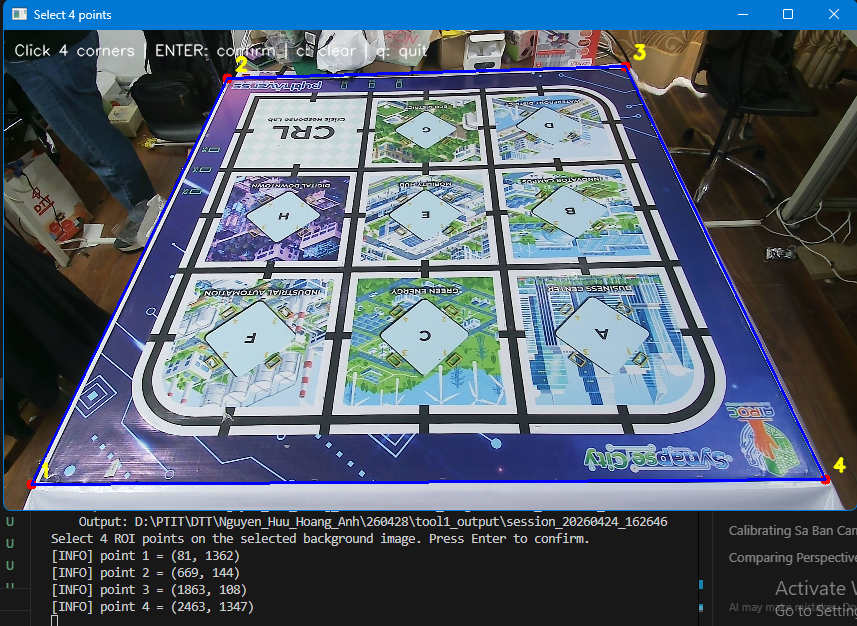
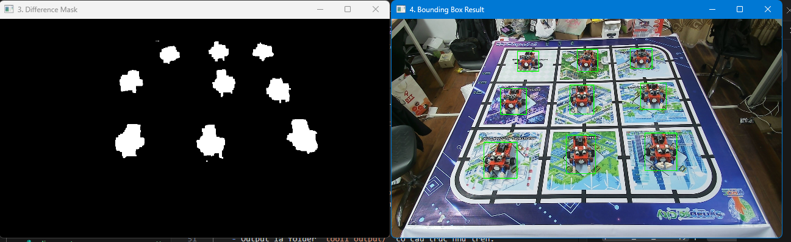
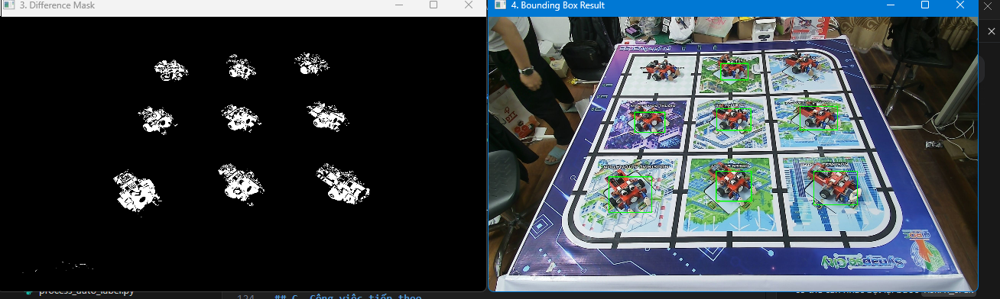

# Báo cáo công việc ngày 28/04/2026

## A. Công việc đã làm
- Chỉnh sửa tools Auto label : Đọc ảnh từ raw_image/session_X xuất ra tool1_output/session_X tương ứng.
    - Tự yêu cầu chọn RoI Mask nếu chưa có file ma trận cấu hình.
    -  Thêm file json/text chứa thông tin các thông số cấu hình đã sử dụng trong tool auto label ( threshold, w_s, w_h, w_gray,...)
- Tắt tính năng Fill Hole trong thân Leanbot.


### 1. Chỉnh sửa tools auto label
- Tách từ tools gốc thành tools có chức năng auto label riêng
    - Đọc ảnh từ ```raw_image/session_X```  xuất ra ```tool1_output/session_X``` tương ứng.
    - Tự động yêu cầu chọn RoI Mask nếu chưa có file ma trận cấu hình.
    - Thêm file text chứa thông tin cấu hình được sử dụng trong quá trình auto label để có thể tái sử dụng hoặc so sánh.
- Link code : [https://git.pythaverse.space/thomha/Nguyen_Huu_Hoang_Anh/blob/master/260428/tools/process_auto_label.py](https://git.pythaverse.space/thomha/Nguyen_Huu_Hoang_Anh/blob/master/260428/tools/process_auto_label.py)

- Cấu tạo của folder sau khi chạy xong tools
    ```
    tool1_output/
    │
    ├── session_20260424_162646/
    │   ├── aligned_images/
    │   │   ├── raw_000.jpg
    │   │   ├── raw_001.jpg
    │   │   └── ...
    │   ├── labels/
    │   │   ├── raw_000.txt
    │   │   ├── raw_001.txt
    │   │   └── ...
    │   └── config.npy  // ma trận RoI Mask
    │
    ├── session_20260424_164754/
    │   ├── aligned_images/
    │   ├── labels/
    │   └── config.npy // ma trận RoI Mask
    │
    └── session_X.../
    │
    └── processing_config.json // Các thông số config auto label
    ```

- Cách chạy tools ( khi đã có sẵn Raw_images được chụp trước đó bởi `capture_session.py`):
    - chạy lệnh ```python .\tools\process_auto_label.py```
    - Hiện ra cửa sổ để chọn RoI mask ( nếu trước đó chưa tồn tại file config.npy).

    

    - Tools sẽ đọc toàn bộ các `session_X` tạo bởi `capture_session.py` trong `Raw_images/` và thực hiện auto label.

    

    - Output là folder `tool1_output/` có cấu trúc như trên. 

- File thông tin cấu hình Json có dạng sau :

```json
{
  "created_at": "2026-04-28 09:03:19",
  "diff_mode": "GRAY",        // chế độ so sánh sai khác giữa ảnh hiện tại và background
  "threshold": 80,          // Ngưỡng giá trị pixel để phân biệt foreground và background
  "blur": 3,                // Độ mờ của ảnh
  "min_area": 5000,           // Diện tích tối thiểu của countor
  "max_area": 500000,         // Diện tích tối đa của countor
  "min_width": 60,            // Chiều rộng tối thiểu của countor
  "max_width": 2000,          // Chiều rộng tối đa của countor
  "min_height": 40,
  "max_height": 2000,
  "merge_dist": 5,   // số pixel để nối các khối countor bị đứt
  "class_id": 0,
  "background_index": 0,
  "w_gray": 1.0,
  "w_hue": 0.1,
  "w_h": 5.0,
  "w_s": 1.0,
  "w_v": 10.0,
  "sessions_processed": [
    "session_20260424_162646",
    "session_20260424_164754",
    "session_20260424_173349"
  ],
  "summary": {
    "sessions": 3,
    "images": 12,
    "positive": 12,
    "negative": 0,
    "failed": 0
  }
}

```
### 2. Tắt Fill hole và các thuật toán xử lí hình thái đóng mở ảnh 
- Các công đoạn xử lí đã tắt :
  - Fill hole 
  - Thuật toán đóng mở ảnh (Morphology)
  - Thuật toán dilate (giản nở)

- Code đã comment: 
```python
    # kernel_small = np.ones((3, 3), np.uint8)
    # kernel_large = np.ones((25, 25), np.uint8)

    # diff_mask = cv2.morphologyEx(diff_mask, cv2.MORPH_OPEN, kernel_small)
    # diff_mask = cv2.dilate(diff_mask, np.ones((5, 5), np.uint8), iterations=1)
    # diff_mask = cv2.morphologyEx(diff_mask, cv2.MORPH_CLOSE, kernel_large)

    # cnts, _ = cv2.findContours(diff_mask, cv2.RETR_EXTERNAL, cv2.CHAIN_APPROX_SIMPLE)
    # for contour in cnts:
    #     cv2.drawContours(diff_mask, [contour], -1, 255, thickness=-1)

    # diff_mask = cv2.dilate(diff_mask, np.ones((3, 3), np.uint8), iterations=1)

    # mask_filled = np.zeros_like(diff_mask)
    # cv2.drawContours(mask_filled, contours, -1, 255, thickness=-1)
    # contours, _ = cv2.findContours(mask_filled, cv2.RETR_EXTERNAL, cv2.CHAIN_APPROX_SIMPLE)
```
- Kết quả sau khi tắt các công đoạn trên : 



-  Kết quả cho thấy khi tắt các bước xử lí hình thái nhưu giãn nở, đóng mở ảnh, kết hợp với fill hole thì Leanbot bị chia thành nhiều phần nhỏ làm các countor riêng rẽ -> khó phân biệt countor của Leanbot với môi trường.
## B.Khó khăn
- không
## C. Công việc tiếp theo.

- Tiến hành chụp các góc phía trước Leanbot_front và sau Leanbot_back từ góc -45 -> 45 độ. Tiến hành auto label, lọc ảnh nhiễu ra 1 folder riêng `difficult`