# Báo cáo công việc ngày 28/04/2026

## Mục lục
- [A. Công việc đã làm](#a-công-việc-đã-làm)
    - [1. Chỉnh sửa tools auto label](#1-chỉnh-sửa-tools-auto--label)
    - [2. Tắt Fill hole và các thuật toán xử lí hình thái đóng mở ảnh](#2-tắt-fill-hole-và-các-thuật-toán-xử-lí-hình-thái-đóng-mở-ảnh)
    - [3. Thử phương pháp Merge các countor gần nhau và tạo Bounding box lớn nhất](#3-thử-phương-pháp-merge-các-countor-gần-nhau-và-tạo-bounding-box-lớn-nhất)
    - [3.2 Phương pháp Merge các BBox dựa trên sự chồng lấn về diện tích.](#32-phương-pháp-merge-các-bbox-dựa-trên-sự-chồng-lấn-về-diện-tích)
    - [4. Tiến hành chụp các mẫu Data Leanbot_front và Leanbot_Back.](#4-tiến-hành-chụp-các-mẫu-data-leanbot_front-và-leanbot_back)
- [B. Khó khăn](#b-khó-khăn)
- [C. Công việc tiếp theo.](#c-công-việc-tiếp-theo)

## A. Công việc đã làm
- Chỉnh sửa tools Auto label : Đọc ảnh từ raw_image/session_X xuất ra tool1_output/session_X tương ứng.
    - Tự yêu cầu chọn RoI Mask nếu chưa có file ma trận cấu hình.
    -  Thêm file json/text chứa thông tin các thông số cấu hình đã sử dụng trong tool auto label ( threshold, w_s, w_h, w_gray,...)
- Tắt tính năng Fill Hole trong thân Leanbot.
- Tiến hành chụp các góc phía trước Leanbot_front và sau Leanbot_back từ góc -45 -> 45 độ. Tiến hành auto label, lọc ảnh nhiễu ra 1 folder riêng `difficult`
- Thêm tính năng merge BBox .
- Thử thuật toán gộp BBox bằng phương pháp chồng lấn BBox ( Overlap ratio )
### 1. Chỉnh sửa tools auto label
- Tách từ tools gốc thành tools có chức năng auto label riêng
    - Đọc ảnh từ ```raw_image/session_X```  xuất ra ```tool1_output/session_X``` tương ứng.
    - Tự động yêu cầu chọn RoI Mask nếu chưa có file ma trận cấu hình.
    - Thêm file text chứa thông tin cấu hình được sử dụng trong quá trình auto label để có thể tái sử dụng hoặc so sánh.
- Link code : [https://git.pythaverse.space/thomha/Nguyen_Huu_Hoang_Anh/blob/master/260428/tools/process_auto_label.py](https://git.pythaverse.space/thomha/Nguyen_Huu_Hoang_Anh/blob/master/260428/tools/process_auto_label.py)

- Cấu tạo của folder sau khi chạy xong tools
    ```
    tool1_output/
    │
    ├── session_20260424_162646/
    │   ├── aligned_images/
    │   │   ├── raw_000.jpg
    │   │   ├── raw_001.jpg
    │   │   └── ...
    │   ├── labels/
    │   │   ├── raw_000.txt
    │   │   ├── raw_001.txt
    │   │   └── ...
    │   └── config.npy  // ma trận RoI Mask
    │
    ├── session_20260424_164754/
    │   ├── aligned_images/
    │   ├── labels/
    │   └── config.npy // ma trận RoI Mask
    │
    └── session_X.../
    │
    └── processing_config.json // Các thông số config auto label
    ```

- Cách chạy tools ( khi đã có sẵn Raw_images được chụp trước đó bởi `capture_session.py`):
    - chạy lệnh ```python .\tools\process_auto_label.py```
    - Hiện ra cửa sổ để chọn RoI mask ( nếu trước đó chưa tồn tại file config.npy).

    

    - Tools sẽ đọc toàn bộ các `session_X` tạo bởi `capture_session.py` trong `Raw_images/` và thực hiện auto label.

    

    - Output là folder `tool1_output/` có cấu trúc như trên. 

- File thông tin cấu hình Json có dạng sau :

```json
{
  "created_at": "2026-04-28 09:03:19",
  "diff_mode": "GRAY",        // chế độ so sánh sai khác giữa ảnh hiện tại và background
  "threshold": 80,          // Ngưỡng giá trị pixel để phân biệt foreground và background
  "blur": 3,                // Độ mờ của ảnh
  "min_area": 5000,           // Diện tích tối thiểu của countor
  "max_area": 500000,         // Diện tích tối đa của countor
  "min_width": 60,            // Chiều rộng tối thiểu của countor
  "max_width": 2000,          // Chiều rộng tối đa của countor
  "min_height": 40,
  "max_height": 2000,
  "merge_dist": 5,   // số pixel để nối các khối countor bị đứt
  "class_id": 0,
  "background_index": 0,
  "w_gray": 1.0,
  "w_hue": 0.1,
  "w_h": 5.0,
  "w_s": 1.0,
  "w_v": 10.0,
  "sessions_processed": [
    "session_20260424_162646",
    "session_20260424_164754",
    "session_20260424_173349"
  ],
  "summary": {
    "sessions": 3,
    "images": 12,
    "positive": 12,
    "negative": 0,
    "failed": 0
  }
}

```
### 2. Tắt Fill hole và các thuật toán xử lí hình thái đóng mở ảnh 
- Các công đoạn xử lí đã tắt :
  - Fill hole 
  - Thuật toán đóng mở ảnh (Morphology)
  - Thuật toán dilate (giản nở)

- Code đã comment: 
```python
    # kernel_small = np.ones((3, 3), np.uint8)
    # kernel_large = np.ones((25, 25), np.uint8)

    # diff_mask = cv2.morphologyEx(diff_mask, cv2.MORPH_OPEN, kernel_small)
    # diff_mask = cv2.dilate(diff_mask, np.ones((5, 5), np.uint8), iterations=1)
    # diff_mask = cv2.morphologyEx(diff_mask, cv2.MORPH_CLOSE, kernel_large)

    # cnts, _ = cv2.findContours(diff_mask, cv2.RETR_EXTERNAL, cv2.CHAIN_APPROX_SIMPLE)
    # for contour in cnts:
    #     cv2.drawContours(diff_mask, [contour], -1, 255, thickness=-1)

    # diff_mask = cv2.dilate(diff_mask, np.ones((3, 3), np.uint8), iterations=1)

    # mask_filled = np.zeros_like(diff_mask)
    # cv2.drawContours(mask_filled, contours, -1, 255, thickness=-1)
    # contours, _ = cv2.findContours(mask_filled, cv2.RETR_EXTERNAL, cv2.CHAIN_APPROX_SIMPLE)
```
- Kết quả sau khi tắt các công đoạn trên : 


-  Kết quả cho thấy khi tắt các bước xử lí hình thái nhưu giãn nở, đóng mở ảnh, kết hợp với fill hole thì Leanbot bị chia thành nhiều phần nhỏ làm các countor riêng rẽ -> khó phân biệt countor của Leanbot với môi trường.

### 3. Thử phương pháp Merge các countor gần nhau và tạo Bounding box lớn nhất :
- Về tư tưởng thuật toán : Tìm các countor có khoảng cách gần nhau theo trục X và trục Y (trong khoảng `dist_merge` có thể config) và tạo ra một Bounding box lớn nhất chứa tất cả các countor trong nhóm.
- Code sử dụng :
```python
def merge_bboxes(bboxes, dist_threshold=10):
    if not bboxes:
        return []

    curr_bboxes = [list(b) for b in bboxes]
    changed = True
    while changed:
        changed = False
        new_bboxes = []
        visited = [False] * len(curr_bboxes)

        for i in range(len(curr_bboxes)):
            if visited[i]:
                continue

            group = [curr_bboxes[i]]
            visited[i] = True

            for j in range(i + 1, len(curr_bboxes)):
                if visited[j]:
                    continue

                b1 = curr_bboxes[i]
                b2 = curr_bboxes[j]
                
                # Kiểm tra khoảng cách giữa 2 hộp theo trục X và Y
                x_overlap = not (
                    b1[0] + b1[2] + dist_threshold < b2[0]
                    or b2[0] + b2[2] + dist_threshold < b1[0]
                )
                y_overlap = not (
                    b1[1] + b1[3] + dist_threshold < b2[1]
                    or b2[1] + b2[3] + dist_threshold < b1[1]
                )

                # Nếu nằm trong phạm vi khoảng cách đủ gần, cho vào cùng một nhóm
                if x_overlap and y_overlap:
                    group.append(curr_bboxes[j])
                    visited[j] = True
                    changed = True

            if len(group) == 1:
                new_bboxes.append(group[0])
            else:
                # Tìm tọa độ bao quát toàn bộ nhóm (Bounding Box lớn nhất)
                x_min = min(b[0] for b in group)
                y_min = min(b[1] for b in group)
                x_max = max(b[0] + b[2] for b in group)
                y_max = max(b[1] + b[3] for b in group)
                new_bboxes.append([x_min, y_min, x_max - x_min, y_max - y_min])

        curr_bboxes = new_bboxes

    return [tuple(b) for b in curr_bboxes]
```
- Kết quả :

|Trước merge|Sau merge|
|:---:|:---:|
| 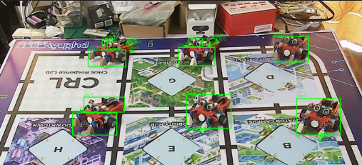 | 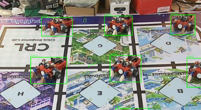 |
- Kết quả cho thấy khi áp dụng thuật toán merge các countor gần nhau thì đã gộp các countor riêng rẽ thành 1 . 

- Hạn chế :
Có một vài hạn chế khi chỉ merge như sau :
  - Nhầm lẫn Leanbot với môi trường -> BBox cả môi trường.
  - Hiện tại các hệ số lọc như sau 
  ```python
   parser.add_argument("--min_area", type=int, default=0, help="Minimum contour area")
    parser.add_argument("--max_area", type=int, default=500000, help="Maximum contour area")
    parser.add_argument("--min_width", type=int, default=0, help="Minimum bbox width")
    parser.add_argument("--max_width", type=int, default=2000, help="Maximum bbox width")
    parser.add_argument("--min_height", type=int, default=0, help="Minimum bbox height")
    parser.add_argument("--max_height", type=int, default=2000, help="Maximum bbox height")
    parser.add_argument("--merge_dist", type=int, default=20, help="Distance to merge nearby bboxes")
  ```
  - Với hệ số Lọc min_area = 0, min_width = 0,min_height = 0, merge_dist = 20 thì sẽ tính luôn cả nhiễu của môi trường.

|Diff_Countor|BBox|
|:---:|:---:|
|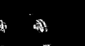|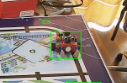|


  - Nếu tăng các hệ số này lên thì những đốm nhỏ, các phần nhỏ trên thân Leanbot sẽ bị loại bỏ --> không merge các phần đó --> BBox bị mất 1 phần. 
  - Nếu đổi thứ tự Merge xong rồi mới lọc bằng các hệ số kia thì sẽ có thêm 1 khả năng là nhiễu môi trường khi merge sẽ thành một khối lớn --> BBox nhầm thành Leanbot. ( Rủi ro này là em dự đoán, hiện tại thực tế thì chưa gặp ạ, thuật toán trừ sai khác ảnh chưa có nhiễu dạng nhưu vậy ).

### 3.2 Phương pháp Merge các BBox dựa trên sự chồng lấn về diện tích.
- Tài liệu tham khảo :
  - [https://github.com/dusty-nv/jetson-inference/issues/195](https://github.com/dusty-nv/jetson-inference/issues/195)
- Về tư tưởng thuật toán : Tìm các BBox có sự chồng lấn về diện tích với ngưỡng "overlap_ratio" thì sẽ tính lại BBox bao hàm toàn bộ các BBox trong nhóm. 
- Code sử dụng : 

```python
  def merge_bboxes_overlap(bboxes, overlap_ratio=0.25):
      if not bboxes:
          return []

      curr_bboxes = [list(b) for b in bboxes]
      changed = True
      while changed:
          changed = False
          new_bboxes = []
          visited = [False] * len(curr_bboxes)

          for i in range(len(curr_bboxes)):
              if visited[i]:
                  continue

              group = [curr_bboxes[i]]
              visited[i] = True

              for j in range(i + 1, len(curr_bboxes)):
                  if visited[j]:
                      continue

                  b1 = curr_bboxes[i]  # [x, y, w, h]
                  b2 = curr_bboxes[j]

                  # Chuyển đổi sang tọa độ [x1, y1, x2, y2] để tính toán
                  r1 = [b1[0], b1[1], b1[0] + b1[2], b1[1] + b1[3]]
                  r2 = [b2[0], b2[1], b2[0] + b2[2], b2[1] + b2[3]]

                  # 1. Kiểm tra chồng lấn cơ bản (AABB Check)
                  if not (r2[0] > r1[2] or r2[2] < r1[0] or r2[1] > r1[3] or r2[3] < r1[1]):
                      
                      # 2. Tính diện tích vùng giao nhau
                      inter_x = min(r1[2], r2[2]) - max(r1[0], r2[0])
                      inter_y = min(r1[3], r2[3]) - max(r1[1], r2[1])
                      inter_area = inter_x * inter_y

                      # 3. Tính diện tích của từng hộp
                      area1 = b1[2] * b1[3]
                      area2 = b2[2] * b2[3]

                      # 4. Kiểm tra tỷ lệ chồng lấn 
                      if (inter_area >= overlap_ratio * area1) or (inter_area >= overlap_ratio * area2):
                          group.append(curr_bboxes[j])
                          visited[j] = True
                          changed = True

              # Tạo Bounding Box lớn nhất bao trùm cả nhóm
              if len(group) == 1:
                  new_bboxes.append(group[0])
              else:
                  x_min = min(b[0] for b in group)
                  y_min = min(b[1] for b in group)
                  x_max = max(b[0] + b[2] for b in group)
                  y_max = max(b[1] + b[3] for b in group)
                  new_bboxes.append([x_min, y_min, x_max - x_min, y_max - y_min])

          curr_bboxes = new_bboxes

      return [tuple(b) for b in curr_bboxes]
```

- Kết quả : 

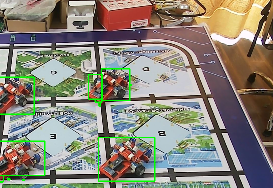

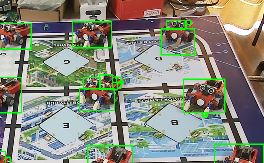

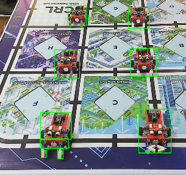

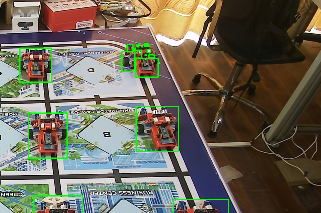

- Ảnh ở dạng GrayScale

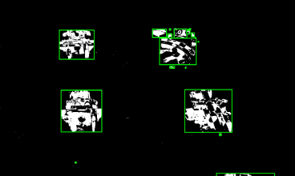

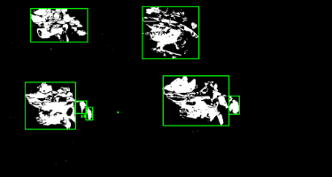

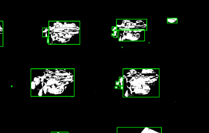
- Kết quả cho thấy đối với các phần BBox không chồng lấn nhau thì thuật toán này không phù hợp bằng Merge BBox sử dụng phương pháp gộp bằng ngưỡng khoảng cách.

### 4. Tiến hành chụp các mẫu Data Leanbot_front và Leanbot_Back.
- Leanbot_front : 

    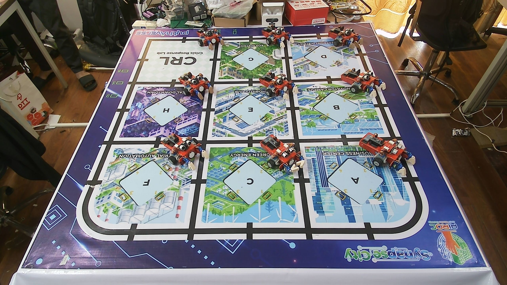

- Leanbot_Back : 

    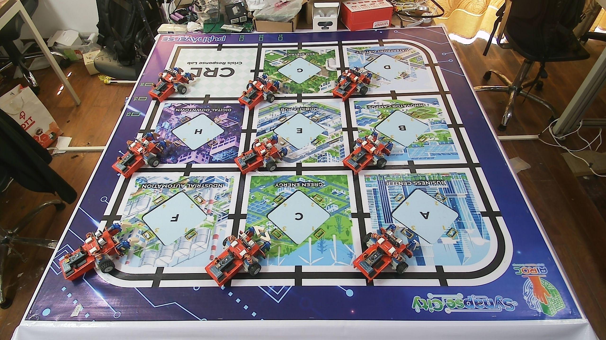
 

## B.Khó khăn
- Hiện tại em nghĩ việc dùng các thuật toán xử lí hình thái (giản nở ảnh, đóng mở ảnh,...) để fill các lỗ trống, các phần nhỏ bị cắt trên thân Leanbot kết hợp với Merge BBox thì sẽ tối ưu hơn cho việc phân biệt Leanbot với môi trường ạ 
## C. Công việc tiếp theo.
- Em xin phép xin thêm ý kiến từ Thầy ạ. 