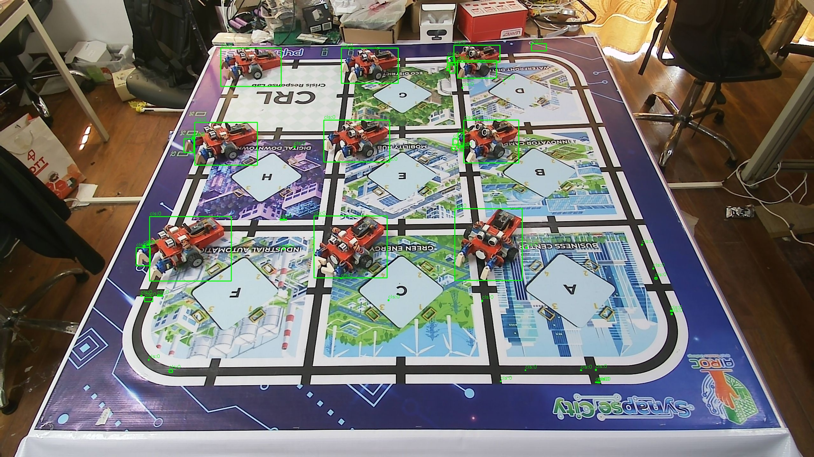
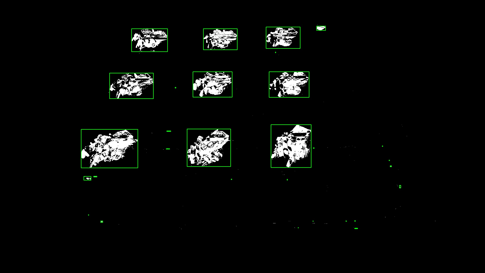
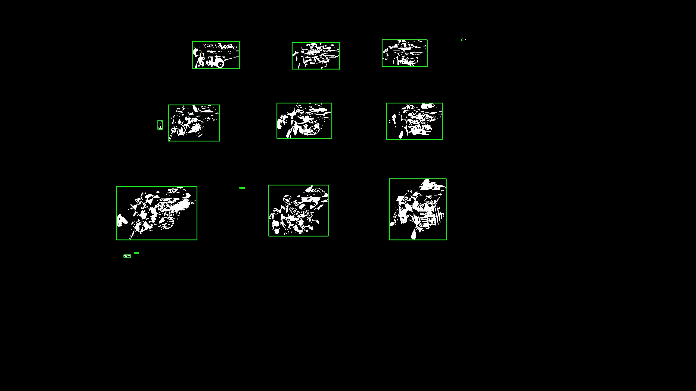
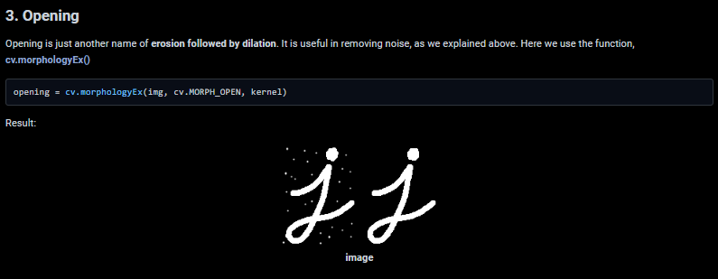
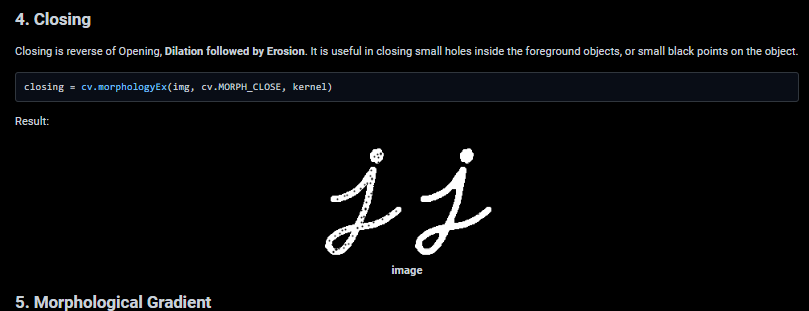
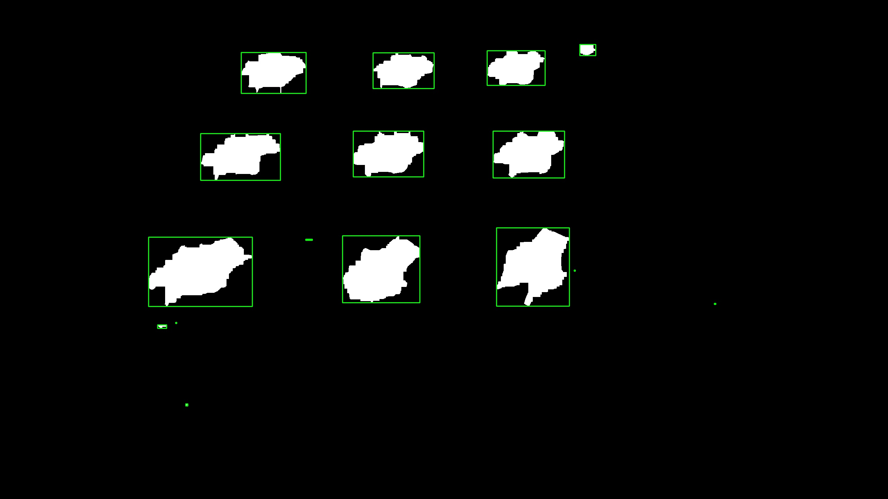

# Báo cáo công việc ngày 29/04/2026

## A. Công việc đã làm.
- Thử nghiệm các kết hợp Merge BBox lân cận merge_bboxes Distance-based
- Thử nghiệm các phương pháp xử lí hình thái ảnh

### 1. Merge BBoxes distance based
- Ý tưởng thuật toán : Sử dụng tham số merge_dist (đơn vị tính theo pixel). Nếu khoảng cách giữa 2 BBoxes nhỏ hơn tham số này thì gộp chúng lại.
- Code sử dụng : 
```python 
def merge_bboxes(bboxes, dist_threshold=10):
    if not bboxes:
        return []

    curr_bboxes = [list(b) for b in bboxes]
    changed = True
    while changed:
        changed = False
        new_bboxes = []
        visited = [False] * len(curr_bboxes)

        for i in range(len(curr_bboxes)):
            if visited[i]:
                continue

            group = [curr_bboxes[i]]
            visited[i] = True

            for j in range(i + 1, len(curr_bboxes)):
                if visited[j]:
                    continue

                b1 = curr_bboxes[i]
                b2 = curr_bboxes[j]
                
                # Kiểm tra va chạm/gần nhau giữa hai box dựa trên khoảng cách ngưỡng (dist_threshold)
                x_overlap = not (
                    b1[0] + b1[2] + dist_threshold < b2[0]
                    or b2[0] + b2[2] + dist_threshold < b1[0]
                )
                y_overlap = not (
                    b1[1] + b1[3] + dist_threshold < b2[1]
                    or b2[1] + b2[3] + dist_threshold < b1[1]
                )

                if x_overlap and y_overlap:
                    group.append(curr_bboxes[j])
                    visited[j] = True
                    changed = True

            if len(group) == 1:
                new_bboxes.append(group[0])
            else:
                # Tính toán box bao quanh toàn bộ nhóm box lân cận
                x_min = min(b[0] for b in group)
                y_min = min(b[1] for b in group)
                x_max = max(b[0] + b[2] for b in group)
                y_max = max(b[1] + b[3] for b in group)
                new_bboxes.append([x_min, y_min, x_max - x_min, y_max - y_min])

        curr_bboxes = new_bboxes

    return [tuple(b) for b in curr_bboxes]
```
- Kết quả thử nghiệm so sánh với Merge BBoxes Overlap Based:

| Image | Merge BBoxes Distance-based| Merge BBoxes Overlap Based |
| -----| --------| --------|
|RGB Debug| | |
|Gray Debug| | |

-> Kết quả cho thấy so với phương pháp Merge BBoxes Overlap Based thì phương pháp Merge BBoxes Distance-based cho kết quả tốt hơn, BBox được hợp lại tốt hơn, không bị cắt bởi các BBox không được chồng lấn.
### 2. Các phương pháp xử lí hình thái 
- Như kết quả trên có thể thấy vẫn còn nhiễu từ môi trường xung quanh, các vùng có màu giống với màu của đối tượng cần quan sát. Nếu tăng Threshold lọc nhị phân thì sẽ mất đi một vài chi tiết của Leanbot, kết quả sẽ như sau : 

| Threshold | Image|
|:---:|:---:|
|Current : 70 ||
|Increased : 120 || 

- Để giải quyết vấn đề loại bỏ nhiễu mà không cần tăng ngưỡng lọc nhị phân để giữ nhiều chi tiết của Leanbot nhất có thể, em có tìm hiểu một số phương pháp xử lí hình thái như sau :
#### 2.1. Opening ( phép mở ảnh)
- Là sự kết hợp của phép co (erosion) -> giãn ảnh (dilation). Có tách dụng loại bỏ các điểm ảnh nhiễu.
- Tài liệu tham khảo : [https://docs.opencv.org/4.x/d9/d61/tutorial_py_morphological_ops.html](https://docs.opencv.org/4.x/d9/d61/tutorial_py_morphological_ops.html)



- Hàm sử dụng :
```python
opening = cv.morphologyEx(img, cv.MORPH_OPEN, kernel)
```

#### 2.2. Closing ( phép đóng ảnh)
- Là sự kết hợp của phép giãn ảnh (dilation) -> co (erosion). Có tách dụng làm liền các vết nứt nhỏ, lấp đầy các lỗ hổng nhỏ.
- Tài liệu tham khảo : [https://docs.opencv.org/4.x/d9/d61/tutorial_py_morphological_ops.html](https://docs.opencv.org/4.x/d9/d61/tutorial_py_morphological_ops.html)



- Hàm sử dụng :
```python
closing = cv.morphologyEx(img, cv.MORPH_CLOSE, kernel)
```
#### 2.3. Kết quả sau khi kết hợp Opening và Closing 

|Threshold|None Morphological| Opening + Closing |
|:----:|:----:|:----:|
|70||| 

-> Kết quả cho thấy nhiễu nhỏ của Môi trường đã bị loại bỏ.
## B. Khó khăn.
## C. Công việc tiếp theo.