# Báo cáo công việc ngày 29/04/2026

## A. Công việc đã làm.
- Thử nghiệm phương pháp **Mask-Based BBox Merging**
- Đánh giá , so sánh với phương pháp cũ đã thử.
- Thêm bộ lọc diện tích BBox để loại bỏ BBox nhiễu.

## 1. Phương pháp Mask-Based BBox Merging

### 1.1. Ý tưởng cốt lõi
**Mask-Based BBox Merging** là phương pháp gom nhóm dựa trên sự liên thông (connectivity) trong không gian pixel. Thay vì tính toán khoảng cách hình học, phương pháp này vẽ các BBox lên một mask trung gian và dùng phép giãn nở (**Dilation**) để nối chúng lại. Nếu các BBox nằm đủ gần để vùng giãn nở của chúng chạm nhau, chúng sẽ được coi là cùng một cụm.

### 1.2. Quy trình thực hiện

#### Bước 1: Khởi tạo Mask
Tạo một ảnh mask đen (nhị phân) có cùng kích thước với ảnh gốc để làm không gian trung gian.

```python
mask = np.zeros((H, W), dtype=np.uint8)
```

#### Bước 2: Vẽ các BBox lên mask
Tô trắng (`255`) toàn bộ diện tích của các BBox ban đầu lên mask.

```python
cv2.rectangle(mask, (x, y), (x + w, y + h), 255, -1)
```
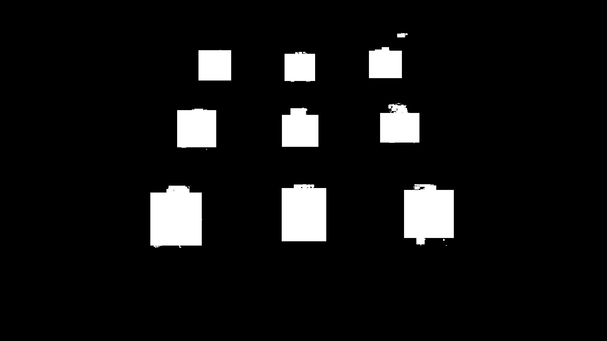

#### Bước 3: Dilation (Giãn nở) để nối cụm
Sử dụng phép toán hình thái học Dilation để làm các vùng trắng "phình" to ra, giúp các BBox gần nhau chạm vào nhau.

```python
kernel = cv2.getStructuringElement(cv2.MORPH_RECT, (kernel_size, kernel_size))
mask_dilated = cv2.dilate(mask, kernel, iterations=iterations)
```

| Tham số | Ý nghĩa |
| :--- | :--- |
| `kernel_size` | Kích thước vùng giãn nở. Càng lớn càng dễ merge các box xa nhau. |
| `iterations` | Số lần lặp lại phép giãn nở. |

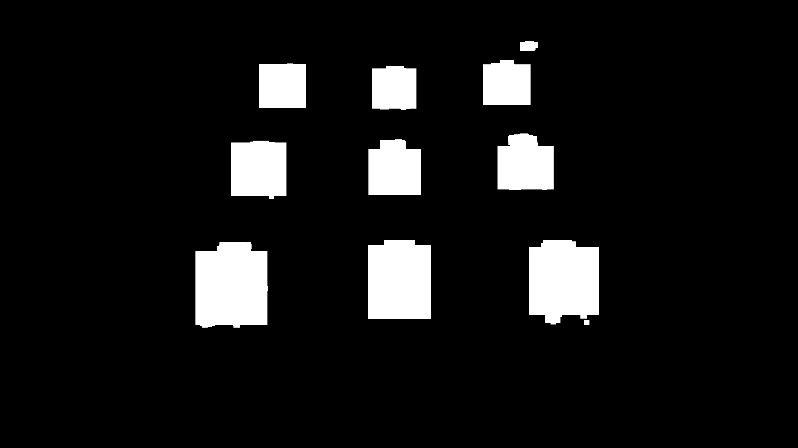


#### Bước 4: Tìm cụm bằng `findContours()`
Mỗi vùng trắng liên thông trên `mask_dilated` bây giờ đại diện cho một cụm đối tượng.

```python
contours, _ = cv2.findContours(mask_dilated, cv2.RETR_EXTERNAL, cv2.CHAIN_APPROX_SIMPLE)
```

#### Bước 5: Tính toán BBox kết quả (Tight BBox)
Nếu lấy BBox trực tiếp từ `mask_dilated` ở Bước 3, BBox kết quả sẽ bị phình to ra đúng bằng kích thước kernel dilation, dẫn đến label không sát vật thể.

Để khắc phục, thuật toán sử dụng phép toán `bitwise_and` giữa **mask của cụm hiện tại** và **mask gốc (chưa dilate)**. Việc này giúp trích xuất chính xác các pixel BBox ban đầu thuộc về cụm đó, loại bỏ hoàn toàn phần diện tích dư thừa do phép giãn nở gây ra.

```python
# group_mask: Mask của cụm sau khi dilate
# mask: Mask gốc chứa các BBox ban đầu
tight_mask = cv2.bitwise_and(mask, group_mask)

# BBox cuối cùng ôm sát các pixel gốc
x, y, w, h = cv2.boundingRect(tight_mask)
```

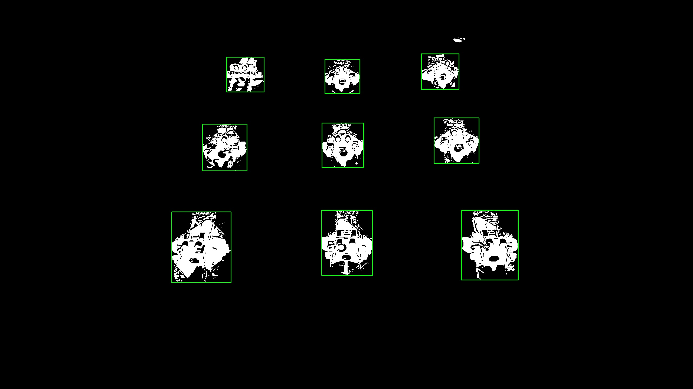


### 1.3. Lọc diện tích BBox
- Sử dụng tham số diện tích tối thiểu và tối đa để lọc các BBox có diện tích không phù hợp.
- Tham số hiện tại sử dụng : 
```python
    parser.add_argument("--min_area", type=int, default=2500, help="Minimum contour area")
    parser.add_argument("--max_area", type=int, default=500000, help="Maximum contour area")
```
- Kết quả :

|Chưa lọc| Đã lọc|
|:---:|:---:|
|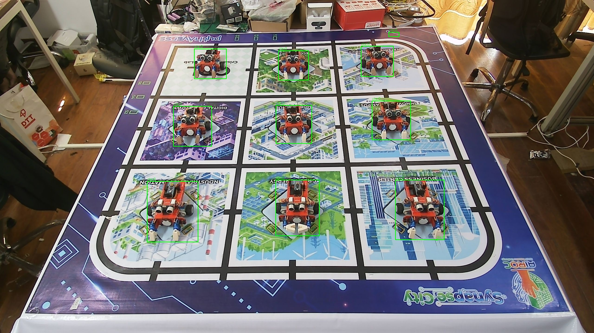||
|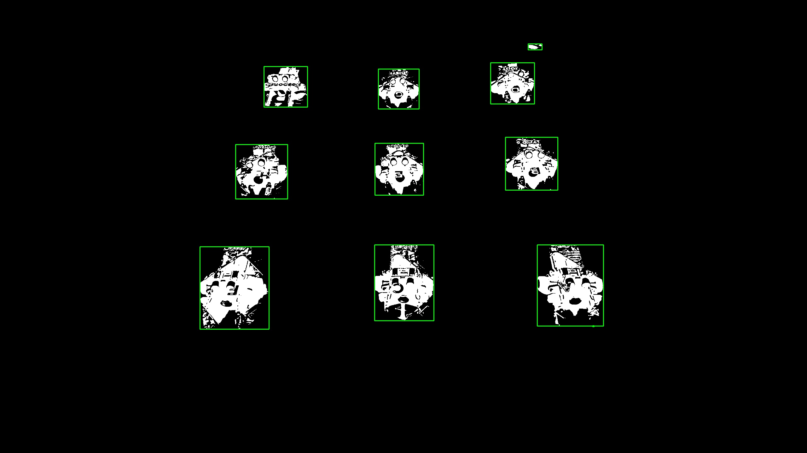||

- Sau khi lọc bằng tham số diện tích tối thiểu và tối đa, thì đã lọc được các BBox của nhiễu môi trường.

## 2. BenchMark với phương pháp cũ

| Đặc điểm | cv2.groupRectangles() | Mask-Based Merging |
| :--- | :--- | :--- |
| **Cơ chế** | Phân cụm theo kích thước/vị trí tương đồng | Gom nhóm theo sự liên thông không gian |
| **Gộp mảnh vỡ** | Không hiệu quả khi các mảnh khác size | Hiệu quả khi gộp mọi mảnh gần nhau) |
| **Tọa độ** | Tính trung bình (Average) | Lấy bao ngoài (Union) |
| **Độ sát** | Phụ thuộc vào mật độ detection | Sát hơn nhờ kỹ thuật trích xuất từ pixel ảnh gốc |

- Đây là kết quả thực tế khi chạy thử nghiệm các phương pháp ( đã lọc diện tích tối thiểu 2500 pixel )

|Method|RGB Debug|Gray Debug|
|:---:|:---:|:---:| 
|grouprectangles||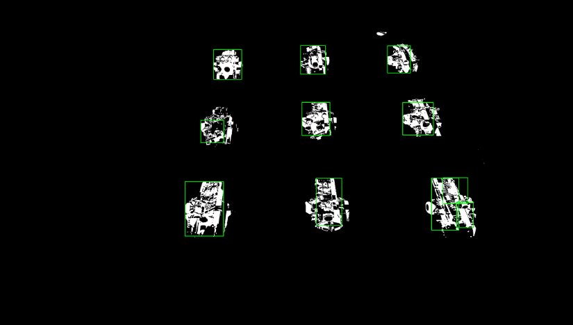|
|Overlap|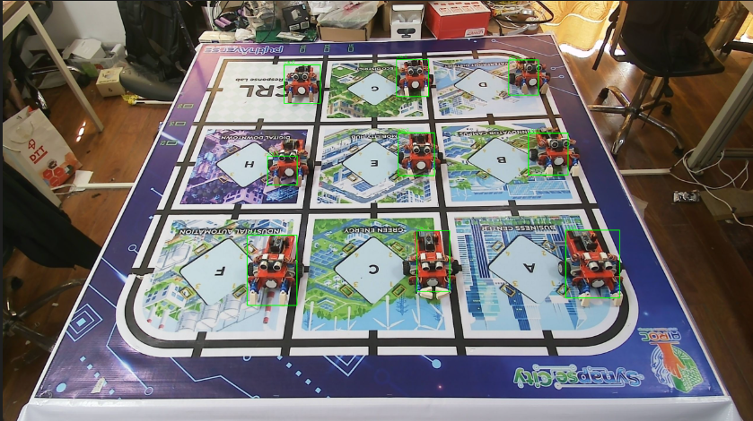|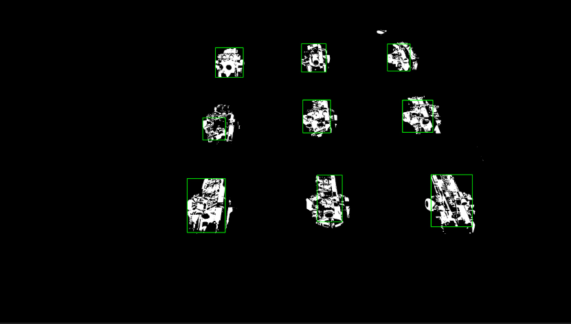|
|merge_distance_base|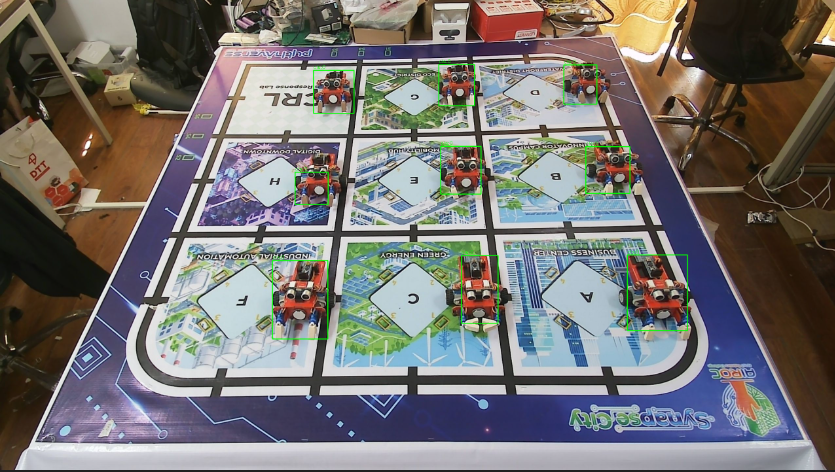|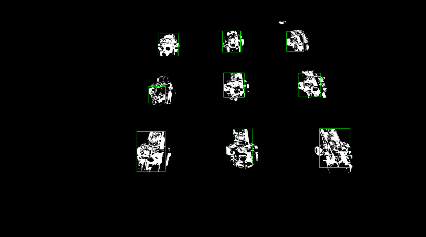|
|mask_based||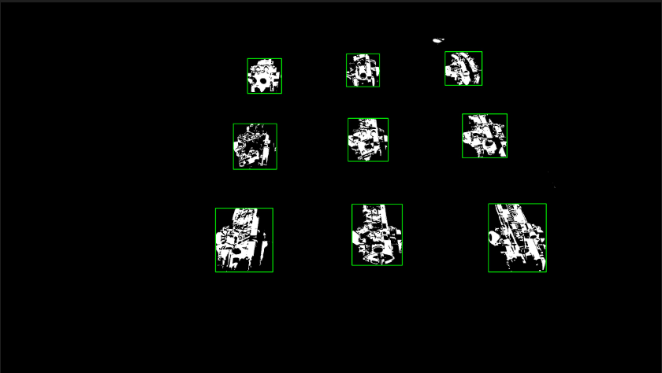|

- Kết quả cho thấy Phương pháp Mask_base tối ưu hơn cả, không cần xử lí hình thái ảnh trước khi gộp BBox, không làm thay đổi tính chất ban đầu của ảnh. 

## B. Khó khăn
- Không
## C. Công việc tiếp theo.
- Em xin phép nhận công việc tiếp theo từ Thầy ạ. 