# Báo cáo công việc ngày 29/04/2026.
## A. Công việc đã làm.
- Xóa các tool của phương pháp cũ, dọn dẹp, chỉnh sửa lại bộ Tools.
- Chụp lại data Leanbot và đặt tên đúng định dạng Leanbot_front/back_m/p0/15/30/45 . 
### 1. Chỉnh sửa và Hệ thống lại Tools
- Phương pháp đã chọn sử dụng là **Mask_based_Merging BBox**
- Xóa các phương pháp cũ, cấu hình cũ.
- Hiện tại bộ Tools bao gồm các file sau :

| Tên file | Vai trò trong Pipeline | Công dụng |
| :--- | :--- | :--- |
| **`capture_session.py`** | **1. Thu thập** | Công cụ chụp ảnh mẫu (background) và ảnh thực tế (raw) từ camera để tạo session. |
| **`mask_roi.py`** | **2. Cấu hình** | Hỗ trợ chọn vùng làm việc (ROI) bằng cách click chuột để loại bỏ nhiễu ngoài bàn. |
| **`process_auto_label.py`** | **3. Xử lý** | Script chính chạy gán nhãn tự động cho Session dựa trên phương pháp Mask-based. |
| **`auto_label_core.py`** | **Thư viện lõi** | Chứa toàn bộ logic xử lý chính (Merge BBox, Alignment, Image Diff). |
| **`alignment.py`** | **Thư viện con** | Hỗ trợ thuật toán căn chỉnh ảnh ECC. |
| **`abstract_hsv.py`** | **Thư viện con** | Hỗ trợ so sánh ảnh trên các không gian màu khác nhau. |
| **`build_dataset.py`** | **4. Tổng hợp** | Gom tất cả session đã gán nhãn vào một bộ Dataset chuẩn YOLO để train. |
| **`webcam_infer.py`** | **5. Kiểm tra** | Chạy thử nghiệm model thực tế từ webcam (Inference). |

### 2. Thu thập lại data và đặt tên
- Toàn bộ dữ liệu được chụp lại và đặt tên theo quy tắc: `Leanbot_[vị trí]_[hướng][góc].jpg`
- Trong đó: `m` là Minus (âm), `p` là Plus (dương).

| Góc | Leanbot Front | Leanbot Back |
| :---: | :---: | :---: |
| **-45°** | 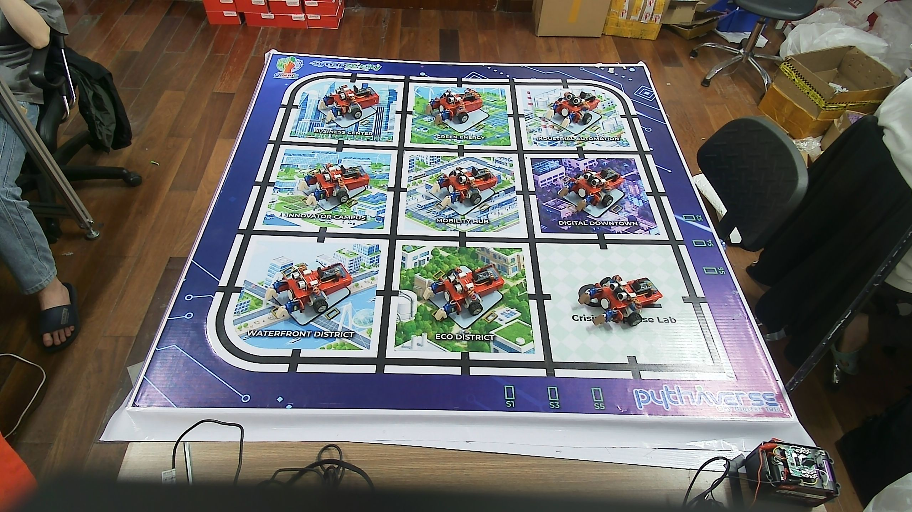 | 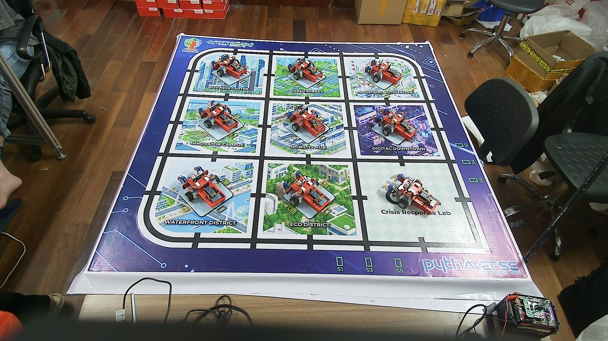 |
| **-30°** | 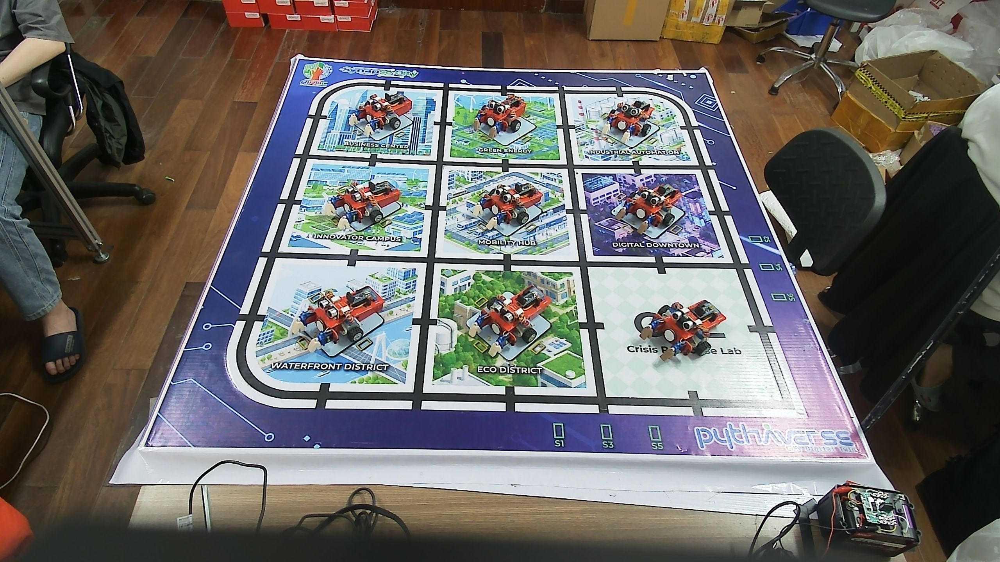 | 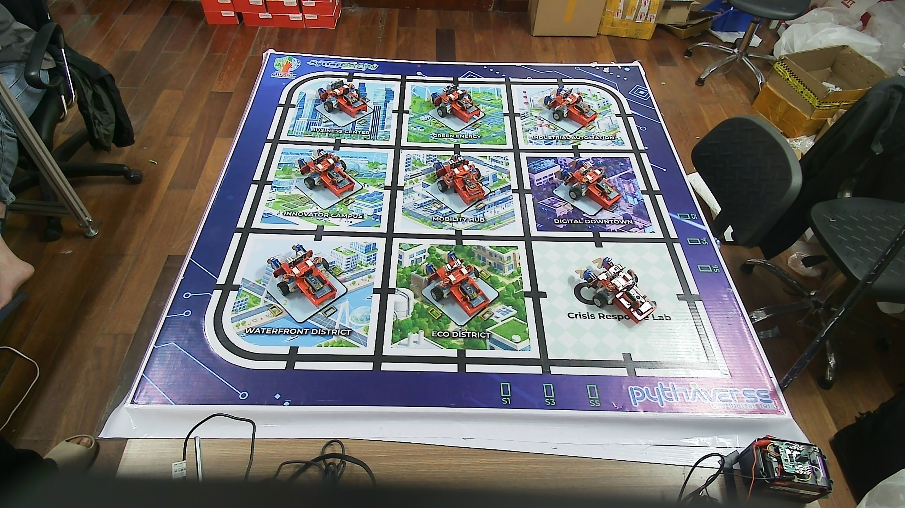 |
| **-15°** | 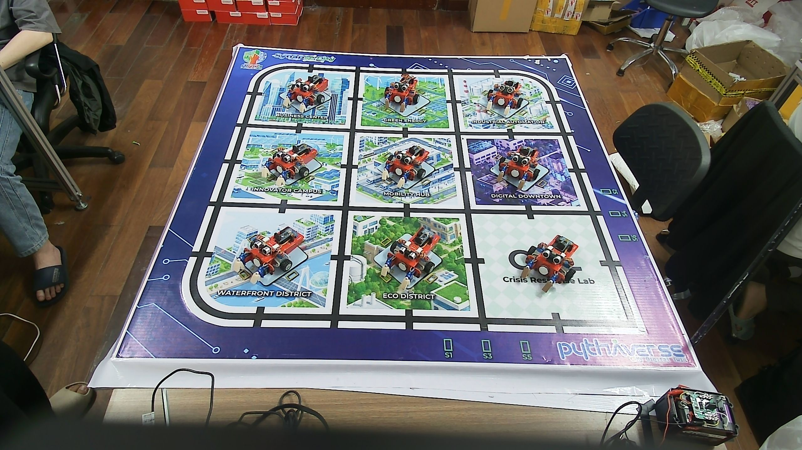 | 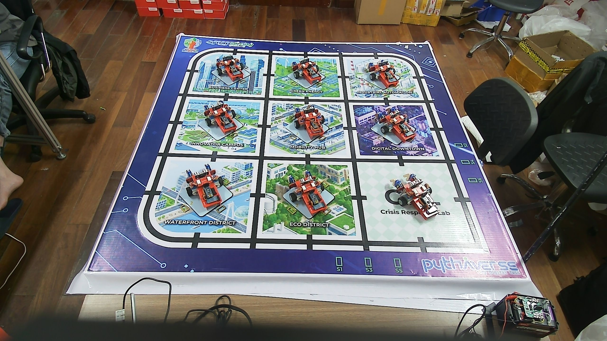 |
| **0°** | 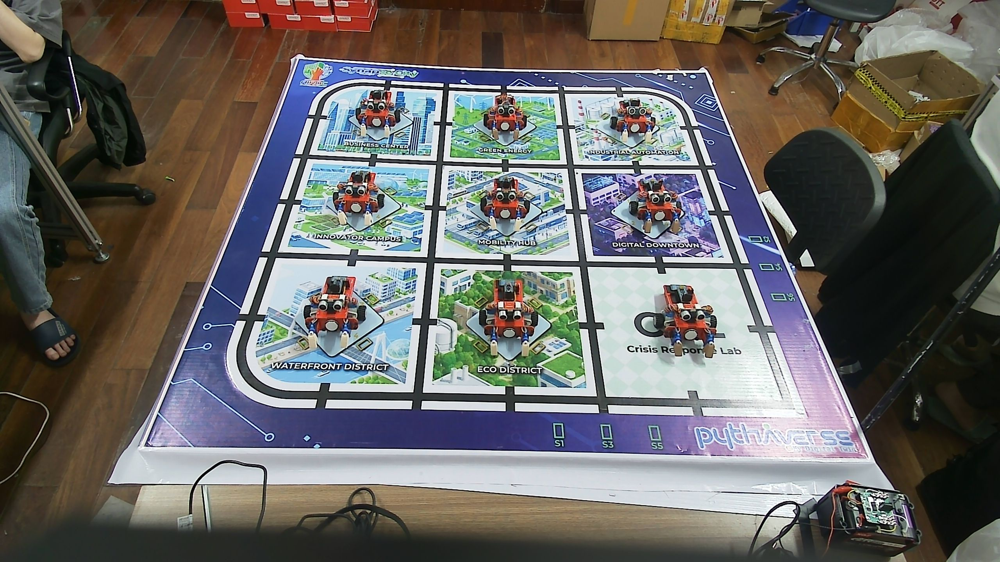 | 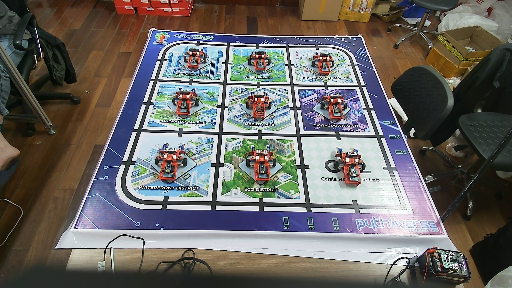 |
| **15°** | 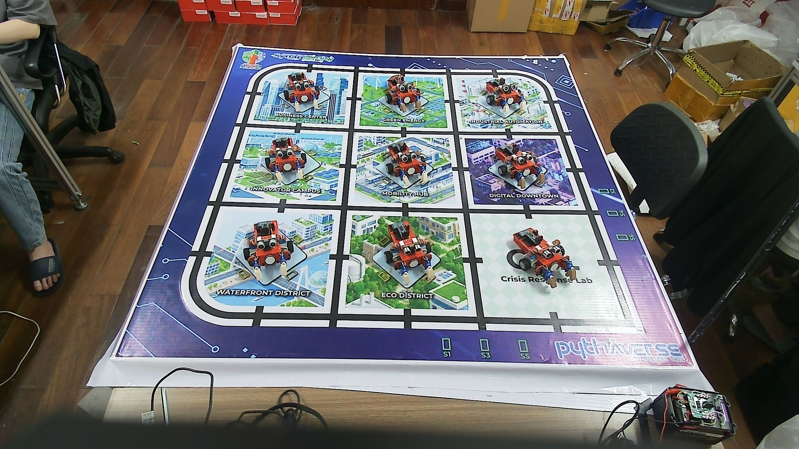 | 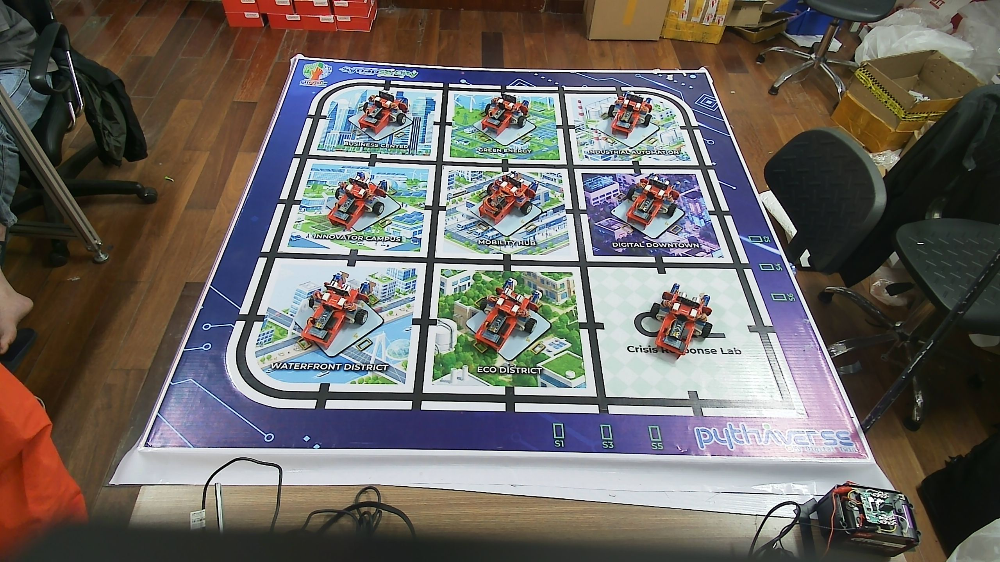 |
| **30°** | 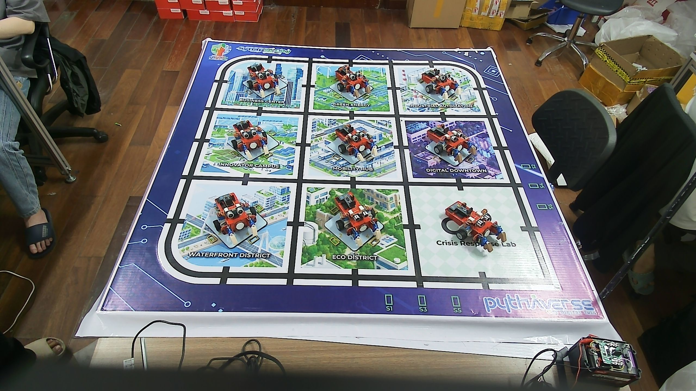 | 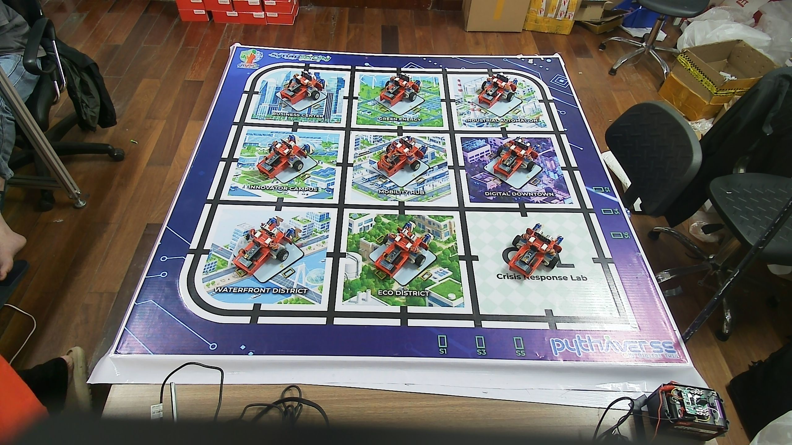 |
| **45°** | 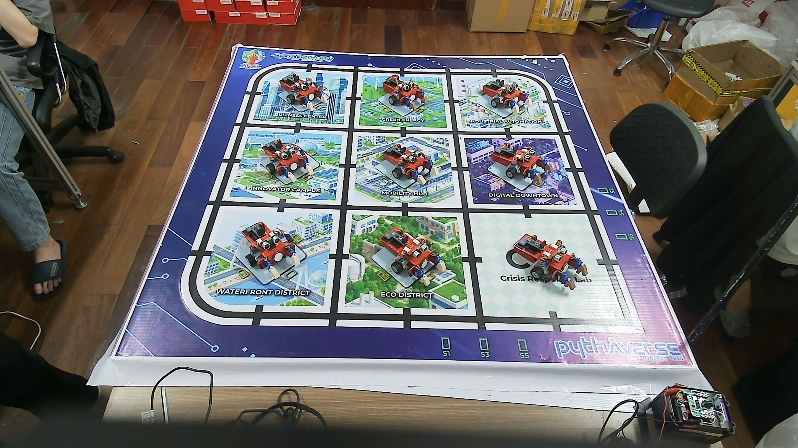 | 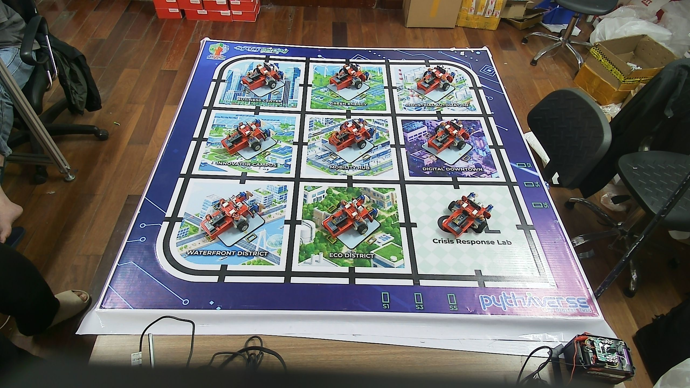 |

## B. Khó khăn.
- Khi chụp Leanbot thì góc nhìn của Cam với mỗi con Leanbot là khác nhau ạ. 
- Ví dụ với góc 0 độ, nếu là Leanbot chính diện, thì góc nhìn đúng là 0 độ , nhưng cùng lần chụp đó , đối với Leanbot ở góc trái hoặc phải là hình ảnh sẽ là của góc -15 độ và 15 độ.
- Tức là 1 bức hình chụp khi đặt Leanbot nằm 0 độ trên sa bàn thì Cam có thể nhìn dưới nhiều góc độ khác nhau ạ.
- Em chưa hiểu mục đích của việc chụp ảnh các mẫu Leanbot ở các góc cố định từ -45 tới 45 cho lắm ạ .
## C. Công việc tiếp theo. 
- Em có cần thu thập thêm ảnh Leanbot ở nhiều môi trường khác nhau không ạ ? Vì nếu chỉ lấy ảnh Leanbot ở trên Sa bàn thì Model sẽ học vẹt và không thực sự hiểu đặc trưng của Leanbot so với backgroud ạ ( hiện tượng overfitting )
