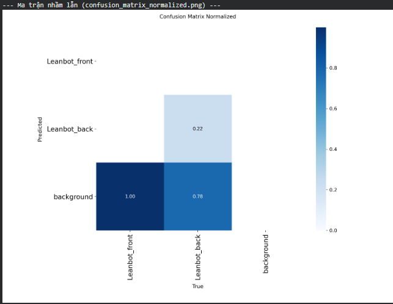
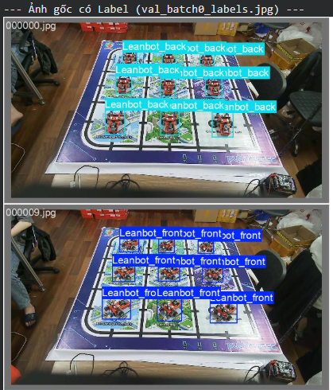
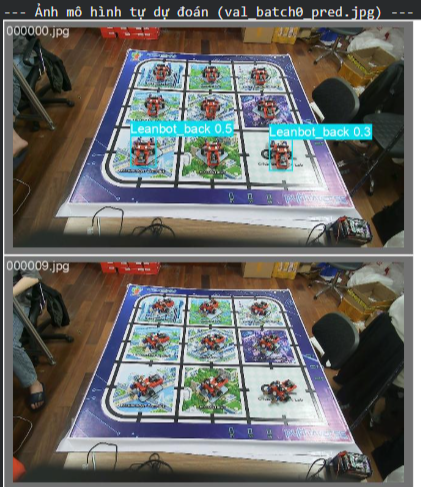

# Báo cáo công việc ngày 04/05/2026

## A. Công việc đã làm
- Báo cáo lại các file code Python trong bộ `tools`
- Báo cáo lại cấu trúc datasets
- Gắn nhãn cho 2 class `Leanbot_back` và `Leanbot_front` -> tiến hành training và đánh giá kết quả.

### 1. Báo cáo lại các file code Python trong bộ `tools`
- Hiện tại bộ Tools bao gồm các file sau :

| Tên file |Link code| Vai trò trong Pipeline | Công dụng |
| :--- | :--- | :--- | :---|
| **`capture_session.py`** | [Link capture_session.py](https://git.pythaverse.space/thomha/Nguyen_Huu_Hoang_Anh/blob/master/260504/tools/capture_session.py) | **1. Thu thập** | Công cụ chụp ảnh mẫu (background) và ảnh thực tế (raw) từ camera để tạo session. |
| **`mask_roi.py`** | [Link mask_roi.py](https://git.pythaverse.space/thomha/Nguyen_Huu_Hoang_Anh/blob/master/260504/tools/mask_roi.py) | **2. Cấu hình** | Hỗ trợ chọn vùng làm việc (ROI) bằng cách click chuột để loại bỏ nhiễu ngoài bàn. |
| **`process_auto_label.py`** | [Link process_auto_label.py](https://git.pythaverse.space/thomha/Nguyen_Huu_Hoang_Anh/blob/master/260504/tools/process_auto_label.py) | **3. Xử lý** | Script chính chạy gán nhãn tự động cho Session dựa trên phương pháp Mask-based. |
| **`auto_label_core.py`** | [Link auto_label_core.py](https://git.pythaverse.space/thomha/Nguyen_Huu_Hoang_Anh/blob/master/260504/tools/auto_label_core.py) | **Thư viện lõi** | Chứa toàn bộ logic xử lý chính (Merge BBox, Alignment, Image Diff). |
| **`alignment.py`** | [Link alignment.py](https://git.pythaverse.space/thomha/Nguyen_Huu_Hoang_Anh/blob/master/260504/tools/alignment.py) | **Thư viện con** | Hỗ trợ thuật toán căn chỉnh ảnh ECC. |
| **`abstract_hsv.py`** | [Link abstract_hsv.py](https://git.pythaverse.space/thomha/Nguyen_Huu_Hoang_Anh/blob/master/260504/tools/abstract_hsv.py) | **Thư viện con** | Hỗ trợ so sánh ảnh trên các không gian màu khác nhau. |
| **`build_dataset.py`** | [Link build_dataset.py](https://git.pythaverse.space/thomha/Nguyen_Huu_Hoang_Anh/blob/master/260504/tools/build_dataset.py) | **4. Tổng hợp** | Gom tất cả session đã gán nhãn vào một bộ Dataset chuẩn YOLO để train. |
| **`webcam_infer.py`** | [Link webcam_infer.py](https://git.pythaverse.space/thomha/Nguyen_Huu_Hoang_Anh/blob/master/260504/tools/webcam_infer.py) | **5. Kiểm tra** | Chạy thử nghiệm model thực tế từ webcam (Inference). |

### 2. Cập nhật tính năng hỗ trợ đa Class cho bộ công cụ
Để đáp ứng yêu cầu phân loại robot (`Leanbot_front` và `Leanbot_back`), bộ công cụ đã được cập nhật để hỗ trợ đánh dấu nhãn class ngay từ bước thu thập dữ liệu.

#### **Các thay đổi chính:**
*   **`capture_session.py`**:
    *   Thêm 2 tham số mới: `--class_name` (mặc định là "Leanbot") và `--class_id` (mặc định là 0).
    *   Sau khi kết thúc phiên chụp, script tự động tạo file `session_metadata.json` bên trong thư mục session để lưu lại thông tin class.
*   **`auto_label_core.py`**:
    *   Cập nhật hàm `save_capture_session_report` để thực hiện việc ghi file JSON metadata xuống ổ đĩa.
*   **`process_auto_label.py`**:
    *   Script tự động kiểm tra sự tồn tại của file `session_metadata.json`.
    *   Nếu tìm thấy, nó sẽ tự động sử dụng `class_id` từ file đó để đánh nhãn, thay vì dùng giá trị mặc định. Thông tin này cũng được cập nhật vào file log `config.npy` và `processing_config.json`.

#### **Cách sử dụng:**
**Bước 1: Chụp ảnh với class cụ thể**
```powershell
python tools/capture_session.py --class_name "Leanbot_front" --class_id 0 --source 1
# Hoặc cho mặt sau
python tools/capture_session.py --class_name "Leanbot_back" --class_id 1 --source 1
```
Lệnh này sẽ tạo thư mục session kèm theo file metadata đánh dấu class tương ứng.

**Bước 2: Chạy auto label**
```powershell
python tools/process_auto_label.py
```
Tool sẽ tự động nhận diện class từ metadata và áp dụng ID chính xác cho các file nhãn `.txt`.

### 3. Cấu trúc Datasets

#### 3.1. Raw_images
- Sau khi chụp ảnh các class `Leanbot_front` và `Leanbot_back`, ta thu được bộ dữ liệu thô trong `raw_image/` với cấu trúc:
```text
raw_image/
├── session_20260504_090104/
│   ├── backgrounds/
│   │   ├── background_000.jpg
│   │   └── ...
│   ├── raw_images/
│   │   ├── raw_000.jpg
│   │   └── ...
│   └── session_metadata.json  <-- Lưu thông tin class_id, class_name
└── session_20260504_090516/
    ├── backgrounds/
    ├── raw_images/
    └── session_metadata.json
```

#### 3.2. Tool1_output
- Sau khi sử dụng tool `process_auto_label.py`, kết quả thu được là bộ dữ liệu đã được căn chỉnh và gán nhãn trong `tool1_output`:
```text
tool1_output/
├── session_20260504_090104/
│   ├── aligned_images/        <-- Ảnh đã được căn chỉnh và xử lý (.jpg)
│   │   ├── raw_000.jpg
│   │   └── ...
│   ├── labels/                <-- File nhãn chuẩn YOLO (.txt)
│   │   ├── raw_000.txt
│   │   └── ...
│   ├── debug/                 <-- Ảnh debug để kiểm tra kết quả gán nhãn
│   ├── config.npy             <-- Lưu cấu hình ROI và tham số xử lý của session
│   └── roi_preview.jpg        <-- Ảnh preview vùng ROI đã chọn
└── processing_config.json     <-- Cấu hình tổng hợp của cả đợt chạy
```

#### 3.3. Datasets Training
- Cuối cùng, sử dụng tool `build_dataset.py` để gộp tất cả các session từ `tool1_output` thành một bộ dữ liệu duy nhất:
```text
datasets/
├── images/                    <-- Toàn bộ ảnh từ các session
├── labels/                    <-- Toàn bộ file nhãn tương ứng
└── manifest.json              <-- File thông tin toàn bộ ảnh trong datasets
```
### 4. Tiến hành Training và đánh giá 
- Chỉnh sửa file Colab train.ipynb để có thể train với bộ datasets có 2 Class trên ( ban đầu chỉ có 1 class nên cần thay đổi lại)
- **Cũ**:

```python
yaml_content = """
path: /content/datasets
train: train/images
val: val/images

names:
  0: Leanbot
"""
with open('leanbot_data.yaml', 'w') as f:
    f.write(yaml_content.strip())
```
- **Mới**:

```python
yaml_content = """
path: /content/datasets
train: train/images
val: val/images
test: test/images
nc: 2
names:
  0: Leanbot_front
  1: Leanbot_back
"""
with open('leanbot_data.yaml', 'w') as f:
    f.write(yaml_content.strip())
```
- Link code : [https://git.pythaverse.space/thomha/Nguyen_Huu_Hoang_Anh/blob/master/260504/tools/finetuning_yolo_Leanbot.ipynb](https://git.pythaverse.space/thomha/Nguyen_Huu_Hoang_Anh/blob/master/260504/tools/finetuning_yolo_Leanbot.ipynb)

- Kết quả train: 
+ Ma trận nhầm lẫn :



+ Kết quả model trên tập ảnh test :

|Ảnh gốc được đánh nhãn | Ảnh Model dự đoán|
|:---:|:---:|
||| 

**Đánh giá kết quả và Kết luận**

Dựa trên kết quả thực nghiệm với bộ dữ liệu gồm 14 mẫu (7 Front, 7 Back), mô hình hiện tại **chưa đạt hiệu quả** trong việc phân loại và nhận diện. Model gặp khó khăn trong việc phân biệt hai mặt của robot và có tỷ lệ bỏ sót đối tượng cao.

**Một số nguyên nhân có thể có :**
*   **Dữ liệu thiếu hụt trầm trọng**: Với chỉ 7 ảnh cho mỗi class, model không có đủ biến thể về góc độ, ánh sáng để học được các đặc trưng cốt lõi (features) của từng mặt. Điều này dẫn đến hiện tượng **Overfitting** (mô hình học thuộc lòng tập train nhưng không có khả năng tổng quát hóa trên dữ liệu mới).
*   **Thiếu sự đa dạng về bối cảnh (Background)**: Do toàn bộ ảnh được chụp trên cùng một nền tĩnh, mô hình có xu hướng "học" luôn cả đặc điểm của nền. Khi bối cảnh thay đổi dù chỉ một chút, độ chính xác sẽ giảm mạnh.
*   **Độ tương đồng cao**: Mặt trước và mặt sau của Leanbot có nhiều chi tiết giống nhau (bánh xe, khung vỏ), đòi hỏi lượng dữ liệu lớn hơn nhiều để AI có thể trích xuất được những điểm khác biệt nhỏ nhất.

#### **Hướng khắc phục đề xuất:**
*   Tăng số lượng mẫu cho mỗi class.
*   Thu thập dữ liệu trên nhiều môi trường nền và điều kiện ánh sáng khác nhau.
*   Sử dụng thêm các kỹ thuật **Data Augmentation** (tăng cường dữ liệu) mạnh hơn (thay đổi độ sáng, Hue, xoay, lật, cắt,... sau mỗi batch trong quá trình train)
## B. Khó khăn
- Hiện tại trong quá trình Auto label em chưa gặp ảnh nào bị lỗi nên chưa báo cáo riêng thành folder ```dificult_images``` ạ .
- *Mục đích là để đánh giá khả năng phát hiện góc Leanbot trên sa bàn (không phải góc nhìn của camera)*  
    - Em đã hiểu ý tưởng của Thầy rồi ạ, tuy nhiên em thắc mắc là Cam sẽ lấy data của nhiều Leanbot ở các vị trí khác nhau trên sa bàn nên dữ liệu của Leanbot đặt 30 độ ở góc trái sa bàn sẽ khác với Leanbot đặt 30 độ ở góc phải sa bàn ạ. Nên em nghĩ sẽ không thể theo cách này để phân biệt được góc Leanbot trên sa bàn ạ. 
- Vì 2 Class  Leanbot_front và Leanbot_back có độ tương đồng cao nên khó để phân biệt được ạ. Các đặc trưng để phân biệt 2 class này là rất nhỏ so với tổng thể ( ví dụ sự khác biệt giữa mặt trước và sau là có thể nhìn thấy 2 mắt tròn của cảm biến HC-SR04 ở mặt trước, nhưng đặc trưng này là quá nhỏ so với các đặc trưng tổng thể như màu Đỏ của Leanbot, Hình dáng chung,...)  
## C. Công việc tiếp theo
- Thử thu thập thêm data cho 2 Class Leanbot_front và Leanbot_back trên sa bàn, Trainnig lại và đánh giá kết quả lại. 