# Cập nhật báo cáo ngày 04/05/2026 
## A. Công việc đã làm 
- Thử thu thập thêm data cho 2 Class Leanbot_front và Leanbot_back trên sa bàn, Trainnig lại và đánh giá kết quả lại. 

### 1. Thu thập thêm data, Training và đánh giá kết quả
- Dữ liệu đã thu thập thêm bao gồm 42 ảnh (21 ảnh cho Class Leanbot_front và 21 ảnh cho Class Leanbot_back). Ảnh được chụp tại các vị trí khác nhau trên sa bàn ( Line đen, góc sa bàn,...) 

- **Kết quả sau khi Training với bộ dữ liệu mới như sau :**
- Ma trận nhầm lẫn: 
        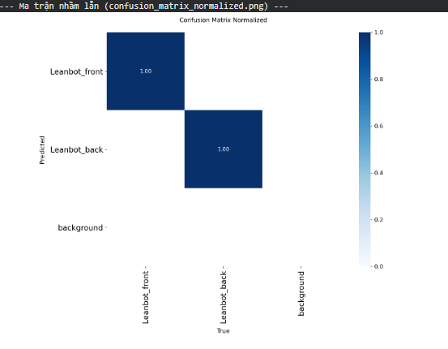

- **Kết quả so sánh ảnh Leabel gốc và detection của Model:**

|Label gốc| Model|
|:---:|:---:|
|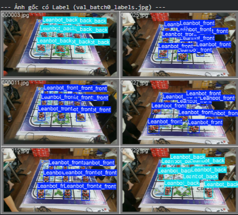|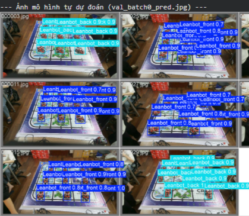|

- Kết quả trên tập test_images:

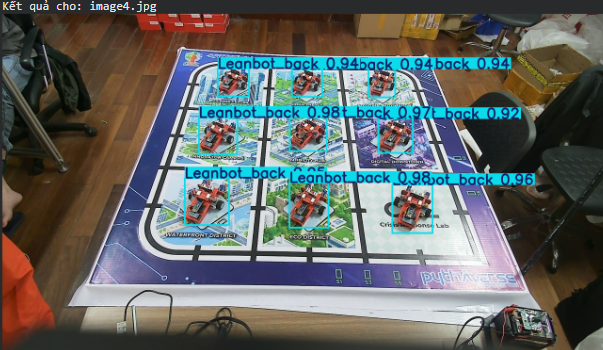
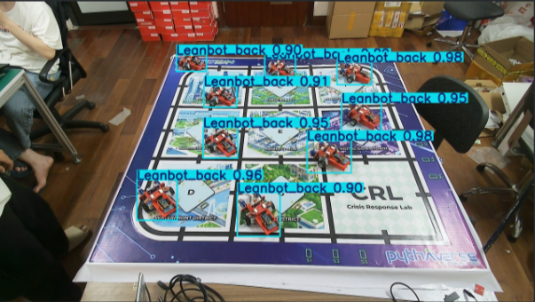
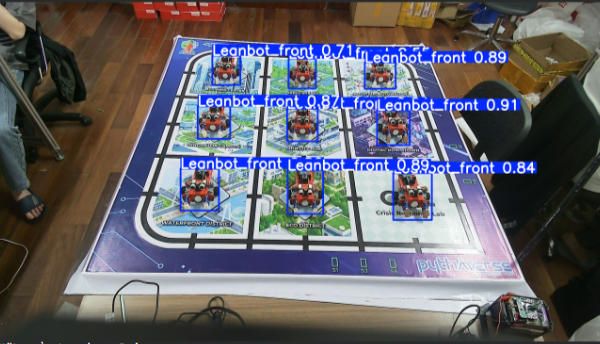
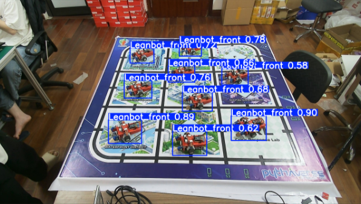
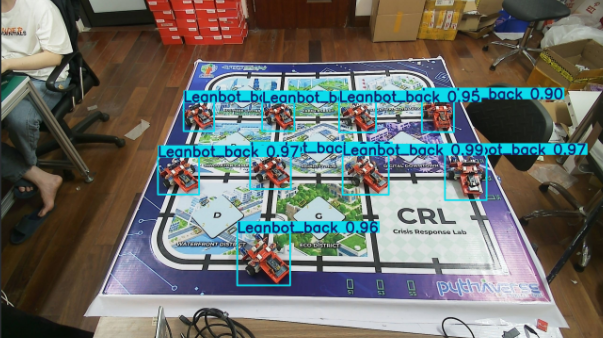
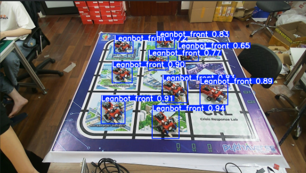
            
            
- **Tải model, thử nghiệm và đánh giá kết quả tổng quan:**
- Lệnh thực thi :
```powershell
python webcam_infer.py --source 1 
```
- Kết quả : 

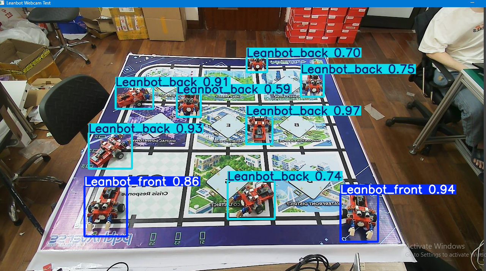

- **Kết luận** :
    - **Ưu điểm**: Sau khi tăng data thì model có cải thiện rõ rệt hơn về độ chính xác và khả năng phát hiện khi test trên tập ảnh test . 
    - **Hạn chế**: Tuy nhiên, khi tải model và chạy thực tế thì vẫn còn phát hiện nhầm lẫn với các Leanbot ở xa và có hiện tượng thiên lệch sang Leanbot Back ( có thể là đặc trưng dễ nhận diện hơn Leanbot_front) 
    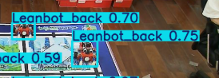

    - Với hạn chế này em nghĩ chỉ cần tăng thêm data là được ạ.

## B. Khó khăn 
- Không
## C. Công việc tiếp theo
1. Báo cáo rõ ràng và tạo bảng thông tin dataset cho training : 
- Những session nào 
- Bao nhiêu ảnh mỗi loại (cả background)
- Bao nhiêu label mỗi loại
- Chia ra tỷ lệ bao nhiêu cho training / validation /.test...  ?
- Thời gian training ?

2. Kiểm tra độ chính xác Detection khi chỉ training mỗi Class Leanbot trên cùng tập datasets cũ.

3. Tìm hiểu Data Augmentation có sẵn trong YOLO training 