# Cập nhật báo cáo ngày 05/05/2026

## A. Công việc đã làm
- Báo cáo rõ ràng và tạo bảng thông tin dataset cho training :
    - Model nền tảng sử dụng.
    - Số lượng session
    - Số lượng ảnh mỗi loại (cả background)
    - Số lượng Label mỗi loại
    - Tỷ lệ chia cho training / validation /.test
    - Thời gian training  

- Kiểm tra độ chính xác Detection khi chỉ training mỗi Class Leanbot trên cùng tập datasets cũ.
- Báo cáo các biểu đồ đánh giá quá trình training Model và thử nghiệm trên tập test.
- Tìm hiểu Data Augmentation có sẵn trong YOLO training 


---

### 1. Bảng thông tin Dataset cho lần Training

#### 1.1. Thông tin các Session thu thập

| Session | Class | Số ảnh Background | Số ảnh Raw | Số nhãn (labels) |
| :--- | :---: | :---: | :---: | :---: |
| `session_20260504_090104` | `Leanbot_back` | 1 | 7 | 7 |
| `session_20260504_090516` | `Leanbot_front` | 1 | 7 | 7 |
| `session_20260504_102751` | `Leanbot_front` | 1 | 14 | 14 |
| `session_20260504_103507` | `Leanbot_back` | 1 | 14 | 14 |
| **Tổng cộng** | | **4** | **42** | **42** |

#### 1.2. Thống kê theo Class

| Class | Class ID | Số ảnh | Số nhãn |
| :--- | :---: | :---: | :---: |
| `Leanbot_front` | 0 | 21 | 21 |
| `Leanbot_back` | 1 | 21 | 21 |
| **Tổng** | | **42** | **42** |

#### 1.3. Tỷ lệ chia Dataset (Stratified Split)

Sử dụng chiến lược **Stratified Split** để đảm bảo tỷ lệ 2 class luôn cân bằng trong mỗi tập.

| Tập | Tỷ lệ | Leanbot_front | Leanbot_back | Tổng |
| :--- | :---: | :---: | :---: | :---: |
| **Train** | 70% | 14 | 14 | 28 |
| **Validation** | 20% | 4 | 4 | 8 |
| **Test** | 10% | 3 | 3 | 6 |
| **Tổng** | 100% | **21** | **21** | **42** |

#### 1.4. Thông tin Training

| Thông số | Giá trị |
| :--- | :--- |
| Model nền tảng | `yolov8n.pt` (YOLOv8 Nano - Pre-trained trên COCO) |
| Số class | 2 (`Leanbot_front`, `Leanbot_back`) |
| Epochs | 150 |
| Image size | 640 x 640 |
| Thời gian Training | ~4 phút |
| Môi trường Training | Google Colab (GPU T4) |
| Link Notebook | [finetuning_yolo_Leanbot.ipynb](https://git.pythaverse.space/thomha/Nguyen_Huu_Hoang_Anh/blob/master/260505/tools/finetuning_yolo_Leanbot.ipynb) |

---

### 2. So sánh: 2 class (Front/Back) vs. 1 class (Leanbot chung)

> **Mục tiêu:** Sử dụng **cùng bộ dữ liệu 42 ảnh**, nhưng bỏ phân biệt class, gộp tất cả thành 1 class duy nhất là `Leanbot` để so sánh chất lượng nhận diện với mô hình 2 class.

#### 2.1. Chỉnh sửa lại code.
Để chạy thử nghiệm 1 class, cần sửa lại file YAML trong notebook:
```python
# Cấu hình 1 class (Leanbot chung)
yaml_content = """
path: /content/datasets
train: train/images
val: val/images
test: test/images
nc: 1
names:
  0: Leanbot
"""
```
Đồng thời, cần sửa lại tất cả các file nhãn `.txt` để đổi class ID `1` (Leanbot_back) thành `0` (gộp chung), hoặc chạy lại `process_auto_label.py` với `--class_id 0` cho tất cả các session.

#### 2.2. Kết quả chi tiết của 2 mô hình mô tả bằng các biểu đồ
- Khi hàm ```model.train()``` được chạy thì nó cũng sẽ trả về các hình ảnh metric đánh giá model như confusion matrix, PR curve và detection quality metrics ,...

> **Giải thích các metric:** Trước khi đọc kết quả, cần hiểu ý nghĩa của từng loại biểu đồ:
>
> | Metric | Ý nghĩa |
> | :--- | :--- |
> | **Precision (P)** | Trong số các vật thể model *phát hiện ra* → có bao nhiêu % là đúng. Precision cao = ít báo động giả (False Positive). |
> | **Recall (R)** | Trong số các vật thể *thực sự có trong ảnh* → model phát hiện được bao nhiêu %. Recall cao = ít bỏ sót (False Negative). |
> | **F1-Score** | Trung bình điều hòa giữa Precision và Recall. Đây là metric tổng hợp cân bằng nhất: `F1 = 2 * P * R / (P + R)`. F1 = 1.0 là hoàn hảo. |
> | **mAP@0.5** | Mean Average Precision tại ngưỡng IoU = 0.5. Đánh giá chất lượng phát hiện đối tượng tổng thể ở mức cơ bản. |
> | **mAP@0.5:0.95** | mAP trung bình từ IoU=0.5 đến 0.95. Tiêu chuẩn khắt khe hơn, đòi hỏi bounding box phải khớp rất chính xác. |
> | **Confusion Matrix** | Ma trận thể hiện số lần mỗi class thực tế (True) bị dự đoán là class nào (Predicted). Đường chéo chính = dự đoán đúng. |
> | **box_loss** | Lỗi về vị trí và kích thước bounding box. Giảm dần = model học tốt hơn cách khoanh vùng. |
> | **cls_loss** | Lỗi phân loại class. Giảm dần = model phân biệt class tốt hơn. |
> | **dfl_loss** | Distribution Focal Loss – lỗi về phân phối tọa độ cạnh của bounding box. Giảm dần = box khớp hơn. |

##### 2.2.1. Only Leanbot (1 class)
- **BoxF1 curve** – Đường cong F1 theo ngưỡng Confidence:
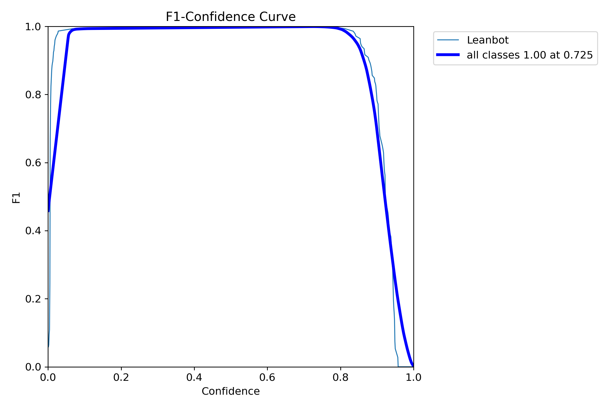
  > F1 đạt **1.00** tại confidence = **0.725**, duy trì ở mức gần 1.0 trong dải confidence từ ~0.05 đến ~0.85. Điều này cho thấy mô hình duy trì được sự cân bằng giữa Precision và Recall ở phạm vi ngưỡng rộng.

- **BoxPR curve** – Đường cong Precision–Recall:
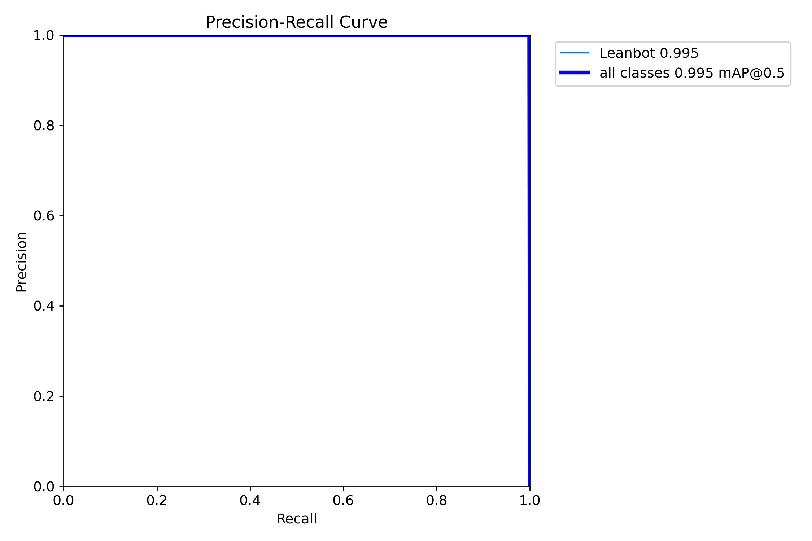
  > Diện tích dưới đường cong (AUC) = **mAP@0.5 = 0.995**. Đường cong Precision–Recall duy trì Precision = 1.0 trong toàn bộ dải Recall từ 0 đến 1.0, cho thấy mô hình không có sự đánh đổi (trade-off) giữa Precision và Recall.

- **BoxP curve** – Đường cong Precision theo Confidence:
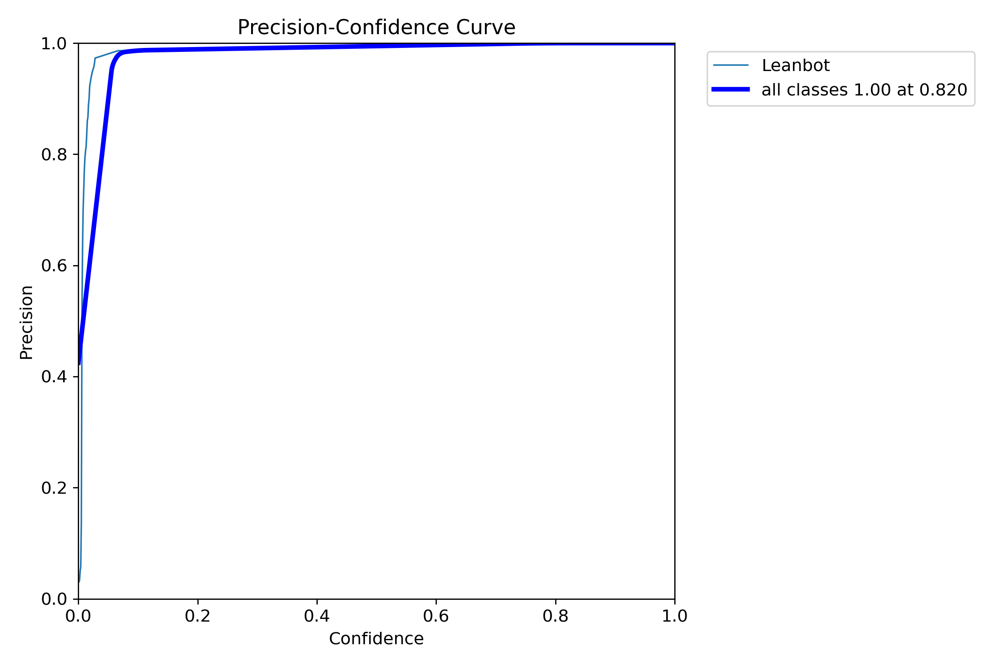
  > Precision đạt **1.00** tại confidence = **0.820** và duy trì ở mức 1.0 ở mọi confidence cao hơn. Model không tạo ra bất kỳ False Positive nào khi confidence > 0.82.

- **BoxR curve** – Đường cong Recall theo Confidence:
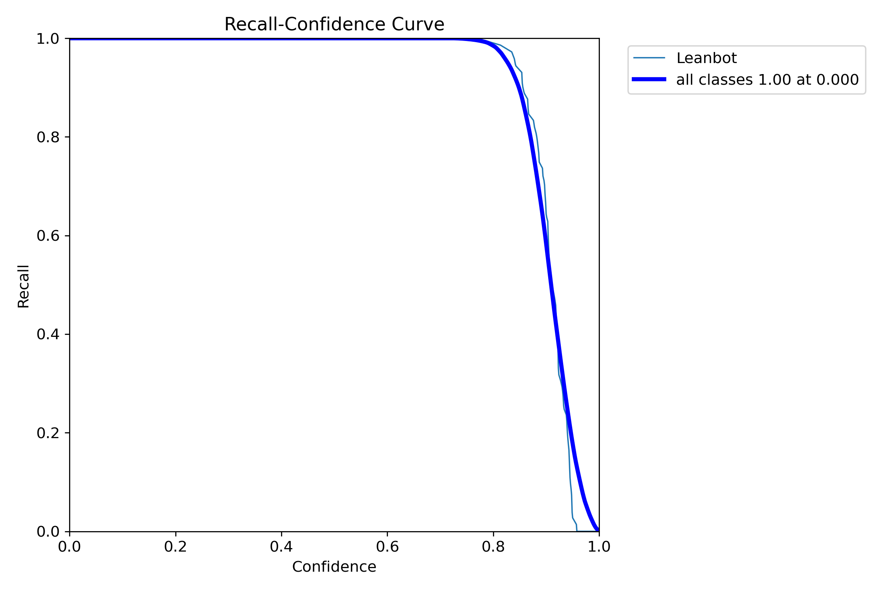
  > Recall = **1.00** (không bỏ sót đối tượng nào) trong toàn bộ dải confidence từ 0 đến ~0.80. Khi confidence vượt ngưỡng 0.80, Recall bắt đầu giảm do mô hình áp dụng ngưỡng lọc chặt chẽ hơn.

- **Confusion Matrix** – Ma trận nhầm lẫn (số lượng tuyệt đối):
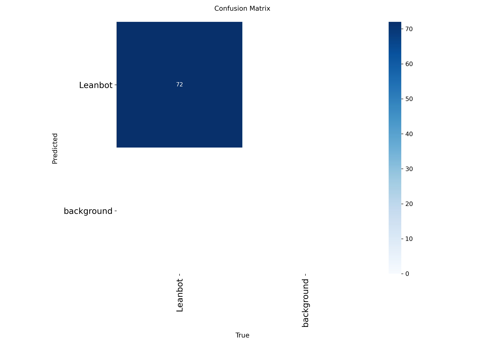
  > **72 lần** model dự đoán đúng "Leanbot" → "Leanbot". Không có ô nào khác trong ma trận có giá trị (bằng 0), nghĩa là model không nhầm lẫn bất kỳ đối tượng nào thành background và ngược lại.

- **Confusion Matrix Normalized** – Ma trận nhầm lẫn (tỉ lệ %):
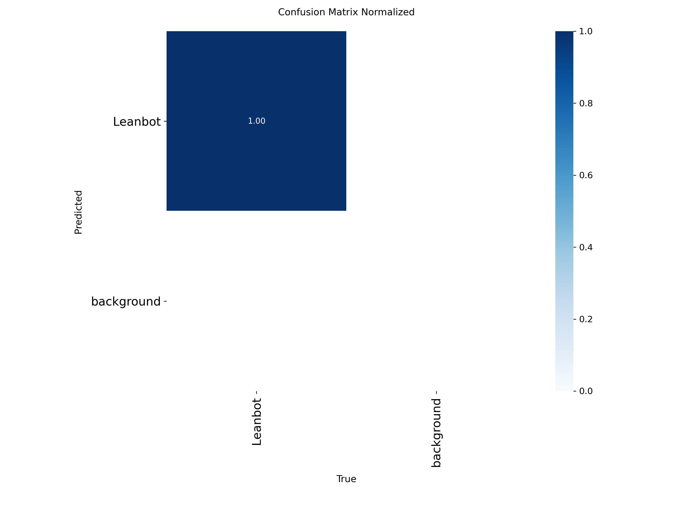
  > Tỉ lệ phân loại đúng = **1.00 (100%)** cho class Leanbot. Hoàn toàn không có lỗi phân loại.

- **Labels** – Phân bố nhãn trong dataset:
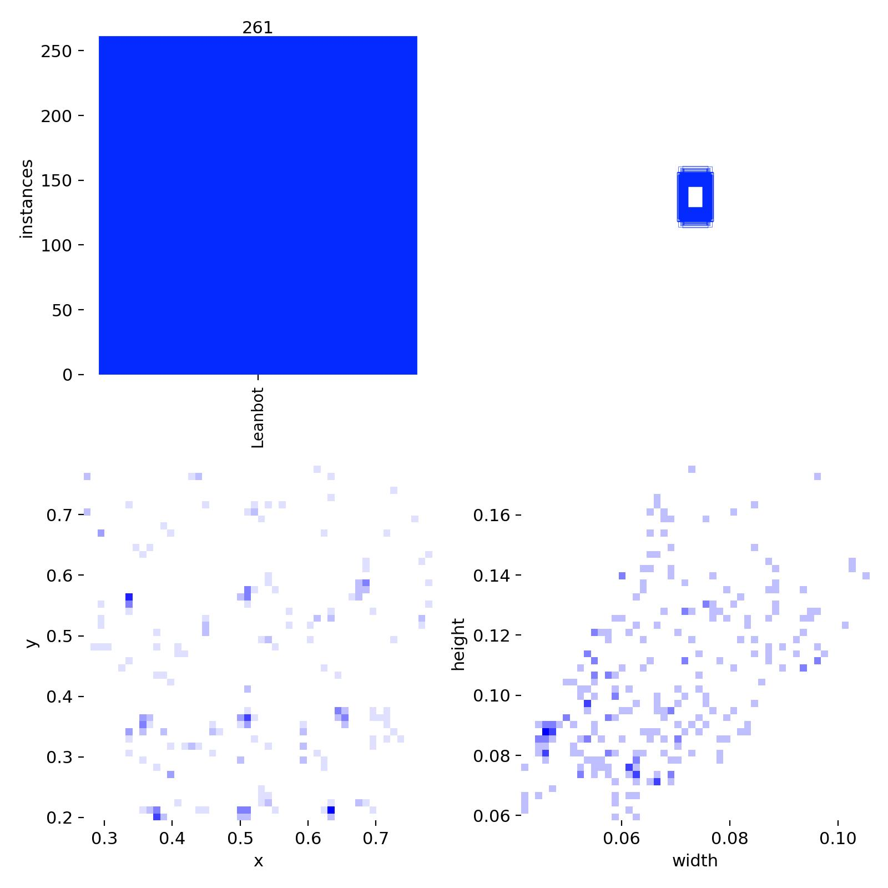
  > Tổng **261 instances** (mẫu) cho class `Leanbot`. Biểu đồ phân bố tọa độ (x, y) cho thấy các Leanbot xuất hiện rải rác khắp ảnh (x từ 0.3 đến 0.7, y từ 0.2 đến 0.7), không bị lệch về góc nào. Kích thước **bounding box** nhỏ và tương đối đồng đều (**width** ~0.05–0.09, **height** ~0.07–0.11), phù hợp với việc Leanbot là đối tượng nhỏ nhìn từ trên xuống.

- **Results** – Đường cong Loss và Metric qua 150 epochs:
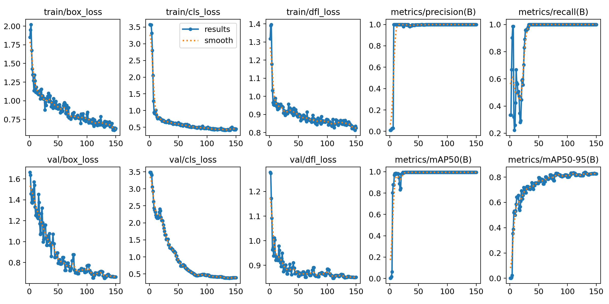
  > Cả 3 loại loss (`box_loss`, `cls_loss`, `dfl_loss`) đều giảm đều trên cả tập train và val. `mAP@0.5` đạt ~1.0 chỉ sau ~20 epochs và duy trì ổn định. `mAP@0.5-95` tiếp tục cải thiện đều đặn, đạt ~0.85 sau 150 epochs. Không có dấu hiệu overfitting.

- **Test Result** – Kết quả nhận diện trên tập test:
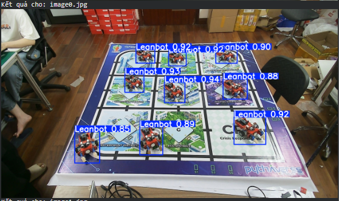
  > Mô hình xác định tất cả đối tượng Leanbot với độ tin cậy từ **0.85 đến 0.94**. Các bounding box được xác định chính xác.

##### 2.2.2. Leanbot_front and Leanbot_back (2 class)
- **BoxF1 curve** – Đường cong F1 theo ngưỡng Confidence:
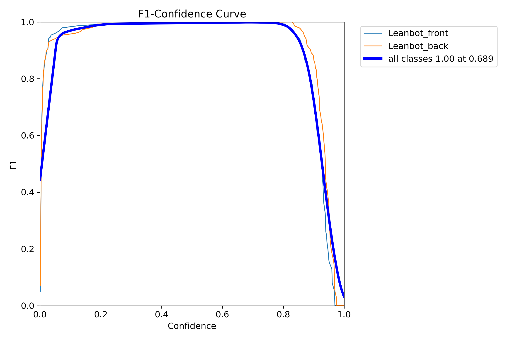
  > F1 đạt **1.00** tại confidence = **0.689** cho cả 2 class (Leanbot_front và Leanbot_back), tương đương với mô hình 1 class.

- **BoxPR curve** – Đường cong Precision–Recall:
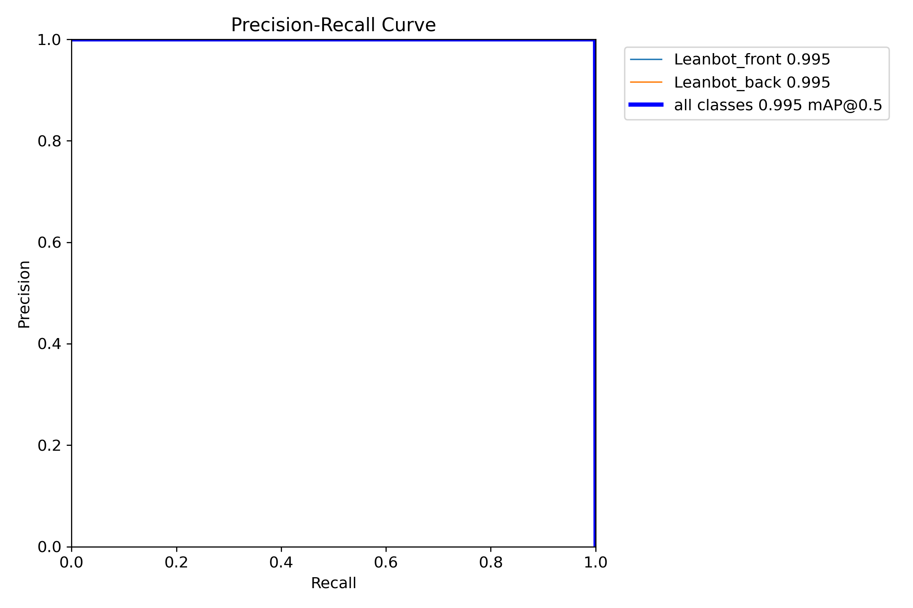
  > **mAP@0.5 = 0.995** cho cả 2 class. Đường cong Precision–Recall duy trì Precision = 1.0 trong toàn bộ dải Recall.

- **BoxP curve** – Đường cong Precision theo Confidence:
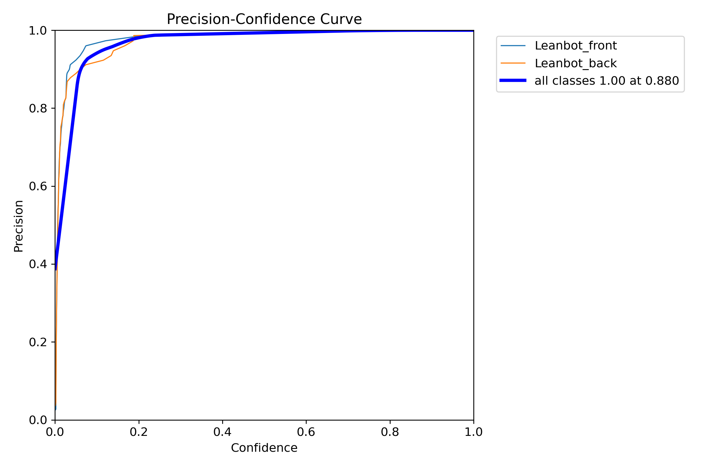

- **BoxR curve** – Đường cong Recall theo Confidence:
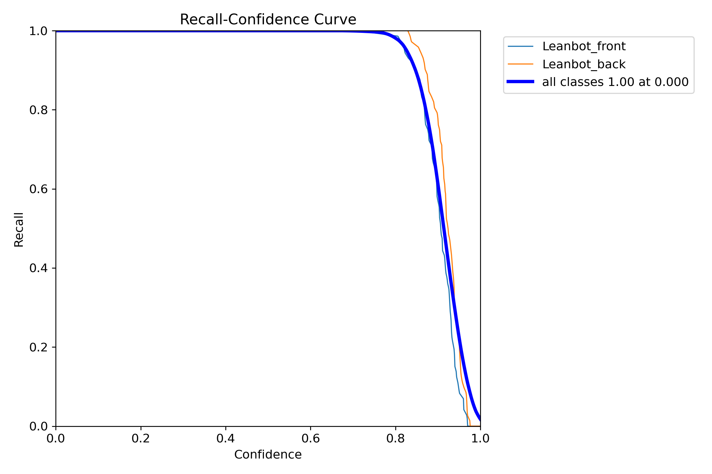

- **Confusion Matrix** – Ma trận nhầm lẫn (số lượng tuyệt đối):

  > **72** dự đoán đúng Leanbot_front, **72** dự đoán đúng Leanbot_back. Không có ô nào off-diagonal có giá trị → model không có nhầm mặt trước với mặt sau.

- **Confusion Matrix Normalized** – Ma trận nhầm lẫn (tỉ lệ %):
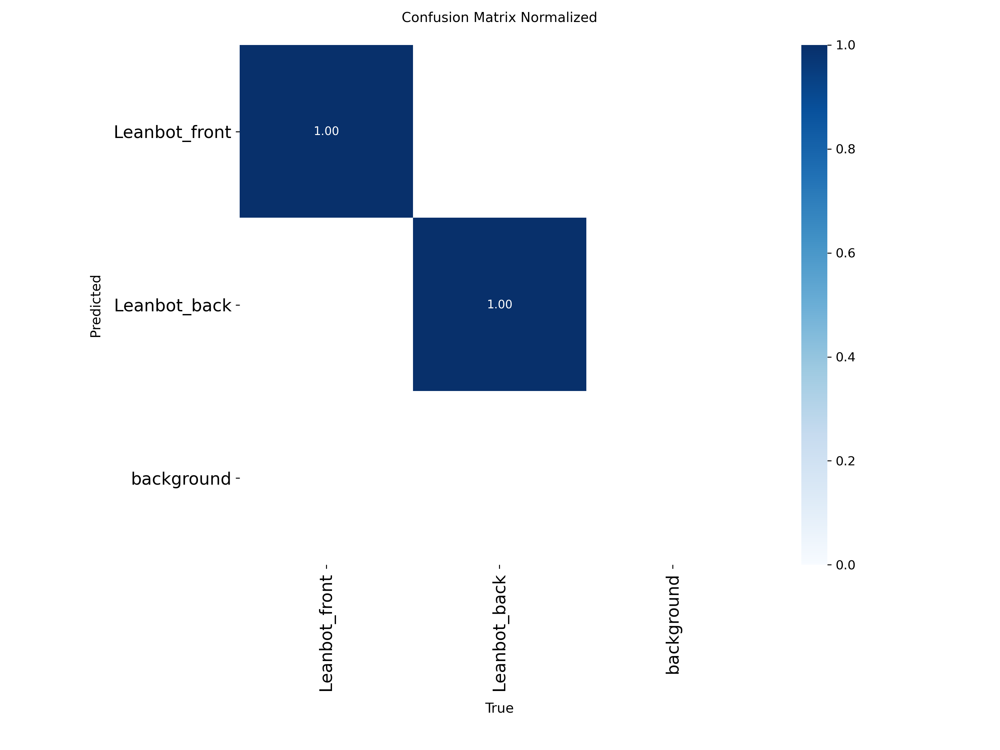
  > Cả 2 class đều đạt tỉ lệ phân loại đúng **1.00 (100%)**. Không có sự nhầm lẫn giữa Leanbot_front và Leanbot_back.

- **Labels** – Phân bố nhãn trong dataset:
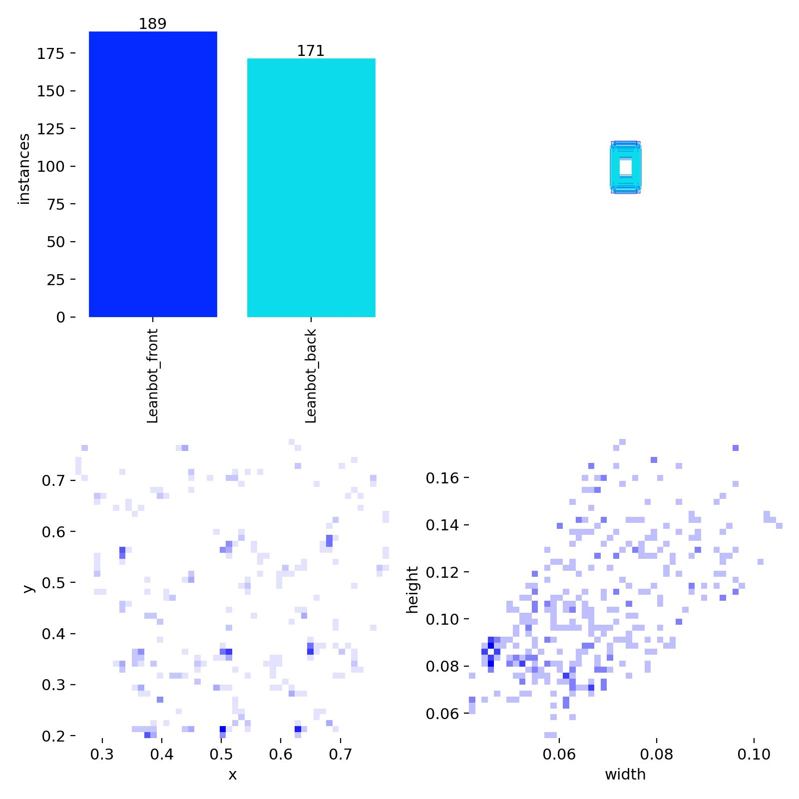
  > **189 instances** (mẫu) `Leanbot_front` và **171 instances** `Leanbot_back` – tỉ lệ khá cân bằng (52.5% / 47.5%). Phân bố vị trí và kích thước **bounding box** tương tự mô hình 1 class. Sự phân bố đều này là lý do tại sao **Stratified Split** (chia tập dữ liệu theo tỉ lệ cân bằng giữa các class) hoạt động hiệu quả.

- **Results** – Đường cong Loss và Metric qua 150 epochs:
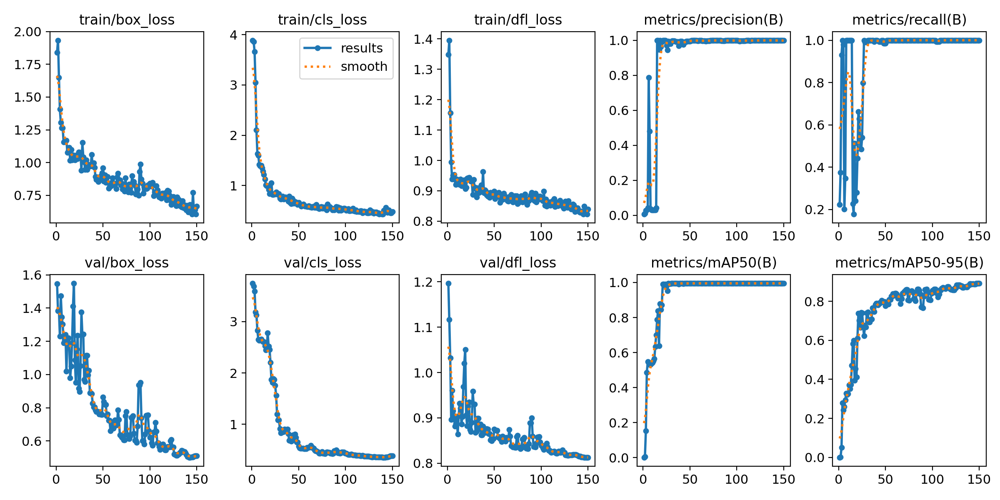
  > Các hàm loss giảm đều qua các epoch. `mAP@0.5` đạt ~1.0 sau ~25 epochs, chậm hơn mô hình 1 class khoảng 5 epoch do bài toán phân loại phức tạp hơn. `mAP@0.5-95` tiếp tục tăng và đạt ~0.90 sau 150 epochs, cao hơn mô hình 1 class.

- **Test Result (Front)** – Kết quả trên ảnh mặt trước Leanbot:
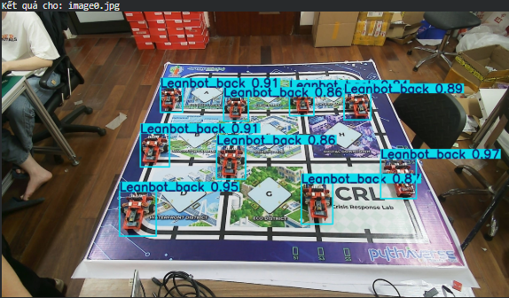
  > Phát hiện đúng tất cả `Leanbot_front` với confidence từ **0.88 đến 0.98**. Không nhầm lẫn với mặt sau.

- **Test Result (Back)** – Kết quả trên ảnh mặt sau Leanbot:
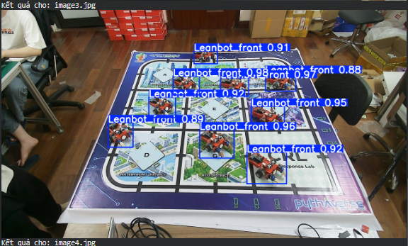
  > Phát hiện đúng tất cả `Leanbot_back` với confidence từ **0.86 đến 0.97**. Không nhầm lẫn với mặt trước.

### 3. Data Augmentation có sẵn trong YOLO

YOLO (thư viện Ultralytics) tích hợp sẵn một bộ **Data Augmentation**, được áp dụng tự động trong quá trình training. Tất cả các tham số này có thể được cấu hình khi gọi hàm `model.train()`.

#### 3.1. Bảng các kỹ thuật Augmentation chính

| Tham số | Mặc định | Mô tả |
| :--- | :---: | :--- |
| `hsv_h` | 0.015 | Thay đổi ngẫu nhiên **Hue** (màu sắc) ±1.5% |
| `hsv_s` | 0.7 | Thay đổi ngẫu nhiên **Saturation** (độ bão hòa) ±70% |
| `hsv_v` | 0.4 | Thay đổi ngẫu nhiên **Value** (độ sáng) ±40% |
| `degrees` | 0.0 | Xoay ảnh ngẫu nhiên (độ) |
| `translate` | 0.1 | Dịch chuyển ảnh ngẫu nhiên ±10% chiều rộng/cao |
| `scale` | 0.5 | Thu/phóng ảnh ngẫu nhiên ±50% |
| `shear` | 0.0 | Biến dạng cắt (shear) ảnh |
| `perspective` | 0.0 | Biến đổi phối cảnh 3D ngẫu nhiên |
| `flipud` | 0.0 | Lật ảnh theo chiều dọc (xác suất) |
| `fliplr` | 0.5 | Lật ảnh theo chiều ngang (xác suất 50%) |
| `mosaic` | 1.0 | Ghép 4 ảnh thành 1 (Mosaic Augmentation) |
| `mixup` | 0.0 | Trộn 2 ảnh lại với nhau (MixUp) |
| `copy_paste` | 0.0 | Cắt đối tượng và dán vào ảnh khác (Copy-Paste) |
| `erasing` | 0.4 | Xóa ngẫu nhiên một vùng trong ảnh |
| `crop_fraction` | 1.0 | Tỷ lệ crop ảnh trong quá trình phân loại |

- Hiện tại đang sử dụng 3 cấu hình Augmentation 
```python
degrees=10.0, fliplr=0.5, flipud=0.1
```

## B. Khó khăn
- Không

## C. Công việc tiếp theo
- Em xin phép nhận đề xuất hướng đi tiếp theo từ Thầy ạ . 
