# Báo cáo công việc ngày 07/05/2026

## A. Công việc đã làm
- Thu thập thêm ảnh Leanbot_Left và Leanbot_Right với các góc nghiêng : 0, +-15, +-30 độ.
- Trainning và đánh giá kết quả so với 2 mô hình trước đó 

### 1. Thu thập data Leanbot_Left và Leanbot_Right
- Với các góc từ 0, +-15, +-30 độ:
  - Ảnh Leanbot_Left : 5 ảnh / góc
  - Ảnh Leanbot_Right : 5 ảnh / góc 

|Góc|Leanbot_Left|Leanbot_Right|
|---|---|---|
|30 độ||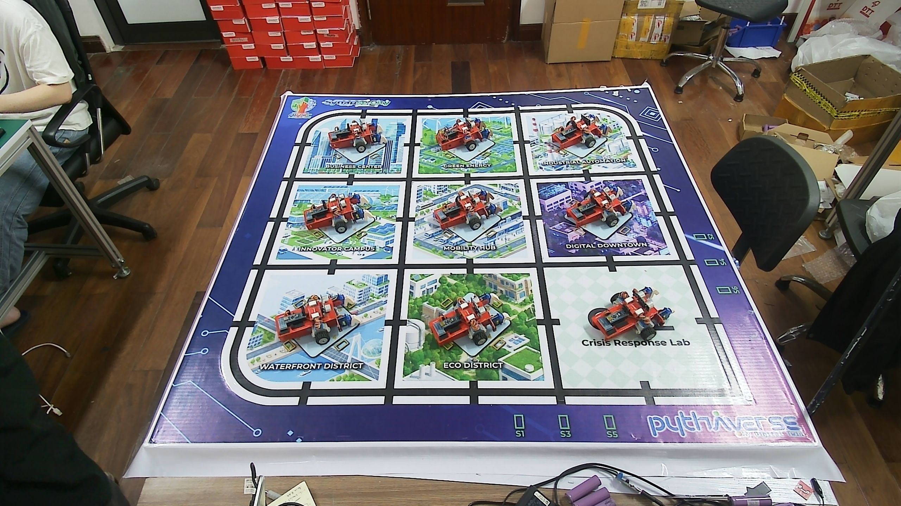|
|15 độ|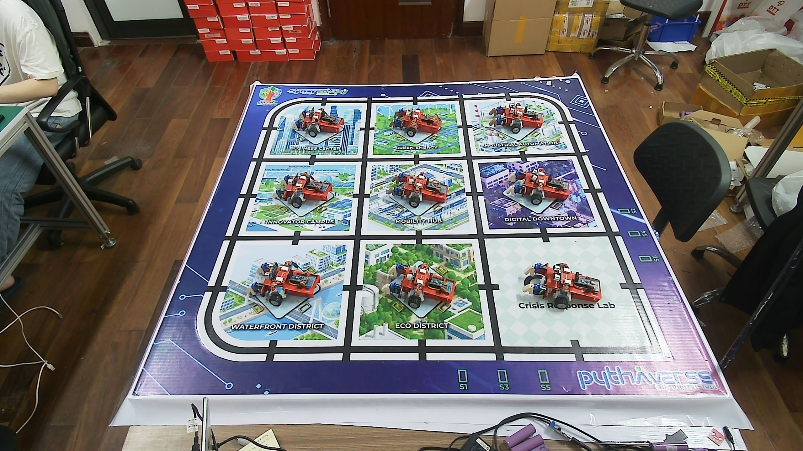|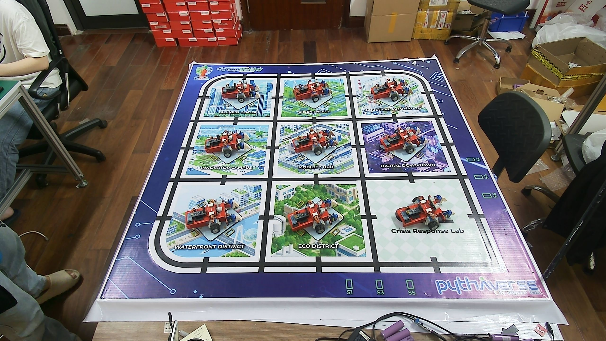|
|0 độ|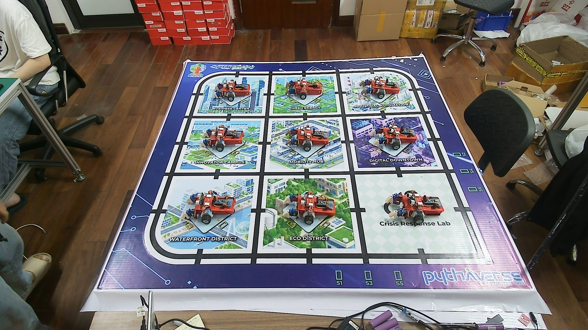||
|-15 độ|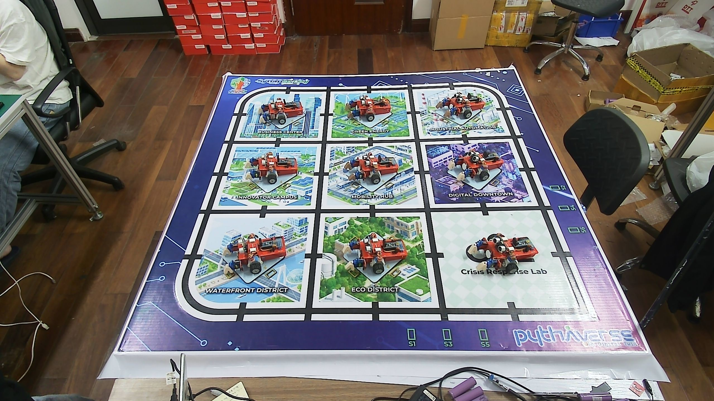|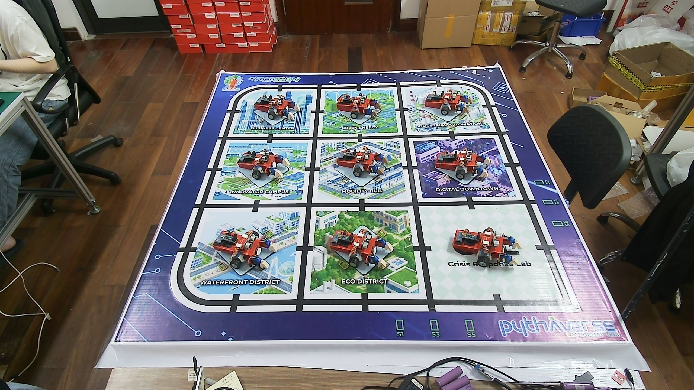|
|-30 độ|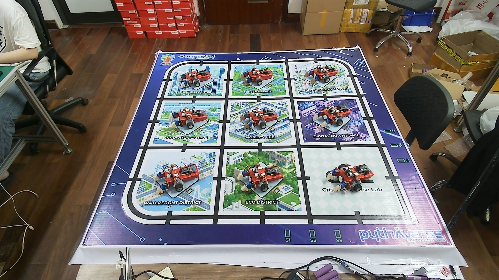|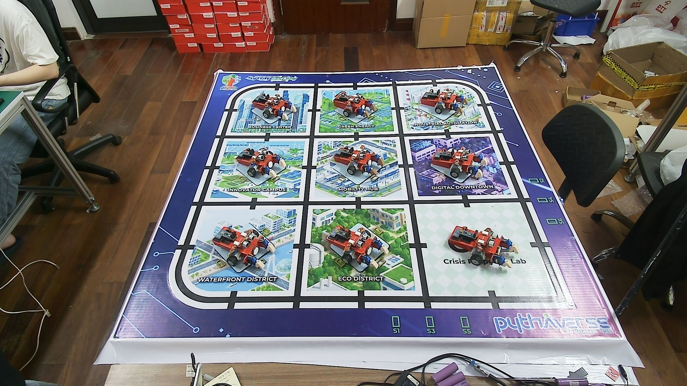|

- Tổng lượng ảnh cơ sở là 10, tuy nhiên lượng ảnh như vậy là quá ít để training -> Thu thập thêm data các góc ở nhiều vị trí trên sa bàn. 
- Thống kê datasets như bảng sau : 

| Session | Class | Số ảnh Background | Số ảnh Raw | Số nhãn trên 1 ảnh |
| :--- | :---: | :---: | :---: | :---: |
| `session_20260507_093650` (Base) | `Leanbot_Right` | 1 | 5 | 9 |
| `session_20260507_093932` (Base) | `Leanbot_Left` | 1 | 5 | 9 |
| `session_20260505_115856` | `Leanbot_right` | 1 | 10 | 9 |
| `session_20260505_120425` | `Leanbot_left` | 1 | 10 | 9 |
| `session_20260507_094132` | `Leanbot_Left` | 1 | 10 | 9 |
| `session_20260507_094449` | `Leanbot_Right` | 1 | 10 | 9 |
| **Tổng cộng** | | **6** | **50** | **450** |

#### 1.2. Thống kê theo class :

| Class | Class ID | Số ảnh | Số nhãn |
| :--- | :---: | :---: | :---: |
| `Leanbot_Right` | 0 | 25 | 225 |
| `Leanbot_Left` | 1 | 25 | 225 |
| **Tổng** | | **50** | **450** |

#### 1.3. Tỷ lệ chia Dataset (Stratified Split)

Sử dụng chiến lược **Stratified Split** để đảm bảo tỷ lệ 2 class luôn cân bằng trong mỗi tập.

| Tập | Tỷ lệ | Leanbot_Right | Leanbot_Left | Tổng |
| :--- | :---: | :---: | :---: | :---: |
| **Train** | 70% | 17 | 18 | 35 |
| **Validation** | 20% | 5 | 5 | 10 |
| **Test** | 10% | 3 | 2 | 5 |
| **Tổng** | 100% | **25** | **25** | **50** |

#### 1.4. Thông tin Training

##### 1.4.1. Bảng so sánh thông tin Training giữa các mô hình

| Thông số | 1 Class (`Leanbot`) | 2 Class (`Front`/`Back`) | 2 Class (`Left`/`Right`) |
| :--- | :---: | :---: | :---: |
| Model nền tảng | `yolov8n.pt` | `yolov8n.pt` | `yolov8n.pt` |
| Số class | 1 | 2 | 2 |
| Epochs | 100 | 100 | 100 |
| Batch size | 16 | 16 | 16 |
| Image size | 640 × 640 | 640 × 640 | 640 × 640 |
| Optimizer | AdamW | AdamW | AdamW |
| Thời gian Training | ~2.5 phút | ~4 phút | ~2 phút |
| Môi trường | Google Colab | Google Colab | Google Colab |
| Link Notebook | [Link Colab](https://git.pythaverse.space/thomha/Nguyen_Huu_Hoang_Anh/blob/master/260507/tools/finetuning_yolo_Leanbot.ipynb) | [Link Colab](https://git.pythaverse.space/thomha/Nguyen_Huu_Hoang_Anh/blob/master/260505/tools/finetuning_yolo_Leanbot.ipynb) | [Link Colab](https://git.pythaverse.space/thomha/Nguyen_Huu_Hoang_Anh/blob/master/260507/tools/finetuning_yolo_Leanbot.ipynb) |

##### 1.4.2. Kết quả cuối cùng (Best Model) trên tập Validation

| Metric | 1 Class (`Leanbot`) | 2 Class (`Front`/`Back`) | 2 Class (`Left`/`Right`) |
| :--- | :---: | :---: | :---: |
| **Precision (P)** | 0.997 | 1.00 | ~0.50 |
| **Recall (R)** | 1.00 | 1.00 | ~1.00 |
| **mAP@0.5** | 0.995 | 0.995 | 0.696 |
| **mAP@0.5:0.95** | 0.850 | ~0.900 | ~0.60 |
| **F1-Score** | ~1.00 (conf=0.725) | ~1.00 (conf=0.689) | 0.67 (conf=0.403) |

##### 1.4.3. Kết quả nhận diện trên tập Test

| Mô hình | Mô tả kết quả |
| :--- | :--- |
| **1 Class** | Phát hiện đúng tất cả Leanbot với confidence **0.85 – 0.94**. Không có False Positive. |
| **2 Class (Front/Back)** | Phát hiện đúng cả 2 class với confidence **0.86 – 0.98**. Không nhầm lẫn giữa Front và Back. |
| **2 Class (Left/Right)** |  Confidence thấp **0.48 – 0.72**. Nhầm lẫn Left ↔ Right thường xuyên. Nhiều False Positive trên background. |

### 2. Phân tích chi tiết kết quả Model Left/Right

> **Nhận xét tổng quan:** Mô hình Left/Right cho kết quả **kém hơn đáng kể** so với 2 mô hình trước.

- **BoxF1 curve** – Đường cong F1 theo ngưỡng Confidence:
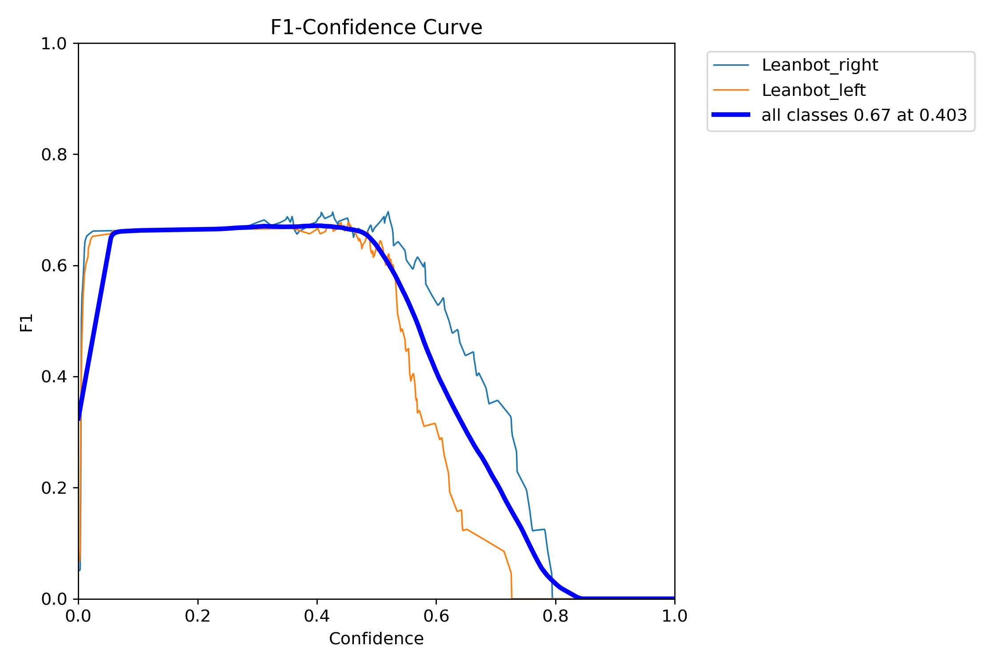
  > F1 chỉ đạt **0.67** tại confidence = **0.403** (so với 1.00 của 2 model trước). Đường cong F1 giảm nhanh khi confidence > 0.5.

- **BoxPR curve** – Đường cong Precision–Recall:
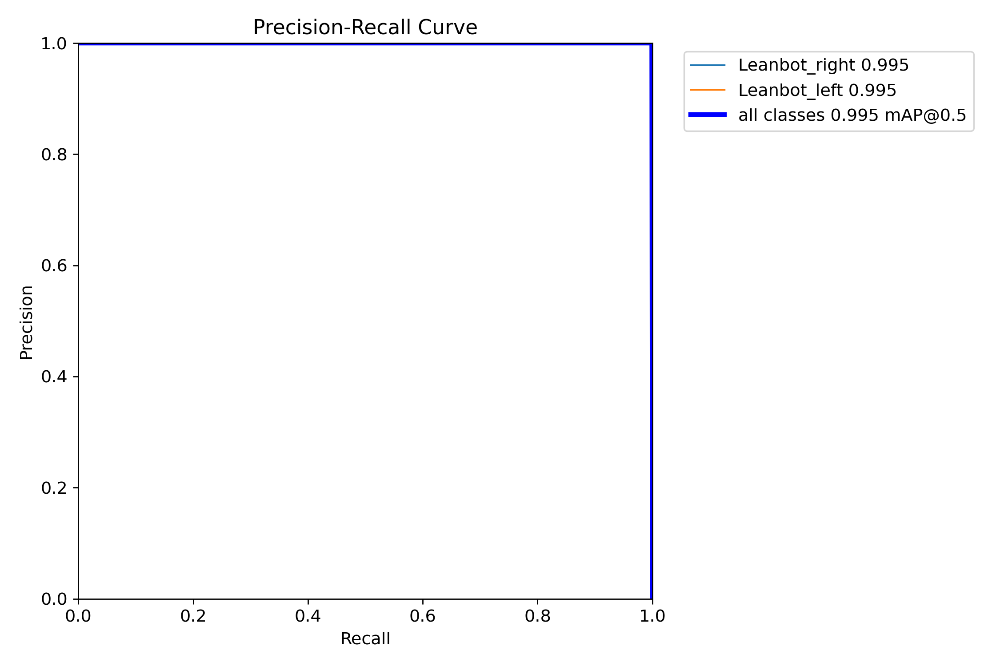
  > **mAP@0.5 = 0.696** (Right: 0.734, Left: 0.659) — thấp hơn rất nhiều so với 0.995 của 2 model trước.

- **BoxP curve** – Đường cong Precision theo Confidence:
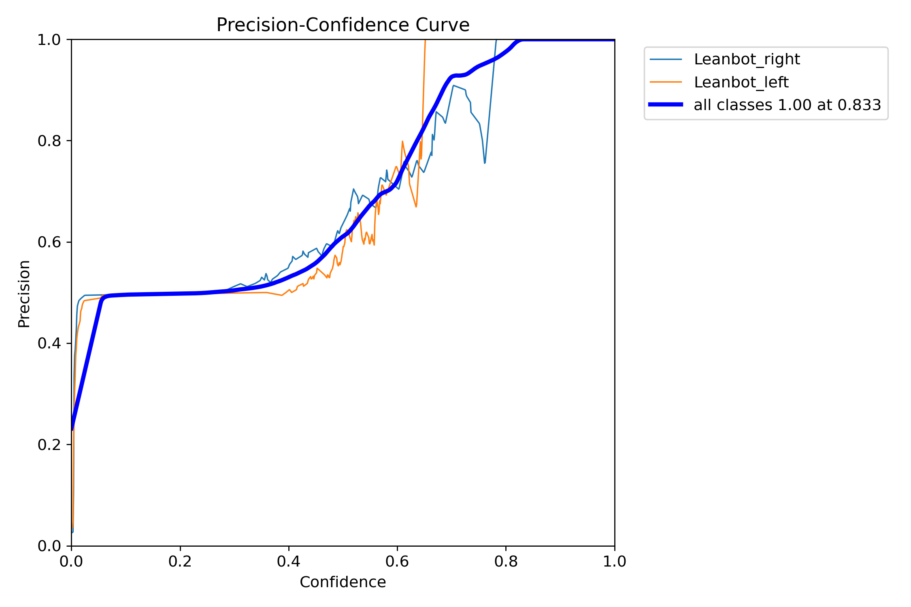
  > Precision chỉ đạt **1.00** khi confidence > **0.833**. Trong dải thực tế (0.3–0.6), Precision chỉ ở mức **0.50–0.65**.

- **BoxR curve** – Đường cong Recall theo Confidence:
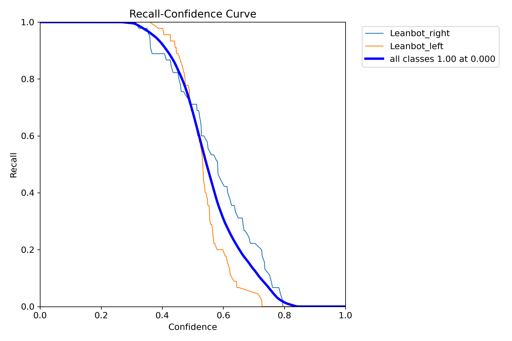
  > Recall giảm rất nhanh: ở confidence = 0.5, Recall chỉ còn ~0.6. Model bỏ sót ~40% đối tượng.

- **Confusion Matrix** – Ma trận nhầm lẫn:
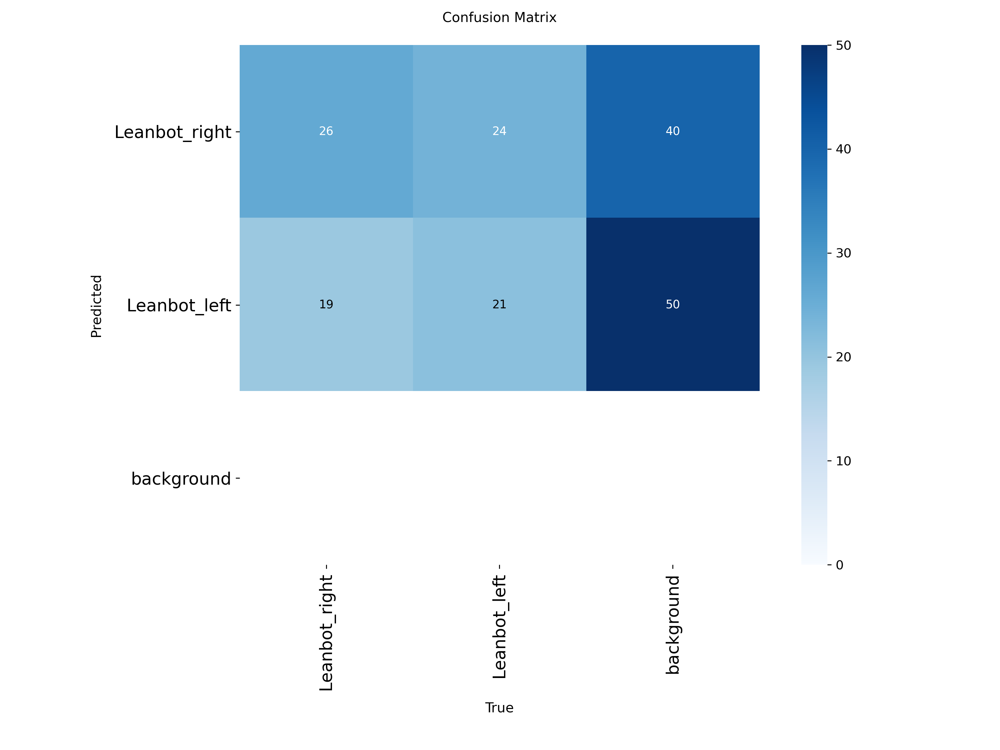
  > - `Leanbot_right`: dự đoán đúng 26, nhầm thành Left 19 lần.
  > - `Leanbot_left`: dự đoán đúng 21, nhầm thành Right 24 lần.
  > - 90 vùng background bị nhầm thành Leanbot → **False Positive rất cao**.

- **Confusion Matrix Normalized**:
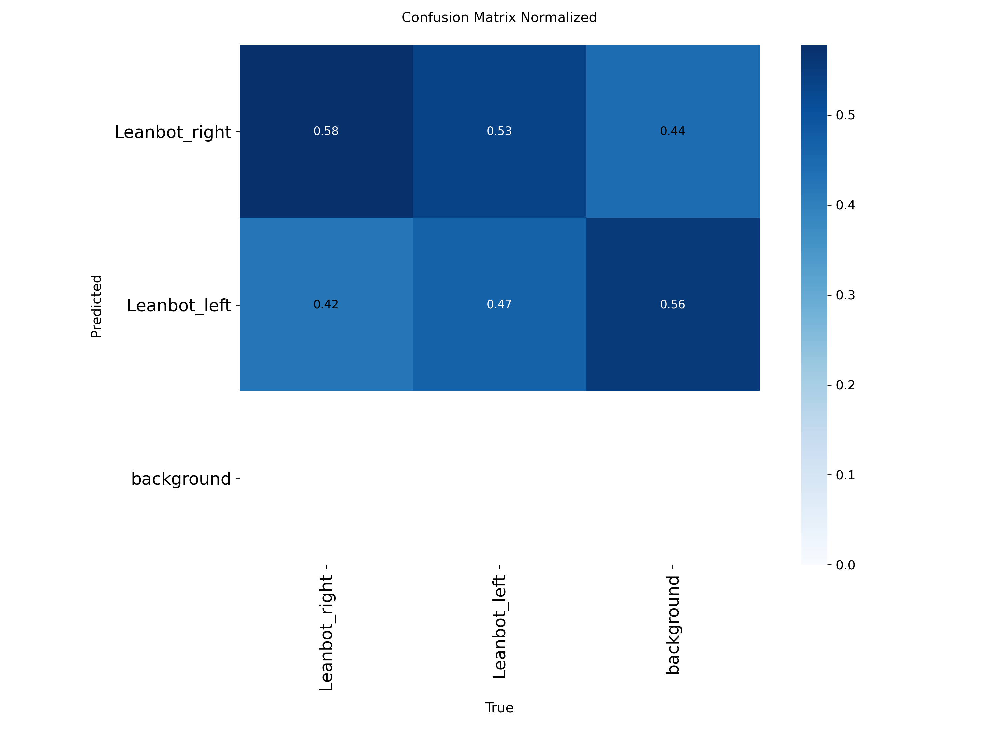
  > Tỉ lệ phân loại đúng chỉ **0.58** (Right) và **0.47** (Left) → gần như **đoán ngẫu nhiên (50/50)**.

- **Labels** – Phân bố nhãn:
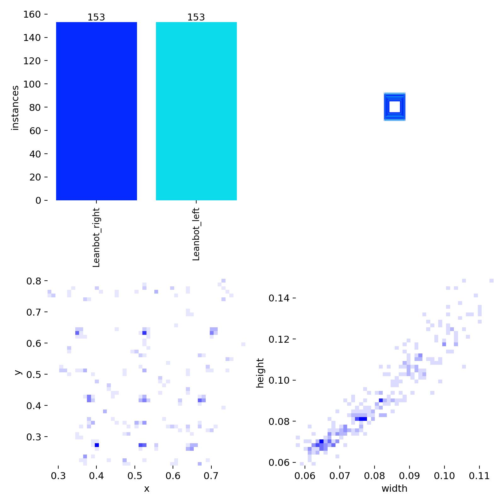
  > **153 instances** mỗi class — hoàn toàn cân bằng. Lỗi không do mất cân bằng dữ liệu mà do **hình ảnh 2 class quá giống nhau**.

- **Results** – Đường cong Loss và Metric qua 100 epochs:
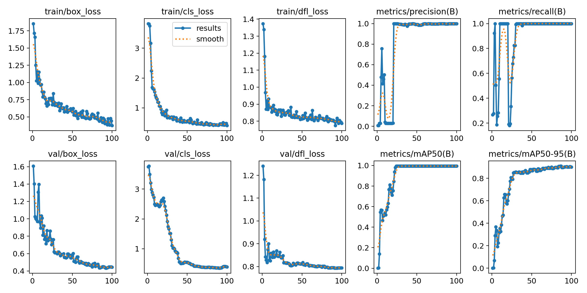
  > `box_loss` giảm tốt → model khoanh vùng đúng. Nhưng `cls_loss` dừng ở ~1.0 (vs ~0.3 của Front/Back) → **không phân biệt được** Left và Right.

- **Test Results**:
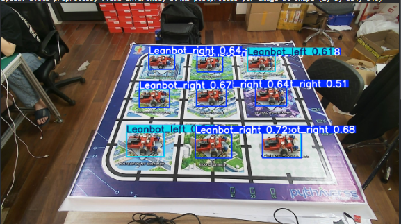
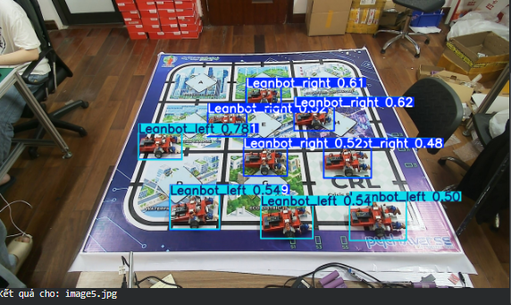
  > Confidence thấp (0.48–0.72). Nhiều đối tượng bị gán nhầm class.

#### 2.1. Tổng kết so sánh 3 mô hình

| Tiêu chí | 1 Class (`Leanbot`) | 2 Class (`Front`/`Back`) | 2 Class (`Left`/`Right`) |
| :--- | :---: | :---: | :---: |
| mAP@0.5 | **0.995** | **0.995** | 0.696 |
| mAP@0.5:0.95 | 0.850 | **~0.900** | ~0.60 |
| F1-Score (max) | **~1.00** | **~1.00** | 0.67 |
| Confusion giữa class | N/A | ✅ Không nhầm | ❌ Nhầm ~50% |
| False Positive trên BG | ✅ Không | ✅ Không | ❌ Rất nhiều |
| Confidence trung bình | 0.85–0.94 | 0.86–0.98 | 0.48–0.72 |
| **Đánh giá** | ✅ Rất tốt | ✅ Rất tốt | ❌ Chưa đạt |

> **Kết luận:** Mô hình **Left/Right** cho kết quả **không tốt** vì mặt trái và phải của Leanbot nhìn từ trên xuống **khá giống nhau**, khiến model không thể học được đặc trưng phân biệt.

## B. Khó khăn
- Không

## C. Công việc tiếp theo
- Em có cần thu thập thêm data cho 2 class Left và Right không ạ?  