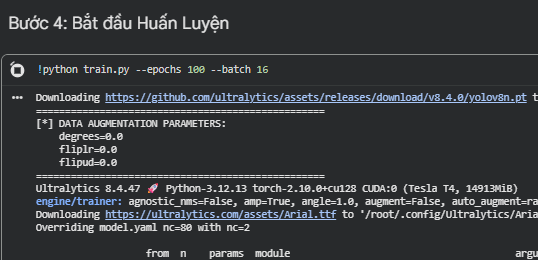
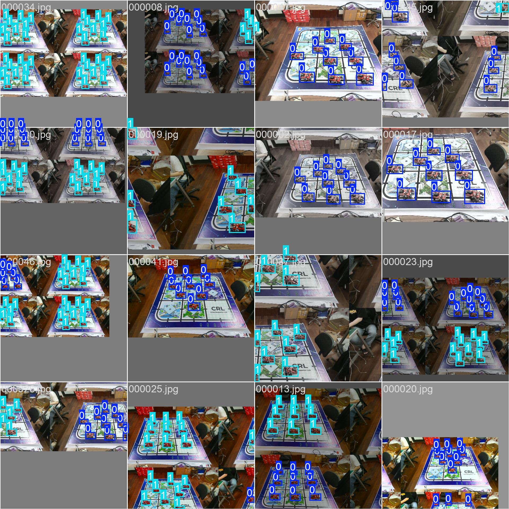
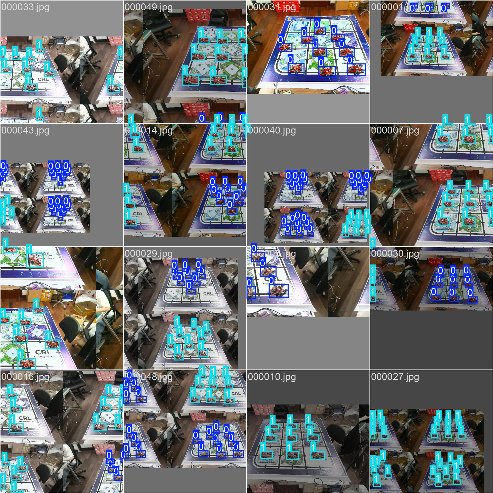
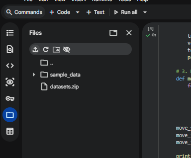

# Báo cáo công việc ngày 07/05/2026

## A. Công việc đã làm
- Sửa lại bảng thống kê datasets và thông tin Training
- Báo cáo cách upload datasets lên Colab
- Cập nhật hình ảnh ví dụ Batch ảnh được đưa vào training
- Cấu hình lại Augmentation, train lại và đánh giá 

### 1. Thu thập data Leanbot_Left và Leanbot_Right
- Với các góc từ 0, +-15, +-30 độ:
  - Ảnh Leanbot_Left : 5 ảnh / góc
  - Ảnh Leanbot_Right : 5 ảnh / góc 

|Góc|Leanbot_Left|Leanbot_Right|
|---|---|---|
|30 độ|||
|15 độ|||
|0 độ|||
|-15 độ|||
|-30 độ|||

- Tổng lượng ảnh cơ sở là 10, tuy nhiên lượng ảnh như vậy là quá ít để training -> Thu thập thêm data các góc ở nhiều vị trí trên sa bàn. 
- Thống kê datasets như bảng sau : 

| Session | Class | Số ảnh Background | Số ảnh Raw | Tổng số nhãn |
| :--- | :---: | :---: | :---: | :---: |
| `session_20260507_093650` (Base) | `Leanbot_Right` | 1 | 5 | 45 |
| `session_20260507_093932` (Base) | `Leanbot_Left` | 1 | 5 | 45 |
| `session_20260505_115856` | `Leanbot_right` | 1 | 10 | 90 |
| `session_20260505_120425` | `Leanbot_left` | 1 | 10 | 90 |
| `session_20260507_094132` | `Leanbot_Left` | 1 | 10 | 90 |
| `session_20260507_094449` | `Leanbot_Right` | 1 | 10 | 90 |
| **Tổng cộng** | | **6** | **50** | **450** |

#### 1.2. Thống kê theo class :

| Class | Class ID | Số ảnh | Số nhãn |
| :--- | :---: | :---: | :---: |
| `Leanbot_Right` | 0 | 25 | 225 |
| `Leanbot_Left` | 1 | 25 | 225 |
| **Tổng** | | **50** | **450** |

#### 1.3. Tỷ lệ chia Dataset (Stratified Split)

Sử dụng chiến lược **Stratified Split** để đảm bảo tỷ lệ 2 class luôn cân bằng trong mỗi tập.

| Tập | Tỷ lệ | Leanbot_Right | Leanbot_Left | Tổng |
| :--- | :---: | :---: | :---: | :---: |
| **Train** | 70% | 17 | 18 | 35 |
| **Validation** | 20% | 5 | 5 | 10 |
| **Test** | 10% | 3 | 2 | 5 |
| **Tổng** | 100% | **25** | **25** | **50** |

#### 1.4. Thông tin Training

##### 1.4.1. Bảng so sánh thông tin Training giữa các mô hình

| Thông số | 1 Class (`Leanbot`) | 2 Class (`Front`/`Back`) | 2 Class (`Left`/`Right`) |
| :--- | :---: | :---: | :---: |
| Model nền tảng | `yolov8n.pt` | `yolov8n.pt` | `yolov8n.pt` |
| Số class | 1 | 2 | 2 |
| **Tổng số ảnh** | 42 | 42 | 50 |
| **Tổng số nhãn** | 378 | 378 | 450 |
| Epochs | 100 | 100 | 100 |
| Batch size | 16 | 16 | 16 |
| Image size | 640 × 640 | 640 × 640 | 640 × 640 |
| Optimizer | AdamW | AdamW | AdamW |
| Thời gian Training | ~2.5 phút | ~4 phút | ~2 phút |
| Môi trường | Google Colab | Google Colab | Google Colab |
| Link Notebook | [Link Colab](https://git.pythaverse.space/thomha/Nguyen_Huu_Hoang_Anh/blob/master/260507/tools/finetuning_yolo_Leanbot.ipynb) | [Link Colab](https://git.pythaverse.space/thomha/Nguyen_Huu_Hoang_Anh/blob/master/260505/tools/finetuning_yolo_Leanbot.ipynb) | [Link Colab](https://git.pythaverse.space/thomha/Nguyen_Huu_Hoang_Anh/blob/master/260507/tools/finetuning_yolo_Leanbot.ipynb) |

#### 1.5. Data Augmentation: fliplr và flipud
- `fliplr`: Lật ảnh theo chiều ngang (trái - phải).
- `flipud`: Lật ảnh theo chiều dọc (trên - dưới).

> **Yêu cầu:** Khi huấn luyện mô hình phân biệt Left/Right, **bắt buộc phải set `fliplr=0.0` và `flipud=0.0`**.

- Trước đó em đã để `degrees=10.0`, `fliplr=0.5`, `flipud=0.1` dẫn tới việc kết quả training không tốt.  Đã sửa lại thành :  `degrees=0.0`, `fliplr=0.0`, `flipud=0.0`. 

**Code training áp dụng thông số chuẩn:**
```python
results = model.train(
    data="dataset.yaml",
    epochs=100,
    imgsz=640,
    fliplr=0.0,   # TẮT hoàn toàn lật ngang
    flipud=0.0,   # TẮT hoàn toàn lật dọc
    degrees=0.0, # Tắt xuay ảnh
    hsv_h=0.015, hsv_s=0.7, hsv_v=0.4 # Đổi màu, độ sáng chuẩn YOLO
)
```
- Khi training thêm Print để chắc chắn :



#### 1.6. Xem ảnh 640x640 thực tế mà YOLO sử dụng

- Trong quá trình training, YOLO sẽ tự động resize ảnh về kích thước `imgsz=640` -> ghép 4 ảnh thành 1 (Mosaic) -> Áp dụng Data Augmentation -> Đưa vào Model để training.
- Một vài ví dụ 1 vài batch ảnh được trainig





 
#### 1.7. Hướng dẫn Upload dữ liệu lên Google Colab 

- Tại máy tính, nén thư mục dataset thành **`datasets.zip`**
- Upload file `datasets.zip` tại giao diện colab.

- Tổng thời gian upload khoảng 30 giây.

##### 1.4.2. Kết quả cuối cùng (Best Model) trên tập Validation
- Sau khi chỉnh sửa lại các thông số Augmetation thu được kết quả trainig như sau: 

| Metric | 1 Class (`Leanbot`) | 2 Class (`Front`/`Back`) | 2 Class (`Left`/`Right`) |
| :--- | :---: | :---: | :---: |
| **Precision (P)** | 0.997 | 1.00 | 0.995 |
| **Recall (R)** | 1.00 | 1.00 | 1.00 |
| **mAP@0.5** | 0.995 | 0.995 | 0.995 |
| **mAP@0.5:0.95** | 0.850 | ~0.900 | ~0.900 |
| **F1-Score** | ~1.00 (conf=0.725) | ~1.00 (conf=0.689) | ~1.00 (conf=0.807) |

##### 1.4.3. Kết quả nhận diện trên tập Test

| Mô hình | Mô tả kết quả |
| :--- | :--- |
| **1 Class** | Phát hiện đúng tất cả Leanbot với confidence **0.85 – 0.94**. Không có False Positive. |
| **2 Class (Front/Back)** | Phát hiện đúng cả 2 class với confidence **0.86 – 0.98**. Không nhầm lẫn giữa Front và Back. |
| **2 Class (Left/Right)** | Phát hiện đúng cả 2 class với confidence từ **0.95 – 0.99**. Không còn nhầm lẫn Left ↔ Right. Không có False Positive. |

### 2. Phân tích chi tiết kết quả Model Left/Right (Sau khi fix Augmentation)

> **Nhận xét tổng quan:** Sau khi tắt tham số lật ngang (`fliplr=0.0`), mô hình Left/Right đạt mAP@0.5 = 0.995. Sự nhầm lẫn giữa hai class Left và Right được khắc phục. Nguyên nhân gây lỗi trước đó là do thiết lập Data Augmentation chưa phù hợp với đặc trưng bất đối xứng của đối tượng.

- **BoxF1 curve** – Đường cong F1 theo ngưỡng Confidence:

  > F1 đạt **1.00** tại confidence = **0.807**. Đường cong duy trì mức cao ở dải confidence rộng, cho thấy mô hình hoạt động ổn định.

- **BoxPR curve** – Đường cong Precision–Recall:

  > **mAP@0.5 = 0.995** cho cả 2 class (tương đương model Front/Back).

- **Confusion Matrix** – Ma trận nhầm lẫn:

  > **Kết quả phân loại:**
  > - `Leanbot_right`: dự đoán đúng 45/45. Nhầm thành Left: 0.
  > - `Leanbot_left`: dự đoán đúng 45/45. Nhầm thành Right: 0.
  > - Số lượng False Positive trên vùng background là **0**.

- **Results** – Đường cong Loss và Metric qua 100 epochs:

  > Cả `box_loss` và đặc biệt là `cls_loss` (loss phân loại) đều giảm mạnh và hội tụ ổn định ở mức rất thấp. Các metric mAP50 và mAP50-95 tăng nhanh chóng và chạm max 1.00 chỉ sau khoảng 20 epochs.

- **Test Results (Thực tế):**


  > Mô hình nhận diện chính xác các đối tượng trong tập test. Mức độ tự tin (Confidence) dao động từ **0.95 - 0.99**.

#### 2.1. Tổng kết so sánh 3 mô hình

| Tiêu chí | 1 Class (`Leanbot`) | 2 Class (`Front`/`Back`) | 2 Class (`Left`/`Right`) |
| :--- | :---: | :---: | :---: |
| mAP@0.5 | **0.995** | **0.995** | **0.995** |
| mAP@0.5:0.95 | 0.850 | ~0.900 | **~0.900** |
| F1-Score (max) | ~1.00 | ~1.00 | **1.00** |
| Confusion giữa class | N/A | ✅ Không nhầm | **✅ Không nhầm** |
| False Positive trên BG | ✅ Không | ✅ Không | **✅ Không** |
| Confidence trung bình | 0.85–0.94 | 0.86–0.98 | **0.95–0.99** |
| **Đánh giá** | Đạt | Đạt | Đạt |

> **Kết luận:** Cả 3 mô hình đều đạt mAP@0.5 = 0.995. Đối với các vật thể bất đối xứng như Leanbot (Left/Right), việc tinh chỉnh Data Augmentation (tắt lật ảnh ngang) là yếu tố quyết định để mô hình học đúng đặc trưng.

## B. Khó khăn
- Không 
## C. Công việc tiếp theo
- Em xin phép nhận hướng đi tiếp theo từ Thầy ạ. 