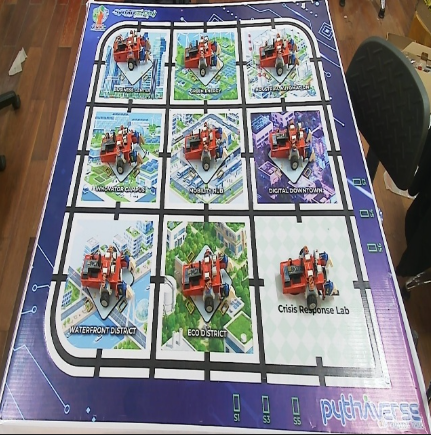
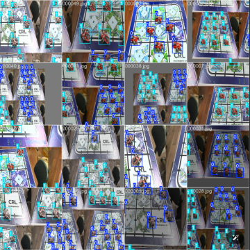
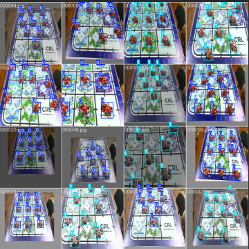

# Báo cáo công việc ngày 08/05/2026

## A. Công việc đã làm
- Thay đổi cấu hình degree augmentation về 10.
- Thêm tools Crop lấy vùng sa bàn, theo mask Roi trước đó đã làm.
    - Resize ảnh Crop về kích thước ảnh 640x640 
    - Tạo tập datasets chỉ có ảnh 640x640.
- Train thử để kiểm tra batch ghép ảnh Mosaic Augmentation
### 1. Tạo tools ```crop_tool.py```
- Input của tools là folder ```tool1_output``` - output của tool ```process_auto_label.py```
- Output của tools là folder ```crop_images``` chứa ảnh đã crop, resize 640x640 và Labels tương ứng với ảnh.
- Luồng hoạt động như sau :
    - Đọc config.npy
    - Crop ảnh
    - Resize ảnh
    - Cập nhật Label 
- Link code : [https://git.pythaverse.space/thomha/Nguyen_Huu_Hoang_Anh/blob/master/260508/tools/crop_tool.py](https://git.pythaverse.space/thomha/Nguyen_Huu_Hoang_Anh/blob/master/260508/tools/crop_tool.py)
- Kết quả output sau khi chạy tool ```crop_tool.py```:


#### 1.1. Mosaic Augmentation trong Yolo.
- Mặc định khi sử dụng hàm ```model.train()``` trong Yolo có hỗ trợ Mosaic Augmentation với tỉ lệ thực hiện 1.0 (thực hiện với 100 lượng ảnh). 
- Nếu muốn tùy chỉnh tỉ lệ này thì cần khai báo tham số ```mosaic``` trong hàm ```model.train()``` (ví dụ ```mosaic=0.5``` tức là thực hiện với 50 lượng ảnh).
- Hiện tại cấu hình chỉ có ```degrees = 0.0```, ```fliplr = 0.0```, ```flipud = 0.0```. Mosaic mặc định là `1.0`.
- Mosaic augmentation sẽ thực hiện các biến đổi sau:
    - Ghép ngẫu nhiên 4 ảnh lại với nhau thành 1 ảnh.
    - Trong quá trình ghép sẽ zoom ngẫu nhiên các ảnh con, xuay, cắt, đổi màu theo cấu hình augmentation.
    - Thêm padding xám vào các ảnh để có kích thước 640x640.
    - Tự động điều chỉnh box cho phù hợp với ảnh sau khi đã ghép.
- Các bước biến đổi này nằm sâu bên trong code của thư viện Ultralytics, **không thể can thiệp** trực tiếp code.
> Không thể tắt bước thêm padding xám khi sử dụng Mosaic Augmentation.
- Theo thư viện Ultralytic của YOLO thì Mosaic Augmentation sẽ ghép 4 ảnh trong `n-10` epoch đầu tiên, sau đó sẽ không thực hiện trong 10 epoch cuối. 
- Kết quả các batch sau khi Augmentation như sau :
    - Batch trong khoảng `n-10` epoch:
        
    - Batch trong khoảng `10` epoch cuối:
        
- Khi tạo Mosaic:
    - Thuật toán mặc định sẽ chọn ngẫu nhiên một điểm tâm chữ thập (center_x, center_y) bất kỳ trên ảnh. Sau đó nó chèn 4 bức ảnh vào 4 góc của điểm chữ thập này. Bởi vì điểm tâm này là ngẫu nhiên -> ảnh có thể lệch tâm,
    - Các bức ảnh con có thể bị thu nhỏ lại (Scale), nên chúng không thể lấp đầy hoàn toàn không gian 640x640 của bức ảnh tổng.
    > Mosaic augmentation mặc định sẽ thêm padding xám để lấp vào khoảng trống để cho kết quả là ảnh có kích thước 640x640. 


## B. Khó khăn 
- Không thể can thiệp vào code của thư viện Ultralytics để tắt bước thêm padding xám trong Mosaic Augmentation theo yêu cầu.
## C. Công việc tiếp theo
- 