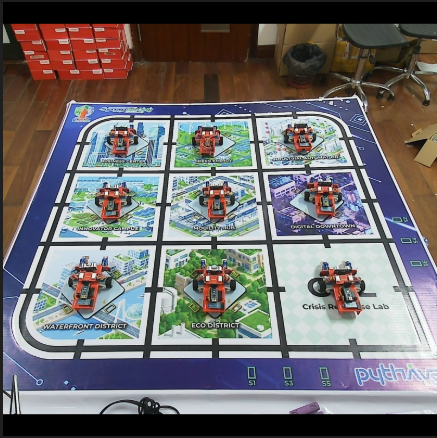

# Cập nhật báo cáo ngày 08/05/2026

## A. Công việc đã làm
- Báo cáo chi tiết lại các bước Crop và resize ảnh 
### 1. Crop và resize ảnh
- Chỉnh sửa `crop_tool.py` để thay đổi cách crop và resize ảnh như sau: 
- **Bước 1:** Đọc 4 điểm Mask Roi có sẵn trong folder `tool1_output` của mỗi session
- **Bước 2:** Lấy cạnh dưới của mask sa bàn làm chuẩn, cắt lấy 1600 pixel của cạnh dưới, chấp nhận mất 2 góc dưới sa bàn , thêm padding đen để ảnh thành hình vuông 1600x1600

    

- **Bước 3:** Resize ảnh về kích thước 640x640. 

    
- Log debug kích thước ảnh tại các bước như sau :
```
Processing session: session_20260508_150734
  -> Found Bounding Box (x=333, y=270, w=1981, h=1087) from roi_points
    [DEBUG] deg_0_000.jpg | Original: 2560x1440 | RectCrop: 1600x1440 | PaddedSquare: 1600x1600 | Resized size: 640x640
    [DEBUG] deg_0_001.jpg | Original: 2560x1440 | RectCrop: 1600x1440 | PaddedSquare: 1600x1600 | Resized size: 640x640
    [DEBUG] deg_0_002.jpg | Original: 2560x1440 | RectCrop: 1600x1440 | PaddedSquare: 1600x1600 | Resized size: 640x640
    [DEBUG] deg_0_003.jpg | Original: 2560x1440 | RectCrop: 1600x1440 | PaddedSquare: 1600x1600 | Resized size: 640x640
    [DEBUG] deg_0_004.jpg | Original: 2560x1440 | RectCrop: 1600x1440 | PaddedSquare: 1600x1600 | Resized size: 640x640
```
- **Kết quả** : Ảnh sau khi cắt lấy sa bàn với kích thước 1600x1600 pixel ( chấp nhận mất 2 góc dưới sa bàn, chấp nhận Padding đen) đã được resize về 640x640 pixel. 

## B. Khó khăn 
- Không
## C. Công việc tiếp theo
- Thu thập lại data và đặt tên theo đúng các góc
- Thử train đồng thời 4 class Front, Back, Left, Right
- Chỉ dùng và gán nhãn với các ảnh 0, +-15, +-30
- Các ảnh +-45 dùng để test.