# Báo cáo công việc ngày 18/5/2026 (tiếp theo)

## A. Công việc đã làm.
- Báo cáo chi tiết công thức ước lượng góc từ confidence
- Cập nhật thông tin BBox hiển thị tọa tâm Xcenter, Ycenter và kích thước Width, Height.
- Thêm tools tự động hóa việc gom các góc vào gắn vào folder Class 
### 1. Công thức ước lượng góc từ Confidence của các Class.

Dựa theo ví dụ tính góc tương đối của Thầy, thì góc ước lượng được tính bằng phương pháp trung bình có trọng số (weighted average) của 2 class có độ tin cậy (confidence) cao nhất:

$$ \text{Góc Ước Lượng} = \frac{\theta_1 \cdot C_1 + \theta_2 \cdot C_2}{C_1 + C_2} $$

**Trong đó:**
- $\theta_1$: Góc của Class có confidence cao nhất (Top 1)
- $C_1$: Giá trị confidence của Class Top 1
- $\theta_2$: Góc của Class có confidence cao thứ hai (Top 2)
- $C_2$: Giá trị confidence của Class Top 2


> **Note:** Em đã đưa công thức tính toán và hướng xử lý này cho AI, sau đó yêu cầu AI viết script tự động duyệt qua log dữ liệu thu thập được để tính toán kết quả. Em có cần tích hợp công thức vào Code hiển thị giao diện detection của Model không ạ (webcam_infer.py) ? 

### 2. Cập nhật thông tin BBox hiển thị tọa tâm Xcenter, Ycenter và kích thước Width, Height.

##### `angle_m75_000` (9 vị trí Leanbot)
| Ảnh BBox | Ảnh Confidence |
| :---: | :---: |
| 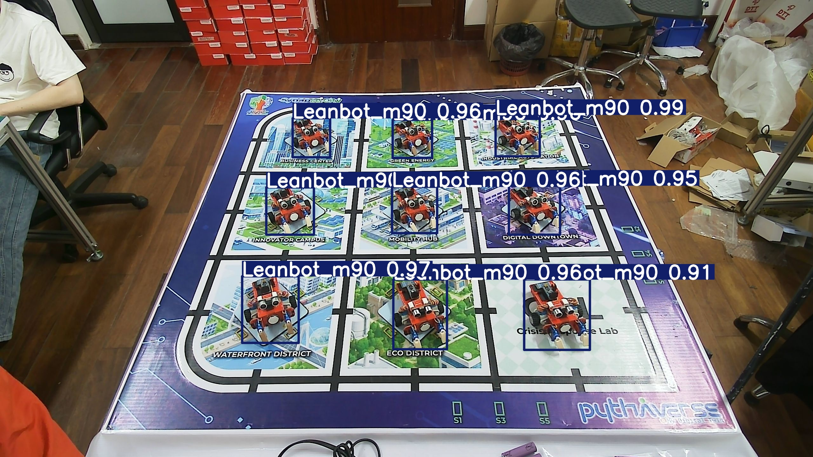 | 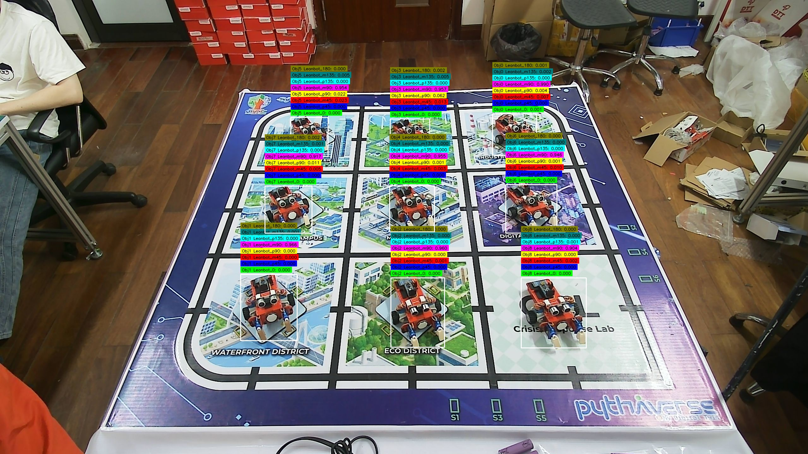 |

| Vị trí | BBox (Xc, Yc, W, H) | 0 | p45 | m45 | p90 | m90 | p135 | m135 | 180 | Best Class | Góc ước lượng | 
|---|---|---|---|---|---|---|---|---|---|---|---|
| #1 | (1629.5, 426.5, 139, 131) | 0.0010 | 0.0001 | 0.0069 | 0.0044 | **0.9905** | 0.0000 | 0.0019 | 0.0007 | `Leanbot_m90` (0.9905) | -89.7° |
| #2 | (851.5, 975, 179, 210) | 0.0001 | 0.0001 | 0.0004 | 0.0002 | **0.9655** | 0.0001 | 0.0013 | 0.0000 | `Leanbot_m90` (0.9655) | -90.1° |
| #3 | (1323, 991, 170, 220) | 0.0002 | 0.0001 | 0.0007 | 0.0002 | **0.9603** | 0.0002 | 0.0002 | 0.0000 | `Leanbot_m90` (0.9603) | -90.0° |
| #4 | (1298.5, 437.5, 125, 121) | 0.0002 | 0.0000 | 0.0130 | 0.0623 | **0.9571** | 0.0003 | 0.0048 | 0.0018 | `Leanbot_m90` (0.9571) | -79.0° |
| #5 | (1305, 662, 142, 146) | 0.0003 | 0.0001 | 0.0026 | 0.0014 | **0.9554** | 0.0001 | 0.0004 | 0.0001 | `Leanbot_m90` (0.9554) | -89.9° |
| #6 | (980, 434, 118, 124) | 0.0001 | 0.0000 | 0.0235 | 0.0218 | **0.9537** | 0.0003 | 0.0052 | 0.0003 | `Leanbot_m90` (0.9537) | -88.9° |
| #7 | (1683, 662, 162, 154) | 0.0004 | 0.0000 | 0.0104 | 0.0009 | **0.9459** | 0.0001 | 0.0003 | 0.0002 | `Leanbot_m90` (0.9459) | -89.5° |
| #8 | (913.5, 664.5, 149, 149) | 0.0000 | 0.0000 | 0.0050 | 0.0111 | **0.9171** | 0.0001 | 0.0009 | 0.0015 | `Leanbot_m90` (0.9171) | -87.8° |
| #9 | (1754, 992, 206, 222) | 0.0001 | 0.0000 | 0.0016 | 0.0000 | **0.9044** | 0.0010 | 0.0000 | 0.0001 | `Leanbot_m90` (0.9044) | -89.9° |


##### `angle_m150_000` (9 vị trí Leanbot)
| Ảnh BBox | Ảnh Confidence |
| :---: | :---: |
| 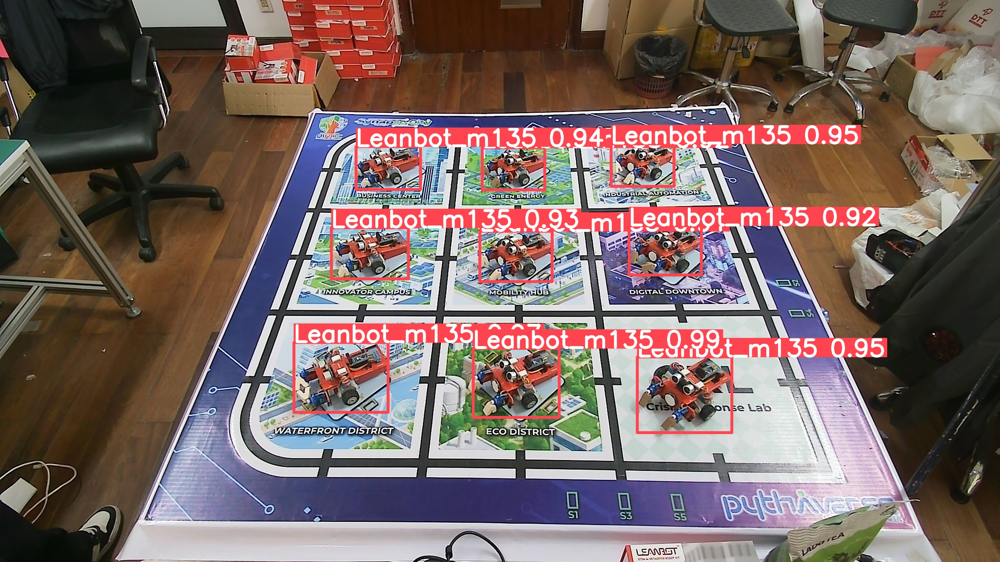 | 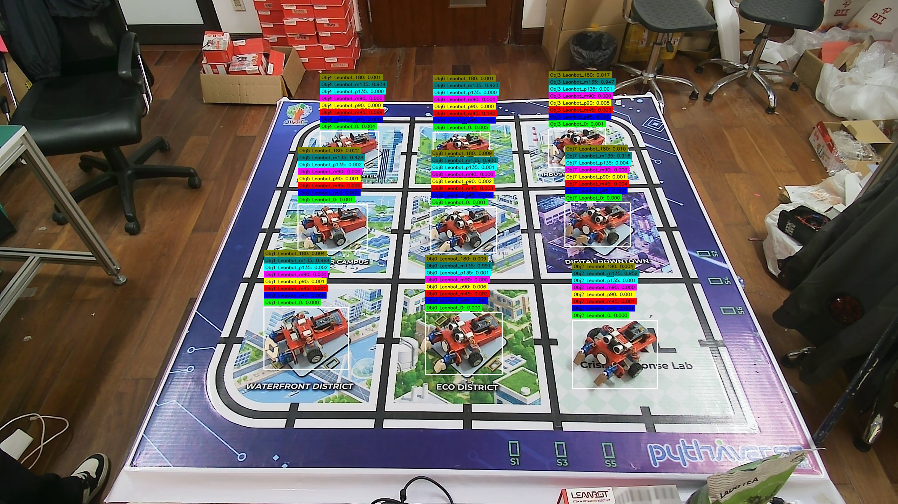 |

| Vị trí | BBox (Xc, Yc, W, H) | 0 | p45 | m45 | p90 | m90 | p135 | m135 | 180 | Best Class | Góc ước lượng |
|---|---|---|---|---|---|---|---|---|---|---|---|
| #1 | (1321.5, 981, 219, 176) | 0.0004 | 0.0001 | 0.0016 | 0.0064 | 0.0004 | 0.0006 | **0.9914** | 0.0085 | `Leanbot_m135` (0.9914) | -135.4° |
| #2 | (873, 967, 242, 178) | 0.0003 | 0.0001 | 0.0006 | 0.0012 | 0.0002 | 0.0021 | **0.9682** | 0.0041 | `Leanbot_m135` (0.9682) | -135.2° |
| #3 | (1752, 1012, 242, 194) | 0.0002 | 0.0000 | 0.0011 | 0.0012 | 0.0002 | 0.0010 | **0.9516** | 0.0039 | `Leanbot_m135` (0.9516) | -135.2° |
| #4 | (1645, 422.5, 162, 109) | 0.0010 | 0.0001 | 0.0029 | 0.0047 | 0.0003 | 0.0010 | **0.9468** | 0.0171 | `Leanbot_m135` (0.9468) | -135.8° |
| #5 | (995, 430, 166, 110) | 0.0038 | 0.0002 | 0.0884 | 0.0003 | 0.0005 | 0.0003 | **0.9335** | 0.0007 | `Leanbot_m135` (0.9335) | -127.2° |
| #6 | (947.5, 649, 197, 130) | 0.0009 | 0.0001 | 0.0050 | 0.0008 | 0.0002 | 0.0022 | **0.9277** | 0.0223 | `Leanbot_m135` (0.9277) | -136.1° |
| #7 | (1314.5, 432.5, 161, 109) | 0.0048 | 0.0003 | 0.1804 | 0.0004 | 0.0015 | 0.0002 | **0.9234** | 0.0012 | `Leanbot_m135` (0.9234) | -120.3° |
| #8 | (1703, 641.5, 186, 125) | 0.0001 | 0.0001 | 0.0042 | 0.0006 | 0.0004 | 0.0039 | **0.9164** | 0.0097 | `Leanbot_m135` (0.9164) | -135.5° |
| #9 | (1321, 657, 186, 130) | 0.0005 | 0.0001 | 0.0026 | 0.0017 | 0.0002 | 0.0009 | **0.8997** | 0.0091 | `Leanbot_m135` (0.8997) | -135.5° |


##### `angle_m120_000` (9 vị trí Leanbot)
| Ảnh BBox | Ảnh Confidence |
| :---: | :---: |
| 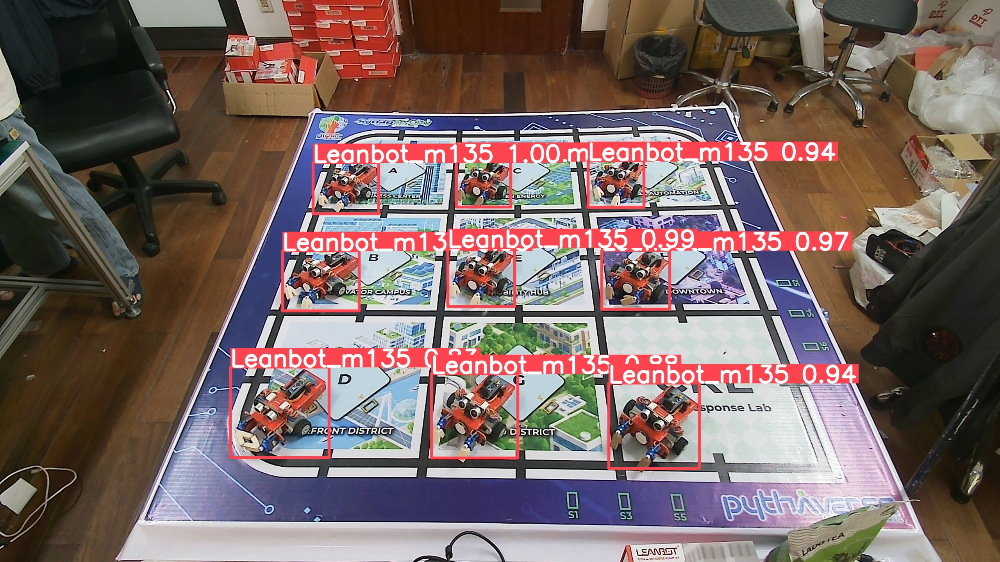 | 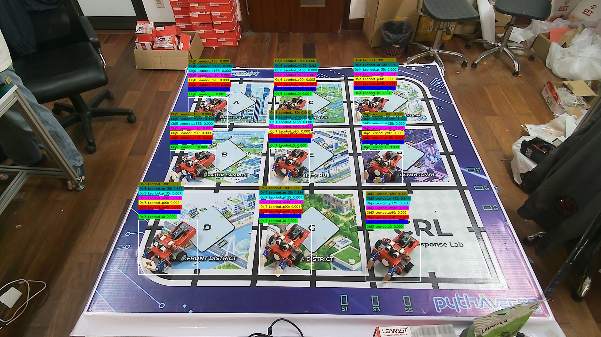 |

| Vị trí | BBox (Xc, Yc, W, H) | 0 | p45 | m45 | p90 | m90 | p135 | m135 | 180 | Best Class | Góc ước lượng |
|---|---|---|---|---|---|---|---|---|---|---|---|
| #1 | (885, 482, 168, 132) | 0.0006 | 0.0000 | 0.0060 | 0.0003 | 0.0040 | 0.0000 | **0.9953** | 0.0001 | `Leanbot_m135` (0.9953) | -134.5° |
| #2 | (1232, 710.5, 170, 151) | 0.0002 | 0.0000 | 0.0049 | 0.0003 | 0.0013 | 0.0000 | **0.9831** | 0.0000 | `Leanbot_m135` (0.9831) | -134.6° |
| #3 | (1627.5, 717.5, 173, 151) | 0.0003 | 0.0000 | 0.0058 | 0.0003 | 0.0010 | 0.0000 | **0.9716** | 0.0002 | `Leanbot_m135` (0.9716) | -134.5° |
| #4 | (1674.5, 1091.5, 233, 219) | 0.0002 | 0.0000 | 0.0015 | 0.0020 | 0.0003 | 0.0008 | **0.9438** | 0.0029 | `Leanbot_m135` (0.9438) | -135.1° |
| #5 | (1577, 471, 142, 120) | 0.0008 | 0.0000 | 0.0315 | 0.0001 | 0.0010 | 0.0002 | **0.9396** | 0.0001 | `Leanbot_m135` (0.9396) | -132.1° |
| #6 | (821.5, 719.5, 195, 155) | 0.0001 | 0.0000 | 0.0016 | 0.0002 | 0.0011 | 0.0000 | **0.9380** | 0.0001 | `Leanbot_m135` (0.9380) | -134.8° |
| #7 | (1238, 472.5, 140, 117) | 0.0007 | 0.0004 | 0.0026 | 0.0031 | 0.0024 | 0.0000 | **0.9206** | 0.0003 | `Leanbot_m135` (0.9206) | -135.5° |
| #8 | (1215.5, 1065, 221, 216) | 0.0000 | 0.0000 | 0.0005 | 0.0008 | 0.0006 | 0.0010 | **0.8858** | 0.0001 | `Leanbot_m135` (0.8858) | -135.1° |
| #9 | (716, 1056.5, 252, 233) | 0.0001 | 0.0001 | 0.0001 | 0.0019 | 0.0008 | 0.0012 | **0.8326** | 0.0004 | `Leanbot_m135` (0.8326) | -135.3° |


##### `angle_p15_000` (9 vị trí Leanbot)
| Ảnh BBox | Ảnh Confidence |
| :---: | :---: |
| 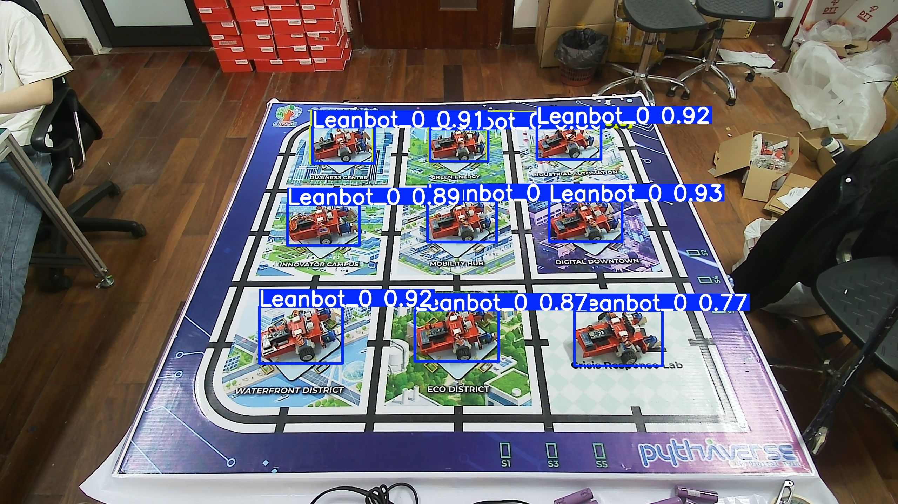 | 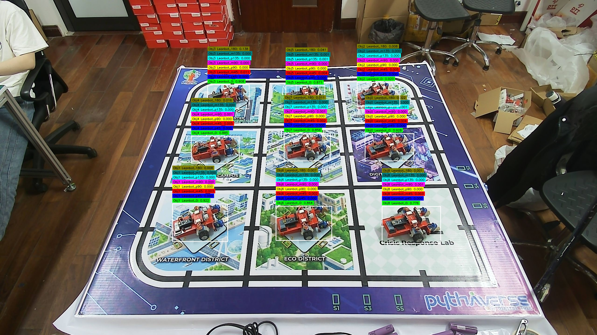 |

| Vị trí | BBox (Xc, Yc, W, H) | 0 | p45 | m45 | p90 | m90 | p135 | m135 | 180 | Best Class | Góc ước lượng |
|---|---|---|---|---|---|---|---|---|---|---|---|
| #1 | (1669.5, 632.5, 209, 117) | **0.9277** | 0.0004 | 0.0037 | 0.0001 | 0.0003 | 0.0005 | 0.0001 | 0.0219 | `Leanbot_0` (0.9277) | 4.2° |
| #2 | (857.5, 957, 237, 162) | **0.9217** | 0.0001 | 0.0033 | 0.0003 | 0.0002 | 0.0003 | 0.0001 | 0.0076 | `Leanbot_0` (0.9217) | 1.5° |
| #3 | (1622.5, 404.5, 183, 103) | **0.9196** | 0.0001 | 0.0051 | 0.0001 | 0.0003 | 0.0003 | 0.0000 | 0.0084 | `Leanbot_0` (0.9196) | 1.6° |
| #4 | (979, 415.5, 178, 103) | **0.9084** | 0.0003 | 0.0109 | 0.0002 | 0.0003 | 0.0004 | 0.0002 | 0.1382 | `Leanbot_0` (0.9084) | 23.8° |
| #5 | (922.5, 643, 205, 116) | **0.8850** | 0.0003 | 0.0047 | 0.0001 | 0.0006 | 0.0003 | 0.0001 | 0.0159 | `Leanbot_0` (0.8850) | 3.2° |
| #6 | (1308.5, 415, 167, 94) | **0.8712** | 0.0002 | 0.0040 | 0.0003 | 0.0001 | 0.0008 | 0.0006 | 0.0406 | `Leanbot_0` (0.8712) | 8.0° |
| #7 | (1302.5, 959.5, 239, 147) | **0.8636** | 0.0001 | 0.0025 | 0.0002 | 0.0002 | 0.0003 | 0.0001 | 0.0069 | `Leanbot_0` (0.8636) | 1.4° |
| #8 | (1317, 632, 198, 118) | **0.8555** | 0.0002 | 0.0017 | 0.0002 | 0.0006 | 0.0001 | 0.0002 | 0.0114 | `Leanbot_0` (0.8555) | 2.4° |
| #9 | (1763.5, 966.5, 251, 159) | **0.7756** | 0.0001 | 0.0029 | 0.0000 | 0.0005 | 0.0002 | 0.0001 | 0.0014 | `Leanbot_0` (0.7756) | -0.2° |


##### `angle_m60_000` (9 vị trí Leanbot)
| Ảnh BBox | Ảnh Confidence |
| :---: | :---: |
| 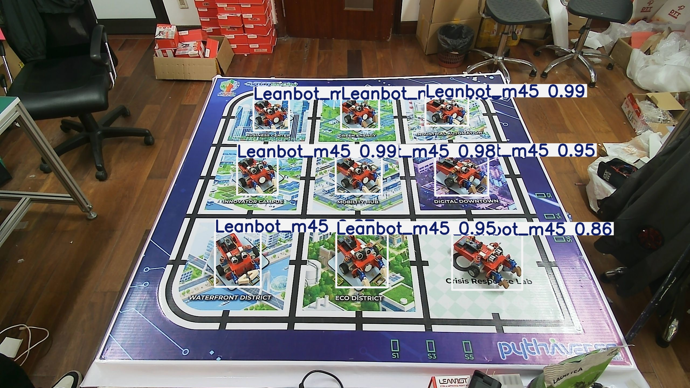 | 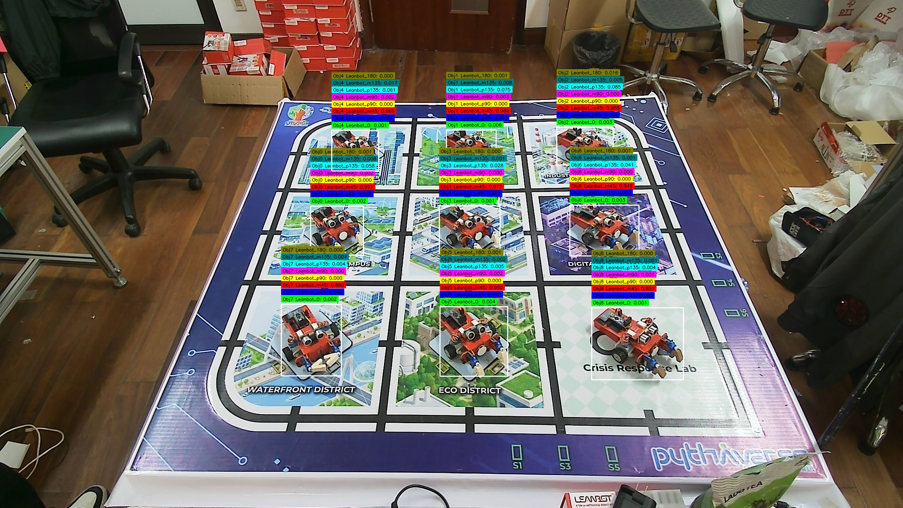 |

| Vị trí | BBox (Xc, Yc, W, H) | 0 | p45 | m45 | p90 | m90 | p135 | m135 | 180 | Best Class | Góc ước lượng |
|---|---|---|---|---|---|---|---|---|---|---|---|
| #1 | (955, 653.5, 150, 139) | 0.0017 | 0.0032 | **0.9911** | 0.0001 | 0.0016 | 0.0576 | 0.0083 | 0.0008 | `Leanbot_m45` (0.9911) | -35.1° |
| #2 | (1335.5, 423.5, 141, 111) | 0.0055 | 0.0021 | **0.9886** | 0.0001 | 0.0032 | 0.0754 | 0.0075 | 0.0006 | `Leanbot_m45` (0.9886) | -32.2° |
| #3 | (1658, 413.5, 160, 107) | 0.0026 | 0.0047 | **0.9878** | 0.0002 | 0.0004 | 0.0847 | 0.0049 | 0.0161 | `Leanbot_m45` (0.9878) | -30.8° |
| #4 | (1331, 651, 172, 136) | 0.0014 | 0.0022 | **0.9772** | 0.0001 | 0.0004 | 0.0277 | 0.0014 | 0.0004 | `Leanbot_m45` (0.9772) | -40.0° |
| #5 | (1006.5, 426.5, 133, 115) | 0.0014 | 0.0038 | **0.9646** | 0.0001 | 0.0015 | 0.0613 | 0.0175 | 0.0002 | `Leanbot_m45` (0.9646) | -34.2° |
| #6 | (1343, 967.5, 192, 197) | 0.0044 | 0.0000 | **0.9495** | 0.0001 | 0.0022 | 0.0054 | 0.0020 | 0.0008 | `Leanbot_m45` (0.9495) | -44.0° |
| #7 | (1713, 653, 196, 144) | 0.0028 | 0.0015 | **0.9486** | 0.0001 | 0.0003 | 0.0414 | 0.0008 | 0.0012 | `Leanbot_m45` (0.9486) | -37.5° |
| #8 | (882, 963.5, 170, 203) | 0.0016 | 0.0000 | **0.8799** | 0.0000 | 0.0003 | 0.0041 | 0.0040 | 0.0003 | `Leanbot_m45` (0.8799) | -44.2° |
| #9 | (1807, 974, 260, 204) | 0.0015 | 0.0000 | **0.8514** | 0.0000 | 0.0008 | 0.0041 | 0.0007 | 0.0004 | `Leanbot_m45` (0.8514) | -44.1° |


##### `angle_m30_000` (9 vị trí Leanbot)
| Ảnh BBox | Ảnh Confidence |
| :---: | :---: |
| 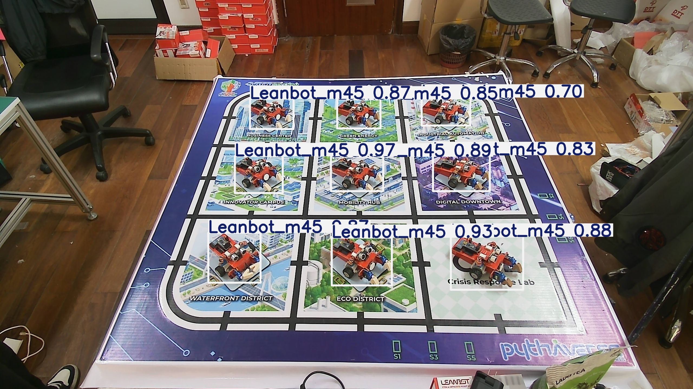 | 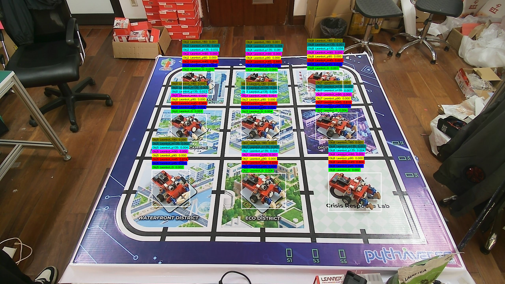 |

| Vị trí | BBox (Xc, Yc, W, H) | 0 | p45 | m45 | p90 | m90 | p135 | m135 | 180 | Best Class | Góc ước lượng |
|---|---|---|---|---|---|---|---|---|---|---|---|
| #1 | (956, 646.5, 178, 137) | 0.0025 | 0.0086 | **0.9658** | 0.0002 | 0.0002 | 0.0228 | 0.0050 | 0.0005 | `Leanbot_m45` (0.9658) | -40.8° |
| #2 | (1336.5, 968, 223, 178) | 0.0058 | 0.0000 | **0.9293** | 0.0000 | 0.0012 | 0.0056 | 0.0009 | 0.0012 | `Leanbot_m45` (0.9293) | -44.7° |
| #3 | (1004.5, 422, 161, 112) | 0.0029 | 0.0034 | **0.8960** | 0.0001 | 0.0003 | 0.0323 | 0.0053 | 0.0006 | `Leanbot_m45` (0.8960) | -38.7° |
| #4 | (1318.5, 643.5, 193, 129) | 0.0044 | 0.0000 | **0.8924** | 0.0000 | 0.0006 | 0.0058 | 0.0015 | 0.0004 | `Leanbot_m45` (0.8924) | -43.8° |
| #5 | (1325.5, 421.5, 161, 109) | 0.0046 | 0.0009 | **0.8854** | 0.0001 | 0.0003 | 0.0813 | 0.0062 | 0.0006 | `Leanbot_m45` (0.8854) | -29.9° |
| #6 | (866, 954, 192, 184) | 0.0025 | 0.0000 | **0.8741** | 0.0000 | 0.0002 | 0.0039 | 0.0020 | 0.0005 | `Leanbot_m45` (0.8741) | -44.2° |
| #7 | (1798.5, 974, 267, 196) | 0.0016 | 0.0000 | **0.8635** | 0.0000 | 0.0004 | 0.0045 | 0.0007 | 0.0007 | `Leanbot_m45` (0.8635) | -44.1° |
| #8 | (1705, 640, 210, 134) | 0.0039 | 0.0000 | **0.8190** | 0.0000 | 0.0005 | 0.0066 | 0.0016 | 0.0006 | `Leanbot_m45` (0.8190) | -43.6° |
| #9 | (1647.5, 412.5, 181, 105) | 0.0007 | 0.0203 | **0.6934** | 0.0004 | 0.0000 | 0.0579 | 0.0009 | 0.0116 | `Leanbot_m45` (0.6934) | -31.1° |


##### `angle_m105_000` (9 vị trí Leanbot)
| Ảnh BBox | Ảnh Confidence |
| :---: | :---: |
| 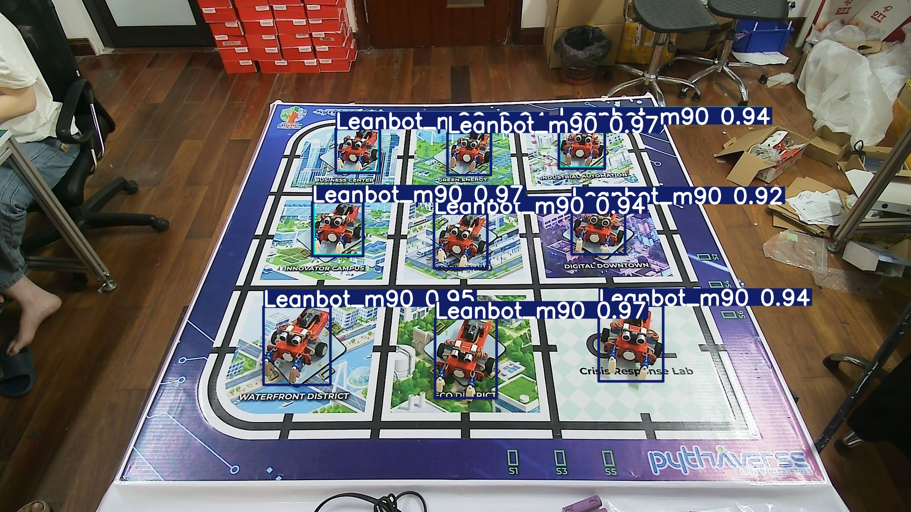 | 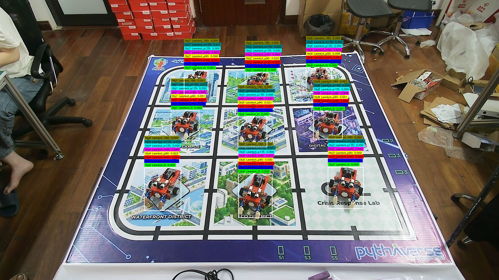 |

| Vị trí | BBox (Xc, Yc, W, H) | 0 | p45 | m45 | p90 | m90 | p135 | m135 | 180 | Best Class | Góc ước lượng |
|---|---|---|---|---|---|---|---|---|---|---|---|
| #1 | (1309.5, 1007, 173, 224) | 0.0000 | 0.0000 | 0.0003 | 0.0004 | **0.9744** | 0.0001 | 0.0008 | 0.0001 | `Leanbot_m90` (0.9744) | -90.0° |
| #2 | (949, 644, 144, 152) | 0.0001 | 0.0000 | 0.0011 | 0.0511 | **0.9651** | 0.0000 | 0.0120 | 0.0009 | `Leanbot_m90` (0.9651) | -80.9° |
| #3 | (1318.5, 433.5, 123, 119) | 0.0049 | 0.0002 | 0.0021 | 0.0197 | **0.9637** | 0.0000 | 0.0199 | 0.0004 | `Leanbot_m90` (0.9637) | -90.9° |
| #4 | (1773, 966, 182, 212) | 0.0001 | 0.0000 | 0.0005 | 0.0002 | **0.9434** | 0.0002 | 0.0005 | 0.0001 | `Leanbot_m90` (0.9434) | -90.0° |
| #5 | (834, 973, 188, 220) | 0.0000 | 0.0001 | 0.0001 | 0.0033 | **0.9404** | 0.0000 | 0.0190 | 0.0000 | `Leanbot_m90` (0.9404) | -90.9° |
| #6 | (1294.5, 678, 149, 154) | 0.0001 | 0.0000 | 0.0011 | 0.0213 | **0.9370** | 0.0000 | 0.0459 | 0.0004 | `Leanbot_m90` (0.9370) | -92.1° |
| #7 | (1635, 412, 130, 124) | 0.0002 | 0.0000 | 0.0013 | 0.0083 | **0.9292** | 0.0002 | 0.0019 | 0.0090 | `Leanbot_m90` (0.9292) | -90.9° |
| #8 | (1005.5, 425, 123, 124) | 0.0011 | 0.0002 | 0.0011 | 0.0961 | **0.9228** | 0.0000 | 0.2110 | 0.0004 | `Leanbot_m90` (0.9228) | -98.4° |
| #9 | (1681.5, 644, 149, 142) | 0.0008 | 0.0001 | 0.0056 | 0.0011 | **0.9083** | 0.0000 | 0.0038 | 0.0006 | `Leanbot_m90` (0.9083) | -89.7° |


##### `angle_p75_000` (9 vị trí Leanbot)
| Ảnh BBox | Ảnh Confidence |
| :---: | :---: |
| 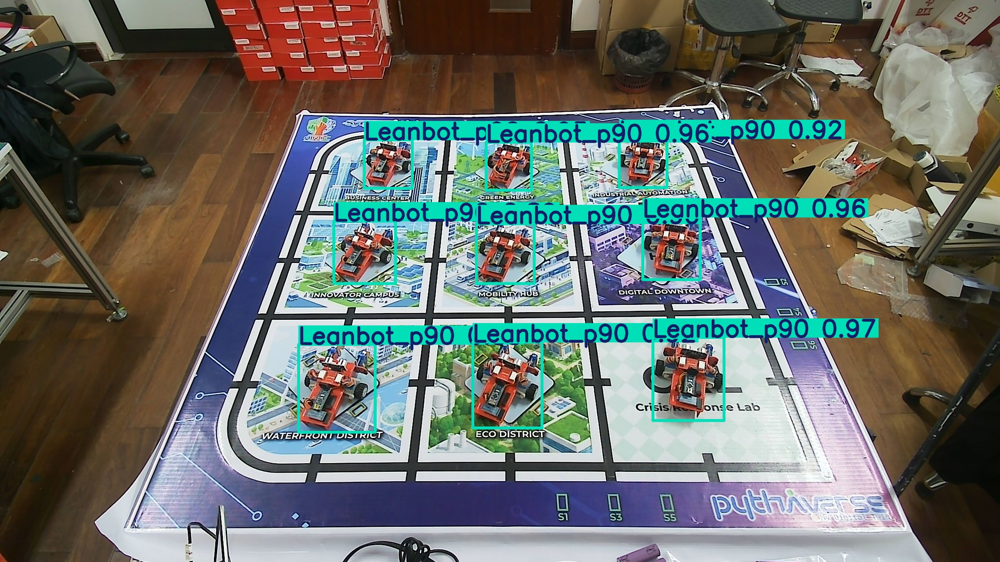 | 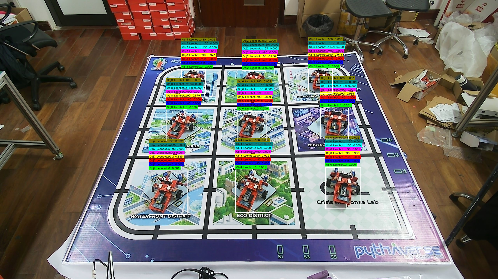 |

| Vị trí | BBox (Xc, Yc, W, H) | 0 | p45 | m45 | p90 | m90 | p135 | m135 | 180 | Best Class | Góc ước lượng |
|---|---|---|---|---|---|---|---|---|---|---|---|
| #1 | (1763, 970.5, 182, 213) | 0.0002 | 0.0001 | 0.0002 | **0.9677** | 0.0012 | 0.0001 | 0.0014 | 0.0022 | `Leanbot_p90` (0.9677) | 90.2° |
| #2 | (1719, 636.5, 146, 159) | 0.0005 | 0.0000 | 0.0001 | **0.9649** | 0.0012 | 0.0001 | 0.0008 | 0.0035 | `Leanbot_p90` (0.9649) | 90.3° |
| #3 | (1302.5, 425.5, 117, 123) | 0.0001 | 0.0045 | 0.0000 | **0.9563** | 0.0091 | 0.0000 | 0.0003 | 0.0053 | `Leanbot_p90` (0.9563) | 88.3° |
| #4 | (994, 420.5, 124, 125) | 0.0004 | 0.0001 | 0.0001 | **0.9232** | 0.0006 | 0.0001 | 0.0032 | 0.0063 | `Leanbot_p90` (0.9232) | 90.6° |
| #5 | (1298.5, 987, 177, 220) | 0.0007 | 0.0001 | 0.0001 | **0.9222** | 0.0006 | 0.0001 | 0.0006 | 0.0022 | `Leanbot_p90` (0.9222) | 90.2° |
| #6 | (1646.5, 418.5, 123, 125) | 0.0002 | 0.0001 | 0.0002 | **0.9142** | 0.0004 | 0.0001 | 0.0022 | 0.0034 | `Leanbot_p90` (0.9142) | 90.3° |
| #7 | (1293.5, 650.5, 149, 153) | 0.0005 | 0.0001 | 0.0002 | **0.8987** | 0.0007 | 0.0001 | 0.0008 | 0.0016 | `Leanbot_p90` (0.8987) | 90.2° |
| #8 | (863.5, 994, 197, 224) | 0.0008 | 0.0001 | 0.0001 | **0.8854** | 0.0006 | 0.0001 | 0.0007 | 0.0023 | `Leanbot_p90` (0.8854) | 90.2° |
| #9 | (933.5, 647, 159, 160) | 0.0001 | 0.0001 | 0.0002 | **0.8787** | 0.0006 | 0.0001 | 0.0028 | 0.0016 | `Leanbot_p90` (0.8787) | 90.4° |


##### `angle_p120_000` (9 vị trí Leanbot)
| Ảnh BBox | Ảnh Confidence |
| :---: | :---: |
| 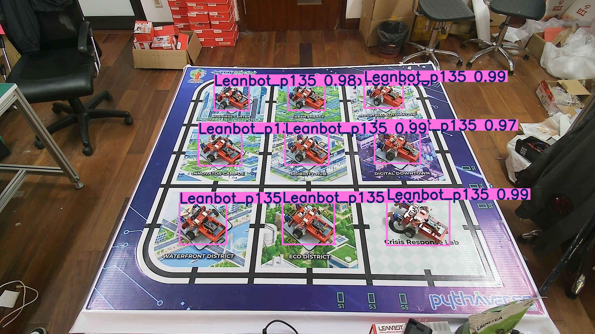 | 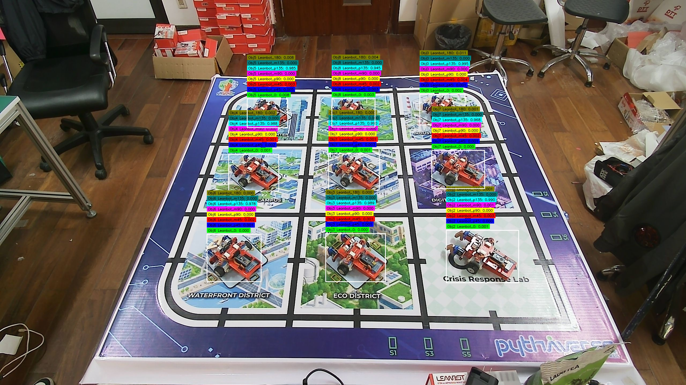 |

| Vị trí | BBox (Xc, Yc, W, H) | 0 | p45 | m45 | p90 | m90 | p135 | m135 | 180 | Best Class | Góc ước lượng |
|---|---|---|---|---|---|---|---|---|---|---|---|
| #1 | (1650.5, 409, 169, 114) | 0.0016 | 0.0009 | 0.0035 | 0.0000 | 0.0001 | **0.9948** | 0.0000 | 0.0114 | `Leanbot_p135` (0.9948) | 135.5° |
| #2 | (1320.5, 643, 189, 136) | 0.0007 | 0.0025 | 0.0011 | 0.0000 | 0.0003 | **0.9904** | 0.0000 | 0.0004 | `Leanbot_p135` (0.9904) | 134.8° |
| #3 | (1800, 959, 270, 196) | 0.0006 | 0.0001 | 0.0026 | 0.0000 | 0.0013 | **0.9902** | 0.0000 | 0.0008 | `Leanbot_p135` (0.9902) | 134.5° |
| #4 | (1326.5, 963, 223, 180) | 0.0004 | 0.0005 | 0.0008 | 0.0000 | 0.0003 | **0.9887** | 0.0000 | 0.0002 | `Leanbot_p135` (0.9887) | 134.9° |
| #5 | (946.5, 645, 187, 138) | 0.0012 | 0.0016 | 0.0011 | 0.0000 | 0.0001 | **0.9878** | 0.0000 | 0.0015 | `Leanbot_p135` (0.9878) | 134.9° |
| #6 | (997.5, 423, 151, 108) | 0.0076 | 0.0046 | 0.0030 | 0.0001 | 0.0000 | **0.9852** | 0.0000 | 0.0081 | `Leanbot_p135` (0.9852) | 135.4° |
| #7 | (873, 964.5, 202, 177) | 0.0003 | 0.0008 | 0.0016 | 0.0000 | 0.0003 | **0.9785** | 0.0000 | 0.0001 | `Leanbot_p135` (0.9785) | 134.7° |
| #8 | (1709.5, 633.5, 197, 143) | 0.0005 | 0.0006 | 0.0016 | 0.0000 | 0.0001 | **0.9685** | 0.0001 | 0.0008 | `Leanbot_p135` (0.9685) | 134.7° |
| #9 | (1318.5, 421.5, 161, 107) | 0.0028 | 0.0029 | 0.0021 | 0.0001 | 0.0000 | **0.9454** | 0.0000 | 0.0044 | `Leanbot_p135` (0.9454) | 135.2° |


##### `angle_p150_000` (9 vị trí Leanbot)
| Ảnh BBox | Ảnh Confidence |
| :---: | :---: |
| 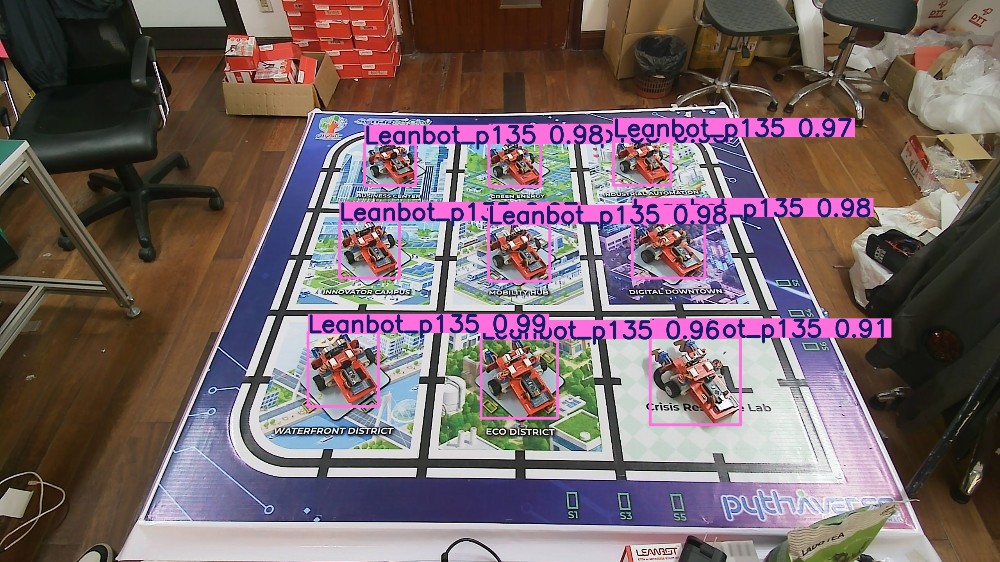 | 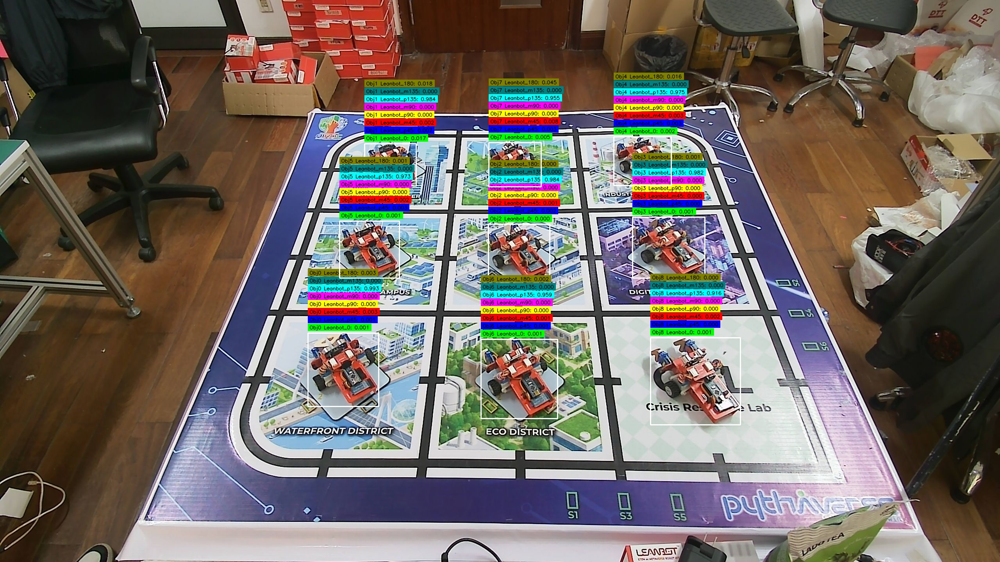 |

| Vị trí | BBox (Xc, Yc, W, H) | 0 | p45 | m45 | p90 | m90 | p135 | m135 | 180 | Best Class | Góc ước lượng |
|---|---|---|---|---|---|---|---|---|---|---|---|
| #1 | (878.5, 947, 181, 188) | 0.0011 | 0.0013 | 0.0030 | 0.0000 | 0.0001 | **0.9929** | 0.0000 | 0.0026 | `Leanbot_p135` (0.9929) | 134.5° |
| #2 | (999, 422, 132, 108) | 0.0172 | 0.0073 | 0.0019 | 0.0005 | 0.0001 | **0.9838** | 0.0000 | 0.0175 | `Leanbot_p135` (0.9838) | 135.8° |
| #3 | (1328.5, 647.5, 157, 147) | 0.0004 | 0.0017 | 0.0008 | 0.0000 | 0.0002 | **0.9838** | 0.0000 | 0.0004 | `Leanbot_p135` (0.9838) | 134.8° |
| #4 | (1711.5, 634, 185, 156) | 0.0007 | 0.0002 | 0.0003 | 0.0000 | 0.0003 | **0.9820** | 0.0000 | 0.0007 | `Leanbot_p135` (0.9820) | 134.9° |
| #5 | (1644.5, 412.5, 147, 125) | 0.0021 | 0.0026 | 0.0026 | 0.0001 | 0.0001 | **0.9748** | 0.0000 | 0.0158 | `Leanbot_p135` (0.9748) | 135.7° |
| #6 | (945.5, 639, 153, 146) | 0.0012 | 0.0027 | 0.0023 | 0.0000 | 0.0001 | **0.9729** | 0.0000 | 0.0008 | `Leanbot_p135` (0.9729) | 134.8° |
| #7 | (1329, 970.5, 196, 203) | 0.0006 | 0.0006 | 0.0010 | 0.0000 | 0.0001 | **0.9591** | 0.0000 | 0.0020 | `Leanbot_p135` (0.9591) | 135.1° |
| #8 | (1318, 421.5, 134, 113) | 0.0046 | 0.0030 | 0.0085 | 0.0001 | 0.0000 | **0.9553** | 0.0000 | 0.0445 | `Leanbot_p135` (0.9553) | 137.0° |
| #9 | (1780, 976.5, 230, 223) | 0.0006 | 0.0002 | 0.0017 | 0.0000 | 0.0003 | **0.9165** | 0.0000 | 0.0002 | `Leanbot_p135` (0.9165) | 134.7° |


##### `angle_m15_000` (9 vị trí Leanbot)
| Ảnh BBox | Ảnh Confidence |
| :---: | :---: |
| 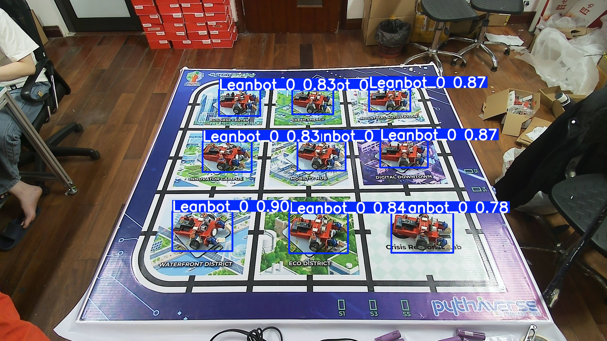 | 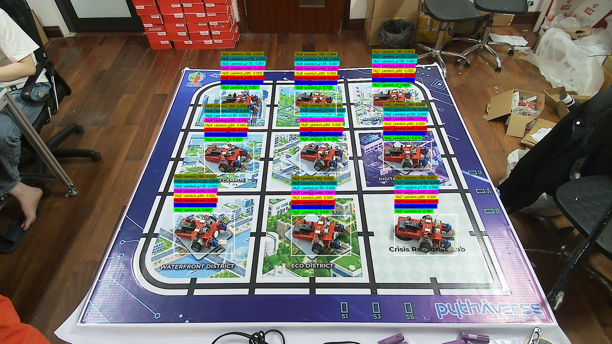 |

| Vị trí | BBox (Xc, Yc, W, H) | 0 | p45 | m45 | p90 | m90 | p135 | m135 | 180 | Best Class | Góc ước lượng |
|---|---|---|---|---|---|---|---|---|---|---|---|
| #1 | (853.5, 976.5, 253, 167) | **0.8896** | 0.0001 | 0.0179 | 0.0001 | 0.0005 | 0.0004 | 0.0001 | 0.0100 | `Leanbot_0` (0.8896) | -0.9° |
| #2 | (1643.5, 420, 175, 100) | **0.8852** | 0.0001 | 0.0040 | 0.0001 | 0.0001 | 0.0009 | 0.0001 | 0.0088 | `Leanbot_0` (0.8852) | 1.8° |
| #3 | (1703.5, 649.5, 201, 115) | **0.8740** | 0.0002 | 0.0051 | 0.0002 | 0.0005 | 0.0002 | 0.0002 | 0.0075 | `Leanbot_0` (0.8740) | 1.5° |
| #4 | (1343, 985, 248, 168) | **0.8356** | 0.0001 | 0.0073 | 0.0001 | 0.0008 | 0.0004 | 0.0000 | 0.0020 | `Leanbot_0` (0.8356) | -0.4° |
| #5 | (958, 662, 206, 128) | **0.8304** | 0.0002 | 0.0184 | 0.0001 | 0.0004 | 0.0005 | 0.0001 | 0.0065 | `Leanbot_0` (0.8304) | -1.0° |
| #6 | (1010, 435, 174, 110) | **0.8211** | 0.0003 | 0.0099 | 0.0001 | 0.0002 | 0.0011 | 0.0001 | 0.0245 | `Leanbot_0` (0.8211) | 5.2° |
| #7 | (1356, 658, 204, 124) | **0.7824** | 0.0002 | 0.0174 | 0.0001 | 0.0005 | 0.0004 | 0.0001 | 0.0044 | `Leanbot_0` (0.7824) | -1.0° |
| #8 | (1781, 983, 262, 170) | **0.7809** | 0.0001 | 0.0069 | 0.0001 | 0.0012 | 0.0005 | 0.0000 | 0.0012 | `Leanbot_0` (0.7809) | -0.4° |
| #9 | (1319, 431.5, 174, 101) | **0.7287** | 0.0003 | 0.0268 | 0.0003 | 0.0003 | 0.0007 | 0.0003 | 0.0839 | `Leanbot_0` (0.7287) | 18.6° |


##### `angle_m165_000` (9 vị trí Leanbot)
| Ảnh BBox | Ảnh Confidence |
| :---: | :---: |
| 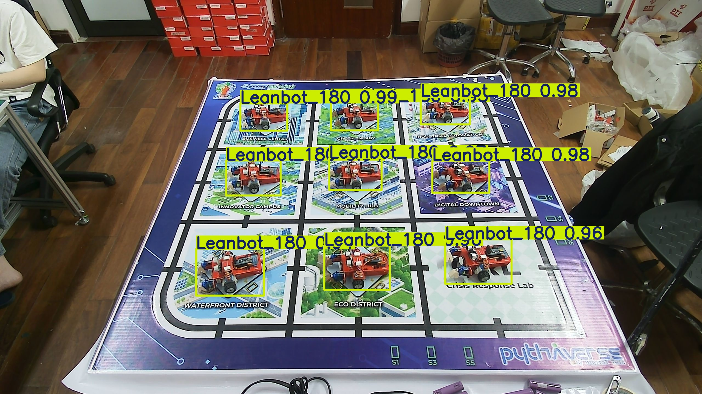 | 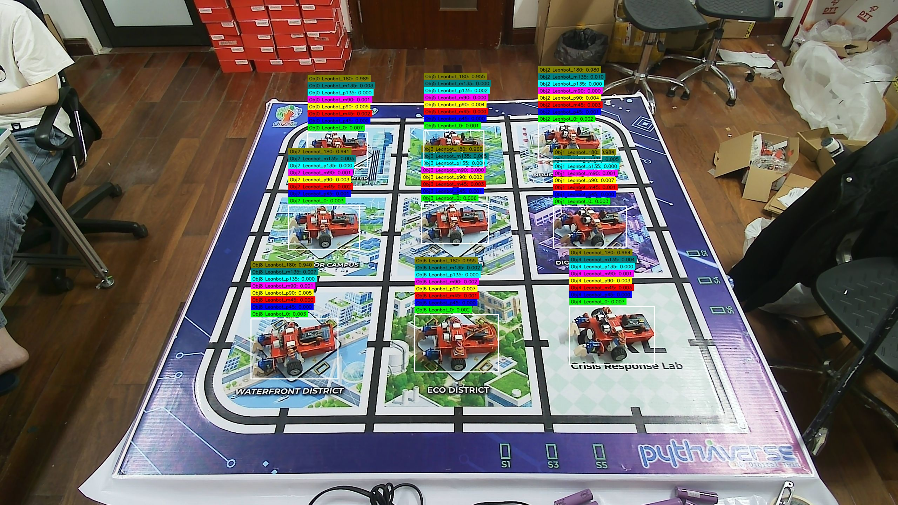 |

| Vị trí | BBox (Xc, Yc, W, H) | 0 | p45 | m45 | p90 | m90 | p135 | m135 | 180 | Best Class | Góc ước lượng |
|---|---|---|---|---|---|---|---|---|---|---|---|
| #1 | (962.5, 428, 171, 100) | 0.0072 | 0.0005 | 0.0021 | 0.0050 | 0.0005 | 0.0001 | 0.0035 | **0.9887** | `Leanbot_180` (0.9887) | 178.7° |
| #2 | (1681, 646, 208, 116) | 0.0027 | 0.0005 | 0.0006 | 0.0074 | 0.0012 | 0.0001 | 0.0052 | **0.9843** | `Leanbot_180` (0.9843) | 179.3° |
| #3 | (1623.5, 404, 179, 102) | 0.0022 | 0.0007 | 0.0026 | 0.0043 | 0.0003 | 0.0001 | 0.0100 | **0.9798** | `Leanbot_180` (0.9798) | -179.5° |
| #4 | (1296.5, 636.5, 191, 115) | 0.0057 | 0.0006 | 0.0028 | 0.0025 | 0.0003 | 0.0001 | 0.0051 | **0.9664** | `Leanbot_180` (0.9664) | 178.9° |
| #5 | (1744.5, 956, 243, 164) | 0.0073 | 0.0004 | 0.0033 | 0.0033 | 0.0006 | 0.0001 | 0.0040 | **0.9645** | `Leanbot_180` (0.9645) | 178.6° |
| #6 | (1293.5, 424, 171, 104) | 0.0014 | 0.0001 | 0.0001 | 0.0042 | 0.0002 | 0.0023 | 0.0000 | **0.9554** | `Leanbot_180` (0.9554) | 179.6° |
| #7 | (1301.5, 978.5, 239, 163) | 0.0016 | 0.0002 | 0.0007 | 0.0066 | 0.0020 | 0.0000 | 0.0025 | **0.9551** | `Leanbot_180` (0.9551) | 179.4° |
| #8 | (923.5, 648.5, 203, 125) | 0.0033 | 0.0005 | 0.0024 | 0.0029 | 0.0005 | 0.0001 | 0.0030 | **0.9410** | `Leanbot_180` (0.9410) | 179.4° |
| #9 | (839, 994.5, 248, 171) | 0.0030 | 0.0002 | 0.0004 | 0.0046 | 0.0014 | 0.0000 | 0.0067 | **0.9396** | `Leanbot_180` (0.9396) | -179.7° |


##### `angle_p195_000` (9 vị trí Leanbot)
| Ảnh BBox | Ảnh Confidence |
| :---: | :---: |
| 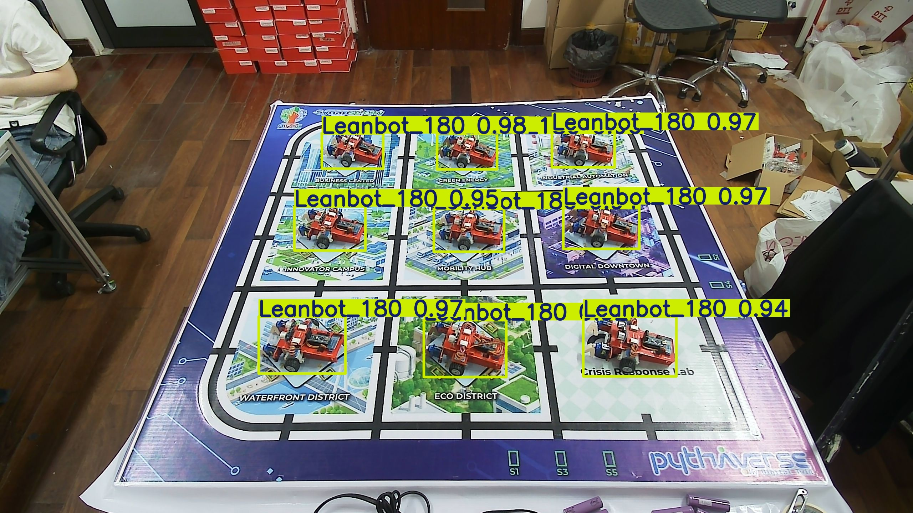 | 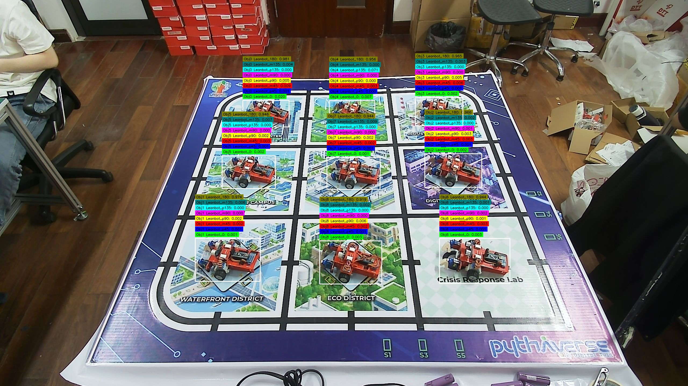 |

| Vị trí | BBox (Xc, Yc, W, H) | 0 | p45 | m45 | p90 | m90 | p135 | m135 | 180 | Best Class | Góc ước lượng |
|---|---|---|---|---|---|---|---|---|---|---|---|
| #1 | (989, 423.5, 172, 99) | 0.0197 | 0.0007 | 0.0086 | 0.0051 | 0.0004 | 0.0001 | 0.0038 | **0.9811** | `Leanbot_180` (0.9811) | 176.5° |
| #2 | (847, 969, 242, 160) | 0.0015 | 0.0011 | 0.0017 | 0.0024 | 0.0005 | 0.0001 | 0.0059 | **0.9738** | `Leanbot_180` (0.9738) | -179.7° |
| #3 | (1686, 635.5, 212, 125) | 0.0024 | 0.0006 | 0.0026 | 0.0029 | 0.0012 | 0.0002 | 0.0024 | **0.9660** | `Leanbot_180` (0.9660) | 179.7° |
| #4 | (1633.5, 416, 177, 106) | 0.0017 | 0.0006 | 0.0056 | 0.0052 | 0.0004 | 0.0001 | 0.0032 | **0.9651** | `Leanbot_180` (0.9651) | -179.2° |
| #5 | (1309.5, 425.5, 169, 101) | 0.0065 | 0.0001 | 0.0027 | 0.0002 | 0.0001 | 0.0707 | 0.0001 | **0.9564** | `Leanbot_180` (0.9564) | 176.9° |
| #6 | (925, 641.5, 198, 123) | 0.0015 | 0.0010 | 0.0027 | 0.0024 | 0.0002 | 0.0001 | 0.0066 | **0.9456** | `Leanbot_180` (0.9456) | -179.7° |
| #7 | (1766, 973, 262, 168) | 0.0029 | 0.0005 | 0.0030 | 0.0008 | 0.0016 | 0.0001 | 0.0005 | **0.9439** | `Leanbot_180` (0.9439) | -179.6° |
| #8 | (1315, 646.5, 198, 119) | 0.0010 | 0.0009 | 0.0020 | 0.0021 | 0.0003 | 0.0001 | 0.0085 | **0.9439** | `Leanbot_180` (0.9439) | -179.6° |
| #9 | (1304.5, 978.5, 231, 161) | 0.0030 | 0.0008 | 0.0019 | 0.0057 | 0.0003 | 0.0001 | 0.0018 | **0.9189** | `Leanbot_180` (0.9189) | 179.4° |


##### `angle_p65_000` (9 vị trí Leanbot)
| Ảnh BBox | Ảnh Confidence |
| :---: | :---: |
| 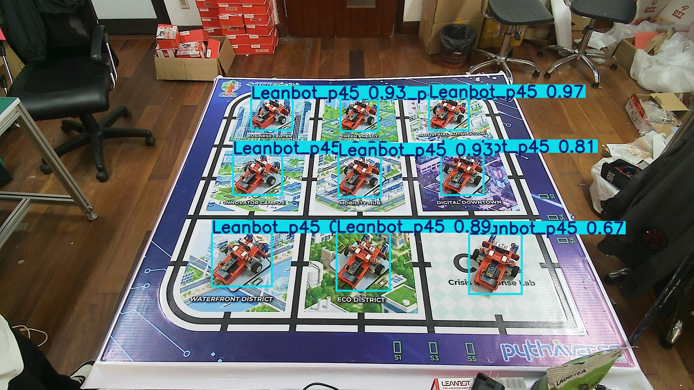 |  |

| Vị trí | BBox (Xc, Yc, W, H) | 0 | p45 | m45 | p90 | m90 | p135 | m135 | 180 | Best Class | Góc ước lượng |
|---|---|---|---|---|---|---|---|---|---|---|---|
| #1 | (1656.5, 420.5, 147, 119) | 0.0002 | **0.9747** | 0.0009 | 0.0491 | 0.0000 | 0.0022 | 0.0006 | 0.0098 | `Leanbot_p45` (0.9747) | 47.2° |
| #2 | (1003, 422, 154, 116) | 0.0020 | **0.9424** | 0.0017 | 0.0018 | 0.0000 | 0.0065 | 0.0003 | 0.0006 | `Leanbot_p45` (0.9424) | 45.6° |
| #3 | (1325.5, 425.5, 139, 117) | 0.0037 | **0.9411** | 0.0004 | 0.0095 | 0.0001 | 0.0013 | 0.0003 | 0.0007 | `Leanbot_p45` (0.9411) | 45.4° |
| #4 | (1326.5, 652, 159, 152) | 0.0004 | **0.9351** | 0.0008 | 0.0017 | 0.0002 | 0.0007 | 0.0000 | 0.0002 | `Leanbot_p45` (0.9351) | 45.1° |
| #5 | (1340, 965.5, 198, 215) | 0.0001 | **0.9037** | 0.0010 | 0.0011 | 0.0005 | 0.0026 | 0.0000 | 0.0007 | `Leanbot_p45` (0.9037) | 45.3° |
| #6 | (892, 958.5, 222, 197) | 0.0000 | **0.8725** | 0.0003 | 0.0017 | 0.0005 | 0.0006 | 0.0001 | 0.0005 | `Leanbot_p45` (0.8725) | 45.1° |
| #7 | (950, 644.5, 180, 151) | 0.0002 | **0.8438** | 0.0005 | 0.0033 | 0.0000 | 0.0010 | 0.0003 | 0.0050 | `Leanbot_p45` (0.8438) | 45.8° |
| #8 | (1706, 642.5, 156, 157) | 0.0003 | **0.8106** | 0.0011 | 0.0019 | 0.0001 | 0.0018 | 0.0001 | 0.0002 | `Leanbot_p45` (0.8106) | 45.1° |
| #9 | (1828, 975.5, 194, 221) | 0.0002 | **0.6927** | 0.0007 | 0.0007 | 0.0006 | 0.0037 | 0.0000 | 0.0005 | `Leanbot_p45` (0.6927) | 45.5° |


##### `angle_p30_000` (9 vị trí Leanbot)
| Ảnh BBox | Ảnh Confidence |
| :---: | :---: |
| 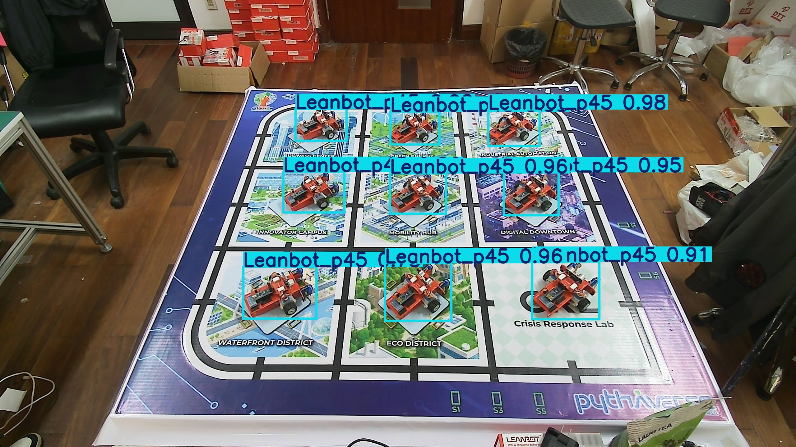 | 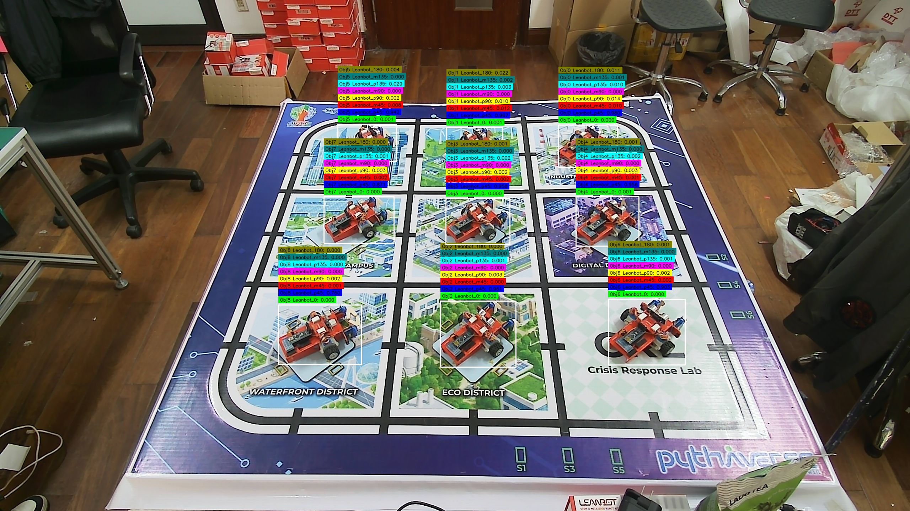 |

| Vị trí | BBox (Xc, Yc, W, H) | 0 | p45 | m45 | p90 | m90 | p135 | m135 | 180 | Best Class | Góc ước lượng |
|---|---|---|---|---|---|---|---|---|---|---|---|
| #1 | (1653.5, 411.5, 165, 119) | 0.0005 | **0.9801** | 0.0101 | 0.0143 | 0.0000 | 0.0096 | 0.0006 | 0.0110 | `Leanbot_p45` (0.9801) | 45.6° |
| #2 | (1335, 412.5, 158, 107) | 0.0010 | **0.9668** | 0.0115 | 0.0104 | 0.0000 | 0.0034 | 0.0020 | 0.0215 | `Leanbot_p45` (0.9668) | 47.9° |
| #3 | (1345, 941, 212, 186) | 0.0001 | **0.9613** | 0.0003 | 0.0028 | 0.0000 | 0.0007 | 0.0002 | 0.0002 | `Leanbot_p45` (0.9613) | 45.1° |
| #4 | (1344, 624, 180, 130) | 0.0004 | **0.9576** | 0.0023 | 0.0024 | 0.0000 | 0.0020 | 0.0004 | 0.0012 | `Leanbot_p45` (0.9576) | 45.1° |
| #5 | (1708.5, 623.5, 177, 139) | 0.0009 | **0.9564** | 0.0009 | 0.0029 | 0.0000 | 0.0024 | 0.0002 | 0.0015 | `Leanbot_p45` (0.9564) | 45.1° |
| #6 | (1032.5, 402, 165, 104) | 0.0005 | **0.9418** | 0.0083 | 0.0018 | 0.0000 | 0.0293 | 0.0004 | 0.0040 | `Leanbot_p45` (0.9418) | 47.7° |
| #7 | (1819, 935.5, 216, 185) | 0.0001 | **0.9032** | 0.0018 | 0.0018 | 0.0000 | 0.0012 | 0.0003 | 0.0006 | `Leanbot_p45` (0.9032) | 44.8° |
| #8 | (1009.5, 619.5, 197, 131) | 0.0003 | **0.8707** | 0.0015 | 0.0026 | 0.0000 | 0.0005 | 0.0005 | 0.0002 | `Leanbot_p45` (0.8707) | 45.1° |
| #9 | (900, 943, 234, 168) | 0.0001 | **0.7597** | 0.0006 | 0.0016 | 0.0000 | 0.0004 | 0.0003 | 0.0002 | `Leanbot_p45` (0.7597) | 45.1° |


##### `angle_p105_000` (9 vị trí Leanbot)
| Ảnh BBox | Ảnh Confidence |
| :---: | :---: |
| 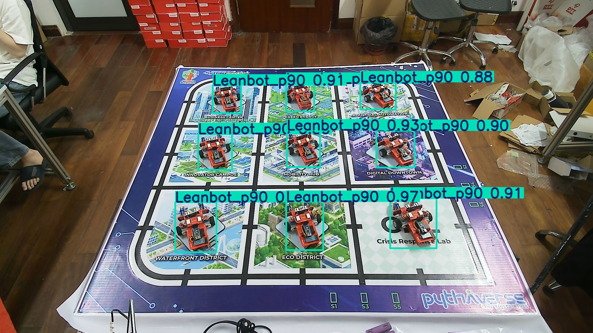 | 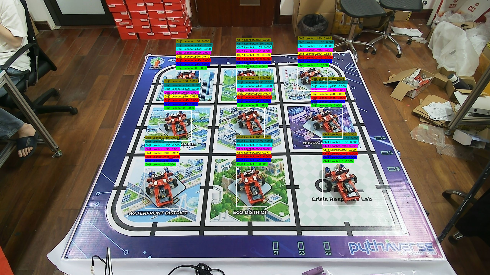 |

| Vị trí | BBox (Xc, Yc, W, H) | 0 | p45 | m45 | p90 | m90 | p135 | m135 | 180 | Best Class | Góc ước lượng |
|---|---|---|---|---|---|---|---|---|---|---|---|
| #1 | (1315, 977.5, 160, 209) | 0.0002 | 0.0000 | 0.0002 | **0.9770** | 0.0012 | 0.0001 | 0.0009 | 0.0021 | `Leanbot_p90` (0.9770) | 90.2° |
| #2 | (845, 982.5, 178, 215) | 0.0005 | 0.0000 | 0.0001 | **0.9568** | 0.0006 | 0.0001 | 0.0006 | 0.0019 | `Leanbot_p90` (0.9568) | 90.2° |
| #3 | (1309.5, 643.5, 143, 159) | 0.0002 | 0.0001 | 0.0002 | **0.9270** | 0.0015 | 0.0001 | 0.0012 | 0.0020 | `Leanbot_p90` (0.9270) | 90.2° |
| #4 | (980, 430, 122, 120) | 0.0007 | 0.0000 | 0.0002 | **0.9098** | 0.0009 | 0.0001 | 0.0023 | 0.0080 | `Leanbot_p90` (0.9098) | 90.8° |
| #5 | (1785, 966, 200, 216) | 0.0003 | 0.0000 | 0.0001 | **0.9094** | 0.0013 | 0.0001 | 0.0005 | 0.0021 | `Leanbot_p90` (0.9094) | 90.2° |
| #6 | (928.5, 657, 145, 156) | 0.0002 | 0.0001 | 0.0002 | **0.8896** | 0.0011 | 0.0001 | 0.0015 | 0.0016 | `Leanbot_p90` (0.8896) | 90.2° |
| #7 | (1707, 645, 166, 158) | 0.0003 | 0.0001 | 0.0001 | **0.8862** | 0.0008 | 0.0001 | 0.0005 | 0.0032 | `Leanbot_p90` (0.8862) | 90.3° |
| #8 | (1296, 422, 122, 120) | 0.0007 | 0.0000 | 0.0002 | **0.8685** | 0.0017 | 0.0001 | 0.0016 | 0.0078 | `Leanbot_p90` (0.8685) | 90.8° |
| #9 | (1632, 414, 154, 118) | 0.0002 | 0.0001 | 0.0002 | **0.8679** | 0.0006 | 0.0001 | 0.0009 | 0.0163 | `Leanbot_p90` (0.8679) | 91.7° |


### 3. Công cụ tự động hóa việc gom các góc vào gắn vào folder Class.

Để linh hoạt thử nghiệm các cấu hình Class khác nhau (ví dụ: cấu hình 8 Class, 24 Class, v.v.) từ 24 góc thực tế đã phân loại, em đã xây dựng thêm script tự động hóa việc gom dữ liệu: `group_to_class.py`.

**Quy trình hoạt động của tool:**
1. **Gom nhóm ảnh tự động**: Tool nhận đầu vào là tên Dataset muốn đặt (ví dụ: `8class`) và danh sách các thư mục góc nhỏ lẻ từ `root_images` (ví dụ: `angle_0`, `angle_p15`, `angle_m15`). 
2. **Khởi tạo cấu trúc Session giả lập**: Thay vì copy ảnh một cách ngẫu nhiên, tool sẽ tự động tạo một cấu trúc thư mục giả lập dưới dạng một thư mục mang tên của Class mong muốn (ví dụ: tạo thư mục `datasets/8class/raw_image/Leanbot_0/`).
3. **Gán Metadata cấu hình**: Tool tự động sao chép toàn bộ ảnh vào thư mục `raw_images` và sinh ra file cấu hình `session_metadata.json`. File này đóng vai trò lưu trữ cứng `class_id` và `class_name` cho nhóm ảnh đó.
4. **Tích hợp Background**: Tool hỗ trợ tham số `--bg_path` để tự động copy thẳng một file ảnh Background chuẩn vào thư mục `backgrounds`.

**Kết quả đạt được:**
- Cấu trúc sinh ra tương thích với luồng chạy của tool `process_auto_label.py`. 
- Khi chạy tool Auto Label trên thư mục Class vừa tạo, nhãn bounding box xuất ra sẽ tự động được gán đúng số `class_id` cấu hình trong metadata mà không cần tinh chỉnh thủ công.
- Lệnh chạy tools như sau: 
  ```powershell
  python group_to_class.py --dataset_name 24class --folders angle_0  --class_name Leanbot_0 --class_id 0
  ```
- Sau khi chạy để tạo 24 Class thì kết quả là kiến trúc dataset mới như sau:

```text
datasets/24class/raw_image/
├── Leanbot_0/ (Class ID: 0)
│   ├── backgrounds/
│   │   └── background_000.jpg
│   ├── raw_images/
│   │   ├── angle_0_000.jpg
│   │   ├── angle_0_001.jpg
│   │   ├── angle_0_002.jpg
│   │   ├── angle_0_003.jpg
│   │   └── angle_0_004.jpg
│   └── session_metadata.json
├── Leanbot_p15/ (Class ID: 1)
│   ├── backgrounds/
│   │   └── background_000.jpg
│   ├── raw_images/
│   │   └── ... (5 ảnh góc dương 15 độ)
│   └── session_metadata.json
├── Leanbot_m15/ (Class ID: 2)
│   ├── backgrounds/
│   │   └── background_000.jpg
│   ├── raw_images/
│   │   └── ... (5 ảnh góc âm 15 độ)
│   └── session_metadata.json
├── ... (Tương tự cho các góc còn lại) ...
│
└── Leanbot_p195/ (Class ID: 23)
    ├── backgrounds/
    │   └── background_000.jpg
    ├── raw_images/
    │   └── ... (5 ảnh góc 195 độ)
    └── session_metadata.json
```
## B. Khó khăn.
- Hiện tại trong quá trình tổ chức lại ảnh gốc, em nhận thấy các ảnh khi gom về theo góc, thì nó sẽ là rời rạc với nhau về thời gian chụp --> Back ground là khác nhau. Việc lấy 1 Back ground để trừ ảnh rồi auto Label sẽ không hoạt động đúng ạ .

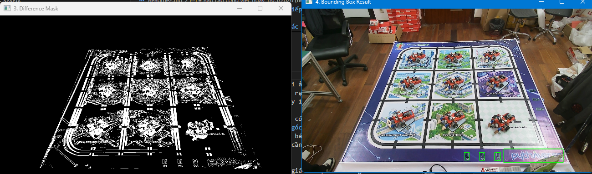

- Vì mỗi góc thực tế chỉ có 5 ảnh, em có cần thu thập thêm không ạ ? 
- Các phép tính toán như **ước lượng góc** , tính **Xcenter**,**Ycenter**,**Width**,**Height** trên báo cáo hiện tại là em dùng AI để tính toán và chèn vào báo cáo. Em có cần tích hợp thêm vào code xử lý luôn không ạ ? 
## C. Công việc tiếp theo.
- Thử với phương án 24 Class và đánh giá kết quả training.
- Đánh giá tạm thời trên 5 ảnh dễ nhầm lẫn.  