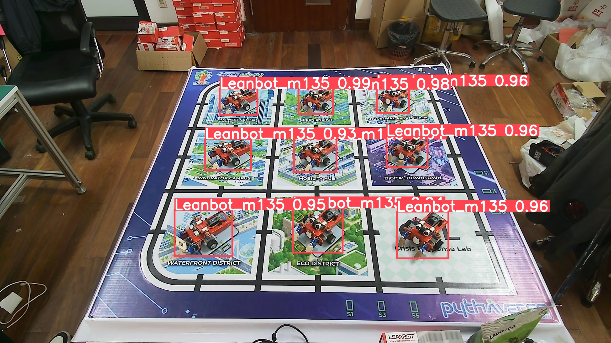
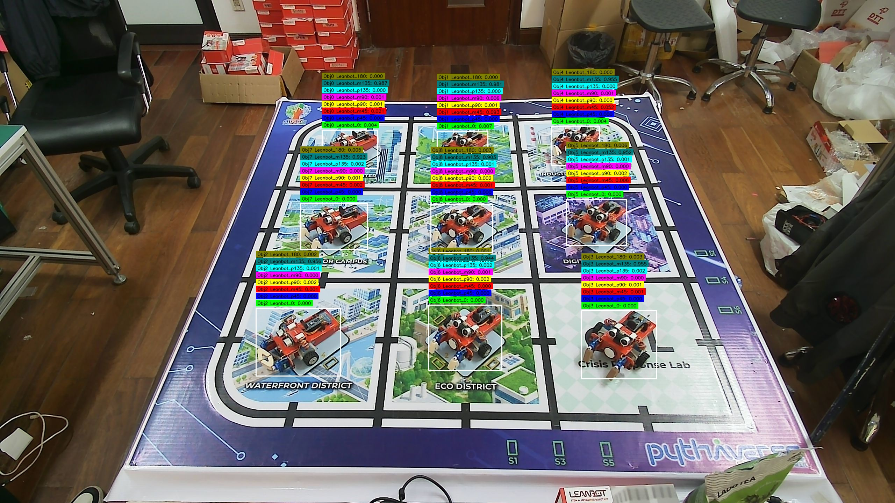
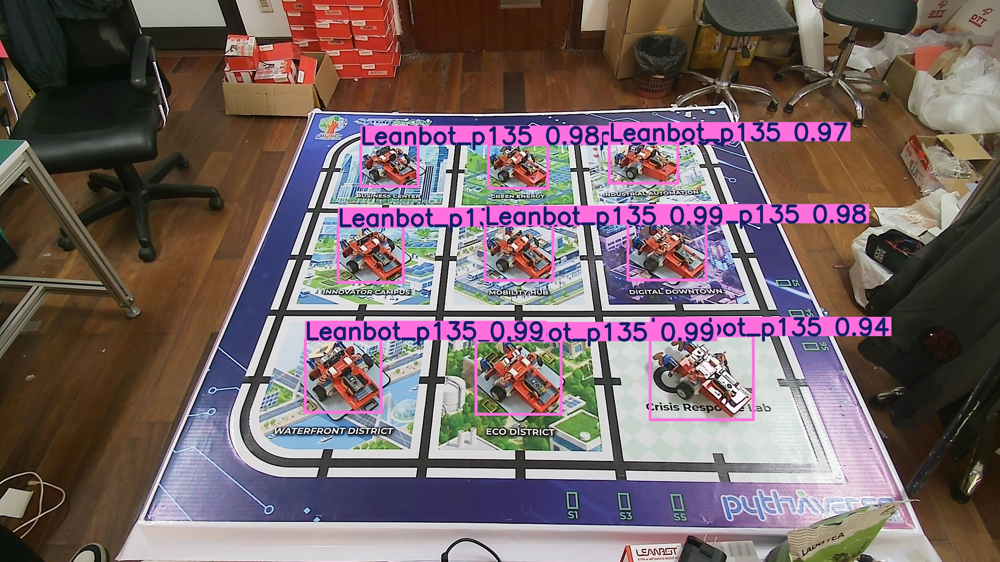
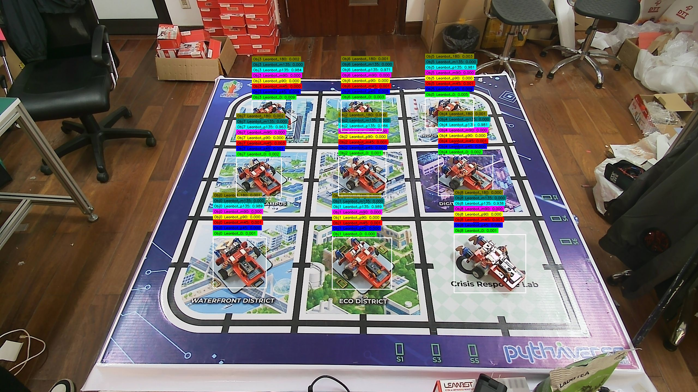

# Báo cáo inference các góc không chẵn

### Góc: `angle_m105_000`
| Ảnh BBox | Confidence Debug |
| :---: | :---: |
|  |  |

**Chi tiết Confidence từng Object:**

`[ 1560, 361, 139, 131 | 0.9905 | 0.0010  0.0001  0.0069  0.0044  0.9905  0.0000  0.0019  0.0007 ]`
> (Các class tương ứng: Leanbot_0  Leanbot_p45  Leanbot_m45  Leanbot_p90  Leanbot_m90  Leanbot_p135  Leanbot_m135  Leanbot_180)

`[ 762, 870, 179, 210 | 0.9655 | 0.0001  0.0001  0.0004  0.0002  0.9655  0.0001  0.0013  0.0000 ]`
> (Các class tương ứng: Leanbot_0  Leanbot_p45  Leanbot_m45  Leanbot_p90  Leanbot_m90  Leanbot_p135  Leanbot_m135  Leanbot_180)

`[ 1238, 881, 170, 220 | 0.9603 | 0.0002  0.0001  0.0007  0.0002  0.9603  0.0002  0.0002  0.0000 ]`
> (Các class tương ứng: Leanbot_0  Leanbot_p45  Leanbot_m45  Leanbot_p90  Leanbot_m90  Leanbot_p135  Leanbot_m135  Leanbot_180)

`[ 1236, 377, 125, 121 | 0.9571 | 0.0002  0.0000  0.0130  0.0623  0.9571  0.0003  0.0048  0.0018 ]`
> (Các class tương ứng: Leanbot_0  Leanbot_p45  Leanbot_m45  Leanbot_p90  Leanbot_m90  Leanbot_p135  Leanbot_m135  Leanbot_180)

`[ 1234, 589, 142, 146 | 0.9554 | 0.0003  0.0001  0.0026  0.0014  0.9554  0.0001  0.0004  0.0001 ]`
> (Các class tương ứng: Leanbot_0  Leanbot_p45  Leanbot_m45  Leanbot_p90  Leanbot_m90  Leanbot_p135  Leanbot_m135  Leanbot_180)

`[ 921, 372, 118, 124 | 0.9537 | 0.0001  0.0000  0.0235  0.0218  0.9537  0.0003  0.0052  0.0003 ]`
> (Các class tương ứng: Leanbot_0  Leanbot_p45  Leanbot_m45  Leanbot_p90  Leanbot_m90  Leanbot_p135  Leanbot_m135  Leanbot_180)

`[ 1602, 585, 162, 154 | 0.9459 | 0.0004  0.0000  0.0104  0.0009  0.9459  0.0001  0.0003  0.0002 ]`
> (Các class tương ứng: Leanbot_0  Leanbot_p45  Leanbot_m45  Leanbot_p90  Leanbot_m90  Leanbot_p135  Leanbot_m135  Leanbot_180)

`[ 839, 590, 149, 149 | 0.9171 | 0.0000  0.0000  0.0050  0.0111  0.9171  0.0001  0.0009  0.0015 ]`
> (Các class tương ứng: Leanbot_0  Leanbot_p45  Leanbot_m45  Leanbot_p90  Leanbot_m90  Leanbot_p135  Leanbot_m135  Leanbot_180)

`[ 1651, 881, 206, 222 | 0.9044 | 0.0001  0.0000  0.0016  0.0000  0.9044  0.0010  0.0000  0.0001 ]`
> (Các class tương ứng: Leanbot_0  Leanbot_p45  Leanbot_m45  Leanbot_p90  Leanbot_m90  Leanbot_p135  Leanbot_m135  Leanbot_180)

> **Nhận xét:** Bias rõ rệt về `Leanbot_m90` — 9/9 detection (100%), conf TB = 0.950.

---

### Góc: `angle_m120_000`
| Ảnh BBox | Confidence Debug |
| :---: | :---: |
|  |  |

**Chi tiết Confidence từng Object:**

`[ 1212, 893, 219, 176 | 0.9914 | 0.0004  0.0001  0.0016  0.0064  0.0004  0.0006  0.9914  0.0085 ]`
> (Các class tương ứng: Leanbot_0  Leanbot_p45  Leanbot_m45  Leanbot_p90  Leanbot_m90  Leanbot_p135  Leanbot_m135  Leanbot_180)

`[ 752, 878, 242, 178 | 0.9682 | 0.0003  0.0001  0.0006  0.0012  0.0002  0.0021  0.9682  0.0041 ]`
> (Các class tương ứng: Leanbot_0  Leanbot_p45  Leanbot_m45  Leanbot_p90  Leanbot_m90  Leanbot_p135  Leanbot_m135  Leanbot_180)

`[ 1631, 915, 242, 194 | 0.9516 | 0.0002  0.0000  0.0011  0.0012  0.0002  0.0010  0.9516  0.0039 ]`
> (Các class tương ứng: Leanbot_0  Leanbot_p45  Leanbot_m45  Leanbot_p90  Leanbot_m90  Leanbot_p135  Leanbot_m135  Leanbot_180)

`[ 1564, 368, 162, 109 | 0.9468 | 0.0010  0.0001  0.0029  0.0047  0.0003  0.0010  0.9468  0.0171 ]`
> (Các class tương ứng: Leanbot_0  Leanbot_p45  Leanbot_m45  Leanbot_p90  Leanbot_m90  Leanbot_p135  Leanbot_m135  Leanbot_180)

`[ 912, 375, 166, 110 | 0.9335 | 0.0038  0.0002  0.0884  0.0003  0.0005  0.0003  0.9335  0.0007 ]`
> (Các class tương ứng: Leanbot_0  Leanbot_p45  Leanbot_m45  Leanbot_p90  Leanbot_m90  Leanbot_p135  Leanbot_m135  Leanbot_180)

`[ 849, 584, 197, 130 | 0.9277 | 0.0009  0.0001  0.0050  0.0008  0.0002  0.0022  0.9277  0.0223 ]`
> (Các class tương ứng: Leanbot_0  Leanbot_p45  Leanbot_m45  Leanbot_p90  Leanbot_m90  Leanbot_p135  Leanbot_m135  Leanbot_180)

`[ 1234, 378, 161, 109 | 0.9234 | 0.0048  0.0003  0.1804  0.0004  0.0015  0.0002  0.9234  0.0012 ]`
> (Các class tương ứng: Leanbot_0  Leanbot_p45  Leanbot_m45  Leanbot_p90  Leanbot_m90  Leanbot_p135  Leanbot_m135  Leanbot_180)

`[ 1610, 579, 186, 125 | 0.9164 | 0.0001  0.0001  0.0042  0.0006  0.0004  0.0039  0.9164  0.0097 ]`
> (Các class tương ứng: Leanbot_0  Leanbot_p45  Leanbot_m45  Leanbot_p90  Leanbot_m90  Leanbot_p135  Leanbot_m135  Leanbot_180)

`[ 1228, 592, 186, 130 | 0.8997 | 0.0005  0.0001  0.0026  0.0017  0.0002  0.0009  0.8997  0.0091 ]`
> (Các class tương ứng: Leanbot_0  Leanbot_p45  Leanbot_m45  Leanbot_p90  Leanbot_m90  Leanbot_p135  Leanbot_m135  Leanbot_180)

`[ 1234, 379, 160, 107 | 0.1553 | 0.0020  0.0004  0.0505  0.0034  0.0001  0.0001  0.0779  0.1553 ]`
> (Các class tương ứng: Leanbot_0  Leanbot_p45  Leanbot_m45  Leanbot_p90  Leanbot_m90  Leanbot_p135  Leanbot_m135  Leanbot_180)

`[ 850, 586, 197, 131 | 0.1464 | 0.0022  0.0008  0.0017  0.0005  0.0004  0.0001  0.0005  0.1464 ]`
> (Các class tương ứng: Leanbot_0  Leanbot_p45  Leanbot_m45  Leanbot_p90  Leanbot_m90  Leanbot_p135  Leanbot_m135  Leanbot_180)

`[ 911, 376, 166, 107 | 0.0781 | 0.0021  0.0005  0.0402  0.0010  0.0000  0.0002  0.0661  0.0781 ]`
> (Các class tương ứng: Leanbot_0  Leanbot_p45  Leanbot_m45  Leanbot_p90  Leanbot_m90  Leanbot_p135  Leanbot_m135  Leanbot_180)

`[ 1233, 594, 178, 109 | 0.0663 | 0.0006  0.0002  0.0021  0.0003  0.0003  0.0001  0.0008  0.0663 ]`
> (Các class tương ứng: Leanbot_0  Leanbot_p45  Leanbot_m45  Leanbot_p90  Leanbot_m90  Leanbot_p135  Leanbot_m135  Leanbot_180)

> **Nhận xét:** Bias tương đối về `Leanbot_m135` — 9/13 detection (69%), conf TB = 0.940 (phần còn lại: `Leanbot_180`: 4/13).

---

### Góc: `angle_m135_000`
| Ảnh BBox | Confidence Debug |
| :---: | :---: |
|  |  |

**Chi tiết Confidence từng Object:**

`[ 921, 372, 158, 110 | 0.9868 | 0.0035  0.0001  0.0213  0.0006  0.0011  0.0001  0.9868  0.0004 ]`
> (Các class tương ứng: Leanbot_0  Leanbot_p45  Leanbot_m45  Leanbot_p90  Leanbot_m90  Leanbot_p135  Leanbot_m135  Leanbot_180)

`[ 1250, 375, 145, 105 | 0.9806 | 0.0071  0.0002  0.0935  0.0008  0.0060  0.0000  0.9806  0.0005 ]`
> (Các class tương ứng: Leanbot_0  Leanbot_p45  Leanbot_m45  Leanbot_p90  Leanbot_m90  Leanbot_p135  Leanbot_m135  Leanbot_180)

`[ 732, 882, 242, 194 | 0.9559 | 0.0002  0.0001  0.0005  0.0021  0.0003  0.0009  0.9559  0.0021 ]`
> (Các class tương ứng: Leanbot_0  Leanbot_p45  Leanbot_m45  Leanbot_p90  Leanbot_m90  Leanbot_p135  Leanbot_m135  Leanbot_180)

`[ 1663, 889, 215, 195 | 0.9554 | 0.0001  0.0000  0.0014  0.0012  0.0002  0.0018  0.9554  0.0029 ]`
> (Các class tương ứng: Leanbot_0  Leanbot_p45  Leanbot_m45  Leanbot_p90  Leanbot_m90  Leanbot_p135  Leanbot_m135  Leanbot_180)

`[ 1578, 361, 136, 113 | 0.9551 | 0.0035  0.0001  0.0516  0.0003  0.0012  0.0001  0.9551  0.0003 ]`
> (Các class tương ứng: Leanbot_0  Leanbot_p45  Leanbot_m45  Leanbot_p90  Leanbot_m90  Leanbot_p135  Leanbot_m135  Leanbot_180)

`[ 1620, 570, 172, 132 | 0.9519 | 0.0003  0.0000  0.0063  0.0016  0.0002  0.0010  0.9519  0.0059 ]`
> (Các class tương ứng: Leanbot_0  Leanbot_p45  Leanbot_m45  Leanbot_p90  Leanbot_m90  Leanbot_p135  Leanbot_m135  Leanbot_180)

`[ 1226, 873, 209, 187 | 0.9435 | 0.0001  0.0000  0.0004  0.0021  0.0007  0.0016  0.9435  0.0009 ]`
> (Các class tương ứng: Leanbot_0  Leanbot_p45  Leanbot_m45  Leanbot_p90  Leanbot_m90  Leanbot_p135  Leanbot_m135  Leanbot_180)

`[ 859, 583, 192, 131 | 0.9230 | 0.0002  0.0001  0.0024  0.0007  0.0002  0.0024  0.9230  0.0046 ]`
> (Các class tương ứng: Leanbot_0  Leanbot_p45  Leanbot_m45  Leanbot_p90  Leanbot_m90  Leanbot_p135  Leanbot_m135  Leanbot_180)

`[ 1232, 584, 177, 138 | 0.9034 | 0.0004  0.0001  0.0013  0.0019  0.0003  0.0010  0.9034  0.0033 ]`
> (Các class tương ứng: Leanbot_0  Leanbot_p45  Leanbot_m45  Leanbot_p90  Leanbot_m90  Leanbot_p135  Leanbot_m135  Leanbot_180)

> **Nhận xét:** Bias rõ rệt về `Leanbot_m135` — 9/9 detection (100%), conf TB = 0.951.

---

### Góc: `angle_m150_000`
| Ảnh BBox | Confidence Debug |
| :---: | :---: |
|  |  |

**Chi tiết Confidence từng Object:**

`[ 801, 416, 168, 132 | 0.9953 | 0.0006  0.0000  0.0060  0.0003  0.0040  0.0000  0.9953  0.0001 ]`
> (Các class tương ứng: Leanbot_0  Leanbot_p45  Leanbot_m45  Leanbot_p90  Leanbot_m90  Leanbot_p135  Leanbot_m135  Leanbot_180)

`[ 1147, 635, 170, 151 | 0.9831 | 0.0002  0.0000  0.0049  0.0003  0.0013  0.0000  0.9831  0.0000 ]`
> (Các class tương ứng: Leanbot_0  Leanbot_p45  Leanbot_m45  Leanbot_p90  Leanbot_m90  Leanbot_p135  Leanbot_m135  Leanbot_180)

`[ 1541, 642, 173, 151 | 0.9716 | 0.0003  0.0000  0.0058  0.0003  0.0010  0.0000  0.9716  0.0002 ]`
> (Các class tương ứng: Leanbot_0  Leanbot_p45  Leanbot_m45  Leanbot_p90  Leanbot_m90  Leanbot_p135  Leanbot_m135  Leanbot_180)

`[ 1558, 982, 233, 219 | 0.9438 | 0.0002  0.0000  0.0015  0.0020  0.0003  0.0008  0.9438  0.0029 ]`
> (Các class tương ứng: Leanbot_0  Leanbot_p45  Leanbot_m45  Leanbot_p90  Leanbot_m90  Leanbot_p135  Leanbot_m135  Leanbot_180)

`[ 1506, 411, 142, 120 | 0.9396 | 0.0008  0.0000  0.0315  0.0001  0.0010  0.0002  0.9396  0.0001 ]`
> (Các class tương ứng: Leanbot_0  Leanbot_p45  Leanbot_m45  Leanbot_p90  Leanbot_m90  Leanbot_p135  Leanbot_m135  Leanbot_180)

`[ 724, 642, 195, 155 | 0.9380 | 0.0001  0.0000  0.0016  0.0002  0.0011  0.0000  0.9380  0.0001 ]`
> (Các class tương ứng: Leanbot_0  Leanbot_p45  Leanbot_m45  Leanbot_p90  Leanbot_m90  Leanbot_p135  Leanbot_m135  Leanbot_180)

`[ 1168, 414, 140, 117 | 0.9206 | 0.0007  0.0004  0.0026  0.0031  0.0024  0.0000  0.9206  0.0003 ]`
> (Các class tương ứng: Leanbot_0  Leanbot_p45  Leanbot_m45  Leanbot_p90  Leanbot_m90  Leanbot_p135  Leanbot_m135  Leanbot_180)

`[ 1105, 957, 221, 216 | 0.8858 | 0.0000  0.0000  0.0005  0.0008  0.0006  0.0010  0.8858  0.0001 ]`
> (Các class tương ứng: Leanbot_0  Leanbot_p45  Leanbot_m45  Leanbot_p90  Leanbot_m90  Leanbot_p135  Leanbot_m135  Leanbot_180)

`[ 590, 940, 252, 233 | 0.8326 | 0.0001  0.0001  0.0001  0.0019  0.0008  0.0012  0.8326  0.0004 ]`
> (Các class tương ứng: Leanbot_0  Leanbot_p45  Leanbot_m45  Leanbot_p90  Leanbot_m90  Leanbot_p135  Leanbot_m135  Leanbot_180)

`[ 2181, 583, 190, 253 | 0.1005 | 0.0001  0.0001  0.0018  0.0013  0.0003  0.0011  0.1005  0.0007 ]`
> (Các class tương ứng: Leanbot_0  Leanbot_p45  Leanbot_m45  Leanbot_p90  Leanbot_m90  Leanbot_p135  Leanbot_m135  Leanbot_180)

> **Nhận xét:** Bias rõ rệt về `Leanbot_m135` — 10/10 detection (100%), conf TB = 0.851.

---

### Góc: `angle_m15_000`
| Ảnh BBox | Confidence Debug |
| :---: | :---: |
|  |  |

**Chi tiết Confidence từng Object:**

`[ 1565, 574, 209, 117 | 0.9277 | 0.9277  0.0004  0.0037  0.0001  0.0003  0.0005  0.0001  0.0219 ]`
> (Các class tương ứng: Leanbot_0  Leanbot_p45  Leanbot_m45  Leanbot_p90  Leanbot_m90  Leanbot_p135  Leanbot_m135  Leanbot_180)

`[ 739, 876, 237, 162 | 0.9217 | 0.9217  0.0001  0.0033  0.0003  0.0002  0.0003  0.0001  0.0076 ]`
> (Các class tương ứng: Leanbot_0  Leanbot_p45  Leanbot_m45  Leanbot_p90  Leanbot_m90  Leanbot_p135  Leanbot_m135  Leanbot_180)

`[ 1531, 353, 183, 103 | 0.9196 | 0.9196  0.0001  0.0051  0.0001  0.0003  0.0003  0.0000  0.0084 ]`
> (Các class tương ứng: Leanbot_0  Leanbot_p45  Leanbot_m45  Leanbot_p90  Leanbot_m90  Leanbot_p135  Leanbot_m135  Leanbot_180)

`[ 890, 364, 178, 103 | 0.9084 | 0.9084  0.0003  0.0109  0.0002  0.0003  0.0004  0.0002  0.1382 ]`
> (Các class tương ứng: Leanbot_0  Leanbot_p45  Leanbot_m45  Leanbot_p90  Leanbot_m90  Leanbot_p135  Leanbot_m135  Leanbot_180)

`[ 820, 585, 205, 116 | 0.8850 | 0.8850  0.0003  0.0047  0.0001  0.0006  0.0003  0.0001  0.0159 ]`
> (Các class tương ứng: Leanbot_0  Leanbot_p45  Leanbot_m45  Leanbot_p90  Leanbot_m90  Leanbot_p135  Leanbot_m135  Leanbot_180)

`[ 1225, 368, 167, 94 | 0.8712 | 0.8712  0.0002  0.0040  0.0003  0.0001  0.0008  0.0006  0.0406 ]`
> (Các class tương ứng: Leanbot_0  Leanbot_p45  Leanbot_m45  Leanbot_p90  Leanbot_m90  Leanbot_p135  Leanbot_m135  Leanbot_180)

`[ 1183, 886, 239, 147 | 0.8636 | 0.8636  0.0001  0.0025  0.0002  0.0002  0.0003  0.0001  0.0069 ]`
> (Các class tương ứng: Leanbot_0  Leanbot_p45  Leanbot_m45  Leanbot_p90  Leanbot_m90  Leanbot_p135  Leanbot_m135  Leanbot_180)

`[ 1218, 573, 198, 118 | 0.8555 | 0.8555  0.0002  0.0017  0.0002  0.0006  0.0001  0.0002  0.0114 ]`
> (Các class tương ứng: Leanbot_0  Leanbot_p45  Leanbot_m45  Leanbot_p90  Leanbot_m90  Leanbot_p135  Leanbot_m135  Leanbot_180)

`[ 1638, 887, 251, 159 | 0.7756 | 0.7756  0.0001  0.0029  0.0000  0.0005  0.0002  0.0001  0.0014 ]`
> (Các class tương ứng: Leanbot_0  Leanbot_p45  Leanbot_m45  Leanbot_p90  Leanbot_m90  Leanbot_p135  Leanbot_m135  Leanbot_180)

`[ 1222, 366, 167, 97 | 0.3717 | 0.0016  0.0069  0.0003  0.0007  0.0005  0.0032  0.0001  0.3717 ]`
> (Các class tương ứng: Leanbot_0  Leanbot_p45  Leanbot_m45  Leanbot_p90  Leanbot_m90  Leanbot_p135  Leanbot_m135  Leanbot_180)

`[ 885, 363, 179, 103 | 0.2611 | 0.0007  0.0112  0.0002  0.0023  0.0007  0.0006  0.0002  0.2611 ]`
> (Các class tương ứng: Leanbot_0  Leanbot_p45  Leanbot_m45  Leanbot_p90  Leanbot_m90  Leanbot_p135  Leanbot_m135  Leanbot_180)

`[ 816, 584, 206, 117 | 0.2018 | 0.0009  0.0008  0.0001  0.0007  0.0002  0.0009  0.0001  0.2018 ]`
> (Các class tương ứng: Leanbot_0  Leanbot_p45  Leanbot_m45  Leanbot_p90  Leanbot_m90  Leanbot_p135  Leanbot_m135  Leanbot_180)

`[ 1525, 349, 184, 109 | 0.2014 | 0.0012  0.0869  0.0027  0.0036  0.0001  0.0030  0.0004  0.2014 ]`
> (Các class tương ứng: Leanbot_0  Leanbot_p45  Leanbot_m45  Leanbot_p90  Leanbot_m90  Leanbot_p135  Leanbot_m135  Leanbot_180)

`[ 1529, 350, 182, 109 | 0.1633 | 0.0017  0.1633  0.0175  0.0017  0.0001  0.0030  0.0003  0.0178 ]`
> (Các class tương ứng: Leanbot_0  Leanbot_p45  Leanbot_m45  Leanbot_p90  Leanbot_m90  Leanbot_p135  Leanbot_m135  Leanbot_180)

`[ 1565, 571, 203, 122 | 0.1347 | 0.0011  0.0008  0.0005  0.0003  0.0001  0.0042  0.0001  0.1347 ]`
> (Các class tương ứng: Leanbot_0  Leanbot_p45  Leanbot_m45  Leanbot_p90  Leanbot_m90  Leanbot_p135  Leanbot_m135  Leanbot_180)

`[ 1217, 569, 195, 125 | 0.1144 | 0.0006  0.0008  0.0003  0.0019  0.0006  0.0003  0.0001  0.1144 ]`
> (Các class tương ứng: Leanbot_0  Leanbot_p45  Leanbot_m45  Leanbot_p90  Leanbot_m90  Leanbot_p135  Leanbot_m135  Leanbot_180)

> **Nhận xét:** Bias tương đối về `Leanbot_0` — 9/16 detection (56%), conf TB = 0.881 (phần còn lại: `Leanbot_180`: 6/16, `Leanbot_p45`: 1/16).

---

### Góc: `angle_m30_000`
| Ảnh BBox | Confidence Debug |
| :---: | :---: |
|  |  |

**Chi tiết Confidence từng Object:**

`[ 880, 584, 150, 139 | 0.9911 | 0.0017  0.0032  0.9911  0.0001  0.0016  0.0576  0.0083  0.0008 ]`
> (Các class tương ứng: Leanbot_0  Leanbot_p45  Leanbot_m45  Leanbot_p90  Leanbot_m90  Leanbot_p135  Leanbot_m135  Leanbot_180)

`[ 1265, 368, 141, 111 | 0.9886 | 0.0055  0.0021  0.9886  0.0001  0.0032  0.0754  0.0075  0.0006 ]`
> (Các class tương ứng: Leanbot_0  Leanbot_p45  Leanbot_m45  Leanbot_p90  Leanbot_m90  Leanbot_p135  Leanbot_m135  Leanbot_180)

`[ 1578, 360, 160, 107 | 0.9878 | 0.0026  0.0047  0.9878  0.0002  0.0004  0.0847  0.0049  0.0161 ]`
> (Các class tương ứng: Leanbot_0  Leanbot_p45  Leanbot_m45  Leanbot_p90  Leanbot_m90  Leanbot_p135  Leanbot_m135  Leanbot_180)

`[ 1245, 583, 172, 136 | 0.9772 | 0.0014  0.0022  0.9772  0.0001  0.0004  0.0277  0.0014  0.0004 ]`
> (Các class tương ứng: Leanbot_0  Leanbot_p45  Leanbot_m45  Leanbot_p90  Leanbot_m90  Leanbot_p135  Leanbot_m135  Leanbot_180)

`[ 940, 369, 133, 115 | 0.9646 | 0.0014  0.0038  0.9646  0.0001  0.0015  0.0613  0.0175  0.0002 ]`
> (Các class tương ứng: Leanbot_0  Leanbot_p45  Leanbot_m45  Leanbot_p90  Leanbot_m90  Leanbot_p135  Leanbot_m135  Leanbot_180)

`[ 1247, 869, 192, 197 | 0.9495 | 0.0044  0.0000  0.9495  0.0001  0.0022  0.0054  0.0020  0.0008 ]`
> (Các class tương ứng: Leanbot_0  Leanbot_p45  Leanbot_m45  Leanbot_p90  Leanbot_m90  Leanbot_p135  Leanbot_m135  Leanbot_180)

`[ 1615, 581, 196, 144 | 0.9486 | 0.0028  0.0015  0.9486  0.0001  0.0003  0.0414  0.0008  0.0012 ]`
> (Các class tương ứng: Leanbot_0  Leanbot_p45  Leanbot_m45  Leanbot_p90  Leanbot_m90  Leanbot_p135  Leanbot_m135  Leanbot_180)

`[ 797, 862, 170, 203 | 0.8799 | 0.0016  0.0000  0.8799  0.0000  0.0003  0.0041  0.0040  0.0003 ]`
> (Các class tương ứng: Leanbot_0  Leanbot_p45  Leanbot_m45  Leanbot_p90  Leanbot_m90  Leanbot_p135  Leanbot_m135  Leanbot_180)

`[ 1677, 872, 260, 204 | 0.8514 | 0.0015  0.0000  0.8514  0.0000  0.0008  0.0041  0.0007  0.0004 ]`
> (Các class tương ứng: Leanbot_0  Leanbot_p45  Leanbot_m45  Leanbot_p90  Leanbot_m90  Leanbot_p135  Leanbot_m135  Leanbot_180)

`[ 1667, 588, 145, 138 | 0.1235 | 0.0008  0.0004  0.1235  0.0001  0.0005  0.0088  0.0009  0.0003 ]`
> (Các class tương ứng: Leanbot_0  Leanbot_p45  Leanbot_m45  Leanbot_p90  Leanbot_m90  Leanbot_p135  Leanbot_m135  Leanbot_180)

> **Nhận xét:** Bias rõ rệt về `Leanbot_m45` — 10/10 detection (100%), conf TB = 0.866.

---

### Góc: `angle_m60_000`
| Ảnh BBox | Confidence Debug |
| :---: | :---: |
|  |  |

**Chi tiết Confidence từng Object:**

`[ 867, 578, 178, 137 | 0.9658 | 0.0025  0.0086  0.9658  0.0002  0.0002  0.0228  0.0050  0.0005 ]`
> (Các class tương ứng: Leanbot_0  Leanbot_p45  Leanbot_m45  Leanbot_p90  Leanbot_m90  Leanbot_p135  Leanbot_m135  Leanbot_180)

`[ 1225, 879, 223, 178 | 0.9293 | 0.0058  0.0000  0.9293  0.0000  0.0012  0.0056  0.0009  0.0012 ]`
> (Các class tương ứng: Leanbot_0  Leanbot_p45  Leanbot_m45  Leanbot_p90  Leanbot_m90  Leanbot_p135  Leanbot_m135  Leanbot_180)

`[ 924, 366, 161, 112 | 0.8960 | 0.0029  0.0034  0.8960  0.0001  0.0003  0.0323  0.0053  0.0006 ]`
> (Các class tương ứng: Leanbot_0  Leanbot_p45  Leanbot_m45  Leanbot_p90  Leanbot_m90  Leanbot_p135  Leanbot_m135  Leanbot_180)

`[ 1222, 579, 193, 129 | 0.8924 | 0.0044  0.0000  0.8924  0.0000  0.0006  0.0058  0.0015  0.0004 ]`
> (Các class tương ứng: Leanbot_0  Leanbot_p45  Leanbot_m45  Leanbot_p90  Leanbot_m90  Leanbot_p135  Leanbot_m135  Leanbot_180)

`[ 1245, 367, 161, 109 | 0.8854 | 0.0046  0.0009  0.8854  0.0001  0.0003  0.0813  0.0062  0.0006 ]`
> (Các class tương ứng: Leanbot_0  Leanbot_p45  Leanbot_m45  Leanbot_p90  Leanbot_m90  Leanbot_p135  Leanbot_m135  Leanbot_180)

`[ 770, 862, 192, 184 | 0.8741 | 0.0025  0.0000  0.8741  0.0000  0.0002  0.0039  0.0020  0.0005 ]`
> (Các class tương ứng: Leanbot_0  Leanbot_p45  Leanbot_m45  Leanbot_p90  Leanbot_m90  Leanbot_p135  Leanbot_m135  Leanbot_180)

`[ 1665, 876, 267, 196 | 0.8635 | 0.0016  0.0000  0.8635  0.0000  0.0004  0.0045  0.0007  0.0007 ]`
> (Các class tương ứng: Leanbot_0  Leanbot_p45  Leanbot_m45  Leanbot_p90  Leanbot_m90  Leanbot_p135  Leanbot_m135  Leanbot_180)

`[ 1600, 573, 210, 134 | 0.8190 | 0.0039  0.0000  0.8190  0.0000  0.0005  0.0066  0.0016  0.0006 ]`
> (Các class tương ứng: Leanbot_0  Leanbot_p45  Leanbot_m45  Leanbot_p90  Leanbot_m90  Leanbot_p135  Leanbot_m135  Leanbot_180)

`[ 1557, 360, 181, 105 | 0.6934 | 0.0007  0.0203  0.6934  0.0004  0.0000  0.0579  0.0009  0.0116 ]`
> (Các class tương ứng: Leanbot_0  Leanbot_p45  Leanbot_m45  Leanbot_p90  Leanbot_m90  Leanbot_p135  Leanbot_m135  Leanbot_180)

`[ 1556, 360, 175, 93 | 0.0605 | 0.0014  0.0528  0.0172  0.0003  0.0001  0.0605  0.0004  0.0199 ]`
> (Các class tương ứng: Leanbot_0  Leanbot_p45  Leanbot_m45  Leanbot_p90  Leanbot_m90  Leanbot_p135  Leanbot_m135  Leanbot_180)

`[ 920, 363, 150, 106 | 0.0530 | 0.0045  0.0044  0.0005  0.0001  0.0000  0.0530  0.0001  0.0028 ]`
> (Các class tương ứng: Leanbot_0  Leanbot_p45  Leanbot_m45  Leanbot_p90  Leanbot_m90  Leanbot_p135  Leanbot_m135  Leanbot_180)

> **Nhận xét:** Bias tương đối về `Leanbot_m45` — 9/11 detection (81%), conf TB = 0.869 (phần còn lại: `Leanbot_p135`: 2/11).

---

### Góc: `angle_m75_000`
| Ảnh BBox | Confidence Debug |
| :---: | :---: |
|  |  |

**Chi tiết Confidence từng Object:**

`[ 1223, 895, 173, 224 | 0.9744 | 0.0000  0.0000  0.0003  0.0004  0.9744  0.0001  0.0008  0.0001 ]`
> (Các class tương ứng: Leanbot_0  Leanbot_p45  Leanbot_m45  Leanbot_p90  Leanbot_m90  Leanbot_p135  Leanbot_m135  Leanbot_180)

`[ 877, 568, 144, 152 | 0.9651 | 0.0001  0.0000  0.0011  0.0511  0.9651  0.0000  0.0120  0.0009 ]`
> (Các class tương ứng: Leanbot_0  Leanbot_p45  Leanbot_m45  Leanbot_p90  Leanbot_m90  Leanbot_p135  Leanbot_m135  Leanbot_180)

`[ 1257, 374, 123, 119 | 0.9637 | 0.0049  0.0002  0.0021  0.0197  0.9637  0.0000  0.0199  0.0004 ]`
> (Các class tương ứng: Leanbot_0  Leanbot_p45  Leanbot_m45  Leanbot_p90  Leanbot_m90  Leanbot_p135  Leanbot_m135  Leanbot_180)

`[ 1682, 860, 182, 212 | 0.9434 | 0.0001  0.0000  0.0005  0.0002  0.9434  0.0002  0.0005  0.0001 ]`
> (Các class tương ứng: Leanbot_0  Leanbot_p45  Leanbot_m45  Leanbot_p90  Leanbot_m90  Leanbot_p135  Leanbot_m135  Leanbot_180)

`[ 740, 863, 188, 220 | 0.9404 | 0.0000  0.0001  0.0001  0.0033  0.9404  0.0000  0.0190  0.0000 ]`
> (Các class tương ứng: Leanbot_0  Leanbot_p45  Leanbot_m45  Leanbot_p90  Leanbot_m90  Leanbot_p135  Leanbot_m135  Leanbot_180)

`[ 1220, 601, 149, 154 | 0.9370 | 0.0001  0.0000  0.0011  0.0213  0.9370  0.0000  0.0459  0.0004 ]`
> (Các class tương ứng: Leanbot_0  Leanbot_p45  Leanbot_m45  Leanbot_p90  Leanbot_m90  Leanbot_p135  Leanbot_m135  Leanbot_180)

`[ 1570, 350, 130, 124 | 0.9292 | 0.0002  0.0000  0.0013  0.0083  0.9292  0.0002  0.0019  0.0090 ]`
> (Các class tương ứng: Leanbot_0  Leanbot_p45  Leanbot_m45  Leanbot_p90  Leanbot_m90  Leanbot_p135  Leanbot_m135  Leanbot_180)

`[ 944, 363, 123, 124 | 0.9228 | 0.0011  0.0002  0.0011  0.0961  0.9228  0.0000  0.2110  0.0004 ]`
> (Các class tương ứng: Leanbot_0  Leanbot_p45  Leanbot_m45  Leanbot_p90  Leanbot_m90  Leanbot_p135  Leanbot_m135  Leanbot_180)

`[ 1607, 573, 149, 142 | 0.9083 | 0.0008  0.0001  0.0056  0.0011  0.9083  0.0000  0.0038  0.0006 ]`
> (Các class tương ứng: Leanbot_0  Leanbot_p45  Leanbot_m45  Leanbot_p90  Leanbot_m90  Leanbot_p135  Leanbot_m135  Leanbot_180)

`[ 944, 361, 121, 123 | 0.6897 | 0.0004  0.0013  0.0001  0.6897  0.4417  0.0000  0.0013  0.0029 ]`
> (Các class tương ứng: Leanbot_0  Leanbot_p45  Leanbot_m45  Leanbot_p90  Leanbot_m90  Leanbot_p135  Leanbot_m135  Leanbot_180)

`[ 1572, 348, 128, 123 | 0.4471 | 0.0002  0.0005  0.0001  0.4471  0.1066  0.0000  0.0008  0.0021 ]`
> (Các class tương ứng: Leanbot_0  Leanbot_p45  Leanbot_m45  Leanbot_p90  Leanbot_m90  Leanbot_p135  Leanbot_m135  Leanbot_180)

`[ 881, 569, 138, 148 | 0.3080 | 0.0002  0.0004  0.0001  0.3080  0.0869  0.0000  0.0016  0.0018 ]`
> (Các class tương ứng: Leanbot_0  Leanbot_p45  Leanbot_m45  Leanbot_p90  Leanbot_m90  Leanbot_p135  Leanbot_m135  Leanbot_180)

`[ 1225, 597, 143, 155 | 0.2386 | 0.0002  0.0003  0.0000  0.2386  0.0200  0.0000  0.0011  0.0009 ]`
> (Các class tương ứng: Leanbot_0  Leanbot_p45  Leanbot_m45  Leanbot_p90  Leanbot_m90  Leanbot_p135  Leanbot_m135  Leanbot_180)

`[ 1259, 372, 122, 120 | 0.1892 | 0.0004  0.0009  0.0000  0.1892  0.0347  0.0000  0.0002  0.0020 ]`
> (Các class tương ứng: Leanbot_0  Leanbot_p45  Leanbot_m45  Leanbot_p90  Leanbot_m90  Leanbot_p135  Leanbot_m135  Leanbot_180)

`[ 734, 864, 195, 218 | 0.0582 | 0.0001  0.0002  0.0002  0.0022  0.0015  0.0004  0.0582  0.0006 ]`
> (Các class tương ứng: Leanbot_0  Leanbot_p45  Leanbot_m45  Leanbot_p90  Leanbot_m90  Leanbot_p135  Leanbot_m135  Leanbot_180)

> **Nhận xét:** Bias tương đối về `Leanbot_m90` — 9/15 detection (60%), conf TB = 0.943 (phần còn lại: `Leanbot_p90`: 5/15, `Leanbot_m135`: 1/15).

---

### Góc: `angle_p105_000`
| Ảnh BBox | Confidence Debug |
| :---: | :---: |
|  |  |

**Chi tiết Confidence từng Object:**

`[ 1672, 864, 182, 213 | 0.9677 | 0.0002  0.0001  0.0002  0.9677  0.0012  0.0001  0.0014  0.0022 ]`
> (Các class tương ứng: Leanbot_0  Leanbot_p45  Leanbot_m45  Leanbot_p90  Leanbot_m90  Leanbot_p135  Leanbot_m135  Leanbot_180)

`[ 1646, 557, 146, 159 | 0.9649 | 0.0005  0.0000  0.0001  0.9649  0.0012  0.0001  0.0008  0.0035 ]`
> (Các class tương ứng: Leanbot_0  Leanbot_p45  Leanbot_m45  Leanbot_p90  Leanbot_m90  Leanbot_p135  Leanbot_m135  Leanbot_180)

`[ 1244, 364, 117, 123 | 0.9563 | 0.0001  0.0045  0.0000  0.9563  0.0091  0.0000  0.0003  0.0053 ]`
> (Các class tương ứng: Leanbot_0  Leanbot_p45  Leanbot_m45  Leanbot_p90  Leanbot_m90  Leanbot_p135  Leanbot_m135  Leanbot_180)

`[ 932, 358, 124, 125 | 0.9232 | 0.0004  0.0001  0.0001  0.9232  0.0006  0.0001  0.0032  0.0063 ]`
> (Các class tương ứng: Leanbot_0  Leanbot_p45  Leanbot_m45  Leanbot_p90  Leanbot_m90  Leanbot_p135  Leanbot_m135  Leanbot_180)

`[ 1210, 877, 177, 220 | 0.9222 | 0.0007  0.0001  0.0001  0.9222  0.0006  0.0001  0.0006  0.0022 ]`
> (Các class tương ứng: Leanbot_0  Leanbot_p45  Leanbot_m45  Leanbot_p90  Leanbot_m90  Leanbot_p135  Leanbot_m135  Leanbot_180)

`[ 1585, 356, 123, 125 | 0.9142 | 0.0002  0.0001  0.0002  0.9142  0.0004  0.0001  0.0022  0.0034 ]`
> (Các class tương ứng: Leanbot_0  Leanbot_p45  Leanbot_m45  Leanbot_p90  Leanbot_m90  Leanbot_p135  Leanbot_m135  Leanbot_180)

`[ 1219, 574, 149, 153 | 0.8987 | 0.0005  0.0001  0.0002  0.8987  0.0007  0.0001  0.0008  0.0016 ]`
> (Các class tương ứng: Leanbot_0  Leanbot_p45  Leanbot_m45  Leanbot_p90  Leanbot_m90  Leanbot_p135  Leanbot_m135  Leanbot_180)

`[ 765, 882, 197, 224 | 0.8854 | 0.0008  0.0001  0.0001  0.8854  0.0006  0.0001  0.0007  0.0023 ]`
> (Các class tương ứng: Leanbot_0  Leanbot_p45  Leanbot_m45  Leanbot_p90  Leanbot_m90  Leanbot_p135  Leanbot_m135  Leanbot_180)

`[ 854, 567, 159, 160 | 0.8787 | 0.0001  0.0001  0.0002  0.8787  0.0006  0.0001  0.0028  0.0016 ]`
> (Các class tương ứng: Leanbot_0  Leanbot_p45  Leanbot_m45  Leanbot_p90  Leanbot_m90  Leanbot_p135  Leanbot_m135  Leanbot_180)

`[ 1244, 364, 118, 124 | 0.0822 | 0.0004  0.0822  0.0000  0.0168  0.0062  0.0002  0.0001  0.0120 ]`
> (Các class tương ứng: Leanbot_0  Leanbot_p45  Leanbot_m45  Leanbot_p90  Leanbot_m90  Leanbot_p135  Leanbot_m135  Leanbot_180)

> **Nhận xét:** Bias tương đối về `Leanbot_p90` — 9/10 detection (90%), conf TB = 0.923 (phần còn lại: `Leanbot_p45`: 1/10).

---

### Góc: `angle_p120_000`
| Ảnh BBox | Confidence Debug |
| :---: | :---: |
|  |  |

**Chi tiết Confidence từng Object:**

`[ 1566, 352, 169, 114 | 0.9948 | 0.0016  0.0009  0.0035  0.0000  0.0001  0.9948  0.0000  0.0114 ]`
> (Các class tương ứng: Leanbot_0  Leanbot_p45  Leanbot_m45  Leanbot_p90  Leanbot_m90  Leanbot_p135  Leanbot_m135  Leanbot_180)

`[ 1226, 575, 189, 136 | 0.9904 | 0.0007  0.0025  0.0011  0.0000  0.0003  0.9904  0.0000  0.0004 ]`
> (Các class tương ứng: Leanbot_0  Leanbot_p45  Leanbot_m45  Leanbot_p90  Leanbot_m90  Leanbot_p135  Leanbot_m135  Leanbot_180)

`[ 1665, 861, 270, 196 | 0.9902 | 0.0006  0.0001  0.0026  0.0000  0.0013  0.9902  0.0000  0.0008 ]`
> (Các class tương ứng: Leanbot_0  Leanbot_p45  Leanbot_m45  Leanbot_p90  Leanbot_m90  Leanbot_p135  Leanbot_m135  Leanbot_180)

`[ 1215, 873, 223, 180 | 0.9887 | 0.0004  0.0005  0.0008  0.0000  0.0003  0.9887  0.0000  0.0002 ]`
> (Các class tương ứng: Leanbot_0  Leanbot_p45  Leanbot_m45  Leanbot_p90  Leanbot_m90  Leanbot_p135  Leanbot_m135  Leanbot_180)

`[ 853, 576, 187, 138 | 0.9878 | 0.0012  0.0016  0.0011  0.0000  0.0001  0.9878  0.0000  0.0015 ]`
> (Các class tương ứng: Leanbot_0  Leanbot_p45  Leanbot_m45  Leanbot_p90  Leanbot_m90  Leanbot_p135  Leanbot_m135  Leanbot_180)

`[ 922, 369, 151, 108 | 0.9852 | 0.0076  0.0046  0.0030  0.0001  0.0000  0.9852  0.0000  0.0081 ]`
> (Các class tương ứng: Leanbot_0  Leanbot_p45  Leanbot_m45  Leanbot_p90  Leanbot_m90  Leanbot_p135  Leanbot_m135  Leanbot_180)

`[ 772, 876, 202, 177 | 0.9785 | 0.0003  0.0008  0.0016  0.0000  0.0003  0.9785  0.0000  0.0001 ]`
> (Các class tương ứng: Leanbot_0  Leanbot_p45  Leanbot_m45  Leanbot_p90  Leanbot_m90  Leanbot_p135  Leanbot_m135  Leanbot_180)

`[ 1611, 562, 197, 143 | 0.9685 | 0.0005  0.0006  0.0016  0.0000  0.0001  0.9685  0.0001  0.0008 ]`
> (Các class tương ứng: Leanbot_0  Leanbot_p45  Leanbot_m45  Leanbot_p90  Leanbot_m90  Leanbot_p135  Leanbot_m135  Leanbot_180)

`[ 1238, 368, 161, 107 | 0.9454 | 0.0028  0.0029  0.0021  0.0001  0.0000  0.9454  0.0000  0.0044 ]`
> (Các class tương ứng: Leanbot_0  Leanbot_p45  Leanbot_m45  Leanbot_p90  Leanbot_m90  Leanbot_p135  Leanbot_m135  Leanbot_180)

> **Nhận xét:** Bias rõ rệt về `Leanbot_p135` — 9/9 detection (100%), conf TB = 0.981.

---

### Góc: `angle_p135_000`
| Ảnh BBox | Confidence Debug |
| :---: | :---: |
|  |  |

**Chi tiết Confidence từng Object:**

`[ 781, 871, 195, 186 | 0.9893 | 0.0014  0.0004  0.0013  0.0000  0.0001  0.9893  0.0000  0.0014 ]`
> (Các class tương ứng: Leanbot_0  Leanbot_p45  Leanbot_m45  Leanbot_p90  Leanbot_m90  Leanbot_p135  Leanbot_m135  Leanbot_180)

`[ 1218, 873, 218, 189 | 0.9892 | 0.0004  0.0004  0.0009  0.0000  0.0003  0.9892  0.0000  0.0001 ]`
> (Các class tương ứng: Leanbot_0  Leanbot_p45  Leanbot_m45  Leanbot_p90  Leanbot_m90  Leanbot_p135  Leanbot_m135  Leanbot_180)

`[ 1241, 576, 174, 143 | 0.9864 | 0.0006  0.0021  0.0008  0.0000  0.0003  0.9864  0.0000  0.0004 ]`
> (Các class tương ứng: Leanbot_0  Leanbot_p45  Leanbot_m45  Leanbot_p90  Leanbot_m90  Leanbot_p135  Leanbot_m135  Leanbot_180)

`[ 924, 371, 146, 107 | 0.9845 | 0.0086  0.0095  0.0004  0.0000  0.0001  0.9845  0.0000  0.0023 ]`
> (Các class tương ứng: Leanbot_0  Leanbot_p45  Leanbot_m45  Leanbot_p90  Leanbot_m90  Leanbot_p135  Leanbot_m135  Leanbot_180)

`[ 1607, 572, 200, 146 | 0.9814 | 0.0016  0.0002  0.0011  0.0000  0.0002  0.9814  0.0000  0.0006 ]`
> (Các class tương ứng: Leanbot_0  Leanbot_p45  Leanbot_m45  Leanbot_p90  Leanbot_m90  Leanbot_p135  Leanbot_m135  Leanbot_180)

`[ 1559, 361, 177, 108 | 0.9805 | 0.0051  0.0094  0.0006  0.0000  0.0000  0.9805  0.0000  0.0025 ]`
> (Các class tương ứng: Leanbot_0  Leanbot_p45  Leanbot_m45  Leanbot_p90  Leanbot_m90  Leanbot_p135  Leanbot_m135  Leanbot_180)

`[ 1251, 370, 151, 112 | 0.9710 | 0.0025  0.0050  0.0009  0.0000  0.0001  0.9710  0.0000  0.0006 ]`
> (Các class tương ứng: Leanbot_0  Leanbot_p45  Leanbot_m45  Leanbot_p90  Leanbot_m90  Leanbot_p135  Leanbot_m135  Leanbot_180)

`[ 866, 580, 166, 143 | 0.9629 | 0.0018  0.0015  0.0030  0.0000  0.0001  0.9629  0.0000  0.0019 ]`
> (Các class tương ứng: Leanbot_0  Leanbot_p45  Leanbot_m45  Leanbot_p90  Leanbot_m90  Leanbot_p135  Leanbot_m135  Leanbot_180)

`[ 1665, 861, 263, 214 | 0.9382 | 0.0006  0.0001  0.0014  0.0000  0.0004  0.9382  0.0000  0.0005 ]`
> (Các class tương ứng: Leanbot_0  Leanbot_p45  Leanbot_m45  Leanbot_p90  Leanbot_m90  Leanbot_p135  Leanbot_m135  Leanbot_180)

> **Nhận xét:** Bias rõ rệt về `Leanbot_p135` — 9/9 detection (100%), conf TB = 0.976.

---

### Góc: `angle_p150_000`
| Ảnh BBox | Confidence Debug |
| :---: | :---: |
|  |  |

**Chi tiết Confidence từng Object:**

`[ 788, 853, 181, 188 | 0.9929 | 0.0011  0.0013  0.0030  0.0000  0.0001  0.9929  0.0000  0.0026 ]`
> (Các class tương ứng: Leanbot_0  Leanbot_p45  Leanbot_m45  Leanbot_p90  Leanbot_m90  Leanbot_p135  Leanbot_m135  Leanbot_180)

`[ 933, 368, 132, 108 | 0.9838 | 0.0172  0.0073  0.0019  0.0005  0.0001  0.9838  0.0000  0.0175 ]`
> (Các class tương ứng: Leanbot_0  Leanbot_p45  Leanbot_m45  Leanbot_p90  Leanbot_m90  Leanbot_p135  Leanbot_m135  Leanbot_180)

`[ 1250, 574, 157, 147 | 0.9838 | 0.0004  0.0017  0.0008  0.0000  0.0002  0.9838  0.0000  0.0004 ]`
> (Các class tương ứng: Leanbot_0  Leanbot_p45  Leanbot_m45  Leanbot_p90  Leanbot_m90  Leanbot_p135  Leanbot_m135  Leanbot_180)

`[ 1619, 556, 185, 156 | 0.9820 | 0.0007  0.0002  0.0003  0.0000  0.0003  0.9820  0.0000  0.0007 ]`
> (Các class tương ứng: Leanbot_0  Leanbot_p45  Leanbot_m45  Leanbot_p90  Leanbot_m90  Leanbot_p135  Leanbot_m135  Leanbot_180)

`[ 1571, 350, 147, 125 | 0.9748 | 0.0021  0.0026  0.0026  0.0001  0.0001  0.9748  0.0000  0.0158 ]`
> (Các class tương ứng: Leanbot_0  Leanbot_p45  Leanbot_m45  Leanbot_p90  Leanbot_m90  Leanbot_p135  Leanbot_m135  Leanbot_180)

`[ 869, 566, 153, 146 | 0.9729 | 0.0012  0.0027  0.0023  0.0000  0.0001  0.9729  0.0000  0.0008 ]`
> (Các class tương ứng: Leanbot_0  Leanbot_p45  Leanbot_m45  Leanbot_p90  Leanbot_m90  Leanbot_p135  Leanbot_m135  Leanbot_180)

`[ 1231, 869, 196, 203 | 0.9591 | 0.0006  0.0006  0.0010  0.0000  0.0001  0.9591  0.0000  0.0020 ]`
> (Các class tương ứng: Leanbot_0  Leanbot_p45  Leanbot_m45  Leanbot_p90  Leanbot_m90  Leanbot_p135  Leanbot_m135  Leanbot_180)

`[ 1251, 365, 134, 113 | 0.9553 | 0.0046  0.0030  0.0085  0.0001  0.0000  0.9553  0.0000  0.0445 ]`
> (Các class tương ứng: Leanbot_0  Leanbot_p45  Leanbot_m45  Leanbot_p90  Leanbot_m90  Leanbot_p135  Leanbot_m135  Leanbot_180)

`[ 1665, 865, 230, 223 | 0.9165 | 0.0006  0.0002  0.0017  0.0000  0.0003  0.9165  0.0000  0.0002 ]`
> (Các class tương ứng: Leanbot_0  Leanbot_p45  Leanbot_m45  Leanbot_p90  Leanbot_m90  Leanbot_p135  Leanbot_m135  Leanbot_180)

> **Nhận xét:** Bias rõ rệt về `Leanbot_p135` — 9/9 detection (100%), conf TB = 0.969.

---

### Góc: `angle_p15_000`
| Ảnh BBox | Confidence Debug |
| :---: | :---: |
|  |  |

**Chi tiết Confidence từng Object:**

`[ 727, 893, 253, 167 | 0.8896 | 0.8896  0.0001  0.0179  0.0001  0.0005  0.0004  0.0001  0.0100 ]`
> (Các class tương ứng: Leanbot_0  Leanbot_p45  Leanbot_m45  Leanbot_p90  Leanbot_m90  Leanbot_p135  Leanbot_m135  Leanbot_180)

`[ 1556, 370, 175, 100 | 0.8852 | 0.8852  0.0001  0.0040  0.0001  0.0001  0.0009  0.0001  0.0088 ]`
> (Các class tương ứng: Leanbot_0  Leanbot_p45  Leanbot_m45  Leanbot_p90  Leanbot_m90  Leanbot_p135  Leanbot_m135  Leanbot_180)

`[ 1603, 592, 201, 115 | 0.8740 | 0.8740  0.0002  0.0051  0.0002  0.0005  0.0002  0.0002  0.0075 ]`
> (Các class tương ứng: Leanbot_0  Leanbot_p45  Leanbot_m45  Leanbot_p90  Leanbot_m90  Leanbot_p135  Leanbot_m135  Leanbot_180)

`[ 1219, 901, 248, 168 | 0.8356 | 0.8356  0.0001  0.0073  0.0001  0.0008  0.0004  0.0000  0.0020 ]`
> (Các class tương ứng: Leanbot_0  Leanbot_p45  Leanbot_m45  Leanbot_p90  Leanbot_m90  Leanbot_p135  Leanbot_m135  Leanbot_180)

`[ 855, 598, 206, 128 | 0.8304 | 0.8304  0.0002  0.0184  0.0001  0.0004  0.0005  0.0001  0.0065 ]`
> (Các class tương ứng: Leanbot_0  Leanbot_p45  Leanbot_m45  Leanbot_p90  Leanbot_m90  Leanbot_p135  Leanbot_m135  Leanbot_180)

`[ 923, 380, 174, 110 | 0.8211 | 0.8211  0.0003  0.0099  0.0001  0.0002  0.0011  0.0001  0.0245 ]`
> (Các class tương ứng: Leanbot_0  Leanbot_p45  Leanbot_m45  Leanbot_p90  Leanbot_m90  Leanbot_p135  Leanbot_m135  Leanbot_180)

`[ 1254, 596, 204, 124 | 0.7824 | 0.7824  0.0002  0.0174  0.0001  0.0005  0.0004  0.0001  0.0044 ]`
> (Các class tương ứng: Leanbot_0  Leanbot_p45  Leanbot_m45  Leanbot_p90  Leanbot_m90  Leanbot_p135  Leanbot_m135  Leanbot_180)

`[ 1650, 898, 262, 170 | 0.7809 | 0.7809  0.0001  0.0069  0.0001  0.0012  0.0005  0.0000  0.0012 ]`
> (Các class tương ứng: Leanbot_0  Leanbot_p45  Leanbot_m45  Leanbot_p90  Leanbot_m90  Leanbot_p135  Leanbot_m135  Leanbot_180)

`[ 1232, 381, 174, 101 | 0.7287 | 0.7287  0.0003  0.0268  0.0003  0.0003  0.0007  0.0003  0.0839 ]`
> (Các class tương ứng: Leanbot_0  Leanbot_p45  Leanbot_m45  Leanbot_p90  Leanbot_m90  Leanbot_p135  Leanbot_m135  Leanbot_180)

`[ 1232, 379, 170, 100 | 0.1477 | 0.0034  0.0004  0.0073  0.0004  0.0001  0.0038  0.0003  0.1477 ]`
> (Các class tương ứng: Leanbot_0  Leanbot_p45  Leanbot_m45  Leanbot_p90  Leanbot_m90  Leanbot_p135  Leanbot_m135  Leanbot_180)

`[ 920, 377, 177, 113 | 0.1450 | 0.0008  0.0005  0.0060  0.0006  0.0002  0.0023  0.0002  0.1450 ]`
> (Các class tương ứng: Leanbot_0  Leanbot_p45  Leanbot_m45  Leanbot_p90  Leanbot_m90  Leanbot_p135  Leanbot_m135  Leanbot_180)

`[ 853, 597, 207, 130 | 0.0988 | 0.0007  0.0004  0.0001  0.0009  0.0001  0.0003  0.0000  0.0988 ]`
> (Các class tương ứng: Leanbot_0  Leanbot_p45  Leanbot_m45  Leanbot_p90  Leanbot_m90  Leanbot_p135  Leanbot_m135  Leanbot_180)

`[ 1253, 595, 196, 128 | 0.0605 | 0.0007  0.0002  0.0005  0.0018  0.0005  0.0002  0.0001  0.0605 ]`
> (Các class tương ứng: Leanbot_0  Leanbot_p45  Leanbot_m45  Leanbot_p90  Leanbot_m90  Leanbot_p135  Leanbot_m135  Leanbot_180)

`[ 1556, 368, 172, 102 | 0.0542 | 0.0006  0.0005  0.0055  0.0046  0.0011  0.0007  0.0001  0.0542 ]`
> (Các class tương ứng: Leanbot_0  Leanbot_p45  Leanbot_m45  Leanbot_p90  Leanbot_m90  Leanbot_p135  Leanbot_m135  Leanbot_180)

> **Nhận xét:** Bias tương đối về `Leanbot_0` — 9/14 detection (64%), conf TB = 0.825 (phần còn lại: `Leanbot_180`: 5/14).

---

### Góc: `angle_p165_000`
| Ảnh BBox | Confidence Debug |
| :---: | :---: |
|  |  |

**Chi tiết Confidence từng Object:**

`[ 877, 378, 171, 100 | 0.9887 | 0.0072  0.0005  0.0021  0.0050  0.0005  0.0001  0.0035  0.9887 ]`
> (Các class tương ứng: Leanbot_0  Leanbot_p45  Leanbot_m45  Leanbot_p90  Leanbot_m90  Leanbot_p135  Leanbot_m135  Leanbot_180)

`[ 1577, 588, 208, 116 | 0.9843 | 0.0027  0.0005  0.0006  0.0074  0.0012  0.0001  0.0052  0.9843 ]`
> (Các class tương ứng: Leanbot_0  Leanbot_p45  Leanbot_m45  Leanbot_p90  Leanbot_m90  Leanbot_p135  Leanbot_m135  Leanbot_180)

`[ 1534, 353, 179, 102 | 0.9798 | 0.0022  0.0007  0.0026  0.0043  0.0003  0.0001  0.0100  0.9798 ]`
> (Các class tương ứng: Leanbot_0  Leanbot_p45  Leanbot_m45  Leanbot_p90  Leanbot_m90  Leanbot_p135  Leanbot_m135  Leanbot_180)

`[ 1201, 579, 191, 115 | 0.9664 | 0.0057  0.0006  0.0028  0.0025  0.0003  0.0001  0.0051  0.9664 ]`
> (Các class tương ứng: Leanbot_0  Leanbot_p45  Leanbot_m45  Leanbot_p90  Leanbot_m90  Leanbot_p135  Leanbot_m135  Leanbot_180)

`[ 1623, 874, 243, 164 | 0.9645 | 0.0073  0.0004  0.0033  0.0033  0.0006  0.0001  0.0040  0.9645 ]`
> (Các class tương ứng: Leanbot_0  Leanbot_p45  Leanbot_m45  Leanbot_p90  Leanbot_m90  Leanbot_p135  Leanbot_m135  Leanbot_180)

`[ 1208, 372, 171, 104 | 0.9554 | 0.0014  0.0001  0.0001  0.0042  0.0002  0.0023  0.0000  0.9554 ]`
> (Các class tương ứng: Leanbot_0  Leanbot_p45  Leanbot_m45  Leanbot_p90  Leanbot_m90  Leanbot_p135  Leanbot_m135  Leanbot_180)

`[ 1182, 897, 239, 163 | 0.9551 | 0.0016  0.0002  0.0007  0.0066  0.0020  0.0000  0.0025  0.9551 ]`
> (Các class tương ứng: Leanbot_0  Leanbot_p45  Leanbot_m45  Leanbot_p90  Leanbot_m90  Leanbot_p135  Leanbot_m135  Leanbot_180)

`[ 822, 586, 203, 125 | 0.9410 | 0.0033  0.0005  0.0024  0.0029  0.0005  0.0001  0.0030  0.9410 ]`
> (Các class tương ứng: Leanbot_0  Leanbot_p45  Leanbot_m45  Leanbot_p90  Leanbot_m90  Leanbot_p135  Leanbot_m135  Leanbot_180)

`[ 715, 909, 248, 171 | 0.9396 | 0.0030  0.0002  0.0004  0.0046  0.0014  0.0000  0.0067  0.9396 ]`
> (Các class tương ứng: Leanbot_0  Leanbot_p45  Leanbot_m45  Leanbot_p90  Leanbot_m90  Leanbot_p135  Leanbot_m135  Leanbot_180)

`[ 1214, 899, 204, 131 | 0.0536 | 0.0011  0.0001  0.0001  0.0002  0.0001  0.0005  0.0000  0.0536 ]`
> (Các class tương ứng: Leanbot_0  Leanbot_p45  Leanbot_m45  Leanbot_p90  Leanbot_m90  Leanbot_p135  Leanbot_m135  Leanbot_180)

> **Nhận xét:** Bias rõ rệt về `Leanbot_180` — 10/10 detection (100%), conf TB = 0.873.

---

### Góc: `angle_p195_000`
| Ảnh BBox | Confidence Debug |
| :---: | :---: |
|  |  |

**Chi tiết Confidence từng Object:**

`[ 903, 374, 172, 99 | 0.9811 | 0.0197  0.0007  0.0086  0.0051  0.0004  0.0001  0.0038  0.9811 ]`
> (Các class tương ứng: Leanbot_0  Leanbot_p45  Leanbot_m45  Leanbot_p90  Leanbot_m90  Leanbot_p135  Leanbot_m135  Leanbot_180)

`[ 726, 889, 242, 160 | 0.9738 | 0.0015  0.0011  0.0017  0.0024  0.0005  0.0001  0.0059  0.9738 ]`
> (Các class tương ứng: Leanbot_0  Leanbot_p45  Leanbot_m45  Leanbot_p90  Leanbot_m90  Leanbot_p135  Leanbot_m135  Leanbot_180)

`[ 1580, 573, 212, 125 | 0.9660 | 0.0024  0.0006  0.0026  0.0029  0.0012  0.0002  0.0024  0.9660 ]`
> (Các class tương ứng: Leanbot_0  Leanbot_p45  Leanbot_m45  Leanbot_p90  Leanbot_m90  Leanbot_p135  Leanbot_m135  Leanbot_180)

`[ 1545, 363, 177, 106 | 0.9651 | 0.0017  0.0006  0.0056  0.0052  0.0004  0.0001  0.0032  0.9651 ]`
> (Các class tương ứng: Leanbot_0  Leanbot_p45  Leanbot_m45  Leanbot_p90  Leanbot_m90  Leanbot_p135  Leanbot_m135  Leanbot_180)

`[ 1225, 375, 169, 101 | 0.9564 | 0.0065  0.0001  0.0027  0.0002  0.0001  0.0707  0.0001  0.9564 ]`
> (Các class tương ứng: Leanbot_0  Leanbot_p45  Leanbot_m45  Leanbot_p90  Leanbot_m90  Leanbot_p135  Leanbot_m135  Leanbot_180)

`[ 826, 580, 198, 123 | 0.9456 | 0.0015  0.0010  0.0027  0.0024  0.0002  0.0001  0.0066  0.9456 ]`
> (Các class tương ứng: Leanbot_0  Leanbot_p45  Leanbot_m45  Leanbot_p90  Leanbot_m90  Leanbot_p135  Leanbot_m135  Leanbot_180)

`[ 1635, 889, 262, 168 | 0.9439 | 0.0029  0.0005  0.0030  0.0008  0.0016  0.0001  0.0005  0.9439 ]`
> (Các class tương ứng: Leanbot_0  Leanbot_p45  Leanbot_m45  Leanbot_p90  Leanbot_m90  Leanbot_p135  Leanbot_m135  Leanbot_180)

`[ 1216, 587, 198, 119 | 0.9439 | 0.0010  0.0009  0.0020  0.0021  0.0003  0.0001  0.0085  0.9439 ]`
> (Các class tương ứng: Leanbot_0  Leanbot_p45  Leanbot_m45  Leanbot_p90  Leanbot_m90  Leanbot_p135  Leanbot_m135  Leanbot_180)

`[ 1189, 898, 231, 161 | 0.9189 | 0.0030  0.0008  0.0019  0.0057  0.0003  0.0001  0.0018  0.9189 ]`
> (Các class tương ứng: Leanbot_0  Leanbot_p45  Leanbot_m45  Leanbot_p90  Leanbot_m90  Leanbot_p135  Leanbot_m135  Leanbot_180)

`[ 1227, 374, 167, 102 | 0.0745 | 0.0028  0.0001  0.0010  0.0003  0.0005  0.0745  0.0002  0.0304 ]`
> (Các class tương ứng: Leanbot_0  Leanbot_p45  Leanbot_m45  Leanbot_p90  Leanbot_m90  Leanbot_p135  Leanbot_m135  Leanbot_180)

`[ 1549, 365, 171, 102 | 0.0624 | 0.0002  0.0001  0.0002  0.0001  0.0012  0.0624  0.0004  0.0048 ]`
> (Các class tương ứng: Leanbot_0  Leanbot_p45  Leanbot_m45  Leanbot_p90  Leanbot_m90  Leanbot_p135  Leanbot_m135  Leanbot_180)

`[ 1582, 572, 207, 124 | 0.0548 | 0.0004  0.0000  0.0003  0.0000  0.0009  0.0548  0.0002  0.0041 ]`
> (Các class tương ứng: Leanbot_0  Leanbot_p45  Leanbot_m45  Leanbot_p90  Leanbot_m90  Leanbot_p135  Leanbot_m135  Leanbot_180)

`[ 909, 371, 165, 102 | 0.0517 | 0.0047  0.0002  0.0017  0.0005  0.0002  0.0517  0.0002  0.0200 ]`
> (Các class tương ứng: Leanbot_0  Leanbot_p45  Leanbot_m45  Leanbot_p90  Leanbot_m90  Leanbot_p135  Leanbot_m135  Leanbot_180)

> **Nhận xét:** Bias tương đối về `Leanbot_180` — 9/13 detection (69%), conf TB = 0.955 (phần còn lại: `Leanbot_p135`: 4/13).

---

### Góc: `angle_p30_000`
| Ảnh BBox | Confidence Debug |
| :---: | :---: |
|  |  |

**Chi tiết Confidence từng Object:**

`[ 1583, 361, 147, 119 | 0.9747 | 0.0002  0.9747  0.0009  0.0491  0.0000  0.0022  0.0006  0.0098 ]`
> (Các class tương ứng: Leanbot_0  Leanbot_p45  Leanbot_m45  Leanbot_p90  Leanbot_m90  Leanbot_p135  Leanbot_m135  Leanbot_180)

`[ 926, 364, 154, 116 | 0.9424 | 0.0020  0.9424  0.0017  0.0018  0.0000  0.0065  0.0003  0.0006 ]`
> (Các class tương ứng: Leanbot_0  Leanbot_p45  Leanbot_m45  Leanbot_p90  Leanbot_m90  Leanbot_p135  Leanbot_m135  Leanbot_180)

`[ 1256, 367, 139, 117 | 0.9411 | 0.0037  0.9411  0.0004  0.0095  0.0001  0.0013  0.0003  0.0007 ]`
> (Các class tương ứng: Leanbot_0  Leanbot_p45  Leanbot_m45  Leanbot_p90  Leanbot_m90  Leanbot_p135  Leanbot_m135  Leanbot_180)

`[ 1247, 576, 159, 152 | 0.9351 | 0.0004  0.9351  0.0008  0.0017  0.0002  0.0007  0.0000  0.0002 ]`
> (Các class tương ứng: Leanbot_0  Leanbot_p45  Leanbot_m45  Leanbot_p90  Leanbot_m90  Leanbot_p135  Leanbot_m135  Leanbot_180)

`[ 1241, 858, 198, 215 | 0.9037 | 0.0001  0.9037  0.0010  0.0011  0.0005  0.0026  0.0000  0.0007 ]`
> (Các class tương ứng: Leanbot_0  Leanbot_p45  Leanbot_m45  Leanbot_p90  Leanbot_m90  Leanbot_p135  Leanbot_m135  Leanbot_180)

`[ 781, 860, 222, 197 | 0.8725 | 0.0000  0.8725  0.0003  0.0017  0.0005  0.0006  0.0001  0.0005 ]`
> (Các class tương ứng: Leanbot_0  Leanbot_p45  Leanbot_m45  Leanbot_p90  Leanbot_m90  Leanbot_p135  Leanbot_m135  Leanbot_180)

`[ 860, 569, 180, 151 | 0.8438 | 0.0002  0.8438  0.0005  0.0033  0.0000  0.0010  0.0003  0.0050 ]`
> (Các class tương ứng: Leanbot_0  Leanbot_p45  Leanbot_m45  Leanbot_p90  Leanbot_m90  Leanbot_p135  Leanbot_m135  Leanbot_180)

`[ 1628, 564, 156, 157 | 0.8106 | 0.0003  0.8106  0.0011  0.0019  0.0001  0.0018  0.0001  0.0002 ]`
> (Các class tương ứng: Leanbot_0  Leanbot_p45  Leanbot_m45  Leanbot_p90  Leanbot_m90  Leanbot_p135  Leanbot_m135  Leanbot_180)

`[ 1731, 865, 194, 221 | 0.6927 | 0.0002  0.6927  0.0007  0.0007  0.0006  0.0037  0.0000  0.0005 ]`
> (Các class tương ứng: Leanbot_0  Leanbot_p45  Leanbot_m45  Leanbot_p90  Leanbot_m90  Leanbot_p135  Leanbot_m135  Leanbot_180)

`[ 1735, 866, 188, 221 | 0.1052 | 0.0005  0.0001  0.0009  0.1052  0.0005  0.0009  0.0037  0.0013 ]`
> (Các class tương ứng: Leanbot_0  Leanbot_p45  Leanbot_m45  Leanbot_p90  Leanbot_m90  Leanbot_p135  Leanbot_m135  Leanbot_180)

`[ 1249, 859, 184, 214 | 0.0539 | 0.0003  0.0002  0.0003  0.0539  0.0006  0.0003  0.0023  0.0004 ]`
> (Các class tương ứng: Leanbot_0  Leanbot_p45  Leanbot_m45  Leanbot_p90  Leanbot_m90  Leanbot_p135  Leanbot_m135  Leanbot_180)

`[ 1736, 862, 186, 227 | 0.0534 | 0.0049  0.0120  0.0022  0.0330  0.0007  0.0534  0.0029  0.0008 ]`
> (Các class tương ứng: Leanbot_0  Leanbot_p45  Leanbot_m45  Leanbot_p90  Leanbot_m90  Leanbot_p135  Leanbot_m135  Leanbot_180)

> **Nhận xét:** Bias tương đối về `Leanbot_p45` — 9/12 detection (75%), conf TB = 0.880 (phần còn lại: `Leanbot_p90`: 2/12, `Leanbot_p135`: 1/12).

---

### Góc: `angle_p60_000`
| Ảnh BBox | Confidence Debug |
| :---: | :---: |
|  |  |

**Chi tiết Confidence từng Object:**

`[ 1571, 352, 165, 119 | 0.9801 | 0.0005  0.9801  0.0101  0.0143  0.0000  0.0096  0.0006  0.0110 ]`
> (Các class tương ứng: Leanbot_0  Leanbot_p45  Leanbot_m45  Leanbot_p90  Leanbot_m90  Leanbot_p135  Leanbot_m135  Leanbot_180)

`[ 1256, 359, 158, 107 | 0.9668 | 0.0010  0.9668  0.0115  0.0104  0.0000  0.0034  0.0020  0.0215 ]`
> (Các class tương ứng: Leanbot_0  Leanbot_p45  Leanbot_m45  Leanbot_p90  Leanbot_m90  Leanbot_p135  Leanbot_m135  Leanbot_180)

`[ 1239, 848, 212, 186 | 0.9613 | 0.0001  0.9613  0.0003  0.0028  0.0000  0.0007  0.0002  0.0002 ]`
> (Các class tương ứng: Leanbot_0  Leanbot_p45  Leanbot_m45  Leanbot_p90  Leanbot_m90  Leanbot_p135  Leanbot_m135  Leanbot_180)

`[ 1254, 559, 180, 130 | 0.9576 | 0.0004  0.9576  0.0023  0.0024  0.0000  0.0020  0.0004  0.0012 ]`
> (Các class tương ứng: Leanbot_0  Leanbot_p45  Leanbot_m45  Leanbot_p90  Leanbot_m90  Leanbot_p135  Leanbot_m135  Leanbot_180)

`[ 1620, 554, 177, 139 | 0.9564 | 0.0009  0.9564  0.0009  0.0029  0.0000  0.0024  0.0002  0.0015 ]`
> (Các class tương ứng: Leanbot_0  Leanbot_p45  Leanbot_m45  Leanbot_p90  Leanbot_m90  Leanbot_p135  Leanbot_m135  Leanbot_180)

`[ 950, 350, 165, 104 | 0.9418 | 0.0005  0.9418  0.0083  0.0018  0.0000  0.0293  0.0004  0.0040 ]`
> (Các class tương ứng: Leanbot_0  Leanbot_p45  Leanbot_m45  Leanbot_p90  Leanbot_m90  Leanbot_p135  Leanbot_m135  Leanbot_180)

`[ 1711, 843, 216, 185 | 0.9032 | 0.0001  0.9032  0.0018  0.0018  0.0000  0.0012  0.0003  0.0006 ]`
> (Các class tương ứng: Leanbot_0  Leanbot_p45  Leanbot_m45  Leanbot_p90  Leanbot_m90  Leanbot_p135  Leanbot_m135  Leanbot_180)

`[ 911, 554, 197, 131 | 0.8707 | 0.0003  0.8707  0.0015  0.0026  0.0000  0.0005  0.0005  0.0002 ]`
> (Các class tương ứng: Leanbot_0  Leanbot_p45  Leanbot_m45  Leanbot_p90  Leanbot_m90  Leanbot_p135  Leanbot_m135  Leanbot_180)

`[ 783, 859, 234, 168 | 0.7597 | 0.0001  0.7597  0.0006  0.0016  0.0000  0.0004  0.0003  0.0002 ]`
> (Các class tương ứng: Leanbot_0  Leanbot_p45  Leanbot_m45  Leanbot_p90  Leanbot_m90  Leanbot_p135  Leanbot_m135  Leanbot_180)

> **Nhận xét:** Bias rõ rệt về `Leanbot_p45` — 9/9 detection (100%), conf TB = 0.922.

---

### Góc: `angle_p75_000`
| Ảnh BBox | Confidence Debug |
| :---: | :---: |
|  |  |

**Chi tiết Confidence từng Object:**

`[ 1235, 873, 160, 209 | 0.9770 | 0.0002  0.0000  0.0002  0.9770  0.0012  0.0001  0.0009  0.0021 ]`
> (Các class tương ứng: Leanbot_0  Leanbot_p45  Leanbot_m45  Leanbot_p90  Leanbot_m90  Leanbot_p135  Leanbot_m135  Leanbot_180)

`[ 756, 875, 178, 215 | 0.9568 | 0.0005  0.0000  0.0001  0.9568  0.0006  0.0001  0.0006  0.0019 ]`
> (Các class tương ứng: Leanbot_0  Leanbot_p45  Leanbot_m45  Leanbot_p90  Leanbot_m90  Leanbot_p135  Leanbot_m135  Leanbot_180)

`[ 1238, 564, 143, 159 | 0.9270 | 0.0002  0.0001  0.0002  0.9270  0.0015  0.0001  0.0012  0.0020 ]`
> (Các class tương ứng: Leanbot_0  Leanbot_p45  Leanbot_m45  Leanbot_p90  Leanbot_m90  Leanbot_p135  Leanbot_m135  Leanbot_180)

`[ 919, 370, 122, 120 | 0.9098 | 0.0007  0.0000  0.0002  0.9098  0.0009  0.0001  0.0023  0.0080 ]`
> (Các class tương ứng: Leanbot_0  Leanbot_p45  Leanbot_m45  Leanbot_p90  Leanbot_m90  Leanbot_p135  Leanbot_m135  Leanbot_180)

`[ 1685, 858, 200, 216 | 0.9094 | 0.0003  0.0000  0.0001  0.9094  0.0013  0.0001  0.0005  0.0021 ]`
> (Các class tương ứng: Leanbot_0  Leanbot_p45  Leanbot_m45  Leanbot_p90  Leanbot_m90  Leanbot_p135  Leanbot_m135  Leanbot_180)

`[ 856, 579, 145, 156 | 0.8896 | 0.0002  0.0001  0.0002  0.8896  0.0011  0.0001  0.0015  0.0016 ]`
> (Các class tương ứng: Leanbot_0  Leanbot_p45  Leanbot_m45  Leanbot_p90  Leanbot_m90  Leanbot_p135  Leanbot_m135  Leanbot_180)

`[ 1624, 566, 166, 158 | 0.8862 | 0.0003  0.0001  0.0001  0.8862  0.0008  0.0001  0.0005  0.0032 ]`
> (Các class tương ứng: Leanbot_0  Leanbot_p45  Leanbot_m45  Leanbot_p90  Leanbot_m90  Leanbot_p135  Leanbot_m135  Leanbot_180)

`[ 1235, 362, 122, 120 | 0.8685 | 0.0007  0.0000  0.0002  0.8685  0.0017  0.0001  0.0016  0.0078 ]`
> (Các class tương ứng: Leanbot_0  Leanbot_p45  Leanbot_m45  Leanbot_p90  Leanbot_m90  Leanbot_p135  Leanbot_m135  Leanbot_180)

`[ 1555, 355, 154, 118 | 0.8679 | 0.0002  0.0001  0.0002  0.8679  0.0006  0.0001  0.0009  0.0163 ]`
> (Các class tương ứng: Leanbot_0  Leanbot_p45  Leanbot_m45  Leanbot_p90  Leanbot_m90  Leanbot_p135  Leanbot_m135  Leanbot_180)

`[ 1555, 355, 153, 117 | 0.2246 | 0.0016  0.0003  0.0000  0.0046  0.0013  0.0118  0.0000  0.2246 ]`
> (Các class tương ứng: Leanbot_0  Leanbot_p45  Leanbot_m45  Leanbot_p90  Leanbot_m90  Leanbot_p135  Leanbot_m135  Leanbot_180)

> **Nhận xét:** Bias tương đối về `Leanbot_p90` — 9/10 detection (90%), conf TB = 0.910 (phần còn lại: `Leanbot_180`: 1/10).

---
