# Báo cáo công việc ngày 19/05/2026 
## A. Công việc đã làm 
- Tiến hành build dataset 24 Class 
- Train Model 24 Class và đánh giá kết quả
### 1. Dataset 24 Class
- Hiện tại đã có ảnh các góc thực tế từ 0,p15, m15, p30,....180. 
- Tổng số lượng ảnh : 120 ảnh với mỗi góc có 5 ảnh ( 24 góc)
- **Bước 1 (Gom Class):** Sử dụng tool `group_to_class.py` để tổ chức các ảnh thô (từ các góc thực tế) vào cấu trúc chuẩn (tạo thư mục `datasets/24class/raw_image/`). Quá trình này tự động sinh file `session_metadata.json` chứa cấu hình tên Class và Class ID tương ứng (từ 0 đến 23).
- **Bước 2 (Auto Label):** Chạy tool sinh nhãn tự động. Lệnh chạy:
  ```powershell
  python process_auto_label.py --raw_dir "../datasets/24class/raw_image" --out_dir "../datasets/24class/tool1_output"
  ```
- **Bước 3 (Build Dataset):** Đóng gói toàn bộ 120 ảnh cùng các file label (txt) từ các thư mục rải rác về một chuẩn cấu trúc YOLO duy nhất để đưa lên Colab training. Lệnh chạy:
  ```powershell
  python build_dataset.py --input "../datasets/24class/tool1_output" --output "../datasets/24class/dataset"
  ```
- **Kết quả** : thu được tập datasets để đưa vào Google Colab training.

### 2. Train Model 24 Class
- Chỉnh sửa cấu hình thành 24 class, tên và class_id tương ứng.
```python
nc: 24
names:
  0: Leanbot_0
  1: Leanbot_p15
  2: Leanbot_m15
  3: Leanbot_p30
  4: Leanbot_m30
  5: Leanbot_p45
  6: Leanbot_m45
  7: Leanbot_p60
  8: Leanbot_m60
  9: Leanbot_p75
  10: Leanbot_m75
  11: Leanbot_p90
  12: Leanbot_m90
  13: Leanbot_p105
  14: Leanbot_m105
  15: Leanbot_p120
  16: Leanbot_m120
  17: Leanbot_p135
  18: Leanbot_m135
  19: Leanbot_p150
  20: Leanbot_m150
  21: Leanbot_p165
  22: Leanbot_p180
  23: Leanbot_p195
```
- Ngoài cấu hình 24 class ra thì không cần chỉnh sửa gì thêm.

### 3. Training và đánh giá kết quả Model cho 24 class

#### 3.1. Thống kê Datasets

| Class ID | Class | Số ảnh Raw | Tổng số nhãn |
| :---: | :--- | :---: | :---: |
| 0 | `Leanbot_0` | 5 | 45 |
| 1 | `Leanbot_p15` | 5 | 45 |
| 2 | `Leanbot_m15` | 5 | 45 |
| 3 | `Leanbot_p30` | 5 | 45 |
| 4 | `Leanbot_m30` | 5 | 45 |
| 5 | `Leanbot_p45` | 5 | 45 |
| 6 | `Leanbot_m45` | 5 | 45 |
| 7 | `Leanbot_p60` | 5 | 45 |
| 8 | `Leanbot_m60` | 5 | 45 |
| 9 | `Leanbot_p75` | 5 | 45 |
| 10 | `Leanbot_m75` | 5 | 45 |
| 11 | `Leanbot_p90` | 5 | 45 |
| 12 | `Leanbot_m90` | 5 | 45 |
| 13 | `Leanbot_p105` | 5 | 45 |
| 14 | `Leanbot_m105` | 5 | 45 |
| 15 | `Leanbot_p120` | 5 | 45 |
| 16 | `Leanbot_m120` | 5 | 45 |
| 17 | `Leanbot_p135` | 5 | 45 |
| 18 | `Leanbot_m135` | 5 | 45 |
| 19 | `Leanbot_p150` | 5 | 45 |
| 20 | `Leanbot_m150` | 5 | 45 |
| 21 | `Leanbot_p165` | 5 | 45 |
| 22 | `Leanbot_p180` | 5 | 45 |
| 23 | `Leanbot_p195` | 5 | 45 |
| **Tổng cộng** | | **120** | **1080** |

#### 3.2. Tỷ lệ chia Dataset (Stratified Split 70/20/10)
- Dataset được chia trong Notebook Google Colab theo tỷ lệ mục tiêu 70/20/10, tuy nhiên do mỗi class chỉ có 5 ảnh, khi chia Stratified buộc phải làm tròn xuống thành **3 train / 1 val / 1 test** mỗi class để đảm bảo mỗi tập có đủ ảnh. Tỷ lệ thực tế do đó là 60/20/20.

```
Mỗi class: Total=5, Train=3, Val=1, Test=1
Đã chia: 72 train, 24 val, 24 test.
```

| Tập | Tỷ lệ mục tiêu | Tỷ lệ thực tế | Số ảnh |
| :--- | :---: | :---: | :---: |
| **Train** | 70% | 60% | 72 |
| **Validation** | 20% | 20% | 24 |
| **Test** | 10% | 20% | 24 |
| **Tổng** | 100% | 100% | **120** |

#### 3.3. Thông số Training Model 24 Class

| Thông số | Giá trị |
| :--- | :--- |
| Model nền tảng | `yolov8n.pt` |
| Số class | 24 |
| **Tổng số ảnh** | 120 |
| **Tổng số nhãn** | 1080 |
| Epochs | 150 |
| Batch size | 16 |
| Image size | 640 × 640 |
| Optimizer | Auto |
| LR khởi đầu | 0.01 |
| Patience | 100 |
| Thời gian Training | ~300 giây (~5 phút) |
| Môi trường | Google Colab (GPU) |

#### 3.4. Đánh giá kết quả Training

##### 3.4.1. Khả năng Hội tụ và Mức độ Ổn định (Convergence & Stability)

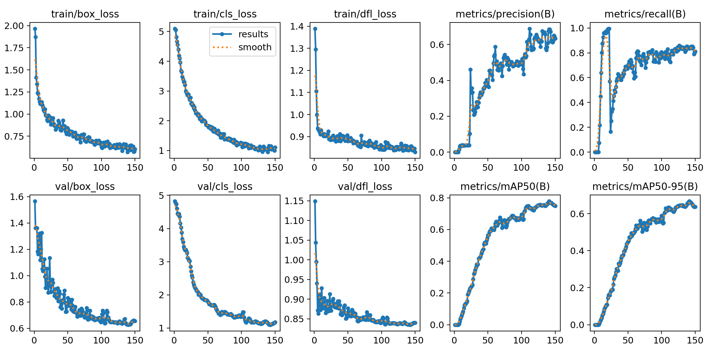

- **Hội tụ:** Các chỉ số Loss (Box Loss, Class Loss, DFL Loss) giảm mạnh trong 30 epoch đầu, sau đó tiếp tục giảm dần đều cho đến epoch 150. Class Loss giảm từ ~5.1 xuống còn ~1.1, cho thấy model học được sự khác biệt giữa 24 class.
- **Overfitting:** Validation Loss bám sát Training Loss xuyên suốt quá trình huấn luyện, không xuất hiện hiện tượng Overfitting.
- **Độ chính xác:** mAP50 tốt nhất đạt **~0.779** và mAP50-95 đạt **~0.667** (tại epoch 141), thấp hơn so với model 8 class (~0.995 mAP50) do số lượng class tăng gấp 3 và số ảnh/class giảm đi (chỉ 5 ảnh/class thay vì 15 ảnh/class).

##### 3.4.2. Chất lượng Phân loại Class (Confusion Matrix)

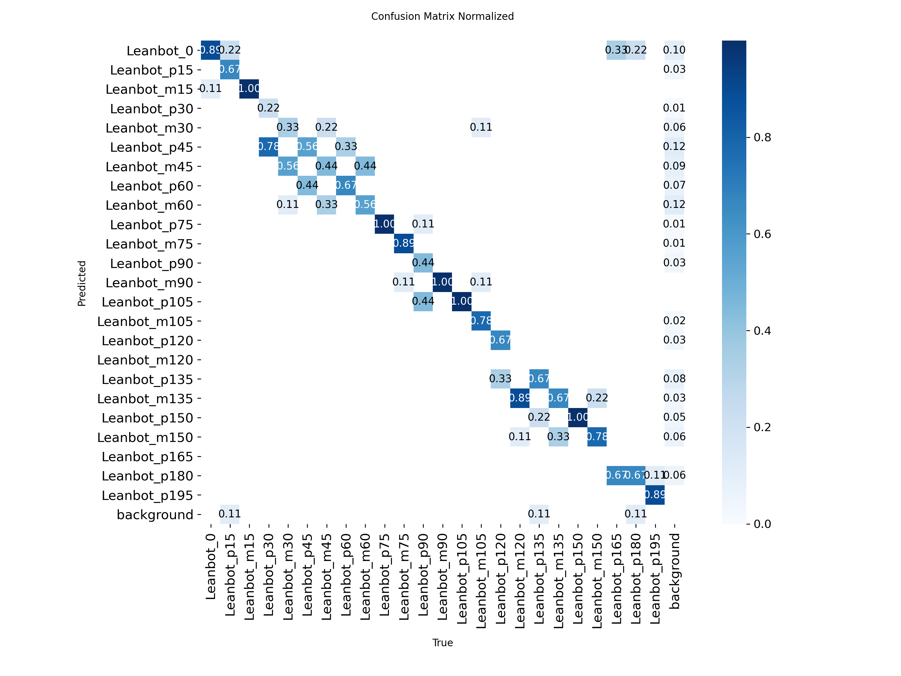
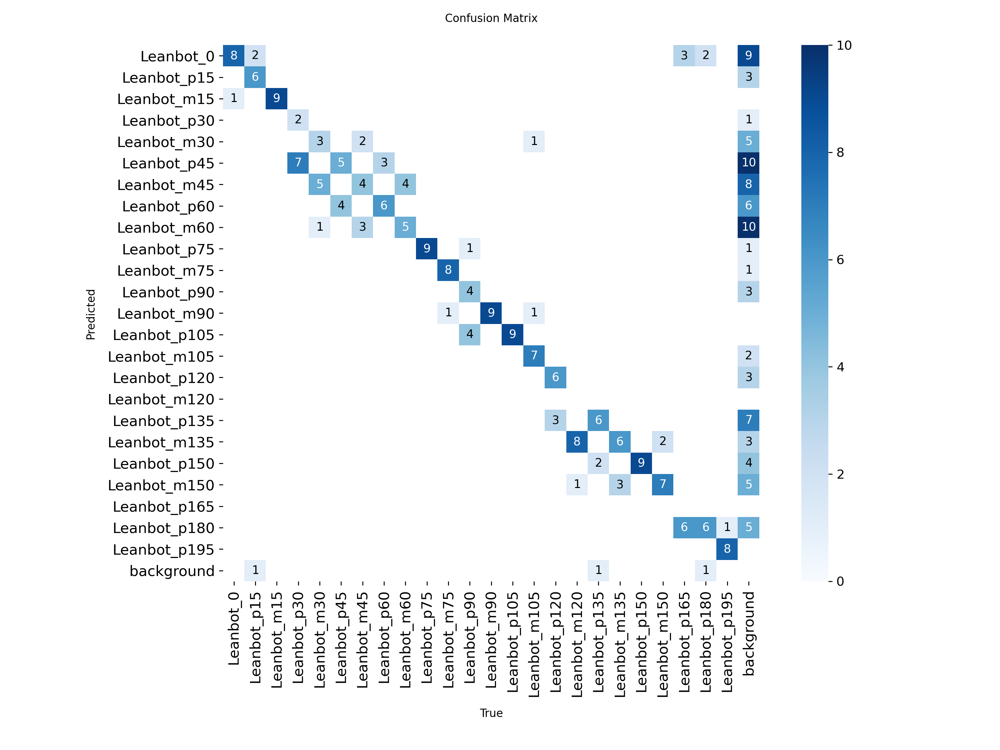

- **Đường chéo chính:** Ma trận nhầm lẫn chuẩn hóa cho thấy đường chéo chính đạt giá trị cao ở phần lớn các class, tuy nhiên xuất hiện một số nhầm lẫn giữa các class liền kề nhau về góc (ví dụ: p15 nhầm với 0 hoặc p30, do góc chênh lệch 15 độ).
- **Nguyên nhân nhầm lẫn:** Khoảng cách góc giữa các class rất nhỏ (15°) và số ảnh train mỗi class chỉ có ~3 ảnh sau khi chia, dẫn đến model khó phân biệt các class liền kề.

##### 3.4.3. Đồ thị Precision, Recall và F1-Score

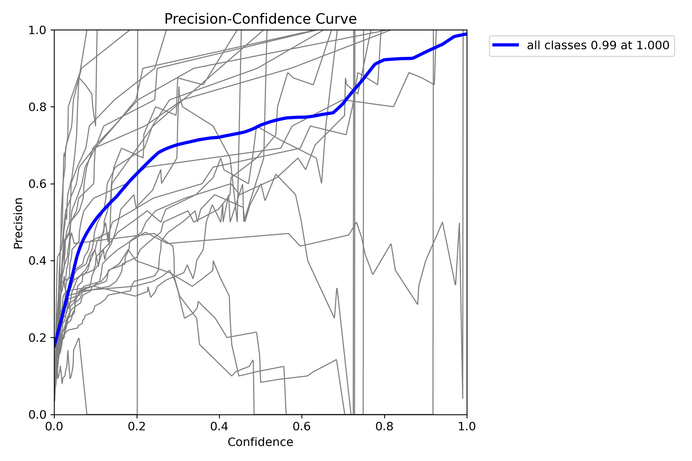
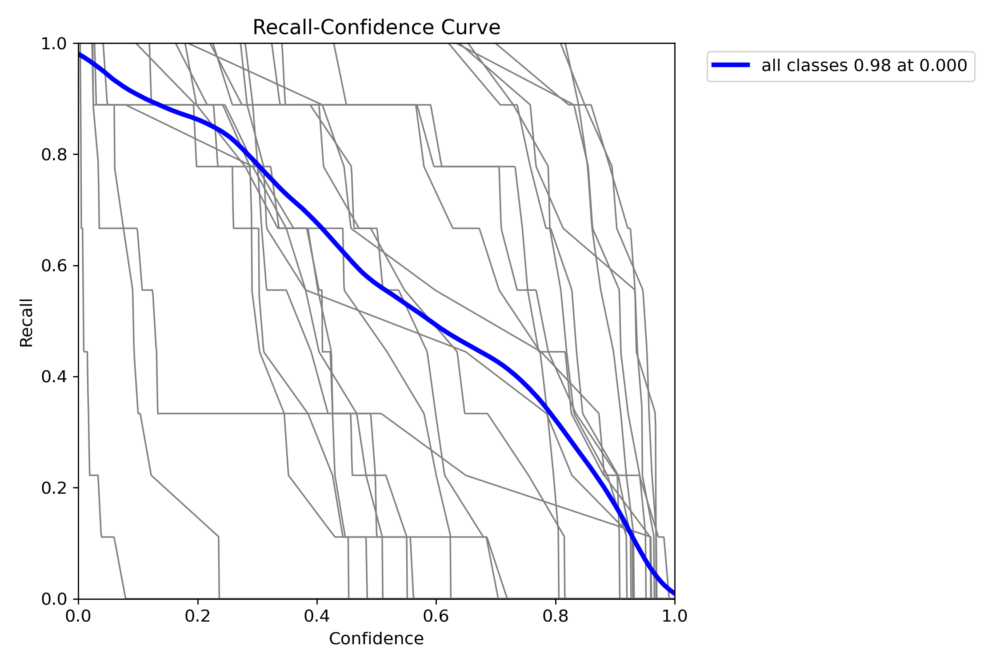
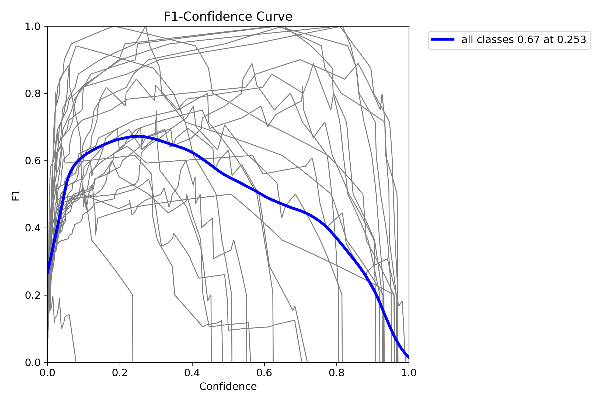
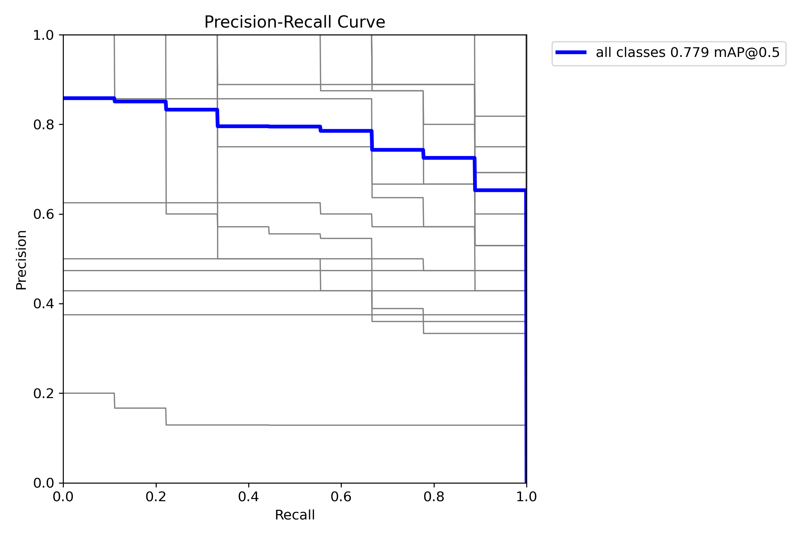

- **Precision & Recall:** Precision đạt ~0.63 và Recall đạt ~0.81 ở epoch cuối. Recall cao hơn Precision cho thấy model có xu hướng phát hiện được hầu hết các đối tượng nhưng đôi khi gán nhầm class.
- **F1-Score:** Điểm F1 tổng thể đạt mức chấp nhận được, tuy nhiên thấp hơn nhiều so với model 8 class (>0.99), phản ánh độ khó khi phân biệt 24 class góc liền kề nhau với tập dữ liệu nhỏ.

##### 3.4.4. Phân tích phân phối nhãn (Labels Distribution)

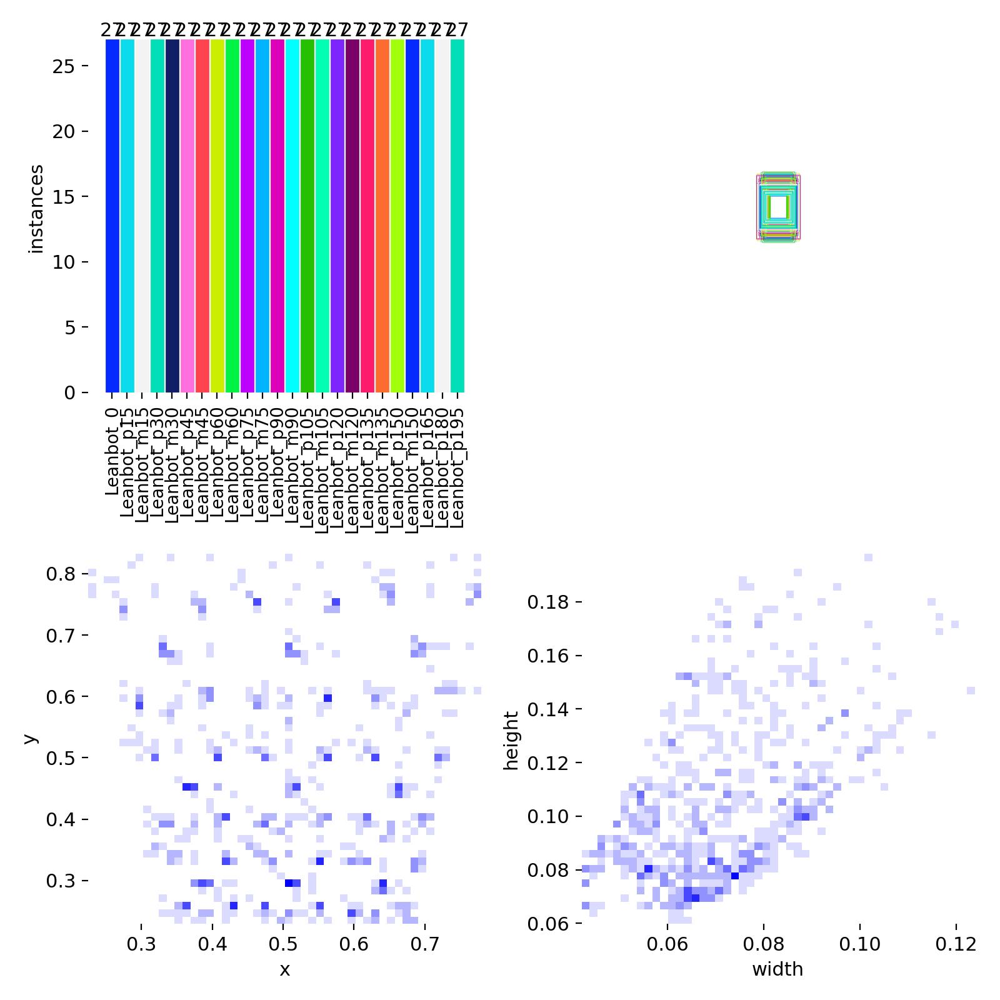

- **Phân phối đều:** Dataset hoàn toàn cân bằng với chính xác 45 BBox cho mỗi trong 24 class, đảm bảo model không bị thiên vị về bất kỳ góc nào.
- **Kích thước BBox:** Kích thước bounding box khá đồng đều và nhỏ gọn (do đã lọc nhiễu với `min_area=6000`), tập trung ở nhiều vị trí trên sa bàn ( các vị trí A, B , C ,... CTRL)

##### 3.4.5. Đánh giá confidence trên 5 ảnh test

> **Lưu ý về cách đọc bảng:** Model 24 class có tổng cộng 24 cột confidence, không thể hiển thị đầy đủ trên bảng. Do đó, mỗi bảng bên dưới **chỉ hiển thị 8 class có giá trị confidence cao nhất** tương ứng với từng đối tượng, các class còn lại đều có giá trị gần 0 và bị lược bỏ. Cột **"Best Class"** luôn phản ánh class có confidence cao nhất trong toàn bộ 24 class.

---

##### `000.jpg` (9 vị trí Leanbot)
| Ảnh BBox | Ảnh Confidence |
| :---: | :---: |
| 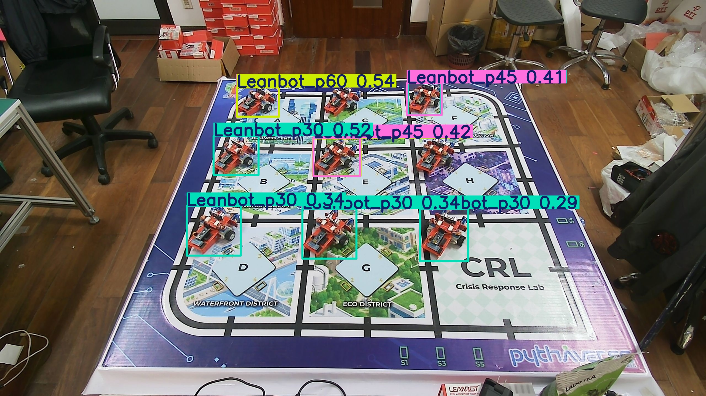 | 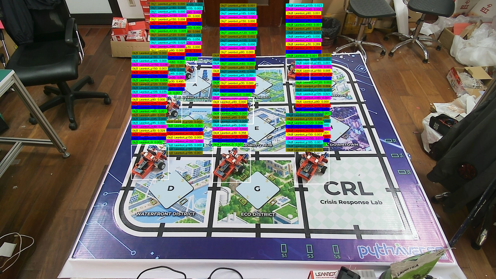 |

| Vị trí | BBox (Xc, Yc, W, H) | p60 | p45 | p30 | p105 | m15 | p150/m150 | p195 | p180 | Best Class | Góc ước lượng |
|---|---|---|---|---|---|---|---|---|---|---|---|
| #1 | (935.5, 371.5, 153, 109) | **0.5655** | 0.0558 | 0.0004 | 0.0001 | 0.0104 | 0.0003 | 0.0014 | 0.0005 | `Leanbot_p60` (0.5655) | 51.4° |
| #2 | (856, 565, 164, 142) | 0.0001 | 0.0000 | **0.4947** | 0.0250 | 0.0002 | 0.0151 | 0.0002 | 0.0001 | `Leanbot_p30` (0.4947) | 31.6° |
| #3 | (1221, 571, 170, 138) | **0.1896** | **0.4224** | 0.0038 | 0.0001 | 0.0047 | 0.0001 | 0.0002 | 0.0004 | `Leanbot_p45` (0.4224) | 50.3° |
| #4 | (1538.5, 360.5, 127, 117) | **0.0604** | **0.4134** | 0.0052 | 0.0001 | 0.0015 | 0.0001 | 0.0002 | 0.0006 | `Leanbot_p45` (0.4134) | 48.7° |
| #5 | (1194, 850.5, 196, 181) | 0.0001 | 0.0000 | **0.3579** | 0.0085 | 0.0002 | 0.0181 | 0.0002 | 0.0003 | `Leanbot_p30` (0.3579) | 32.1° |
| #6 | (774, 837, 192, 178) | 0.0001 | 0.0001 | **0.3288** | 0.0345 | 0.0002 | 0.0363 | 0.0001 | 0.0002 | `Leanbot_p30` (0.3288) | 33.7° |
| #7 | (1610.5, 854, 175, 190) | 0.0021 | 0.0004 | **0.3013** | 0.0209 | 0.0007 | 0.0015 | 0.0013 | 0.0005 | `Leanbot_p30` (0.3013) | 31.5° |
| #8 | (1221.5, 571, 173, 136) | **0.3004** | 0.0512 | 0.0004 | 0.0001 | 0.0160 | 0.0013 | 0.0007 | 0.0002 | `Leanbot_p60` (0.3004) | 52.8° |
| #9 | (1539, 360, 120, 116) | 0.0001 | 0.0001 | **0.2886** | 0.0228 | 0.0004 | 0.0167 | 0.0002 | 0.0001 | `Leanbot_p30` (0.2886) | 32.4° |

---

##### `001.jpg` (9 vị trí Leanbot)
| Ảnh BBox | Ảnh Confidence |
| :---: | :---: |
| 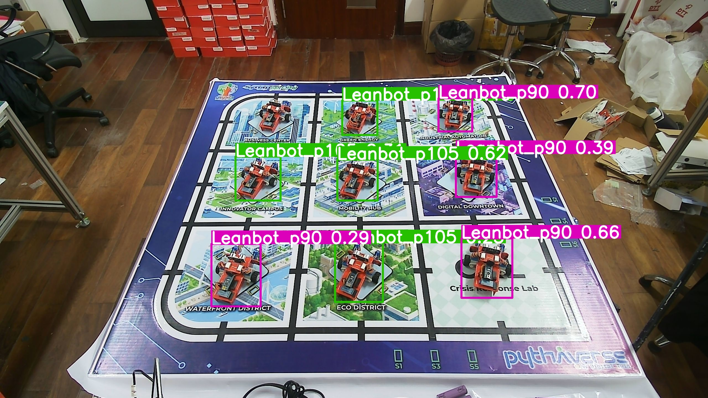 | 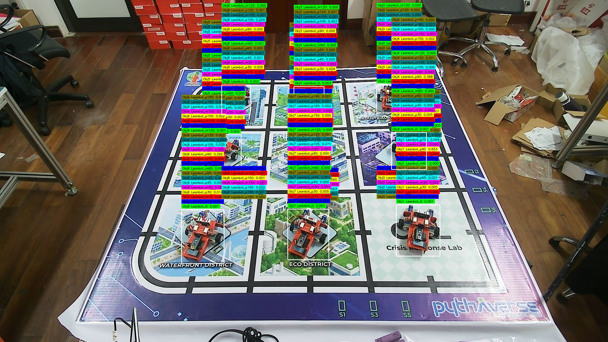 |

| Vị trí | BBox (Xc, Yc, W, H) | p90 | p75 | p105 | p180 | p30 | p45 | p150 | p120 | Best Class | Góc ước lượng |
|---|---|---|---|---|---|---|---|---|---|---|---|
| #1 | (1646.5, 415.5, 121, 119) | **0.7181** | 0.0662 | 0.0099 | 0.0160 | 0.0060 | 0.0004 | 0.0029 | 0.0024 | `Leanbot_p90` (0.7181) | 86.3° |
| #2 | (1760, 970, 184, 216) | **0.6527** | 0.0192 | 0.0037 | 0.0092 | 0.0047 | 0.0008 | 0.0012 | 0.0018 | `Leanbot_p90` (0.6527) | 88.5° |
| #3 | (1292.5, 652, 147, 148) | 0.0000 | 0.0120 | **0.6447** | 0.0047 | 0.0026 | 0.0002 | 0.0002 | 0.0008 | `Leanbot_p105` (0.6447) | 104.3° |
| #4 | (1300.5, 426, 127, 124) | 0.0001 | 0.0099 | **0.4529** | 0.0009 | 0.0045 | 0.0004 | 0.0003 | 0.0005 | `Leanbot_p105` (0.4529) | 104.9° |
| #5 | (1721.5, 635, 147, 156) | **0.3877** | 0.0243 | 0.0063 | 0.0230 | 0.0045 | 0.0004 | 0.0020 | 0.0011 | `Leanbot_p90` (0.3877) | 85.6° |
| #6 | (933, 646.5, 164, 159) | 0.0001 | 0.0092 | **0.3398** | 0.0011 | 0.0023 | 0.0003 | 0.0003 | 0.0006 | `Leanbot_p105` (0.3398) | 105.4° |
| #7 | (853.5, 996, 179, 226) | **0.2916** | 0.0346 | 0.0352 | 0.0080 | 0.0142 | 0.0003 | 0.0023 | 0.0024 | `Leanbot_p90` (0.2916) | 91.9° |
| #8 | (1297.5, 986.5, 173, 213) | 0.0002 | 0.0059 | **0.2715** | 0.0006 | 0.0049 | 0.0003 | 0.0003 | 0.0007 | `Leanbot_p105` (0.2715) | 105.9° |
| #9 | (993, 420, 120, 126) | 0.0002 | 0.0091 | **0.2044** | 0.0005 | 0.0053 | 0.0006 | 0.0009 | 0.0008 | `Leanbot_p105` (0.2044) | 106.1° |

---

##### `002.jpg` (9 vị trí Leanbot)
| Ảnh BBox | Ảnh Confidence |
| :---: | :---: |
| 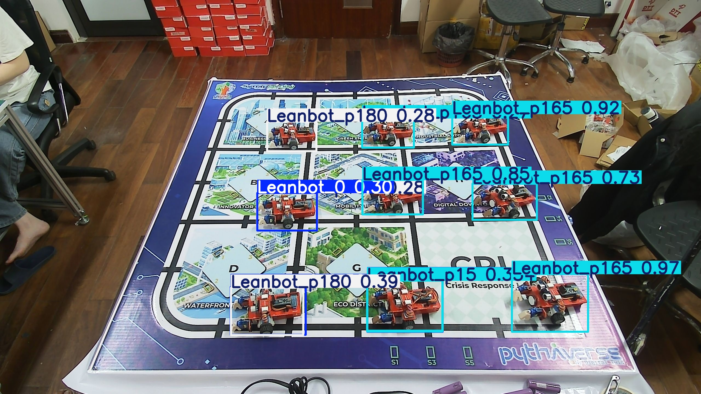 | 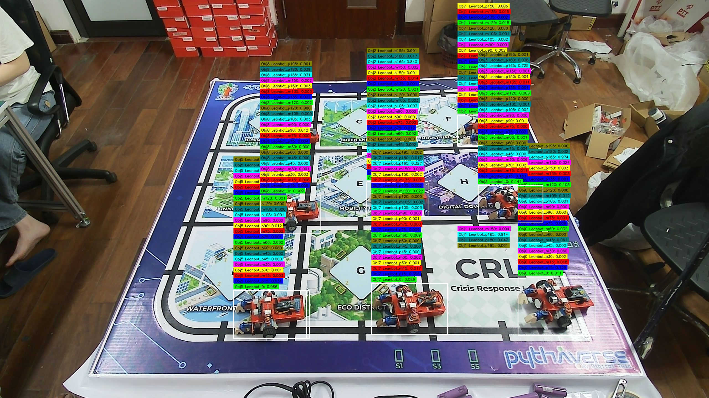 |

| Vị trí | BBox (Xc, Yc, W, H) | p165 | p15 | p180 | m120 | m150 | m30 | m45 | m60 | Best Class | Góc ước lượng |
|---|---|---|---|---|---|---|---|---|---|---|---|
| #1 | (2009, 1107.5, 278, 211) | **0.9739** | 0.1294 | 0.0025 | 0.1033 | 0.0239 | 0.0599 | 0.0611 | 0.0321 | `Leanbot_p165` (0.9739) | 164.7° |
| #2 | (1754, 472.5, 204, 113) | **0.9140** | 0.2079 | 0.0472 | 0.0150 | 0.0036 | 0.0129 | 0.0061 | 0.0011 | `Leanbot_p165` (0.9140) | 161.5° |
| #3 | (1434.5, 720.5, 221, 127) | **0.8395** | 0.1432 | 0.0172 | 0.0208 | 0.0023 | 0.0061 | 0.0021 | 0.0023 | `Leanbot_p165` (0.8395) | 162.3° |
| #4 | (1843, 737, 234, 132) | **0.7248** | 0.1831 | 0.0383 | 0.0056 | 0.0009 | 0.0058 | 0.0041 | 0.0006 | `Leanbot_p165` (0.7248) | 160.7° |
| #5 | (979.5, 1137.5, 273, 175) | 0.0028 | 0.0000 | **0.1239** | 0.0011 | 0.0002 | 0.0026 | 0.0001 | 0.0001 | `Leanbot_0` (0.4087) | 37.1° |
| #6 | (975.5, 1138, 263, 174) | 0.0021 | 0.0313 | **0.3858** | 0.0009 | 0.0006 | 0.0014 | 0.0002 | 0.0001 | `Leanbot_p180` (0.3858) | 176.3° |
| #7 | (1478, 1118, 274, 186) | **0.3586** | 0.0749 | 0.0880 | 0.0209 | 0.0052 | 0.0051 | 0.0050 | 0.0021 | `Leanbot_p165` (0.3586) | 166.4° |
| #8 | (1479, 1116.5, 276, 183) | **0.3271** | **0.3562** | 0.0166 | 0.0216 | 0.0022 | 0.0016 | 0.0003 | 0.0092 | `Leanbot_p15` (0.3562) | 87.8° |
| #9 | (1048.5, 774, 219, 138) | 0.0307 | 0.0561 | **0.0395** | 0.0020 | 0.0017 | 0.0010 | 0.0001 | 0.0004 | `Leanbot_0` (0.3093) | 26.7° |

---

##### `003.jpg` (9 vị trí Leanbot)
| Ảnh BBox | Ảnh Confidence |
| :---: | :---: |
| 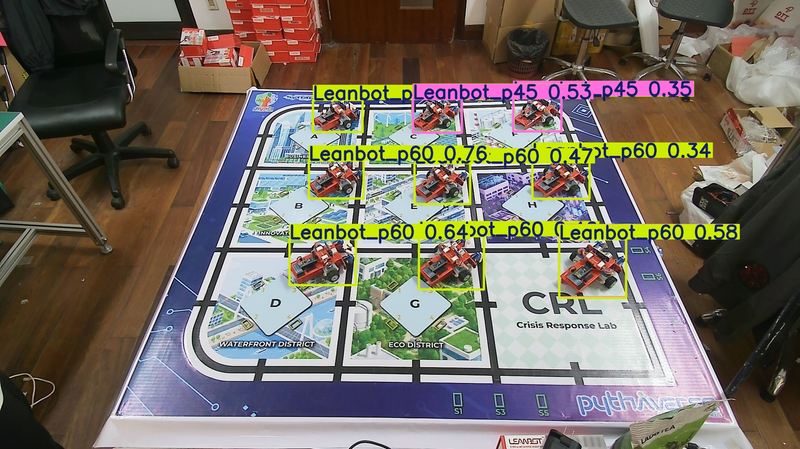 | 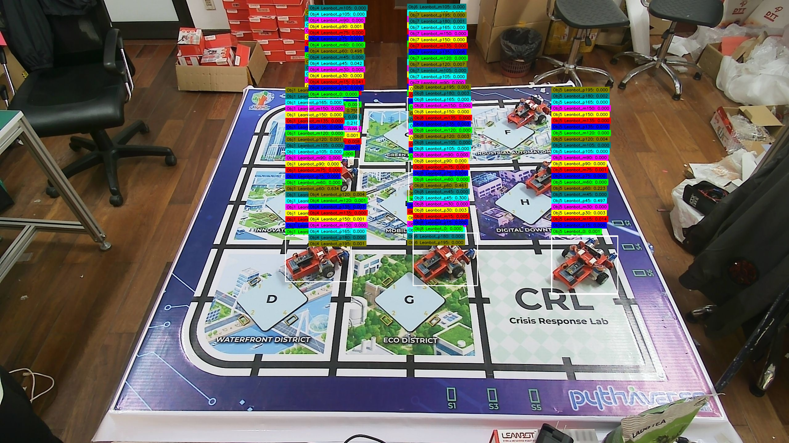 |

| Vị trí | BBox (Xc, Yc, W, H) | p60 | p45 | p30 | m15 | p135 | p120 | p180 | p75 | Best Class | Góc ước lượng |
|---|---|---|---|---|---|---|---|---|---|---|---|
| #1 | (1076.5, 575.5, 175, 123) | **0.7546** | 0.2099 | 0.0008 | 0.0083 | 0.0050 | 0.0021 | 0.0009 | 0.0000 | `Leanbot_p60` (0.7546) | 52.0° |
| #2 | (1032.5, 841, 213, 148) | **0.6343** | 0.1257 | 0.0016 | 0.2212 | 0.0037 | 0.0011 | 0.0009 | 0.0000 | `Leanbot_p60` (0.6343) | 48.4° |
| #3 | (1896.5, 862, 215, 188) | **0.5859** | 0.3605 | 0.0030 | 0.0022 | 0.0042 | 0.0035 | 0.0026 | 0.0000 | `Leanbot_p60` (0.5859) | 50.7° |
| #4 | (1399.5, 371.5, 157, 109) | **0.2771** | **0.5166** | 0.0112 | 0.0006 | 0.0023 | 0.0092 | 0.0009 | 0.0000 | `Leanbot_p45` (0.5166) | 49.0° |
| #5 | (1081, 372.5, 160, 105) | **0.4983** | 0.0424 | 0.0002 | 0.0408 | 0.0067 | 0.0036 | 0.0004 | 0.0000 | `Leanbot_p60` (0.4983) | 50.7° |
| #6 | (1897, 860, 214, 188) | **0.2232** | **0.4972** | 0.0033 | 0.0135 | 0.0097 | 0.0037 | 0.0023 | 0.0000 | `Leanbot_p45` (0.4972) | 47.9° |
| #7 | (1399.5, 370.5, 157, 109) | **0.4687** | 0.0674 | 0.0003 | 0.0197 | 0.0034 | 0.0019 | 0.0002 | 0.0000 | `Leanbot_p60` (0.4687) | 52.0° |
| #8 | (1415.5, 588.5, 179, 131) | **0.4678** | 0.0758 | 0.0007 | 0.0244 | 0.0076 | 0.0065 | 0.0013 | 0.0000 | `Leanbot_p60` (0.4678) | 51.5° |
| #9 | (1444.5, 842.5, 209, 171) | **0.4611** | 0.2999 | 0.0028 | 0.0047 | 0.0030 | 0.0026 | 0.0026 | 0.0000 | `Leanbot_p60` (0.4611) | 50.3° |

---

##### `004.jpg` (9 vị trí Leanbot)
| Ảnh BBox | Ảnh Confidence |
| :---: | :---: |
| 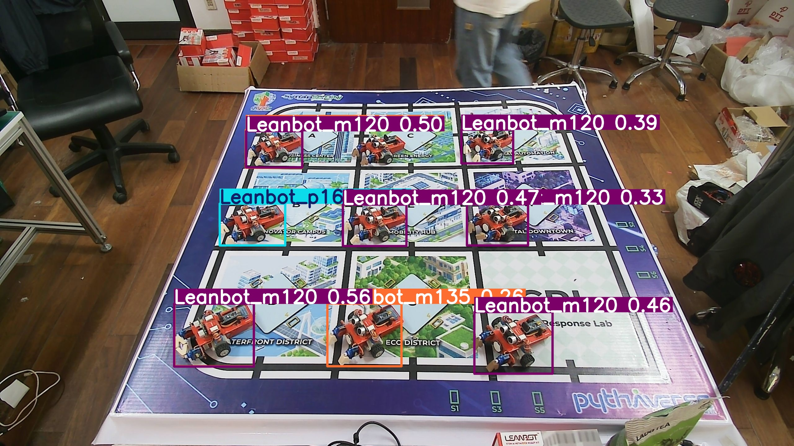 | 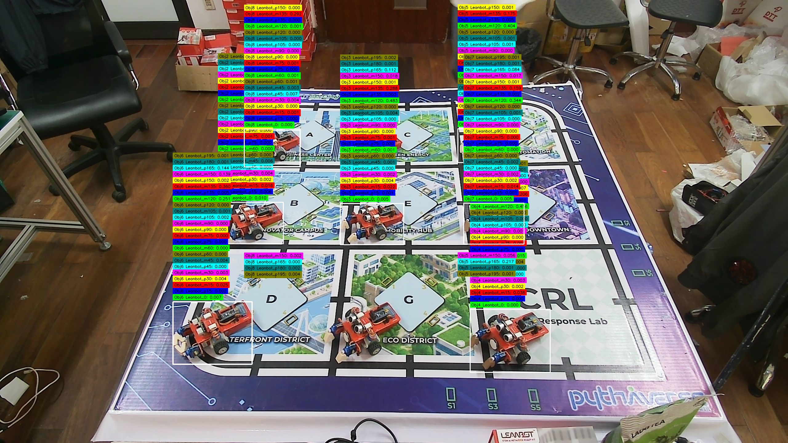 |

| Vị trí | BBox (Xc, Yc, W, H) | m120 | m135 | m150 | p165 | m15 | m30/m45 | p165 | m105 | Best Class | Góc ước lượng |
|---|---|---|---|---|---|---|---|---|---|---|---|
| #1 | (689.5, 1082.5, 257, 203) | **0.5477** | 0.1689 | 0.1388 | 0.0676 | 0.0240 | 0.0008 | 0.0676 | 0.0015 | `Leanbot_m120` (0.5477) | -126.3° |
| #2 | (883.5, 482, 181, 118) | **0.4933** | 0.3315 | 0.0573 | 0.0622 | 0.0272 | 0.0024 | 0.0622 | 0.0047 | `Leanbot_m120` (0.4933) | -128.1° |
| #3 | (814, 724.5, 212, 135) | 0.2175 | 0.0963 | 0.0078 | **0.4926** | 0.0164 | 0.0040 | **0.4926** | 0.0012 | `Leanbot_p165` (0.4926) | 150.7° |
| #4 | (1208, 728, 206, 134) | **0.4827** | 0.2875 | 0.0180 | 0.1115 | 0.0217 | 0.0023 | 0.1115 | 0.0037 | `Leanbot_m120` (0.4827) | -126.6° |
| #5 | (1657, 1107.5, 260, 205) | **0.4563** | 0.2056 | 0.0003 | 0.0001 | 0.0377 | 0.0026 | 0.0001 | 0.0001 | `Leanbot_m120` (0.4563) | -128.5° |
| #6 | (1570.5, 473, 167, 110) | **0.4043** | 0.1755 | 0.0559 | 0.2166 | 0.0193 | 0.0281 | 0.2166 | 0.0009 | `Leanbot_m120` (0.4043) | -131.8° |
| #7 | (690.5, 1081.5, 257, 203) | 0.2515 | **0.3595** | 0.1386 | 0.1444 | 0.0246 | 0.0034 | 0.1444 | 0.0008 | `Leanbot_m135` (0.3595) | -135.6° |
| #8 | (1604, 726.5, 196, 133) | **0.3435** | 0.1590 | 0.0166 | 0.0836 | 0.0139 | 0.0023 | 0.0836 | 0.0012 | `Leanbot_m120` (0.3435) | -127.7° |
| #9 | (884, 480.5, 182, 123) | 0.0008 | **0.2918** | 0.0018 | 0.0000 | 0.0006 | 0.0036 | 0.0000 | 0.0001 | `Leanbot_m135` (0.2918) | -128.4° |


## B. Khó khăn
- Không.
## C. Công việc tiếp theo.
- Tìm hiểu Cross Entropy (CE) và Binary Cross Entropy (BCE) và cách chỉnh sửa trong YOLO.
