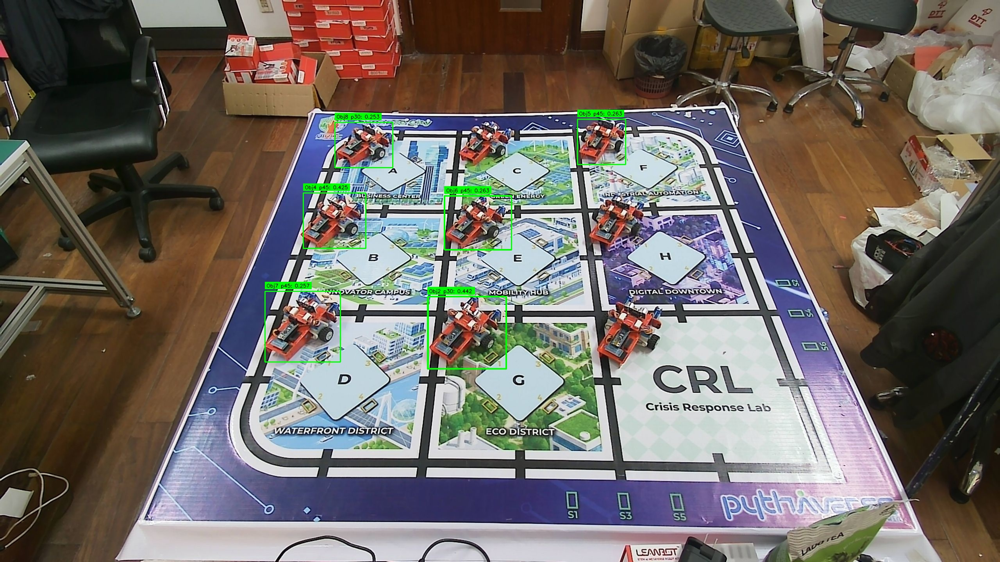
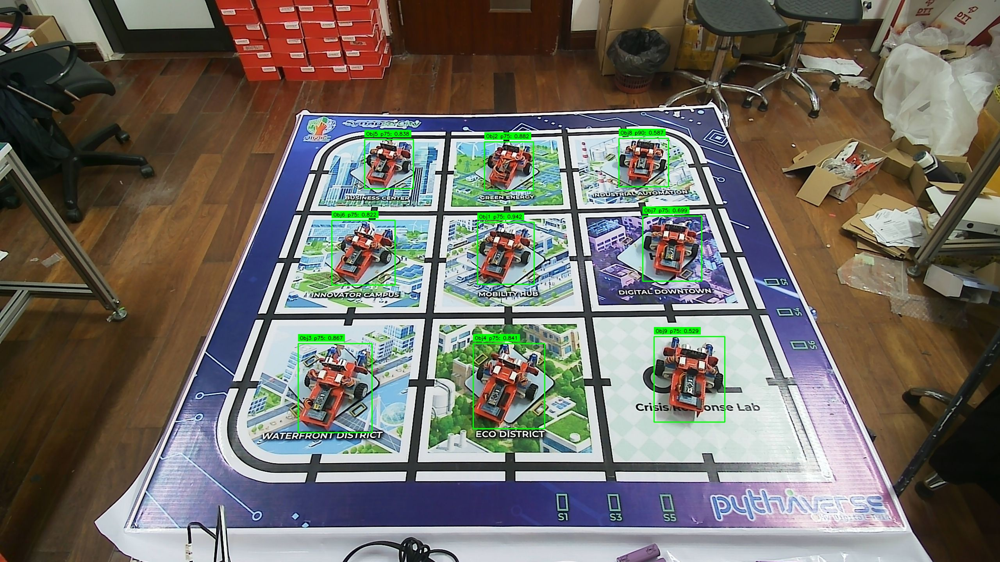
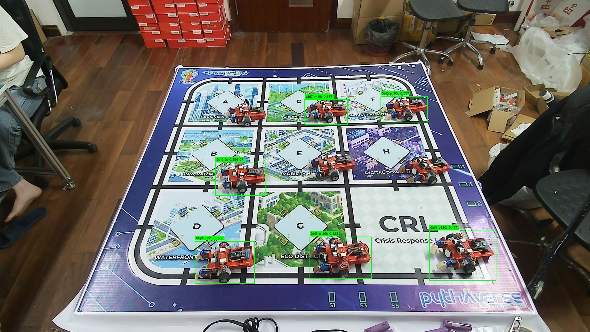

# Báo cáo công việc ngày 21/05/2026

## A. Công việc đã làm
- Tổ chức lại `root_images` và bổ sung ảnh `background` cho mỗi góc.
- Chuẩn hóa lại thứ tự class index để train model 24 góc.
- Xây dựng và cập nhật tool `tools/export_markdown_report.py` để xuất báo cáo Markdown confidence.

### 1. Tổ chức lại `root_images`
- Sau khi bổ sung ảnh `background`, cấu trúc folder ảnh gốc `root_images` đã được sắp xếp lại theo từng góc của Leanbot.
- Các thư mục góc hiện có trong `root_images` gồm:

```text
angle_0
angle_m15
angle_p15
angle_m30
angle_p30
angle_m45
angle_p45
angle_m60
angle_p60
angle_m75
angle_p75
angle_m90
angle_p90
angle_m105
angle_p105
angle_m120
angle_p120
angle_m135
angle_p135
angle_m150
angle_p150
angle_p165
angle_p180
angle_p195
```

- Mỗi thư mục góc hiện có `5` ảnh đúng góc đó và `1` thư mục con `background` chứa `1` ảnh nền `background_000.jpg`.
- Cấu trúc tổng quát:

```text
root_images/
|-- angle_0/
|   |-- angle_0_000.jpg
|   |-- angle_0_001.jpg
|   |-- angle_0_002.jpg
|   |-- angle_0_003.jpg
|   |-- angle_0_004.jpg
|   `-- background/
|       `-- background_000.jpg
|-- angle_m15/
|   |-- angle_m15_000.jpg
|   |-- angle_m15_001.jpg
|   |-- angle_m15_002.jpg
|   |-- angle_m15_003.jpg
|   |-- angle_m15_004.jpg
|   `-- background/
|       `-- background_000.jpg
|-- angle_p15/
|   |-- angle_p15_000.jpg
|   |-- angle_p15_001.jpg
|   |-- angle_p15_002.jpg
|   |-- angle_p15_003.jpg
|   |-- angle_p15_004.jpg
|   `-- background/
|       `-- background_000.jpg
|-- ...
|-- angle_p180/
|   |-- angle_p180_000.jpg
|   |-- angle_p180_001.jpg
|   |-- angle_p180_002.jpg
|   |-- angle_p180_003.jpg
|   |-- angle_p180_004.jpg
|   `-- background/
|       `-- background_000.jpg
`-- angle_p195/
    |-- angle_p195_000.jpg
    |-- angle_p195_001.jpg
    |-- angle_p195_002.jpg
    |-- angle_p195_003.jpg
    |-- angle_p195_004.jpg
    `-- background/
        `-- background_000.jpg
```

- Tổng hiện tại trong `root_images`:
- `24` thư mục góc.
- `120` ảnh góc Leanbot.
- `24` ảnh background.
- `144` ảnh `.jpg`.

### 2. Đánh index lại
- Đã đánh lại `class_index` để train model theo thứ tự góc: `0`, `p15`, `p30`, ..., `p180`, `p195`, `m150`, ..., `m15`.
- Nội dung `data.yaml` dùng trong notebook Colab:

```python
yaml_content = """
path: /content/datasets
train: train/images
val: val/images
test: test/images
nc: 24
names:
  0: Leanbot_0
  1: Leanbot_p15
  2: Leanbot_p30
  3: Leanbot_p45
  4: Leanbot_p60
  5: Leanbot_p75
  6: Leanbot_p90
  7: Leanbot_p105
  8: Leanbot_p120
  9: Leanbot_p135
  10: Leanbot_p150
  11: Leanbot_p165
  12: Leanbot_p180
  13: Leanbot_p195
  14: Leanbot_m150
  15: Leanbot_m135
  16: Leanbot_m120
  17: Leanbot_m105
  18: Leanbot_m90
  19: Leanbot_m75
  20: Leanbot_m60
  21: Leanbot_m45
  22: Leanbot_m30
  23: Leanbot_m15
"""
```

- Ngoài file notebook Colab thì không cần chỉnh sửa thêm.

### 3. Xây dựng tool
- Đã xây dựng tool `tools/export_markdown_report.py` để đọc `1` ảnh hoặc `1` folder ảnh, chạy suy luận bằng model YOLO 8/24 Class và tự động xuất báo cáo Markdown.
- Tham số đầu vào chính của tool gồm:
- `--source`: đường dẫn tới `1` ảnh hoặc `1` folder ảnh.
- `--model`: đường dẫn model `.pt` nếu muốn chỉ định thủ công.
- `--output-dir`: thư mục lưu kết quả.
- `--report-name`: tên file Markdown đầu ra.

- Quy trình hoạt động chính của tool:
- Thu thập toàn bộ ảnh hợp lệ từ `source`.
- Chạy YOLO để phát hiện Leanbot trên từng ảnh.
- Sinh ra `1` ảnh kết quả cho mỗi ảnh đầu vào:
- ảnh `*_bbox.jpg`: ảnh có khung bbox, chỉ vẽ các object được giữ lại sau khi lọc top confidence.
- Bảng Markdown không hiển thị toàn bộ `24` cột class nữa, mà chỉ giữ `8` cột confidence mạnh nhất cho từng ảnh để bảng gọn hơn.
- Lấy score của toàn bộ class cho từng object, sau đó tổng hợp thành bảng Markdown.
- Ước lượng góc Leanbot bằng weighted average trên các class góc có score cao, có xử lý tính chu kỳ góc để tránh sai lệch ở vùng gần `-180/180`.

- Nội dung báo cáo Markdown đầu ra gồm:
- thông tin source và model sử dụng.
- thời gian sinh báo cáo.
- ảnh bbox cho từng ảnh đầu vào.
- bảng chi tiết cho từng object gồm:
- vị trí bbox ở dạng `(Xc, Yc, W, H)`.
- `8` cột confidence mạnh nhất của ảnh tương ứng.
- `Best Class` và `Best Confidence`.
- `Góc ước lượng`.

### 4. Đánh giá tạm thời confidence với 3 ảnh test bằng tool tự động

- Lệnh đã dùng để tạo báo cáo:

```powershell
python tools/export_markdown_report.py `
  --source 24class_test_images `
  --model tools/best.pt `
  --output-dir 24class_test_images_markdown_report_top9_cols8
```


#### 4.1. Công thức tính góc

Các bước tính `Góc ước lượng`:

| Bước | Nội dung |
|---|---|
| 1 | Tách góc từ tên class: `Leanbot_p45 -> 45`, `Leanbot_m15 -> -15`, `Leanbot_0 -> 0` |
| 2 | Bỏ qua các class có `score <= angle_score_threshold`. |
| 3 | Sắp xếp score giảm dần và giữ lại top-`k` class góc theo `angle_top_k`. |
| 4 | Chọn class có score cao nhất làm `anchor`, rồi unwrap các góc còn lại quanh `anchor` để tránh nhảy sai ở biên `-180/180`. |
| 5 | Tính góc cuối cùng theo weighted average. |

Công thức tổng quát:

```math
\hat{\theta} = \frac{\sum_i s_i \cdot \theta_i^{adj}}{\sum_i s_i}
```


Ký hiệu sử dụng:

| Ký hiệu | Ý nghĩa |
|---|---|
| `s_i` | score của class góc thứ `i` sau khi lọc |
| `theta_i` | góc gốc lấy từ tên class thứ `i` |
| `theta_anchor` | góc của class có score cao nhất |
| `theta_i_adj` | góc `theta_i` sau khi unwrap quanh `theta_anchor` |
| `theta_hat` | góc ước lượng cuối cùng |

Quan hệ giữa các biến:

```math
\theta_i^{adj} = \operatorname{unwrap}(\theta_i, \theta_{anchor})
```

```math
\theta_{anchor} = \text{angle of highest-score class}
```

#### 4.2. Đoạn code tính góc trong `export_markdown_report.py`

```python
def parse_angle_from_class_name(class_name: str) -> float | None:
    match = ANGLE_PATTERN.match(class_name)
    if not match:
        return None

    if match.group("plain") is not None:
        return float(match.group("plain"))

    value = float(match.group("value"))
    return value if match.group("sign") == "p" else -value


def unwrap_angle_near_anchor(angle: float, anchor: float) -> float:
    while angle - anchor > 180.0:
        angle -= 360.0
    while angle - anchor < -180.0:
        angle += 360.0
    return angle


def estimate_angle_from_scores(
    class_scores: dict[str, float],
    angle_top_k: int,
    angle_score_threshold: float,
) -> tuple[float | None, list[str]]:
    angle_entries: list[tuple[str, float, float]] = []
    for class_name, score in class_scores.items():
        angle = parse_angle_from_class_name(class_name)
        if angle is None or score <= angle_score_threshold:
            continue
        angle_entries.append((class_name, float(score), angle))

    if not angle_entries:
        return None, []

    angle_entries.sort(key=lambda item: item[1], reverse=True)
    if angle_top_k > 0:
        angle_entries = angle_entries[:angle_top_k]

    anchor = angle_entries[0][2]
    adjusted = []
    for class_name, score, angle in angle_entries:
        adjusted.append((class_name, score, unwrap_angle_near_anchor(angle, anchor)))

    weight_sum = sum(score for _, score, _ in adjusted)
    if weight_sum <= 0:
        return None, []

    angle = sum(score * angle_value for _, score, angle_value in adjusted) / weight_sum
    used_classes = [class_name for class_name, _, _ in adjusted]
    return angle, used_classes
```

#### 4.3. `000.jpg` (`8` vị trí Leanbot)

Ảnh bbox tương ứng:



| Vị trí | BBox (Xc, Yc, W, H) | p45 | p30 | m150 | m120 | p60 | m105 | p75 | m135 | Best Class | Góc ước lượng |
|---|---|---|---|---|---|---|---|---|---|---|---|
| #1 | (1195.5, 851.5, 199, 185) | **0.7235** | **0.3140** | 0.0266 | 0.0613 | 0.0487 | 0.0217 | 0.0000 | 0.0004 | `Leanbot_p45` (0.7235) | 40.5° |
| #2 | (1195, 852.5, 202, 185) | **0.0993** | **0.4423** | 0.0185 | 0.0431 | 0.0048 | 0.0306 | 0.0000 | 0.0005 | `Leanbot_p30` (0.4423) | 32.8° |
| #3 | (1223, 570, 172, 138) | **0.1022** | **0.4422** | 0.0825 | 0.0349 | 0.0050 | 0.0069 | 0.0000 | 0.0002 | `Leanbot_p30` (0.4422) | 32.8° |
| #4 | (856, 565, 160, 142) | **0.4252** | **0.1043** | 0.0355 | 0.0427 | 0.0143 | 0.0076 | 0.0000 | 0.0004 | `Leanbot_p45` (0.4252) | 42.0° |
| #5 | (1539.5, 363, 123, 116) | **0.2635** | 0.0047 | 0.0016 | 0.0012 | **0.0436** | 0.0018 | 0.0297 | 0.0102 | `Leanbot_p45` (0.2635) | 47.1° |
| #6 | (1223.5, 571, 171, 138) | **0.2631** | **0.0635** | 0.0529 | 0.0321 | 0.0177 | 0.0022 | 0.0000 | 0.0002 | `Leanbot_p45` (0.2631) | 42.1° |
| #7 | (774.5, 836.5, 193, 181) | **0.2571** | **0.0370** | 0.0213 | 0.0203 | 0.0181 | 0.0018 | 0.0000 | 0.0001 | `Leanbot_p45` (0.2571) | 43.1° |
| #8 | (931, 371, 148, 116) | **0.1637** | **0.2531** | 0.0621 | 0.0480 | 0.0104 | 0.0128 | 0.0000 | 0.0002 | `Leanbot_p30` (0.2531) | 35.9° |

#### 4.4. `001.jpg` (`9` vị trí Leanbot)

Ảnh bbox tương ứng:



| Vị trí | BBox (Xc, Yc, W, H) | p75 | p90 | p60 | p45 | p15 | m135 | p30 | p105 | Best Class | Góc ước lượng |
|---|---|---|---|---|---|---|---|---|---|---|---|
| #1 | (1294.5, 648.5, 145, 159) | **0.9416** | 0.0643 | **0.2332** | 0.0006 | 0.0004 | 0.0324 | 0.0030 | 0.0000 | `Leanbot_p75` (0.9416) | 72.0° |
| #2 | (1302.5, 425.5, 125, 125) | **0.8820** | 0.0780 | **0.2424** | 0.0824 | 0.0495 | 0.0293 | 0.0363 | 0.0016 | `Leanbot_p75` (0.8820) | 71.8° |
| #3 | (857.5, 994, 189, 228) | **0.8672** | 0.1068 | **0.1501** | 0.0003 | 0.0005 | 0.0090 | 0.0006 | 0.0004 | `Leanbot_p75` (0.8672) | 72.8° |
| #4 | (1302.5, 989, 183, 218) | **0.8409** | 0.0305 | **0.1481** | 0.0001 | 0.0003 | 0.0136 | 0.0010 | 0.0002 | `Leanbot_p75` (0.8409) | 72.8° |
| #5 | (995.5, 420, 125, 126) | **0.8382** | 0.1921 | **0.4206** | 0.1637 | 0.0258 | 0.0364 | 0.0114 | 0.0021 | `Leanbot_p75` (0.8382) | 70.0° |
| #6 | (930, 647, 162, 166) | **0.8216** | 0.0190 | **0.2291** | 0.0002 | 0.0006 | 0.0056 | 0.0051 | 0.0001 | `Leanbot_p75` (0.8216) | 71.7° |
| #7 | (1720.5, 636.5, 151, 167) | **0.6994** | **0.1671** | 0.0399 | 0.0011 | 0.0008 | 0.0060 | 0.0010 | 0.0361 | `Leanbot_p75` (0.6994) | 77.9° |
| #8 | (1647.5, 416, 127, 124) | **0.1631** | **0.5869** | 0.0209 | 0.0002 | 0.0005 | 0.0063 | 0.0026 | 0.0005 | `Leanbot_p90` (0.5869) | 86.7° |
| #9 | (1764.5, 971.5, 181, 219) | **0.5291** | **0.4974** | 0.0286 | 0.0003 | 0.0004 | 0.0092 | 0.0002 | 0.0019 | `Leanbot_p75` (0.5291) | 82.3° |

#### 4.5. `002.jpg` (`9` vị trí Leanbot)

Ảnh bbox tương ứng:



| Vị trí | BBox (Xc, Yc, W, H) | p195 | p180 | m15 | 0 | m150 | p165 | p15 | m105 | Best Class | Góc ước lượng |
|---|---|---|---|---|---|---|---|---|---|---|---|
| #1 | (1043.5, 777, 221, 142) | **0.6074** | 0.0014 | 0.0139 | **0.3406** | 0.0004 | 0.0095 | 0.0171 | 0.0066 | `Leanbot_p195` (0.6074) | 254.3° |
| #2 | (1415.5, 485.5, 185, 105) | **0.5686** | 0.0099 | **0.1264** | 0.0000 | 0.0013 | 0.0002 | 0.0000 | 0.0012 | `Leanbot_p195` (0.5686) | 222.3° |
| #3 | (1753.5, 474, 203, 110) | **0.5568** | 0.0917 | **0.3063** | 0.0000 | 0.0017 | 0.0010 | 0.0001 | 0.0017 | `Leanbot_p195` (0.5568) | 248.2° |
| #4 | (2007, 1108, 290, 214) | 0.0059 | **0.4769** | **0.0697** | 0.0001 | 0.0381 | 0.0000 | 0.0000 | 0.0003 | `Leanbot_p180` (0.4769) | 201.0° |
| #5 | (1415.5, 485, 187, 108) | 0.0342 | **0.4745** | **0.2586** | 0.0000 | 0.0056 | 0.0248 | 0.0001 | 0.0018 | `Leanbot_p180` (0.4745) | 238.2° |
| #6 | (1478, 1117, 268, 180) | **0.4225** | 0.0007 | 0.0034 | **0.0758** | 0.0003 | 0.0141 | 0.0037 | 0.0024 | `Leanbot_p195` (0.4225) | 220.1° |
| #7 | (1415.5, 485.5, 185, 105) | **0.0480** | 0.0362 | **0.3868** | 0.0000 | 0.0002 | 0.0011 | 0.0000 | 0.0010 | `Leanbot_m15` (0.3868) | -31.5° |
| #8 | (974.5, 1138.5, 257, 183) | **0.3859** | 0.0009 | 0.0103 | **0.1653** | 0.0003 | 0.0077 | 0.0057 | 0.0146 | `Leanbot_p195` (0.3859) | 244.5° |
| #9 | (1044, 776, 218, 140) | **0.1287** | 0.0002 | 0.0138 | **0.3559** | 0.0001 | 0.0023 | 0.0063 | 0.0016 | `Leanbot_0` (0.3559) | -43.8° |

## B. Khó khăn
- Không

## C. Công việc tiếp theo
- Tạo tool detect Leanbot -> cắt bbox theo 4 mức mở rộng pixel (`0`, `1`, `2`, `3`) -> đưa lại vào model -> sau đó đánh giá lại confidence.
