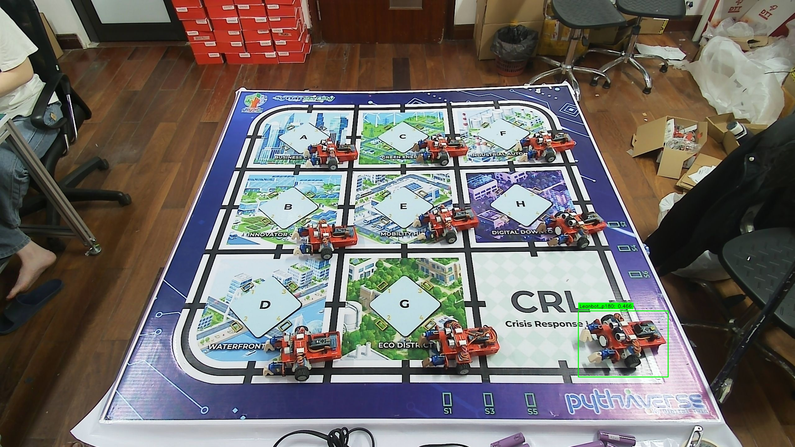
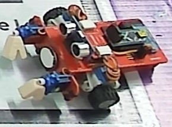
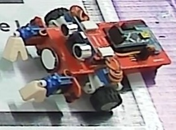
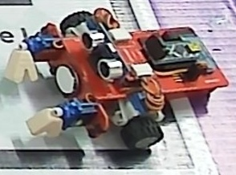
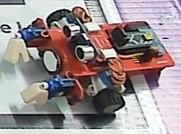
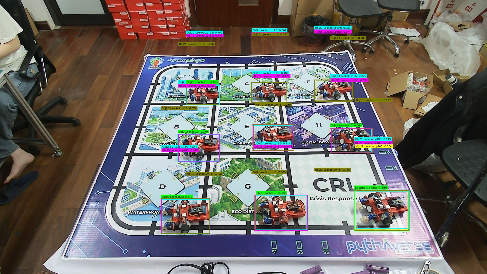
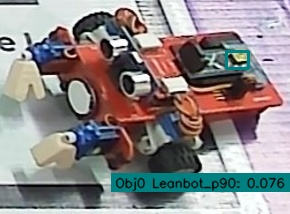
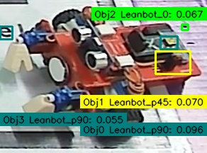
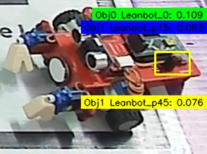
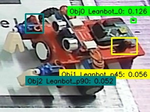

# Báo cáo công việc ngày 22/05/2026

## A. Công việc đã làm
- Tạo tool detect Leanbot, crop BBox theo 4 mức mở rộng pixel `0, 1, 2, 3`.
- Đánh giá confidence ảnh đã crop theo 4 mức mở rộng pixel 
### 1. Tạo tools detect và crop BBox
- File code chính: [tools/detect_crop_levels.py](/d:/PTIT/DTT/Nguyen_Huu_Hoang_Anh/260522/tools/detect_crop_levels.py)
- Link git:
  `https://git.pythaverse.space/git/thomha/Nguyen_Huu_Hoang_Anh/src/branch/master/260522/tools/detect_crop_levels.py`
- Mục đích:
  Tool đọc ảnh từ folder `--input`, detect Leanbot, vẽ ảnh bbox tổng, sau đó tách từng object detect được và crop theo 4 mức mở rộng bbox `0, 1, 2, 3` pixel.

- Lệnh chạy mẫu:

```powershell
python tools/detect_crop_levels.py `
  --input 24class_test_images `
  --output detect_crop_output `
  --conf 0.2
```

- Input:
  `--input` có thể là 1 file ảnh hoặc 1 folder ảnh.
  Tool sử dụng model `.pt` trong `tools/` nếu không truyền `--model`.

- Output:
  Thư mục `--output` sẽ được tạo với 2 nhóm kết quả chính:
  - `bbox_images/`: ảnh full đã vẽ bbox.
  - `objects/<class_name>_<index>/`: mỗi object 1 folder riêng.
  Trong mỗi folder object có:
  - `object_bbox.jpg`
  - `expand_0.jpg`
  - `expand_1.jpg`
  - `expand_2.jpg`
  - `expand_3.jpg`
  - `meta.txt`

- Ví dụ thực tế:
  Mẫu dưới đây được lấy từ folder `detect_crop_output/objects/Leanbot_p180_001`.

Ảnh bbox:



Bảng so sánh 4 mức crop:

| `0` pixel | `1` pixel |
| --- | --- |
|  |  |

| `2` pixel | `3` pixel |
| --- | --- |
|  |  |

- Nhận xét:
  Với ảnh độ phân giải 2K, 4 mức mở rộng pixel `0, 1, 2, 3` gần như không khác nhau nhiều.
  Ví dụ object `Leanbot_p180_001` có kích thước crop:
  - `expand_0`: `290 x 214`
  - `expand_1`: `292 x 216`
  - `expand_2`: `294 x 218`
  - `expand_3`: `296 x 220`
  Chênh lệch mỗi mức chỉ tăng thêm rất ít pixel, nên nhìn bằng mắt thường thay đổi không đáng kể.

### 2. Đánh giá thử 1 ảnh crop (object `Leanbot_p180_001`)

Sau khi crop các mức mở rộng `0, 1, 2, 3` từ ảnh `002.jpg`, chúng ta đưa 4 ảnh crop này chạy lại qua model `best.pt` bằng công cụ `export_markdown_report.py` (với `--conf 0.01` để lấy được hết các confidence) và `check_confidence.py`.

**Hình ảnh nhận diện trên các mức crop:**

Ảnh toàn cảnh (debug object bbox):


| `0` pixel | `1` pixel |
| --- | --- |
|  |  |

| `2` pixel | `3` pixel |
| --- | --- |
|  |  |

**Bảng số liệu Confidence chi tiết:**

##### `expand_0.jpg` (9 vi tri Leanbot)
| Vị trí | BBox (Xc, Yc, W, H) | p90 | m15 | 0 | p45 | p135 | p15 | m60 | p180 | Best Class | Góc ước lượng |
|---|---|---|---|---|---|---|---|---|---|---|---|
| #1 | (237, 59.5, 22, 17) | **0.0764** | 0.0029 | 0.0082 | 0.0006 | 0.0024 | 0.0019 | 0.0017 | 0.0050 | `Leanbot_p90` (0.0764) | 92.0° |
| #2 | (237.5, 59.5, 23, 15) | 0.0001 | **0.0437** | 0.0001 | 0.0002 | 0.0001 | 0.0000 | 0.0003 | **0.0094** | `Leanbot_m15` (0.0437) | -44.1° |
| #3 | (259.5, 37, 9, 8) | 0.0003 | 0.0024 | **0.0434** | 0.0044 | 0.0006 | 0.0043 | 0.0023 | 0.0002 | `Leanbot_0` (0.0434) | -36.6° |
| #4 | (8, 45, 16, 18) | **0.0426** | 0.0140 | 0.0076 | 0.0037 | 0.0025 | 0.0011 | 0.0011 | **0.0157** | `Leanbot_p90` (0.0426) | 114.3° |
| #5 | (242, 86.5, 50, 33) | 0.0000 | 0.0004 | 0.0091 | **0.0343** | 0.0003 | **0.0236** | 0.0023 | 0.0005 | `Leanbot_p45` (0.0343) | 32.8° |
| #6 | (131, 22, 38, 30) | 0.0094 | 0.0038 | 0.0031 | 0.0098 | **0.0328** | 0.0003 | 0.0038 | 0.0068 | `Leanbot_p135` (0.0328) | 126.8° |
| #7 | (242, 86.5, 50, 33) | 0.0000 | 0.0015 | 0.0149 | **0.0262** | 0.0003 | **0.0263** | 0.0014 | 0.0008 | `Leanbot_p15` (0.0263) | 30.0° |
| #8 | (61.5, 36.5, 27, 25) | **0.0213** | 0.0042 | 0.0011 | 0.0044 | 0.0034 | 0.0002 | 0.0026 | 0.0019 | `Leanbot_p90` (0.0213) | 43.4° |
| #9 | (246.5, 73, 43, 44) | 0.0003 | 0.0002 | 0.0030 | 0.0005 | 0.0002 | 0.0004 | **0.0206** | 0.0000 | `Leanbot_m60` (0.0206) | -65.5° |

##### `expand_1.jpg` (9 vi tri Leanbot)
| Vị trí | BBox (Xc, Yc, W, H) | p90 | p45 | 0 | p15 | m15 | p30 | p135 | p195 | Best Class | Góc ước lượng |
|---|---|---|---|---|---|---|---|---|---|---|---|
| #1 | (238, 60, 24, 18) | **0.0958** | 0.0006 | **0.0146** | 0.0022 | 0.0040 | 0.0025 | 0.0029 | 0.0144 | `Leanbot_p90` (0.0958) | 78.1° |
| #2 | (243.5, 88, 49, 32) | 0.0000 | **0.0695** | 0.0090 | **0.0493** | 0.0002 | 0.0006 | 0.0005 | 0.0146 | `Leanbot_p45` (0.0695) | 32.5° |
| #3 | (260.5, 38, 9, 8) | 0.0004 | 0.0061 | **0.0671** | 0.0066 | 0.0030 | 0.0053 | 0.0008 | **0.0183** | `Leanbot_0` (0.0671) | -35.3° |
| #4 | (8.5, 46, 17, 18) | **0.0549** | 0.0037 | 0.0088 | 0.0012 | 0.0146 | 0.0022 | 0.0029 | 0.0170 | `Leanbot_p90` (0.0549) | 112.3° |
| #5 | (239, 59.5, 24, 17) | 0.0001 | 0.0001 | 0.0000 | 0.0000 | **0.0450** | 0.0001 | 0.0002 | 0.0003 | `Leanbot_m15` (0.0450) | -48.7° |
| #6 | (242.5, 88, 51, 34) | 0.0000 | 0.0219 | 0.0155 | **0.0271** | 0.0020 | **0.0369** | 0.0001 | 0.0073 | `Leanbot_p30` (0.0369) | 23.6° |
| #7 | (243.5, 88, 49, 32) | 0.0001 | 0.0129 | 0.0052 | **0.0306** | 0.0007 | **0.0135** | 0.0008 | 0.0053 | `Leanbot_p15` (0.0306) | 19.6° |
| #8 | (132, 23, 38, 30) | 0.0073 | **0.0122** | 0.0028 | 0.0003 | 0.0030 | 0.0047 | **0.0304** | 0.0020 | `Leanbot_p135` (0.0304) | 109.2° |
| #9 | (193, 175, 26, 20) | 0.0011 | **0.0279** | 0.0014 | 0.0001 | 0.0018 | **0.0127** | 0.0094 | 0.0009 | `Leanbot_p45` (0.0279) | 40.3° |

##### `expand_2.jpg` (9 vi tri Leanbot)
| Vị trí | BBox (Xc, Yc, W, H) | 0 | p45 | p15 | p90 | p165 | p30 | m45 | p180 | Best Class | Góc ước lượng |
|---|---|---|---|---|---|---|---|---|---|---|---|
| #1 | (262, 39, 10, 8) | **0.1089** | 0.0097 | 0.0116 | 0.0005 | 0.0104 | 0.0079 | 0.0109 | 0.0004 | `Leanbot_0` (0.1089) | -33.0° |
| #2 | (244.5, 89, 49, 32) | 0.0180 | **0.0761** | **0.0634** | 0.0000 | 0.0010 | 0.0148 | 0.0048 | 0.0007 | `Leanbot_p45` (0.0761) | 31.4° |
| #3 | (239.5, 60.5, 23, 19) | **0.0176** | 0.0009 | 0.0020 | **0.0481** | 0.0002 | 0.0040 | 0.0003 | 0.0091 | `Leanbot_p90` (0.0481) | 65.8° |
| #4 | (246, 88.5, 46, 29) | 0.0011 | 0.0077 | **0.0227** | 0.0001 | **0.0414** | 0.0004 | 0.0085 | 0.0003 | `Leanbot_p165` (0.0414) | 111.9° |
| #5 | (243.5, 89.5, 51, 33) | 0.0191 | 0.0222 | **0.0304** | 0.0000 | 0.0005 | **0.0403** | 0.0003 | 0.0009 | `Leanbot_p30` (0.0403) | 23.6° |
| #6 | (244.5, 89, 49, 32) | 0.0045 | **0.0158** | **0.0372** | 0.0001 | 0.0088 | 0.0146 | 0.0126 | 0.0005 | `Leanbot_p15` (0.0372) | 23.9° |
| #7 | (9, 47, 18, 18) | 0.0129 | 0.0049 | 0.0012 | **0.0351** | 0.0001 | 0.0036 | 0.0006 | **0.0293** | `Leanbot_p90` (0.0351) | 130.9° |
| #8 | (66.5, 45, 35, 38) | 0.0016 | 0.0024 | 0.0021 | 0.0004 | 0.0008 | 0.0003 | **0.0342** | 0.0001 | `Leanbot_m45` (0.0342) | -50.8° |
| #9 | (66.5, 45, 35, 38) | 0.0013 | 0.0021 | 0.0005 | **0.0341** | 0.0006 | 0.0009 | 0.0003 | 0.0015 | `Leanbot_p90` (0.0341) | 41.0° |

##### `expand_3.jpg` (9 vi tri Leanbot)
| Vị trí | BBox (Xc, Yc, W, H) | 0 | p45 | p90 | p15 | p135 | m45 | p30 | p195 | Best Class | Góc ước lượng |
|---|---|---|---|---|---|---|---|---|---|---|---|
| #1 | (263, 40, 10, 8) | **0.1264** | 0.0079 | 0.0005 | 0.0097 | 0.0008 | 0.0087 | 0.0078 | **0.0234** | `Leanbot_0` (0.1264) | -25.8° |
| #2 | (245, 90, 50, 32) | 0.0158 | **0.0561** | 0.0000 | **0.0471** | 0.0006 | 0.0069 | 0.0061 | 0.0077 | `Leanbot_p45` (0.0561) | 31.3° |
| #3 | (67.5, 45.5, 35, 37) | 0.0021 | 0.0017 | **0.0516** | 0.0006 | 0.0057 | 0.0003 | 0.0010 | 0.0030 | `Leanbot_p90` (0.0516) | 36.8° |
| #4 | (240, 61.5, 22, 19) | 0.0100 | 0.0008 | **0.0430** | 0.0016 | 0.0022 | 0.0003 | 0.0032 | 0.0126 | `Leanbot_p90` (0.0430) | 31.9° |
| #5 | (133.5, 25.5, 39, 31) | 0.0028 | **0.0221** | 0.0027 | 0.0003 | **0.0301** | 0.0009 | 0.0079 | 0.0035 | `Leanbot_p135` (0.0301) | 96.9° |
| #6 | (67.5, 46, 35, 38) | 0.0012 | 0.0009 | 0.0008 | 0.0011 | 0.0004 | **0.0292** | 0.0003 | 0.0017 | `Leanbot_m45` (0.0292) | -50.9° |
| #7 | (243.5, 90, 53, 34) | 0.0161 | **0.0262** | 0.0000 | **0.0284** | 0.0002 | 0.0003 | 0.0240 | 0.0076 | `Leanbot_p15` (0.0284) | 29.4° |
| #8 | (193, 180, 28, 26) | 0.0008 | **0.0262** | 0.0004 | 0.0001 | 0.0039 | 0.0007 | **0.0095** | 0.0007 | `Leanbot_p45` (0.0262) | 41.0° |
| #9 | (240.5, 62, 23, 18) | 0.0000 | 0.0004 | 0.0001 | 0.0000 | 0.0002 | 0.0000 | 0.0001 | 0.0009 | `Leanbot_m15` (0.0232) | -50.8° |

**Kết luận về sự kém hiệu quả khi dùng lại model Detection trên ảnh crop:**
Mặc dù vật thể ban đầu trong ảnh toàn cảnh được detect chuẩn xác là `Leanbot_p180` với độ tin cậy `0.46` (file `meta.txt`), nhưng khi **chỉ đưa riêng ảnh crop** vào model YOLO Detection (`best.pt`), kết quả trở nên rất tệ:
1. **Độ tin cậy (Confidence) sụt giảm:** Giảm mạnh xuống chỉ còn ~0.1.
2. **Dự đoán sai class:** Nhầm lẫn hoàn toàn từ `p180` thành `p90` hoặc `0`.
3. **Mất ổn định:** Dự đoán thay đổi qua lại chỉ với 1-2 pixel mở rộng lề.
4. **Lý do một ảnh crop của Leanbot nhưng bảng lại báo cáo có 9 Leanbot được detect :** vì khi hạ ngưỡng confidence xuống thấp (`0.01`), model bị loạn và coi mọi đốm nhiễu, chi tiết cạnh viền đều là Leanbot. Tool `export_markdown` có cơ chế lọc lấy mặc định 9 object có điểm cao nhất để đưa vào bảng. Do đó toàn bộ 9 vị trí này thực chất đều là những dự đoán sai, phải đọc các giá trị confidence mới đánh giá chính xác được .

**Bản chất lý do kém hiệu quả sau khi crop mà detect lại:** 

Model YOLO Object Detection được huấn luyện để nhìn các vật thể bé trong một bối cảnh (context) rộng lớn. Khi ta đưa một ảnh đã cắt (crop) vào, ảnh sẽ bị thuật toán tự động phóng to, kéo dãn cho vừa với kích thước đầu vào (`640x640`). Điều này làm:
- Sai lệch hoàn toàn tỷ lệ kích thước tương đối của con robot so với khung hình.
- Làm mất đi bối cảnh không gian xung quanh.


## B. Khó khăn
- Không

## C. Công việc tiếp theo
- Vì hiện tại phương án crop Leanbot detect được rồi phân tích ảnh Crop -> đánh giá confidence bằng model đang khôgn hiệu quả vì không thể detect được Leanbot. 
- Em xin phép nhận hướng đi khác từ Thầy ạ . 
