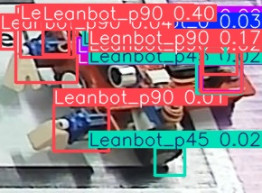

# Báo cáo công việc ngày 25/05/2026

## A. Công việc đã làm

### 1. Tìm hiểu phương pháp Vector Sum để ước lượng góc Leanbot

#### 1.1. Phương pháp tính trung bình trọng số đang sử dụng

Code hiện tại trong [export_markdown_report.py](tools/export_markdown_report.py) (hàm `estimate_angle_from_scores`, dòng 215-245) đang dùng **weighted average thông thường** để ước lượng góc:

```
θ_weighted = Σ(wᵢ × θᵢ) / Σ(wᵢ)
```

Trong đó:
- `θᵢ` là góc của class Leanbot (ví dụ: `Leanbot_p45` → 45°, `Leanbot_m30` → -30°)
- `wᵢ` là confidence score tương ứng

#### 1.2. Phương pháp Vector Sum 

**Vector Sum** : tính trung bình có trọng số trên **dữ liệu vòng tròn** (circular data), tránh lỗi khi góc nằm gần vùng chuyển tiếp 0°/360°.

**Ý tưởng:** Thay vì cộng trực tiếp các góc (số trên đường thẳng), chuyển mỗi góc thành **vector trên vòng tròn đơn vị**, cộng các vector lại, rồi tìm góc của vector tổng.

**Các bước thực hiện:**

**Bước 1 — Chuyển mỗi góc thành vector 2D:**

Mỗi góc `θᵢ` với trọng số `wᵢ` (= confidence score) được chuyển thành tọa độ `(x, y)`:

```
xᵢ = wᵢ × cos(θᵢ)
yᵢ = wᵢ × sin(θᵢ)
```

**Bước 2 — Cộng tất cả vector:**

```
Σx = Σ(wᵢ × cos(θᵢ))
Σy = Σ(wᵢ × sin(θᵢ))
```

**Bước 3 — Tìm góc kết quả bằng `atan2`:**

```
θ_weighted = atan2(Σy / Σw, Σx / Σw)
```

(`atan2` tự động xử lý đúng góc phần tư, trả về kết quả trong khoảng `-180°` đến `180°`)


#### 1.3. Code Python triển khai thực tế

File code: [export_markdown_report.py](tools/export_markdown_report.py), hàm `estimate_angle_from_scores()`

```python
def estimate_angle_from_scores(
    class_scores: dict[str, float],
    angle_top_k: int,
    angle_score_threshold: float,
) -> tuple[float | None, list[str]]:
    angle_entries: list[tuple[str, float, float]] = []
    
    # 1. Lọc các class thỏa mãn điều kiện threshold
    for class_name, score in class_scores.items():
        angle = parse_angle_from_class_name(class_name)
        if angle is None or score <= angle_score_threshold:
            continue
        angle_entries.append((class_name, float(score), angle))

    if not angle_entries:
        return None, []

    # 2. (Tuỳ chọn) Chỉ lấy top-k class có score cao nhất để giảm nhiễu
    angle_entries.sort(key=lambda item: item[1], reverse=True)
    if angle_top_k > 0:
        angle_entries = angle_entries[:angle_top_k]

    sum_x = 0.0
    sum_y = 0.0
    sum_w = 0.0
    used_classes = []

    # 3. Chuyển thành vector và cộng dồn (Vector Sum)
    for class_name, score, angle in angle_entries:
        theta_rad = math.radians(angle)
        sum_x += score * math.cos(theta_rad)
        sum_y += score * math.sin(theta_rad)
        sum_w += score
        used_classes.append(class_name)

    if sum_w <= 0:
        return None, []

    # 4. Tìm góc từ vector tổng
    avg_x = sum_x / sum_w
    avg_y = sum_y / sum_w
    result_rad = math.atan2(avg_y, avg_x)

    return math.degrees(result_rad), used_classes
```

### 2. Thử nghiệm lại tính toán góc với Vector Sum

Dưới đây là kết quả export markdown report với code mới áp dụng thuật toán **Vector Sum** cho 2 ảnh:
1. Ảnh toàn sa bàn 
2. Ảnh crop lấy BBox và đưa lại vào model .

#### 2.1. Ảnh toàn cảnh sa bàn 

**Lệnh chạy:**
```powershell
python tools/export_markdown_report.py --source 24class_test_images\002.jpg --output-dir evaluate_crop_results\vector_sum_test_1
```

**Báo cáo kết quả:**
##### `002.jpg` (9 vi tri Leanbot)
| Anh BBox |
| :---: |
|  |

| Vị trí | BBox (Xc, Yc, W, H) | p195 | p180 | m15 | 0 | m150 | p165 | p15 | m105 | Best Class | Góc ước lượng |
|---|---|---|---|---|---|---|---|---|---|---|---|
| #1 | (1043.5, 777, 221, 142) | **0.6074** | 0.0014 | 0.0139 | **0.3406** | 0.0004 | 0.0095 | 0.0171 | 0.0066 | `Leanbot_p195` (0.6074) | -147.4° |
| #2 | (1415.5, 485.5, 185, 105) | **0.5686** | 0.0099 | **0.1264** | 0.0000 | 0.0013 | 0.0002 | 0.0000 | 0.0012 | `Leanbot_p195` (0.5686) | -157.2° |
| #3 | (1753.5, 474, 203, 110) | **0.5568** | 0.0917 | **0.3063** | 0.0000 | 0.0017 | 0.0010 | 0.0001 | 0.0017 | `Leanbot_p195` (0.5568) | -137.3° |
| #4 | (2007, 1108, 290, 214) | 0.0059 | **0.4769** | **0.0697** | 0.0001 | 0.0381 | 0.0000 | 0.0000 | 0.0003 | `Leanbot_p180` (0.4769) | -177.5° |
| #5 | (1415.5, 485, 187, 108) | 0.0342 | **0.4745** | **0.2586** | 0.0000 | 0.0056 | 0.0248 | 0.0001 | 0.0018 | `Leanbot_p180` (0.4745) | -163.4° |
| #6 | (1478, 1117, 268, 180) | **0.4225** | 0.0007 | 0.0034 | **0.0758** | 0.0003 | 0.0141 | 0.0037 | 0.0024 | `Leanbot_p195` (0.4225) | -161.8° |
| #7 | (1415.5, 485.5, 185, 105) | **0.0480** | 0.0362 | **0.3868** | 0.0000 | 0.0002 | 0.0011 | 0.0000 | 0.0010 | `Leanbot_m15` (0.3868) | -19.0° |
| #8 | (974.5, 1138.5, 257, 183) | **0.3859** | 0.0009 | 0.0103 | **0.1653** | 0.0003 | 0.0077 | 0.0057 | 0.0146 | `Leanbot_p195` (0.3859) | -154.3° |
| #9 | (1044, 776, 218, 140) | **0.1287** | 0.0002 | 0.0138 | **0.3559** | 0.0001 | 0.0023 | 0.0063 | 0.0016 | `Leanbot_0` (0.3559) | -8.2° |

#### 2.2. Ảnh crop BBox leanbot đưa lại vào model.

**Lệnh chạy:**
```powershell
python tools/export_markdown_report.py --source detect_crop_output\objects\Leanbot_p180_001\expand_0.jpg --output-dir evaluate_crop_results\vector_sum_test_2 --conf 0.01
```

**Báo cáo kết quả:**
##### `expand_0.jpg` (9 vi tri Leanbot)
| Anh BBox |
| :---: |
|  |

| Vị trí | BBox (Xc, Yc, W, H) | p90 | m15 | 0 | p45 | p135 | p15 | m60 | p180 | Best Class | Góc ước lượng |
|---|---|---|---|---|---|---|---|---|---|---|---|
| #1 | (237, 59.5, 22, 17) | **0.0764** | 0.0029 | 0.0082 | 0.0006 | 0.0024 | 0.0019 | 0.0017 | 0.0050 | `Leanbot_p90` (0.0764) | 92.0° |
| #2 | (237.5, 59.5, 23, 15) | 0.0001 | **0.0437** | 0.0001 | 0.0002 | 0.0001 | 0.0000 | 0.0003 | **0.0094** | `Leanbot_m15` (0.0437) | -19.0° |
| #3 | (259.5, 37, 9, 8) | 0.0003 | 0.0024 | **0.0434** | 0.0044 | 0.0006 | 0.0043 | 0.0023 | 0.0002 | `Leanbot_0` (0.0434) | -5.8° |
| #4 | (8, 45, 16, 18) | **0.0426** | 0.0140 | 0.0076 | 0.0037 | 0.0025 | 0.0011 | 0.0011 | **0.0157** | `Leanbot_p90` (0.0426) | 110.3° |
| #5 | (242, 86.5, 50, 33) | 0.0000 | 0.0004 | 0.0091 | **0.0343** | 0.0003 | **0.0236** | 0.0023 | 0.0005 | `Leanbot_p45` (0.0343) | 32.8° |
| #6 | (131, 22, 38, 30) | 0.0094 | 0.0038 | 0.0031 | 0.0098 | **0.0328** | 0.0003 | 0.0038 | 0.0068 | `Leanbot_p135` (0.0328) | 126.9° |
| #7 | (242, 86.5, 50, 33) | 0.0000 | 0.0015 | 0.0149 | **0.0262** | 0.0003 | **0.0263** | 0.0014 | 0.0008 | `Leanbot_p15` (0.0263) | 30.0° |
| #8 | (61.5, 36.5, 27, 25) | **0.0213** | 0.0042 | 0.0011 | 0.0044 | 0.0034 | 0.0002 | 0.0026 | 0.0019 | `Leanbot_p90` (0.0213) | 90.0° |
| #9 | (246.5, 73, 43, 44) | 0.0003 | 0.0002 | 0.0030 | 0.0005 | 0.0002 | 0.0004 | **0.0206** | 0.0000 | `Leanbot_m60` (0.0206) | -65.5° |

## B. Khó khăn
- Không

## C. Công việc tiếp theo 
- Em xin phép nhận hướng đi tiếp theo từ Thầy ạ.