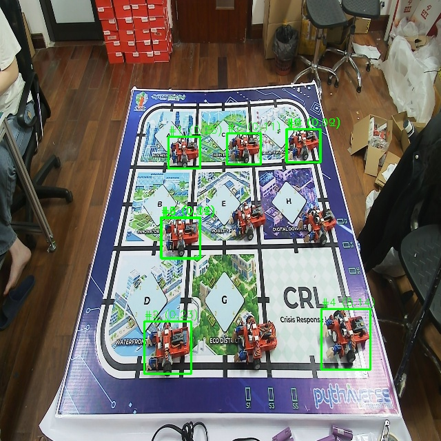

# Báo cáo công việc ngày 26/05/2026

## A. Công việc đã làm
- Giải thích lí do kích thước ảnh Input là 640x640
- Chỉnh sửa tools `check_confidence.py` để tạo ra fiel CSV chứa dữ liệu đánh giá của 200 anchors có confidence cao nhất sau khi đi qua mô hình YOLO v8 mà chưa qua xử lí NMS
- Chỉnh sửa tool `export_markdown_report.py` để in ra bảng Markdown chứa toàn bộ confidence của 24 class. 
- Tạo tools đánh giá trên ảnh cỡ 640x640 mà chưa rescale về 2560x1440. 

### 1. Lý do về kích thước Input
- **Về kích thước 640x640:** Việc cấu hình mô hình nhận đầu vào là tensor `640x640` xuất phát từ các lý do kỹ thuật sau:
  - **Kiến trúc tiêu chuẩn của YOLO:** `640x640` là kích thước đầu vào (baseline) mặc định và tối ưu nhất của các dòng YOLO hiện đại. Các lớp tích chập (convolutional layers) và cấu trúc mạng được thiết kế tối ưu với kích thước này 
  - **Cân bằng giữa Tốc độ và Độ chính xác (Speed-Accuracy Trade-off):** Kích thước 640 mang lại sự cân bằng tốt nhất. Nếu dùng ảnh lớn hơn (như `1280x1280`), mô hình sẽ tốn rất nhiều tài nguyên VRAM và giảm tốc độ suy luận (inference speed) từ đó có thể giảm FPS khi triển khai thực tế 
  - Ngược lại, nếu dùng ảnh quá nhỏ (như `320x320`), mô hình có thể mất các chi tiết quan trọng của Leanbot như phần tay cầm hay các chi tiết trên thân làm giảm độ chính xác khi nhận diện góc.
  - Do cấu hình huấn luyện ban đầu đã fix ở `640x640`, ảnh gốc `2560x1440` bắt buộc phải đi qua bước tiền xử lý (LetterBox) để đưa về đúng kích thước yêu cầu của mạng neural trước khi thực hiện bướ xử lí tiếp theo.

### 2. Chỉnh sửa tool `check_confidence.py` để tạo file CSV

- **Link code Github:** [https://git.pythaverse.space/thomha/Nguyen_Huu_Hoang_Anh/blob/master/260526/tools/check_confidence.py](https://git.pythaverse.space/thomha/Nguyen_Huu_Hoang_Anh/blob/master/260526/tools/check_confidence.py)
- **Nội dung thay đổi:**
  - Khai báo thêm thư viện `pandas` để xử lý dữ liệu và xuất file CSV.
  - Sau khi nhận mảng dự đoán gốc từ YOLO (khi chưa qua NMS, chứa hàng ngàn anchor boxes), tiến hành tính toán confidence lớn nhất của từng anchor đối với toàn bộ 24 class.
  - Sắp xếp và trích xuất đúng 200 anchors có giá trị confidence (class score) lớn nhất.
  - Xuất danh sách này ra file CSV chứa tọa độ: `x_center`, `y_center`, `width`, `height` cùng với 24 giá trị điểm số class tương ứng (từ class `Leanbot_0` đến `Leanbot_m15`).

- **code minh họa:**
```python
        # Lấy top 200 anchors theo max confidence
        max_scores, _ = raw_class_scores.max(dim=1)
        topk = min(200, max_scores.shape[0])
        _, topk_indices = torch.topk(max_scores, topk)

        top_boxes = raw_boxes_xywh[topk_indices].cpu().numpy()
        top_scores = raw_class_scores[topk_indices].cpu().numpy()

        csv_data = []
        for i in range(topk):
            row = top_boxes[i].tolist() + top_scores[i].tolist()
            csv_data.append(row)

        header = ["x_center", "y_center", "width", "height"] + [names[j] for j in range(nc)]
        df = pd.DataFrame(csv_data, columns=header)
        csv_path = os.path.join(out_subdir, f"{os.path.splitext(img_name)[0]}_top200.csv")
        df.to_csv(csv_path, index=False)
```

- **Kết quả chạy code trên ảnh `002.jpg` trong thư mục `24class_test_images`:**
  - **Link thư mục chứa CSV:** [https://git.pythaverse.space/thomha/Nguyen_Huu_Hoang_Anh/blob/master/260526/yolo_class_bbox_results](https://git.pythaverse.space/thomha/Nguyen_Huu_Hoang_Anh/blob/master/260526/yolo_class_bbox_results) 
  - **Ví dụ một đoạn file CSV:**
```csv
x_center,y_center,width,height,Leanbot_0,Leanbot_p15,Leanbot_p30,Leanbot_p45,Leanbot_p60,Leanbot_p75,Leanbot_p90,Leanbot_p105,Leanbot_p120,Leanbot_p135,Leanbot_p150,Leanbot_p165,Leanbot_p180,Leanbot_p195,Leanbot_m150,Leanbot_m135,Leanbot_m120,Leanbot_m105,Leanbot_m90,Leanbot_m75,Leanbot_m60,Leanbot_m45,Leanbot_m30,Leanbot_m15
260.89215087890625,334.17681884765625,55.04045104980469,35.502960205078125,0.3405531048774719,0.017129745334386826,0.002122289501130581,0.0030982312746345997,9.955670975614339e-05,0.00011464659473858774,3.803888102993369e-05,5.248168599791825e-05,7.630711479578167e-05,0.00041078668436966836,9.722446702653542e-05,0.009547073394060135,0.0014413773315027356,0.6073886156082153,0.00036927458131685853,0.0001436647871742025,0.001169599941931665,0.00663957092911005,0.004007106181234121,0.0012029100907966495,0.000540881126653403,0.0005222862819209695,0.000604022468905896,0.013891531154513359
353.88275146484375,261.394775390625,46.30474853515625,26.376632690429688,3.182479122187942e-05,4.0843522583600134e-05,0.00026215382968075573,0.0022756520193070173,0.0023105028085410595,0.00039448594907298684,7.713985542068258e-05,1.7465159544372e-05,8.511559281032532e-05,0.00018464840832166374,0.0009866236941888928,0.0001561387616675347,0.00991023052483797,0.5685945749282837,0.001297878217883408,0.00449000671505928,0.0003134651924483478,0.0012332252226769924,0.00010525056131882593,6.197143375175074e-05,0.0021395415533334017,2.3999398308660602e-06,0.0005216258578002453,0.12638171017169952
438.41644287109375,258.4844970703125,50.642822265625,27.548355102539062,3.0038832846912555e-05,5.8653822634369135e-05,0.0005047949962317944,0.00200844113714993,0.003364170202985406,0.0001401217159582302,6.79226141073741e-05,2.6431722289999016e-05,0.00013727463374380022,0.0002798830973915756,0.003829899476841092,0.0009568052482791245,0.09166155010461807,0.5567728281021118,0.001737914397381246,0.002796620363369584,0.00014273558917921036,0.0016861935146152973,0.00030459064873866737,3.205298344255425e-05,0.0023247578646987677,2.5136523618130013e-06,0.0008013834012672305,0.3062922954559326
```


### 3. Chỉnh sửa tool `export_markdown_report.py`

- **Nội dung thay đổi:**
  - Sửa biến cấu hình `MAX_TABLE_CLASS_COLUMNS = 8` thành `MAX_TABLE_CLASS_COLUMNS = 0` trong file `tools/export_markdown_report.py`.
  - Thay đổi này vô hiệu hóa việc giới hạn số lượng cột hiển thị. Do đó, bảng Markdown sẽ luôn in ra đầy đủ 24 điểm tự tin (confidence scores) của cả 24 class.
  - Giữ nguyên đúng theo thứ tự mảng mặc định của model YOLO (từ class `0`, `p15`, `p30`... cho tới `m15`).

- **Kết quả chạy test trên ảnh `002.jpg` thuộc thư mục `24class_test_images`:**
  - Lệnh chạy: `python tools/export_markdown_report.py --source 24class_test_images/002.jpg`
  - **Link thư mục báo cáo Markdown:** [https://git.pythaverse.space/thomha/Nguyen_Huu_Hoang_Anh/blob/master/260526/24class_test_images/002_markdown_report/report.md](https://git.pythaverse.space/thomha/Nguyen_Huu_Hoang_Anh/blob/master/260526/24class_test_images/002_markdown_report/report.md) 
  - **Báo cáo bảng Markdown kèm ảnh BBox sinh ra từ file `report.md`:**

| Ảnh BBox |
| :---: |
|  |

| Vị trí | BBox (Xc, Yc, W, H) | 0 | p15 | p30 | p45 | p60 | p75 | p90 | p105 | p120 | p135 | p150 | p165 | p180 | p195 | m150 | m135 | m120 | m105 | m90 | m75 | m60 | m45 | m30 | m15 | Best Class | Góc ước lượng |
|---|---|---|---|---|---|---|---|---|---|---|---|---|---|---|---|---|---|---|---|---|---|---|---|---|---|---|---|
| #1 | (1043.5, 777, 221, 142) | **0.3406** | 0.0171 | 0.0021 | 0.0031 | 0.0001 | 0.0001 | 0.0000 | 0.0001 | 0.0001 | 0.0004 | 0.0001 | 0.0095 | 0.0014 | **0.6074** | 0.0004 | 0.0001 | 0.0012 | 0.0066 | 0.0040 | 0.0012 | 0.0005 | 0.0005 | 0.0006 | 0.0139 | `Leanbot_p195` (0.6074) | -147.4° |
| #2 | (1415.5, 485.5, 185, 105) | 0.0000 | 0.0000 | 0.0003 | 0.0023 | 0.0023 | 0.0004 | 0.0001 | 0.0000 | 0.0001 | 0.0002 | 0.0010 | 0.0002 | 0.0099 | **0.5686** | 0.0013 | 0.0045 | 0.0003 | 0.0012 | 0.0001 | 0.0001 | 0.0021 | 0.0000 | 0.0005 | **0.1264** | `Leanbot_p195` (0.5686) | -157.2° |
| #3 | (1753.5, 474, 203, 110) | 0.0000 | 0.0001 | 0.0005 | 0.0020 | 0.0034 | 0.0001 | 0.0001 | 0.0000 | 0.0001 | 0.0003 | 0.0038 | 0.0010 | 0.0917 | **0.5568** | 0.0017 | 0.0028 | 0.0001 | 0.0017 | 0.0003 | 0.0000 | 0.0023 | 0.0000 | 0.0008 | **0.3063** | `Leanbot_p195` (0.5568) | -137.3° |
| #4 | (2007, 1108, 290, 214) | 0.0001 | 0.0000 | 0.0004 | 0.0002 | 0.0008 | 0.0003 | 0.0002 | 0.0000 | 0.0010 | 0.0024 | 0.0040 | 0.0000 | **0.4769** | 0.0059 | 0.0381 | 0.0017 | 0.0000 | 0.0003 | 0.0001 | 0.0029 | 0.0007 | 0.0000 | 0.0005 | **0.0697** | `Leanbot_p180` (0.4769) | -177.5° |
| #5 | (1415.5, 485, 187, 108) | 0.0000 | 0.0001 | 0.0017 | 0.0003 | 0.0009 | 0.0001 | 0.0001 | 0.0000 | 0.0001 | 0.0001 | 0.0029 | 0.0248 | **0.4745** | 0.0342 | 0.0056 | 0.0014 | 0.0000 | 0.0018 | 0.0006 | 0.0002 | 0.0009 | 0.0000 | 0.0036 | **0.2586** | `Leanbot_p180` (0.4745) | -163.4° |
| #6 | (1478, 1117, 268, 180) | **0.0758** | 0.0037 | 0.0003 | 0.0037 | 0.0002 | 0.0001 | 0.0002 | 0.0000 | 0.0001 | 0.0012 | 0.0001 | 0.0141 | 0.0007 | **0.4225** | 0.0003 | 0.0002 | 0.0008 | 0.0024 | 0.0010 | 0.0043 | 0.0017 | 0.0009 | 0.0021 | 0.0034 | `Leanbot_p195` (0.4225) | -161.8° |
| #7 | (1415.5, 485.5, 185, 105) | 0.0000 | 0.0000 | 0.0003 | 0.0002 | 0.0017 | 0.0001 | 0.0000 | 0.0000 | 0.0002 | 0.0001 | 0.0059 | 0.0011 | 0.0362 | **0.0480** | 0.0002 | 0.0007 | 0.0002 | 0.0010 | 0.0004 | 0.0000 | 0.0003 | 0.0000 | 0.0007 | **0.3868** | `Leanbot_m15` (0.3868) | -19.0° |
| #8 | (974.5, 1138.5, 257, 183) | **0.1653** | 0.0057 | 0.0044 | 0.0043 | 0.0001 | 0.0001 | 0.0002 | 0.0000 | 0.0002 | 0.0004 | 0.0001 | 0.0077 | 0.0009 | **0.3859** | 0.0003 | 0.0001 | 0.0025 | 0.0146 | 0.0063 | 0.0022 | 0.0005 | 0.0004 | 0.0007 | 0.0103 | `Leanbot_p195` (0.3859) | -154.3° |
| #9 | (1044, 776, 218, 140) | **0.3559** | 0.0063 | 0.0003 | 0.0010 | 0.0000 | 0.0001 | 0.0000 | 0.0000 | 0.0002 | 0.0002 | 0.0002 | 0.0023 | 0.0002 | **0.1287** | 0.0001 | 0.0002 | 0.0006 | 0.0016 | 0.0052 | 0.0007 | 0.0009 | 0.0003 | 0.0001 | 0.0138 | `Leanbot_0` (0.3559) | -8.2° |


### 4. Tạo bộ tool riêng cho ảnh kích thước 640x640 (không rescale)

- **Lý do cần tạo bộ tool mới:** 
  - Thay vì chỉnh sửa, thêm bớt qua lại trên các tool cũ (có thể gây lỗi hoặc làm mất đi tính năng tương thích với ảnh lớn 2560x1440 lúc trước), em đã tách riêng thành 2 tool mới là `check_confidence_640.py` và `export_markdown_report_640.py`.
  - Việc này tạo ra một luồng làm việc độc lập chuyên phục vụ yêu cầu: Đầu vào là ảnh đã được cắt (crop) và resize về 640x640 (tương tự như lúc gắn label để tạo data train), đồng thời xuất tọa độ Bounding Box trực tiếp trên không gian 640x640 mà không qua bước chuyển đổi ngược (rescale).

- **Nội dung thay đổi trong các tool mới:**
  - **Tên file:** `tools/check_confidence_640.py` và `tools/export_markdown_report_640.py`
  - **Link code Github:** 
    - [tools/check_confidence_640.py](https://git.pythaverse.space/thomha/Nguyen_Huu_Hoang_Anh/blob/master/260526/tools/check_confidence_640.py)
    - [tools/export_markdown_report_640.py](https://git.pythaverse.space/thomha/Nguyen_Huu_Hoang_Anh/blob/master/260526/tools/export_markdown_report_640.py)
  - **Resize trực tiếp:** Ép kích thước ảnh đầu vào về `640x640` bằng `cv2.resize` ngay sau khi đọc ảnh để giống hệ quy chiếu lúc huấn luyện.
  - **Bỏ hàm `scale_boxes()`:** Toàn bộ các dòng code dùng `scale_boxes` để biến đổi tọa độ từ 640x640 về lại kích thước ảnh gốc đã bị loại bỏ. Các tọa độ sinh ra trên file CSV và bảng Markdown đều là tọa độ nguyên bản (raw) ứng với không gian 640x640.
- 
- **Kết quả chạy test trên ảnh crop 640x640 từ `002.jpg`:**
  - Lệnh chạy: `python tools/export_markdown_report_640.py --source 24class_test_images/002.jpg --output-dir 24class_test_images/002_640_markdown_report`

  - **Link thư mục báo cáo Markdown:** [https://git.pythaverse.space/thomha/Nguyen_Huu_Hoang_Anh/blob/master/260526/24class_test_images/002_640_markdown_report/report.md](https://git.pythaverse.space/thomha/Nguyen_Huu_Hoang_Anh/blob/master/260526/24class_test_images/002_640_markdown_report/report.md) 
  - **Báo cáo bảng Markdown và ảnh BBox sinh ra từ file `report.md`:**

| Ảnh BBox |
| :---: |
|  |

| Vị trí | BBox (Xc, Yc, W, H) | 0 | p15 | p30 | p45 | p60 | p75 | p90 | p105 | p120 | p135 | p150 | p165 | p180 | p195 | m150 | m135 | m120 | m105 | m90 | m75 | m60 | m45 | m30 | m15 | Best Class | Góc ước lượng |
|---|---|---|---|---|---|---|---|---|---|---|---|---|---|---|---|---|---|---|---|---|---|---|---|---|---|---|---|
| #1 | (184.5, 504.5, 113, 81) | 0.1190 | 0.0003 | 0.0027 | 0.0014 | 0.0023 | 0.0001 | 0.0093 | 0.0024 | 0.0009 | 0.0034 | 0.0045 | 0.0001 | **0.4224** | **0.5871** | 0.0004 | 0.0001 | 0.0001 | 0.0001 | 0.0114 | 0.0001 | 0.0001 | 0.0014 | 0.0005 | 0.0628 | `Leanbot_p195` (0.5871) | -171.3° |
| #2 | (382, 215.5, 82, 49) | **0.0632** | 0.0182 | 0.0002 | 0.0071 | 0.0001 | 0.0002 | 0.0000 | 0.0001 | 0.0001 | 0.0002 | 0.0001 | 0.0155 | 0.0010 | **0.4894** | 0.0002 | 0.0001 | 0.0003 | 0.0007 | 0.0003 | 0.0006 | 0.0006 | 0.0002 | 0.0006 | 0.0032 | `Leanbot_p195` (0.4894) | -162.8° |
| #3 | (224.5, 220.5, 79, 47) | 0.0516 | 0.0221 | 0.0001 | 0.0086 | 0.0002 | 0.0001 | 0.0000 | 0.0000 | 0.0001 | 0.0003 | 0.0000 | **0.0568** | 0.0008 | **0.3614** | 0.0001 | 0.0001 | 0.0002 | 0.0010 | 0.0001 | 0.0005 | 0.0011 | 0.0003 | 0.0016 | 0.0017 | `Leanbot_p195` (0.3614) | -169.0° |
| #4 | (216.5, 345.5, 93, 65) | **0.2392** | 0.0024 | 0.0025 | 0.0011 | 0.0005 | 0.0001 | 0.0041 | 0.0003 | 0.0008 | 0.0071 | 0.0002 | 0.0001 | 0.1575 | **0.3474** | 0.0049 | 0.0001 | 0.0006 | 0.0002 | 0.0057 | 0.0014 | 0.0013 | 0.0006 | 0.0001 | 0.0203 | `Leanbot_p195` (0.3474) | -137.0° |
| #5 | (408.5, 496, 117, 84) | 0.0309 | 0.0006 | 0.0006 | 0.0011 | 0.0005 | 0.0001 | 0.0197 | 0.0028 | 0.0010 | 0.0120 | 0.0059 | 0.0002 | **0.1493** | **0.3424** | 0.0002 | 0.0002 | 0.0000 | 0.0002 | 0.0080 | 0.0000 | 0.0003 | 0.0013 | 0.0002 | 0.0756 | `Leanbot_p195` (0.3424) | -169.5° |


## B. Khó khăn
- Không
## C. Công việc tiếp theo
- Tìm hiểu khả năng thực hiện phương án triển khai Soft-label Cross Entropy theo góc lân cận. 