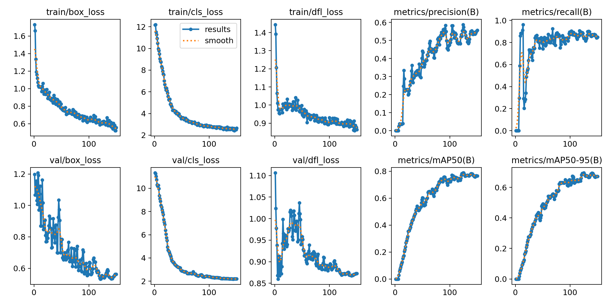
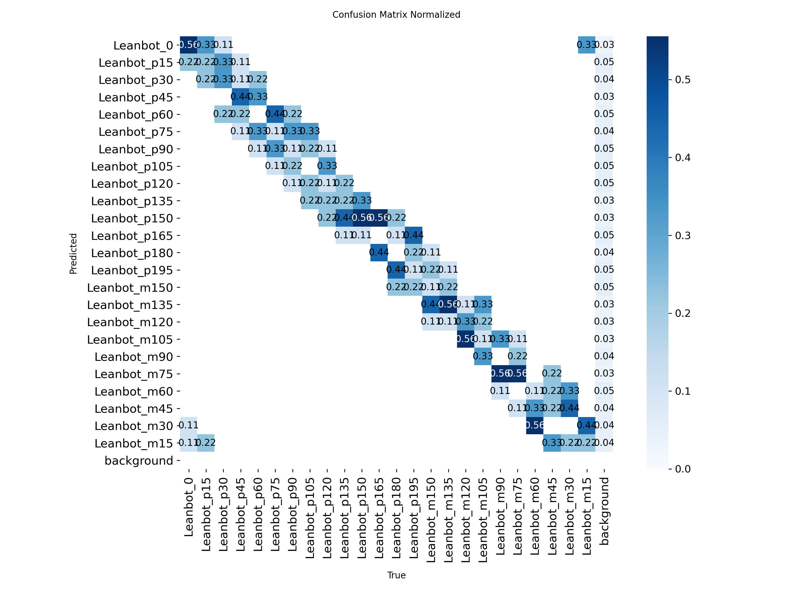
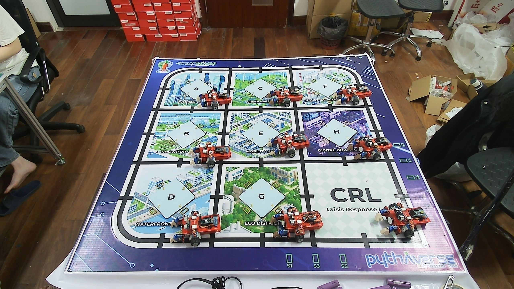
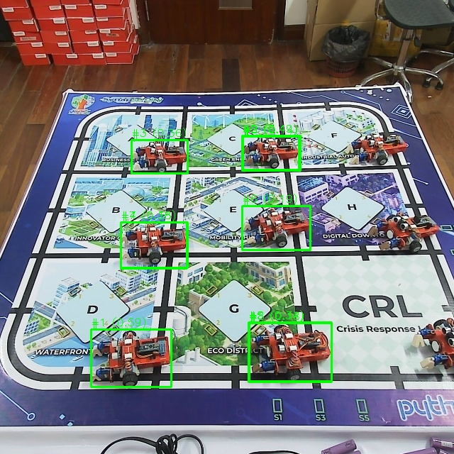
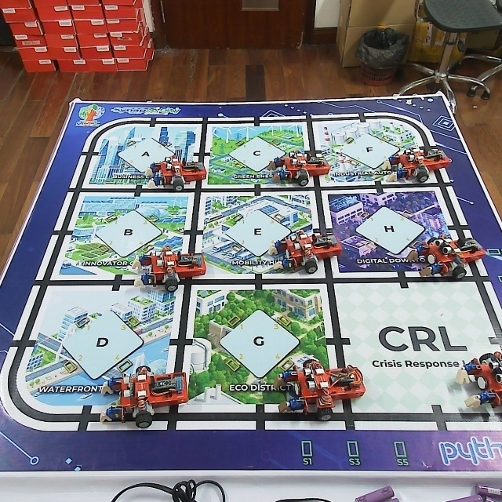
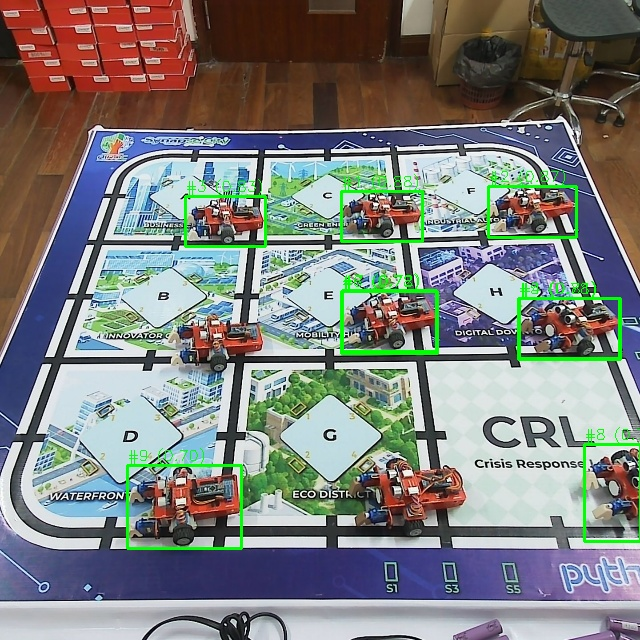

# Báo cáo công việc ngày 29/05/2026

## A. Công việc đã làm
- Chỉnh sửa code notebook Colab từ BCE mặc định sang Soft Angular BCE.
- Tiến hành train model YOLOv8n với bài toán nhận diện Leanbot theo 24 class góc.
- Đánh giá kết quả training từ thư mục `24Class_soft_angular_bce_result`.
- So sánh model Soft Angular BCE với model Default BCE trên cùng ảnh test đã crop và resize về `640 x 640`.

### 1. Chỉnh sửa notebook Colab

Notebook sử dụng: `tools/Leanbot_Train_SoftBCE.ipynb`.

Phần loss của YOLOv8 được chỉnh bằng cách bọc lại `v8DetectionLoss.bce`:
- Giữ lại BCE gốc của YOLOv8.
- Chỉ làm mềm target tại các anchor foreground, tức `target_scores.sum(dim=-1) > 0`.
- Mỗi class được xem như một mốc góc cách nhau `15` độ.
- Khoảng cách góc dùng dạng vòng tròn: `d = min(abs(true_angle - class_angle), 360 - abs(true_angle - class_angle))`.
- Soft target được tạo bằng Gaussian: `exp(-0.5 * (d / sigma)^2) * original_iou_scores`, với `sigma = 15.0`.
- Sau đó thay `self.bce` bằng `SoftBCEWithLogitsLoss(self.bce, sigma=15.0)`.

- Log debug trong quá trình train cho thấy hard target ban đầu được lan sang các class góc lân cận:

```text
[SoftBCE] Orig: [0, 0, 0, 0, 0, 0, 0, 0, 0, 0.28491, 0, 0, 0, 0, 0, 0, 0, 0, 0, 0, 0, 0, 0, 0]
[SoftBCE] Soft: [0, 0, 0, 0, 0, 0, 0.0030003, 0.039001, 0.17297, 0.28491, 0.17297, 0.039001, 0.0030003, 0, 0, 0, 0, 0, 0, 0, 0, 0, 0, 0]
```


### 2. Tiến hành train model

#### 2.1. Thông tin training

| Thông số | Giá trị thực tế |
| :--- | :--- |
| Model nền tảng | `yolov8n.pt` - YOLOv8 Nano, pretrained COCO |
| Task | Object Detection |
| Số class | `24` |
| Class | `Leanbot_0`, `Leanbot_p15`, `Leanbot_p30`, `Leanbot_p45`, `Leanbot_p60`, `Leanbot_p75`, `Leanbot_p90`, `Leanbot_p105`, `Leanbot_p120`, `Leanbot_p135`, `Leanbot_p150`, `Leanbot_p165`, `Leanbot_p180`, `Leanbot_p195`, `Leanbot_m150`, `Leanbot_m135`, `Leanbot_m120`, `Leanbot_m105`, `Leanbot_m90`, `Leanbot_m75`, `Leanbot_m60`, `Leanbot_m45`, `Leanbot_m30`, `Leanbot_m15` |
| Dataset split | `72` ảnh train, `24` ảnh validation, `24` ảnh test |
| Validation set | `24` ảnh, `216` instances |
| Epochs | `150` |
| Batch size | `16` |
| Image size | `640 x 640` |
| Optimizer | `optimizer=auto`, Ultralytics chọn `AdamW(lr=0.000357, momentum=0.9)` |
| Augmentation chính | `degrees=10.0`, `fliplr=0.0`, `flipud=0.0`, `mosaic=1.0`, `scale=0.5`, `translate=0.1` |
| Môi trường training | Google Colab, GPU Tesla T4 14913 MiB |
| Framework | Ultralytics `8.4.56`, Python `3.12.13`, Torch `2.11.0+cu128` |
| Thời gian training | `0.070 hours`, tương đương khoảng `4.2` phút |
| Output | `24Class_soft_angular_bce_result` |

Kết quả được lưu trong thư mục: [24Class_soft_angular_bce_result](24Class_soft_angular_bce_result/).

Các file chính trong thư mục kết quả:
- [args.yaml](24Class_soft_angular_bce_result/args.yaml): cấu hình training.
- [results.csv](24Class_soft_angular_bce_result/results.csv): log loss, precision, recall, mAP và learning rate theo từng epoch.
- [results.png](24Class_soft_angular_bce_result/results.png): tổng hợp các đường loss và metric.
- [BoxP_curve.png](24Class_soft_angular_bce_result/BoxP_curve.png), [BoxR_curve.png](24Class_soft_angular_bce_result/BoxR_curve.png), [BoxF1_curve.png](24Class_soft_angular_bce_result/BoxF1_curve.png), [BoxPR_curve.png](24Class_soft_angular_bce_result/BoxPR_curve.png): các đường metric theo confidence.
- [confusion_matrix.png](24Class_soft_angular_bce_result/confusion_matrix.png), [confusion_matrix_normalized.png](24Class_soft_angular_bce_result/confusion_matrix_normalized.png): ma trận nhầm lẫn.
- [labels.jpg](24Class_soft_angular_bce_result/labels.jpg), [train_batch0.jpg](24Class_soft_angular_bce_result/train_batch0.jpg), [train_batch1.jpg](24Class_soft_angular_bce_result/train_batch1.jpg), [train_batch2.jpg](24Class_soft_angular_bce_result/train_batch2.jpg), [val_batch0_labels.jpg](24Class_soft_angular_bce_result/val_batch0_labels.jpg), [val_batch0_pred.jpg](24Class_soft_angular_bce_result/val_batch0_pred.jpg): ảnh kiểm tra dữ liệu train/val.

#### 2.2. Đánh giá kết quả training

Nguồn metric chính: `24Class_soft_angular_bce_result/results.csv`.

Metric ở epoch cuối (`epoch=150`):

| Metric | Giá trị |
| :--- | ---: |
| `train/box_loss` | `0.55644` |
| `train/cls_loss` | `2.65033` |
| `train/dfl_loss` | `0.86439` |
| `metrics/precision(B)` | `0.55603` |
| `metrics/recall(B)` | `0.84921` |
| `metrics/mAP50(B)` | `0.76585` |
| `metrics/mAP50-95(B)` | `0.67185` |
| `val/box_loss` | `0.56223` |
| `val/cls_loss` | `2.19315` |
| `val/dfl_loss` | `0.87276` |
| `lr/pg0` | `5.9262e-06` |
| `lr/pg1` | `5.9262e-06` |
| `lr/pg2` | `5.9262e-06` |

Giá trị tốt nhất theo từng metric:

| Metric | Best value | Epoch | Ghi chú |
| :--- | ---: | ---: | :--- |
| `metrics/precision(B)` | `0.58828` | `124` | Precision cao nhất |
| `metrics/recall(B)` | `0.96296` | `14` | Recall cao nhưng precision/mAP còn thấp |
| `metrics/mAP50(B)` | `0.78837` | `124` | mAP50 cao nhất trong `results.csv` |
| `metrics/mAP50-95(B)` | `0.69482` | `125` | Metric chính để chọn `best.pt` |
| `train/box_loss` | `0.52117` | `149` | Loss bbox train thấp nhất |
| `train/cls_loss` | `2.41753` | `146` | Loss class train thấp nhất |
| `train/dfl_loss` | `0.85870` | `146` | Loss DFL train thấp nhất |
| `val/box_loss` | `0.53203` | `121` | Loss bbox validation thấp nhất |
| `val/cls_loss` | `2.18471` | `144` | Loss class validation thấp nhất |
| `val/dfl_loss` | `0.85987` | `6` | Loss DFL validation thấp nhất |

Diễn biến metric ở một số epoch tiêu biểu:

| Epoch | Precision | Recall | mAP50 | mAP50-95 | Train box | Train cls | Train dfl | Val box | Val cls | Val dfl |
| ---: | ---: | ---: | ---: | ---: | ---: | ---: | ---: | ---: | ---: | ---: |
| `1` | `0.00000` | `0.00000` | `0.00000` | `0.00000` | `1.73130` | `12.16410` | `1.44415` | `1.19780` | `11.33300` | `1.10622` |
| `25` | `0.20442` | `0.73283` | `0.35629` | `0.27685` | `0.89024` | `5.59359` | `0.99314` | `0.79203` | `4.67549` | `0.97002` |
| `50` | `0.44184` | `0.74219` | `0.60291` | `0.49141` | `0.77300` | `3.57799` | `0.94819` | `0.78470` | `2.88855` | `0.95816` |
| `75` | `0.44520` | `0.88464` | `0.67445` | `0.57820` | `0.68421` | `3.05800` | `0.92776` | `0.64026` | `2.60590` | `0.89479` |
| `100` | `0.49721` | `0.87223` | `0.72341` | `0.62272` | `0.63930` | `2.86091` | `0.93090` | `0.61168` | `2.39783` | `0.89180` |
| `124` | `0.58828` | `0.85404` | `0.78837` | `0.69165` | `0.60034` | `2.61885` | `0.90104` | `0.55375` | `2.22212` | `0.87184` |
| `125` | `0.57353` | `0.83817` | `0.78825` | `0.69482` | `0.62264` | `2.66218` | `0.90041` | `0.54683` | `2.23140` | `0.87155` |
| `150` | `0.55603` | `0.84921` | `0.76585` | `0.67185` | `0.55644` | `2.65033` | `0.86439` | `0.56223` | `2.19315` | `0.87276` |

#### 2.3. Hình ảnh minh họa chính



Nhận xét: các loss train/val giảm mạnh ở giai đoạn đầu và ổn định dần về cuối; mAP50 và mAP50-95 tăng rõ sau khoảng 50 epoch, đạt vùng tốt nhất quanh epoch `124-125`, sau đó dao động nhẹ.



Nhận xét: bản chuẩn hóa giúp so sánh tỷ lệ đúng/sai giữa các class; các ô ngoài đường chéo thể hiện các cặp góc còn bị nhầm nhiều hơn tương đối.


Nhận xét: ảnh validation prediction cho thấy model phát hiện góc Leanbot bị nhiễu, có sự phân vân giữa các góc. 

### 3. So sánh với model cũ trên cùng ảnh test

Hai model được thử nghiệm trên cùng ảnh `24class_test_images/002.jpg`. Quy trình tiền xử lý được giữ giống nhau cho cả hai model:
- Dùng tool crop ảnh về đúng kích thước `640 x 640`.
- Ảnh gốc `2560 x 1440` được center crop thành vùng vuông sau đó resize vùng crop về `640 x 640`.
- Với mỗi model, xuất `report.md`, file `002_top200.csv` chứa top 200 anchors và chạy `tools/group_anchors.py` để gom nhóm anchors trùng lặp theo IoU `0.5`.


| Nội dung | Default BCE | Soft Angular BCE |
| :--- | :--- | :--- |
| Model | `tools/best_24Class_Default_BCE.pt` | `tools/best_24Class_Soft_Angular_BCE.pt` |
| Report 640 | [report.md](test_results/default_bce_report_640/report.md) | [report.md](test_results/soft_bce_report_640/report.md) |
| CSV top 200 anchors | [002_top200.csv](test_results/default_bce_report_640/002_top200.csv) | [002_top200.csv](test_results/soft_bce_report_640/002_top200.csv) |
| Grouped anchors | [002_grouped.csv](test_results/default_bce_report_640/002_grouped.csv), [002_grouped_report.txt](test_results/default_bce_report_640/002_grouped_report.txt) | [002_grouped.csv](test_results/soft_bce_report_640/002_grouped.csv), [002_grouped_report.txt](test_results/soft_bce_report_640/002_grouped_report.txt) |
| Số nhóm anchor sau gom IoU `0.5` | `11` nhóm | `12` nhóm |
| Số vị trí Leanbot trong report | `9` | `9` |
| Confidence cao nhất trong 9 vị trí report | `0.5871` | `0.8846` |
| Confidence trung bình 9 vị trí report | `0.3139` | `0.7866` |
| Confidence thấp nhất trong 9 vị trí report | `0.1427` | `0.6998` |
| Confidence thấp nhất trong 9 nhóm anchor đầu | `0.29` | `0.72` |

#### 3.1. Model Default BCE

- Model: [best_24Class_Default_BCE.pt](tools/best_24Class_Default_BCE.pt)
- Report markdown: [test_results/default_bce_report_640/report.md](test_results/default_bce_report_640/report.md)
- CSV top 200 anchors: [test_results/default_bce_report_640/002_top200.csv](test_results/default_bce_report_640/002_top200.csv)
- Grouped anchors CSV: [test_results/default_bce_report_640/002_grouped.csv](test_results/default_bce_report_640/002_grouped.csv)
- Grouped anchors report: [test_results/default_bce_report_640/002_grouped_report.txt](test_results/default_bce_report_640/002_grouped_report.txt)

Nhận xét: confidence của các detection top đầu còn thấp và phân tán hơn. Trong 9 vị trí report, confidence cao nhất là `0.5871`, confidence trung bình là `0.3139`. Sau khi gom anchor theo IoU `0.5`, top group vẫn có confidence `0.59` và các group đầu chủ yếu là `Leanbot_p195`, nhưng có lẫn một số class xa như `Leanbot_0` hoặc `Leanbot_m15`, làm góc ước lượng không ổn định.

Trích report markdown 640:

| Ảnh gốc | Ảnh sau crop + resize `640 x 640` | Ảnh bbox `640 x 640` |
| :---: | :---: | :---: |
|  |  |  |

| Vị trí | BBox (Xc, Yc, W, H) | 0 | p15 | p30 | p45 | p60 | p75 | p90 | p105 | p120 | p135 | p150 | p165 | p180 | p195 | m150 | m135 | m120 | m105 | m90 | m75 | m60 | m45 | m30 | m15 | Best Class | Góc ước lượng |
|---|---|---|---|---|---|---|---|---|---|---|---|---|---|---|---|---|---|---|---|---|---|---|---|---|---|---|---|
| #1 | (184.5, 504.5, 113, 81) | 0.1190 | 0.0003 | 0.0027 | 0.0014 | 0.0023 | 0.0001 | 0.0093 | 0.0024 | 0.0009 | 0.0034 | 0.0045 | 0.0001 | **0.4224** | **0.5871** | 0.0004 | 0.0001 | 0.0001 | 0.0001 | 0.0114 | 0.0001 | 0.0001 | 0.0014 | 0.0005 | 0.0629 | `Leanbot_p195` (0.5871) | -171.3° |
| #2 | (382, 215.5, 82, 49) | **0.0632** | 0.0182 | 0.0002 | 0.0071 | 0.0001 | 0.0002 | 0.0000 | 0.0001 | 0.0001 | 0.0002 | 0.0001 | 0.0155 | 0.0010 | **0.4894** | 0.0002 | 0.0001 | 0.0003 | 0.0007 | 0.0003 | 0.0006 | 0.0006 | 0.0002 | 0.0006 | 0.0032 | `Leanbot_p195` (0.4894) | -162.8° |
| #3 | (224.5, 220.5, 79, 47) | 0.0516 | 0.0221 | 0.0001 | 0.0086 | 0.0002 | 0.0001 | 0.0000 | 0.0000 | 0.0001 | 0.0003 | 0.0000 | **0.0568** | 0.0008 | **0.3614** | 0.0001 | 0.0001 | 0.0002 | 0.0010 | 0.0001 | 0.0005 | 0.0011 | 0.0003 | 0.0016 | 0.0017 | `Leanbot_p195` (0.3614) | -169.0° |
| #4 | (216.5, 345.5, 93, 65) | **0.2392** | 0.0024 | 0.0025 | 0.0011 | 0.0005 | 0.0001 | 0.0041 | 0.0003 | 0.0008 | 0.0071 | 0.0002 | 0.0001 | 0.1575 | **0.3474** | 0.0049 | 0.0001 | 0.0006 | 0.0002 | 0.0057 | 0.0014 | 0.0013 | 0.0006 | 0.0001 | 0.0203 | `Leanbot_p195` (0.3474) | -137.0° |
| #5 | (408.5, 496, 117, 84) | 0.0309 | 0.0006 | 0.0006 | 0.0011 | 0.0005 | 0.0001 | 0.0197 | 0.0028 | 0.0010 | 0.0120 | 0.0059 | 0.0002 | **0.1493** | **0.3424** | 0.0002 | 0.0002 | 0.0000 | 0.0002 | 0.0080 | 0.0000 | 0.0003 | 0.0013 | 0.0002 | 0.0756 | `Leanbot_p195` (0.3424) | -169.5° |
| #6 | (389, 321, 96, 62) | 0.0136 | 0.0326 | 0.0003 | 0.0105 | 0.0004 | 0.0001 | 0.0001 | 0.0000 | 0.0001 | 0.0014 | 0.0000 | **0.0818** | 0.0022 | **0.1932** | 0.0004 | 0.0002 | 0.0008 | 0.0017 | 0.0001 | 0.0003 | 0.0003 | 0.0004 | 0.0020 | 0.0034 | `Leanbot_p195` (0.1932) | -173.8° |
| #7 | (217, 345, 94, 64) | **0.1823** | 0.0052 | 0.0005 | 0.0021 | 0.0001 | 0.0002 | 0.0000 | 0.0001 | 0.0001 | 0.0001 | 0.0001 | 0.0027 | 0.0002 | **0.1235** | 0.0001 | 0.0001 | 0.0002 | 0.0010 | 0.0017 | 0.0006 | 0.0007 | 0.0002 | 0.0004 | 0.0035 | `Leanbot_0` (0.1823) | -26.9° |
| #8 | (409, 496, 116, 82) | 0.0686 | 0.0022 | 0.0013 | 0.0005 | 0.0004 | 0.0001 | 0.0089 | 0.0012 | 0.0008 | 0.0093 | 0.0009 | 0.0001 | **0.1791** | **0.1543** | 0.0009 | 0.0002 | 0.0002 | 0.0002 | 0.0119 | 0.0002 | 0.0004 | 0.0008 | 0.0001 | 0.0281 | `Leanbot_p180` (0.1791) | -173.1° |
| #9 | (381.5, 215.5, 79, 47) | 0.0000 | 0.0000 | 0.0001 | 0.0000 | 0.0004 | 0.0000 | 0.0001 | 0.0000 | 0.0001 | 0.0001 | 0.0022 | 0.0007 | **0.0528** | 0.0013 | 0.0000 | 0.0002 | 0.0000 | 0.0002 | 0.0008 | 0.0001 | 0.0002 | 0.0000 | 0.0003 | **0.1427** | `Leanbot_m15` (0.1427) | -23.5° |

#### 3.2. Model Soft Angular BCE

- Model: [best_24Class_Soft_Angular_BCE.pt](tools/best_24Class_Soft_Angular_BCE.pt)
- Report markdown: [test_results/soft_bce_report_640/report.md](test_results/soft_bce_report_640/report.md)
- CSV top 200 anchors: [test_results/soft_bce_report_640/002_top200.csv](test_results/soft_bce_report_640/002_top200.csv)
- Grouped anchors CSV: [test_results/soft_bce_report_640/002_grouped.csv](test_results/soft_bce_report_640/002_grouped.csv)
- Grouped anchors report: [test_results/soft_bce_report_640/002_grouped_report.txt](test_results/soft_bce_report_640/002_grouped_report.txt)

Nhận xét: confidence tăng rõ trên cùng ảnh và cùng pipeline crop `640 x 640`. Trong 9 vị trí report, confidence cao nhất là `0.8846`, confidence trung bình là `0.7866`. Sau khi gom anchor theo IoU `0.5`, các group đầu có confidence cao hơn (`0.88`, `0.87`, `0.83`, `0.81`) và tập trung quanh `Leanbot_p180`/`Leanbot_p195`, phù hợp với mục tiêu làm mềm nhãn theo quan hệ góc.

Trích report markdown 640:

| Ảnh gốc | Ảnh sau crop + resize `640 x 640` | Ảnh bbox `640 x 640` |
| :---: | :---: | :---: |
|  |  |  |

| Vị trí | BBox (Xc, Yc, W, H) | 0 | p15 | p30 | p45 | p60 | p75 | p90 | p105 | p120 | p135 | p150 | p165 | p180 | p195 | m150 | m135 | m120 | m105 | m90 | m75 | m60 | m45 | m30 | m15 | Best Class | Góc ước lượng |
|---|---|---|---|---|---|---|---|---|---|---|---|---|---|---|---|---|---|---|---|---|---|---|---|---|---|---|---|
| #1 | (381.5, 216, 81, 50) | 0.0008 | 0.0099 | 0.0005 | 0.0032 | 0.0149 | 0.0032 | 0.0001 | 0.0002 | 0.0001 | 0.0172 | 0.1195 | 0.2762 | **0.8846** | **0.5829** | 0.2794 | 0.0501 | 0.0030 | 0.0010 | 0.0002 | 0.0000 | 0.0004 | 0.0008 | 0.0007 | 0.0044 | `Leanbot_p180` (0.8846) | -174.1° |
| #2 | (532, 211.5, 88, 51) | 0.0012 | 0.0074 | 0.0013 | 0.0041 | 0.0220 | 0.0016 | 0.0002 | 0.0003 | 0.0000 | 0.0172 | 0.0835 | 0.3074 | **0.8672** | **0.6498** | 0.5302 | 0.1313 | 0.0080 | 0.0022 | 0.0005 | 0.0000 | 0.0006 | 0.0007 | 0.0004 | 0.0074 | `Leanbot_p180` (0.8672) | -173.6° |
| #3 | (225, 221, 80, 50) | 0.0011 | 0.0112 | 0.0007 | 0.0034 | 0.0159 | 0.0029 | 0.0001 | 0.0002 | 0.0001 | 0.0152 | 0.0800 | 0.2969 | **0.8264** | **0.5540** | 0.2564 | 0.0457 | 0.0029 | 0.0012 | 0.0002 | 0.0000 | 0.0003 | 0.0006 | 0.0010 | 0.0046 | `Leanbot_p180` (0.8264) | -174.0° |
| #4 | (569, 328, 100, 60) | 0.0064 | 0.0167 | 0.0026 | 0.0084 | 0.0021 | 0.0001 | 0.0025 | 0.0003 | 0.0031 | 0.0094 | 0.0546 | 0.1404 | **0.7165** | **0.8059** | 0.5612 | 0.0024 | 0.0010 | 0.0015 | 0.0082 | 0.0034 | 0.0029 | 0.0013 | 0.0001 | 0.0206 | `Leanbot_p195` (0.8059) | -172.1° |
| #5 | (569, 328.5, 102, 61) | 0.0010 | 0.0060 | 0.0020 | 0.0032 | 0.0233 | 0.0019 | 0.0002 | 0.0006 | 0.0000 | 0.0166 | 0.0746 | 0.1780 | **0.7825** | **0.6317** | 0.5091 | 0.1606 | 0.0131 | 0.0046 | 0.0011 | 0.0000 | 0.0006 | 0.0006 | 0.0004 | 0.0107 | `Leanbot_p180` (0.7825) | -173.3° |
| #6 | (389, 322, 96, 62) | 0.0010 | 0.0070 | 0.0013 | 0.0028 | 0.0187 | 0.0019 | 0.0001 | 0.0005 | 0.0000 | 0.0192 | 0.0815 | 0.1965 | **0.7819** | **0.6617** | 0.4577 | 0.1188 | 0.0087 | 0.0018 | 0.0005 | 0.0000 | 0.0005 | 0.0007 | 0.0006 | 0.0068 | `Leanbot_p180` (0.7819) | -173.1° |
| #7 | (389, 320.5, 94, 61) | 0.0040 | 0.0099 | 0.0021 | 0.0069 | 0.0015 | 0.0002 | 0.0037 | 0.0006 | 0.0050 | 0.0200 | 0.0578 | 0.1623 | **0.6077** | **0.7245** | 0.3506 | 0.0018 | 0.0011 | 0.0018 | 0.0065 | 0.0047 | 0.0027 | 0.0013 | 0.0000 | 0.0130 | `Leanbot_p195` (0.7245) | -171.8° |
| #8 | (612, 492.5, 56, 97) | 0.0207 | 0.0277 | 0.0030 | 0.0059 | 0.0011 | 0.0002 | 0.0014 | 0.0001 | 0.0014 | 0.0130 | 0.0479 | 0.0412 | **0.5240** | **0.7064** | 0.4866 | 0.0014 | 0.0011 | 0.0083 | 0.0168 | 0.0059 | 0.0066 | 0.0019 | 0.0003 | 0.1229 | `Leanbot_p195` (0.7064) | -171.4° |
| #9 | (184, 506.5, 114, 83) | 0.0012 | 0.0100 | 0.0060 | 0.0049 | 0.0141 | 0.0020 | 0.0001 | 0.0007 | 0.0001 | 0.0112 | 0.0347 | 0.0796 | **0.6929** | **0.6998** | 0.3666 | 0.1319 | 0.0054 | 0.0023 | 0.0010 | 0.0000 | 0.0003 | 0.0004 | 0.0003 | 0.0061 | `Leanbot_p195` (0.6998) | -172.5° |

#### 3.3. Kết luận so sánh

Soft Angular BCE cho confidence cao hơn rõ rệt trên cùng ảnh test và cùng cách crop `640 x 640`. Trung bình 9 vị trí trong report tăng từ `0.3139` lên `0.7866`; confidence thấp nhất tăng từ `0.1427` lên `0.6998`. Khi cần phân tích chi tiết hơn, có thể mở `002_top200.csv` để xem score từng anchor và `002_grouped_report.txt` để xem các anchors trùng lặp đã được gom thành nhóm vật thể.

## B. Khó khăn
- Không

## C. Công việc tiếp theo
- Em xin phép nhận hướng đi tiếp theo từ Thầy ạ.
