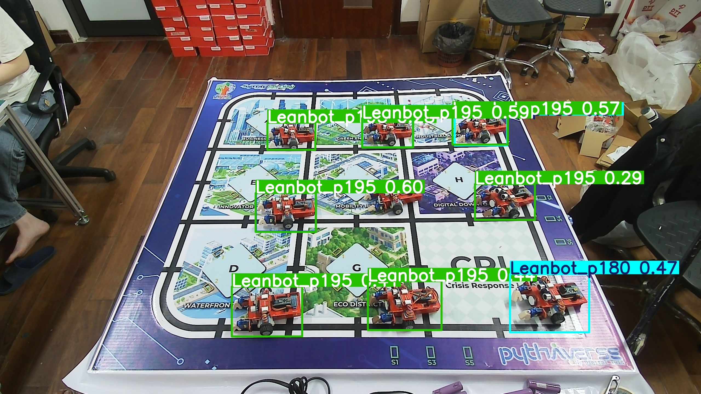

# Leanbot Markdown Report

- Source: `D:\PTIT\DTT\Nguyen_Huu_Hoang_Anh\260620\test_vector`
- Model: `D:\PTIT\DTT\Nguyen_Huu_Hoang_Anh\260528\tools\best.pt`
- Goc uoc luong: Tinh tu vector tong cua tat ca cac class goc
- Generated: 2026-06-20 06:36:46

##### `002.jpg` (9 vi tri Leanbot)
| Anh BBox |
| :---: |
|  |

| Vị trí | BBox (Xc, Yc, W, H) | Best Class | Độ lớn Vector | Góc ước lượng | 0 | p15 | p30 | p45 | p60 | p75 | p90 | p105 | p120 | p135 | p150 | p165 | p180 | p195 | m150 | m135 | m120 | m105 | m90 | m75 | m60 | m45 | m30 | m15 |
|---|---|---|---|---|---|---|---|---|---|---|---|---|---|---|---|---|---|---|---|---|---|---|---|---|---|---|---|---|
| #1 | (1043.5, 777, 221, 142) | `Leanbot_p195` (0.6074) | 0.2779 | -143.8° | 0.3406 | 0.0171 | 0.0021 | 0.0031 | 0.0001 | 0.0001 | 0.0000 | 0.0001 | 0.0001 | 0.0004 | 0.0001 | 0.0095 | 0.0014 | 0.6074 | 0.0004 | 0.0001 | 0.0012 | 0.0066 | 0.0040 | 0.0012 | 0.0005 | 0.0005 | 0.0006 | 0.0139 |
| #2 | (1415.5, 485.5, 185, 105) | `Leanbot_p195` (0.5686) | 0.4748 | -157.4° | 0.0000 | 0.0000 | 0.0003 | 0.0023 | 0.0023 | 0.0004 | 0.0001 | 0.0000 | 0.0001 | 0.0002 | 0.0010 | 0.0002 | 0.0099 | 0.5686 | 0.0013 | 0.0045 | 0.0003 | 0.0012 | 0.0001 | 0.0001 | 0.0021 | 0.0000 | 0.0005 | 0.1264 |
| #3 | (1753.5, 474, 203, 110) | `Leanbot_p195` (0.5568) | 0.4040 | -146.4° | 0.0000 | 0.0001 | 0.0005 | 0.0020 | 0.0034 | 0.0001 | 0.0001 | 0.0000 | 0.0001 | 0.0003 | 0.0038 | 0.0010 | 0.0917 | 0.5568 | 0.0017 | 0.0028 | 0.0001 | 0.0017 | 0.0003 | 0.0000 | 0.0023 | 0.0000 | 0.0008 | 0.3063 |
| #4 | (2007, 1108, 290, 214) | `Leanbot_p180` (0.4769) | 0.4542 | -175.2° | 0.0001 | 0.0000 | 0.0004 | 0.0002 | 0.0008 | 0.0003 | 0.0002 | 0.0000 | 0.0010 | 0.0024 | 0.0040 | 0.0000 | 0.4769 | 0.0059 | 0.0381 | 0.0017 | 0.0000 | 0.0003 | 0.0001 | 0.0029 | 0.0007 | 0.0000 | 0.0005 | 0.0697 |
| #5 | (1415.5, 485, 187, 108) | `Leanbot_p180` (0.4745) | 0.2943 | -165.4° | 0.0000 | 0.0001 | 0.0017 | 0.0003 | 0.0009 | 0.0001 | 0.0001 | 0.0000 | 0.0001 | 0.0001 | 0.0029 | 0.0248 | 0.4745 | 0.0342 | 0.0056 | 0.0014 | 0.0000 | 0.0018 | 0.0006 | 0.0002 | 0.0009 | 0.0000 | 0.0036 | 0.2586 |
| #6 | (1478, 1117, 268, 180) | `Leanbot_p195` (0.4225) | 0.3532 | -161.3° | 0.0758 | 0.0037 | 0.0003 | 0.0037 | 0.0002 | 0.0001 | 0.0002 | 0.0000 | 0.0001 | 0.0012 | 0.0001 | 0.0141 | 0.0007 | 0.4225 | 0.0003 | 0.0002 | 0.0008 | 0.0024 | 0.0010 | 0.0043 | 0.0017 | 0.0009 | 0.0021 | 0.0034 |
| #7 | (1415.5, 485.5, 185, 105) | `Leanbot_m15` (0.3868) | 0.3062 | -21.0° | 0.0000 | 0.0000 | 0.0003 | 0.0002 | 0.0017 | 0.0001 | 0.0000 | 0.0000 | 0.0002 | 0.0001 | 0.0059 | 0.0011 | 0.0362 | 0.0480 | 0.0002 | 0.0007 | 0.0002 | 0.0010 | 0.0004 | 0.0000 | 0.0003 | 0.0000 | 0.0007 | 0.3868 |
| #8 | (974.5, 1138.5, 257, 183) | `Leanbot_p195` (0.3859) | 0.2305 | -148.9° | 0.1653 | 0.0057 | 0.0044 | 0.0043 | 0.0001 | 0.0001 | 0.0002 | 0.0000 | 0.0002 | 0.0004 | 0.0001 | 0.0077 | 0.0009 | 0.3859 | 0.0003 | 0.0001 | 0.0025 | 0.0146 | 0.0063 | 0.0022 | 0.0005 | 0.0004 | 0.0007 | 0.0103 |
| #9 | (1044, 776, 218, 140) | `Leanbot_0` (0.3559) | 0.2528 | -9.7° | 0.3559 | 0.0063 | 0.0003 | 0.0010 | 0.0000 | 0.0001 | 0.0000 | 0.0000 | 0.0002 | 0.0002 | 0.0002 | 0.0023 | 0.0002 | 0.1287 | 0.0001 | 0.0002 | 0.0006 | 0.0016 | 0.0052 | 0.0007 | 0.0009 | 0.0003 | 0.0001 | 0.0138 |

---
