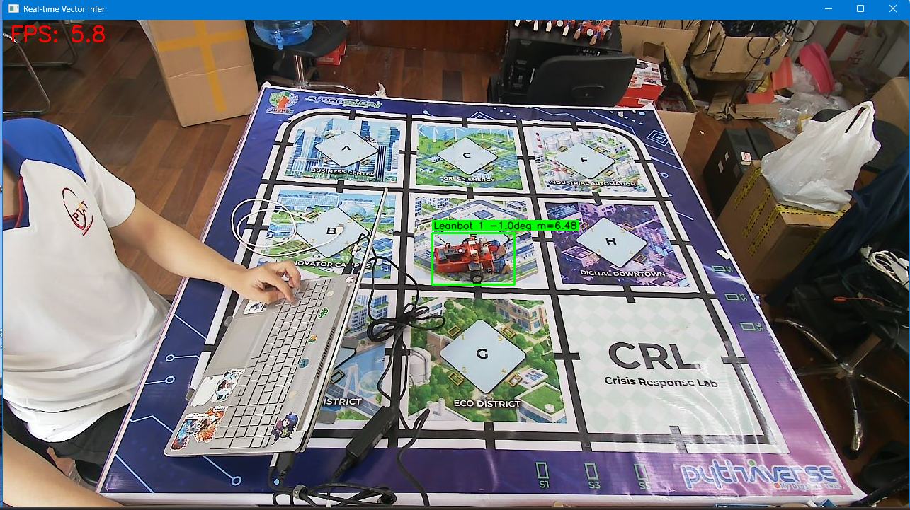
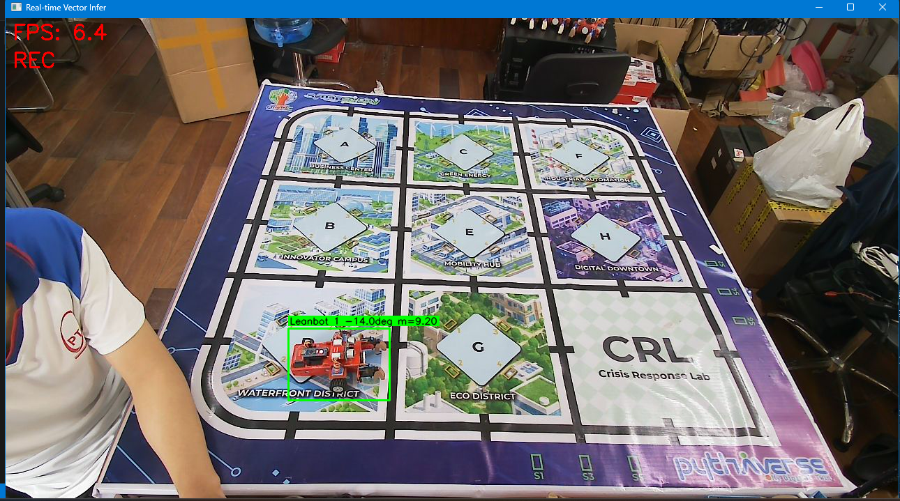

# Báo cáo công việc ngày 03/07/2026

# A. Công việc đã làm
- Tạo scripts chạy trực tiếp Camera, tạo file log debug in ra kết quả detection.
- Đặt Leanbot tại nhiều vị trí khác nhau trên sa bàn, đánh giá log debug
- Cho Leanbot xoay tại chỗ (360 độ theo 2 chiều trái và phải), thư thập kết quả realtime detection.
- Vẽ biểu đồ Angle, X-Y_center để quan sát, đánh giá

## 1. Tạo scripts chạy realtime detection từ camera
- Link code : [/tools/webcam_vector_infer.py](tools/webcam_vector_infer.py)
- Tham số:
  - `--model`: Đường dẫn đến model.
  - `--source`: Nguồn camera (mặc định 0).
  - `--conf`: Ngưỡng confidence tối thiểu.
  - `--iou`: Ngưỡng IoU để gom anchor.
  - `--min-mag`: Ngưỡng magnitude tối thiểu để lọc dự đoán.
- **Ví dụ lệnh chạy:**
  ```bash
  python tools/webcam_vector_infer.py --source 1 --conf 0.5 --topk 200
  ```
- **Ouput của scripts:**
  - Cửa sổ Video OpenCV hiển thị thời gian thực (BBox, Group ID, góc, magnitude, và FPS).

  

  - Bảng log thông số in trực tiếp trên cửa sổ Terminal cho từng khung hình.
  
    ```
        --- Frame 1 | Time: 10:25:23.837 | Calc Time: 255.8ms ---
        Group  1 | Anchors:  4 | Mag:   6.43 | Angle:   -3.73°

        --- Frame 2 | Time: 10:25:24.196 | Calc Time: 145.9ms ---
        Group  1 | Anchors:  4 | Mag:   6.46 | Angle:   -3.06°

        --- Frame 3 | Time: 10:25:24.361 | Calc Time: 125.1ms ---
        Group  1 | Anchors:  4 | Mag:   6.55 | Angle:   -3.30°
    ```

  - File dữ liệu dạng chuỗi thời gian `.csv` tự động sinh ra trong thư mục `runs/` (chỉ kích hoạt ghi khi người dùng nhấn phím `R` - Record), lưu trữ thông số: `timestamp`, `frame_id`, `group_id`, `magnitude`, `x_center`, `y_center`, `angle`.

    ```csv
    timestamp,frame_id,group_id,num_anchors,magnitude,x_center,y_center,width,height,angle
    09:37:23.717,766,1,4,6.67,516.3,197.0,100.8,69.0,-8.88
    09:37:23.865,767,1,4,6.69,516.0,197.1,100.9,69.1,-9.33
    09:37:24.008,768,1,4,6.61,516.3,197.2,100.9,68.7,-8.90
    09:37:24.150,769,1,4,6.46,516.1,197.0,100.9,68.6,-8.55
    09:37:24.300,770,1,4,6.30,516.2,197.2,100.4,68.4,-9.17
    09:37:24.449,771,1,4,6.57,516.3,197.2,100.4,68.3,-9.38
    09:37:24.590,772,1,4,6.26,516.2,197.1,100.6,68.8,-8.73
    ```

**Quy trình xử lý:**
1. **Khởi tạo & Đọc Video Stream:** Load model PyTorch, mở luồng đọc dữ liệu liên tục từ Camera (cv2) và lắng nghe sự kiện phím bấm (`R` để bật/tắt luồng ghi file CSV log debug).
2. **Tiền xử lý (LetterBox):** Khung hình gốc từ camera được đưa qua bộ lộc `LetterBox` để thu nhỏ về kích thước `640x640`. Ảnh được thu nhỏ giữ nguyên tỷ lệ và đệm thêm viền đen (padding),
    > Vì trước đó đầu vào của model là 640x640 và Thầy đã yêu cầu cắt lấy phần hình vuông của Sa bàn, nên khi chạy thực tế thì em đã thu nhỏ ảnh và thêm padding để bù cho ảnh thành hình vuông cỡ 640x640.
3. **Inference Low-level (Không qua NMS):** Đẩy tensor qua model YOLO nhưng **bỏ qua thuật toán NMS**, nhằm giữ lại toàn bộ anchor dự đoán thô (raw predictions).

4. **Lọc độ tự tin & Lấy Top-K:** Loại bỏ những anchor có độ tự tin max score < `--conf`. Với số lượng anchor còn lại, lấy ra `--topk` anchors tốt nhất (mặc định 200 như code phân tích góc ban đầu).

5. **Scale Bounding Box:** Tọa độ anchor được ánh xạ (map) từ `640x640` trở về đúng độ phân giải gốc của camera (hàm `scale_boxes`).

6. **Tính Vector con:** Dùng 24 điểm số của 24 class góc để nhân với `cos/sin` tương ứng, tạo thành cặp vector thành phần $(V_x, V_y)$ cho mỗi điểm ảnh.

7. **Gom cụm (IoU Greedy Grouping):** Gom các anchor chồng lấn lên nhau (vượt ngưỡng `--iou`) thành từng cụm đối tượng đại diện cho Leanbot.

8. **Tổng hợp Góc (Group Vector):** Cộng dồn các vector $(V_x, V_y)$ trong mỗi cụm. Cụm nào có tổng vector bé hơn `--min-mag` sẽ bị loại. Dùng hàm `atan2` để lấy góc cuối cùng.

9. **Hiển thị & Ghi Log:** Dùng OpenCV vẽ hộp chữ nhật và chèn thông số. Ghi dòng dữ liệu mới vào tệp `.csv` (nếu đang ở chế độ Record). File CSV debug được lưu vào thư mục `runs/`. Định dạng tên file csv được lưu theo thời gian thực khi nhấn phím `R` - Record. Ví dụ: `webcam_vector_log_20260703_093723.csv`. 


## 2. Vẽ biểu đồ Angle, X-Y_center đánh giá kết quả realtime detection
- **Link code**: [`tools/plot_log.py`](tools/plot_log.py)
- **Các bước xử lý**: 
  - Tự động đọc dữ liệu chuỗi thời gian từ file CSV log trong thư mục `runs/`.
  - Vẽ đồ thị sự biến thiên của Góc (Angle) từ `-180` đến `+180` độ.
  - Vẽ đồ thị tọa độ Tâm (X_center, Y_center) để đánh giá độ ổn định vị trí trong lúc xoay.
- **Lệnh chạy**: 
  ```bash
  python tools/plot_log.py runs/webcam_vector_log_20260703_093723.csv
  ```
  hoặc :
  ```bash
  python tools/plot_log.py runs
  ```
  Để chạy toàn bộ log trong thư mục runs. 

## 3. Đánh giá, phân tích dữ liệu góc của Leanbot tại các trường hợp.

### 3.1 Trường hợp Leanbot đứng yên tại các vị trí khác nhau.  
- Mỗi trường hợp đứng yên được record, lấy dữ liệu để lưu vào fiel csv trong khoảng 3 giây .
 
#### Trường hợp 1
- **File Log CSV**: [`runs/webcam_vector_log_20260703_105923.csv`](runs/webcam_vector_log_20260703_105923.csv)
- **Ảnh thực tế**: 
- **Đồ thị phân tích**: 
- **FPS ước tính**: ~6.6 FPS
- **Kết quả góc trung bình**: **-11.9°**

#### Trường hợp 2
- **File Log CSV**: [`runs/webcam_vector_log_20260703_105935.csv`](runs/webcam_vector_log_20260703_105935.csv)
- **Ảnh thực tế**: 
- **Đồ thị phân tích**: 
- **FPS ước tính**: ~6.4 FPS
- **Kết quả góc trung bình**: **-82.8°**

#### Trường hợp 3
- **File Log CSV**: [`runs/webcam_vector_log_20260703_105947.csv`](runs/webcam_vector_log_20260703_105947.csv)
- **Ảnh thực tế**: 
- **Đồ thị phân tích**: 
- **FPS ước tính**: ~6.8 FPS
- **Kết quả góc trung bình**: **+50.7°**

#### Trường hợp 4
- **File Log CSV**: [`runs/webcam_vector_log_20260703_105956.csv`](runs/webcam_vector_log_20260703_105956.csv)
- **Ảnh thực tế**: 
- **Đồ thị phân tích**: 
- **FPS ước tính**: ~6.3 FPS
- **Kết quả góc trung bình**: **+138.8°**

#### Trường hợp 5
- **File Log CSV**: [`runs/webcam_vector_log_20260703_110005.csv`](runs/webcam_vector_log_20260703_110005.csv)
- **Ảnh thực tế**: 
- **Đồ thị phân tích**: 
- **FPS ước tính**: ~6.5 FPS
- **Kết quả góc trung bình**: **+95.8°**

#### Trường hợp 6 
- **File Log CSV**: [`runs/webcam_vector_log_20260703_110019.csv`](runs/webcam_vector_log_20260703_110019.csv)
- **Ảnh thực tế**: 
- **Đồ thị phân tích**: 
- **FPS ước tính**: ~6.3 FPS
- **Kết quả góc trung bình**: **-150.0°**

#### Trường hợp 7
- **File Log CSV**: [`runs/webcam_vector_log_20260703_110032.csv`](runs/webcam_vector_log_20260703_110032.csv)
- **Ảnh thực tế**: 
- **Đồ thị phân tích**: 
- **FPS ước tính**: ~6.8 FPS
- **Kết quả góc trung bình**: **-139.2°**

#### Trường hợp 8 
- **File Log CSV**: [`runs/webcam_vector_log_20260703_110040.csv`](runs/webcam_vector_log_20260703_110040.csv)
- **Ảnh thực tế**: 
- **Đồ thị phân tích**: 
- **FPS ước tính**: ~7.4 FPS
- **Kết quả góc trung bình**: **-80.5°**

#### Trường hợp 9
- **File Log CSV**: [`runs/webcam_vector_log_20260703_110048.csv`](runs/webcam_vector_log_20260703_110048.csv)
- **Ảnh thực tế**: 
- **Đồ thị phân tích**: 
- **FPS ước tính**: ~5.1 FPS
- **Kết quả góc trung bình**: **-44.1°**

#### Trường hợp 10 
- **File Log CSV**: [`runs/webcam_vector_log_20260703_110057.csv`](runs/webcam_vector_log_20260703_110057.csv)
- **Ảnh thực tế**: 
- **Đồ thị phân tích**: 
- **FPS ước tính**: ~6.7 FPS
- **Kết quả góc trung bình**: **-72.8°**

### 3.2 Trường hợp Leanbot xoay tại chỗ 360 độ
- Vị trí khảo sát:



#### Trường hợp 1. Xoay ngược chiều kim đồng hồ (CCW).
- **File Log CSV**: [`runs/webcam_vector_log_20260703_112534.csv`](runs/webcam_vector_log_20260703_112534.csv)
- **Đồ thị phân tích**: 
- **FPS ước tính**: ~6.5 FPS
- **Số frame thu được**: 79 frames (~12 giây)
- **Nhận xét**: Angle thay đổi đúng theo chiều ngược chiều kim đồng hồ.

#### Trường hợp 2. Xoay theo chiều kim đồng hồ (CW).
- **File Log CSV**: [`runs/webcam_vector_log_20260703_112623.csv`](runs/webcam_vector_log_20260703_112623.csv)
- **Đồ thị phân tích**: 
- **FPS ước tính**: ~6.7 FPS
- **Số frame thu được**: 76 frames (~11 giây)
- **Nhận xét**: Angle thay đổi đúng theo chiều kim đồng hồ.

# B. Khó khăn
- Em thấy chạy thực tế thì FPS hơi thấp ạ ( dao động trong khoảng 5-8 FPS)

# C. Công việc tiếp theo
- Em xin phép nhận đề xuất, công việc tiếp theo từ Thầy ạ. 