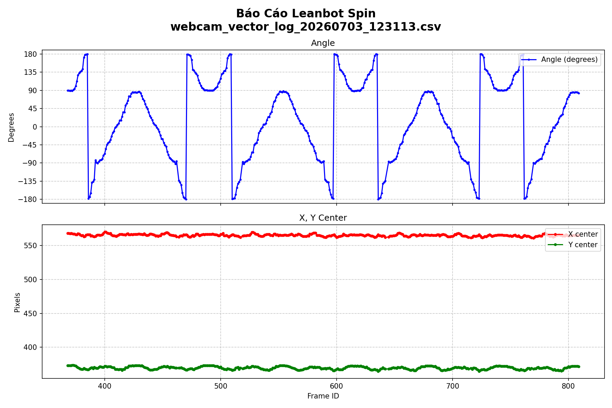

# Báo cáo công việc ngày 03/07/2026 ( Tiếp )

# A. Công việc đã làm
- Code Leanbot spin liên tục CW + CCW 
- Print ra terminal Calcutation time để khảo sát thời gian thực hiện các bước tính toán . 
## 1. Code Leanbot Spin liên tục xuay và đánh giá. 
- Code Leanbot :
```cpp
#include <Leanbot.h>

const int TURN_SPEED_RPM = 30;
const int TURN_ANGLE_DEG = 373; // vì Leanbot xuay góc không chính xác nên tăng góc quay tương đối . 

void setup() {
  Leanbot.begin();
  LbMission.begin( TB1A + TB1B);

  Leanbot.tone(1500, 200);
  delay(1000);

}
void loop() {
    // Quay theo chiều kim đồng hồ CW
    LbMotion.runLRrpm(-TURN_SPEED_RPM, TURN_SPEED_RPM);
    LbMotion.waitRotationDeg(TURN_ANGLE_DEG);

    LbMotion.runLRrpm(0,0);
    delay(1000);

    // Quay ngược chiều kim đồng hồ CCW
    LbMotion.runLRrpm(TURN_SPEED_RPM, -TURN_SPEED_RPM);
    LbMotion.waitRotationDeg(TURN_ANGLE_DEG);
    
    LbMotion.runLRrpm(0,0);
    delay(1000);
}
```
- Kịch bản test : chạy liên tục luân phiên CW + CCW , khoảng thời gian để Leanbot ổn định giữa các lần xuay là 1 giây. 
- **Kết quả CSV**: [`runs/webcam_vector_log_20260703_123113.csv`](runs/webcam_vector_log_20260703_123113.csv)
# Báo cáo công việc ngày 03/07/2026 ( Tiếp )

# A. Công việc đã làm
- Code Leanbot spin liên tục CW + CCW 
- Print ra terminal Calcutation time để khảo sát thời gian thực hiện các bước tính toán . 
## 1. Code Leanbot Spin liên tục xuay và đánh giá. 
- Code Leanbot :
```cpp
#include <Leanbot.h>

const int TURN_SPEED_RPM = 30;
const int TURN_ANGLE_DEG = 373; // vì Leanbot xuay góc không chính xác nên tăng góc quay tương đối . 

void setup() {
  Leanbot.begin();
  LbMission.begin( TB1A + TB1B);

  Leanbot.tone(1500, 200);
  delay(1000);

}
void loop() {
    // Quay theo chiều kim đồng hồ CW
    LbMotion.runLRrpm(-TURN_SPEED_RPM, TURN_SPEED_RPM);
    LbMotion.waitRotationDeg(TURN_ANGLE_DEG);

    LbMotion.runLRrpm(0,0);
    delay(1000);

    // Quay ngược chiều kim đồng hồ CCW
    LbMotion.runLRrpm(TURN_SPEED_RPM, -TURN_SPEED_RPM);
    LbMotion.waitRotationDeg(TURN_ANGLE_DEG);
    
    LbMotion.runLRrpm(0,0);
    delay(1000);
}
```
- Kịch bản test : chạy liên tục luân phiên CW + CCW , khoảng thời gian để Leanbot ổn định giữa các lần xuay là 1 giây. 
- **Kết quả CSV**: [`runs/webcam_vector_log_20260703_123113.csv`](runs/webcam_vector_log_20260703_123113.csv)
- **Ảnh thực tế**: 
- **Biểu đồ**: 



- **FPS trung bình**: ~7.5 FPS
- **Số frame thu được**: 436 frames
- **Thời gian test**: ~58.3s
- **Nhận xét**: Biểu đồ cho thấy chu kỳ xoay đúng: đầu tiên angle giảm dần theo chiều kim đồng hồ (CW), sau đó tạm nghỉ, rồi tăng dần ngược chiều kim đồng hồ (CCW). 

## 2. Cập nhật code chạy Cam realtime để tính toán thời gian xử lí tại các bước 
- Đo và tính toán chi tiết thời gian tiêu tốn cho từng bước trong pipeline nhằm xác định nguyên nhân gây giảm FPS.
- **Phương pháp sử dụng:**
  - Dùng `time.perf_counter()` bọc quanh từng bước xử lý.
  - Cộng dồn thời gian từng bước qua các frame.
  - Cứ mỗi 30 frame tính tổng thời gian tiêu tốn trong các bước nhỏ và in ra kết quả trung bình một lần để đánh giá tổng quan.

- **Các bước khảo sát thời gian:**
  1. **Preprocess (Letterbox):** Resize ảnh từ Camera về kích thước chuẩn `640x640` (thêm viền đen để giữ tỷ lệ) và chuyển thành tensor để đưa vào GPU.
  2. **YOLO Inference:** Đẩy tensor qua mạng Neural Network của YOLO để dự đoán ra điểm số 24 class và toạ độ BBox.
  3. **Filter + TopK:** Lọc bỏ các dự đoán nhiễu có độ tự tin thấp và giữ lại 200 box có độ tự tin cao nhất để giảm tải tính toán.
  4. **Vector Computation:** Chuyển đổi 24 điểm số (softmax) thành 2 thành phần vector $V_x$, $V_y$ bằng lượng giác (cos, sin) cho từng anchor.
  5. **IoU Grouping:** Chạy thuật toán tự viết để gom cụm các anchor nằm sát nhau chồng chéo lên nhau thành một cụm chung (đại diện cho một Leanbot).
- **Các bước tính toán trong code :**
  Pipeline xử lý mỗi frame được chia làm 5 bước chính:

```python
    # 1. Preprocess (Letterbox)
    _t_pre0 = time.perf_counter()
    letterbox = LetterBox(new_shape=(640, 640), auto=False, stride=32)
    img640 = letterbox(image=frame)
    img_tensor = ... # Chuyển thành tensor và chuẩn hóa
    _t_pre1 = time.perf_counter()
    
    # 2. YOLO Inference (Chạy qua model YOLO)
    t0 = time.perf_counter()
    with torch.no_grad():
        raw_pred = model.model(img_tensor)
    _t_infer = time.perf_counter()
        
    # 3. Filter + TopK
    # ... lọc các anchor có conf < ngưỡng và chỉ lấy top 200 anchor tốt nhất
    _t_filter = time.perf_counter()
    
    # 4. Vector Computation
    raw_rows = []
    for i in range(topk_actual):
        mag, ang = get_vector_from_scores(top_scores[i], names) # Nhân score với góc
        # ...
    _t_vector = time.perf_counter()
    
    # 5. IoU Grouping
    groups = group_anchors(raw_df, iou_thres=args.iou) # Gom cụm các box đè lên nhau
    _t_group = time.perf_counter()
```


- **Kết quả Profiling (trung bình trên 30 frame) được print ra trên terminal : **
```text
=======================================================
  [PROFILE] Trung binh 30 frame gan nhat:
  Preprocess (LetterBox) :    3.50 ms
  YOLO Inference (GPU)   :  118.20 ms
  Filter + TopK          :    1.20 ms
  Vector Computation     :    5.80 ms
  IoU Grouping           :    2.10 ms
  TOTAL calc             :  131.42 ms
=======================================================
```

- **Nhận xét & Đánh giá:**
  1. Tổng thời gian tính toán trung bình cho một frame là `~131.42 ms` (tương đương tốc độ tối đa khoảng `~7.6 FPS`). Khớp với FPS trên thực tế (từ `5-8 FPS`).
  2. Thời gian chạy **YOLO Inference** chiếm phần lớn quỹ thời gian xử lý (`118.20 ms`, chiếm tới khoản **~90%** tổng thời gian).
  3. Các khâu xử lý còn lại (tiền xử lý Letterbox, bộ lọc Filter + TopK, tính Vector, gom cụm IoU Grouping) diễn ra nhanh, không tốn nhiều thời gian (`~15ms`) 
  4. **Kết luận:** 
  - Tốc độ FPS bị giới hạn chủ yếu bởi thời gian forward pass của model YOLO.
  - Các thuật toán hậu xử lý (Vector Computation, IoU Grouping) đều rất nhẹ và không phải là nguyên nhân gây chậm FPS.
  - Để tăng FPS, cần tối ưu hóa chính model (như dùng model YOLO nhẹ hơn để train, giảm độ phân giải đầu vào, hoặc có thể lượng tử hóa (quantization) Model hiện tại).

# B. Khó khăn 
- Không 
# C. Công việc tiếp theo
- Em xin nhận công việc tiếp theo ạ 

