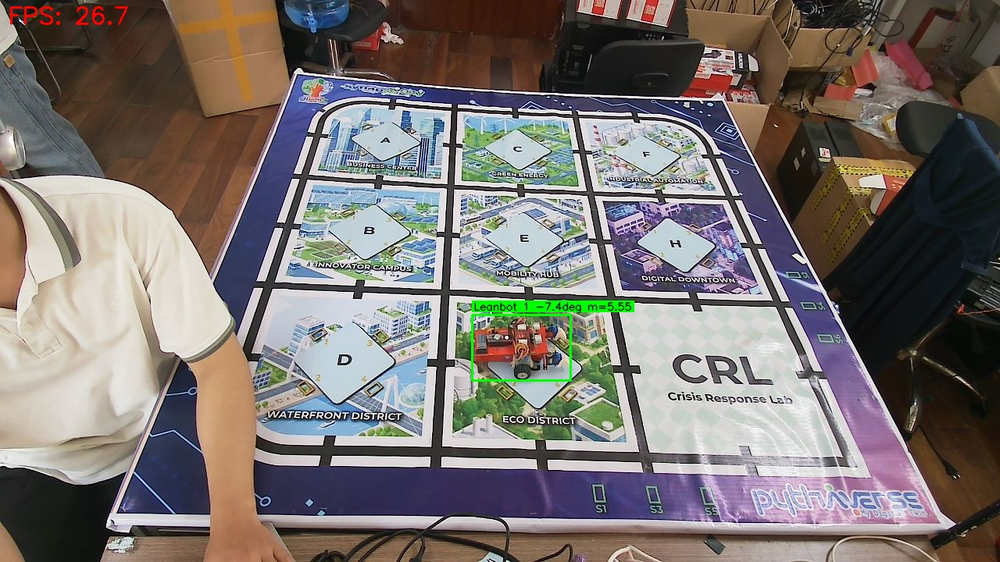
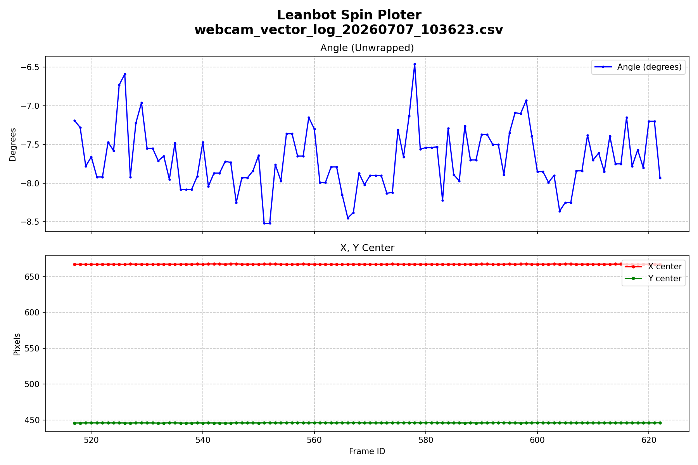
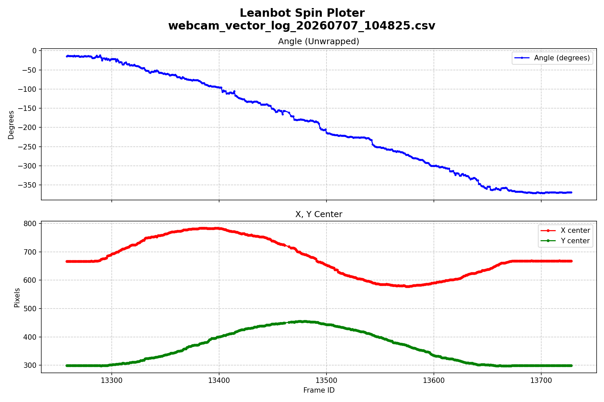

# Báo cáo công việc ngày 07/07/2026

# A. Công việc đã làm
- Lượng tử hóa Model xuống INT8 ( Không cần Calibration data)
- Đánh giá, so sánh tốc độ xử lí của các Models với nhau
- Thử nghiệm Realtime Camera Stream với  Model lượng tử hóa FP16 OpenVINO (cỡ ảnh 640x640) và đánh giá đồ thị dữ liệu angle, X-Y_center của bbox.
- Lập trình Leanbot di chuyển vòng tròn và đánh giá đồ thị dữ liệu angle, X-Y_center của bbox.
- Thực hiện unwrap data để dữ liệu không nhảy từ +180 sang -180 và ngược lại


## 1. Lượng tử hóa Model xuống IN8 
- Code sử dụng : [/tools/export_int8_benchmark.py](tools/export_int8_benchmark.py)
- Kích thước ảnh benchmark : **640x640**
- Số lượng ảnh benchmark : **4** ảnh trong folder [/24class_test_images](24class_test_images)
- Chạy mỗi model **30 lần / 1 ảnh**, tính trung bình FPS trên tổng số lượt chạy model trên toàn bộ folde ảnh (4 ảnh * 30 lần = 120 lượt chạy model)
- Hàm chuyển đổi model lượng tử hóa INT8: 
```python
    from ultralytics import YOLO
    from onnxruntime.quantization import quantize_dynamic, QuantType

    # Load model gốc cần chuyển đổi 
    model_pt = YOLO('models/best_24Class_Soft_Angular_BCE.pt')

    # 1. Lượng tử hóa sang định dạng OpenVINO INT8 (bằng thư viện Ultralytics)
    model_pt.export(format='openvino', int8=True, imgsz=640)

    # 2. Lượng tử hóa sang định dạng ONNX INT8 (sử dụng thư viện ONNX Runtime)
    # Export file ONNX FP32 gốc trước
    onnx_fp32_path = model_pt.export(format='onnx', half=False, imgsz=640)
    # Nén động các trọng số xuống chuẩn 8-bit (Dynamic Quantization)
    quantize_dynamic(
        model_input=onnx_fp32_path,
        model_output='models/best_24Class_Soft_Angular_BCE_int8.onnx',
        weight_type=QuantType.QUInt8
    )
```

- **Bảng kết quả so sánh tốc độ xử lí các Models (FP32 gốc, FP16, INT8 quantization)** 

| Định dạng Model      | Tiền xử lý (ms) | Suy luận (ms)   | Hậu xử lý (ms)  | Ước tính FPS |     
|----------------------|-----------------|-----------------|-----------------|--------------|     
| **PyTorch (Gốc FP32)**   |        3.36 ms |      114.57 ms |        1.26 ms |      **8.39 FPS** |       
| **ONNX (FP32)**          |        7.70 ms |      105.14 ms |        3.81 ms |      **8.57 FPS** |       
| **OpenVINO (FP32)**      |        6.12 ms |       23.25 ms |        2.43 ms |     **31.44 FPS** |       
| **ONNX (FP16)**          |        7.04 ms |       95.28 ms |        3.50 ms |      **9.45 FPS** |       
| **OpenVINO (FP16)**      |        6.71 ms |       26.00 ms |        2.08 ms |     **28.74 FPS** |       
| **ONNX (INT8)**          |        7.56 ms |      146.31 ms |        4.33 ms |      **6.32 FPS** |       
| **OpenVINO (INT8)**      |        6.59 ms |       23.91 ms |        2.89 ms |     **29.95 FPS** |       

> **Nhận xét tổng quan:**
> 1. **Hiệu năng OpenVINO trên CPU:** Định dạng OpenVINO có khả năng tương thích tốt trên chip CPU Intel. Tất cả các phiên bản OpenVINO (FP32, FP16, INT8) đều đạt tốc độ ổn định trong khoảng **28 - 31 FPS**, nhanh gấp ~3.5 lần so với bản gốc PyTorch FP32 (~8.4 FPS).
> 2. **Sự bão hòa hiệu năng của lượng tử hóa:** Qua đánh giá, kết quả cho thấy FP32, FP16 và INT8 của OpenVINO không có khoảng cách quá lớn, cho thấy việc lượng tử hóa thêm không hẳn là tối ưu về thời gian mà còn khiến độ chính xác (accuracy) giảm.
> 3. **ONNX không phù hợp cho thiết bị dùng CPU:** Toàn bộ định dạng ONNX đều cho tốc độ thấp (dưới 10 FPS).Đối với ONNX INT8 thực tế thử nghiệm thì lại có tốc độ thấp nhất (6.32 FPS) trong các định dạng model. Có thể lí do vì ONNX được thiết kế cho thiết bị sử dụng GPU.

## 2. Thử nghiệm Realtime Camera Stream với  Model lượng tử hóa FP16 OpenVINO 
- Code sử dụng : [tools/webcam_vector_infer.py](tools/webcam_vector_infer.py)
- Chạy model với đường dẫn model từ model Pytorch gốc thành OpenVINO FP16 Quantization :

```text
python tools\webcam_vector_infer.py  --source 1 --model models\quantized_models_full\model_fp16_openvino_model\

``` 
- Dữ liệu đánh giá được lưu trong [/runs](runs)
- Từ timestamp trong file CSV suy ra được **FPS** trung bình thực tế là: **26 FPS**
- Ảnh chạy realtime thực tế :


- Đồ thị dữ liệu angle, X-Y_center của bbox khi Leanbot đứng yên . 

 

## 3. Lập trình Leanbot di chuyển vòng tròn và đánh giá đồ thị dữ liệu angle, X-Y_center của bbox. 
 
- Code sử dụng : 
```cpp
    #include <Leanbot.h>

    const int TURN_ANGLE_DEG = 370;

    void setup() {
    Leanbot.begin();
    LbMission.begin(TB1A + TB1B);

    Leanbot.tone(1500, 200);
    delay(1000);
    }

    void loop() {

        LbMotion.runLR(2000, 1000);
        LbMotion.waitRotationDeg(TURN_ANGLE_DEG);
        LbMotion.stopAndWait();
        delay(1000);
        LbMission.end() ;
    }
```
- Leanbot chạy trên sa bàn với quỹ đạo là đường tròn với vận tốc 2 bánh là 2000 và 1000. 
- Code vẽ đồ thị : [tools/plot_log.py](tools/plot_log.py)
- Lệnh chạy khi vẽ đồ thị :  
```python
python tools\plot_log.py runs\

```
## 3.1 Thực hiện unwrap dữ liệu góc bị nhảy đột ngột từ +180 sang -180 và ngược lại

- Code gốc : 
```python
    ax1.plot(df_g1['frame_id'], df_g1['angle'], 'b.-', label='Angle (degrees)', linewidth=1.5, markersize=4)
```
- Cập nhật code unwrap data để dữ liệu không bị nhảy từ +180 sang -180 và ngược lại :  

Hàm `np.unwrap` của Numpy được thiết kế theo chuẩn góc Radian (1 vòng tròn = 2π). Hàm mặc định sẽ nhận diện các bước nhảy lớn hơn π (tương đương 180°) để tự động bù/trừ thêm 2π giúp đồ thị liên tục, không bị nhảy giữa mốc 180° và -180°.

Từ đó quy trình unwrap góc là:
> 1. `np.radians()`: Đổi dữ liệu Độ (Degrees) sang hệ Radian để hàm unwrap hiểu đúng ngưỡng π.
> 2. `np.unwrap()`: Thuật toán quét qua chuỗi số và triệt tiêu các bước nhảy.
> 3. `np.degrees()`: Dịch ngược kết quả từ Radian về lại ĐỘ (Degrees) để vẽ lên trục Y cho dễ quan sát, đánh giá.

```python 
   import numpy as np
    
    ax1 = axes[0]
    # Đổi góc sang radian , unwrap
    unwrapped_angle = np.degrees(np.unwrap(np.radians(df_g1['angle'])))
    
    ax1.plot(df_g1['frame_id'], unwrapped_angle, 'b.-', label='Angle (degrees)', linewidth=1.5, markersize=4)
    ax1.set_ylabel('Degrees')
    # Bỏ cố định trục y để đồ thị tự do vẽ góc vượt quá 180 độ
    ax1.grid(True, linestyle='--', alpha=0.7)
    ax1.legend(loc='upper right')
    ax1.set_title("Angle (Unwrapped)")
    
```

## 3.2 Đồ thị đánh giá khi Leanbot di chuyển vòng tròn 
- Đồ thị : 

- File CSV : [/runs/webcam_vector_log_20260707_104825.csv](runs/webcam_vector_log_20260707_104825.csv)

- **Đánh giá** : 

**1. Quỹ đạo góc quay tổng thể:**
- Leanbot bắt đầu ở góc **-14.26°** và kết thúc ở **-369.08°** ( đã unwrap, khong nhảy góc theo dấu +/-), tổng cộng quét được **~354.8°** 
- FPS trung bình **26.2 FPS**

**2. Phân tích nhiễu góc (Angle Noise/Jitter):**
- Góc quay trung bình thay đổi **0.76°/frame** (tương ứng với tốc độ quay đều của xe).
- **Dao động giữa 2 frame liền kề (Jitter)** có độ lệch chuẩn là **±2.23°**, với bước nhảy nhiễu lớn nhất là **~10.8°**.

**3. Tọa độ tâm xe (X, Y center):**
- Tọa độ **X_center** biến đổi có đảo chiều, cho thấy xe di chuyển sang phải rồi sang trái trong khung hình camera so với vị trí bắt đầu .
- Tọa độ **Y_center** biến đổi nhưng luôn dương, cho thấy xe di chuyển thay đổi xa gần đối với camera so với vị trí xuất phát và không lệch khỏi vị trí xuất phát khi đi hết 1 vòng.
- Sự kết hợp X đổi chiều + Y tăng/giảm phản ánh đúng quỹ đạo vòng tròn khi 2 bánh chạy lệch tốc độ (2000 vs 1000) và quay về vị trí ban đầu khi kết thúc vòng xuay.

# B. Khó khăn 
- Không
# C. Công việc tiếp theo
- Vì bộ dữ liệu gốc em chụp ban đầu là ước lượng góc bằng mắt nên có thể không chính xác hoàn toàn, em có cần chụp lại dữ liệu gốc và sử dụng thước để chính xác hơn không ạ ?
- Em xin phép nhận hướng đi đi tiếp theo từ Thầy ạ .