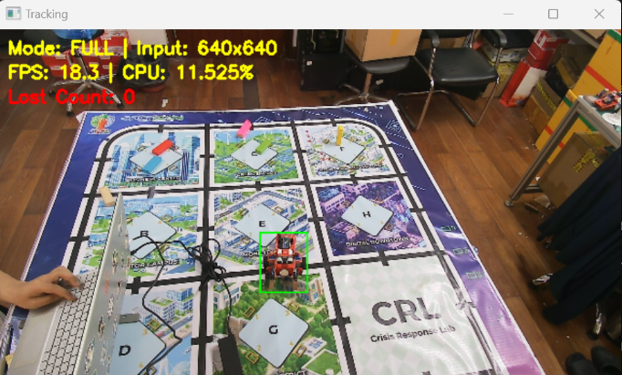
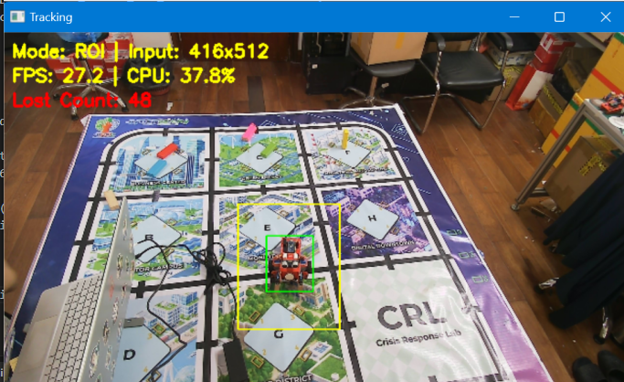
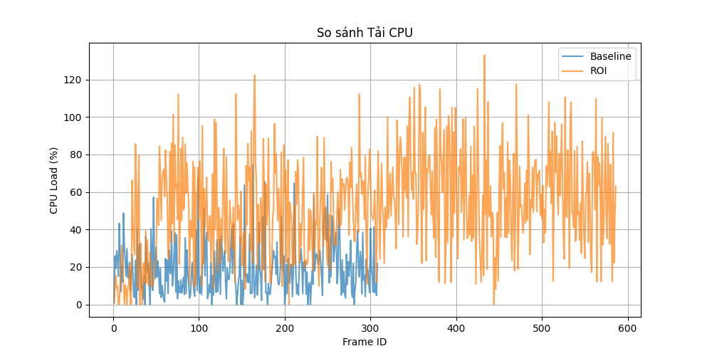
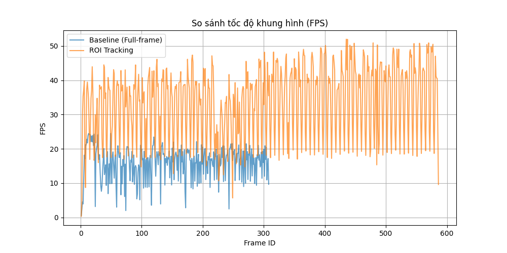
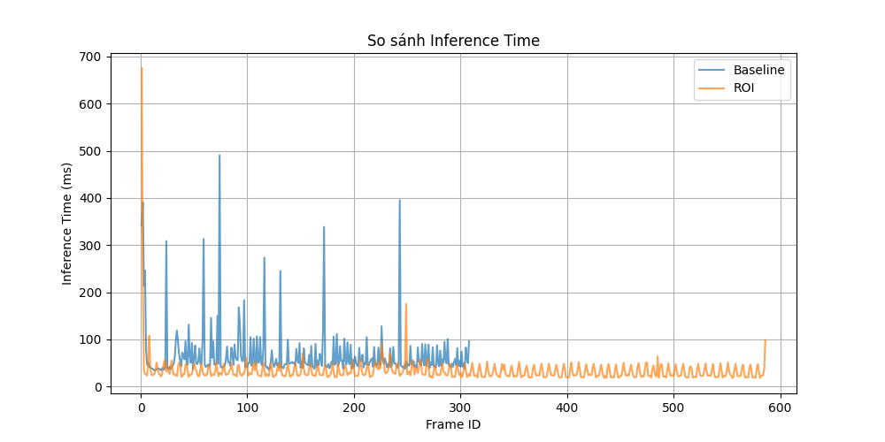

# Báo cáo công việc ngày 08/07/2026

## A. Công việc đã làm
1. Cấu hình và export model YOLO sang định dạng **OpenVINO FP16 Dynamic Input**.
2. Triển khai **Pipeline ROI Tracking Realtime** để model tập trugn nhận diện vùng có Leanbot
3. Giải quyết vấn đề vùng ROI vượt ra ngoài kích thước camera mà không cần sử dụng Letterbox/Padding.
4. Tạo code thu thập log (Logging) theo từng frame và phân tích (Benchmark) hiệu năng (CPU load, fps, frame size, inference time, total processing time)

### 1. Export Model OpenVINO Dynamic Input
- Kích thước đầu vào chuẩn của mô hình YOLO khi export tĩnh (Static) thường bị cố định ở kích thước `640x640`. Việc đưa ảnh có kích thước bất kỳ vào mạng Static sẽ đòi hỏi bước tiền xử lý ép kiểu (Resize/Padding)
- Sử dụng tham số `dynamic=True` để biên dịch mô hình với Tensor đầu vào linh hoạt `1x3xHxW`. Điều này cho phép OpenVINO Engine nhận diện chính xác các phân đoạn ảnh được cắt nhỏ từ thuật toán ROI mà không sinh lỗi. 

**Script sử dụng:** [tools/export_openvino_dynamic.py](tools/export_openvino_dynamic.py)
**Code trích dẫn:**
```python
openvino_path = model.export(
    format="openvino",
    imgsz=640,
    dynamic=True,  # Kích hoạt đồ thị tensor động
    half=True      # lượng tử hóa xuống Float16
)
```

**Lệnh thực thi:**
```bash
python tools/export_openvino_dynamic.py
```

### 2. Thuật toán ROI Tracking Realtime & Edge Handling
- **Quy trình hoạt động (State Machine):**
  - **Khởi tạo frame ROI:** Mô hình quét toàn bộ kích thước gốc của camera để tìm đối tượng. Nếu tìm thấy, trích xuất bounding box `(Center X, Center Y, Width, Height)`.
  - **ROI:** Tính toán vùng không gian xung quanh vật thể (tỷ lệ mở rộng `n = 2.0`) để dự đoán vị trí trong frame tiếp theo. Kích thước ROI được làm tròn lên thành bội số của 32 (`32N x 32N`) nhằm tối ưu cho các lớp Convolutional và Pooling của mạng YOLO.
  - **Giữ nguyên kích thước ROI:** Để model OpenVINO Engine không cần phải liên tục dịch detect rồi tính toán lại ROI thì kích thước ROI được khóa cố định trong `5 frames`sau đó lại update lại để đảm bảo bám theo Leanbot nếu Leanbot di chuyển. 
  - **ROI bị tràn biên:** Khi tọa độ khung ROI vượt quá biên của ma trận ảnh gốc thì tịnh tiến vector tọa độ lùi vào bên trong giới hạn hợp lệ để khôgn cần thêm Padding. 

  - **Fallback:** Nếu đối tượng trượt khỏi vùng ROI (Lost Tracking), hệ thống tự động tái lập trạng thái Khởi tạo (ROI-frame).

**Script thực thi:** [tools/roi_tracking_inference.py](tools/roi_tracking_inference.py)

**Thuật toán Edge Handling:**
```python
# Tịnh tiến vector tọa độ nếu tràn giới hạn
if x_min < 0:
    x_min = 0
elif x_min + roi_w_32 > img_w:
    x_min = img_w - roi_w_32
```

**Lệnh chạy để thu thập log :**
- Chạy 2 lần mỗi lần dữ liệu log csv được thu thập trong 30 giây : 
    - 1 lần cho Baseline không có ROI tracking, đưa ảnh từ Cam --> crop --> resize giống hệt nhưu lúc chạy inference webcam_infer.py .
    - 1 lần cho ROI Tracking. 

```bash
# Chạy ghi log Baseline
python tools/roi_tracking_inference.py --mode baseline --source 1 --log log_baseline.csv

# Chạy ghi log ROI Tracking
python tools/roi_tracking_inference.py --mode roi --source 1 --log log_roi.csv
```
- File csv được lưu tại : [benchmark/](benchmark/)
- Cấu tạo file csv gồm các trường dữ liệu (columns): 
  - `frame_id`, `timestamp`: Định danh thứ tự và thời gian của frame.
  - `mode`: Trạng thái xử lý (`FULL` hoặc `ROI`).
  - `input_width`, `input_height`: Kích thước không gian Tensor đầu vào (Ví dụ: `640x640` hoặc `224x192`).
  - `inf_time_ms`, `total_proc_time_ms`: Thời gian trễ suy luận AI và Tổng thời gian hoàn thiện 1 vòng lặp (Đơn vị: ms).
  - `cpu_load_pct`:  CPU load (%)
  - `fps`: đơn vị FPS
  - `center_x`, `center_y`, `width`, `height`, `angle`: Tọa độ tâm, diện tích và góc.
  - `lost_count`: Số lần bám mất dấu.
### 3. Thực nghiệm và đánh giá kết quả
- Thực nghiệm 2 phương pháp BaseLine và ROI Tracking với Leanbot đứng yên tại chỗ, chạy mỗi phương pháp 30s để thu thập log csv. 
- Vẽ đồ thị, so sánh kết quả 2 phương pháp


- Hình ảnh thực tế khi chạy Base line thôgn thường



- Hình ảnh thực tế khi chạy ROI Tracking, Khung màu vàng là khung ROI.



**Lệnh chạy đánh giá:**
*(Script tự động đọc dữ liệu trong thư mục `benchmark/` và sinh ra 4 ảnh đồ thị)*
```bash
python tools/compare_experiments.py --roi-log benchmark/log_roi.csv --baseline-log benchmark/log_baseline.csv
```

**Các tham số đo lường (Metrics)**
Bộ tham số đo lường được thu thập liên tục tại mỗi frame bằng thư viện `time` và `psutil`:
- **FPS (Frames Per Second):** Tốc độ khung hình thực tế đạt được.
- **Inference Time (ms):** Thời gian suy luận thuần túy của Engine OpenVINO, bỏ qua chi phí render hay đọc/ghi in out data
- **CPU Load (%):** Mức độ tiêu thụ CPU được cô lập độc lập (Isolated) cho riêng luồng tiến trình Python chạy AI (Sử dụng `psutil.Process()`). Phương pháp này khử hoàn toàn nhiễu từ các tác vụ nền của hệ điều hành. ( tức là đo CPU load mà ko liên quan gì tới các tác vụ khác trên máy tính )
- **Input Resolution:** Diện tích tính toán thực tế của Tensor truyền vào mạng neural (Tính bằng px²).
- **Fallback Count:** Số lần mất dấu ( Leanbot đi ra ngoài ROI) , đánh giá hệ số mở rộng `n` (hiện tại nhân với n=`2.0`).

**Đồ thị đánh giá như sau :**

> Trong các đồ thị bên dưới, đường màu xanh (Baseline) ngắn hơn so với đường màu vàng (ROI Tracking) trên trục ngang vì lý do là dù cả hai phương pháp đều được ghi log thực nghiệm trong cùng khoảng thời gian là **30 giây**, nhưng vì ROI Tracking có tốc độ xử lý FPS cao gấp đôi, nên tổng số lượng frame thu thập được trong 30 giây của ROI lớn hơn rất nhiều so với Baseline.

- Đồ thị CPU load

  

  - Mức tiêu thụ CPU của chế độ ROI Tracking cao hơn và dao động mạnh. Nguyên nhân có thể do hiện tượng mất dấu Leanbot khiến hệ thống liên tục chuyển đổi kích thước đầu vào (từ cắt ROI sang Toàn cảnh và ngược lại). Việc kích thước ảnh thay đổi liên tục buộc OpenVINO Engine phải biên dịch lại (Recompile) đồ thị AI trong lúc đang chạy.

- Đồ thị FPS

  

  - FPS của ROI Tracking cao hơn hẳn so với baseline (~33 FPS so với ~16 FPS)

- Đồ thị inference time:

  

  - Thời gian suy luận (độ trễ AI) của ROI Tracking giảm xuống chỉ còn khoảng một nửa so với Baseline (~33ms so với ~66ms). Cắt giảm không gian ảnh không cần thiết giúp mô hình AI xử lí nhanh hơn . 
**Bảng Kết Quả Thực Nghiệm (Trung Bình)**

| Metric | Chế độ Baseline | Chế độ ROI Tracking | Phân tích chênh lệch |
| :--- | :--- | :--- | :--- |
| **FPS** | 16.03 FPS | **33.12 FPS** | Tăng **~2.06 lần**  |
| **Inference Time**| 66.87 ms | **33.28 ms** | Giảm **~50%** độ trễ luồng xử lý |
| **CPU Load** | 19.17 % | 52.49 % | CPU load tăng khi ROI tracking |
| **Input Shape (W)** | 640.00 px | 449.26 px | Input shape giảm  |


**Đánh giá chung:**

1. **Về Hiệu năng và Tốc độ:** Pipeline ROI Tracking loại bỏ phần không gian thừa (background) và chỉ đưa vùng chứa đối tượng vào mạng Neural, khối lượng dữ liệu truyền tải giảm mạnh làm cho thời gian xử lý giảm và FPS tăng lên so với phương pháp chạy Toàn cảnh (Baseline).
2. **Về Quản lý Tài nguyên (CPU Load):** Pipeline này tiêu tốn nhiều tài nguyên CPU hơn. Nguyên nhân có thể là do hiện tượng vật thể thỉnh thoảng trượt khỏi khung ROI (Fallback), làm kích thước đầu vào (Input Shape) liên tục bị thay đổi. Đối với cấu trúc mạng Dynamic Shape của OpenVINO, mỗi lần thay đổi kích thước là một lần phải Recompile lại nhân xử lý, gây quá tải CPU.

## B. Khó khăn 
- Qua tìm hiểu lại thì em xin phép xác nhận lại với Thầy một số thông tin ạ . 
  - Kích thước ảnh đưa vào Model YOLO cần là bội số của 32, tuy nhiên đây là kích thước khi train model. Đối với inference thì có 2 mode static và dynamic khi export model sang FP16. Static mode thì đầu vào bắt buộc là kích thước đã set là 640x640. Còn nếu là mode Dynamic thì model có thể tự tùy chỉnh lại đồ thị để phù hợp với mọi kích thước ( không nhất thiết là bội số 32) tuy nhiên model sẽ cần một khoảng thời gian để khởi tạo lại đồ thị tính toán cho kích thước mới được cung cấp --> FPS giảm 

## C. Công việc tiếp theo
- Em xin phép nhận hướng đi tiếp theo từ Thầy ạ .