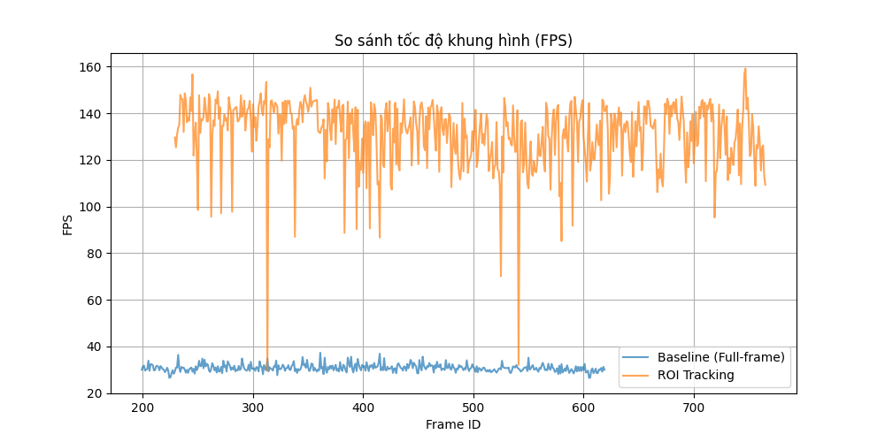
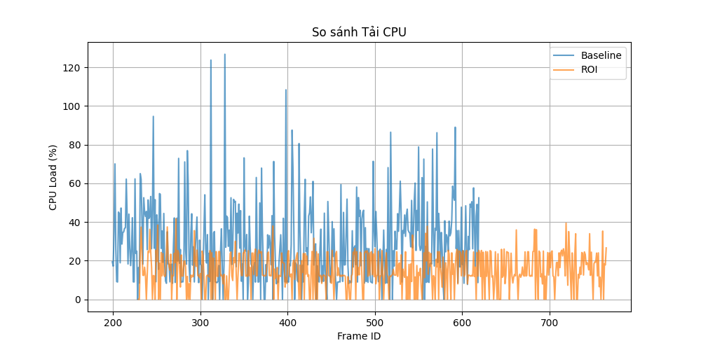
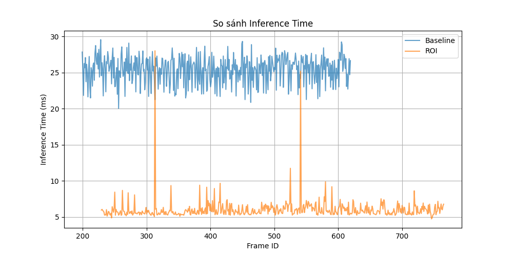

# Báo cáo công việc ngày 09/07/2026

## A. Công việc đã làm

- Export 2 model FP16 OpenVINO static mode ( static imgz = 640 và static imgz = 160)
- Thử nghiệm 2 model với 2 chế độ : 
  - Static imgz = 640 : full_frame detection model
  - Static imgz = 160 : ROI tracking detection model ( resize ROI trước khi đưa vào tracking model để inference)
- THử nghiệm với Leanbot chạy vòng tròn, ghi lại log, csv đánh dấu các frame bị lost tracking

### 1. Export 2 model FP16 OpenVINO static mode
- Mode static cố định input shape của OpenVINO model để tránh thay đổi graph theo kích thước ảnh đầu vào trong lúc inference.
- Tách 2 thử nghiệm inference:
  - model `640x640` xử lý toàn bộ frame;
  - model `160x160` xử lý vùng ROI đã crop từ ảnh gốc.

- **Model static** `640x640`

    - **Link model:** [`models/quantized_fp16/best_24Class_Soft_Angular_BCE_openvino_model/`](models/quantized_fp16/best_24Class_Soft_Angular_BCE_openvino_model/)
    - Input shape kiểm tra từ XML: `[1, 3, 640, 640]`
    - full_frame detection model.


**Code sử dụng:** export từ file `.pt` gốc sang OpenVINO FP16 static input `640x640`.

```python
from ultralytics import YOLO

model = YOLO("models/best_24Class_Soft_Angular_BCE.pt")
model.export(
    format="openvino",
    imgsz=640,
    half=True,
    dynamic=False
)
```

- **Model static** `160x160`
    - **Link model:** [`models/best_24Class_Soft_Angular_BCE_static_160_openvino_model/`](models/best_24Class_Soft_Angular_BCE_static_160_openvino_model/)
    - Input shape kiểm tra từ XML: `[1, 3, 160, 160]`
    - ROI tracking detection model.

**Code sử dụng:** export từ file `.pt` gốc sang OpenVINO FP16 static input `160x160`.

```python
from ultralytics import YOLO

model = YOLO("models/best_24Class_Soft_Angular_BCE_static_160.pt")
model.export(
    format="openvino",
    imgsz=160,
    half=True,
    dynamic=False
)
```

**Bảng kiểm tra shape**

| Model | Chế độ sử dụng | Input shape |
| --- | --- | --- |
| [`best_24Class_Soft_Angular_BCE.xml`](models/quantized_fp16/best_24Class_Soft_Angular_BCE_openvino_model/best_24Class_Soft_Angular_BCE.xml) | Full-frame detection | `[1, 3, 640, 640]` |
| [`best_24Class_Soft_Angular_BCE_static_160.xml`](models/best_24Class_Soft_Angular_BCE_static_160_openvino_model/best_24Class_Soft_Angular_BCE_static_160.xml) | ROI tracking detection | `[1, 3, 160, 160]` |


**Kiểm tra inference riêng từng model**

- Code sử dụng : [`tools/roi_tracking_inference.py`](tools/roi_tracking_inference.py)

- Log csv: [`benchmark/runtime_check_static_models_260709.csv`](benchmark/runtime_check_static_models_260709.csv)

- Ảnh kiểm tra: [`24class_test_images/002.jpg`](24class_test_images/002.jpg)
- Model `640x640`: chạy inference trực tiếp trên ảnh mẫu với `imgsz=640`.
- Model `160x160`: resize ảnh mẫu về `160x160`, sau đó chạy inference với `imgsz=160`.

| Model | Input test | Số lần chạy | Thời gian trung bình |
| --- | --- | --- | --- |
| `full_640_static` | `640x640` | 5 | `67.53 ms` |
| `tracking_160_static` | `160x160` | 5 | `11.96 ms` |

> Test dùng để kiểm tra model load và inference riêng lẻ trên ảnh mẫu. Kết quả này không thay thế thử nghiệm thực tế bằng camera và Leanbot chạy vòng tròn.

### 2. Thử nghiệm 2 model với 2 chế độ

- **Code inference dùng chung cho baseline và ROI tracking:** [`tools/roi_tracking_inference.py`](tools/roi_tracking_inference.py)
- Thử nghiệm với Leanbot di chuyển vòng tròn 360 độ. 

- Lệnh chạy baseline full-frame detection:
```bash
python tools/roi_tracking_inference.py --mode baseline --source 1 --log log_baseline_static.csv --show
```
  - Ảnh thực tế baseline full-frame :

  

- Lệnh chạy ROI tracking:

```bash
python tools/roi_tracking_inference.py --mode roi --source 1 --log log_roi_static.csv --show
```
  - Ảnh thực tế ROI tracking:
  
  

#### 2.1. Các bước xử lí trong ROI tracking inference

- Frame đầu tiên hoặc frame fallback dùng model static `640x640` để detect Leanbot trên toàn ảnh.
- Bbox phát hiện được dùng để tạo ROI cho các frame tiếp theo.
- ROI được crop từ ảnh gốc, sau đó resize về `160x160`.
- Model static `160x160` inference trên ROI đã resize.
- Bbox output trong tọa độ `160x160` được scale ngược về kích thước ROI gốc.
- Offset ROI được cộng vào bbox để đưa kết quả về tọa độ toàn ảnh.
- ROI được giữ theo chu kỳ 5 frame trước khi cập nhật lại theo bbox mới.
- Nếu model ROI không phát hiện được Leanbot thì pipeline quay lại model full-frame `640x640`.

#### 2.2. Cấu trúc các categories log CSV
- Log baseline: [`benchmark/log_baseline_static.csv`](benchmark/log_baseline_static.csv)
- Log ROI tracking: [`benchmark/log_roi_static.csv`](benchmark/log_roi_static.csv)

Trong đó:
- `frame_id`: số thứ tự frame.
- `timestamp`: thời điểm ghi nhận frame.
- `mode`: chế độ inference, gồm `FULL` hoặc `ROI`.
- `input_width`, `input_height`: kích thước tensor đưa vào model.
- `inf_time_ms`: thời gian inference.
- `total_proc_time_ms`: tổng thời gian xử lý một vòng lặp.
- `cpu_load_pct`: CPU load của tiến trình Python.
- `fps`: tốc độ xử lý frame.
- `center_x`, `center_y`: tọa độ tâm bbox trên ảnh gốc.
- `width`, `height`: kích thước bbox trên ảnh gốc.
- `angle`: góc suy luận từ class/vector hiện tại.
- `tracking_lost`: cờ đánh dấu frame hiện tại có bị lost tracking hay không (`1` là lost, `0` là không lost).

#### 2.3. Đồ thị so sánh từ log mới

Từ dữ liệu log, sử dụng script [`tools/compare_experiments.py`](tools/compare_experiments.py) để vẽ các đồ thị đánh giá.

**Lệnh tạo đồ thị:**

```bash
python tools/compare_experiments.py --baseline-log benchmark/log_baseline_static.csv --roi-log benchmark/log_roi_static.csv --out-dir benchmark/static_compare_test
```

**Bảng đánh giá trung bình:**

| Metric | Baseline static `640x640` | ROI static `160x160` |
| --- | ---: | ---: |
| FPS trung bình ước tính | `30.79 FPS` | `131.34 FPS` |
| Inference time trung bình | `25.38 ms` | `6.02 ms` |
| CPU load trung bình | `29.27 %` | `14.95 %` |
| `tracking_lost` | `0 frame` | `2 frame` |

**Đồ thị so sánh FPS**



**Đồ thị so sánh CPU Load**



**Đồ thị so sánh inference time**



## B. Khó khăn

- Không

## C. Công việc tiếp theo
- Em có cần chỉnh sửa log csv để lấy ra cả góc để đánh giá đồ thị góc theo thời gian khi chạy test 2 model static 640 và 160 + ROI tracking không ạ ? 
- Em xin phép nhận hướng đi tiếp theo từ Thầy ạ.