# Báo cáo công việc ngày 10/07/2026

## A. Công việc đã làm
- Chỉnh sửa lại code, thực hiện đúng pipeline để đánh giá Full frame model và ROI tracking model .
- Thử giảm Camera resolution từ 2K (2560x1440) xuống 1280x720 và đánh giá kết quả. 


### 1. Pipeline xử lí . 
#### 1.1 **Baseline Model Full frame ( 640x640 )**
- Link code thực hiện: [tools/roi_tracking_baseline_infer.py](tools/roi_tracking_baseline_infer.py)
- Model sử dụng : [models\quantized_fp16\best_24Class_Soft_Angular_BCE_openvino_model](models\quantized_fp16\best_24Class_Soft_Angular_BCE_openvino_model)
- Lệnh chạy:
```bash
python tools/roi_tracking_baseline_infer.py --mode baseline --source 1 --width 2560 --height 1440 --log log_baseline_2k.csv --show
```
- Log csv: [benchmark/log_baseline_2k.csv](benchmark/log_baseline_2k.csv)

- Luồng xử lí: Camera 2560x1440 → center crop 1440x1440 → resize 640x640 → Full model static 640x640 → restore bbox về tọa độ ảnh gốc 2560x1440. 

- Ảnh chạy thực tế :

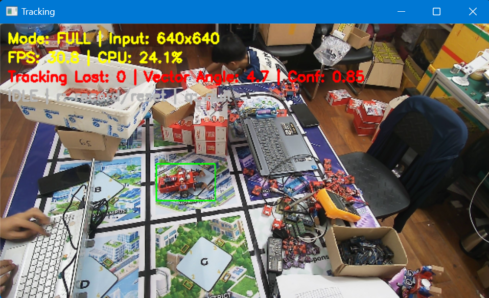

#### 1.2 **ROI Tracking model ( 160x160 )**
- Link code thực hiện: [tools/roi_tracking_baseline_infer.py](tools/roi_tracking_baseline_infer.py)
- Model sử dụng : [models\best_24Class_Soft_Angular_BCE_static_160_openvino_model](models\best_24Class_Soft_Angular_BCE_static_160_openvino_model)
- Lệnh chạy:
```bash
python tools/roi_tracking_baseline_infer.py --mode roi --source 1 --width 2560 --height 1440 --log log_roi_tracking_2k.csv --show
```
- Log csv: [benchmark/log_roi_tracking_2k.csv](benchmark/log_roi_tracking_2k.csv) 

- Luồng xử lí: Full model khởi tạo bbox → tính ROI vuông NxN trên ảnh gốc 2560x1440 → crop ROI → resize 160x160 → Tracking model static 160x160 → restore bbox về ảnh gốc → cập nhật ROI mỗi frame.
- Flowchart chi tiết của ROI tracking:

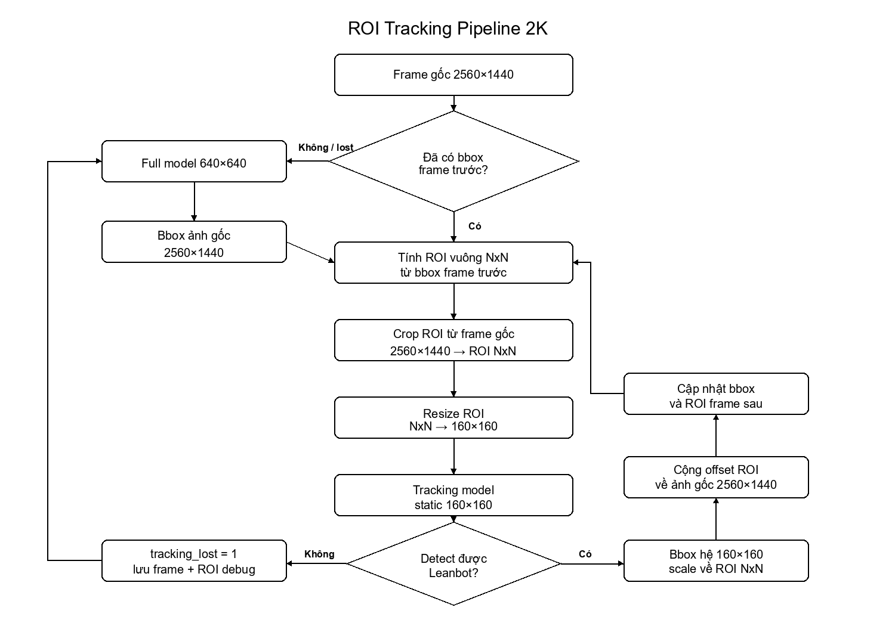
  
- Ảnh chạy thực tế : 

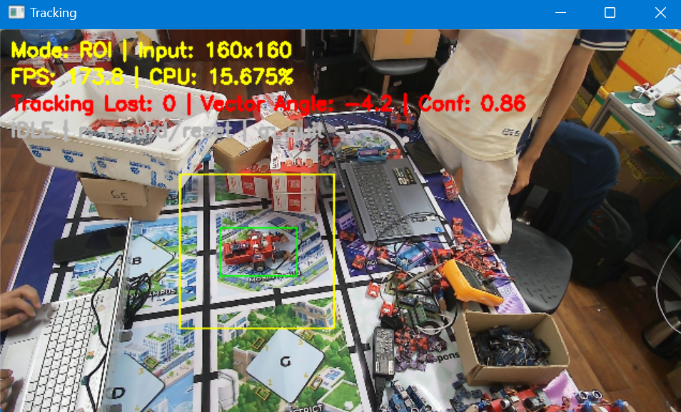

#### 1.3 Benchmark 2 model Baseline Full frame model vs ROI Tracking model
- Thực hiện đánh giá 2 model với Camera chạy realtime với Leanbot chạy vòng tròn. 
- Link code thực hiện vẽ đồ thị: [tools/plot_log.py](tools/plot_log.py)

- Link log csv:
  - Baseline Full frame: [benchmark/log_baseline_2k.csv](benchmark/log_baseline_2k.csv)
  - ROI Tracking: [benchmark/log_roi_tracking_2k.csv](benchmark/log_roi_tracking_2k.csv)

- Lệnh vẽ đồ thị cho toàn bộ log trong thư mục `benchmark`:
```bash
python tools/plot_log.py benchmark
```
- Đồ thị đánh giá : 

> `FPS` trong bảng/đồ thị là FPS xử lý ước tính, tính bằng `1000 / processing_time_ms` (thời gian đơn vị mili-giây). Khoảng thời gian này bắt đầu sau khi `cap.read()` đã đọc được frame và kết thúc sau các bước : crop/resize → OpenVINO model inference → restore bbox → tính vector angle → cập nhật ROI → vẽ bbox.

**Đồ thị CPU load**:

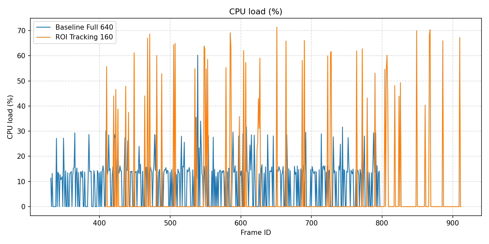

Nhận xét: ROI Tracking có CPU load trung bình thấp hơn Baseline do chỉ inference trên vùng ROI 160x160 ở phần lớn frame.

**Đồ thị FPS ước tính**:

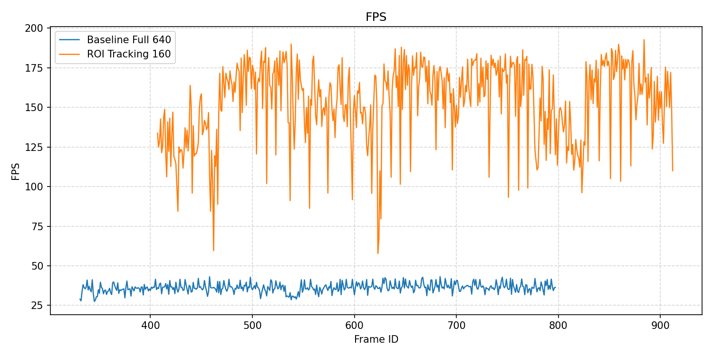

Nhận xét: FPS xử lý ước tính của ROI Tracking cao hơn rõ rệt, dao động quanh mức 150-155 FPS so với khoảng 35-40 FPS của Baseline.

**Đồ thị Inference time**:

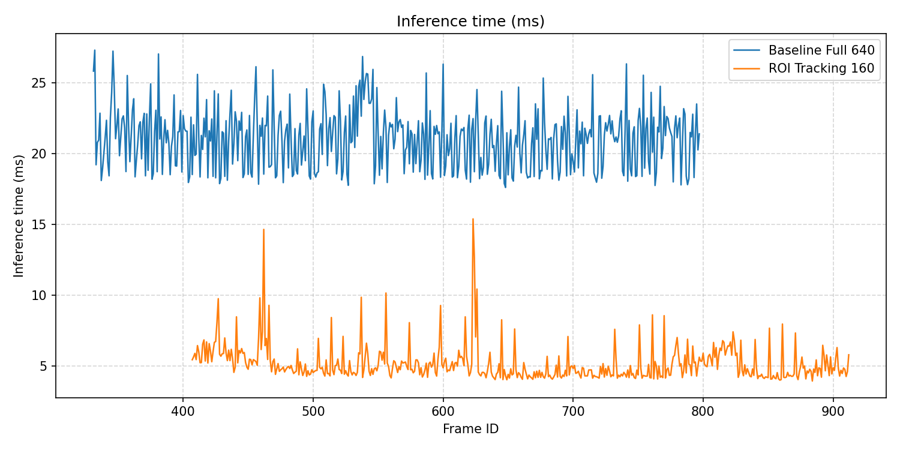

Nhận xét: ROI Tracking giảm inference time từ khoảng 20-22 ms xuống khoảng 5-6 ms.

**Đồ thị End-to-end processing time**:

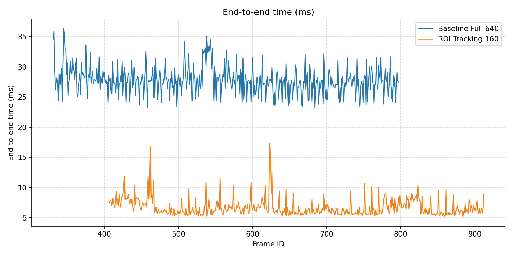

Nhận xét: Thời gian xử lý đo trong vòng lặp giảm từ khoảng 27-28 ms xuống khoảng 6-7 ms khi dùng ROI Tracking.

**Đồ thị Angle và X,Y_center theo thời gian**:

Baseline Full frame:

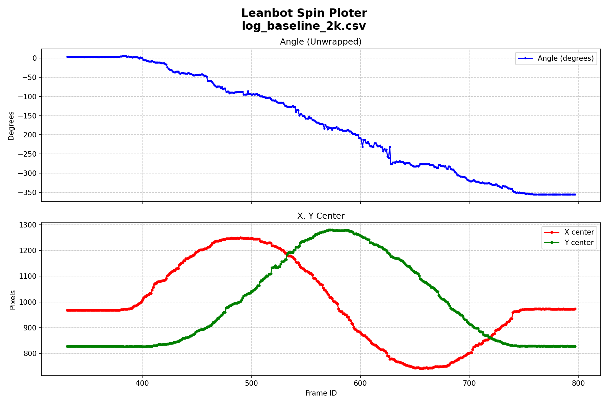

Nhận xét: Baseline Full frame giữ được tín hiệu góc và tâm bbox liên tục trong quá trình Leanbot chạy vòng tròn.

ROI Tracking:

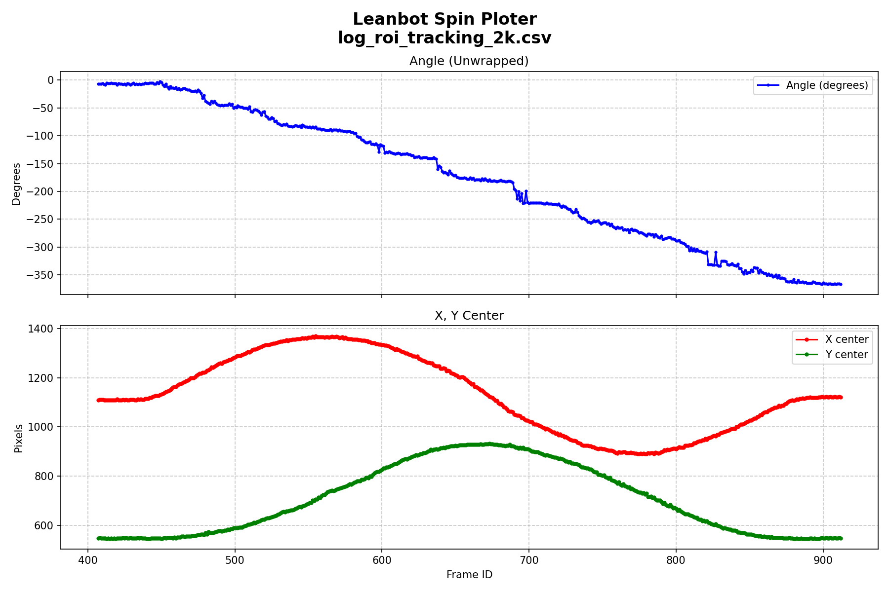

Nhận xét: ROI Tracking vẫn giữ được đồ thị angle và X,Y center ổn định, không xuất hiện mất tracking trong log này.

**Đồ thị số frame lost tracking**:

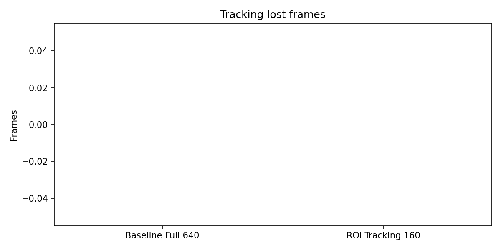

Nhận xét: Cả Baseline và ROI Tracking đều có số frame lost tracking bằng 0 trong thử nghiệm 2K.

**Bảng so sánh tổng hợp Baseline vs ROI Tracking**:

| Metric | Baseline Full frame 640x640 | ROI Tracking 160x160 | Nhận xét |
|---|---:|---:|---|
| FPS xử lý ước tính trung bình | 36.24 | 153.47 | ROI nhanh hơn ~4 lần |
| CPU load trung bình | 9.65% | 5.95% | ROI CPU load thấp hơn |
| Inference time trung bình | 21.04 ms | 5.17 ms | ROI giảm inference time |
| End-to-end time trung bình | 27.78 ms | 6.74 ms | ROI giảm thời gian xử lý |
| Số frame tracking lost | 0 | 0 | Cả hai chế độ không mất tracking trong lần đánh giá này|

#### 1.4 Thử đánh giá lại với độ phân giải giảm từ 2k (2560x1440) xuống 1280x720.
- Link code thực hiện: [tools/roi_tracking_baseline_infer.py](tools/roi_tracking_baseline_infer.py)
- Chỉnh sửa code: đã bổ sung tham số `--width` và `--height`; mặc định hiện tại là `1280x720`. Khi muốn chạy lại 2K thì truyền `--width 2560 --height 1440`.
```python
# tọa param đầu vào cho width và height
parser.add_argument("--width", type=int, default=1280, help="Chieu rong camera mong muon")
parser.add_argument("--height", type=int, default=720, help="Chieu cao camera mong muon")
# set width và height cho camera
cap.set(cv2.CAP_PROP_FRAME_WIDTH, args.width)
cap.set(cv2.CAP_PROP_FRAME_HEIGHT, args.height)
``` 
- Full model vẫn phải dùng `training_style_crop_pad(frame)` để center crop về ảnh vuông trước khi resize 640x640, tránh resize trực tiếp 1280x720 về 640x640 làm méo ảnh.
- Lệnh chạy Baseline 1280x720:
```bash
python tools/roi_tracking_baseline_infer.py --mode baseline --source 1 --width 1280 --height 720 --log log_baseline_720p.csv --show
```
- Lệnh chạy ROI Tracking 1280x720:
```bash
python tools/roi_tracking_baseline_infer.py --mode roi --source 1 --width 1280 --height 720 --log log_roi_tracking_720p.csv --show
```
- Log csv:
  - [benchmark/log_baseline_720p.csv](benchmark/log_baseline_720p.csv)
  - [benchmark/log_roi_tracking_720p.csv](benchmark/log_roi_tracking_720p.csv)
- Các bước biến đổi kích thước frame ảnh :
  - Baseline Full frame Model : 1280x720
  - Full model : 1280x720 → center crop 720x720 → resize 640x640 → YOLO detect → bbox 640x640 → scale về 720x720 → cộng offset về 1280x720
  - ROI Tracking Model : 1280x720 → crop ROI vuông NxN → resize 160x160 → YOLO detect → bbox 160x160 → scale về ROI NxN → cộng offset ROI về 1280x720


**Đồ thị CPU load 1280x720**:

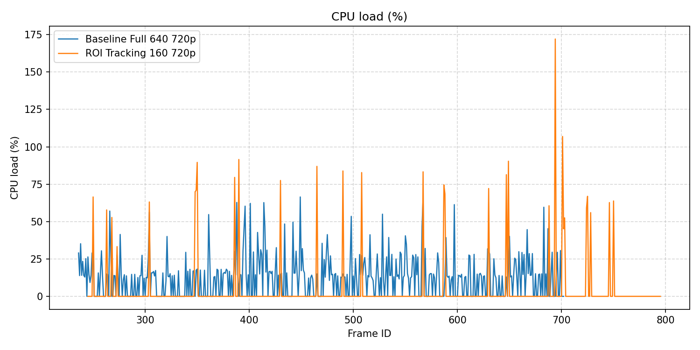

Nhận xét: Ở 1280x720, ROI Tracking có CPU load thấp hơn Baseline, khoảng 4% so với khoảng 12-13%.

**Đồ thị FPS xử lý ước tính 1280x720**:

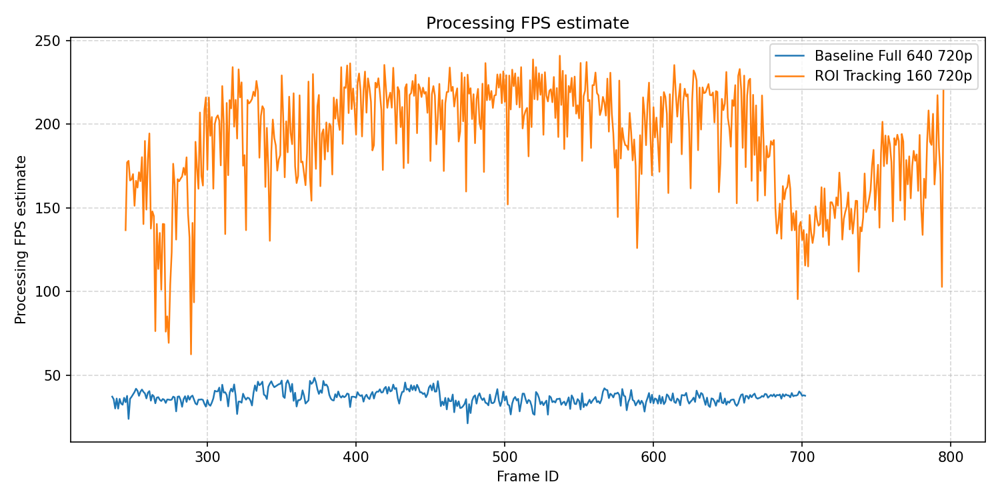

Nhận xét: FPS xử lý ước tính tăng từ khoảng 35-40 FPS ở Baseline lên khoảng 185-195 FPS khi dùng ROI Tracking.

**Đồ thị Inference time 1280x720**:

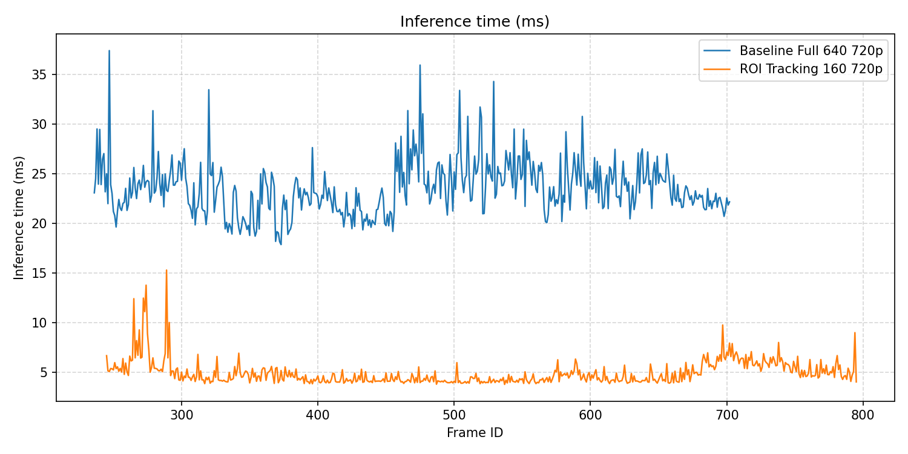

Nhận xét: Inference time giảm từ khoảng 23-24 ms xuống khoảng 4-5 ms khi chuyển sang ROI Tracking 160x160.

**Đồ thị Processing time 1280x720**:

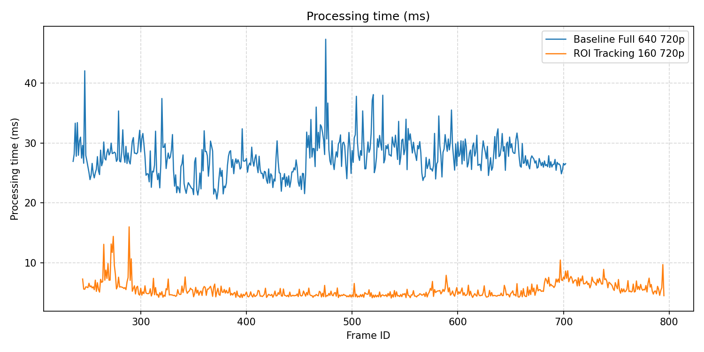

Nhận xét: Processing time giảm từ khoảng 27-28 ms xuống khoảng 5-6 ms.

**Đồ thị Angle và X,Y_center 1280x720**:

Baseline Full frame:

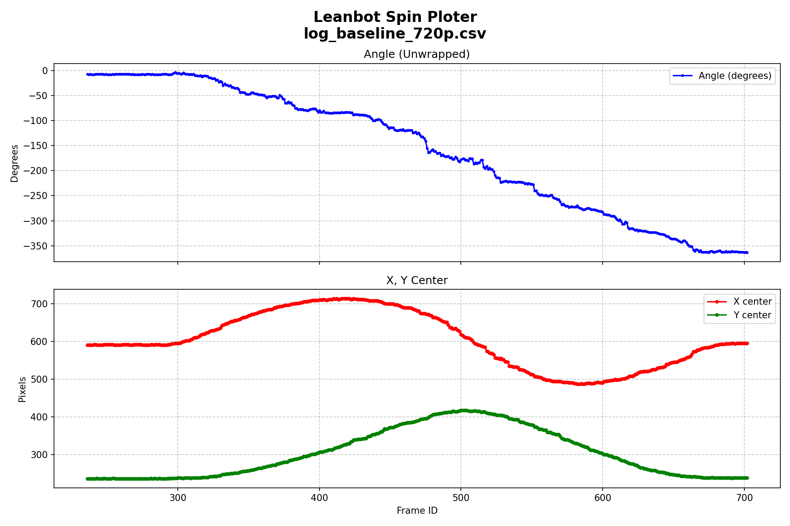

Nhận xét: Baseline 1280x720 vẫn theo dõi được góc và tâm bbox, không mất tracking trong log. Tuy nhiên đồ thị không được mượt lắm ( góc có dao động).

ROI Tracking:

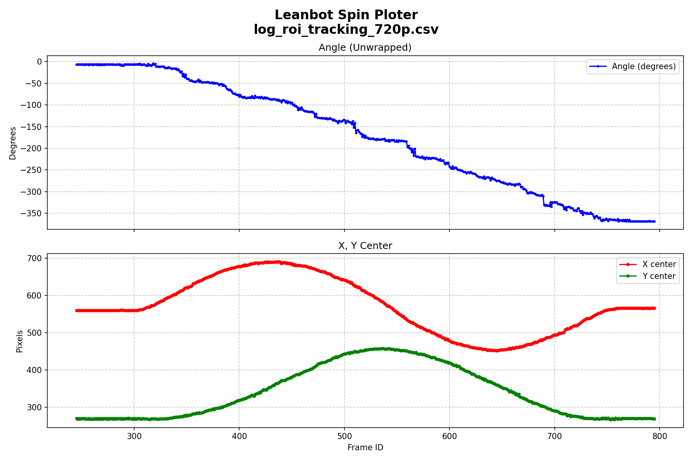

Nhận xét: ROI Tracking 1280x720 vẫn giữ được tín hiệu angle và center ổn định. Tuy nhiên cũng có giao động góc giống basline.

**Đồ thị số frame lost tracking 1280x720**:

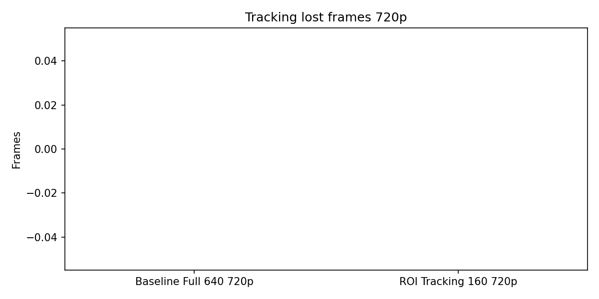

Nhận xét: Không ghi nhận frame lost tracking ở cả Baseline và ROI Tracking trong thử nghiệm 1280x720.

**Bảng so sánh tổng hợp 1280x720**:

| Metric | Baseline Full frame 640x640 | ROI Tracking 160x160 | Nhận xét |
|---|---:|---:|---|
| FPS xử lý ước tính trung bình | 36.76 | 190.26 | ROI nhanh hơn khoảng ~5 lần |
| CPU load trung bình | 12.66% | 4.03% | ROI giảm tải CPU |
| Inference time trung bình | 23.51 ms | 4.91 ms | ROI giảm thời gian inference |
| Processing time trung bình | 27.54 ms | 5.47 ms | ROI giảm thời gian xử lý |
| Số frame tracking lost | 0 | 0 | Cả hai chế độ không mất tracking trong log này |
    


## B. Khó khăn 
- Không

## C. Công việc tiếp theo 
- Hiện tại khi em chạy 2 mode (Full frame baseline và ROI tracking ) thì em đều tiến hành chạy lại Leanbot nên dữ liệu đầu vào đánh giá có thể không đồng nhất ạ 
- Em có nên quay video Leanbot di chuyển vòng tròn bằng Cam, rồi về sau chỉ dùng 1 video đó để đánh giá không ạ ? 
- Em xin phép nhận hướng đi tiếp theo từ Thầy ạ.
