# Báo cáo công việc ngày 13/07/2026

## A. Công việc đã làm
- Trong quá trình đợi hướng đi tiếp theo từ Thầy thì em có tổng quát lại một vài thông tin hiện tại như sau ạ :
  - Báo cáo lại quy trình crop, resize, các bước thay đổi kích thước, độ phân giải ảnh qua toàn bộ pipeline hiện tại.
  - Thêm log kích thước ROI trước resize và tọa độ tâm ROI để kiểm tra ROI có bị resize méo hay không. 
- TÌm hiểu và so sánh YoloV8 nano và YoloV11 nano về khả năng triển khai cho dự án hiện tại và tính hiệu quả dự đoán.
- Train lại với Model YOLO11 Nano 
- Hệ thống hóa, báo cáo lại các thông tin : Soft cross Entropy loss, dataAugmentation , Hyperparameters . Đánh giá kết quả training 
### 1. Các bước biến đổi kích thước, độ phân giải ảnh hiện tại.
#### 1.1 Qua trình train model YOLO. 
- Ảnh đầu vào : 2K ( 2560x1440 )
  - crop vùng giữa ảnh theo tỉ lệ `62.5%` chiều rộng, giữ nguyên chiều cao : 1600x1440
  - pad thành ảnh vuông : 1600x1600
  - resize về `640x640`.
  - Sau đó đưa vào model để Train.
  
#### 1.2 Khi chạy inference
- Với ảnh `2560x1440`:
  - crop giữa: `1600x1440`,
  - pad vuông: `1600x1600`,
  - resize: `640x640`.
    - Detect ROI --> crop ROI --> resize ROI `160x160`--> convert về 2K để hiển thị.

- Với ảnh `1280 x 720`:
  - crop giữa: `800x720`,
  - pad vuông: `800x800`,
  - resize: `640x640`.
    - Detect ROI --> crop ROI --> resize ROI `160x160` --> convert về 1280x720 để hiển thị:
    

### 2. Thêm 2 cột size width và height của ROI trước khi resize

- Trước đó Thầy yêu cầu log thêm size của ROI để kiểm tra ROI là hình vuông trước khi resize, tránh méo ảnh do tỉ lệ không vuông.

- Logic tính ROI hiện tại:

```python
def calculate_roi(bbox, img_w, img_h):
    # bbox là tọa độ Leanbot ở frame trước, theo hệ tọa độ ảnh gốc
    x1, y1, x2, y2 = bbox

    # Tính width, height và tâm của bbox
    w = x2 - x1
    h = y2 - y1
    cx = x1 + w / 2.0
    cy = y1 + h / 2.0

    # ROI phải là hình vuông để khi resize về 160x160 không bị méo
    # Lấy cạnh ROI = 2 lần cạnh lớn hơn của bbox để bao trùm Leanbot
    # Làm tròn lên bội số của 32 để phù hợp với YOLO/OpenVINO
    roi_side = make_multiple_of_32(max(w, h) * 2.0)

    # Không cho ROI lớn hơn kích thước ảnh gốc
    roi_side = min(roi_side, img_w, img_h)

    # Tính góc trái-trên của ROI sao cho tâm ROI trùng với tâm bbox
    x_min = int(cx - roi_side / 2.0)
    y_min = int(cy - roi_side / 2.0)

    # Nếu ROI vượt mép trái/phải ảnh thì kéo ROI vào trong ảnh
    if x_min < 0:
        x_min = 0
    elif x_min + roi_side > img_w:
        x_min = img_w - roi_side

    # Nếu ROI vượt mép trên/dưới ảnh thì kéo ROI vào trong ảnh
    if y_min < 0:
        y_min = 0
    elif y_min + roi_side > img_h:
        y_min = img_h - roi_side

    # Trả về ROI dạng: x, y, width, height
    # width = height = roi_side nên ROI luôn là hình vuông
    return x_min, y_min, roi_side, roi_side
```

- ROI luôn được crop trực tiếp từ frame gốc hiện tại, sau đó resize một lần về `160x160` cho tracking model:

```python
roi_input = frame[ry:ry+rh, rx:rx+rw]
inference_input = cv2.resize(roi_input, (160, 160))
roi_scale_x = rw / 160.0
roi_scale_y = rh / 160.0
```

- Thêm log width/height và tọa độ tâm ROI trước resize:

```python
roi_center_x = rx + rw / 2.0
roi_center_y = ry + rh / 2.0
roi_pre_width, roi_pre_height = rw, rh
```

- Header CSV categories mới được rút gọn, chỉ giữ các cột cần cho kiểm tra ROI:

```python
"roi_center_x", "roi_center_y", "roi_pre_width", "roi_pre_height"
```


### 3. So sánh YOLOv8 nano và YOLO11 nano

> Nguồn chính dùng để đối chiếu: tài liệu Ultralytics YOLO11, YOLOv8, trang so sánh YOLO11 vs YOLOv8, file cấu hình model YAML chính thức trên GitHub Ultralytics và tài liệu export OpenVINO.
- Link tài liệu Yolo11 tổng quan: [https://docs.ultralytics.com/vi/models/yolo11](https://docs.ultralytics.com/vi/models/yolo11)
- Link tài liệu benchmark, so sánh yolo11 và yolo8: [https://docs.ultralytics.com/compare/yolo8-vs-yolo11](https://docs.ultralytics.com/compare/yolo8-vs-yolo11)

#### 3.1 Kiến trúc mạng (Backbone, Neck, Head)

- YOLOv8n dùng kiến trúc họ YOLOv8 với các block `C2f`, `SPPF`, neck kiểu FPN/PAN và detection head anchor-free.

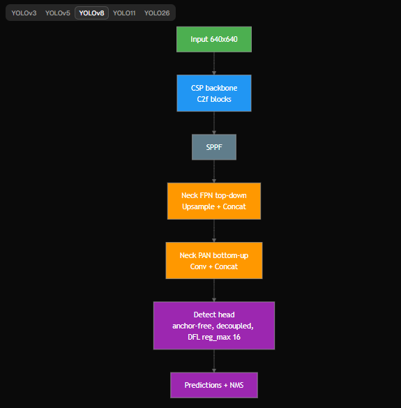

- YOLO11n là bản cải tiến sau YOLOv8, dùng block `C3k2` và thêm attention `C2PSA` để **tăng khả năng trích xuất đặc trưng**.

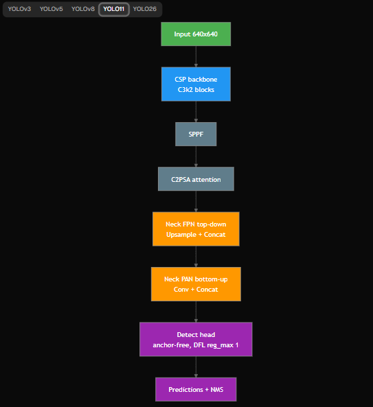

- Theo trang giải thích kiến trúc của Ultralytics, YOLOv8 chuyển sang `C2f` và anchor-free head; YOLO11 thêm `C2PSA` attention và `C3k2` block, trong khi neck vẫn giữ hướng FPN + PAN.

Nguồn:
- Ultralytics YOLO Architecture Explained: https://docs.ultralytics.com/guides/yolo-architecture/
- YOLO11 YAML chính thức, có `C3k2`, `SPPF`, `C2PSA`, `Detect(P3, P4, P5)`: https://github.com/ultralytics/ultralytics/blob/main/ultralytics/cfg/models/11/yolo11.yaml
- YOLOv8 YAML chính thức, YOLOv8n summary và cấu trúc model: https://github.com/ultralytics/ultralytics/blob/main/ultralytics/cfg/models/v8/yolov8.yaml

#### 3.2 Tốc độ Inference (FPS, Latency)

- Theo benchmark chính thức của Ultralytics trên CPU ONNX, YOLO11n nhanh hơn YOLOv8n:
  - YOLO11n: `56.1 ms` CPU ONNX.
  - YOLOv8n: `80.4 ms` CPU ONNX.
- Tính tương đối từ số liệu chính thức:
  - YOLO11n nhanh hơn khoảng `80.4 / 56.1 = 1.43x` trên benchmark CPU ONNX.
  - FPS lý thuyết CPU ONNX: YOLO11n khoảng `17.8 FPS`, YOLOv8n khoảng `12.4 FPS`.

> Benchmark đánh giá lý thuyết trên máy cấu hình cao, không phản ánh hiệu năng thực tế trên Intel i3-1115G4 và sử dụng OpenVINO. 

Nguồn:
- Ultralytics YOLO11 vs YOLOv8 comparison, bảng Performance and Benchmarks: https://docs.ultralytics.com/compare/yolo11-vs-yolov8/

#### 3.3 Độ chính xác (mAP)

- Theo COCO benchmark chính thức của Ultralytics:
  - YOLO11n: `mAP50-95 = 39.5`.
  - YOLOv8n: `mAP50-95 = 37.3`.
- YOLO11n cao hơn YOLOv8n khoảng `+2.2 mAP` trên COCO.

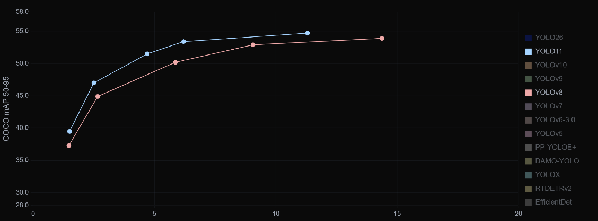

> Đây chỉ là COCO benchmark. Với dữ liệu Leanbot 24 class, cần train lại YOLO11n cùng dataset, cùng crop/resize, cùng hyperparameters rồi so sánh trực tiếp với YOLOv8n hiện tại.

Nguồn:
- Ultralytics YOLO11 vs YOLOv8 comparison: https://docs.ultralytics.com/compare/yolo11-vs-yolov8/
- Ultralytics YOLOv8 docs, YOLOv8n mAP COCO: https://docs.ultralytics.com/models/yolov8/
- Ultralytics YOLO11 docs: https://docs.ultralytics.com/models/yolo11/

#### 3.4 Kích thước Model (số tham số, FLOPs, dung lượng file)

- Theo bảng chính thức của Ultralytics:
  - YOLO11n: `2.6M params`, `6.5B FLOPs`.
  - YOLOv8n: `3.2M params`, `8.7B FLOPs`.
- Theo đó YOLO11n nhẹ hơn:
  - Parameters giảm khoảng `(3.2 - 2.6) / 3.2 = 18.75%`.
  - FLOPs giảm khoảng `(8.7 - 6.5) / 8.7 = 25.3%`.

Nguồn:
- Ultralytics YOLO11 vs YOLOv8 comparison: https://docs.ultralytics.com/compare/yolo11-vs-yolov8/
- YOLO11 YAML chính thức ghi YOLO11n summary `181 layers`, `2,624,080 parameters`, `6.6 GFLOPs`: https://github.com/ultralytics/ultralytics/blob/main/ultralytics/cfg/models/11/yolo11.yaml
- theo YOLOv8 YAML YOLOv8n summary có `129 layers`, `3,157,200 parameters`, `8.9 GFLOPs`: https://github.com/ultralytics/ultralytics/blob/main/ultralytics/cfg/models/v8/yolov8.yaml

#### 3.5 Khả năng Export sang OpenVINO FP16

- Ultralytics vẫn hỗ trợ export sang OpenVINO thông qua `model.export(format="openvino")`.
- Tài liệu export OpenVINO cho biết OpenVINO format hỗ trợ các mode Export, Predict, Validate.
- Tham số export có `imgsz`, `dynamic`, `nms`, `batch`, `data`, `device`; `imgsz` có thể là số nguyên cho ảnh vuông hoặc tuple `(height, width)`.
- Bảng export của Ultralytics ghi OpenVINO hỗ trợ FP32, FP16 và INT8. 
> Việc phù hợp cho dự án hiện tại khi export sang OpenVINO vẫn thích hợp

Lệnh export:

```python
from ultralytics import YOLO

model = YOLO("yolo11n.pt")
model.export(format="openvino", imgsz=640, dynamic=False, quantize=16)
```
#### 3.6 Kết luận khảo sát ban đầu

- Theo benchmark chính thức, YOLO11n có lợi thế hơn YOLOv8n về COCO mAP, số tham số, FLOPs và CPU ONNX latency và khả năng phát hiện vật thể nhỏ, ở xa.
- Tuy nhiên, với bài toán Leanbot hiện tại, chưa thể kết luận hoàn toàn YOLO11n tốt hơn nếu chưa train lại và benchmark trên pipeline thật.

Bảng tóm tắt từ benchmark Ultralytics:

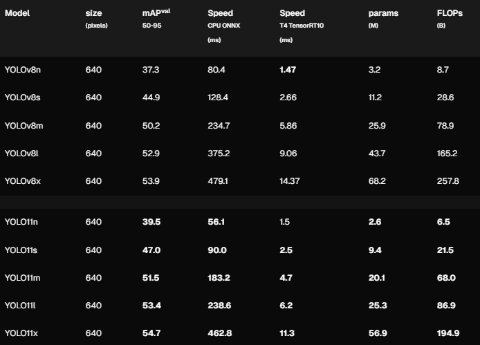


### 4. Triển khai train lại với Model YOLO11n

#### 4.1. Thông tin training

| Thông số | Giá trị thực tế |
| :--- | :--- |
| Model nền tảng | `yolo11n.pt` - YOLO11 Nano, pretrained COCO |
| Task | Object Detection |
| Số class | `24` |
| Class | `Leanbot_0`, `Leanbot_p15`, `Leanbot_p30`, `Leanbot_p45`, `Leanbot_p60`, `Leanbot_p75`, `Leanbot_p90`, `Leanbot_p105`, `Leanbot_p120`, `Leanbot_p135`, `Leanbot_p150`, `Leanbot_p165`, `Leanbot_p180`, `Leanbot_p195`, `Leanbot_m150`, `Leanbot_m135`, `Leanbot_m120`, `Leanbot_m105`, `Leanbot_m90`, `Leanbot_m75`, `Leanbot_m60`, `Leanbot_m45`, `Leanbot_m30`, `Leanbot_m15` |
| Dataset gốc | `datasets/24class` |
| Dataset split | `72` ảnh train, `24` ảnh validation, `24` ảnh test |
| Tổng dữ liệu | `120` ảnh, `24` class, mỗi class `5` ảnh |
| Epochs | `150` |
| Batch size | `16` |
| Image size | `640 x 640` |
| Optimizer | `optimizer=auto` |
| Custom loss | Soft Angular BCE |
| Sigma | `15.0` |
| Augmentation chính | `degrees=10.0`, `fliplr=0.0`, `flipud=0.0`, `mosaic=1.0`, `scale=0.5`, `translate=0.1` |
| Môi trường training | Google Colab, GPU runtime |
| Thời gian training | `299.844 s`, ~5.0 phút |
| Output | `trainResults` |
| Best model | `trainResults/best.pt` |

Kết quả train YOLO11n được lưu trong thư mục: [trainResults](trainResults/).

Các file chính trong thư mục kết quả:
- [best.pt](trainResults/best.pt): model tốt nhất sau training.
- [results.csv](trainResults/results.csv): log loss, precision, recall, mAP theo từng epoch.
- [results.png](trainResults/results.png): biểu đồ tổng hợp quá trình training.
- [confusion_matrix.png](trainResults/confusion_matrix.png), [confusion_matrix_normalized.png](trainResults/confusion_matrix_normalized.png): ma trận nhầm lẫn.
- [BoxP_curve.png](trainResults/BoxP_curve.png), [BoxR_curve.png](trainResults/BoxR_curve.png), [BoxF1_curve.png](trainResults/BoxF1_curve.png), [BoxPR_curve.png](trainResults/BoxPR_curve.png): các đường metric theo confidence.

#### 4.1.1. Custom loss Soft Angular BCE

| Nội dung | Cấu hình |
| :--- | :--- |
| Loss gốc của YOLO | BCE cho classification target |
| Loss chỉnh sửa | Soft Angular BCE |
| Vị trí chỉnh sửa | Bọc lại `v8DetectionLoss.bce` bằng `SoftBCEWithLogitsLoss` |
| Phần được chỉnh | Classification loss / class target |
| Phần giữ nguyên | Box loss và DFL loss giữ theo YOLO mặc định |
| Sigma | `15.0` |
| Khoảng cách class | `15°` giữa 2 class liền kề |
| Class angle | `class_id * 15°` |
| Khoảng cách góc | Dạng vòng tròn: `min(abs(a-b), 360-abs(a-b))` |
| Mục đích | Làm mềm target sang các class góc lân cận để model học quan hệ góc liên tục |

Công thức soft target:

```python
soft = exp(-0.5 * (d / sigma) ** 2) * original_iou_scores
```

Trong đó:
- `d`: khoảng cách góc giữa class thật và từng class còn lại.
- `sigma=15.0`: độ rộng Gaussian, tương ứng khoảng cách giữa 2 class góc liền kề.
- `original_iou_scores`: score target gốc do YOLO gán cho foreground anchor.

Ví dụ target hard ban đầu chỉ có 1 class chính, sau Soft Angular BCE sẽ lan một phần score sang các class góc lân cận.

#### 4.1.2. Data augmentation

| Thông số | Giá trị | Lý do |
| :--- | ---: | :--- |
| `degrees` | `10.0` | Cho phép xoay nhẹ ảnh, phù hợp vì các class cách nhau `15°` |
| `translate` | `0.1` | Dịch ảnh nhẹ để tăng khả năng tổng quát vị trí |
| `scale` | `0.5` | Thay đổi kích thước object trong giới hạn YOLO mặc định |
| `fliplr` | `0.0` | Không lật ngang vì sẽ làm sai hướng/góc Leanbot |
| `flipud` | `0.0` | Không lật dọc vì sẽ làm sai hướng/góc Leanbot |
| `mosaic` | `1.0` | Giữ theo YOLO mặc định để tăng đa dạng dữ liệu |
| `hsv_h` | `0.015` | Biến đổi màu nhẹ |
| `hsv_s` | `0.7` | Biến đổi saturation theo mặc định YOLO |
| `hsv_v` | `0.4` | Biến đổi brightness theo mặc định YOLO |
| `erasing` | `0.4` | Random erasing theo cấu hình train cũ |
| `auto_augment` | `randaugment` | Giữ theo cấu hình Ultralytics cũ |


> Resize đầu vào phải giữ quy trình crop/pad/resize đã dùng khi tạo dataset, tránh resize méo.

#### 4.1.3. Hyperparameters

| Hyperparameter | Giá trị |
| :--- | ---: |
| `epochs` | `150` |
| `batch` | `16` |
| `imgsz` | `640` |
| `optimizer` | `auto` |
| `lr0` | `0.01` |
| `lrf` | `0.01` |
| `momentum` | `0.937` |
| `weight_decay` | `0.0005` |
| `warmup_epochs` | `3.0` |
| `warmup_momentum` | `0.8` |
| `warmup_bias_lr` | `0.1` |
| `close_mosaic` | `10` |
| `device` | `0` |

Các hyperparameters trên được lấy theo cấu hình train cũ trong `260529/24Class_soft_angular_bce_result/args.yaml`, dùng lại để sau này có thể so sánh YOLOv8n và YOLO11n khách quan .
#### 4.2. Đánh giá kết quả training YOLO11n

Metric chính csv:  `trainResults/results.csv`.

Metric ở epoch cuối (`epoch=150`):

| Metric | Giá trị |
| :--- | ---: |
| `train/box_loss` | `0.53037` |
| `train/cls_loss` | `2.63717` |
| `train/dfl_loss` | `0.87241` |
| `metrics/precision(B)` | `0.65796` |
| `metrics/recall(B)` | `0.83331` |
| `metrics/mAP50(B)` | `0.81074` |
| `metrics/mAP50-95(B)` | `0.70295` |
| `val/box_loss` | `0.59205` |
| `val/cls_loss` | `2.35754` |
| `val/dfl_loss` | `0.88287` |

Best metric trong toàn bộ quá trình train:

| Metric | Best value | Epoch | Ghi chú |
| :--- | ---: | ---: | :--- |
| `metrics/precision(B)` | `0.66306` | `134` | Precision cao nhất |
| `metrics/recall(B)` | `0.99074` | `20` | Recall cao nhất |
| `metrics/mAP50(B)` | `0.82068` | `146` | mAP50 cao nhất |
| `metrics/mAP50-95(B)` | `0.71583` | `143` | mAP50-95 cao nhất |
| `train/box_loss` | `0.50743` | `148` | Loss bbox train thấp nhất |
| `train/cls_loss` | `2.52076` | `149` | Loss class train thấp nhất |
| `train/dfl_loss` | `0.86543` | `144` | Loss DFL train thấp nhất |
| `val/box_loss` | `0.57005` | `142` | Loss bbox validation thấp nhất |
| `val/cls_loss` | `2.32271` | `142` | Loss class validation thấp nhất |
| `val/dfl_loss` | `0.84083` | `12` | Loss DFL validation thấp nhất |

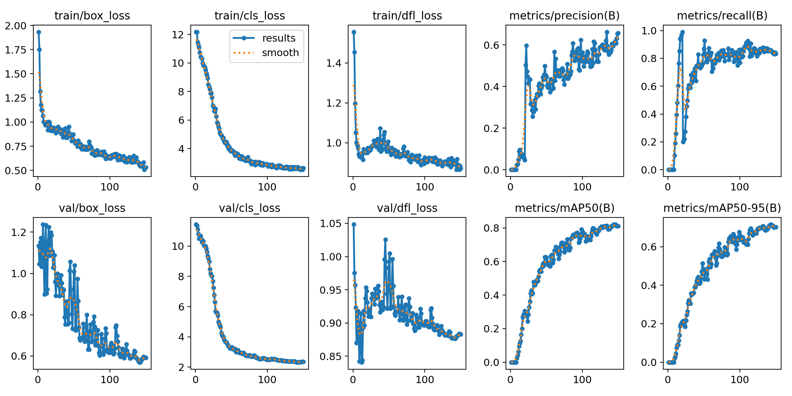

Nhận xét:
- Các loss train/val giảm rõ sau giai đoạn đầu và ổn định dần về cuối.
- `mAP50` tốt nhất đạt `0.82068` ở epoch `146`.
- `mAP50-95` tốt nhất đạt `0.71583` ở epoch `143`.
- Epoch cuối vẫn giữ mức gần best: `mAP50=0.81074`, `mAP50-95=0.70295`.

#### 4.3. Ma trận nhầm lẫn

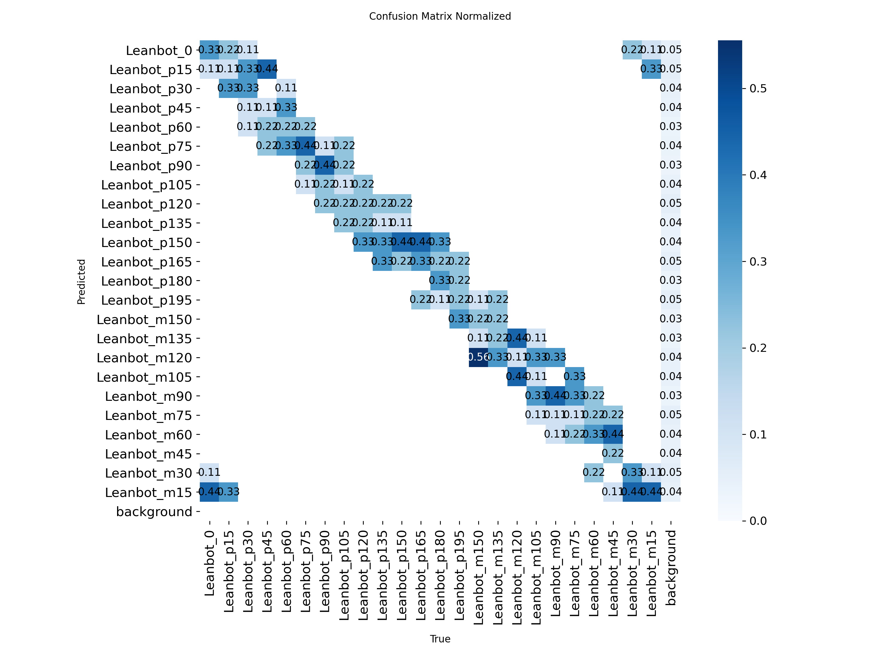

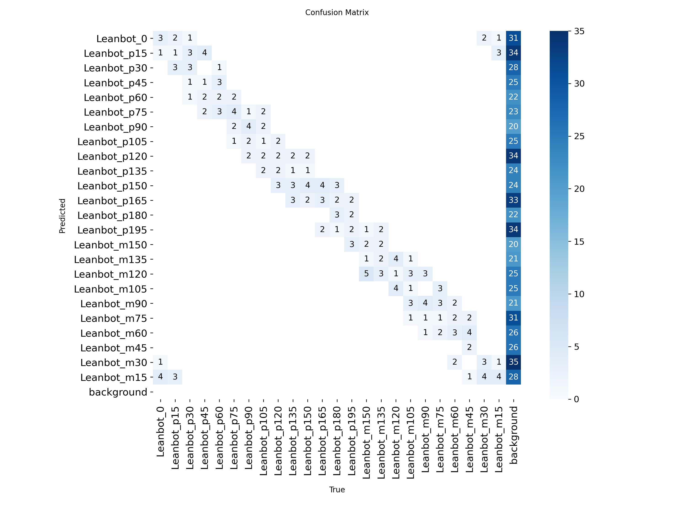

#### 4.4. Các đường Precision / Recall / F1 / PR

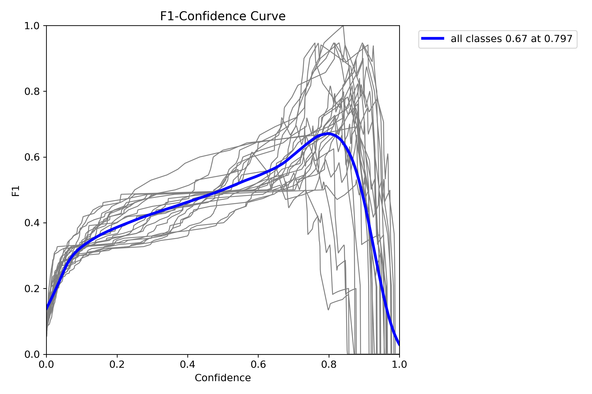

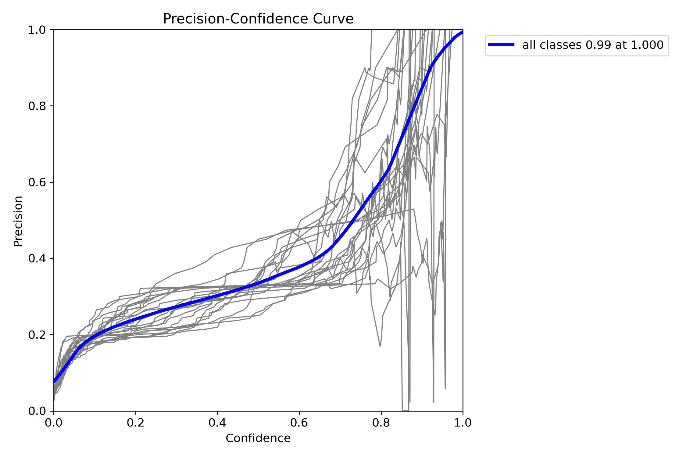

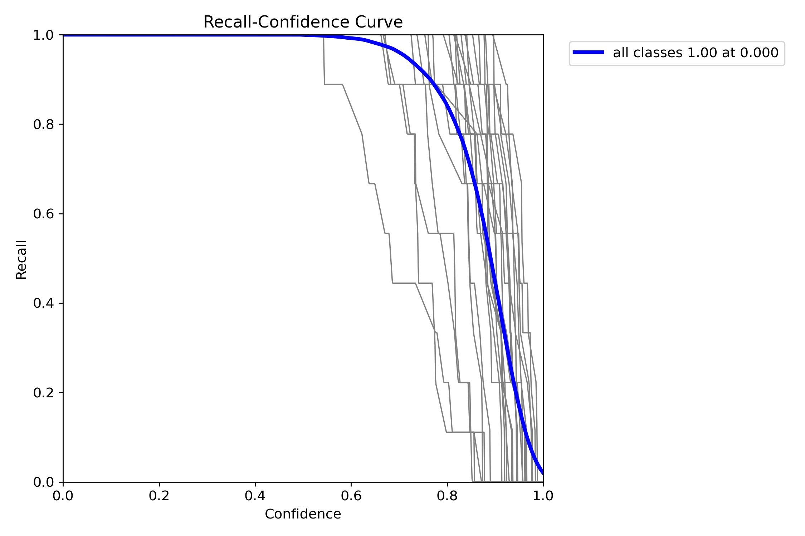

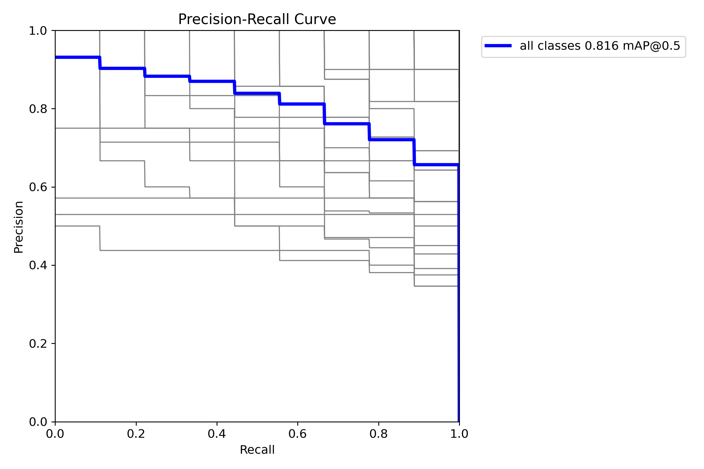


### 4. Triển khai train lại với Model YOLO11n

#### 4.1. Thông tin training

| Thông số | Giá trị thực tế |
| :--- | :--- |
| Model nền tảng | `yolo11n.pt` - YOLO11 Nano, pretrained COCO |
| Task | Object Detection |
| Số class | `24` |
| Class | `Leanbot_0`, `Leanbot_p15`, `Leanbot_p30`, `Leanbot_p45`, `Leanbot_p60`, `Leanbot_p75`, `Leanbot_p90`, `Leanbot_p105`, `Leanbot_p120`, `Leanbot_p135`, `Leanbot_p150`, `Leanbot_p165`, `Leanbot_p180`, `Leanbot_p195`, `Leanbot_m150`, `Leanbot_m135`, `Leanbot_m120`, `Leanbot_m105`, `Leanbot_m90`, `Leanbot_m75`, `Leanbot_m60`, `Leanbot_m45`, `Leanbot_m30`, `Leanbot_m15` |
| Dataset gốc | `datasets/24class` |
| Dataset split | `72` ảnh train, `24` ảnh validation, `24` ảnh test |
| Tổng dữ liệu | `120` ảnh, `24` class, mỗi class `5` ảnh |
| Epochs | `150` |
| Batch size | `16` |
| Image size | `640 x 640` |
| Optimizer | `optimizer=auto` |
| Custom loss | Soft Angular BCE |
| Sigma | `15.0` |
| Augmentation chính | `degrees=10.0`, `fliplr=0.0`, `flipud=0.0`, `mosaic=1.0`, `scale=0.5`, `translate=0.1` |
| Môi trường training | Google Colab, GPU runtime |
| Thời gian training | `299.844 s`, ~5.0 phút |
| Output | `trainResults` |
| Best model | `trainResults/best.pt` |

Kết quả train YOLO11n được lưu trong thư mục: [trainResults](trainResults/).

Các file chính trong thư mục kết quả:
- [best.pt](trainResults/best.pt): model tốt nhất sau training.
- [results.csv](trainResults/results.csv): log loss, precision, recall, mAP theo từng epoch.
- [results.png](trainResults/results.png): biểu đồ tổng hợp quá trình training.
- [confusion_matrix.png](trainResults/confusion_matrix.png), [confusion_matrix_normalized.png](trainResults/confusion_matrix_normalized.png): ma trận nhầm lẫn.
- [BoxP_curve.png](trainResults/BoxP_curve.png), [BoxR_curve.png](trainResults/BoxR_curve.png), [BoxF1_curve.png](trainResults/BoxF1_curve.png), [BoxPR_curve.png](trainResults/BoxPR_curve.png): các đường metric theo confidence.

#### 4.1.1. Custom loss Soft Angular BCE

| Nội dung | Cấu hình |
| :--- | :--- |
| Loss gốc của YOLO | BCE cho classification target |
| Loss chỉnh sửa | Soft Angular BCE |
| Vị trí chỉnh sửa | Bọc lại `v8DetectionLoss.bce` bằng `SoftBCEWithLogitsLoss` |
| Phần được chỉnh | Classification loss / class target |
| Phần giữ nguyên | Box loss và DFL loss giữ theo YOLO mặc định |
| Sigma | `15.0` |
| Khoảng cách class | `15°` giữa 2 class liền kề |
| Class angle | `class_id * 15°` |
| Khoảng cách góc | Dạng vòng tròn: `min(abs(a-b), 360-abs(a-b))` |
| Mục đích | Làm mềm target sang các class góc lân cận để model học quan hệ góc liên tục |

Công thức soft target:

```python
soft = exp(-0.5 * (d / sigma) ** 2) * original_iou_scores
```

Trong đó:
- `d`: khoảng cách góc giữa class thật và từng class còn lại.
- `sigma=15.0`: độ rộng Gaussian, tương ứng khoảng cách giữa 2 class góc liền kề.
- `original_iou_scores`: score target gốc do YOLO gán cho foreground anchor.

Ví dụ target hard ban đầu chỉ có 1 class chính, sau Soft Angular BCE sẽ lan một phần score sang các class góc lân cận.

#### 4.1.2. Data augmentation

| Thông số | Giá trị | Lý do |
| :--- | ---: | :--- |
| `degrees` | `10.0` | Cho phép xoay nhẹ ảnh, phù hợp vì các class cách nhau `15°` |
| `translate` | `0.1` | Dịch ảnh nhẹ để tăng khả năng tổng quát vị trí |
| `scale` | `0.5` | Thay đổi kích thước object trong giới hạn YOLO mặc định |
| `fliplr` | `0.0` | Không lật ngang vì sẽ làm sai hướng/góc Leanbot |
| `flipud` | `0.0` | Không lật dọc vì sẽ làm sai hướng/góc Leanbot |
| `mosaic` | `1.0` | Giữ theo YOLO mặc định để tăng đa dạng dữ liệu |
| `hsv_h` | `0.015` | Biến đổi màu nhẹ |
| `hsv_s` | `0.7` | Biến đổi saturation theo mặc định YOLO |
| `hsv_v` | `0.4` | Biến đổi brightness theo mặc định YOLO |
| `erasing` | `0.4` | Random erasing theo cấu hình train cũ |
| `auto_augment` | `randaugment` | Giữ theo cấu hình Ultralytics cũ |


> Resize đầu vào phải giữ quy trình crop/pad/resize đã dùng khi tạo dataset, tránh resize méo.

#### 4.1.3. Hyperparameters

| Hyperparameter | Giá trị |
| :--- | ---: |
| `epochs` | `150` |
| `batch` | `16` |
| `imgsz` | `640` |
| `optimizer` | `auto` |
| `lr0` | `0.01` |
| `lrf` | `0.01` |
| `momentum` | `0.937` |
| `weight_decay` | `0.0005` |
| `warmup_epochs` | `3.0` |
| `warmup_momentum` | `0.8` |
| `warmup_bias_lr` | `0.1` |
| `close_mosaic` | `10` |
| `device` | `0` |

Các hyperparameters trên được lấy theo cấu hình train cũ trong `260529/24Class_soft_angular_bce_result/args.yaml`, dùng lại để sau này có thể so sánh YOLOv8n và YOLO11n khách quan .
#### 4.2. Đánh giá kết quả training YOLO11n

Metric chính csv:  `trainResults/results.csv`.

Metric ở epoch cuối (`epoch=150`):

| Metric | Giá trị |
| :--- | ---: |
| `train/box_loss` | `0.53037` |
| `train/cls_loss` | `2.63717` |
| `train/dfl_loss` | `0.87241` |
| `metrics/precision(B)` | `0.65796` |
| `metrics/recall(B)` | `0.83331` |
| `metrics/mAP50(B)` | `0.81074` |
| `metrics/mAP50-95(B)` | `0.70295` |
| `val/box_loss` | `0.59205` |
| `val/cls_loss` | `2.35754` |
| `val/dfl_loss` | `0.88287` |

Best metric trong toàn bộ quá trình train:

| Metric | Best value | Epoch | Ghi chú |
| :--- | ---: | ---: | :--- |
| `metrics/precision(B)` | `0.66306` | `134` | Precision cao nhất |
| `metrics/recall(B)` | `0.99074` | `20` | Recall cao nhất |
| `metrics/mAP50(B)` | `0.82068` | `146` | mAP50 cao nhất |
| `metrics/mAP50-95(B)` | `0.71583` | `143` | mAP50-95 cao nhất |
| `train/box_loss` | `0.50743` | `148` | Loss bbox train thấp nhất |
| `train/cls_loss` | `2.52076` | `149` | Loss class train thấp nhất |
| `train/dfl_loss` | `0.86543` | `144` | Loss DFL train thấp nhất |
| `val/box_loss` | `0.57005` | `142` | Loss bbox validation thấp nhất |
| `val/cls_loss` | `2.32271` | `142` | Loss class validation thấp nhất |
| `val/dfl_loss` | `0.84083` | `12` | Loss DFL validation thấp nhất |


Nhận xét:
- Các loss train/val giảm rõ sau giai đoạn đầu và ổn định dần về cuối.
- `mAP50` tốt nhất đạt `0.82068` ở epoch `146`.
- `mAP50-95` tốt nhất đạt `0.71583` ở epoch `143`.
- Epoch cuối vẫn giữ mức gần best: `mAP50=0.81074`, `mAP50-95=0.70295`.

#### 4.3. Ma trận nhầm lẫn


#### 4.4. Các đường Precision / Recall / F1 / PR


## B. Khó khăn
- Không

## C. Công việc tiếp theo
- Em sẽ chạy ROI tracking với kích thước ảnh đầu vào là 2K (2560x1440) hay Full HD (1920x1080) ạ ? 
- Export model sau train sang OpenVINO, chạy inference ROI tracking và đánh giá kết quả.


