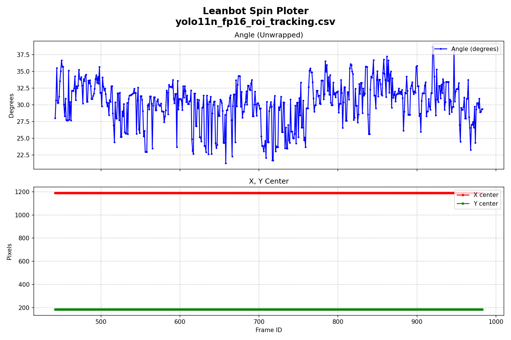
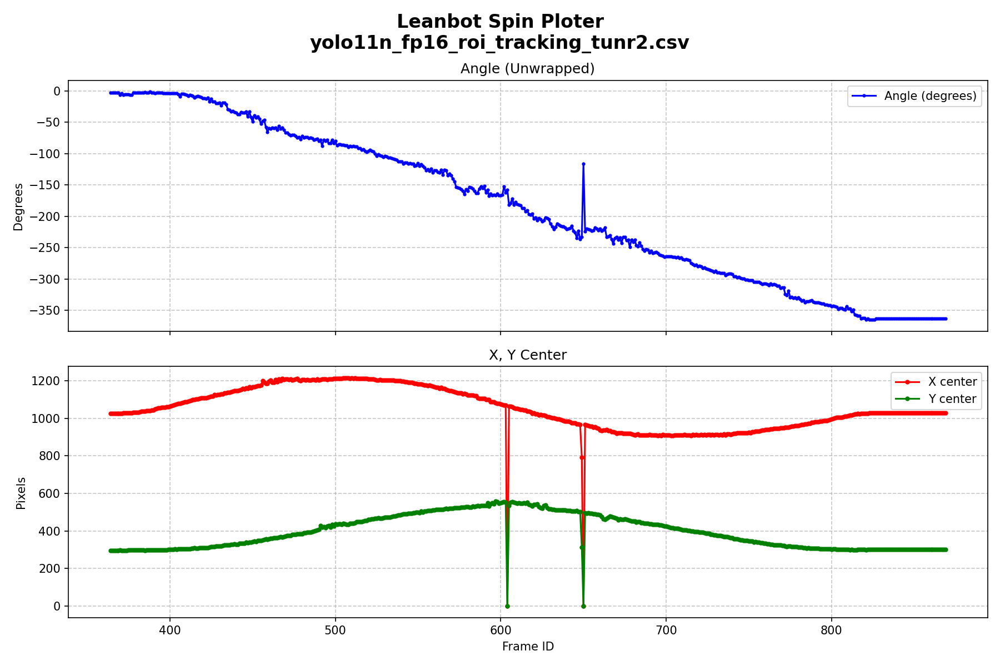
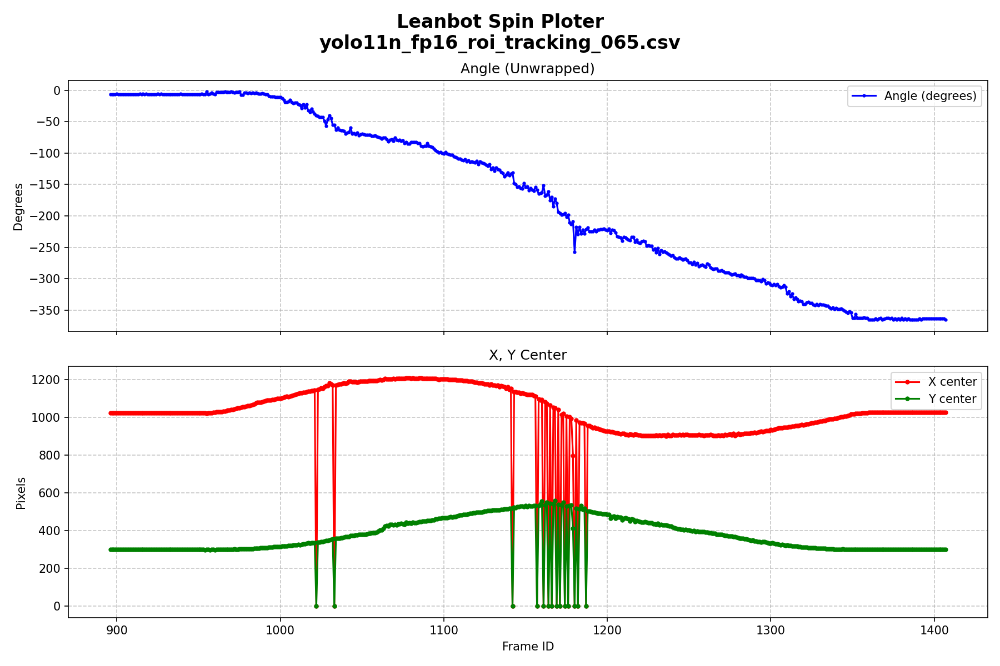
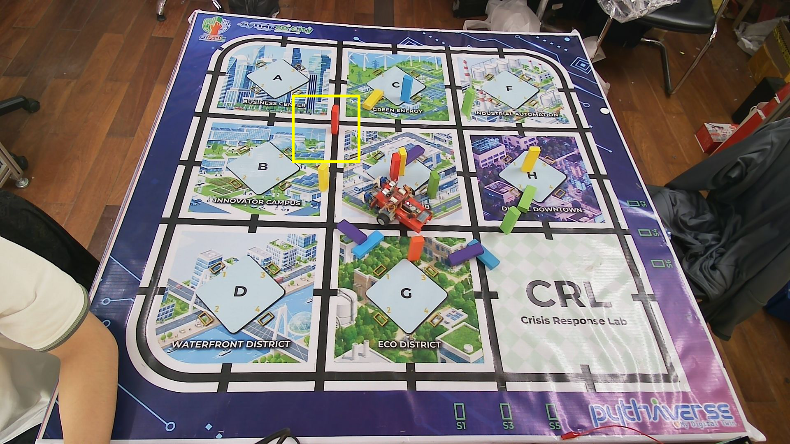
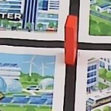
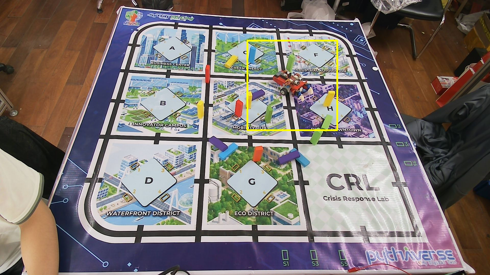
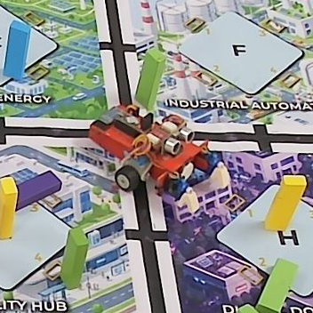

# Báo cáo công việc ngày 14/07/2026

## A. Công việc đã làm
- Báo cáo tổng quan tác thôgn tin so sánh vào một bảng 
- Báo cáo lại các parameters sử dụng khi Export Model FP16 OpenVINO
- Khảo sát Leanbot chạy khi có khối gỗ chắn (ROI mode, FullHD resolution )

### 1. Triển khai thực tế và so sánh YOLO8n và YOLO11n
#### 1.1 Export model YOLO11n FP16 quantization 
- Code sử dụng : [tools\export_fp16_benchmark.py](tools\export_fp16_benchmark.py)
```python
import ultralytics

pt_model_path = os.path.join(quantized_dir, 'Soft_Angular_BCE_yolo11n.pt')
model_pt = YOLO(pt_model_path)
openvino_fp16_path = model_pt.export(format="openvino", imgsz=640, half=True)
    
```

- Chạy test với ảnh Test trong [24class_test_images](24class_test_images/) và so sánh với YOLO11n FP32 Pytorch gốc: 

| Định dạng Model | Tiền xử lý (ms) | Suy luận (ms) | Hậu xử lý (ms) | Ước tính FPS |
| :--- | ---: | ---: | ---: | ---: |
| PyTorch (FP32 Gốc) | 3.44 ms | 129.43 ms | 1.26 ms | 7.46 FPS |
| OpenVINO (FP16) | 5.85 ms | 28.01 ms | 1.56 ms | 28.24 FPS |

> Vẫn theo đúng lý thuyết giống với YOLOv8n , khi lượng tử hóa xuống FP16 thì tốc độ xử lý vẫn nhanh hơn FP32 gốc


#### 1.2 Chạy inference với YOLO11n OpenVINO FP16 ở chế độ ROI tracking độ phân giải ảnh đầu vào 2K (2560x1440)
- Code export Model YOLO11n OpenVINO FP16 static 160x160 :  [tools\export_static_160.py](tools\export_static_160.py):
```python
from ultralytics import YOLO

model = YOLO(r"models\YOLO11n_versions\Soft_Angular_BCE_yolo11n.pt")
export_path = model.export(format="openvino", imgsz=160, half=True, dynamic=False)
```
- Code chạy inference sử dụng : [tools\roi_tracking_baseline_infer.py](tools\roi_tracking_baseline_infer.py)

- Lệnh chạy :

```bash
python .\tools\roi_tracking_baseline_infer.py --source 1 --mode roi --width 2560 --height 1440 --log benchmark\yolo11n_fp16_roi_tracking.csv --show --full-model models\YOLO11n_versions\quantized_fp16\Soft_Angular_BCE_yolo11n_openvino_model --tracking-model models\YOLO11n_versions\Soft_Angular_BCE_yolo11n_static_160_openvino_model
```
- Lệnh chạy với YOLOv8n OpenVINO FP16 ở chế độ ROI tracking.

```bash
python .\tools\roi_tracking_baseline_infer.py --source 1 --mode roi --width 2560 --height 1440 --log benchmark\yolov8n_fp16_roi_tracking.csv --show --full-model models\YOLOv8n_versions\quantized_fp16\best_24Class_Soft_Angular_BCE_openvino_model --tracking-model models\YOLOv8n_versions\best_24Class_Soft_Angular_BCE_static_160_openvino_model
```  

- Lệnh chạy phân tích và tự động vẽ biểu đồ:

```bash
python .\tools\comprehensive_plot.py --v8-log benchmark\yolov8n_fp16_roi_tracking.csv --v11-log benchmark\yolo11n_fp16_roi_tracking.csv --out-dir benchmark
```

- Kết quả log csv lưu tại : [benchmark](./benchmark/)
- Kết quả so sánh :
  - **So Sánh Tốc độ Khung hình (FPS):**

    

  - **So Sánh Thời gian Xử lý Trung bình:**

    

  - **So Sánh Mức độ Sử dụng CPU:**

    
    
  - **So Sánh Số lần Mất dấu (Tracking Lost):**

    

  - **So Sánh Kích thước Model (OpenVINO):**

    
  - **Quỹ đạo Di chuyển (Trajectory & Angle):**

    - *YOLOv8n:*
      

    - *YOLO11n:*
      

#### 1.3. Chạy inference với YOLO11n OpenVINO FP16 ở chế độ ROI tracking độ phân giải ảnh đầu vào Full HD (1920x1080)

- Lệnh chạy với YOLO11n OpenVINO FP16 ở chế độ ROI tracking:
```bash
python .\tools\roi_tracking_baseline_infer.py --source 1 --mode roi --width 1920 --height 1080 --log benchmarkFullHD\yolo11n_fp16_roi_tracking.csv --show --full-model models\YOLO11n_versions\quantized_fp16\Soft_Angular_BCE_yolo11n_openvino_model --tracking-model models\YOLO11n_versions\Soft_Angular_BCE_yolo11n_static_160_openvino_model
```
- Lệnh chạy với YOLOv8n OpenVINO FP16 ở chế độ ROI tracking:
```bash
python .\tools\roi_tracking_baseline_infer.py --source 1 --mode roi --width 1920 --height 1080 --log benchmarkFullHD\yolov8n_fp16_roi_tracking.csv --show --full-model models\YOLOv8n_versions\quantized_fp16\best_24Class_Soft_Angular_BCE_openvino_model --tracking-model models\YOLOv8n_versions\best_24Class_Soft_Angular_BCE_static_160_openvino_model
```

- Lệnh chạy phân tích và tự động vẽ biểu đồ (lưu tại thư mục benchmarkFullHD):

```bash
python .\tools\comprehensive_plot.py --v8-log benchmarkFullHD\yolov8n_fp16_roi_tracking.csv --v11-log benchmarkFullHD\yolo11n_fp16_roi_tracking.csv --out-dir benchmarkFullHD
```

- Kết quả log csv lưu tại : [benchmarkFullHD](./benchmarkFullHD/)
- Kết quả so sánh :
  - **So Sánh Tốc độ Khung hình (FPS):**

    

  - **So Sánh Thời gian Xử lý Trung bình:**

    

  - **So Sánh Mức độ Sử dụng CPU:**

    
    
  - **So Sánh Số lần Mất dấu (Tracking Lost):**

    

  - **So Sánh Kích thước Model (OpenVINO):**

    
  - **Quỹ đạo Di chuyển (Trajectory & Angle):**

    - *YOLOv8n:*
      

    - *YOLO11n:*
      

#### 1.4. Thời gian training YOLOv8n và YOLO11n Soft Angular BCE
| Model | Kiến trúc nền | Loss | Số class | Epochs | Thời gian training |
| :--- | :--- | :--- | ---: | ---: | ---: |
| YOLOv8n | `yolov8n.pt` | Soft Angular BCE | 24 | 150 | `251.509` giây (~`4.19` phút, `00:04:11`) |
| YOLO11n | `yolo11n.pt` | Soft Angular BCE | 24 | 150 | `299.844` giây (~`5.00` phút, `00:04:59`) |

- YOLO11n lâu hơn YOLOv8n khoảng `48.335` giây, tương đương tăng khoảng `19.22%`.

#### 1.5 Bảng đánh giá tổng quan 2 Model.

| Category | YOLOv8n ROI 2560x1440 | YOLO11n ROI 2560x1440 | YOLOv8n ROI 1920x1080 | YOLO11n ROI 1920x1080 |
| :--- | ---: | ---: | ---: | ---: |
| Base | YOLOv8n | YOLO11n | YOLOv8n | YOLO11n |
| Model | OpenVINO FP16 | OpenVINO FP16 | OpenVINO FP16 | OpenVINO FP16 |
| Mode | ROI tracking| ROI tracking | ROI tracking | ROI tracking |
| Input resolution | 2560x1440 | 2560x1440 | 1920x1080 | 1920x1080 |
| Duration (s) | 19.06 | 18.86 | 18.85 | 18.96 |
| Number of Frames | 537 | 563 | 566 | 561 |
| Average Inference (ms) | 5.06 | 5.62 | 4.43 | 6.26 |
| Average Total (ms) | 6.46 | 6.93 | 5.18 | 7.17 |
| Average FPS | 160.77 | 152.90 | 194.69 | 163.25 |
| Tracking Lost | 0 | 0 | 0 | 0 |
#### 1.6 Các export Parameter của YOLO11n và YOLOv8n

Khi export YOLO11n và YOLOv8n sang OpenVINO, em sử dụng các parameter chính như sau:

```python
export_path = model.export(format="openvino", imgsz=160, half=True, dynamic=False)
```

| Parameter | Giá trị sử dụng | Ý nghĩa |
| :--- | :--- | :--- |
| `format` | `"openvino"` | Chuyển model sang định dạng OpenVINO IR để tối ưu suy luận trên nền tảng Intel. |
| `imgsz` | `160` | Quy định kích thước input khi export. Với ROI tracking, ảnh ROI được crop và resize về `160x160`, nên model tracking được export với `imgsz=160`. |
| `half` | `True` | Export model ở dạng FP16. |
| `dynamic` | `False` | Export model với input shape cố định. |

> Tham số `half=True` dùng để export model ở dạng FP16. Model PyTorch gốc thường dùng FP32, còn khi bật `half=True`, trọng số và phép tính của model được chuyển sang FP16 trong quá trình export.

Theo tài liệu Ultralytics phiên bản mới, `half=True` có thể hiểu tương đương với tham số ```quantize=16``` trong phiên bản thư viện Ultralytics mới cập nhật so với bản cũ trước đó.

Ngoài các tham số đã sử dụng, Ultralytics còn hỗ trợ một số export parameters khác:

| Parameter | Ý nghĩa |
| :--- | :--- |
| `quantize` | Chọn độ chính xác khi export, ví dụ FP16 hoặc INT8. |
| `batch` | Quy định batch size của model sau khi export. |
| `nms` | Tích hợp bước Non-Maximum Suppression vào model export. |
| `data` | Dataset dùng để calibration khi export INT8. |
| `fraction` | Tỷ lệ dữ liệu calibration được sử dụng khi export INT8. |
| `device` | Thiết bị dùng trong quá trình export, ví dụ CPU hoặc GPU. |

- Nguồn tham khảo: [Ultralytics Export Documentation](https://docs.ultralytics.com/modes/export/) 
#### 1.7 Khảo sát Model khi có thêm vật cản
Các điều kiện khảo sát : 
  - Leanbot chạy vòng tròn có các khúc gỗ màu đứng cạnh vòng tròn di chuyển, chắn giữa Leanbot và camera.


  - Model sử dụng : **YOLO11n OpenVINO FP16**
  - ROI tracking mode.
  - Full HD 1920x1080
  - Lệnh chạy : 
    ```bash
    python .\tools\roi_tracking_baseline_infer.py --source 1 --mode roi --width 1920 --height 1080 --log benchmarkWithObstacle\yolo11n_fp16_roi_tracking.csv --show --full-model models\YOLO11n_versions\quantized_fp16\Soft_Angular_BCE_yolo11n_openvino_model --tracking-model models\YOLO11n_versions\Soft_Angular_BCE_yolo11n_static_160_openvino_model
    ```

- Điều kiện lọc bbox hiện tại không lọc theo một class ID cố định. Với mỗi bbox prediction, chương trình lấy score cao nhất trong 24 class góc làm `best_conf`, sau đó chọn bbox có `best_conf` lớn nhất. Bbox được chấp nhận là Leanbot nếu `best_conf` vượt qua ngưỡng confidence.
- Trong lần chạy ban đầu, ngưỡng confidence là `0.25`, nên các khối gỗ chắn màu đỏ có thể bị nhận nhầm là Leanbot nếu bbox đó có score lớn nhất và vượt ngưỡng thấp này. 

- Để giảm nhiễu, em bổ sung thử nghiệm tăng ngưỡng lọc confidence từ `0.25` lên `0.65` trong file [tools/roi_tracking_baseline_infer.py](tools/roi_tracking_baseline_infer.py):
- Log CSV ngưỡng `0.25` chạy lần đầu tiên : [benchmarkWithObstacle/yolo11n_fp16_roi_tracking.csv](./benchmarkWithObstacle/yolo11n_fp16_roi_tracking.csv)
- Log CSV ngưỡng `0.25` chạy lại lần 2 : [benchmarkWithObstacle/yolo11n_fp16_roi_tracking_tunr2.csv](./benchmarkWithObstacle/yolo11n_fp16_roi_tracking_tunr2.csv)
- Log CSV ngưỡng `0.65`: [benchmarkWithObstacle_065/yolo11n_fp16_roi_tracking_065.csv](./benchmarkWithObstacle_065/yolo11n_fp16_roi_tracking_065.csv)

- Lệnh vẽ biểu đồ góc và tọa độ tâm `x_center`, `y_center`:

```bash
python .\tools\plot_log.py .\benchmarkWithObstacle\yolo11n_fp16_roi_tracking.csv
python .\tools\plot_log.py .\benchmarkWithObstacle\yolo11n_fp16_roi_tracking_tunr2.csv
python .\tools\plot_log.py .\benchmarkWithObstacle_065\yolo11n_fp16_roi_tracking_065.csv
```
- Biểu đồ với ngưỡng confidence `0.25` lần chạy đầu tiên :



- Biểu đồ với ngưỡng confidence `0.25` lần chạy lại:



- Biểu đồ với ngưỡng confidence `0.65`:



- Kết quả so sánh theo ngưỡng confidence:

| Ngưỡng confidence | Number of Frames | Average Inference (ms) | Average Total (ms) | Average FPS | Tracking Lost | Lost frame ID |
| :--- | ---: | ---: | ---: | ---: | ---: | :--- |
| `0.25` (Lần 1) |  542 | 6.41 | 7.14 | 165.66 | 0 | - |
| `0.25` (Lần 2) |  506 | 5.10 | 5.92 | 173.79 | 2 | `604`, `650` |
| `0.65` | 512 | 5.66 | 6.69 | 163.34 | 14 | `1022`, `1033`, `1142`, `1157`, `1161`, `1164`, `1166`, `1169`, `1171`, `1174`, `1176`, `1180`, `1182`, `1187` |


- Đối với lần chạy đầu tiên , Model detect nhầm sang khối gỗ và giữ ROI trong suốt quá trình Leanbot di chuyển.





- Trong log ngưỡng `0.65`, lost tracking xuất hiện nhiều hơn , tuy nhiên các ROI vẫn được detect và vẽ ra :



Từ đó có thể suy ra, khi chạy Full frame để Detect ROI thì model YOLO11n OpenVINO FP16 vẫn detect được BBox để vẽ ra ROI, nhưng khi crop và resize về 160x160 thì ảnh ROI đã bị biến đổi tỉ lệ so với hình ảnh gốc ( phóng to hơn so với lượng ảnh data được train) nên bị giảm khả năng detect. 

## B. Khó khăn

- Không

## C. Công việc tiếp theo
- Hiện tại Git Pythaverse đang gặp vấn đề, nên em tạm thời báo cáo bằng gitHub cá nhân ạ .
- Em xin phép nhận hướng đi tiếp theo từ Thầy ạ . 
