# Báo cáo công việc ngày 14/07/2026

## A. Công việc đã làm
- Chạy thử YOLO11n OpenVINO FP16 và so sánh với YOLOv8n OpenVINO FP16 ở chế độ ROI tracking
- So sánh YOLOv8n OpenVINO FP16 và YOLO11n OpenVINO FP16.

### 1. Triển khai thực tế và so sánh YOLO8n và YOLO11n
#### 1.1 Export model YOLO11n FP16 quantization 
- Code sử dụng : [tools\export_fp16_benchmark.py](tools\export_fp16_benchmark.py)
```python
import ultralytics

pt_model_path = os.path.join(quantized_dir, 'Soft_Angular_BCE_yolo11n.pt')
model_pt = YOLO(pt_model_path)
openvino_fp16_path = model_pt.export(format="openvino", imgsz=640, half=True)
    
```

- Chạy test với ảnh Test trong [24class_test_images](24class_test_images/) và so sánh với YOLO11n FP32 Pytorch gốc: 

| Định dạng Model | Tiền xử lý (ms) | Suy luận (ms) | Hậu xử lý (ms) | Ước tính FPS |
| :--- | ---: | ---: | ---: | ---: |
| PyTorch (FP32 Gốc) | 3.44 ms | 129.43 ms | 1.26 ms | 7.46 FPS |
| OpenVINO (FP16) | 5.85 ms | 28.01 ms | 1.56 ms | 28.24 FPS |

> Vẫn theo đúng lý thuyết giống với YOLOv8n , khi lượng tử hóa xuống FP16 thì tốc độ xử lý vẫn nhanh hơn FP32 gốc


#### 1.2 Chạy inference với YOLO11n OpenVINO FP16 ở chế độ ROI tracking độ phân giải ảnh đầu vào 2K (2560x1440)
- Code export Model YOLO11n OpenVINO FP16 static 160x160 (Script tham khảo: [tools\export_static_160.py](tools\export_static_160.py)):
```python
from ultralytics import YOLO

model = YOLO(r"models\YOLO11n_versions\Soft_Angular_BCE_yolo11n.pt")
export_path = model.export(format="openvino", imgsz=160, half=True, dynamic=False)
```
- Code chạy inference sử dụng : [tools\roi_tracking_baseline_infer.py](tools\roi_tracking_baseline_infer.py)

- Lệnh chạy :

```bash
python .\tools\roi_tracking_baseline_infer.py --source 1 --mode roi --width 2560 --height 1440 --log benchmark\yolo11n_fp16_roi_tracking.csv --show --full-model models\YOLO11n_versions\quantized_fp16\Soft_Angular_BCE_yolo11n_openvino_model --tracking-model models\YOLO11n_versions\Soft_Angular_BCE_yolo11n_static_160_openvino_model
```
- Lệnh chạy với YOLOv8n OpenVINO FP16 ở chế độ ROI tracking.

```bash
python .\tools\roi_tracking_baseline_infer.py --source 1 --mode roi --width 2560 --height 1440 --log benchmark\yolov8n_fp16_roi_tracking.csv --show --full-model models\YOLOv8n_versions\quantized_fp16\best_24Class_Soft_Angular_BCE_openvino_model --tracking-model models\YOLOv8n_versions\best_24Class_Soft_Angular_BCE_static_160_openvino_model
```  

- Lệnh chạy phân tích và tự động vẽ biểu đồ:

```bash
python .\tools\comprehensive_plot.py --v8-log benchmark\yolov8n_fp16_roi_tracking.csv --v11-log benchmark\yolo11n_fp16_roi_tracking.csv --out-dir benchmark
```

- Kết quả log csv lưu tại : [benchmark](./benchmark/)
- Kết quả so sánh :
  - **So Sánh Tốc độ Khung hình (FPS):**

    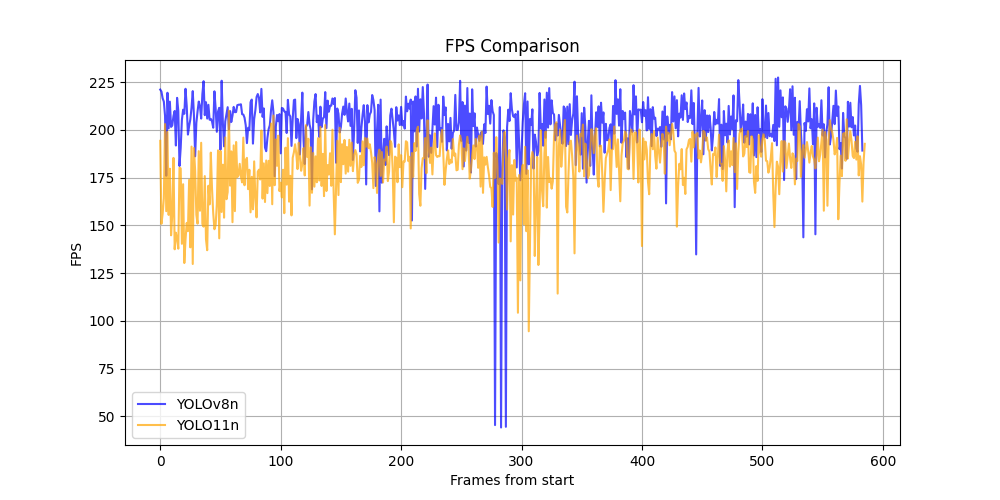

  - **So Sánh Thời gian Xử lý Trung bình:**

    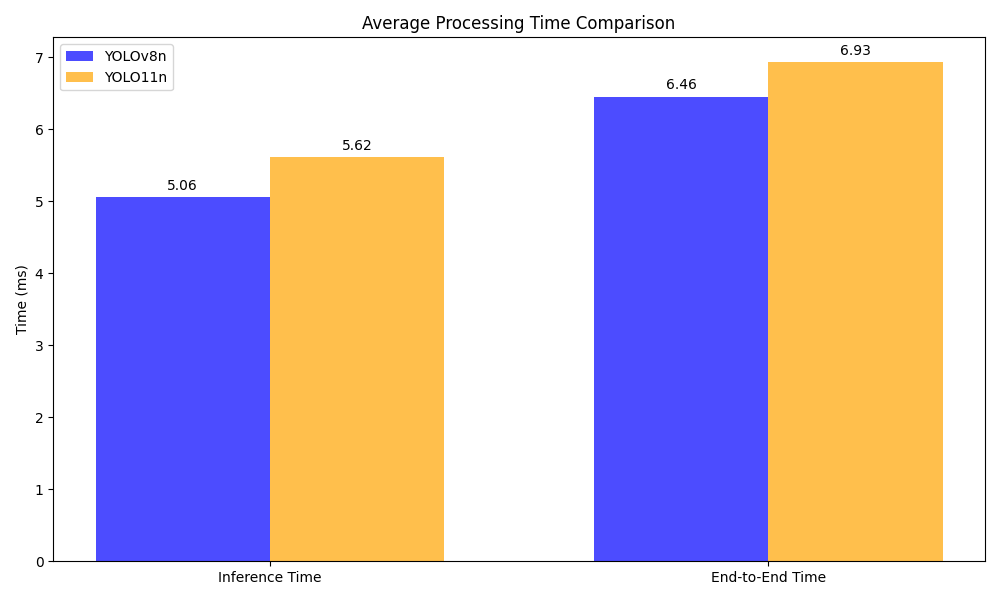

  - **So Sánh Mức độ Sử dụng CPU:**

    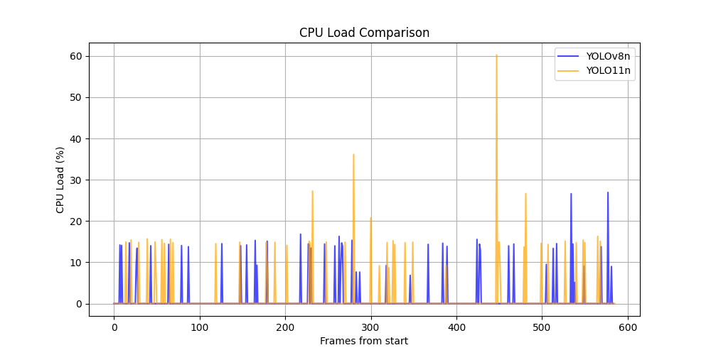
    
  - **So Sánh Số lần Mất dấu (Tracking Lost):**

    

  - **So Sánh Kích thước Model (OpenVINO):**

    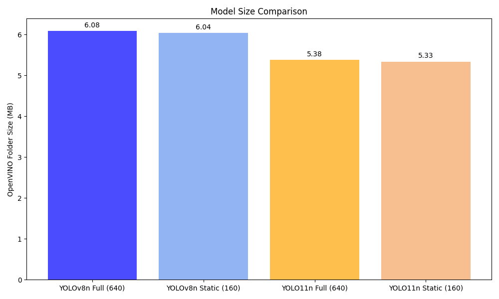
  - **Quỹ đạo Di chuyển (Trajectory & Angle):**

    - *YOLOv8n:*
      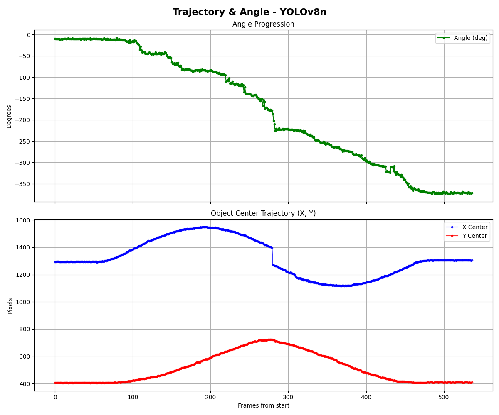

    - *YOLO11n:*
      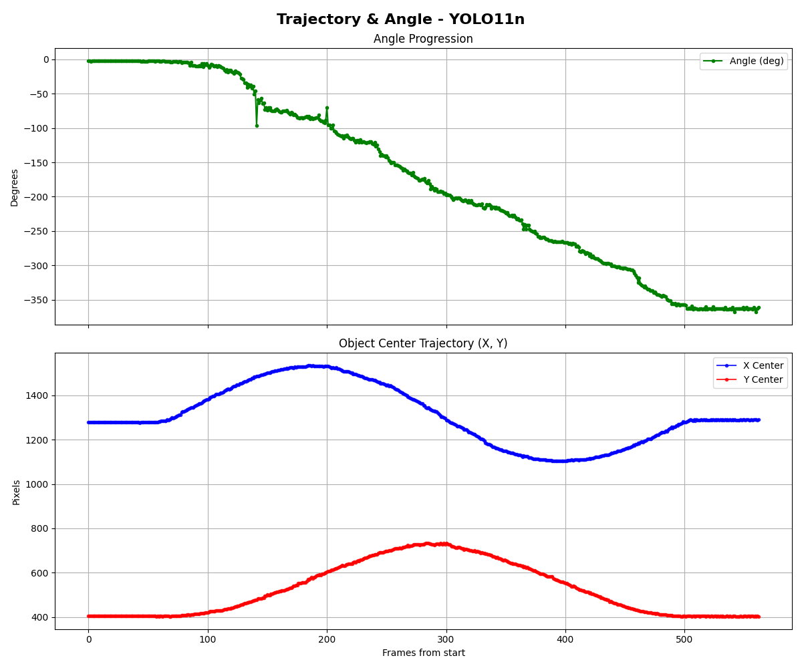

#### 1.3. Chạy inference với YOLO11n OpenVINO FP16 ở chế độ ROI tracking độ phân giải ảnh đầu vào Full HD (1920x1080)

- Lệnh chạy với YOLO11n OpenVINO FP16 ở chế độ ROI tracking:
```bash
python .\tools\roi_tracking_baseline_infer.py --source 1 --mode roi --width 1920 --height 1080 --log benchmarkFullHD\yolo11n_fp16_roi_tracking.csv --show --full-model models\YOLO11n_versions\quantized_fp16\Soft_Angular_BCE_yolo11n_openvino_model --tracking-model models\YOLO11n_versions\Soft_Angular_BCE_yolo11n_static_160_openvino_model
```
- Lệnh chạy với YOLOv8n OpenVINO FP16 ở chế độ ROI tracking:
```bash
python .\tools\roi_tracking_baseline_infer.py --source 1 --mode roi --width 1920 --height 1080 --log benchmarkFullHD\yolov8n_fp16_roi_tracking.csv --show --full-model models\YOLOv8n_versions\quantized_fp16\best_24Class_Soft_Angular_BCE_openvino_model --tracking-model models\YOLOv8n_versions\best_24Class_Soft_Angular_BCE_static_160_openvino_model
```

- Lệnh chạy phân tích và tự động vẽ biểu đồ (lưu tại thư mục benchmarkFullHD):

```bash
python .\tools\comprehensive_plot.py --v8-log benchmarkFullHD\yolov8n_fp16_roi_tracking.csv --v11-log benchmarkFullHD\yolo11n_fp16_roi_tracking.csv --out-dir benchmarkFullHD
```

- Kết quả log csv lưu tại : [benchmarkFullHD](./benchmarkFullHD/)
- Kết quả so sánh :
  - **So Sánh Tốc độ Khung hình (FPS):**

    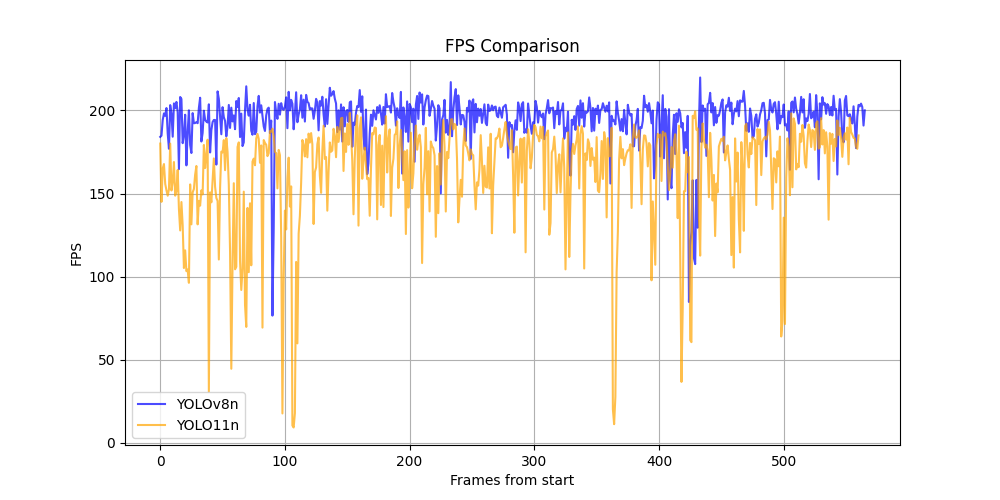

  - **So Sánh Thời gian Xử lý Trung bình:**

    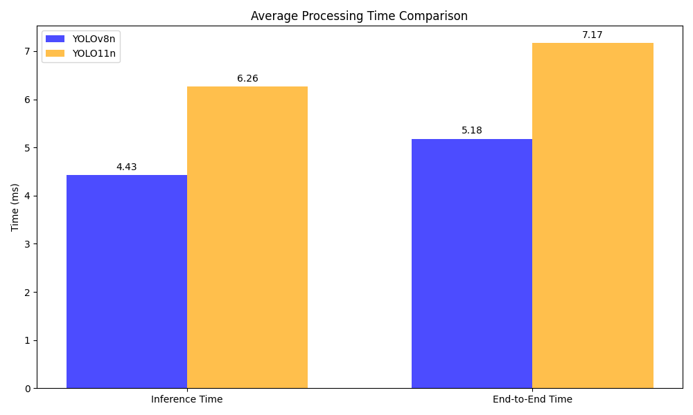

  - **So Sánh Mức độ Sử dụng CPU:**

    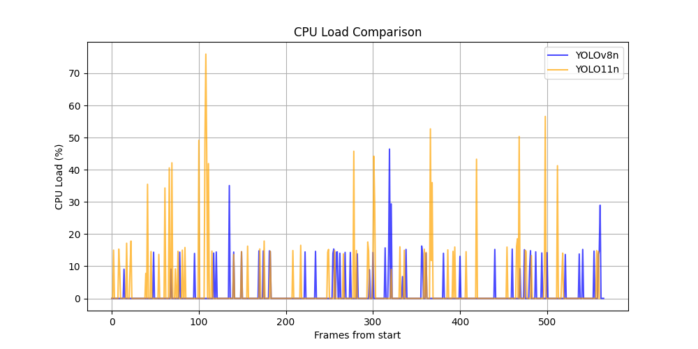
    
  - **So Sánh Số lần Mất dấu (Tracking Lost):**

    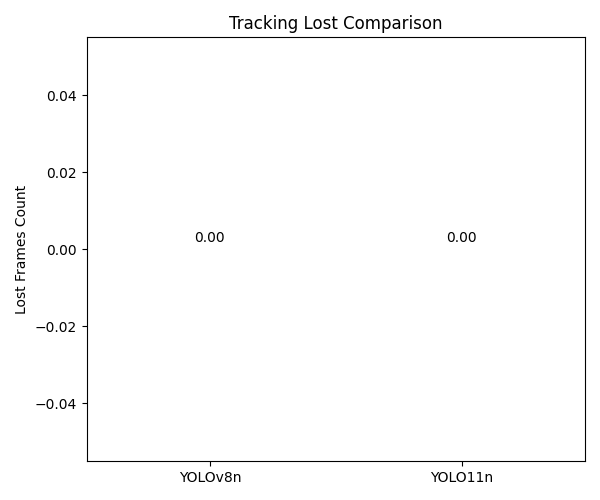

  - **So Sánh Kích thước Model (OpenVINO):**

    
  - **Quỹ đạo Di chuyển (Trajectory & Angle):**

    - *YOLOv8n:*
      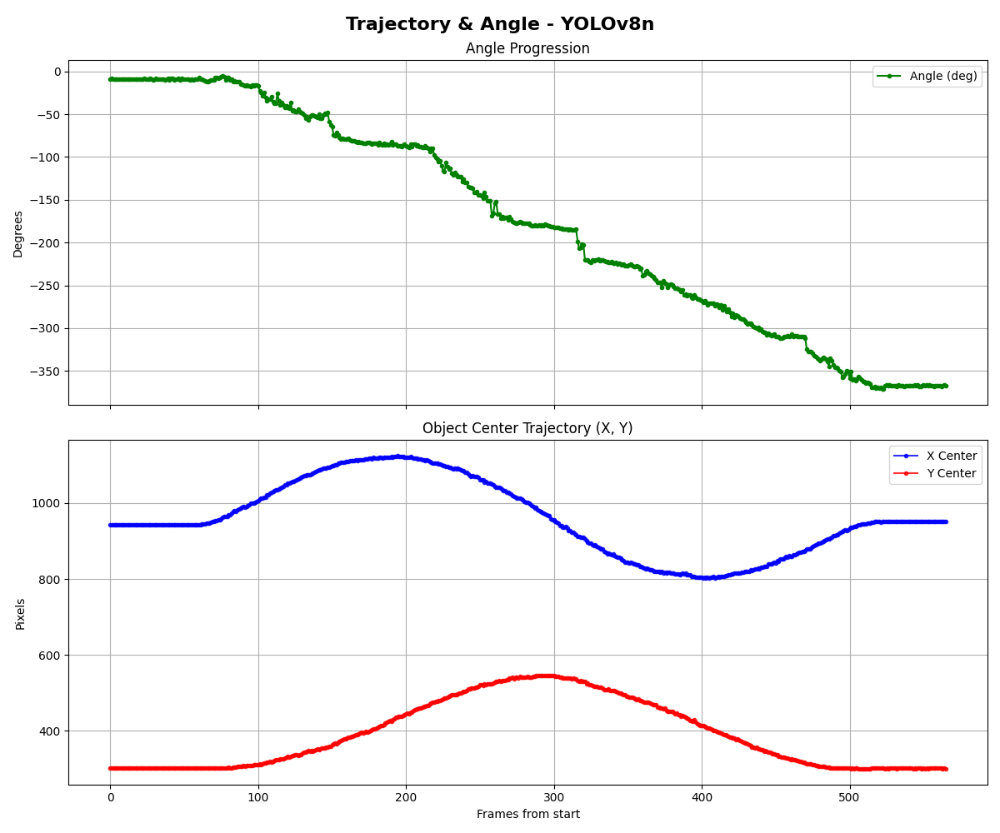

    - *YOLO11n:*
      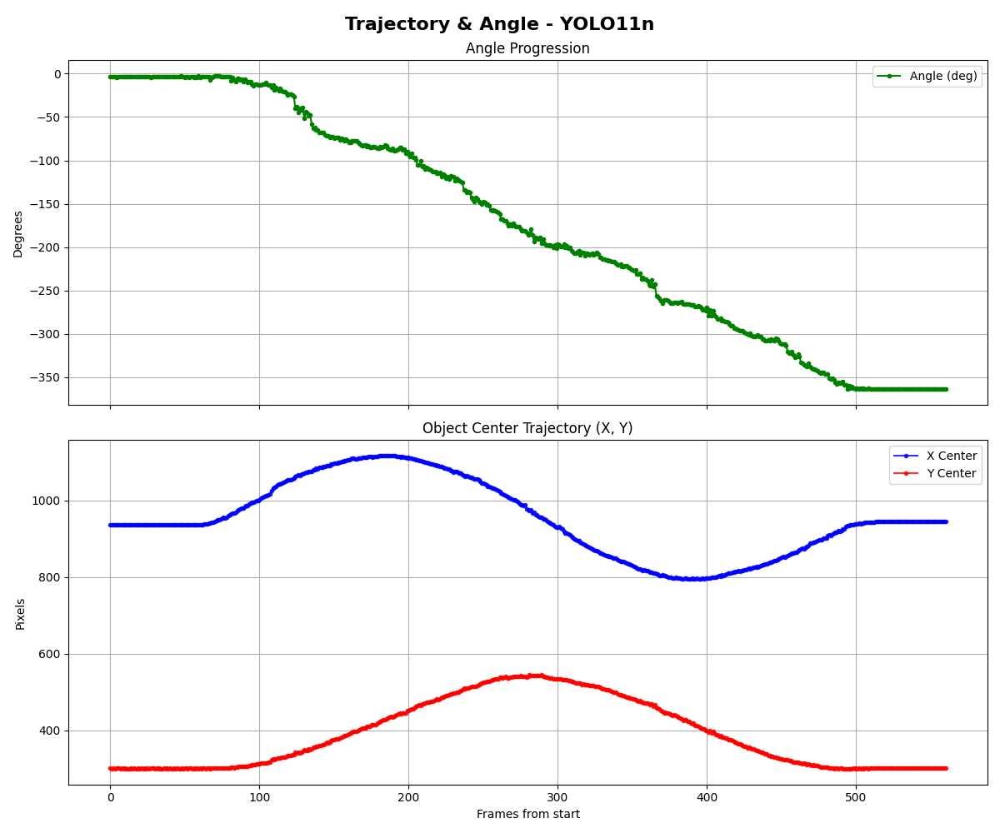

#### 1.4. Thời gian training YOLOv8n và YOLO11n Soft Angular BCE
| Model | Kiến trúc nền | Loss | Số class | Epochs | Thời gian training |
| :--- | :--- | :--- | ---: | ---: | ---: |
| YOLOv8n | `yolov8n.pt` | Soft Angular BCE | 24 | 150 | `251.509` giây (~`4.19` phút, `00:04:11`) |
| YOLO11n | `yolo11n.pt` | Soft Angular BCE | 24 | 150 | `299.844` giây (~`5.00` phút, `00:04:59`) |

- YOLO11n lâu hơn YOLOv8n khoảng `48.335` giây, tương đương tăng khoảng `19.22%`.


## B. Khó khăn

- Trong quá trình chạy thử nghiệm ROI Tracking, mô hình **YOLOv8n** thi thoảng gặp tình trạng bị mất dấu (Tracking Lost) tại một số khung hình:

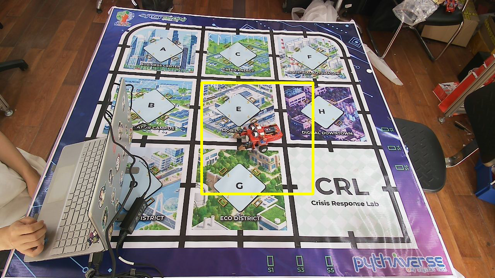

*Hình 1: Toàn cảnh khung hình lúc bị mất dấu mục tiêu*


*Hình 2: Ảnh crop ROI 160x160 đầu vào của model Tracking*

- Dựa vào log thì các trường hợp lost này size của ROI là **288x288** vẫn đảm bảo tỉ lệ hình vuông --> không phải do méo ảnh khi resize mà do Model bị nhiễu detect.
## C. Công việc tiếp theo
- Hiện tại Git Pythaverse đang gặp vấn đề, nên em tạm thời báo cáo bằng gitHub cá nhân ạ .
- Em xin phép nhận hướng đi tiếp theo từ Thầy ạ . 