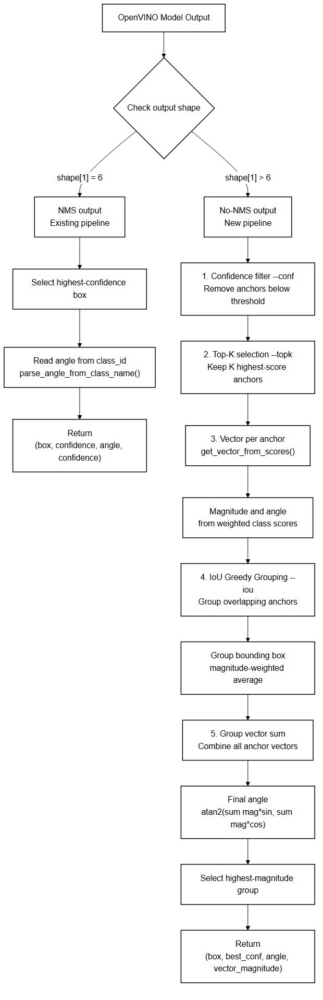
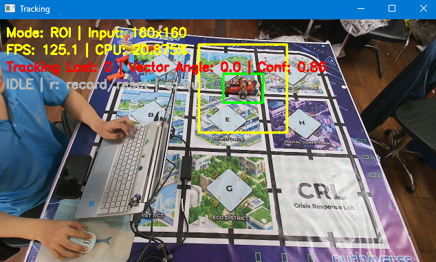
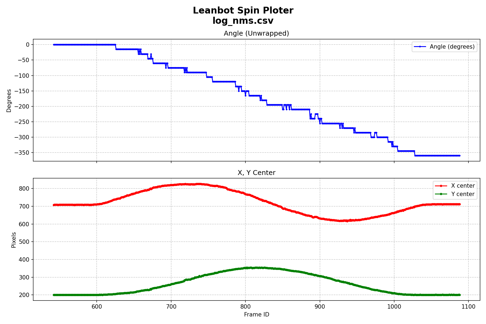
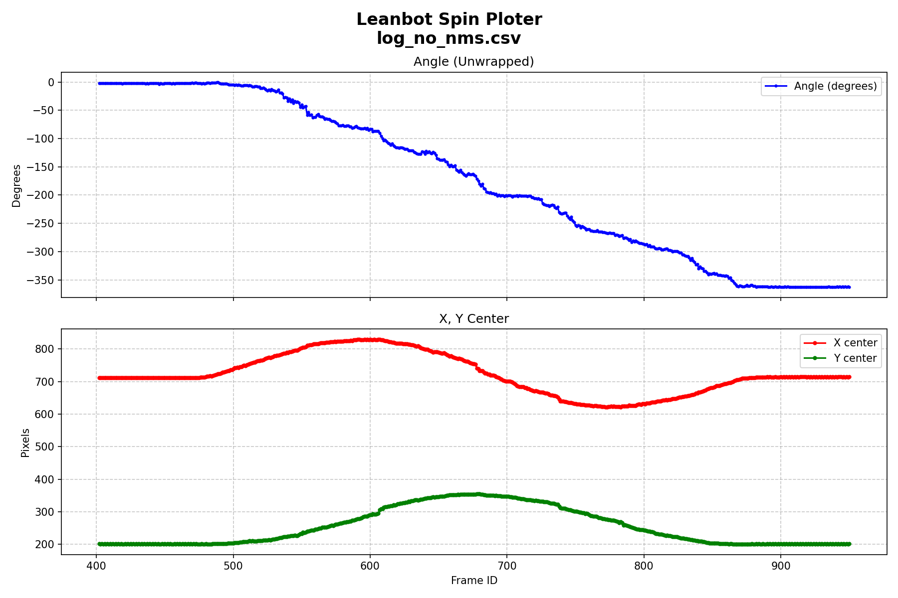
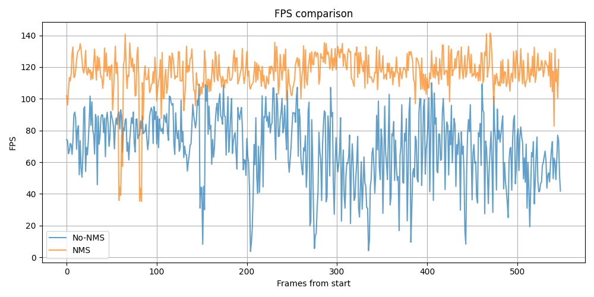
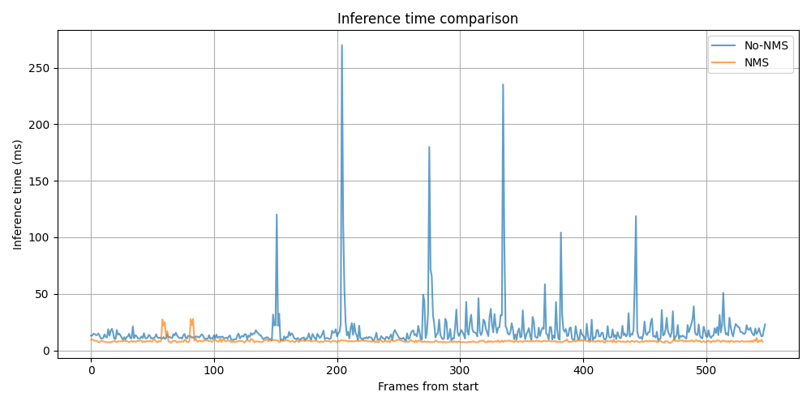
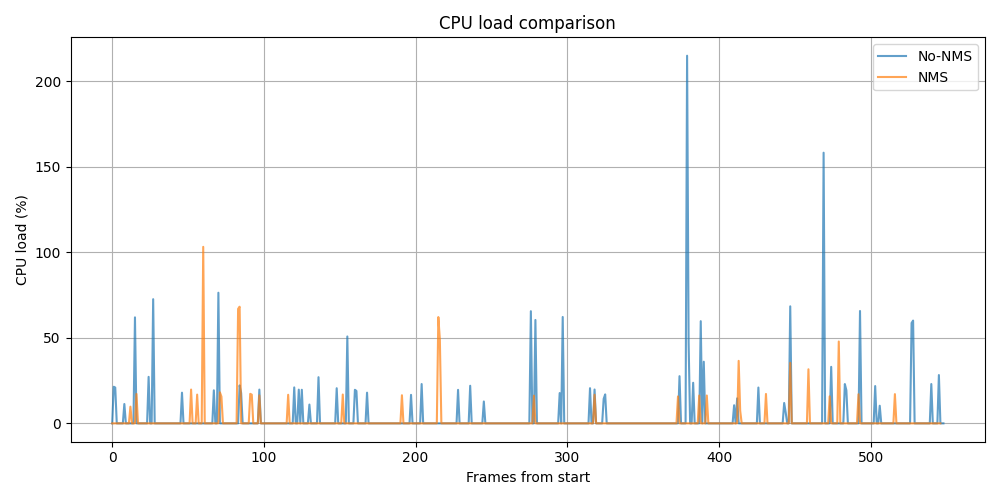
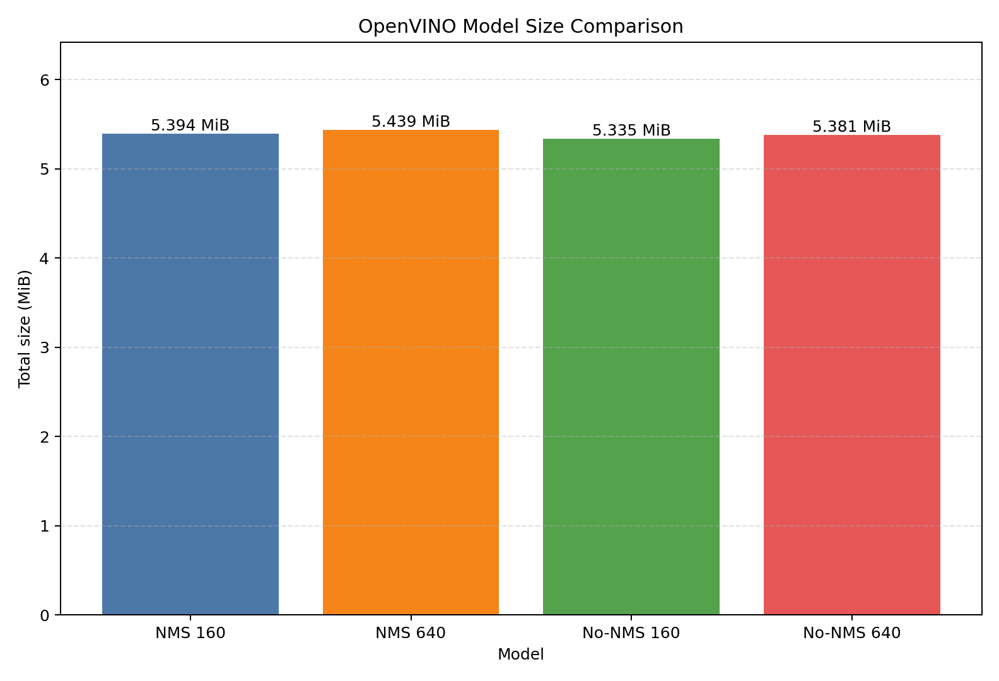

# Báo cáo công việc ngày 16/07/2026

## A. Công việc đã làm
- Bật param remove NMS khi export model OpenVINO và đánh giá các thôgn số so với none NMS 
- Chỉnh sửa code test ROI tracking tính góc từ tổng vector các anchors overlap. 
- Chạy realtime và đánh giá model NMS và No NMS 
### 1. Bật rapam remove NMS khi export model OpenVINO 
- Code sử dụng : [tools\export_openvino_fp16.py](tools\export_openvino_fp16.py)

```python
from ultralytics import YOLO

pt_model_path = os.path.join(quantized_dir, 'Soft_Angular_BCE_yolo11n.pt')
model_pt = YOLO(pt_model_path)
openvino_fp16_path = model_pt.export(
  format="openvino", 
  imgsz=640, 
  half=True, 
  nms=True)
    
```
- Lệnh chạy export static imgsz=640 model :
```bash 
python 'tools/export_openvino_fp16.py' --model 'models/YOLO11n_versions/quantized_fp16_nms/Soft_Angular_BCE_yolo11n.pt' --imgsz 640 --nms
```
- Lệnh chạy export static imgsz=160 model :
```bash
python 'tools/export_openvino_fp16.py' --model 'models/YOLO11n_versions/quantized_fp16_nms/Soft_Angular_BCE_yolo11n.pt' --imgsz 160 --nms
```

- Từ file `.xml` và OpenVINO Runtime có thể xác định input/output thực tế của các model FP16 đã export.
- các file `.xml` nhưu sau :

- [Soft_Angular_BCE_yolo11n_fp16_nms_imgsz160_openvino_model/model.xml](models/YOLO11n_versions/quantized_fp16_nms/Soft_Angular_BCE_yolo11n_fp16_nms_imgsz160_openvino_model/model.xml)
- [Soft_Angular_BCE_yolo11n_fp16_nms_imgsz640_openvino_model/model.xml](models/YOLO11n_versions/quantized_fp16_nms/Soft_Angular_BCE_yolo11n_fp16_nms_imgsz640_openvino_model/model.xml)
- [Soft_Angular_BCE_yolo11n_fp16_openvino_model/model.xml](models/YOLO11n_versions/quantized_fp16/Soft_Angular_BCE_yolo11n_fp16_openvino_model/model.xml)
- [Soft_Angular_BCE_yolo11n_fp16_openvino_model_l2s/model.xml](models/YOLO11n_versions/quantized_fp16/Soft_Angular_BCE_yolo11n_fp16_openvino_model_l2s/model.xml)

#### 1.1. Các model đã export

| Loại model | Kích thước input |
| :--- | :---: | 
| FP16 có NMS | `1 x 3 x 160 x 160` |
| FP16 có NMS | `1 x 3 x 640 x 640` |
| FP16 không NMS | `1 x 3 x 160 x 160` |
| FP16 không NMS | `1 x 3 x 640 x 640` |


#### 1.2. Output model có NMS

```text
Static 160: [1, 300, 6]
Static 640: [1, 300, 6]
```

Tensor có dạng `[batch_size, số detection tối đa,số categories thông tin mỗi detection]`. Mỗi detection gồm:

```text
[x1, y1, x2, y2, confidence, class_id]
```

- `x1, y1, x2, y2`: tọa độ bounding box.
- `confidence`: độ tin cậy của detection.
- `class_id`: class dự đoán cuối cùng.
- Tối đa `300` detection cho mỗi ảnh.
- Box confidence thấp hoặc overlap lớn đã được lọc trong graph bằng NMS.
- Output cố định, không phụ thuộc số anchor của input `160` hoặc `640`.

#### 1.3. Output model không NMS

```text
Static 160: [1, 28, 525]
Static 640: [1, 28, 8400]
```

Với bài toán có `24` class:

```text
28 = 4 giá trị bounding box + 24 class score
```

Mỗi anchor chứa 28 thông tin:

```text
[cx, cy, width, height, class_0_score, ..., class_23_score]
```

Số anchor theo kích thước input:

```text
Input 160: 20x20 + 10x10 + 5x5 = 525 anchors
Input 640: 80x80 + 40x40 + 20x20 = 8400 anchors
```

#### 1.4. So sánh NMS và không NMS

| Thuộc tính | Model có NMS | Model không NMS |
| :--- | :--- | :--- |
| Output 160 | `[1, 300, 6]` | `[1, 28, 525]` |
| Output 640 | `[1, 300, 6]` | `[1, 28, 8400]` |
| Bounding box trùng lặp | Đã lọc | Chưa lọc |
| Confidence threshold | Xử lý trong graph đã được export | Tự xử lý thuật toán ngoài model |
| `class_id/angle` | tự động lọc class bằng NMS | Tính toán từ 24 class confidence score |

- Từ output của 2 runtime sau khi export ( có NMS và không có NMS) ta suy ra được như sau :
> model **có NMS** khi chỉ cần bounding box, confidence và class cuối cùng; ưu tiên pipeline inference đơn giản.
> model **không NMS** khi cần tổng hợp vector của toàn bộ anchor overlap, custom NMS hoặc khai thác mỗi quan hệ giữa các class góc.


### 2. Chỉnh sửa code tính góc theo toàn bộ anchors overlap 
- Code chỉnh sửa : [roi_tracking_baseline_infer.py](tools/roi_tracking_baseline_infer.py)

#### 2.1. Pipeline sau khi chỉnh sửa



- Lệnh chạy model có NMS:

```bash
python tools/roi_tracking_baseline_infer.py --source 1 --mode roi --show --full-model models/YOLO11n_versions/FP16_NMS/static_640_openvino_model --tracking-model models/YOLO11n_versions/FP16_NMS/static_160_openvino_model --log log_nms.csv
```

- Lệnh chạy model không NMS:

```bash
python tools/roi_tracking_baseline_infer.py --source 1 --mode roi --show --full-model models/YOLO11n_versions/FP16_NO_NMS/static_640_openvino_model --tracking-model models/YOLO11n_versions/FP16_NO_NMS/static_160_openvino_model --conf 0.25 --topk 200 --iou 0.5 --min-mag 2.0 --log log_no_nms.csv
```

### 2.2 Chạy kiểm thửu 
- Hình ảnh thực tế kiểm thử ( khôgn có vật cản vì đang đánh giá hiệu năng, tốc độ xử lí 2 model có NMS và No NMS)



- Kết quả csv log :
  - Model có NMS : [log_nms.csv](benchmark/log_nms.csv)
  - Model không NMS : [log_no_nms.csv](benchmark/log_no_nms.csv)

- Kết quả đánh giá biểu đồ : 

#### Góc quay Leanbot — Model có NMS (`log_nms.csv`)



> Đường angle có **dạng bậc thang**  → góc nhảy theo từng bước 15° (do chỉ lấy class_id của 1 class thắng, không tổng hợp vector).


#### Góc quay Leanbot — Model không NMS (`log_no_nms.csv`)




#### So sánh hiệu năng: FPS, Inference time, CPU, Model Size









- Kích thước 4 model gần bằng nhau (~5.3–5.4 MiB): việc bật/tắt NMS khi export **không ảnh hưởng đáng kể đến dung lượng file** vì trọng số mạng FP16 là như nhau, chỉ khác phần graph hậu xử lý NMS được nhúng vào.

#### Nhận xét tổng quan

| Tiêu chí | Model có NMS | Model không NMS |
| :--- | :---: | :---: |
| FPS trung bình | ~120 FPS | ~80 FPS |
| Inference time | ~8 ms (ổn định) | ~15 ms (có đỉnh nhảy đột biến) |
| CPU load | Thấp hơn | Cao hơn |
| Góc tính được | Bậc thang 15° | Mịn, liên tục |
| Độ chính xác góc | Thấp hơn | Cao hơn |

- Model **có NMS** nhanh hơn ~50% FPS và inference time ổn định hơn, phù hợp khi ưu tiên tốc độ.
- Model **không NMS** cho góc mịn và chính xác hơn do tổng hợp vector toàn bộ anchors overlap, phù hợp khi cần đo góc chính xác.
- Đỉnh đột biến inference time của No-NMS xuất hiện do IoU grouping + pandas phải xử lý nhiều anchors hơn khi cần tính toán , gom nhóm anchors . 

## B. Khó khăn 
- Không 
## C. Công việc tiếp theo 
- Em xin phép nhận hướng đi tiếp theo từ Thầy ạ .