# Báo cáo công việc ngày 17/07/2026

## A. Công việc đã làm
- Thu thập thêm ảnh nền, không có Leanbot 

### 1. Thu thập thêm ảnh nhiễu không có Leanbot 
- Bối cảnh thu thập thêm ảnh : 
    - Vẫn là ảnh sa bàn 
    - Thêm các khối gỗ màu gây nhiễu ( có đỏ và cam , đặt ở nhiều góc độ, tình trạng ngẫu nhiên)
    - Đặt thêm các linh kiện rời vào sa bàn ( PCB LbBase, LbSide, SRF-05, bánh xe, servo, stepper, gripper, JDY-33, LbStepper, Arduino Nano) 
    - Vì các linh kiện đỏ dễ nhầm sang Leanbot hơn nên em đã ưu tiên đặt các vật màu đỏ vào để chụp ạ.

- Thông tin bộ dataset hiện tại 

| Số class | Số ảnh mỗi class | Tổng lượng ảnh | Ảnh nhiễu nền đã chụp |
|:---:|:---:|:---:|:---:|
| 24 | 5 | 120 | 30 |

- Theo như thôgn tin khuyến nghị của [Ultralytics - tips for best training results](https://docs.ultralytics.com/yolov5/tutorials/tips-for-best-training-results#model-selection) thì họ bảo ảnh backgroud nền nên chiếm khoảng `0~10%` tổng lượng ảnh trong dataset, nên em chụp 30 ảnh ạ . 
> *Background images. Background images are images with no objects that are added to a dataset to reduce False Positives (FP). We recommend about 0-10% background images to help reduce FPs (COCO has 1000 background images for reference, 1% of the total). No labels are required for background images*.

- Folder ảnh chụp thêm : [`no_leanbot/backgrounds`](raw_image/no_leanbot/backgrounds)
- Các ảnh chụp thêm như sau:

|  |  |
|:---:|:---:|
|  |  |
|  |  |
|  |  |
|  |  |
|  |  |
|  |  |
| 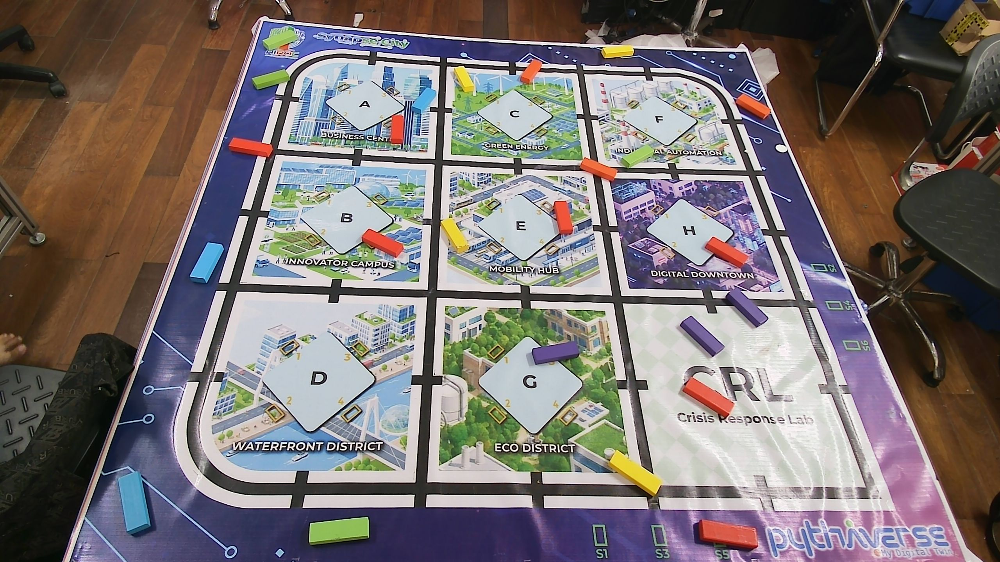 | 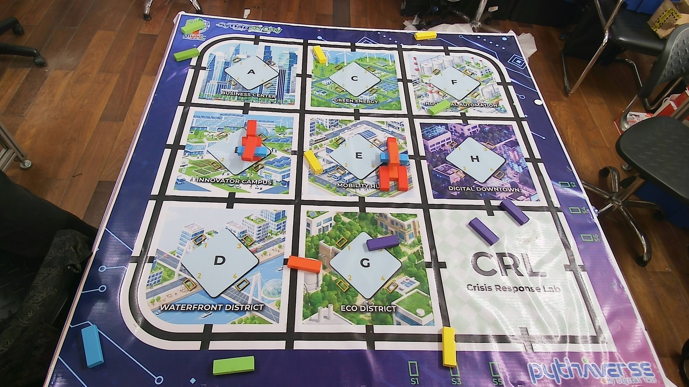 |
| 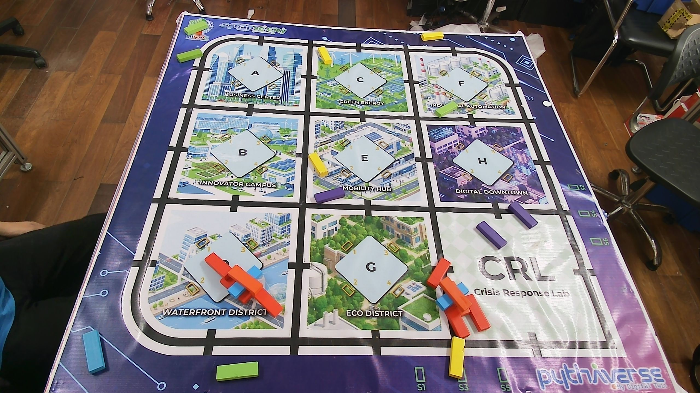 | 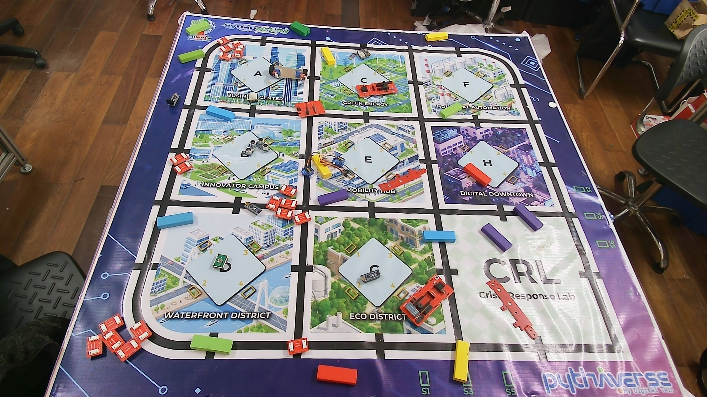 |
| 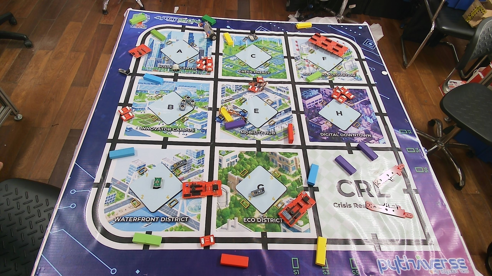 | 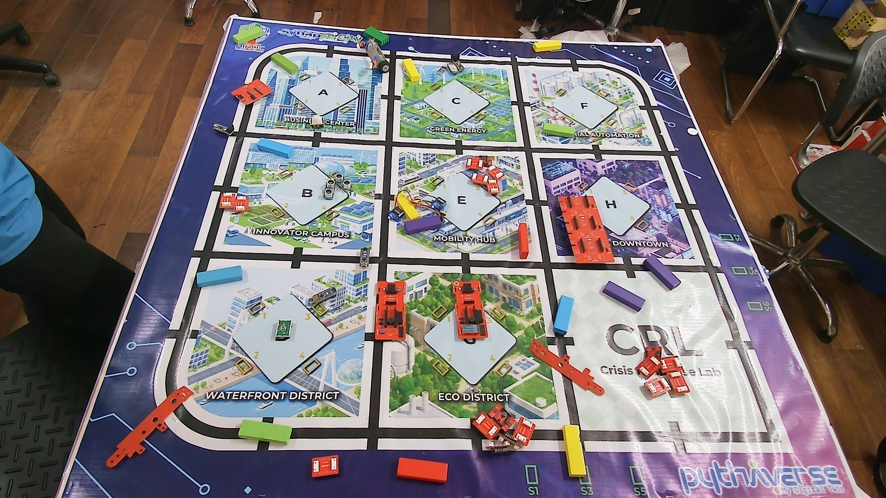 |
|  | 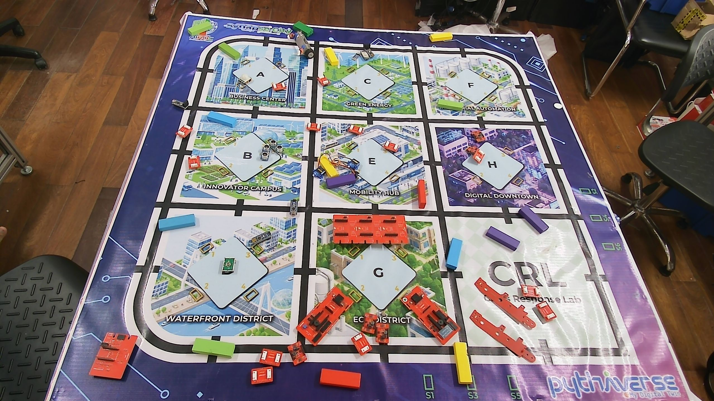 |
| 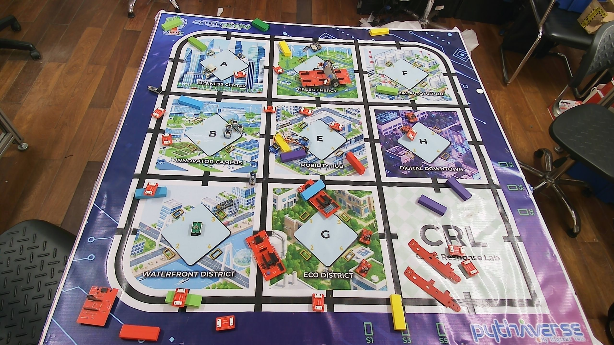 | 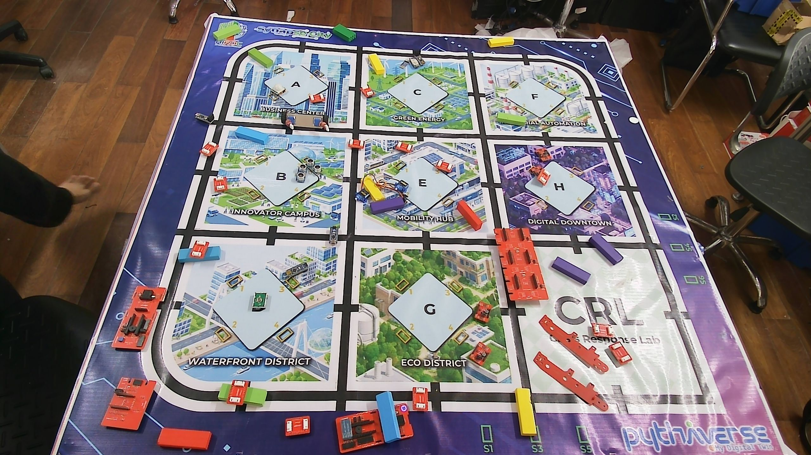 |
|  | 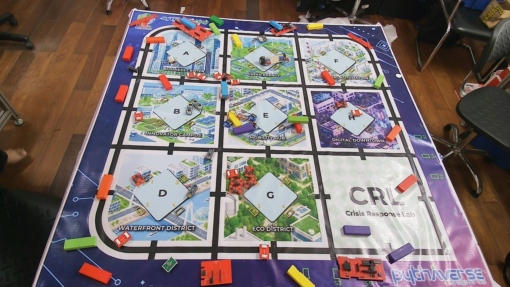 |
| 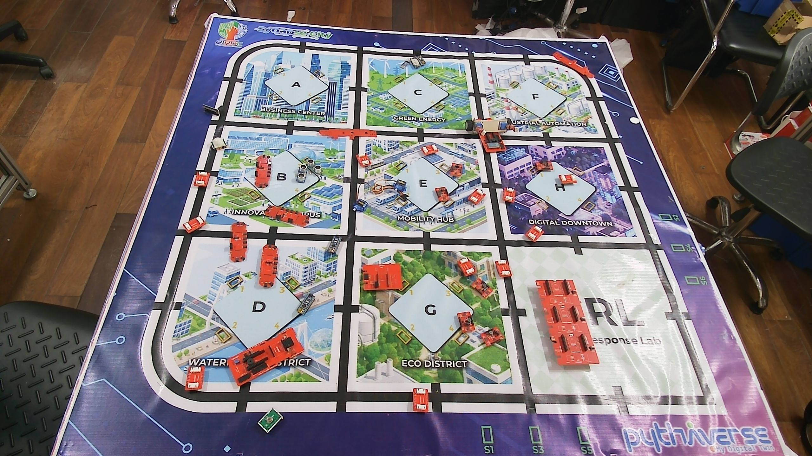 |  |
| 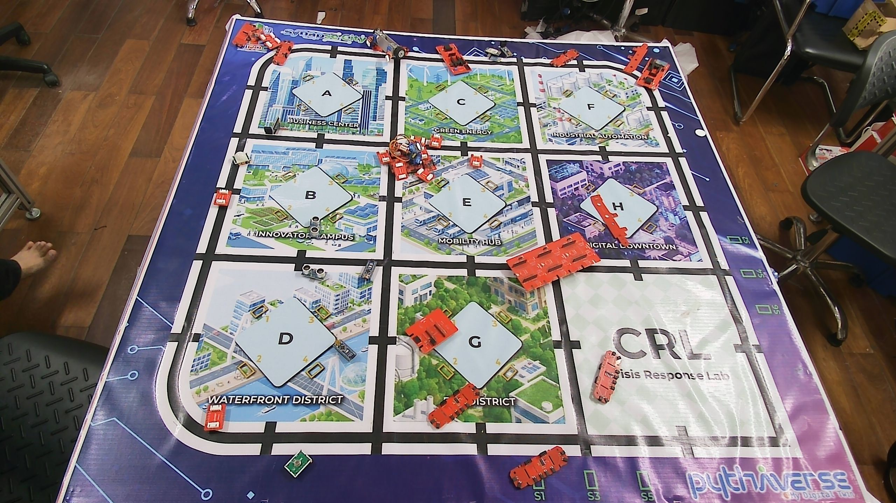 | 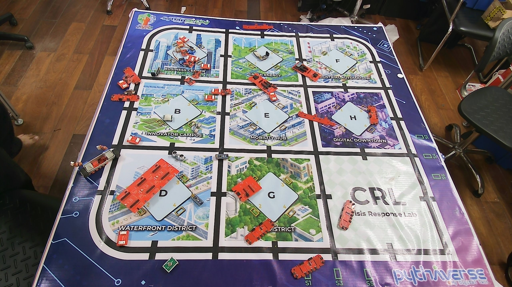 |
| 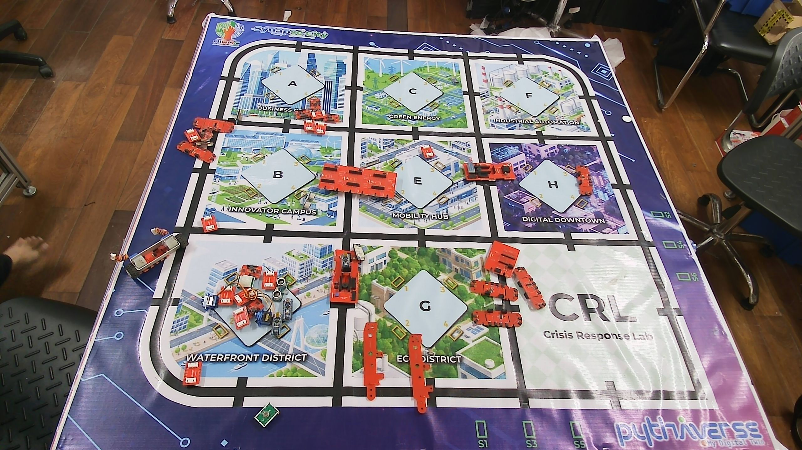 | 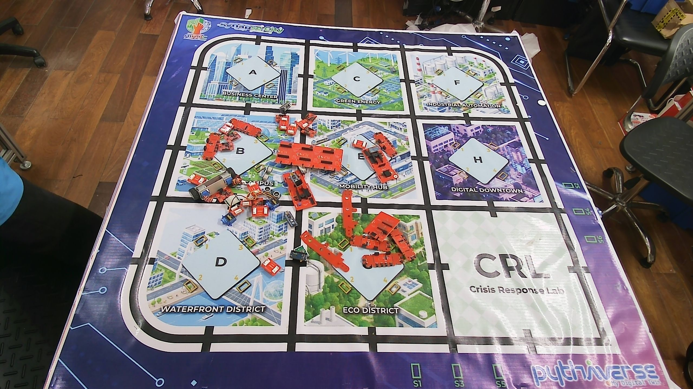 |
## B. Khó khăn 
- Không
## C. Công việc tiếp theo 
- Chờ xác nhận ảnh nền từ Thầy để finetune lại Model 